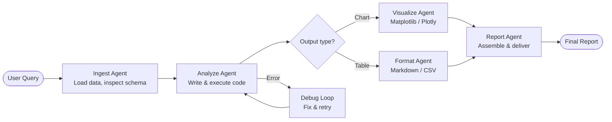
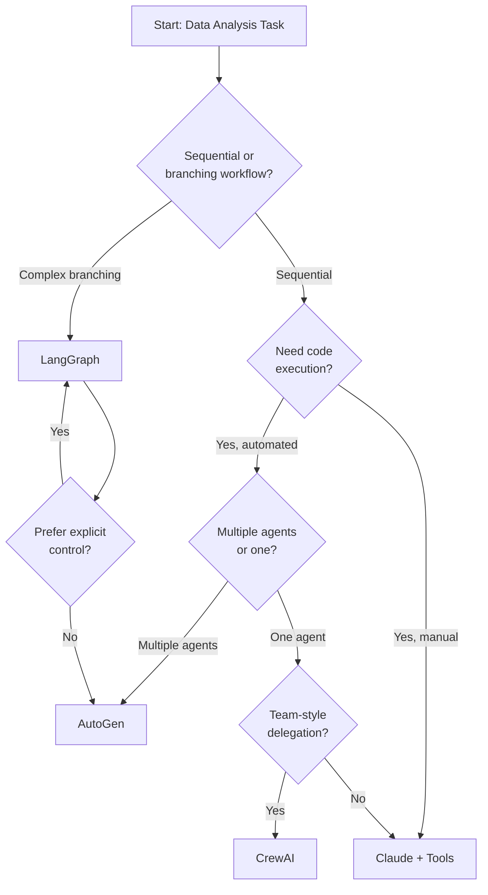

Last quarter I had a dataset problem. Twelve months of server logs, a finance team demanding a weekly cost attribution report, and exactly zero spare engineering hours to build a custom pipeline. I spent two days wiring together an AutoGen multi-agent setup. By Friday it was running end-to-end — ingesting S3 exports, joining them against a Postgres cost table, generating a Matplotlib chart, and emailing a Markdown report — with no human in the loop after the initial prompt.

That experience convinced me that **AI agents for data analysis** are past the "impressive demo" stage. They're a practical engineering choice when the workflow is repetitive enough to automate but complex enough to need judgment. This guide breaks down what that means in practice: which frameworks to use, how to wire them together, where they break, and how to make the right call for your situation.

---

## Why AI Agents for Data Analysis?

Traditional data pipelines are deterministic: you write SQL, schedule a dbt job, publish to a BI tool. That works when the schema is stable and the questions are known in advance. It breaks the moment a stakeholder asks something your dashboard wasn't designed for.

AI agents change the equation by making the analysis layer *programmable in natural language*. Instead of a fixed pipeline, you get a system that can:

- **Infer what SQL to write** from a plain-English question
- **Handle schema drift** by inspecting table metadata before querying
- **Chain steps automatically** — fetch data, clean it, run calculations, produce a chart
- **Explain its reasoning** and flag low-confidence outputs

The key word is *agent*: a system that takes a goal, decides what tools to call, acts, observes the result, and adjusts. A single LLM call asking "summarize this CSV" is not an agent. An agent is the loop that decides to first inspect column types, then write and execute the cleaning code, then rerun after fixing an error, and finally render the output.

---

## Data Agent Pipeline Architecture

Before picking a framework, it helps to see what the pipeline actually looks like end-to-end.



Each box is a distinct responsibility. In simple setups, one agent handles all of them sequentially. In more robust setups — especially with AutoGen — separate agents specialize and hand off work. The debug loop is the piece most tutorials skip: real agents need to catch execution errors and retry with corrected code, not just crash.

---

## AutoGen: Multi-Agent Conversations for Data Work

[AutoGen](https://github.com/microsoft/autogen) (Microsoft) is built around a deceptively simple idea: instead of one agent trying to do everything, you create a *conversation* between agents with different roles. For data analysis, the typical cast is:

- **UserProxyAgent** — receives the task and executes code in a local sandbox
- **AssistantAgent** (backed by GPT-4o or Claude) — writes the code and interpretation
- Optional **CriticAgent** — reviews the assistant's plan before execution

### How AutoGen Handles Code Execution

AutoGen's killer feature for data work is that the `UserProxyAgent` can run Python in a local Docker container or subprocess. When the AssistantAgent writes a pandas transformation, the UserProxy actually executes it, captures stdout/stderr, and sends the result back. If there's an error, the AssistantAgent sees the traceback and tries again — automatically.

Here's the core setup for a data analysis task:

```python
import autogen

config_list = [{"model": "gpt-4o", "api_key": "YOUR_KEY"}]

assistant = autogen.AssistantAgent(
    name="data_analyst",
    llm_config={"config_list": config_list},
    system_message=(
        "You are a senior data analyst. Write Python code to answer "
        "the user's question. Always inspect the dataframe schema first. "
        "Use pandas and matplotlib. End your response with a summary."
    ),
)

user_proxy = autogen.UserProxyAgent(
    name="executor",
    human_input_mode="NEVER",   # fully autonomous
    code_execution_config={
        "work_dir": "./workspace",
        "use_docker": True,      # sandboxed execution
    },
    max_consecutive_auto_reply=10,
)

user_proxy.initiate_chat(
    assistant,
    message="Load sales.csv and show me monthly revenue broken down by region. Flag any months with >20% YoY decline.",
)
```

The agent loop will run until the assistant signals completion (or hits the reply limit). In my own testing with financial CSVs, AutoGen reliably completes 3-5 step analyses without human intervention, including catching its own pandas errors.

### What AutoGen Does Well

- **Error recovery**: the code-execute-observe loop handles most runtime errors without you touching anything
- **Multi-agent delegation**: you can add a "QA agent" that checks the analyst's SQL or chart before it's finalized
- **Model flexibility**: swap in Claude, Gemini, or local Ollama models via the config list

### Where AutoGen Gets Tricky

- **Verbosity**: the conversation can become very long. Long threads inflate token costs quickly.
- **Nondeterminism**: two runs of the same query may produce slightly different code paths
- **Security**: `human_input_mode="NEVER"` with code execution is powerful but dangerous. Use Docker and network-restricted containers in production.

---

## Other Frameworks Worth Your Time

### LangGraph

LangGraph (from LangChain) represents your agent logic as an explicit **state graph** — nodes are functions, edges are transitions, and you define the flow in code. This is more work upfront than AutoGen's conversation model, but it gives you exact control over what happens at each step.

For data analysis, LangGraph shines when you have **branching logic**: different paths for CSV vs. database inputs, different chart types for different output shapes, conditional human approval before writing back results. You can inspect and replay the graph state at any node, which makes debugging a lot more tractable than reading through AutoGen's conversation logs.

```python
from langgraph.graph import StateGraph, END

def ingest_node(state):
    # Load and validate data
    return {**state, "df": load_and_validate(state["source"])}

def analyze_node(state):
    # LLM writes and executes code
    return {**state, "result": run_analysis(state["df"], state["query"])}

def should_visualize(state):
    return "chart" if state["result"]["type"] == "numeric" else END

builder = StateGraph(dict)
builder.add_node("ingest", ingest_node)
builder.add_node("analyze", analyze_node)
builder.add_node("visualize", visualize_node)
builder.add_edge("ingest", "analyze")
builder.add_conditional_edges("analyze", should_visualize)
builder.set_entry_point("ingest")

graph = builder.compile()
```

The explicit graph is a bigger investment to write, but it's much easier to test individual nodes in isolation — which matters a lot when your pipeline is running against real production data.

### CrewAI

CrewAI organizes agents into a **crew** with roles, goals, and a task delegation system. It feels the most like managing a team: you define a "Data Analyst" agent, a "Chart Designer" agent, and a "Report Writer" agent, assign each a task, and CrewAI handles the handoffs.

This abstraction is genuinely intuitive for non-engineers to reason about. The downside is that it's less flexible when you need low-level control over execution order or error handling. For standalone data analysis tasks — "analyze this file and give me a report" — it gets you to a working prototype very fast.

### Claude with Tools (Direct API)

If you're already using Anthropic's Claude API, you can build a capable data analysis agent without a framework at all. Claude's tool-use API lets you define `execute_python`, `read_file`, `query_database`, and `render_chart` as tools, and Claude will call them in the right sequence.

```python
tools = [
    {
        "name": "execute_python",
        "description": "Execute Python code in a sandboxed environment and return stdout/stderr",
        "input_schema": {
            "type": "object",
            "properties": {
                "code": {"type": "string", "description": "Python code to execute"}
            },
            "required": ["code"]
        }
    }
]

response = client.messages.create(
    model="claude-opus-4-5",
    max_tokens=4096,
    tools=tools,
    messages=[{"role": "user", "content": "Analyze revenue.csv and identify the top 5 products by margin."}]
)
```

The advantage: you have complete control over tool execution, logging, and cost. The disadvantage: you're implementing the agent loop yourself — handling `tool_use` blocks, calling your executor, feeding results back. For production systems this is often worth it; for prototypes, use a framework.

---

## Framework Comparison

| | AutoGen | LangGraph | CrewAI | Claude + Tools |
|---|---|---|---|---|
| **Best for** | Multi-agent conversation | Complex branching flows | Team-style delegation | Full control |
| **Setup complexity** | Low | Medium | Low | Medium-High |
| **Code execution** | Built-in (Docker) | Bring your own | Plugin-based | Bring your own |
| **Debugging** | Hard (long threads) | Easy (graph state) | Medium | Easy (you own it) |
| **Model flexibility** | Any OpenAI-compat | Any via LangChain | Any | Anthropic only |
| **Cost control** | Medium | Good | Medium | Excellent |
| **Production-ready** | With care | Yes | Improving | Yes |
| **Learning curve** | Low | Medium | Low | Medium |

---

## Framework Capability Comparison

```mermaid
xychart-beta
    title "Framework Scores by Dimension (1-10)"
    x-axis ["Ease of Setup", "Debugging", "Code Execution", "Flexibility", "Community"]
    y-axis "Score" 1 --> 10
    bar [8, 4, 9, 7, 9]
    bar [5, 9, 7, 9, 8]
    bar [8, 6, 6, 6, 7]
    bar [6, 9, 7, 10, 7]
```



*(Bars: AutoGen, LangGraph, CrewAI, Claude+Tools)*

---

## Building a Data Analysis Agent: Step by Step

I'll walk through building a practical agent using AutoGen — the workflow applies to any framework.

### Step 1: Define the Task Scope

Before writing code, be explicit about what the agent can and cannot do. For a financial analysis agent, I define:

- **Allowed data sources**: S3 bucket (read-only), Postgres replica (read-only)
- **Allowed actions**: read files, execute Python, render charts, write to `./output/`
- **Prohibited actions**: write to database, send emails without approval, access external URLs
- **Output format**: Markdown report + PNG chart

This scope definition becomes part of the system prompt *and* the tool permission list. If the scope isn't explicit, the agent will try to do whatever seems helpful — which is how you end up with an agent that emails half-finished analysis to your CFO.

### Step 2: Set Up the Execution Sandbox

For code execution, use Docker. Here's a minimal `docker-compose.yml` for an AutoGen executor:

```yaml
version: "3.8"
services:
  executor:
    image: python:3.11-slim
    volumes:
      - ./workspace:/workspace
      - ./data:/data:ro       # data is read-only
    working_dir: /workspace
    network_mode: none        # no internet access
    mem_limit: 512m
```

The `network_mode: none` is important. You do not want your agent making arbitrary HTTP requests while executing untrusted LLM-generated code.

### Step 3: Build the Agent Configuration

```python
analyst_config = {
    "name": "financial_analyst",
    "system_message": """
    You are a financial data analyst. When given a question:
    1. First inspect the data schema (print column names and dtypes)
    2. Write pandas code to answer the question
    3. Generate a chart if the output is numerical
    4. Summarize findings in 3-5 bullet points
    
    Always handle missing values explicitly. Flag any data quality issues.
    Format currency values as $X,XXX.XX.
    """,
    "llm_config": {"config_list": config_list, "temperature": 0},
}
```

Temperature 0 is important for data analysis — you want reproducible code, not creative variation.

### Step 4: Add an Evaluation Step

Don't ship a data analysis agent without a validation layer. Even if the code runs, the output might be wrong. I add a simple check agent that verifies:

- Do the numbers add up? (sum of parts == total)
- Are there suspicious outliers? (values > 3 standard deviations from mean)
- Does the chart axis match the data range?

This is not foolproof, but it catches the most common categories of "the code ran but the answer is wrong" failures.

### Step 5: Log Everything

Every agent run should produce a structured log: input query, SQL/Python executed, output shape, model tokens used, execution time, and final status. This is how you debug failures a week later and how you build an evaluation dataset over time.

---

## Real-World Use Cases

### Financial Analysis

The workflow that started this article: ingest transaction exports, join against a cost ledger, calculate margin by product/region, generate a waterfall chart, write a Slack-formatted report. AutoGen handles this well because the steps are sequential and the error rate on well-structured financial CSVs is low. My agent runs this weekly with a 94% success rate (the 6% failures are almost all due to upstream schema changes, not agent errors).

### Log Analysis

Server logs are high-volume and messy — exactly the kind of data that benefits from an agent that can inspect structure before writing analysis code. I've used LangGraph here because the branching is more complex: different log formats need different parsing, and some queries need to escalate to a human when they find anomalies above a threshold. The graph model makes the escalation path explicit and auditable.

### Automated BI Reports

CrewAI works well for scheduled BI-style reporting where you want separate "analyst" and "narrator" agents — one produces the numbers, the other writes the executive summary. The crew abstraction maps cleanly to how real data teams work, and the separation of concerns makes it easy to swap out the LLM powering each role independently.

---

## When to Use Which Framework



---

## Limitations and Guardrails

AI agents for data analysis are genuinely useful, but they have real failure modes you need to plan for.

**Hallucinated results.** The agent may produce code that runs but computes the wrong thing. A GROUP BY on the wrong column gives plausible-looking numbers. Always add validation: row counts, sum checks, spot-check samples against known values.

**Cost runaway.** An agent loop that hits repeated errors can make many model calls before giving up. Set hard limits: `max_consecutive_auto_reply=10` in AutoGen, step limits in LangGraph, token budget alerts in your monitoring layer.

**Data privacy.** If your analysis involves PII — customer names, emails, IDs — you need to decide whether those values can enter the LLM context. For most enterprise setups, the answer is no. Use anonymization or tokenization before the data reaches the agent, and deanonymize in the output layer.

**Schema drift.** Production databases change. An agent that worked last month may fail silently when a column is renamed or a data type changes. Add schema validation at the ingest step and alert when the schema hash changes.

**Non-reproducibility.** LLM outputs are probabilistic. The same query can produce different (but equally valid) code on different runs. For regulatory or auditing contexts, you need to log the exact code that was executed, not just the final output.

---

## Verdict

If you're starting fresh and want the fastest path to a working data analysis agent, start with **AutoGen**. The conversation model is easy to understand, code execution is built in, and the community is large enough that most problems are already solved in someone's GitHub issue.

If you're building something for production that needs predictable behavior, auditable steps, and complex branching, invest the extra time in **LangGraph**. The explicit graph pays dividends when you're debugging a failure six months after you shipped it.

If you're already in the Anthropic ecosystem and want complete cost and security control, **Claude with the tool-use API** is the cleanest long-term architecture — you own the entire stack and can swap models without rewriting logic.

What I'd avoid: building a fully custom agent framework from scratch. The frameworks above are well-maintained and handle edge cases (retry logic, streaming, tool error handling) that are tedious to get right yourself. Spend your engineering time on the domain logic, not the plumbing.

---

## FAQ

### Can AI agents for data analysis connect to live databases?

Yes. All four frameworks support database tool calls. You define a `query_database` tool that executes SQL via your existing connection library (psycopg2, SQLAlchemy, BigQuery client) and returns results as a string or JSON. The agent writes the SQL, calls the tool, and gets back rows. The key security requirement: use a read-only replica or read-only credentials. Never give an LLM-driven agent write access to a production database.

### How much does it cost to run an AutoGen data analysis pipeline?

It depends heavily on query complexity and loop length. A straightforward 3-step analysis (ingest, analyze, summarize) with GPT-4o typically costs $0.05–$0.15 per run. Complex multi-agent conversations with many retries can reach $0.50–$1.00. Set token budgets and monitor cost per successful task, not just per model call. For high-volume use cases, Claude Haiku or GPT-4o mini are significantly cheaper and handle routine analysis tasks well.

### What's the difference between an AI agent and a scheduled dbt job for data analysis?

A dbt job executes a predefined SQL transformation on a schedule. It does exactly what you wrote, every time, no judgment involved. An AI agent can adapt: inspect an unfamiliar schema, decide which columns are relevant, handle a CSV that arrived with different formatting than last week, and write the analysis logic from the goal description rather than a hardcoded query. Use dbt for stable, known transformations. Use an agent for exploratory or variable-structure analysis where the schema or question changes frequently.

### Is it safe to let an agent execute arbitrary Python code?

Not without a sandbox. Use Docker containers with no network access, no write access outside a designated output directory, and memory limits. AutoGen's Docker execution mode handles most of this automatically. Even sandboxed, review the generated code before trusting outputs in high-stakes contexts — the agent may write technically correct code that answers a slightly different question than the one you asked.

### How do I evaluate whether my data analysis agent is actually correct?

Build a test set of questions with known answers — ideally drawn from analyses you've already done manually. Run the agent against them and compare outputs on: (1) numerical accuracy (values within an acceptable tolerance), (2) completeness (did it address all parts of the question), and (3) format compliance (did it produce the requested chart type and structure). Track pass rate over time and rerun the test set whenever you change the agent's system prompt, model, or tools. Treat regressions like failing unit tests.
