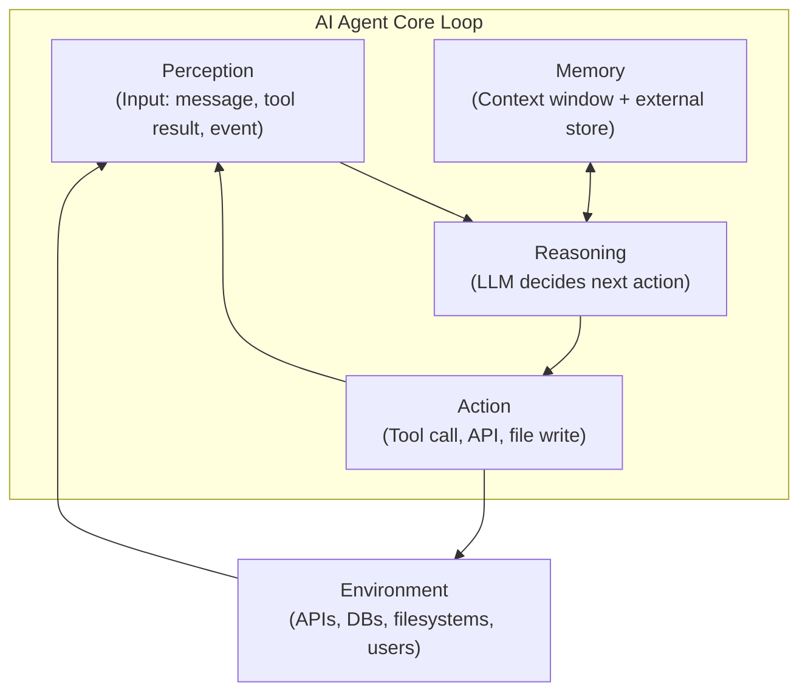
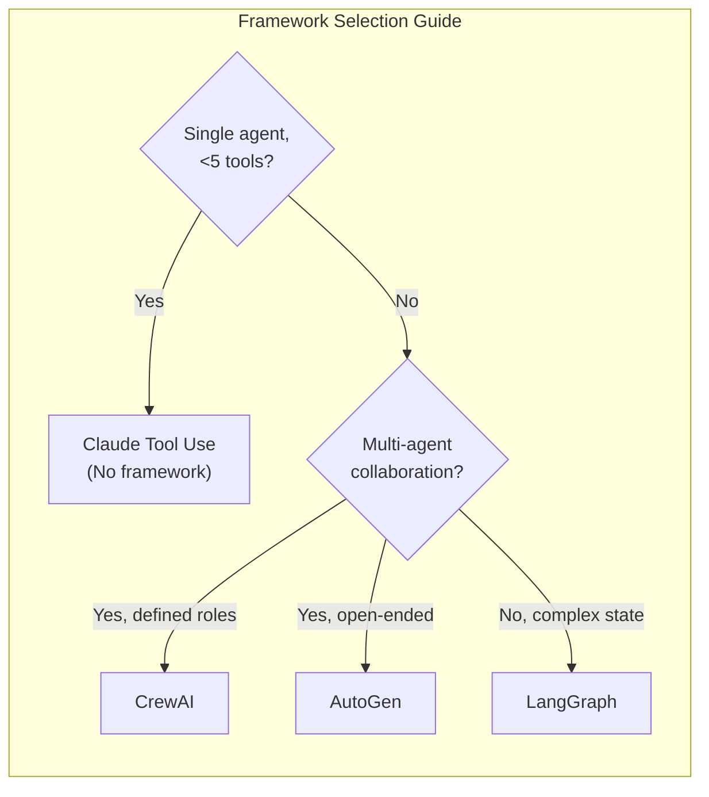
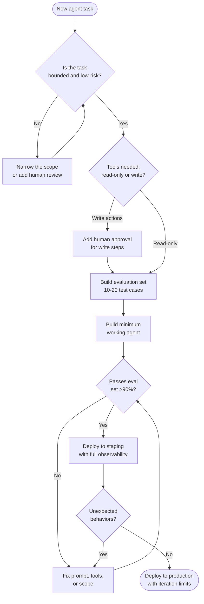

Two years ago, an "AI agent" was mostly a demo. A language model calling a calculator API, presented on stage as proof of concept. Today I'm running agents in production that autonomously file GitHub issues, triage customer tickets, and execute multi-step data pipelines with conditional branching — and they're doing it reliably enough that the team trusts the output without babysitting every run.

This guide is the one I wish I'd had before I built my first agent. It covers architecture, the major frameworks, safety patterns that actually work, and the mistakes I've watched teams repeat over and over. Whether you're evaluating agents for the first time or ready to move from prototype to production, this is where I'd start.

## What Are AI Agents?

An AI agent is a system that perceives its environment, reasons about what to do, takes actions through tools, and uses memory to persist state across steps. Unlike a single model call — input in, output out — an agent runs a loop. It checks the result of each action and decides what to do next, continuing until the task is complete or it hits a stop condition.

The key distinction from a simple chatbot or chain is **autonomy over multiple steps**. A chatbot answers a question. An agent might answer a question, discover it needs more information, call a search tool, synthesize the results, write a file, and then verify the file looks correct — all without human input at each step.

### Key Components

Every practical agent architecture shares four components:

- **Perception** — how the agent receives input. This could be a user message, a file, a sensor reading, an API response, or output from a previous agent in a pipeline.
- **Reasoning** — the language model (or models) that decides what action to take next, given the current state and history.
- **Action** — the tools the agent can call. Web search, code execution, database queries, file I/O, API calls, spawning sub-agents. The action space defines what the agent can and cannot do.
- **Memory** — how state persists. Short-term memory lives in the context window. Long-term memory lives in a vector store, database, or key-value store that the agent retrieves from across sessions.

This loop runs until a termination condition is met — either the task is done, the agent determines it cannot proceed, or a safety guardrail stops it.

## Types of AI Agents

Not all agents are built the same. The architecture you choose should match the complexity and risk profile of the task.

### Reactive Agents

Reactive agents don't plan. They map the current perception directly to an action based on predefined rules or a single model call. Think of a customer support bot that routes a ticket to the right queue based on the message content. There's no multi-step reasoning, no memory across turns — just stimulus to response.

Reactive agents are fast, cheap, and easy to test. They're the right choice when the task is well-defined and the number of possible inputs is bounded.

### Deliberative Agents

Deliberative agents reason before acting. They maintain an internal model of the world, formulate a plan, and execute steps in sequence. A coding agent that reads an issue, designs a fix, writes the code, runs the tests, and commits only if tests pass is deliberative.

The reasoning loop introduces latency and cost, but also the ability to handle ambiguous or novel situations. Most production agents you'll build in 2026 are deliberative.

### Autonomous Multi-Agent Systems

Here multiple agents collaborate. A "manager" agent breaks a task into sub-tasks, delegates to specialist agents (a researcher, a writer, a validator), and synthesizes results. This is where frameworks like CrewAI and AutoGen shine, and also where things go wrong the fastest.

Autonomous systems can tackle complex, long-horizon tasks but they multiply failure modes. Every hop between agents is a point where errors compound. I use multi-agent systems only when a single agent genuinely can't hold the full task in context or when parallelism matters for speed.

## Key Frameworks in 2026

The framework landscape has matured considerably. Here's what I actually use and recommend.

### LangGraph

LangGraph (from LangChain) treats an agent as a directed graph. Nodes are functions or model calls; edges are transitions. The graph can have cycles — that's what makes it an agent instead of a pipeline.

What I like: explicit state management, built-in persistence (you can resume a paused graph), and fine-grained control over the execution flow. You define exactly when the model decides vs. when code decides. This makes debugging tractable and makes it possible to add human-in-the-loop approval at specific nodes.

What to watch out for: the graph abstraction adds boilerplate. For simple agents, it can feel like using a bulldozer to plant a seed.

### CrewAI

CrewAI is opinionated about multi-agent workflows. You define "agents" with roles, goals, and backstories, and "tasks" that get assigned to agents. A "crew" orchestrates who does what and in what order.

The role-playing approach sounds gimmicky but works surprisingly well for tasks that benefit from diverse reasoning perspectives — a "security reviewer" agent genuinely catches different issues than a "code quality" agent given the same codebase. The framework handles inter-agent communication, context passing, and output formatting.

CrewAI is my first recommendation for teams building content pipelines, research workflows, or any task that maps naturally to "different people doing different jobs."

### AutoGen (Microsoft)

AutoGen takes a conversational approach. Agents communicate by sending messages to each other in a group chat. The orchestration emerges from the conversation rather than being explicitly programmed.

This is powerful for open-ended tasks where you don't know in advance what the agent will need to do. It's harder to make predictable and harder to debug. I've used AutoGen for exploratory research tasks where I wanted the agents to surprise me; I haven't used it for anything customer-facing.

### Claude Tool Use

If you're building on the Anthropic API, Claude's native tool use is often the best starting point — no framework required. You define tools as JSON schemas, Claude decides when to call them, and you handle the execution in your code. This gives you full control over the action layer with zero framework overhead.

For an agent with fewer than five tools and a single loop, I'll skip a framework entirely and wire Claude's tool use directly. The code is simpler, the traces are easier to read, and there are no framework abstractions to debug. Once the complexity grows — multiple agents, complex state, conditional routing — I reach for LangGraph.

## Building Your First Agent: Step-by-Step Concepts

Before you reach for a framework, understand what you're actually building. Here's the conceptual sequence I walk through with every new agent.

**Step 1: Define the task boundary.** What does the agent do, and what is explicitly out of scope? An agent that "helps with customer support" is too vague. An agent that "reads incoming support tickets, classifies them by product area, and drafts a first response using the knowledge base" is specific enough to implement and evaluate.

**Step 2: Map the tools.** List every external system the agent will touch. For each tool, document the input schema, expected output, error modes, and — critically — whether the action is reversible. Sending an email is not reversible. Querying a database is. This list becomes your risk register.

**Step 3: Design the loop.** Draw the agent's decision loop on paper before writing code. When does the agent call a tool vs. return an answer? What happens if a tool call fails? What is the maximum number of iterations? The loop design should be explicit, not emergent from model behavior.

**Step 4: Add memory.** Decide what the agent needs to remember and for how long. Within a session, the context window handles it. Across sessions, you need an external store. Be conservative: retrieve only what's needed for the current step.

**Step 5: Write the system prompt.** The system prompt is architecture, not decoration. It should define the agent's role, its tools, its decision rules, and its stop conditions. A weak system prompt produces an agent that drifts; a strong one produces an agent that knows what it is and what it will refuse to do.

**Step 6: Build the evaluation set.** Before you deploy anything, create 10-20 representative test cases. Include happy paths, edge cases, and adversarial inputs. Run every version of the agent against this set. If a change improves benchmark performance but breaks two test cases, it's not ready.

## Real-World Applications

I've either built or audited agents in these categories. Here's what actually works.

**Code review automation.** An agent reads a PR diff, checks it against a style guide and architecture decision record, runs a security scan tool, and posts a structured review comment. This works well because the task is bounded, the tools are read-only (mostly), and the output is reviewed by a human before it causes any action. Teams I've seen deploy this report 30-40% faster first-pass review cycles.

**Research and synthesis.** An agent searches the web, reads papers or documentation pages, deduplicates findings, and produces a structured summary with citations. The risk is low (no write actions), the value is high, and it's easy to evaluate output quality. This is where I'd tell any team to start.

**Customer support triage.** An agent reads a ticket, retrieves relevant knowledge base articles, classifies urgency and topic, and either auto-responds (for known issues) or routes to the right queue with a summary. The key to making this work is a tight escalation path: the agent should escalate whenever confidence is below threshold, and the threshold should be set conservatively.

**Data pipeline monitoring.** An agent watches for anomalies in pipeline metrics, queries logs when something looks wrong, diagnoses the root cause using a runbook embedded in the system prompt, and either auto-remedies (for known issues) or pages an on-call engineer with a diagnosis. This requires careful tool permissioning — write access to infrastructure is high-stakes.

**Content generation pipelines.** A researcher agent gathers information, a writer agent drafts sections, an editor agent checks for consistency and factual errors, a formatter agent applies style rules. CrewAI is well-suited to this pattern, and the parallelism between independent sections makes it meaningfully faster than a single-threaded chain.

## Agent Safety and Guardrails

This is the section I spend the most time on with teams, because skipping it creates real problems.

**Principle of least privilege.** Give the agent only the tools it needs for the specific task. An agent that summarizes documents doesn't need write access to the database. Every tool you add is a surface area for unintended behavior. Start with read-only tools and add write access only when you've validated the agent's decision-making on that tool in a staging environment.

**Human-in-the-loop for high-stakes actions.** Any action that is difficult or impossible to reverse — sending emails, modifying production data, making purchases, deploying code — should require explicit human approval. LangGraph makes this easy with interrupt nodes. Build the approval step into the graph before you need it.

**Output validation.** Don't pass raw model output to the next step without validation. If the agent is supposed to return a JSON object, check the schema. If it's supposed to produce a SQL query, run it in a read-only sandbox first. Structured output with schema validation catches a large class of failure modes before they propagate.

**Token budget and iteration limits.** Set a maximum number of loop iterations and a token budget per run. An agent that loops forever is a runaway process. Most tasks should complete in under 10 iterations; set the limit at 20 and alert if you see agents regularly approaching it.

**Prompt injection defense.** If your agent processes external content — web pages, user messages, documents from untrusted sources — it can be manipulated into taking unintended actions by content that looks like system instructions. Sanitize external inputs, separate user-controlled content from agent instructions structurally (not just in the prompt), and test explicitly for injection attempts.

## Common Pitfalls

These are the mistakes I've either made myself or watched teams make.

**Building complexity before you have a baseline.** The first agent should be simple enough that you can fully understand every failure. Multi-agent, parallel, memory-augmented systems are hard to debug. Start with one agent, five tools, no external memory, and get it to work reliably. Then add complexity incrementally with measurement.

**Trusting the agent's self-report.** Agents will tell you they've completed a task confidently even when they haven't. Never use the agent's own summary as your evaluation signal. Check the actual output against the actual goal.

**Underspecifying the system prompt.** "You are a helpful assistant" is not a system prompt for an agent. The system prompt needs to define the agent's role, the available tools (even if they're in the tool schema), the decision rules, the stop conditions, and what to do when uncertain. A vague system prompt produces unpredictable behavior that is hard to debug.

**Skipping observability.** If you can't see every tool call, every model decision, and every step of the agent's loop, you can't debug failures or improve performance. Structured logging of inputs, outputs, tool calls, and decisions is not optional for production agents. LangSmith (LangChain), Langfuse, and Weights & Biases all support agent tracing.

**Deploying without an eject path.** What happens when the agent makes a bad call? You need a way to pause the agent, review its current state, correct the error, and resume or restart. Design the off-ramp before you deploy to production.

## The Future of AI Agents

The trajectory in 2026 is clearer than it's ever been, and it's moving fast in three directions.

**Longer context, better reasoning.** Models are getting better at holding complex state across long contexts, which reduces the need for elaborate external memory systems. Tasks that required five agents last year can now be handled by one model with the right context structure.

**Agent-to-agent standards.** The industry is converging on protocols for agents to discover, call, and negotiate with each other. MCP (Model Context Protocol) has significant adoption and is becoming a practical standard for connecting agents to tools and data sources. Expect this layer to mature substantially over the next 12 months.

**Evaluation and reliability tooling.** The hardest unsolved problem in production agents is reliable evaluation. Frameworks for automated agent evaluation — running thousands of trials, measuring task completion rates, detecting regressions — are improving rapidly. Teams that invest in evaluation infrastructure now will have a meaningful advantage as agent capabilities grow.

**More capable tool environments.** Code execution sandboxes, browser control, computer use APIs, and persistent file systems are becoming first-class features of agent platforms. The gap between what an agent can theoretically do and what it can safely do in production is narrowing.

What I'm confident about: agents that are boring, reliable, and narrow will outperform agents that are impressive in demos but flaky in production. The teams winning with agents in 2026 are not the ones with the most advanced architecture. They're the ones with the best evaluation harnesses, the clearest task definitions, and the most disciplined safety practices.

## Frequently Asked Questions

### How is an AI agent different from a simple LLM API call?

A single API call takes input, produces output, and is done. An agent runs a loop — it observes the result of each action, decides what to do next, and continues until the task is complete. The key capabilities that make this useful are tool use (the ability to take actions beyond generating text) and multi-step reasoning (planning across multiple actions toward a goal).

### Which framework should I start with as a beginner?

Start with Claude's native tool use or OpenAI's function calling with no framework at all. Wire the loop yourself in 50-100 lines of code. You'll understand what's happening at every step, which makes debugging trivial. Once your agent outgrows this — you need complex state management, multiple agents, or persistent sessions — then evaluate LangGraph or CrewAI based on your use case.

### How do I prevent an agent from taking destructive actions?

Three layers: tool design (don't give the agent tools it doesn't need), validation (check what the agent wants to do before executing), and human approval (require confirmation for irreversible actions). The tool design layer is the most important — an agent can't delete a record if it doesn't have a delete tool. Defense-in-depth matters here; rely on all three layers, not just one.

### How do I evaluate agent performance?

Build a test set of representative tasks before you write any agent code. For each task, define what success looks like — not just "the agent returned something" but a specific, checkable criterion. Run the full agent against the test set on every change. Track task completion rate, tool error rate, number of steps per task, and cost per task. Qualitative review of failure cases is irreplaceable: read the traces when the agent fails and you'll find patterns that no metric captures.

### Are multi-agent systems worth the added complexity?

Usually not yet, for most teams. A single well-designed agent handles more than people expect. The cases where multi-agent genuinely wins are: tasks that benefit from parallelism (independent sub-tasks that can run simultaneously), tasks that benefit from diverse reasoning (a security agent and a UX agent reviewing the same design catch different issues), and tasks that exceed a single context window. Outside these cases, the added complexity — more failure modes, harder debugging, more latency — rarely pays off. Build the single-agent version first.
