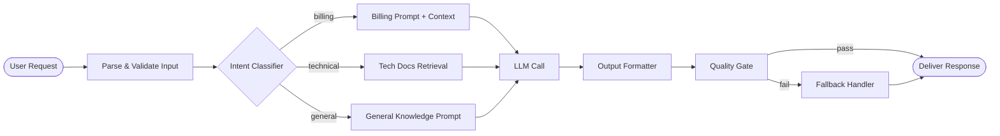
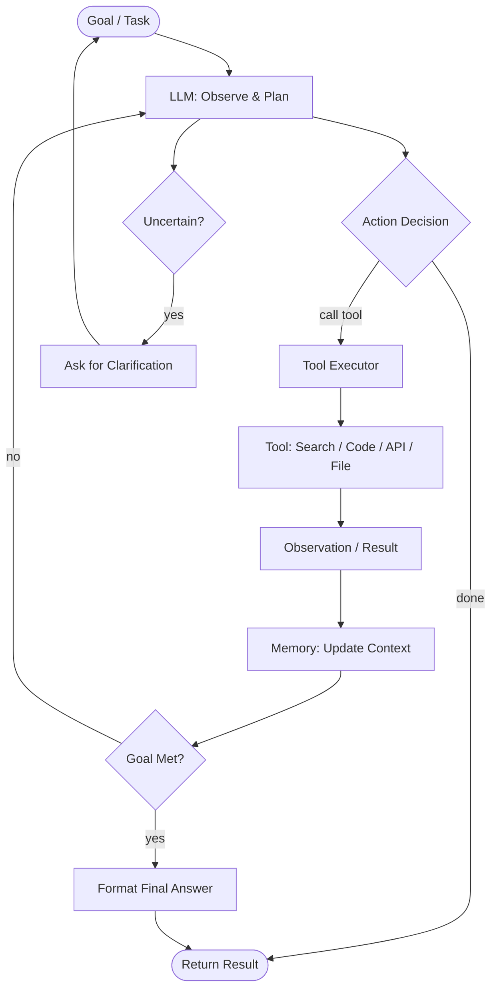
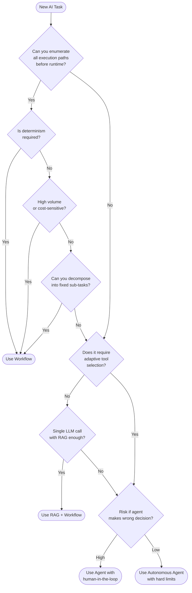

The biggest mistake engineering teams make with AI right now is deploying agents when a plain workflow would do the job better, cheaper, and with fewer production incidents. I've seen it happen repeatedly: a team gets excited about autonomous agents, builds a multi-step reasoning loop, and then spends the next three months debugging non-deterministic failures that a simple DAG-based pipeline would have never produced.

This guide cuts through the hype. We'll look at what AI workflows and AI agents actually are under the hood, compare them honestly on the dimensions that matter for production systems, and give you a clear framework for picking the right architecture.

> **TL;DR:** Use a workflow when the task path is known in advance and determinism matters. Use an agent when the task requires adaptive planning, tool selection, or multi-step reasoning over unknown inputs. Most production use cases fit workflows. Agents earn their complexity only at the frontier of ambiguity.

---

## Quick Comparison

| Dimension | AI Workflow | AI Agent |
|---|---|---|
| **Flexibility** | Low — fixed execution path | High — dynamic tool selection and planning |
| **Cost per run** | Predictable, typically lower | Variable, often 3-10x higher due to reasoning loops |
| **Reliability** | High — deterministic by design | Lower — non-determinism compounds across steps |
| **Latency** | Low — parallel steps possible | Higher — sequential reasoning adds overhead |
| **Complexity to build** | Low-Medium | High |
| **Complexity to debug** | Low | High |
| **Best for** | Structured, repeatable tasks | Open-ended, adaptive tasks |

---

## What Are AI Workflows?

An AI workflow is a directed acyclic graph (DAG) of steps where each node does a well-defined job — call a model, run a retrieval, transform data, invoke an API — and the edges between nodes are determined at design time by the engineer. The execution path doesn't change based on what the model says. You define the graph; the model fills in the content at specific nodes.

Think of it as a factory assembly line. Each station does one thing, outputs go to the next station, and the factory manager (your orchestration code) knows the full sequence before the first part arrives.

**Concrete examples of AI workflows:**

- **Document summarization pipeline:** Extract text → chunk → embed → retrieve relevant sections → call LLM with retrieved context → format output → store result
- **Customer support ticket routing:** Parse ticket → classify intent → branch on category → draft reply using category-specific prompt → queue for human review
- **Code review gate:** Trigger on PR → fetch diff → run static analysis → call LLM with diff + style guide → post structured comment → flag if score below threshold
- **Nightly report generation:** Fetch metrics from database → compute aggregates → fill report template with LLM-written summaries → send email

The defining property: **you could draw the entire execution path on a whiteboard before running a single query.** There are branches based on data values, but the set of possible paths is finite and enumerable.

### Typical Workflow Pipeline

Each box is a discrete, testable unit. You can mock any node and test the rest of the pipeline in isolation. You can replay a failed run from any checkpoint. This is why workflows dominate in production: they're boring in the best possible way.

---

## What Are AI Agents?

An AI agent is a system where the model itself decides what to do next. Instead of following a fixed graph, the agent enters a reasoning loop: observe the current state, decide which tool to call (or whether the task is done), execute that tool, observe the result, and repeat. The path through that loop is determined at runtime by the model's own outputs.

The key primitives that make an agent an agent:

1. **Tool use** — the model can call external functions (search, code execution, APIs, file I/O) and incorporate results into its reasoning
2. **Planning** — the model can decompose a high-level goal into sub-tasks without being told the sub-tasks explicitly
3. **Persistent memory** — state accumulates across iterations; the model can reference earlier observations
4. **Autonomy over control flow** — the model decides when to stop, not a hardcoded condition

Anthropic's Claude, OpenAI's GPT-4o, and Google's Gemini 1.5 Pro all support tool calling, which is the primitive most agents are built on. The difference between "LLM with tools" and "agent" is really whether you've given the model authority to determine the next step autonomously or whether your code does that.

**Concrete examples where agents fit:**

- **Open-ended research:** "Investigate why our checkout conversion dropped 12% last Tuesday" — the agent decides which dashboards to query, which hypotheses to explore, and how deep to go
- **Complex code debugging:** Given a stack trace, the agent reads source files, searches for related issues, runs tests, forms hypotheses, and patches the bug
- **Multi-step API integration:** Build a Zapier-like connection between two systems the agent hasn't seen before
- **Legal document review:** Analyze a 200-page contract for specific clause types without a predetermined list of what to look for

### Agent Execution Loop

Notice the cycle. The model can loop many times before reaching a terminal state. In my experience running agents in production, the most common failure mode is infinite loops — either because the model never decides the task is done, or because an error state becomes the new observation and the model keeps trying the same broken tool. This is why agent systems need hard iteration limits, timeout budgets, and explicit fallback conditions.

---

## Head-to-Head: When to Use Each

The question I get asked most is: "We have task X — should we use an agent or a workflow?" Here's the decision logic I actually use:

**Use a workflow when:**
- The steps are known and don't depend on model outputs to determine the sequence
- You need deterministic, auditable behavior (regulated industries, financial operations, medical applications)
- The task runs at high volume where cost predictability matters
- You need sub-100ms responses — agent reasoning loops rarely get there
- The failure modes need to be enumerable so you can write proper error handling
- You're building on top of a workflow orchestrator like Prefect, Airflow, Temporal, or LangGraph's graph mode

**Use an agent when:**
- The path to the answer can't be specified in advance
- The task requires synthesizing information from multiple heterogeneous sources in an order that depends on what each source returns
- Human-equivalent judgment is genuinely needed at multiple intermediate steps
- You're comfortable with approximate, variable-cost solutions
- Failures are recoverable and not catastrophic (don't use autonomous agents near production databases without extensive guardrails)

**The honest middle ground:** Most tasks that feel like they need an agent can actually be decomposed into a workflow with smarter routing logic. Before building an agent, ask: "Could a senior engineer write down every possible sequence of steps for this task?" If yes, it's a workflow. If the answer is "it depends on what we find," it might need an agent.

---

## Real-World Examples

### Customer Support Triage — Use a Workflow

A SaaS company wants to auto-respond to 60% of support tickets without human involvement. The ticket types are known: billing questions, password resets, feature requests, bug reports, and cancellation requests.

This is a workflow. The intent classifier branches to category-specific handlers. Each handler has a fixed prompt, a fixed set of context sources (billing records, docs, account status), and a fixed output schema. You can write test cases for every branch. You can measure precision and recall per category. You can replay failures from logs.

Adding an agent here would be a mistake. You'd spend weeks teaching the agent to not improvise on billing refunds. A workflow gives you those guardrails for free.

### Code Review Assistance — Use an Agent (Carefully)

A platform engineering team wants AI to review PRs for security vulnerabilities. The issues aren't known in advance — a reviewer might need to look at three different files, search for how a function is used elsewhere in the codebase, check a CVE database, and then form a holistic judgment.

This is a better fit for an agent. The agent can decide which files are relevant, call a code search tool, query a security advisory API, and synthesize findings. A static workflow would miss the dynamic file traversal.

But even here: constrain the agent. Give it a budget of 10 tool calls maximum. Log every tool invocation. Route the agent's output through a human reviewer before any automated comment is posted. The agent does the research; a human (or a rules-based gate) decides whether to act.

---

## Cost & Reliability Analysis

Let me give you real numbers from patterns I've seen across teams using both architectures.

**Workflow cost structure:**
- Predictable token count per run (you control context size at each node)
- Can use cheaper models for classification steps, stronger models only where needed
- Typical cost: $0.001–$0.05 per task depending on task complexity and model mix

**Agent cost structure:**
- Token count scales with number of reasoning iterations (often 5–20x a single-call workflow)
- Each tool call adds latency and often token overhead from results injected back into context
- Costs can spike unexpectedly if the model gets "stuck" and loops excessively
- Typical cost: $0.05–$2.00 per task for moderately complex tasks

**Reliability data:** Internal studies from Anthropic's deployment teams and third-party benchmarks (HellaSwag, GAIA, SWE-bench) consistently show that as agent chain length increases, task success rate decreases because errors compound. A single LLM call with a well-crafted prompt typically achieves 85-95% accuracy on structured tasks. A 5-step agent chain on the same task often falls to 60-75% end-to-end success, even if each step individually is accurate, because small errors in step 2 corrupt the context for step 5.

**The reliability math:** If each of 5 agent steps has 90% reliability, your end-to-end success rate is 0.9^5 = 59%. If each step of a 3-step workflow has 95% reliability, you get 0.95^3 = 86%. Fewer steps, better reliability, lower cost. This is the core argument for workflows.

---

## Decision Flowchart: Workflow or Agent?

Run every new use case through this flowchart before writing a line of orchestration code. You'll avoid the most expensive architectural mistakes.

---

## Hybrid Approaches

The sharpest teams I've worked with don't choose between workflows and agents — they layer them. The pattern that works best in production:

**Workflow outer shell, agent inner core.** A workflow handles intake, routing, context preparation, output validation, and delivery. Inside one specific node — the one that requires open-ended reasoning — you call an agent with a fixed budget. The agent gets a clean, well-scoped context blob and a hard tool-call limit. The workflow catches failures and routes to fallbacks.

Example: A competitive intelligence system. The workflow fetches raw data (competitor pricing pages, recent press releases, SEC filings) on a schedule. It cleans and chunks the data, then hands it to an agent node with a specific question: "What has changed for Competitor X this quarter, and what are the three most important implications for our pricing?" The agent can explore the data freely within its context window. The workflow validates that the output matches a schema before storing it.

Another hybrid pattern: **Agent for planning, workflow for execution.** The agent's first step is to generate a structured execution plan — a JSON object specifying which tools to call and in what order. Your code validates that plan, then executes it as a workflow. This gives you agent-level flexibility in planning with workflow-level determinism in execution.

This is essentially how agentic coding tools like Cursor and GitHub Copilot Workspace operate: the model generates a plan (a diff, a set of file edits), a deterministic system applies it, and a validation step checks the result.

---

## Our Verdict

If I'm advising a team building their first production AI system: **start with a workflow, always.** You'll ship faster, debug easier, control costs, and satisfy compliance requirements. When you hit genuine walls — tasks where a fixed path simply can't capture the required reasoning — introduce agents surgically, with hard limits and human review in the loop.

The AI ecosystem is full of agent frameworks and demos because agents are exciting to watch. But the teams quietly shipping reliable value at scale are mostly running boring, well-tested workflow pipelines with a few carefully bounded agent nodes inside them.

Agents are powerful. They're also expensive, brittle, and hard to test. Use them where their power is genuinely required, and nowhere else.

---

## FAQ

### Can I convert an existing workflow to an agent later?

Yes, and this is often the right progression. Build the workflow, learn which nodes are bottlenecks because fixed prompts can't handle input variance, and replace those specific nodes with agent calls. You'll have a much better sense of scope and risk by then. Don't start with an agent and try to add guardrails retroactively — it's much harder.

### Do I need a framework like LangChain or LangGraph?

Not necessarily. Many production workflow systems are plain Python or TypeScript with direct API calls to model providers. Frameworks add abstractions that can help with common patterns but also add dependencies, abstractions to debug through, and potential upgrade pain. For a first system, start without a framework. Add one when the boilerplate becomes genuinely painful.

### How do I prevent an agent from running up a huge bill?

Three layers: (1) hard iteration cap — the agent loop exits after N tool calls regardless of whether it thinks it's done; (2) token budget — track cumulative tokens in context and truncate or stop when you hit a limit; (3) cost alerts — set billing alerts in your model provider's dashboard for anomalous spend. Also, prefer workflows for high-volume tasks specifically because their cost is predictable.

### What's the practical difference between an "agent" and a "chain"?

A chain (or pipeline) is a synonym for what I'm calling a workflow here — fixed sequence of LLM calls where your code drives the flow. An agent is specifically a system where the model controls the next action. In LangChain's terms: `SequentialChain` = workflow, `AgentExecutor` = agent. The distinction matters because agents require different testing, monitoring, and cost management approaches.

### Are agents safer with smaller, faster models or larger, capable ones?

Counterintuitively, agents usually need stronger models, not weaker ones. Agents require good instruction following, accurate tool call syntax, and sound reasoning about when to stop. Cheaper models tend to hallucinate tool arguments, loop unnecessarily, and miss stopping conditions — which causes more tool calls and higher costs. Use the strongest model you can afford for agent reasoning steps, and use cheaper models for the structured sub-tasks inside the agent's tool implementations.
