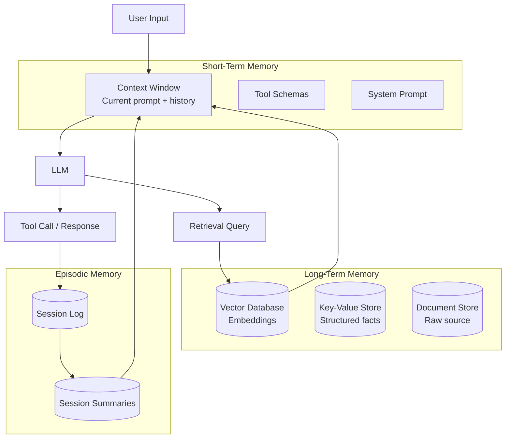
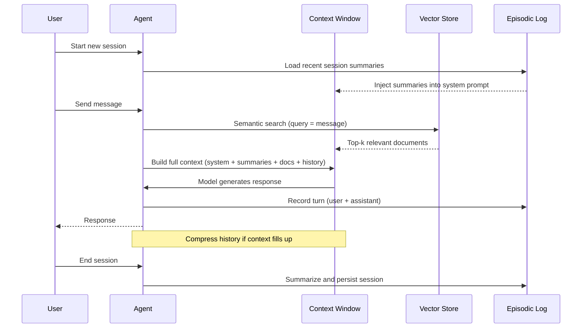
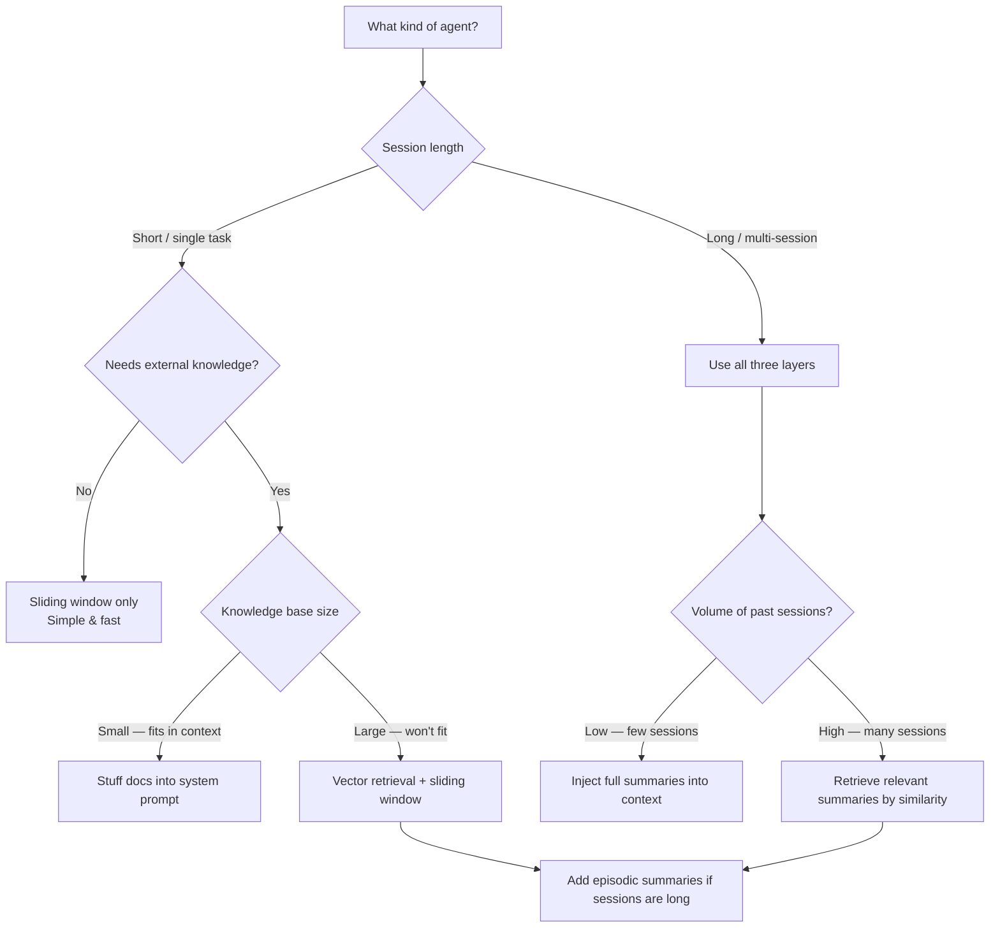

I spent the better part of a month debugging an AI agent that kept "forgetting" critical context mid-task. The agent would retrieve the right documents, plan the right steps, and then — three tool calls later — ask for information it had already been given. The root cause was not the model. It was that I had never properly designed the memory layer. That gap between "model can do this" and "system reliably does this" is where most production agents fall apart, and it comes down to how you handle memory.

This is a technical breakdown of the three memory types every LLM agent needs, how to implement each one, and where the tradeoffs actually bite you.

## Why Memory Matters More Than the Model

The standard narrative is that AI agents fail because the underlying model is not smart enough. That is rarely the problem in 2025. The models are capable. The problem is that most agents are essentially amnesiac — they can only see what fits in the current context window, and they have no structured way to recall what happened in previous sessions or retrieve knowledge stored outside the prompt.

Think about what you actually need from a useful agent. It should know what it was told earlier in the conversation. It should be able to recall facts from external knowledge bases without those facts being permanently baked into the prompt. And for a long-running assistant, it should remember what happened last Tuesday when you pick up the conversation again today. Those three requirements map exactly to the three memory types: short-term, long-term, and episodic.

Getting these wrong is expensive. A context window stuffed with irrelevant history is slow and costs more per call. A retrieval system that surfaces the wrong documents produces confident wrong answers. An agent that starts every session from zero cannot build the kind of trust that makes it actually useful over time.

## The Three Memory Types

### Short-Term Memory: The Context Window

Short-term memory in an LLM agent is the context window — everything the model can see right now. As of late 2025, frontier models range from 128K to 1M tokens, which sounds like a lot until you start adding tool schemas, retrieved documents, conversation history, and system prompts. In practice, most production agents operate effectively in the 8K–32K range per call, because loading the full window is slow and expensive.

Short-term memory is fast and zero-latency — whatever is in the context is immediately available to the model. The downside is that it does not persist. When the call ends, it is gone.

### Long-Term Memory: Vector Stores and Knowledge Bases

Long-term memory is external storage that the agent can query. The most common implementation is a vector database: you embed documents, code, facts, or previous outputs as dense vectors, and the agent issues semantic search queries to retrieve the most relevant chunks at runtime.

Long-term memory persists indefinitely and scales to millions of documents. The cost is retrieval latency and retrieval quality — you are only ever getting the top-k most similar results, and if those results are not the right ones, the agent proceeds with wrong context. Retrieval precision is the core engineering problem here.

### Episodic Memory: Conversation History and Session Persistence

Episodic memory is the agent's record of what happened across sessions. It answers the question "what did we discuss last time?" It is distinct from long-term memory because it is ordered, session-scoped, and often includes the agent's own reasoning and actions, not just factual content.

Most production systems implement episodic memory as a structured log of sessions that gets summarized and stored in the long-term memory layer. A new session starts by retrieving the summary of relevant previous sessions rather than replaying the raw history.

## Architecture Overview

Here is how these three layers fit together in a typical agent system:



The key insight is that the context window is the only thing the model ever sees. Long-term and episodic memory exist to populate that window intelligently — you retrieve what matters, not everything.

## Implementing Short-Term Memory

### Sliding Window Approach

The simplest approach to managing conversation history is a sliding window: keep the last N turns in context and drop anything older. This is what most chat APIs do by default.

```python
def build_context(messages: list[dict], max_tokens: int = 8000) -> list[dict]:
    """Keep the most recent messages within a token budget."""
    # Always preserve the system prompt
    system = [m for m in messages if m["role"] == "system"]
    conversation = [m for m in messages if m["role"] != "system"]

    # Count tokens from the end, keep as many as fit
    selected = []
    token_count = sum(estimate_tokens(m["content"]) for m in system)

    for message in reversed(conversation):
        msg_tokens = estimate_tokens(message["content"])
        if token_count + msg_tokens > max_tokens:
            break
        selected.insert(0, message)
        token_count += msg_tokens

    return system + selected
```

The problem with pure sliding window is that you can drop critical context — the user's original goal, a constraint they mentioned in turn 2, the output of a long-running tool call. Dropped context causes the "why did it forget that?" failures.

### Summarization-Based Compression

A better pattern is to summarize older portions of the conversation rather than discard them. When the context gets full, ask the model to compress the oldest segment into a summary, then replace those messages with the summary.

```python
async def compress_history(
    messages: list[dict],
    model: str,
    keep_last_n: int = 10
) -> list[dict]:
    """Summarize older messages to free context space."""
    if len(messages) <= keep_last_n:
        return messages

    to_summarize = messages[:-keep_last_n]
    recent = messages[-keep_last_n:]

    summary_prompt = {
        "role": "user",
        "content": (
            "Summarize the following conversation history concisely. "
            "Preserve: decisions made, key facts established, user goals, "
            "and any constraints mentioned. Be specific, not vague.\n\n"
            + "\n".join(f"{m['role']}: {m['content']}" for m in to_summarize)
        )
    }

    response = await client.messages.create(
        model=model,
        max_tokens=1024,
        messages=[summary_prompt]
    )

    summary_message = {
        "role": "assistant",
        "content": f"[Earlier conversation summary]\n{response.content[0].text}"
    }

    return [summary_message] + recent
```

This preserves intent at the cost of an extra model call. For agents running long sessions, it is worth it. I have found that a good summarization prompt asking explicitly for "decisions made" and "user goals" produces much more useful compression than a generic "summarize this."

## Implementing Long-Term Memory

### Setting Up a Vector Store

Long-term memory starts with embedding your content and storing those embeddings in a vector database. The retrieval step happens at query time — you embed the user's query or the agent's current goal, then find the most similar stored vectors.

```python
from anthropic import Anthropic
import numpy as np

client = Anthropic()

def embed(text: str) -> list[float]:
    """Generate embedding for a piece of text."""
    # Using a dedicated embedding model in production
    # Here showing the pattern with a placeholder
    response = client.embeddings.create(
        model="voyage-3",  # Anthropic's recommended embedding model
        input=text
    )
    return response.embeddings[0]

def cosine_similarity(a: list[float], b: list[float]) -> float:
    a_arr = np.array(a)
    b_arr = np.array(b)
    return float(np.dot(a_arr, b_arr) / (np.linalg.norm(a_arr) * np.linalg.norm(b_arr)))

class SimpleVectorStore:
    def __init__(self):
        self.documents: list[dict] = []

    def add(self, text: str, metadata: dict = None):
        self.documents.append({
            "text": text,
            "embedding": embed(text),
            "metadata": metadata or {}
        })

    def search(self, query: str, top_k: int = 5) -> list[dict]:
        query_embedding = embed(query)
        scored = [
            {**doc, "score": cosine_similarity(query_embedding, doc["embedding"])}
            for doc in self.documents
        ]
        return sorted(scored, key=lambda x: x["score"], reverse=True)[:top_k]
```

In production you would use Pinecone, Weaviate, pgvector, or Qdrant instead of the in-memory store above, but the interface stays the same: `add()` and `search()`.

### Retrieval-Augmented Generation in an Agent Loop

The pattern is to retrieve before each significant reasoning step, not once at the beginning of a session. The agent's understanding of what it needs changes as it works.

```python
async def agent_step(
    user_message: str,
    conversation_history: list[dict],
    vector_store: SimpleVectorStore
) -> str:
    # Retrieve relevant context for this step
    retrieved = vector_store.search(user_message, top_k=3)
    context_block = "\n\n".join(
        f"[Retrieved: {r['metadata'].get('source', 'unknown')}]\n{r['text']}"
        for r in retrieved
        if r["score"] > 0.75  # Similarity threshold matters
    )

    # Build the message with retrieved context injected
    system = (
        "You are a helpful assistant with access to a knowledge base. "
        "Use the retrieved context when relevant, but do not fabricate facts "
        "not present in the context or your training.\n\n"
        f"Relevant context:\n{context_block}"
    )

    response = await client.messages.create(
        model="claude-sonnet-4-5",
        max_tokens=2048,
        system=system,
        messages=conversation_history + [{"role": "user", "content": user_message}]
    )

    return response.content[0].text
```

The similarity threshold (`0.75` above) is one of the most important tuning knobs in a retrieval system. Too low and you inject irrelevant noise. Too high and you miss useful context. Calibrate this with real examples from your domain.

## Implementing Episodic Memory

Session persistence requires a structured log and a summarization step at the end of each session. Here is a minimal implementation:

```python
import json
from datetime import datetime
from pathlib import Path

class EpisodicMemory:
    def __init__(self, storage_path: str, user_id: str):
        self.storage_path = Path(storage_path) / user_id
        self.storage_path.mkdir(parents=True, exist_ok=True)
        self.current_session: list[dict] = []
        self.session_id = datetime.now().strftime("%Y%m%d_%H%M%S")

    def record(self, role: str, content: str, metadata: dict = None):
        """Log a message to the current session."""
        self.current_session.append({
            "role": role,
            "content": content,
            "timestamp": datetime.now().isoformat(),
            "metadata": metadata or {}
        })

    async def close_session(self, model: str):
        """Summarize and persist the session."""
        if not self.current_session:
            return

        summary = await self._summarize_session(model)

        session_data = {
            "session_id": self.session_id,
            "timestamp": datetime.now().isoformat(),
            "summary": summary,
            "message_count": len(self.current_session),
            "full_log": self.current_session
        }

        session_file = self.storage_path / f"{self.session_id}.json"
        session_file.write_text(json.dumps(session_data, indent=2))

    def load_recent_summaries(self, n: int = 3) -> str:
        """Retrieve summaries of the most recent sessions."""
        session_files = sorted(self.storage_path.glob("*.json"), reverse=True)[:n]
        summaries = []
        for f in session_files:
            data = json.loads(f.read_text())
            summaries.append(
                f"Session {data['session_id']} ({data['timestamp'][:10]}):\n"
                f"{data['summary']}"
            )
        return "\n\n".join(summaries)

    async def _summarize_session(self, model: str) -> str:
        transcript = "\n".join(
            f"{m['role'].upper()}: {m['content']}" for m in self.current_session
        )
        response = await client.messages.create(
            model=model,
            max_tokens=512,
            messages=[{
                "role": "user",
                "content": (
                    "Summarize this session for future reference. Include: "
                    "the user's main goals, decisions reached, tasks completed, "
                    "open questions, and any important context for next time.\n\n"
                    f"{transcript}"
                )
            }]
        )
        return response.content[0].text
```

At the start of a new session, you prepend `episodic.load_recent_summaries()` to the system prompt. The agent effectively "remembers" what happened before without replaying the full raw history.

## Session Flow with All Three Memory Types



This diagram shows the critical dependency: episodic memory initializes the session context before the first user turn. Miss that step and your agent starts cold every time.

## Memory in Practice: LangChain, Claude Projects, and Custom Solutions

### LangChain Memory

LangChain has the most mature memory abstraction in the ecosystem. The main types you will encounter:

- `ConversationBufferMemory`: raw sliding window, simple but unscalable
- `ConversationSummaryBufferMemory`: summarizes when buffer exceeds a token limit — the most practical for production
- `VectorStoreRetrieverMemory`: stores every exchange as an embedding and retrieves by semantic similarity

```python
from langchain.memory import ConversationSummaryBufferMemory
from langchain_anthropic import ChatAnthropic

llm = ChatAnthropic(model="claude-sonnet-4-5")

memory = ConversationSummaryBufferMemory(
    llm=llm,
    max_token_limit=4000,
    return_messages=True
)
```

`ConversationSummaryBufferMemory` hits a sweet spot: it keeps recent turns verbatim (for full fidelity) and summarizes older turns (to save tokens). I have used this in production and it is genuinely reliable.

### Claude Projects

If you are using Claude through Anthropic's product rather than the API, Claude Projects is episodic memory out of the box. A Project maintains context across sessions, lets you attach knowledge documents (long-term memory), and uses a persistent system prompt. For non-API use cases this is the fastest path to persistent memory — no engineering required.

The limitation is customizability. You cannot control retrieval strategy, similarity thresholds, or compression behavior. For custom agents with specific requirements, the code-level approach gives you much more control.

### Custom Solutions: When to Build

Build your own memory layer when:
- You need fine-grained control over what gets stored versus retrieved
- Your episodic data needs to feed downstream analytics or compliance systems
- You are running many concurrent users and need efficient multi-tenant isolation
- Your retrieval needs to blend semantic similarity with structured filters (e.g., "documents from this project, created after this date, tagged with this category")

Use a managed solution (LangChain, LlamaIndex, Mem0) when you want working memory in days rather than weeks and your requirements are standard.

## Performance Tradeoffs

Every memory choice has a cost profile. Here is the honest breakdown:

| Memory Type | Latency | Cost | Persistence | Precision |
|---|---|---|---|---|
| Context window (full history) | Zero | High (tokens) | None | Perfect |
| Sliding window | Zero | Low | None | Degrades over time |
| Summarization | +1 model call | Medium | None | Good if prompt is good |
| Vector retrieval | 10–200ms | Low per query | Permanent | Depends on embeddings |
| Episodic (summary) | +1 call at session end | Low | Permanent | Good |

The interactions matter too. Vector retrieval with a poor similarity threshold can flood the context window with irrelevant content, which is worse than no retrieval. Summarization with a bad prompt produces vague summaries that fail exactly when you need specificity. And stuffing too much into the context window — even with good material — increases latency and cost nonlinearly on some models.

The right design depends on your session length, task complexity, and how much context actually carries forward. For short-session task agents (under 20 turns), a sliding window plus targeted retrieval is usually sufficient. For long-session assistant agents (multi-day, multi-project), you need all three layers working together.

## Choosing the Right Memory Strategy



Use this decision tree as a starting point, not a final answer. Your specific token budget, latency requirements, and task domain will push you toward different points on the tradeoff curve.

## Common Mistakes

**Treating memory as an afterthought.** Most teams add memory after discovering their agent breaks on long sessions. Designing it upfront means you collect the right data from day one, and you do not have to retrofit storage schemas that conflict with your existing architecture.

**Not filtering by similarity score.** Retrieving the top-5 most similar documents regardless of how similar they actually are is a common bug. If the top result has a cosine similarity of 0.3, it is probably not relevant. Always set a floor — I use 0.7 as a starting point and calibrate from there.

**Summarizing too aggressively.** A summary prompt that says "summarize this" produces a generic paragraph. A summary prompt that says "list the user's stated goals, decisions made, open questions, and constraints mentioned" produces something you can actually use. Specificity in the summarization prompt directly determines the quality of episodic memory.

**Conflating conversation history and knowledge retrieval.** These are different problems. Conversation history is ordered, sequential, and personal to the session. Knowledge retrieval is unordered, static (or slowly changing), and shared across users. Mixing them into the same storage layer causes subtle bugs where old conversation turns get retrieved as factual knowledge.

**Ignoring the cold start problem.** The first turn of a new session is where episodic memory matters most — the user expects continuity, but you have not retrieved anything yet. Make sure session summaries are injected before the first model call, not after.

**Over-engineering early.** A two-layer system (context window + one retrieval call per turn) solves 80% of memory problems. Add the third layer when you have evidence from production that sessions are breaking across days, not before.

## Verdict

LLM agent memory is not a single feature — it is three distinct problems with different solutions that need to compose cleanly. Short-term memory is about managing the context window intelligently through sliding windows and summarization. Long-term memory is about retrieval quality from a vector store, which lives or dies by your similarity threshold and embedding quality. Episodic memory is about session continuity, which requires a structured logging and summarization pipeline that runs at session close.

The good news is that the baseline implementations are not complicated. A `ConversationSummaryBufferMemory` from LangChain, a vector store with a calibrated similarity floor, and a simple session summarizer will outperform a system with no memory design by a wide margin. The sophisticated optimizations — hybrid retrieval, multi-tenant isolation, fine-tuned embeddings — are real problems, but they only become the bottleneck after the basics are working.

Start with the three layers. Measure where it breaks. Then tune.

---

## FAQ

### What is the difference between long-term memory and RAG in an AI agent?

RAG (Retrieval-Augmented Generation) is the retrieval mechanism used to populate long-term memory at query time. Long-term memory is the broader concept — the persistent external storage that the agent can query. You can think of RAG as the read path for long-term memory: the agent generates a query, retrieves relevant chunks from a vector store or document database, and injects them into the context window. Long-term memory also has a write path: storing new information, updating embeddings, and managing document versions.

### How many tokens should I allocate to retrieved context versus conversation history?

A useful starting split for a 16K-token budget is: 2K for system prompt and tool schemas, 4K for retrieved documents, 8K for conversation history, and 2K headroom for the model's response. Adjust based on your retrieval quality — if retrieval is high-precision, you can justify giving it more budget. If it frequently returns irrelevant content, shrink it and invest in improving retrieval first.

### Can episodic memory cause privacy issues in multi-user systems?

Yes, and this is a common oversight. Episodic memory stores personally identifiable information — what a user said, what they asked about, what decisions they made. In multi-user systems you must strictly isolate episodic stores by user ID and apply appropriate retention policies. Never allow one user's episodic memory to be retrievable by another user's agent, and implement deletion mechanisms so users can exercise the right to be forgotten.

### Does vector retrieval work well for code, or is it mainly for natural language?

Vector retrieval works for code, but you typically get better results with a hybrid approach: semantic search (vector similarity) for finding conceptually related code, combined with keyword or exact-match search for finding specific function names, class names, or error strings. Pure vector retrieval on code tends to return code that "feels" similar without necessarily being functionally relevant. Tools like Cursor handle this with a proprietary codebase indexing layer that blends both approaches.

### How do I evaluate whether my memory design is actually working?

Build a small evaluation set of multi-turn conversations where the correct final response depends on information from an earlier turn. Run the agent with and without your memory layer on these cases and measure how often the agent correctly uses the earlier information. For episodic memory, test cross-session recall: start a session, establish some facts, end the session, start a new one, and ask about those facts. If recall accuracy is above 85% on your eval set, your memory layer is doing its job. Below 70%, you have a retrieval or compression problem worth fixing before shipping.
