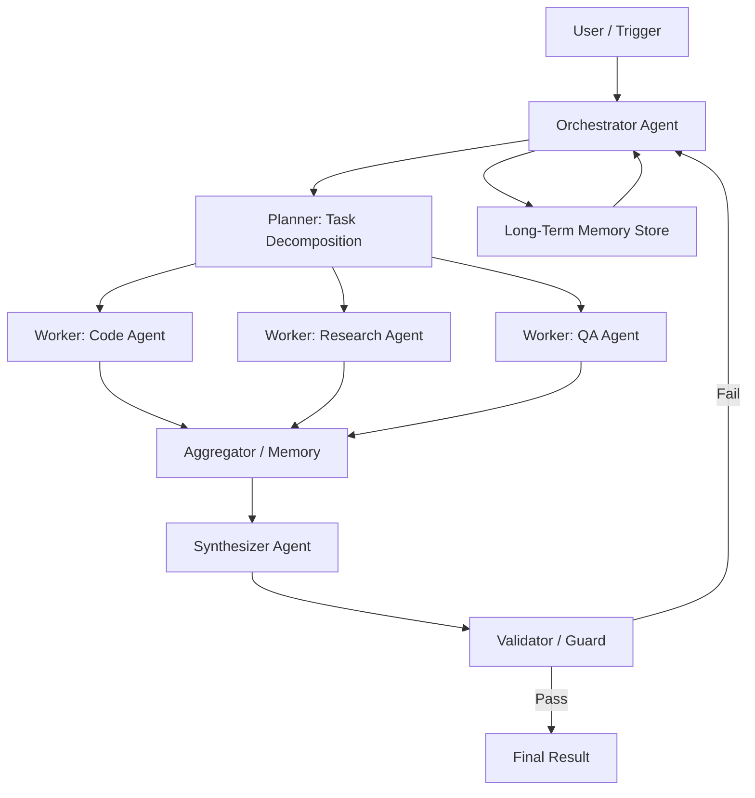
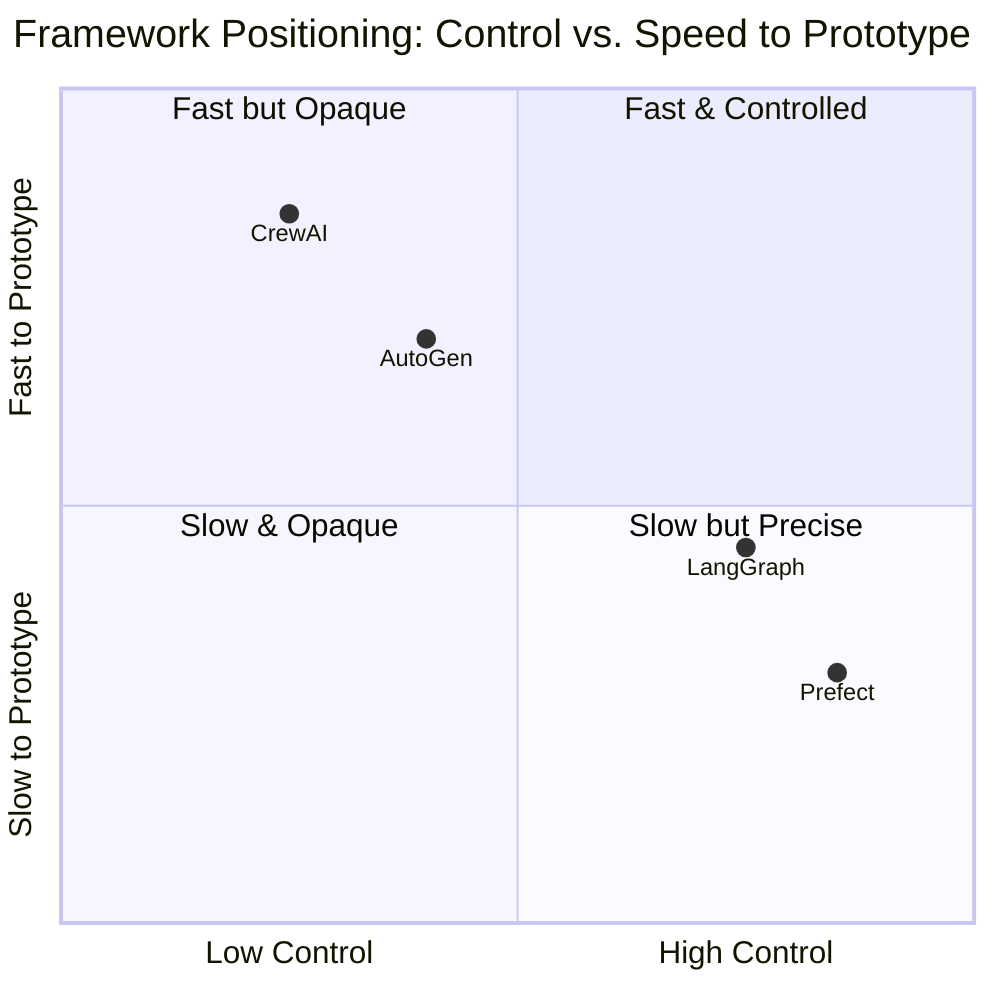
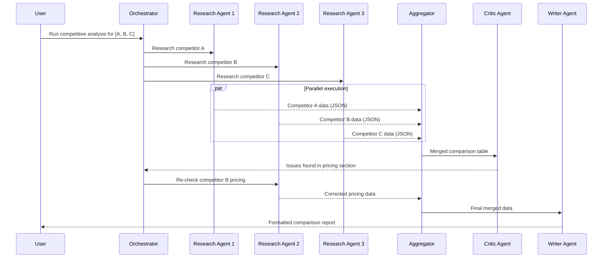

I've spent the last year wiring together agent systems that actually run in production — not toy demos. The hardest lesson: getting a single agent to call a tool is easy. Coordinating five agents that share state, recover from partial failures, and don't spend you into a cloud bill crisis is a different problem entirely. That problem has a name: **AI agent orchestration**.

This guide is for engineers who've built at least one LLM-powered feature and are now wondering how to scale it. I'll cover the core patterns, the frameworks worth knowing, and the sharp edges I've hit that no README warns you about.

---

## What Is AI Agent Orchestration?

AI agent orchestration is the discipline of coordinating multiple AI agents — or multiple calls to the same agent — so they collaborate to complete a goal that no single agent can handle alone.

A single agent call is a function: input goes in, output comes out. Orchestration turns that function into a **workflow**: a graph of agents, tools, memory stores, and control logic that routes work, handles errors, tracks state across steps, and delivers a final result.

The distinction matters because the problems are different. A single agent call fails or succeeds atomically. An orchestrated workflow can succeed partially, get stuck mid-graph, produce inconsistent state, or spiral into an infinite retry loop. You have to design for all of those.

Think of it the way you'd think about distributed systems: each agent is a service, and orchestration is the infrastructure that makes services cooperate reliably. Just as you wouldn't expose raw database calls to every service in a microservices mesh, you shouldn't let every agent take arbitrary action on shared state.

### Why It's Hard

Three forces make orchestration genuinely difficult:

1. **Non-determinism.** LLMs return different outputs for the same prompt. Your orchestration layer must tolerate variance without amplifying it into downstream chaos.
2. **Partial failure.** Agent A succeeds, agent B times out, agent C returns a malformed JSON. What's the system's state? Who cleans up?
3. **Cost compounding.** Every agent step burns tokens. A workflow with six sequential agents where each passes full context to the next can cost 10x what a single agent call would.

Getting orchestration right means treating all three as first-class design constraints, not afterthoughts.

---

## Orchestrator Pattern: Architecture Diagram

The most common production pattern is the **orchestrator-worker model**. One central orchestrator agent receives the user's goal, decomposes it into subtasks, delegates to specialist worker agents, collects results, and synthesizes a final answer.

The orchestrator is stateful — it tracks which subtasks are complete, which are in-flight, and which failed. The workers are stateless — they receive context, do one thing, and return a result. The aggregator merges partial outputs into a shared scratchpad. The validator acts as a gate: if the synthesized result doesn't meet quality criteria, the whole loop restarts with the orchestrator having more context about what went wrong.

This pattern scales better than a flat chain because you can parallelize workers and swap implementations without touching the orchestrator's logic.

---

## Orchestration Patterns

There are four core patterns. Knowing which one fits your use case before you write code saves a lot of refactoring.

### 1. Sequential (Pipeline)

Agents execute one after another, each consuming the previous agent's output. This is the simplest pattern and the right default for workflows where each step genuinely depends on the last.

Use it for: document processing pipelines, code generation followed by test generation followed by review.

Watch out for: error propagation. If step two fails, do you retry from step one or from step two? Define retry boundaries explicitly.

### 2. Parallel (Fan-Out / Fan-In)

A coordinator dispatches multiple agents simultaneously, then waits for all results before merging. This cuts latency for independent subtasks.

Use it for: research tasks where multiple sources need querying, batch evaluation of model outputs, running the same prompt against several models for consensus.

Watch out for: the slowest worker defines the total latency. Set per-agent timeouts and handle partial results gracefully — don't let one flaky agent block the entire merge step.

### 3. Hierarchical (Nested Orchestrators)

Orchestrators can themselves be workers of a higher-level orchestrator. This creates a tree of control that can handle arbitrarily complex goals.

Use it for: large multi-domain tasks where sub-domains are genuinely independent (e.g., an outer orchestrator managing a product launch with sub-orchestrators for engineering, marketing copy, and legal review).

Watch out for: depth equals latency equals cost. Each level adds overhead. More than two or three levels of nesting usually signals that the task decomposition needs rethinking, not more orchestration.

### 4. Consensus / Voting

Multiple agents independently attempt the same task and a judge (often another LLM) selects the best output or synthesizes a consensus answer.

Use it for: high-stakes decisions where variance is expensive (security analysis, medical record summarization, financial data extraction).

Watch out for: cost multiplied by agent count. Three agents doing the same task costs three times as much. Reserve this for tasks where the cost of a bad output exceeds the cost of redundancy.

---

## Key Orchestration Frameworks

I've used all four of these in real projects. Here's an honest take on each.

### LangGraph

LangGraph (from LangChain) models orchestration as a directed graph where nodes are Python functions or agent calls and edges are conditional transitions. State is a typed dict that flows through every node.

Its biggest strength is the explicit state machine model — you can see exactly what state looks like at every point in the graph. Its biggest weakness is that the LangChain ecosystem has a lot of abstractions that paper over important details, and debugging through multiple layers of wrapper objects is slow.

Best for: complex conditional workflows, human-in-the-loop approval steps, stateful multi-turn agents.

### CrewAI

CrewAI frames orchestration as a team of agents with roles, goals, and a shared backstory. You define agents as crew members and tasks as their assignments. The framework handles turn-taking and result passing.

It's the fastest path from zero to a working multi-agent demo. The abstraction is high-level, which means you give up fine-grained control in exchange for quick iteration.

Best for: prototyping, research tasks, teams new to multi-agent systems who want something opinionated.

### AutoGen (Microsoft)

AutoGen structures orchestration as conversations between agents. Agents are actors in a group chat — they send messages to each other, and the conversation history is the shared state.

The conversational metaphor maps naturally onto collaborative tasks. The downside is that conversation history grows unboundedly, and managing context window limits requires explicit intervention.

Best for: collaborative problem-solving tasks, back-and-forth negotiation between agents (e.g., a coder agent and a critic agent), research pipelines.

### Prefect

Prefect is a general-purpose workflow orchestration platform that has added AI-specific patterns. Unlike the three above, it's infrastructure-first: it gives you task scheduling, retry logic, caching, observability dashboards, and a UI out of the box.

If you're already running Prefect for data pipelines, adding AI agent steps is a natural extension. If you're starting from scratch for a purely AI-native workflow, the setup overhead is higher than LangGraph or CrewAI.

Best for: teams that need production-grade scheduling, retries, and monitoring; hybrid AI + data workflows.

---

## Framework Comparison

The right choice depends on where you are in the project lifecycle. CrewAI for exploration, LangGraph for production conditional logic, Prefect when you need operational maturity.

---

## Building an Orchestration Layer

Here's how I approach building an orchestration layer from scratch, beyond what any framework's README covers.

### Design Principles

**Keep the orchestrator thin.** The orchestrator's job is routing and state management, not reasoning. The moment you put complex business logic inside the orchestrator itself, debugging failures becomes exponentially harder. Push reasoning into workers.

**Type your state explicitly.** Use Pydantic models or TypedDicts for every state object that flows through the graph. Untyped dicts feel faster to write and become impossible to debug at 2am when something's wrong in production.

**Define step boundaries, not just the graph.** Each step should have a defined input schema, output schema, and set of allowable side effects. If a step can write to a database, that should be explicit in the step definition, not buried in agent logic.

**Make cost a first-class concern.** Track token usage per step. Set hard limits. I've seen well-designed orchestration workflows run 50x over budget because one edge case triggered a retry loop that nobody had accounted for.

### Error Handling

Orchestration errors fall into three categories, and they need different responses:

**Transient failures** (timeouts, rate limits, network blips): retry with exponential backoff and jitter. Cap retries at 3 unless you have a very good reason for more.

**Semantic failures** (agent produced output that doesn't match the expected schema, validator rejected the result): don't blindly retry. Log the failure with full context, then either route to a fallback path or surface to a human. Retrying a semantic failure usually produces another semantic failure.

**Catastrophic failures** (tool call corrupted data, external API returned unexpected state): halt the workflow, roll back what you can, and alert. This is the same philosophy as a distributed transaction abort.

One practical pattern: wrap every agent call in an envelope that captures the input, output, duration, token cost, and error state. This envelope becomes your audit log and your debugging tool.

### State Management

State in a multi-agent workflow has three scopes:

**Step-local state**: data that's only relevant to the current agent's execution. Lives in the agent's context window and dies when the step completes.

**Workflow state**: the shared scratchpad that flows between steps. This is what your orchestrator graph passes from node to node. Keep it minimal — only include data that downstream steps actually need.

**Long-term memory**: facts that should persist across workflow runs. This lives in a vector store, a key-value store, or a relational database. Treat writes to long-term memory as side effects that need explicit permissioning.

A common mistake is putting everything in the workflow state "just in case" a later step might need it. This bloats context windows, increases cost, and makes the state object a tangled mess. Be deliberate about what moves forward.

---

## Real-World Examples

### Multi-Agent Code Review

This is a workflow I run on every pull request in one of my projects. It combines three specialist agents with a final synthesizer.

The orchestrator receives a diff and triggers three parallel workers: a **security agent** that checks for common vulnerability patterns (SQL injection, exposed secrets, unsafe deserialization), a **style agent** that checks against team conventions and flags deviations, and a **logic agent** that reasons about algorithmic correctness and potential edge cases. Each worker returns a structured list of findings with severity, location, and recommendation.

The synthesizer deduplicates findings, resolves conflicts (the security agent flagged something the logic agent called intentional), and produces a single review comment sorted by severity.

The result is a review that catches what automated linters miss but doesn't require a senior engineer to do a first pass on every PR. Human review focuses on the synthesizer's high-severity findings, not on formatting issues.

### Research Pipeline

This is a workflow for competitive analysis. Given a product category and a list of competitors, it needs to produce a structured comparison across pricing, features, customer sentiment, and recent news.

The orchestrator fans out to four parallel research agents, each assigned one competitor. Each agent uses a web search tool, a structured data extraction prompt, and a summarization step to produce a standard JSON object for its competitor.

The aggregator merges the four JSON objects into a single comparison table. A critic agent then reviews the table for inconsistencies (did we use the same pricing tier for each competitor? are the feature definitions comparable?). If the critic finds issues, it routes specific sections back to the relevant research agent with corrective instructions rather than rerunning the whole workflow.

The final output goes into a Notion page via API call. Total runtime: about 90 seconds. A human analyst would take three to four hours to produce the same document.

---

## Workflow Diagram: Research Pipeline

---

## Monitoring and Debugging

An orchestration system without observability is a black box that will eventually fail in a way you can't explain. Here's what I instrument on every workflow.

**Trace every step.** Assign a unique trace ID to each workflow run and attach it to every agent call within that run. When something goes wrong, you need to reconstruct the exact sequence of calls, inputs, outputs, and timing.

**Log structured data, not strings.** Log the input schema version, the output token count, the model name, the step name, and the exit status as structured fields. String logs are fine for humans reading in real time; structured logs are searchable and aggregatable.

**Track the cost envelope.** Total token usage per workflow run, broken down by step. This lets you see immediately when a workflow is running 3x more expensive than baseline and which step is responsible.

**Alert on semantic failures, not just exceptions.** A workflow that completes without throwing an exception but produces output that fails schema validation is a failure. Your monitoring layer needs to understand the difference between "the agent call returned" and "the agent call returned something useful."

**Build a replay tool.** The ability to take a failed workflow run, captured in full, and replay it with a patched prompt or a different model is worth the engineering investment. It turns debugging from speculation into experimentation.

---

## Common Pitfalls

**Giving agents too much context.** More context is not always better. An agent given the full output of every prior step often performs worse than one given a targeted summary. Curate what each agent receives.

**No circuit breaker on tool calls.** If a tool is returning errors, the orchestrator should stop calling it after a threshold, not retry indefinitely. Tool call loops are one of the most common sources of runaway cost.

**Conflating the orchestrator and the planner.** The orchestrator knows the graph structure. The planner reasons about which path to take. They should be separate concerns. When you merge them into one agent, you get a system that's hard to improve because changing the planning logic affects routing logic and vice versa.

**Skipping idempotency.** If a workflow step can be safely retried without side effects, write it that way deliberately. If it can't (because it sends an email, charges a card, writes to a database), add an idempotency key and check before executing. This is basic distributed systems hygiene that a lot of AI teams skip because they're moving fast.

**Building for the happy path only.** Every multi-agent workflow I've ever built had at least one edge case that caused an agent to return an unexpected format or an empty result. Build your aggregators and synthesizers to be defensive — handle None, empty lists, and malformed JSON explicitly.

---

## Verdict

AI agent orchestration is not magic and it's not premature — it's infrastructure engineering applied to probabilistic systems. The teams getting real value out of it are the ones who treat it with the same rigor they'd apply to a distributed service: explicit interfaces, real error handling, cost accounting, and observability from day one.

Start with the orchestrator-worker pattern. Pick one framework (LangGraph if you want control, CrewAI if you want speed). Type your state. Instrument everything. Then expand.

The payoff — workflows that handle hours of human work in minutes, reliably, at scale — is worth the investment. But only if you build the infrastructure to keep it honest.

---

## FAQ

### What's the difference between an AI agent and an orchestrated multi-agent system?

A single AI agent is one LLM loop with access to tools. It perceives its environment, decides on an action, takes that action, and repeats. An orchestrated multi-agent system connects multiple such loops so they can specialize, divide work, and cooperate. The orchestrator adds coordination logic — routing, state management, error recovery — that doesn't live inside any individual agent.

### Do I need a framework, or can I orchestrate agents with plain code?

You can absolutely orchestrate with plain code, and for simple two- or three-step workflows, that's often the right call — fewer dependencies, easier debugging. Frameworks earn their keep when you need built-in retry logic, state persistence across restarts, a visual graph for debugging, or human-in-the-loop interruption points. Start plain and add a framework when the plain version becomes painful to maintain.

### How do I prevent cost explosions in a multi-agent workflow?

Set token budgets per step and per run. Implement circuit breakers on tool calls. Use the smallest model that can handle each step — reserve frontier models for reasoning-heavy tasks and use faster, cheaper models for extraction, formatting, and routing. Log cost per workflow run from day one so you have a baseline to compare against when something goes wrong.

### How do I handle agents that disagree with each other?

Design disagreement handling into the workflow explicitly. The two common approaches are: (1) route to a judge agent that has access to both outputs and the original task specification and must pick one with reasoning, or (2) surface the disagreement to a human approver with both options and the confidence scores. Don't let the workflow silently pick one at random — that produces inconsistent outputs and makes debugging impossible.

### What's the minimum viable observability setup for a new orchestration project?

Log every agent call with: a run ID, a step name, the input token count, the output token count, the latency in milliseconds, and the exit status (success, semantic failure, exception). Store these in any queryable system — a Postgres table, a BigQuery dataset, even a JSONL file works at low volume. With this baseline, you can answer the questions that matter: which step is slow, which step is failing, and what is this costing me per run.
