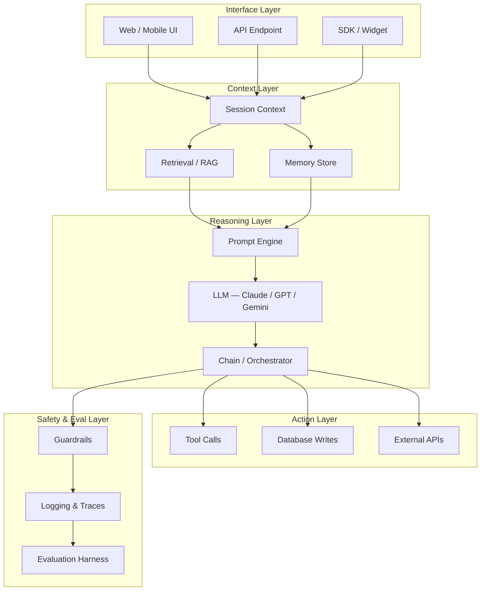
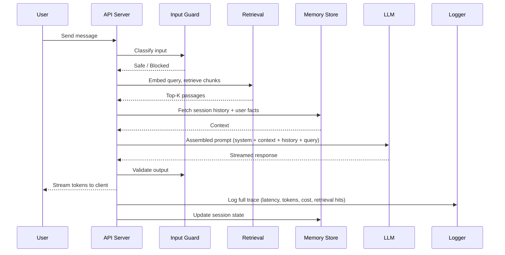
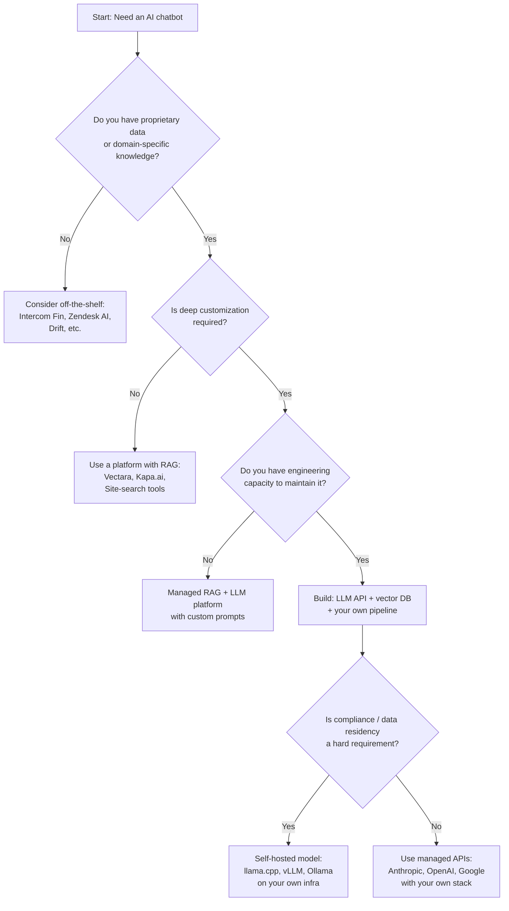

Most AI chatbots die in the demo phase — not because the underlying model is bad, but because nobody planned for what happens after "hello world" works. I've watched teams spend three weeks building a slick prototype, ship it to a hundred internal users, and then spend three months firefighting latency spikes, hallucinated answers, runaway API costs, and a context window that silently truncates the most important part of every conversation.

This guide is the architecture roadmap I wish I'd had before I built my first production chatbot. It covers every layer of a real system — from model selection to guardrails, from retrieval to observability — with honest trade-offs and concrete recommendations at each step.

Whether you're a solo developer building your first AI chatbot or an engineering team moving a pilot to production, the architectural decisions are the same. The scale is different, but the structure is not.

## Architecture Overview

A production AI chatbot is not a single API call. It is a pipeline of at least five distinct layers, each with its own failure modes and optimization levers.



Each layer has to work before the next one is useful. Teams that skip the context layer get a chatbot that sounds confident but knows nothing about the user's actual situation. Teams that skip the safety layer get a chatbot that works in testing and embarrasses them in production.

## Prototype Phase

### Choosing Your Model

The first prototype decision is which LLM to call. My recommendation: don't optimize this early. Pick one model, get the full pipeline working end to end, and only then run a structured comparison.

That said, here's what actually matters when you do compare:

- **Context window**: For chatbots that need conversation history plus retrieved documents, you need at least 32K tokens. Claude 3.5 Sonnet and GPT-4o both handle 128K. Gemini 1.5 Pro goes to 1M tokens but with degraded attention at very long ranges.
- **Instruction following**: Some models are better at sticking to a format, refusing out-of-scope questions, or outputting structured JSON. Test this with your actual system prompt before committing.
- **Latency at your p95**: Median latency from benchmarks rarely matches what you see in production. Measure it yourself against your real prompt length.
- **Pricing at scale**: A model that costs 3× more per token becomes the dominant line item once you hit serious volume. Build a rough cost model for your expected usage before picking a provider.

For most teams starting out, Claude 3.5 Haiku or GPT-4o mini for the bulk of requests with a stronger model on fallback is a reasonable default. You get cost efficiency for the easy queries and quality where it matters.

### Building a Basic Chain

The simplest version of an AI chatbot is a chain with three steps: assemble the prompt, call the model, return the response. In Python with LangChain, that looks roughly like:

```python
from langchain_core.prompts import ChatPromptTemplate
from langchain_anthropic import ChatAnthropic

system = "You are a helpful assistant for Acme Corp customers. Answer only questions about our products."
template = ChatPromptTemplate.from_messages([
    ("system", system),
    ("placeholder", "{history}"),
    ("human", "{input}"),
])

model = ChatAnthropic(model="claude-3-5-haiku-20241022")
chain = template | model
```

This is your prototype. It has no memory, no retrieval, and no guardrails. It is also the only version you should show anyone until each of those things is in place. Showing a guardrail-free chatbot in production is not a prototype — it is a liability.

### Simple Chat UI

For the prototype UI, I use a lightweight React component with a scrollable message list and a text input. The key implementation detail: stream the response. Users tolerate waiting for a long response when they see tokens arriving. They abandon a chat that shows a spinner for eight seconds and then dumps a wall of text.

Server-Sent Events (SSE) with the `ReadableStream` API on the server side and `EventSource` on the client handles this with minimal complexity. Most model provider SDKs have native streaming support — use it from day one, because retrofitting streaming onto a non-streaming architecture is painful.

## Production Requirements

The jump from prototype to production is primarily a jump in non-functional requirements. The model doesn't change. Your standards do.

### Latency

Target end-to-end p50 under 800ms for the first token. Users interpret any longer pause as "the chatbot is broken." If your retrieval pipeline adds 400ms and your model adds 600ms at median, you have a problem before you write a single line of evaluation code.

Concrete levers for latency:
- Stream tokens; never buffer the full response
- Cache retrieval results for repeated queries (semantic caching with embeddings is more effective than exact-match caching)
- Put your model provider's API endpoint in the same region as your app servers
- Use a smaller model for intent classification and routing; only call the large model when needed

### Reliability

A production chatbot needs a circuit breaker pattern around every external dependency — the LLM API, the vector database, your embedding service. When Claude's API returns a 529, your chatbot should degrade gracefully to a canned response, not surface a 500 error to the user.

Rate limits are the reliability failure I see most often. Provider rate limits are per-organization and scale with your tier. Map your expected peak QPS against your tier limits before launch, not after your first traffic spike.

### Cost

A chatbot that costs $0.02 per conversation in testing will cost $20,000/month at 1M conversations. Build a cost model early. Track cost per conversation as a first-class metric alongside latency and quality.

The biggest cost levers are: context length per request (trim aggressively), model tier (use the smallest model that meets quality bar), and caching (both semantic caching for retrieval and prompt caching for system prompts that rarely change).

## Key Components

### LLM

The LLM is the reasoning engine. It is also the most expensive and highest-latency component in the stack. The goal of every other component is to give the LLM the right context, retrieve the right knowledge, and constrain the output — so the LLM can spend its compute on actual reasoning rather than guessing.

Practical LLM integration decisions:
- Use a typed output layer (Instructor, Pydantic, or structured output mode) whenever you need structured data back from the model
- Set a max token limit on responses that matches your UI — a chatbot that returns 4,000 tokens when the user expected 200 words is failing even when the content is correct
- Version your system prompts and treat them as code; every change should go through a diff and evaluation before it ships

### Retrieval (RAG)

Retrieval-Augmented Generation is the architectural pattern that closes the gap between what the base LLM was trained on and what your chatbot needs to know. You chunk your knowledge base into passages, embed them, store them in a vector database, and at query time retrieve the passages most relevant to the user's question.

The implementation details that matter most:
- **Chunk size**: 256–512 tokens per chunk for most knowledge bases. Larger chunks have better recall but flood the context window. Smaller chunks have better precision but lose surrounding context.
- **Embedding model**: OpenAI's `text-embedding-3-small` or Cohere's `embed-english-v3.0` are solid defaults. Run a benchmark on your domain before committing — embedding models have significant variance on specialized domains.
- **Re-ranking**: A cross-encoder re-ranker (Cohere Rerank, Jina Reranker) applied to the top-20 retrieved chunks before sending the top-5 to the LLM measurably improves answer quality for most knowledge-base chatbots. The added latency is usually under 150ms and worth it.
- **Vector database**: Pinecone, Weaviate, Qdrant, and pgvector (in Postgres) all work. Use pgvector if you're already running Postgres and your dataset is under 1M vectors; the operational simplicity is worth more than the ANN performance difference at that scale.

### Memory

A stateless chatbot forgets everything the moment the conversation ends. Users find this frustrating because they expect to be able to say "like I mentioned earlier" and have the system understand the reference.

There are three memory patterns worth understanding:

1. **In-context memory**: Append the full conversation history to every request. Simple, accurate, expensive. Hits context limits fast for long conversations.
2. **Summarized memory**: Periodically summarize older turns into a compact paragraph and replace the raw history. Works well when conversations are long but the model can summarize faithfully.
3. **Persistent memory with retrieval**: Store facts the user has stated (preferences, name, past decisions) in a structured store and retrieve relevant ones per turn. This is what ChatGPT's "memory" feature does. It requires more infrastructure but scales to very long user relationships.

For most chatbots, start with in-context memory with a sliding window (last N turns) plus a summarized block for older history. Only add persistent memory when users are explicitly telling you they need it.

### Guardrails

Guardrails are the difference between a chatbot you can ship and one that becomes a PR incident. A minimal guardrail set for a production chatbot:

- **Input classification**: Detect and refuse off-topic, harmful, or policy-violating inputs before they hit the LLM
- **Output validation**: Check that the LLM's response doesn't contain PII, credentials, internal system information, or other content that should never be in a user-facing response
- **Hallucination mitigation**: If the chatbot is answering factual questions, require citations to retrieved passages and surface those citations to the user
- **Rate limiting per user**: Prevent abuse and protect your cost model

For the input and output classification layer, a small fast classifier (even a regex + keyword list for obvious cases) handles the majority of cases. Reserve LLM-based classification for the edge cases that the simple classifier misses.

## Component Interaction Workflow



Notice that logging happens for every turn, unconditionally. Not just on errors. You cannot debug a production chatbot without a full trace of what was retrieved, what prompt was sent, what the model returned, and how long each step took.

## Scaling Strategies

The first scale challenge is usually not throughput — it is context length. As users have longer conversations and you retrieve more documents, your average prompt length grows, which drives up both latency and cost.

Horizontal scaling of the API tier is straightforward: stateless request handlers behind a load balancer, with session state in Redis. The LLM calls themselves are handled by the provider, so your API tier scales without touching the model.

The vector database is the first stateful bottleneck. Most managed vector databases (Pinecone, Weaviate Cloud) handle horizontal read scaling transparently. If you're running pgvector, add read replicas before you need them — the read replica lag for a vector index is negligible for chatbot workloads.

The embedding service becomes a bottleneck when you're indexing large document updates in real time. Batch your embedding jobs, queue them with a job runner like BullMQ or Celery, and track embedding job lag as a metric. Users asking questions about documents that haven't finished indexing is a silent quality failure.

For very high throughput, consider request batching at the API layer: hold incoming requests for 20–50ms and batch them to the LLM together. This improves throughput at the cost of slightly higher p50 latency. Most chatbot workloads have enough slack in user typing time that this trade-off is invisible to users.

## Monitoring and Observability

Observability for an AI chatbot goes beyond standard application monitoring. You need three layers:

**Infrastructure metrics**: Request rate, error rate, latency (p50/p95/p99), token usage, cost per request, retrieval hit rate, cache hit rate. These go into your standard APM (Datadog, Grafana, Honeycomb).

**LLM-specific traces**: For every turn, record the full assembled prompt, the raw model response, the retrieved chunks with their similarity scores, the model and version used, and the total latency per stage. Tools like LangSmith, Helicone, and Langfuse are built for this. Do not build it yourself unless you have a compelling reason — the off-the-shelf tools have better query interfaces than anything you'll build in the time you have.

**Quality metrics**: This is the layer most teams skip and later regret. Define a set of evaluation cases — representative questions with expected answers or rubrics — and run them automatically after every deployment. Track answer quality, citation accuracy, refusal rate, and off-topic response rate over time. A model provider upgrade that improves one metric while degrading another will be invisible to you without this layer.

Set alerts on: p95 latency exceeding threshold, error rate above 1%, cost per conversation exceeding budget, and retrieval hit rate dropping below baseline. The last alert is the most important and the rarest: a sudden drop in retrieval hit rate usually means your embedding pipeline broke silently, and your chatbot is now answering without any knowledge base context.

## Common Mistakes

**Treating the prototype as the architecture.** The three-step chain that worked for your demo will not survive real users. Plan the full five-layer architecture before you launch, even if you implement layers incrementally.

**Skipping the retrieval quality step.** Teams add RAG and assume it works. It often does not. A retrieval system that consistently returns the wrong passages is worse than no retrieval at all — it confidently grounds the LLM's answer in irrelevant information. Evaluate retrieval quality separately from end-to-end quality.

**Not versioning prompts.** System prompts are code. Every change to your system prompt can change the behavior of every request your chatbot handles. Store them in version control, deploy them through your normal release process, and run your evaluation suite before shipping a change.

**Ignoring cost until it's a crisis.** I've seen teams discover their chatbot is spending $40,000/month when they expected $4,000. Build the cost dashboard on day one. Set a budget alert at 50% of your ceiling.

**Building multi-agent complexity before you need it.** Multi-agent architectures are powerful and genuinely useful for complex agentic workflows. They are not the right starting point for a chatbot that answers customer questions. Start with the simplest architecture that can handle your use case and add complexity only when you have evidence that the simpler architecture cannot meet a real requirement.

## Build vs. Buy Decision



The single most common mistake in the build vs. buy decision is underestimating the maintenance cost of a custom pipeline. The build decision is not "can we build this?" — every engineering team can. The question is "do we want to own it forever?" RAG pipelines need reindexing, prompt versions need evaluation, retrieval quality degrades as your knowledge base changes, and model upgrades break things in subtle ways.

Buy when the workflow is common enough that a vendor has already solved it. Build when you have genuinely proprietary knowledge, custom tool integrations, or UX requirements that no vendor supports.

## Technology Stack Recommendations

After running production chatbots in several different contexts, here is the stack that has given me the best combination of speed to production and long-term maintainability:

**LLM API**: Anthropic Claude for quality-sensitive workloads; OpenAI GPT-4o mini for high-volume, cost-sensitive paths. Keep both in your abstractions so you can switch without rewriting.

**Orchestration**: LangChain for teams that want pre-built RAG chains and integrations; LlamaIndex if your use case is heavily document-heavy; raw SDK calls if your chain is simple enough that a framework adds more complexity than it removes.

**Vector database**: pgvector for < 1M vectors; Qdrant (self-hosted) or Pinecone (managed) for larger scale.

**Embedding model**: `text-embedding-3-small` (OpenAI) as default; switch to a domain-specific model if you're in a specialized field (legal, medical, code) and have the evaluation infrastructure to verify the improvement.

**Streaming**: Native SSE from your API layer to the browser. No WebSockets unless you have a specific need for bidirectional communication beyond the chatbot turn.

**Observability**: LangSmith or Helicone for LLM-specific tracing; Datadog or Grafana for infrastructure metrics; PostHog or Amplitude for user-level analytics (which questions are being asked, where users drop off).

**Guardrails**: Llama Guard or a fine-tuned classifier for input/output moderation at scale; Pydantic for output schema validation.

**Infrastructure**: Containerized API server (Fly.io, Railway, or Kubernetes depending on scale), Redis for session state, Postgres for everything else.

## Verdict

The difference between a chatbot that impresses in a demo and one that earns user trust over months is architectural discipline: retrieval that is actually evaluated, memory that is actually scoped, guardrails that are actually tested, and observability that is actually read.

None of this is exotic engineering. It is the same discipline that production software has always required — applied to a stack where the failure modes are subtler and the consequences of a bad answer are more visible.

Start with the five-layer architecture even if you implement each layer minimally at first. Build your evaluation suite on day one even if it only has five test cases. Instrument every request from the beginning. You will pay for the shortcuts you take now in debugging time later — and debugging a production AI chatbot without traces is genuinely miserable.

---

## FAQ

### How long does it take to go from prototype to production?

A focused team with clear requirements can have a production-quality chatbot running in four to eight weeks — if the scope is narrow. "Narrow" means one knowledge domain, one user persona, and a clear definition of what the chatbot should and should not do. Scope creep is the primary reason chatbot projects take six months instead of six weeks.

### What is the biggest architectural difference between a simple chatbot and an agentic AI system?

A chatbot generates a response. An agent can take actions: calling APIs, writing to databases, running code, sending emails. The architectural difference is the action layer — whether the LLM's output is only text sent to a user or is also parsed into structured tool calls that modify state. Agents require much stronger guardrails and approval mechanisms because a mistake has real-world consequences, not just a wrong sentence.

### Do I need a vector database, or can I just stuff everything into the context window?

For small knowledge bases (under 20 documents), stuffing everything into the context window is a perfectly valid approach and much simpler to implement. For larger knowledge bases, context stuffing fails because you hit token limits, drive up cost per request dramatically, and — counterintuitively — degrade model quality since attention degrades across very long contexts. The crossover point where RAG beats context stuffing is roughly 50 pages of text for most use cases.

### How do I prevent my chatbot from hallucinating?

You cannot prevent hallucination entirely, but you can make it far less likely and far more detectable. The three most effective techniques are: (1) ground every factual answer in retrieved passages and require the model to cite them; (2) instruct the model explicitly to say "I don't know" when the retrieved context doesn't contain a relevant answer; (3) validate the output with an independent check against the retrieved sources before returning it to the user. Surfacing citations to the user also lets them verify answers themselves, which is the most robust mitigation of all.

### Should I use a single large model or route requests to different models based on complexity?

Routing is the right long-term answer for most production systems, but the wrong starting point. Get a single model working well first. Once you have quality baselines and cost data, identify the subset of queries that are simple enough to handle with a cheaper, faster model and route those. The routing logic itself — a classifier that determines query complexity — needs to be good enough not to misroute complex queries to the cheap model. That's a non-trivial problem. Solve it after you have a production system, not before.
