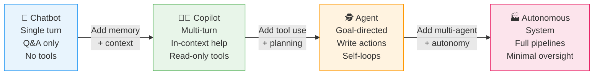
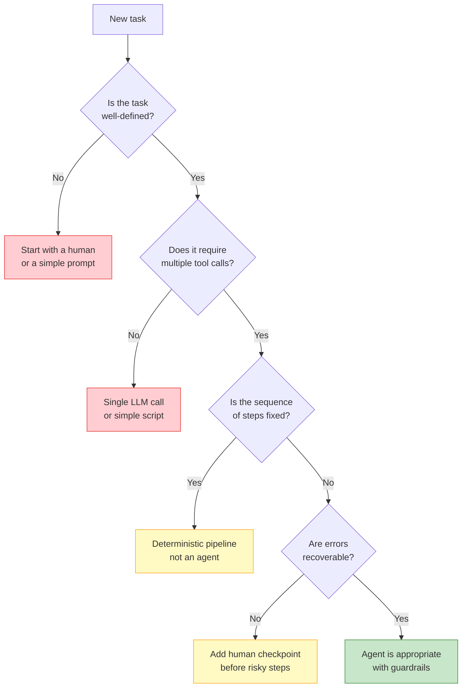

I've been building with language models since the GPT-3 API era, and the single biggest shift I've watched happen isn't a new model benchmark — it's the move from AI as a **question-answering box** to AI as a **thing that actually does work**. That transition has a name: agentic AI.

The term gets thrown around carelessly, so let's lock down exactly what it means, how it evolved, where it's genuinely useful today, and — critically — where you should leave the agents on the shelf and write a for-loop instead.

---

## What Is Agentic AI?

A chatbot responds to a message. An agent pursues a goal.

That's the one-sentence version, but it hides a lot. Here's a more precise definition:

**Agentic AI** is an AI system that can decompose a high-level goal into steps, decide which tools or actions to take at each step, observe the results of those actions, and iterate — with minimal human intervention between steps.

The key word is *iterate*. A ChatGPT session where I paste an error message and get a fix back is not agentic. A system that reads my terminal output, identifies the failing test, edits the source file, re-runs the test suite, sees a new failure, and loops until green — that is agentic.

Three properties define the line:

1. **Persistence across steps** — the system maintains a task state across multiple actions, not just a single prompt-response pair.
2. **Tool use** — the system can call external functions: web search, code execution, file I/O, API calls, database reads.
3. **Self-directed planning** — the system decides its own next action based on what it has observed, rather than waiting for a human to specify every step.

Everything else — multimodality, reasoning models, retrieval-augmented generation — is infrastructure that can make agents better, but none of those properties alone make something agentic.

---

## The Evolution: Chatbots to Autonomous Systems

The AI assistant landscape has moved through four recognizable generations. Most production deployments today sit somewhere in the middle of this spectrum, and understanding where you are matters for choosing the right architecture.



**Generation 1 — Chatbot:** Single-turn Q&A. You type, it responds. No memory between sessions, no tools. Claude.ai, ChatGPT in its original form. Useful for brainstorming and drafting. The AI is a smart search box.

**Generation 2 — Copilot:** Multi-turn conversation with persistent context within a session. Can read from your environment (open files, selected code) and make suggestions, but human executes every action. GitHub Copilot's inline completions live here. Low risk, low autonomy.

**Generation 3 — Agent:** The system plans a sequence of steps, calls tools to execute them, observes results, and continues. The human reviews checkpoints but doesn't drive every turn. Claude Code, Devin, and Cursor's agent mode live here. This is where the ROI gets real and the risk profile gets serious.

**Generation 4 — Autonomous System:** Multi-agent pipelines running without a human in the loop. One orchestrator spawns subagents for research, coding, review, and deployment, waits for results, and synthesizes. AutoGPT, OpenAI's Swarm experiments, and internal enterprise automation pipelines live here. Currently the frontier; reliability is still the dominant constraint.

---

## Core Capabilities of Agentic Systems

Four capabilities separate a capable agent from a glorified autocomplete. All four have to work together for an agent to be useful in production.

### 1. Tool Use

An agent without tools is just a very persistent chatbot. Tool use is the mechanism by which an agent affects the world: running shell commands, calling APIs, searching the web, reading and writing files, querying databases, sending messages. The quality of tool design — clear schemas, typed inputs, reliable error returns — is usually the first thing that limits agent performance in practice.

### 2. Planning

Given a goal, the agent must decompose it into a sequence of feasible steps. Current LLMs handle this through a combination of chain-of-thought reasoning and structured prompting. The planning quality degrades fast on ambiguous goals or when the step count exceeds about 10-15 actions. Experienced teams scope agent tasks to fit within that window.

### 3. Memory

Agents need four kinds of memory:
- **Working memory** — the current context window. Finite, expensive, lossy on long runs.
- **Episodic memory** — a log of what the agent has done in this session. Usually stored externally and retrieved as needed.
- **Semantic memory** — retrieved facts from a knowledge base, docs, or code index.
- **Procedural memory** — the agent's instructions and tool definitions, baked into the system prompt.

Conflating these four causes a huge share of agent bugs. A system that tries to cram all four into one giant context window hits token limits and degrades. A well-designed system pulls from each store selectively.

### 4. Self-Correction

When a tool call fails or an action produces unexpected output, the agent must detect the error, reason about the cause, and try a different approach — not just halt or repeat the same broken step. This requires clear error signals from tools, a reasoning step that actually reads those signals, and retry logic with meaningful variation. Without self-correction, agents become brittle the moment they hit any non-happy-path state.

---

## Levels of Autonomy

Not every task needs full autonomy. A useful mental model maps tasks to one of five autonomy levels. Picking the wrong level — too high or too low — is the most common architecture mistake I see.

| Level | Name | Human Role | Example |
|-------|------|-----------|---------|
| 0 | Manual | Does everything | Writing code in a text editor |
| 1 | Assisted | Accepts/rejects suggestions | GitHub Copilot inline completions |
| 2 | Supervised | Reviews step summaries | Claude Code with `--interactive` |
| 3 | Delegated | Reviews final output only | Devin on a scoped ticket |
| 4 | Autonomous | Exception handling only | Scheduled data pipeline with alerts |

For most software development tasks in 2025, Level 2 or Level 3 is the sweet spot. Level 4 is production-ready for well-defined, idempotent tasks (data transformation, report generation, test execution) but introduces serious risk for tasks that touch production infrastructure or customer data without a human checkpoint.

---

## Real Agentic Systems in Production Today

### Claude Code

Anthropic's terminal-based agent is the tool I use most heavily in my own workflow. Claude Code indexes your repository, runs shell commands, reads test output, edits files, and iterates — all within a conversation thread you can interrupt at any time. What makes it genuinely agentic is the feedback loop: it reads the output of the commands it runs and changes its next action accordingly. It's not just generating diffs and hoping; it's checking its own work.

The practical ceiling right now is tasks that fit within a working session — refactors, feature implementations, debugging chains. Multi-day, multi-PR projects need human checkpoints to keep it on track.

### Devin (Cognition)

Devin is the closest to a fully autonomous software engineer available today. Give it a GitHub issue URL, and it will spin up an environment, plan an implementation, write code, run tests, fix failures, and open a pull request. In controlled benchmarks it performs well on self-contained tasks with clear acceptance criteria. In practice, it struggles on tasks that require deep understanding of undocumented business context — which is most real-world engineering work. Best used for well-scoped, greenfield tasks.

### GitHub Copilot Workspace

Microsoft's answer to agentic coding sits inside GitHub itself. From an issue or a branch, Copilot Workspace lets you generate an implementation plan, turn that plan into code changes across multiple files, and iterate. It's more constrained than Devin or Claude Code — it's firmly at Level 2 on the autonomy scale — but that constraint also makes it safer to use in enterprise environments where audit trails and approvals matter.

### AutoGPT

AutoGPT was the first widely-used demonstration that you could chain LLM calls with tool use into something resembling autonomous behavior. Its influence on the field vastly outweighs its current practical utility. The reliability problems that plagued early AutoGPT — hallucinated tool calls, infinite loops, goal drift — are still the core unsolved problems for Level 4 autonomy. Running AutoGPT today is mostly educational; the lessons it teaches about failure modes are genuinely valuable.

---

## Capability Comparison

```mermaid
radar
    title Agentic Capability Comparison (2025)
    options
        max: 5
    axes
        Tool Use
        Multi-Step Planning
        Self-Correction
        Long Context
        Multi-Agent
    Claude Code: 5, 4, 4, 5, 3
    Devin: 4, 5, 4, 3, 2
    Copilot Workspace: 3, 3, 2, 3, 2
    AutoGPT: 3, 4, 2, 2, 4
```

*Scores are relative assessments based on documented capabilities and hands-on testing, not official benchmarks. The landscape changes fast — verify on current product pages.*

---

## Building Agentic Systems

If you're building rather than buying, the architecture is simpler than most blog posts make it sound. Here's the minimal viable pattern:

**1. Define the task interface clearly.** An agent needs a clear start state (what inputs it receives), a clear success condition (what done looks like), and clear bounds (what it is and isn't allowed to do). Ambiguity at this layer compounds into catastrophic behavior downstream.

**2. Design tools as first-class citizens.** Each tool should have a typed schema, clear documentation in the tool description (the model reads this), explicit error types, and idempotency where possible. A tool that returns vague strings or silently swallows errors will degrade agent performance more than any model quality gap.

**3. Choose a simple control flow first.** A ReAct loop (Reason → Act → Observe → Repeat) is sufficient for most single-agent tasks. Only add a planner-executor split or a multi-agent architecture when you can demonstrate that a single agent fails on the target task class. Over-engineering the control flow before you have data is the most common mistake I see.

**4. Implement structured logging from day one.** Log every tool call, every tool response, every model input and output, every loop iteration. Without this, debugging agent failures is archaeology. With it, failures become reproducible and fixable in minutes.

**5. Add human checkpoints at consequential actions.** Any action that is irreversible (deleting data, sending external messages, deploying code, spending money) should require explicit human approval until you have strong confidence in the agent's judgment on that action class. Build the approval flow into the architecture from the start, not as an afterthought.

---

## Risks and Guardrails

Agentic systems introduce failure modes that don't exist in single-turn AI:

**Prompt injection.** When an agent reads external content (web pages, emails, documents), an adversary can embed instructions in that content that hijack the agent's behavior. Treat all external content as untrusted data, not as trusted instructions. Use separate system prompt channels; don't interpolate external content directly into system prompts.

**Goal drift.** On long tasks, agents can drift from the original objective — especially if intermediate tool results are ambiguous or the task is under-specified. Periodic goal-check steps (where the agent explicitly compares its current state to the original objective) help catch drift before it compounds.

**Irreversible actions.** An agent that deletes the production database while trying to clean up a test schema is not a hypothetical. Every action category should have a reversibility classification, and irreversible actions need human gates.

**Cost runaway.** Agent loops can burn through API tokens and compute at rates that surprise teams used to single-turn costs. Set hard token and dollar budgets at the framework level, not just in documentation.

**Cascading errors.** When step 3 of a 10-step plan silently fails, steps 4-10 often compound the error into something worse than the original failure. Require tools to return explicit success/failure signals, and build in error-detection logic that halts and escalates rather than pushing through.

---

## When Agents Are Overkill

I've spent most of this article on what agentic AI can do. The more important professional skill is knowing when it's the wrong tool.



Use the flowchart honestly. An agent is the right answer less often than the current hype suggests. Deterministic pipelines are faster, cheaper, more debuggable, and more reliable than agents for any task where the steps are known in advance. A script that calls three APIs in sequence is not an agent; it's a script, and that's a compliment.

Agents earn their place on tasks where the required steps depend on intermediate results in ways you genuinely can't predict at design time. Code debugging is a canonical example: you don't know which file is broken until you run the tests, and you don't know which fix to apply until you read the error. That's where the agent's ability to observe-and-adapt earns its overhead.

---

## Industry Adoption

The current adoption picture is clearer than most analyst reports suggest. Software development leads every other vertical, and within software development, two use cases dominate: code generation/completion (mature, widely deployed, high ROI, low risk) and agentic code editing (emerging, high ROI on scoped tasks, moderate risk with proper guardrails).

Outside software: customer support automation is the second-largest deployment category, mostly at Level 2-3 autonomy (agent drafts response, human reviews and sends). Research synthesis — scanning documents, comparing options, generating structured summaries — is growing fast in legal, finance, and enterprise strategy functions.

The pattern across verticals is consistent: agents work best when the task has clear success criteria, the tools are reliable, and there's a human in the loop at consequential decision points. Organizations that skip the "clear success criteria" step and jump straight to autonomy are generating the failure stories you read about on Hacker News.

The honest adoption forecast: Level 2-3 autonomy becomes the default mode for knowledge work by 2027. Level 4 remains a niche for well-defined, low-stakes automation tasks where the cost of an occasional failure is acceptable. Full autonomy for high-stakes decisions (hiring, legal, medical, financial) stays gated behind regulatory and reliability thresholds that current systems don't meet.

---

## Verdict

Agentic AI is a real capability shift, not just marketing. The ability to take a high-level goal, decompose it, call tools, observe results, and iterate produces genuine productivity gains on the right class of problems. I've personally recovered days of work time from agentic coding tools on refactors and debugging sessions I would have done manually.

The failure mode isn't that agents don't work — it's that teams deploy them at the wrong autonomy level, with unclear task boundaries, without guardrails, and then blame "AI" when the predictable failures happen. The technology is ready for production use on scoped tasks. The engineering discipline around it — task design, tool quality, logging, human checkpoints, cost controls — is what separates teams that get ROI from teams that get war stories.

Start at Level 2. Instrument everything. Expand the autonomy radius only when your data says it's safe. That's the boring advice, and it's the correct one.

---

## FAQ

### What is agentic AI in simple terms?

Agentic AI is an AI system that can take actions to pursue a goal across multiple steps, rather than just answering a single question. Instead of waiting for you to specify every action, it plans a sequence of steps, uses tools to execute them, checks the results, and decides what to do next — like having an assistant who can run errands independently rather than needing to be told each individual thing to do.

### How is agentic AI different from a chatbot?

A chatbot gives you a response. An agentic AI takes action. A chatbot can tell you how to fix a bug; an agentic AI can read the failing test output, identify the bug, edit the source file, re-run the tests, verify the fix, and update the documentation — without you driving each step. The difference is whether the AI is an oracle you consult or a collaborator that executes work.

### Is agentic AI safe?

Safety depends on the autonomy level, guardrails, and task type. Agentic systems with human checkpoints on consequential actions, explicit tool permissions, and hard resource budgets are routinely used safely in production. Fully autonomous systems operating on production infrastructure without oversight are not safe at today's reliability levels. The technology is safer than the hype suggests at Level 2-3; it's riskier than the hype suggests at Level 4.

### What are the best agentic AI tools available in 2025?

For software development: Claude Code (terminal-based, excellent for refactors and debugging), Devin (autonomous software engineer, best on scoped tickets), and GitHub Copilot Workspace (GitHub-native, strong enterprise compliance). For general automation: Anthropic's Claude API with tool use, OpenAI's Assistants API, and LangGraph for custom orchestration. The right tool depends on your use case, existing stack, and required autonomy level.

### When should I not use an agentic AI?

Skip the agent when the sequence of steps is fully known in advance (use a pipeline), when the task can be solved in a single model call (use a prompt), when errors are irreversible and you can't build adequate guardrails, or when the overhead of tool design and logging exceeds the time the agent would save. Agents are powerful; they're also expensive and complex to debug. The right answer is often a simpler architecture.
