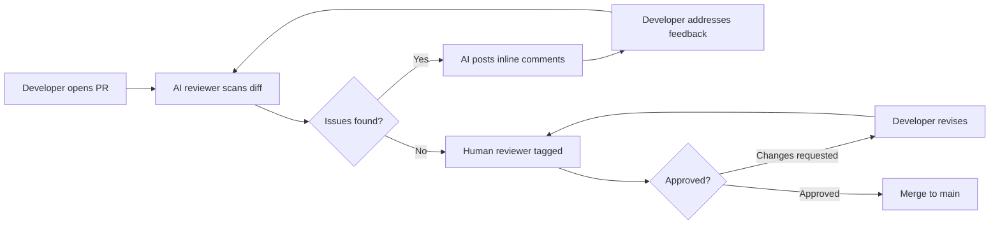
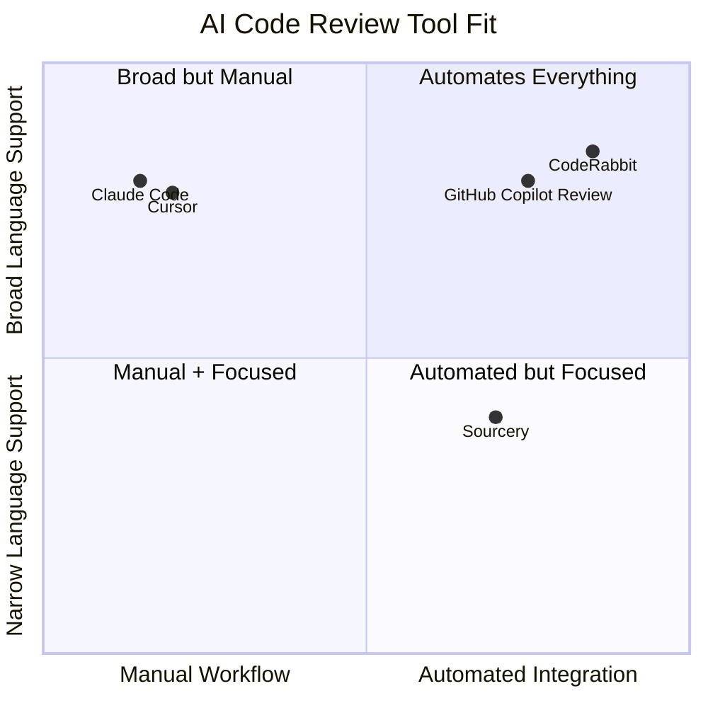
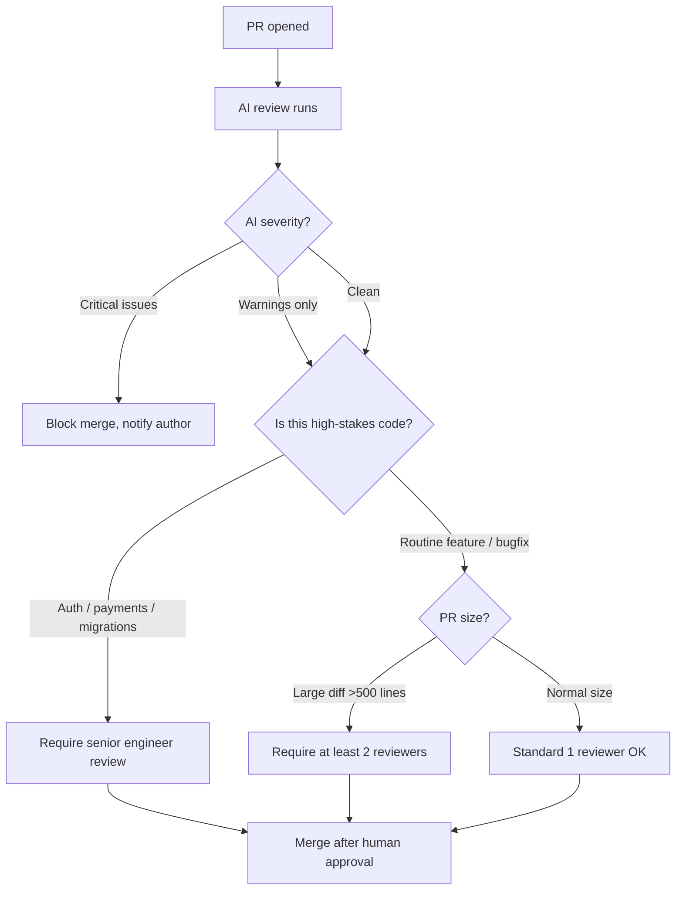

I've sat through enough code reviews to know the pattern: one reviewer spots a typo, one spots a missing null check, and the security concern that should have blocked the PR slips through because everyone assumed someone else caught it. AI code review tools don't solve the human problem, but they handle the mechanical layer reliably — so humans can focus on what actually needs human judgment.

This guide is a buyer's guide and best-practices reference for teams evaluating AI code review tools in 2026. I'll cover the top tools hands-on, compare them honestly, walk through setup, and explain where AI review genuinely helps and where it still needs a human in the loop.

## Why AI Code Review?

Manual code review doesn't scale. As engineering teams grow, review queues balloon, senior engineers become bottlenecks, and the quality of feedback degrades under pressure. The result: reviewers rubber-stamp PRs they don't have time to read carefully, or they focus on style nitpicks while architectural issues go unnoticed.

AI code review tools attack this from three angles:

**Speed.** An AI reviewer can leave its first comment in under 60 seconds from PR open. That's faster than most humans even notice the notification.

**Consistency.** An AI applies the same standards to every PR, every time — it won't skip the security check on a Friday afternoon because it wants to leave early.

**Coverage.** AI can scan the entire diff in one pass, cross-reference related files, and flag issues that a human reviewer might miss because they're focused on one section.

What AI doesn't replace: the senior engineer who recognizes that this PR solves the wrong problem, the teammate who notices the design doesn't match the roadmap, or the architect who spots that this approach creates a future scaling cliff. Those reviews still require human judgment. AI handles the rest.

## How AI Code Review Fits into Your Workflow

The cleanest integration puts AI review as a mandatory first pass before human reviewers are tagged. This means humans see a PR that's already been checked for obvious bugs, style violations, test coverage, and common security issues — freeing them to focus on design, intent, and broader context.



This workflow keeps human review time focused on the higher-value decisions and prevents the common failure mode where reviewers feel obligated to find something — and latch onto style issues because the real problems are hard to spot under time pressure.

## Top AI Code Review Tools

### CodeRabbit

CodeRabbit is purpose-built for AI code review and, in my opinion, the strongest dedicated tool in this category. It integrates directly with GitHub, GitLab, and Bitbucket, and it posts structured review comments on PRs automatically.

What sets CodeRabbit apart is its contextual awareness. It doesn't just look at the diff — it indexes your repository, understands your tech stack, and tracks the evolution of the codebase over time. That means when you change a utility function, it can tell you which callers downstream might break.

**Pricing:** Free tier for open-source repos. Pro is $12/seat/month for private repos, with enterprise pricing available for SSO and self-hosted deployments.

**Best for:** Teams on GitHub or GitLab who want a dedicated AI reviewer with minimal setup.

**Pros:**
- Deep GitHub/GitLab/Bitbucket integration with zero infrastructure to manage
- Repository-wide context, not just diff-level scanning
- Configurable via `.coderabbit.yaml` for custom rules and review focus
- PR summaries that genuinely help reviewers get up to speed fast
- Tracks issues across multiple PRs to spot recurring patterns

**Cons:**
- Free tier limited to open-source; private repos require paid plan
- Occasionally verbose on well-established codebases with mature style guides
- Custom rule configuration requires YAML knowledge upfront

**Verdict:** The best out-of-the-box AI code review experience. If your team doesn't already have an AI reviewer, start here.

---

### GitHub Copilot Code Review

GitHub Copilot's code review feature is newer than its autocomplete core, but it's been maturing quickly. Triggered from a PR via a `/review` comment or configured as an automatic reviewer, Copilot reviews diffs and posts inline comments in the GitHub UI.

The advantage is obvious if you're already paying for Copilot: you get code review capability at no additional per-seat cost. The disadvantage is equally obvious: Copilot review doesn't index your repo the way CodeRabbit does, so it works on the diff in relative isolation.

**Pricing:** Included in GitHub Copilot Business ($19/seat/month) and Enterprise ($39/seat/month). Not available on the individual $10/month plan.

**Best for:** Organizations already on GitHub Copilot Business or Enterprise who want AI review without adding another vendor.

**Pros:**
- Zero additional cost if you're on Copilot Business/Enterprise
- Native GitHub UI — no external service or webhook management
- Reviews triggered on demand or automatically via branch protection rules
- Integrates with Copilot Workspace for multi-step agentic follow-through

**Cons:**
- Limited repository context compared to dedicated tools
- Review quality lags behind CodeRabbit on complex, multi-file changes
- Not available on the individual plan
- Less configurable than standalone tools

**Verdict:** Solid if you're already paying for Copilot Business. Not a strong enough reason to upgrade on its own.

---

### Sourcery

Sourcery started as a Python refactoring tool and has expanded into a broader AI code reviewer that covers Python, JavaScript, TypeScript, and more. It integrates with GitHub and GitLab, runs on PRs, and offers both a cloud service and a local CLI.

What makes Sourcery distinctive is its refactoring focus. Beyond flagging bugs, it actively suggests cleaner implementations — it'll point out that your three-level nested conditional can be flattened, or that a function does too many things. That makes it useful not just for catching mistakes, but for actively improving code quality over time.

**Pricing:** Free for individual developers. Pro starts at $20/month for unlimited private repos. Team plans are available with volume pricing.

**Best for:** Python-heavy teams that want AI review with a strong emphasis on code quality improvement, not just bug detection.

**Pros:**
- Strong Python refactoring suggestions are genuinely useful, not just nitpicky
- Local CLI lets you run reviews before pushing (useful for pre-commit checks)
- GitHub and GitLab integration with automatic PR review
- Clear, actionable inline comments with reasoning

**Cons:**
- Python support far outstrips other languages in depth
- Fewer security-specific checks than dedicated SAST tools
- Less repository-wide context awareness than CodeRabbit

**Verdict:** Best choice for Python teams that want AI review with a code quality improvement angle. For polyglot teams, evaluate coverage for your specific languages first.

---

### Claude Code

Claude Code is Anthropic's terminal-based coding agent. It's not a dedicated code review product — it's an agentic assistant that can, among many things, do thorough code review when you ask it to.

I use Claude Code for the reviews where I want depth over automation. When a PR touches core business logic, I'll paste the diff into Claude Code and ask it to review it like a senior engineer: look for correctness issues, suggest test cases, flag security concerns, and explain any surprising patterns. The quality of that review is consistently high.

Where Claude Code falls short compared to dedicated tools: it doesn't integrate with GitHub to post comments automatically. You're the integration layer — you run the review, read the output, and decide what to action. That's more friction than a PR bot, but it's the right tool when you want a deep, nuanced review of something important.

**Pricing:** Requires an Anthropic API key. Cost depends on usage — Claude Sonnet is $3.00/1M input tokens and $15.00/1M output tokens. A thorough review of a large PR typically uses 10,000-40,000 tokens total, so the cost is well under a dollar per review.

**Best for:** Senior engineers who want high-quality, on-demand reviews of complex PRs without committing to a specific review bot.

**Pros:**
- Exceptional reasoning quality on complex logic and architectural concerns
- Can review across multiple files when you give it full context
- Flexible — you direct the review focus, not a pre-configured ruleset
- No per-seat licensing; you pay per use

**Cons:**
- No GitHub integration — manual copy-paste workflow
- Not suitable for automated, every-PR review coverage
- Quality depends on how well you prompt it
- Requires familiarity with the terminal and API tooling

**Verdict:** A high-quality option for engineers who want AI-assisted review on demand. Pair it with a dedicated review bot for automated coverage and use Claude Code for the PRs that deserve extra attention.

---

### Cursor

Cursor's code review capability is a byproduct of its broader agentic coding approach. Open a PR diff in Cursor, ask the AI to review it, and you get an interactive review session where you can drill into specific concerns, ask follow-up questions, and even have Cursor fix issues directly in the codebase.

The strength here is the interactive workflow. Unlike a bot that posts comments and waits, Cursor lets you have a conversation about the review — "why is that a security risk?" or "show me what the fix would look like" are both answerable inline.

**Pricing:** Pro plan at $20/month includes unlimited fast requests. Business at $40/seat/month adds team management and privacy mode.

**Best for:** Cursor users who want to leverage their existing tool for occasional, interactive code review sessions.

**Pros:**
- Interactive review conversation rather than static comments
- Codebase indexing gives useful project-wide context
- Can fix issues directly in the editor during the review
- Flexible model choice (Claude Sonnet, GPT-4o, Gemini)

**Cons:**
- Not automated — requires manual initiation per PR
- No GitHub PR comment integration; stays in the editor
- At $20/month, expensive if used only for review
- VS Code fork only — JetBrains teams excluded

**Verdict:** Useful for Cursor users as a complement to an automated reviewer, not as a standalone review solution.

---

## Tool Comparison

| Tool | Auto PR Integration | Repo Context | Best Language | Price (team) |
|---|---|---|---|---|
| **CodeRabbit** | Yes (GitHub/GitLab/BB) | Full repo index | Polyglot | $12/seat/mo |
| **GitHub Copilot Review** | Yes (GitHub) | Diff only | Polyglot | Included in Business |
| **Sourcery** | Yes (GitHub/GitLab) | Partial | Python | $20/mo (solo) |
| **Claude Code** | No (manual) | Full (manual) | Polyglot | ~$0.50/review |
| **Cursor** | No (manual) | Full repo index | Polyglot | $20/seat/mo |

---

## Tool Fit by Team Type



## Setting Up AI Code Review

### For CodeRabbit (recommended starting point)

1. Go to [coderabbit.ai](https://coderabbit.ai) and connect your GitHub or GitLab account.
2. Install the CodeRabbit GitHub App on your repositories.
3. Add a `.coderabbit.yaml` file to your repo root to configure review focus:

```yaml
reviews:
  auto_review:
    enabled: true
    drafts: false
  path_filters:
    - "!**/*.lock"
    - "!**/generated/**"
language:
  typescript:
    enabled: true
  python:
    enabled: true
```

4. Open a test PR and verify CodeRabbit posts a review summary within 60 seconds.
5. Add CodeRabbit as a required reviewer in your branch protection rules so no PR merges without its sign-off.

### For GitHub Copilot Code Review

1. Ensure your organization is on Copilot Business or Enterprise.
2. In your repository settings, add `github-copilot` as an automatic reviewer under Branch Protection.
3. Alternatively, trigger on demand with a `/review` comment in any PR.

### For Claude Code on complex PRs

```bash
# Install Claude Code
npm install -g @anthropic-ai/claude-code

# Review a specific PR diff
git diff main...feature-branch > pr-diff.txt
claude "Review this PR diff as a senior engineer. Focus on: correctness, edge cases, security, and test coverage. Be specific about any concerns." < pr-diff.txt
```

## What AI Code Review Catches (and What It Misses)

AI review tools are strong on a predictable class of problems and weak on another. Knowing the split helps you set the right expectations and design the right human review complement.

**What AI catches reliably:**
- Off-by-one errors and boundary condition bugs
- Missing null checks and unhandled error cases
- Obvious security issues: SQL injection patterns, hardcoded credentials, unvalidated inputs
- Dead code and unreachable branches
- Common anti-patterns for the language or framework
- Missing test coverage for new code paths
- Documentation that doesn't match the implementation
- Style and formatting inconsistencies

**What AI regularly misses:**
- Whether the PR solves the right problem
- Business logic correctness when the logic requires domain knowledge
- Performance issues that only appear at production scale
- Architectural concerns about where this code belongs in the system
- Whether a dependency added in this PR creates future upgrade pain
- The human context: was this a quick hack to unblock someone, or is this meant to be permanent?

The practical implication: treat AI review as a quality floor, not a quality ceiling. A PR that passes AI review still needs a human who understands the system and the business goals.

## Best Practices

**Set expectations upfront.** Tell your team what the AI reviewer is supposed to catch and what it won't catch. If people treat AI approval as sufficient, you'll ship bugs that a human would have caught. If people ignore AI feedback entirely, you're wasting the tool.

**Configure your tool to match your standards.** Out-of-the-box rules are generic. Take an hour to configure your AI reviewer around your actual standards: which paths to ignore, which rules matter most, what severity levels trigger blocking reviews.

**Don't let AI review replace engineering judgment on high-stakes PRs.** PRs that touch authentication, payment processing, data migrations, or core infrastructure should always get a senior human review in addition to AI review. Use AI to free up that senior reviewer's time on the routine PRs, not to replace them on the critical ones.

**Review the AI's comments together sometimes.** During onboarding and periodically after, have the team review AI feedback together. This calibrates expectations, surfaces misconfigured rules, and builds shared understanding of what the tool does and doesn't catch.

**Use AI summaries to orient human reviewers.** CodeRabbit and Copilot both generate PR summaries. Encourage human reviewers to read the AI summary first — it's a faster onboarding to the PR than reading the entire diff cold.

**Track which issues AI consistently misses in your codebase.** If the same class of bug keeps slipping through, that's either a configuration problem (add a custom rule) or a fundamental limitation of the tool (add a human checklist item for that category).

## When to Escalate to Human Review



## Security Considerations

AI code review can catch common security patterns, but it's not a replacement for dedicated security tooling. Use it as a complement, not a substitute.

**What to pair with AI review:**
- Static application security testing (SAST) tools like Semgrep, Snyk, or SonarQube for comprehensive vulnerability scanning
- Secret scanning tools (GitHub Secret Scanning, truffleHog) to catch credentials before they land in history
- Dependency scanning for known CVEs in your supply chain

**What to configure explicitly:**
- Ensure your AI reviewer is set to flag security-relevant patterns: direct SQL string construction, `eval()` usage, hardcoded tokens, unvalidated redirects, and similar high-risk patterns
- For repos that handle PII or financial data, consider a stricter rule profile or a dedicated security-focused review step

**Data privacy with AI review tools:**
- All the tools above send your code to external APIs for analysis
- For highly sensitive codebases, check each vendor's data retention and training policies before enabling
- GitHub Copilot Business and Enterprise offer an "IP protection" mode where your code is not used for training
- CodeRabbit offers self-hosted enterprise deployment for air-gapped or highly regulated environments

## Verdict

For most teams, the right answer is: **CodeRabbit as the automated reviewer on every PR, plus Claude Code or Cursor for the PRs that deserve deeper human attention.**

CodeRabbit handles the mechanical layer automatically — it posts comments, blocks merges on critical issues, and summarizes PRs for human reviewers. That's the right tool for keeping quality consistent across a high-throughput PR queue.

Claude Code and Cursor fill a different role: on-demand, high-quality review for the PRs where you want to think carefully, not just scan quickly. That might be a refactor of core business logic, a new authentication flow, or a dependency upgrade that touches half the codebase.

GitHub Copilot's review feature is a reasonable add-on if your organization is already paying for Business or Enterprise — but it's not the place to start if you're building a review workflow from scratch.

Sourcery is worth evaluating if your team is Python-heavy and you want a tool that actively improves code quality over time, not just flags problems.

---

## FAQ

### Does AI code review slow down our PR process?

The opposite, for most teams. The typical friction point in PR review is waiting for a human reviewer to get to the PR. AI reviews post in under 60 seconds, and because they clear the mechanical issues first, human reviewers spend less time on routine feedback. Teams that deploy AI review consistently report faster cycle times and shorter review queues.

### Can I use AI code review on open-source repositories without paying?

Yes. CodeRabbit offers a free plan for open-source repositories. GitHub Copilot's review feature is available on public repositories. Claude Code costs per API token regardless of repository visibility, but the per-review cost is low enough to be effectively free for most usage.

### Will AI review comments frustrate my developers?

It depends on how it's introduced. If AI review arrives unannounced and starts blocking PRs with nitpick comments, expect pushback. If you configure it thoughtfully, set team expectations clearly, and start with warnings rather than blocking issues, most developers find it useful within a few weeks. The teams that succeed treat the AI reviewer like a new team member: give it a role, set expectations, and calibrate its behavior based on feedback.

### How do I handle false positives from AI review?

Most tools support dismissing or thumbs-downing individual comments, and that feedback improves the tool over time. For systematic false positives — rules that fire on legitimate patterns in your codebase — configure path filters and custom rule suppression in your tool's config file. Build the habit of configuring the tool rather than ignoring its output; a review where developers ignore half the comments is worse than a well-tuned review that developers actually read.

### Is AI code review good enough to replace code review entirely?

No, and the tools themselves will tell you that. AI review is a quality floor — it catches what a careful checklist would catch. It doesn't replace the engineer who understands why a change is happening, whether the approach fits the system architecture, or whether the business logic is actually correct. The right frame is: AI review handles the mechanical layer so human reviewers can focus on the things that require human judgment.
