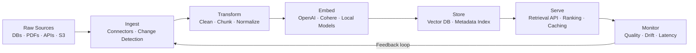
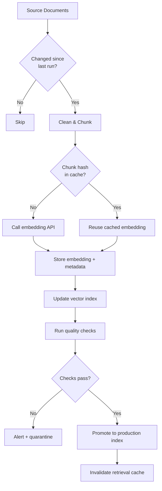
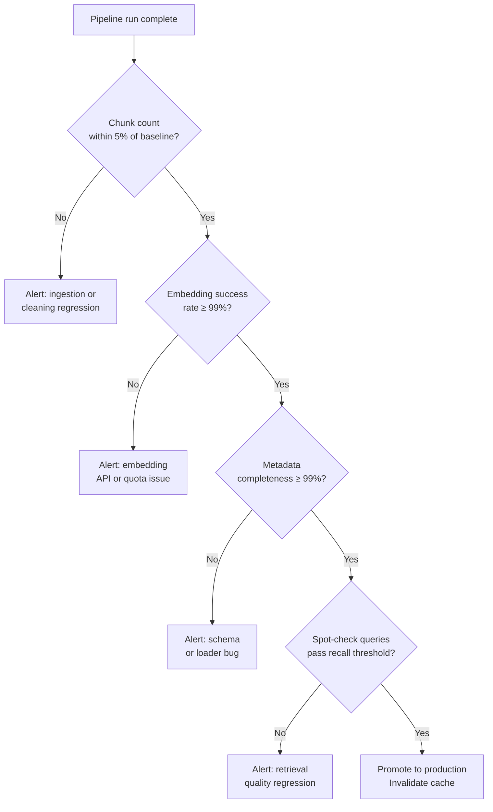

Last year I helped a team ship a RAG-powered internal search tool that worked beautifully in demos and fell apart in production within two weeks. The culprit was not the model, the vector database, or the prompt. It was the data pipeline — a loose collection of Python scripts that no one had thought of as infrastructure. Documents were re-embedded on every run, embeddings were silently overwritten when upstream text changed, and there was zero monitoring on chunk quality. The search results degraded slowly until users stopped trusting the tool entirely.

That experience taught me that AI data pipelines deserve the same engineering rigor as any production service. This guide covers what I wish I had known then: how to design ML data pipelines that hold up under real workloads, what tools to use, and how to avoid the mistakes that kill RAG and ML projects before they reach users.

## What Are AI Data Pipelines?

An AI data pipeline is the set of automated stages that move raw data from its source into the form a model can actually use — and keep that data fresh, clean, and auditable as the source changes over time.

Traditional ETL (Extract, Transform, Load) was designed for analytics warehouses: structured tables, predictable schemas, batch runs. ML data pipelines extend that concept in several directions at once. They have to handle unstructured content — PDFs, Slack threads, code, HTML — alongside structured records. They have to produce embeddings, not just rows. They have to serve retrieval latency budgets that analytics pipelines never cared about. And they have to do all of this while models, schemas, and business requirements keep changing underneath them.

The stakes are higher than people expect. A traditional BI pipeline with a bug produces wrong numbers that someone might catch in a dashboard review. An ML data pipeline with a bug produces wrong embeddings that silently degrade every downstream AI feature — often without any obvious error signal. Getting the pipeline right is not optional if you want AI features that actually work.

## Architecture: From Ingest to Serve

Here is the architecture I use as a starting point for any new AI data pipeline. Every stage has a clear input, output, and failure mode.

**Ingest** pulls data from wherever it lives. This might be Postgres change-data-capture, S3 event notifications, a web crawler, a Confluence API poller, or a webhook from a SaaS product. The key property is that ingest must detect *what changed*, not just re-pull everything every run. Incremental ingest is what keeps compute costs manageable as your corpus grows.

**Transform** is where the real work happens. Raw documents get cleaned (strip boilerplate, fix encoding, remove duplicates), chunked into retrieval-sized pieces, and normalized into a consistent schema. Chunking strategy alone can make or break retrieval quality — more on that below.

**Embed** calls the embedding model and produces vectors. This stage is expensive per token and has latency variance, so it benefits from batching, retry logic, and caching of unchanged chunks.

**Store** writes vectors and their associated metadata to a vector database. Metadata matters enormously here: document ID, source URL, timestamp, version, and any filtering dimensions (team, product, language) need to travel alongside the vector.

**Serve** is the retrieval layer: approximate nearest-neighbor search, optional re-ranking, and the API your application actually calls. This stage owns latency SLAs.

**Monitor** closes the loop. Without it, you are flying blind.

## ETL vs ELT for ML Projects

Traditional data engineering has been debating ETL versus ELT for years. For ML pipelines the answer is context-dependent and worth thinking through carefully.

**ETL (Extract → Transform → Load)** transforms data before it reaches the destination store. This is the right pattern when transformation is computationally heavy, when the destination store is not suited for raw data, or when you want strict quality gates before data reaches production. Most AI pipelines that do chunking and embedding fall naturally into ETL — you would never want raw 50-page PDFs sitting in your vector database.

**ELT (Extract → Load → Transform)** loads raw data first, then transforms in-place. This pattern shines when you want to preserve raw fidelity for reprocessing, when transformation logic evolves quickly, or when you are using a compute-rich warehouse like BigQuery or Snowflake for transformation. Many ML teams use a hybrid: ELT for the raw document lake, then ETL for the embedding pipeline that reads from it.

The practical rule I follow: **land raw, reprocess fast**. Store the original source documents in cheap object storage (S3, GCS) with versioning. The embedding pipeline reads from there. When you change your chunking strategy or swap embedding models, you can reprocess the entire corpus from the raw layer without touching the source systems again. This has saved me from several painful conversations with data owners about re-pulling data.

One important ML-specific consideration: ELT works well for structured data transformations, but embedding is stateful in a way that pure SQL transformations are not. A chunking function run in 2024 may produce different chunks than the same function run in 2026 if the underlying library changed. Version your transformation logic as carefully as you version your models.

## Key Components of an ML Data Pipeline

### Data Ingestion

Good ingestion is boring and reliable. It handles authentication, retries, rate limiting, and change detection. The two patterns I use most are:

- **Change-data-capture (CDC)** for databases: Debezium or native Postgres logical replication gives you a stream of row-level changes without polling.
- **Webhook + queue** for SaaS sources: the SaaS product pushes change events to an SNS topic or Pub/Sub queue; your ingestion worker processes them asynchronously.

Avoid polling on short intervals. It scales poorly and hammers source systems. If a source does not support webhooks, poll at 15–60 minute intervals and use etags or last-modified headers to skip unchanged content.

### Data Cleaning and Chunking

Cleaning removes noise that hurts retrieval: HTML tags, repeated navigation boilerplate, encoding artifacts, near-duplicate passages. Chunking splits documents into pieces that fit within retrieval context windows while preserving semantic coherence.

The chunking decisions that matter most in practice:

- **Chunk size**: 256–512 tokens is a good starting range for most retrieval tasks. Smaller chunks give higher retrieval precision; larger chunks give more context per result. Test both.
- **Overlap**: 10–20% overlap between adjacent chunks prevents important sentences from being split across a boundary where neither chunk contains enough context.
- **Semantic boundaries**: split on paragraph or section breaks rather than fixed token counts when the source has clear structure. A heading-aware chunker outperforms a naive splitter on documentation corpora.
- **Metadata attachment**: each chunk should carry the parent document ID, section title, page number, and any taxonomy tags. Retrieval filters on metadata are far faster than re-ranking.

### Embedding Generation

Embedding models convert chunks into dense vectors that encode semantic meaning. Key decisions:

- **Model choice**: OpenAI `text-embedding-3-large` and Cohere `embed-v4` are strong general-purpose choices. For domain-specific text (medical, legal, code), a fine-tuned or domain-specific model often outperforms general embeddings significantly.
- **Dimensionality**: higher dimensions capture more nuance but cost more storage and increase query latency. `text-embedding-3-large` supports Matryoshka reduction — you can truncate to 256 or 512 dimensions with minimal quality loss for many tasks.
- **Batching**: embed in batches of 100–500 chunks rather than one-at-a-time. Most embedding APIs allow large batches and the throughput improvement is substantial.
- **Cache unchanged chunks**: hash each chunk's content before embedding. If the hash matches a stored record, skip the embedding call. On a corpus with 90% stability run-to-run, this cuts embedding cost by 90%.

### Vector Storage

Your vector database stores embeddings and serves ANN queries. The main contenders and their tradeoffs:

- **Pinecone**: fully managed, simple API, good for teams that want zero operational overhead. Pricing scales with vector count and query volume.
- **Weaviate**: open source, rich filtering, supports hybrid search (BM25 + vector) natively. Can be self-hosted or cloud.
- **Qdrant**: fast, Rust-based, excellent filtering, good Kubernetes operator. My preference for self-hosted deployments.
- **pgvector**: if you already run Postgres, pgvector is compelling for corpora under ~10M vectors. One fewer infrastructure component, and you get SQL joins for free.

Choose based on your operational constraints first, query patterns second. A managed service that costs 2× more than self-hosted is often worth it for a small team that does not want to run stateful infrastructure.

## Building a RAG Data Pipeline

RAG (Retrieval-Augmented Generation) is the most common reason teams build AI data pipelines today. Here is the specific workflow I use for production RAG systems.

The most important pattern in this workflow is the **hash-based embedding cache**. Every chunk gets a SHA-256 of its text before the embedding call. If that hash exists in your metadata store with a valid embedding, you skip the API call entirely. On a corpus that changes 10% per run, this means 90% of your embedding budget goes toward genuinely new or changed content.

The second important pattern is **index promotion**. Never write directly to the production index. Write to a staging index, run quality checks (chunk count sanity, embedding dimensionality, metadata completeness, spot-check retrieval on known queries), and then swap the index alias to point at staging only when checks pass. This prevents a bad pipeline run from degrading production retrieval.

The third pattern is **retrieval cache invalidation**. If you cache retrieval results at the application layer (you should, for latency), a pipeline run that updates documents must invalidate stale cache entries. Tag cache entries with document IDs so you can invalidate selectively rather than flushing everything.

## Tool Comparison: Orchestrating Your ML Pipeline

| Tool | Best For | Strengths | Weaknesses |
|------|----------|-----------|------------|
| **Apache Airflow** | Large orgs with existing data infra | Mature ecosystem, rich UI, broad integrations | Heavy ops overhead, steep learning curve, XML-era DAG concepts |
| **Prefect** | Python-native teams wanting flexibility | Simple Python-first API, hybrid execution, good observability | Smaller community than Airflow, cloud features cost extra |
| **Dagster** | Asset-centric ML pipelines | Data asset modeling, lineage tracking, great for ML workflows | More opinionated, more setup than Prefect |
| **LangChain / LlamaIndex** | Rapid RAG prototyping | Rich document loaders, chunking utilities, LLM integrations | Not a real orchestrator; production pipelines need a real scheduler |

My honest recommendation: use **Dagster** if you are building a serious ML data pipeline from scratch in 2025. Its asset-based model maps naturally to the stages of an AI pipeline — each asset (raw document, cleaned chunk, embedding, vector index) has lineage, freshness policies, and materialization history. That makes debugging and reprocessing far easier than imperative DAG frameworks.

Use **Prefect** if you need something running fast and your team already thinks in Python tasks rather than data assets.

Do not use LangChain or LlamaIndex as your orchestrator. They have excellent utilities for document loading and chunking, but they are not schedulers. Use them as libraries within a Dagster or Prefect pipeline, not as the pipeline framework itself.

## Real-World Patterns That Actually Work

**Pattern 1: The dual-write index.** Maintain a "hot" index for documents from the last 30 days and a "cold" index for older content. Run hot-index updates on every pipeline run (fast, small). Run cold-index updates weekly (slow, large). At query time, search both and merge results. This dramatically reduces the latency of your update cycle for recent documents without requiring expensive full-corpus re-indexing on every run.

**Pattern 2: Metadata-first filtering.** Before doing vector search, apply hard filters on metadata: document type, team, language, date range. A corpus of 10M chunks filtered to 50K before vector search is faster and more precise than ANN search across all 10M. Design your metadata schema before you design your chunking strategy.

**Pattern 3: Parent-child chunking.** Embed small chunks (128 tokens) for high-precision retrieval, but return the parent section (512 tokens) as the context window. The small chunk wins the ANN competition; the large chunk gives the LLM enough context to answer well. LlamaIndex has a built-in `ParentDocumentRetriever` for this pattern.

**Pattern 4: Embedding model versioning.** When you upgrade your embedding model, old and new embeddings are not comparable — cosine similarity between them is meaningless. Maintain a `embedding_model_version` field in your metadata. Reprocess the entire corpus on model upgrade, or run two indexes in parallel during the transition. Treat an embedding model upgrade like a database migration: it requires a plan and a rollback path.

## Monitoring Data Quality

Most ML data pipeline failures are silent. A run completes successfully, logs show green, and the quality of downstream retrieval quietly degrades. Monitoring is the only way to catch these failures before users do.

The metrics I instrument on every pipeline:

- **Chunk count delta**: if a run produces 20% fewer chunks than the previous run, something is wrong with ingestion or cleaning. Alert on deviations above 5%.
- **Embedding success rate**: what fraction of chunks were successfully embedded? Failures often silently zero-vector a chunk rather than raising an exception.
- **Metadata completeness**: what fraction of chunks have all required metadata fields? Missing document IDs or timestamps will break filtering downstream.
- **Retrieval spot-checks**: a small set of known queries with known good answers, run after every pipeline update. If top-3 recall on spot-check queries drops, the pipeline broke something.
- **Embedding drift**: periodically compute cosine similarity between a sample of new embeddings and the historical embeddings for the same document. Large drops signal encoding bugs or silent model changes.

The decision logic for when to promote a new index looks like this:

Plug these checks into whatever alerting system your team already uses. PagerDuty, Slack webhooks, or a simple email are all fine. The important thing is that a pipeline run that fails quality checks never silently promotes to production.

## Common Pitfalls

**Chunking too large or too small.** A common mistake is using the model's maximum context length as the chunk size. 8K-token chunks hurt precision; the retrieved chunk contains the answer plus a lot of irrelevant text that confuses the LLM. Start at 512 tokens, measure retrieval precision, and adjust from there.

**No deduplication.** Many source corpora contain duplicate or near-duplicate documents: wiki pages that were copied, emails forwarded multiple times, PDFs uploaded by different users. Without deduplication, the same content gets embedded multiple times and occupies disproportionate retrieval slots. Run MinHash LSH or simple exact-hash deduplication at the cleaning stage.

**Re-embedding unchanged documents.** Every pipeline run calling the embedding API for the entire corpus is not a data pipeline — it is a billing alarm waiting to go off. Implement hash-based caching on day one, not as a later optimization.

**Ignoring metadata at design time.** Adding filtering dimensions to your metadata schema after you have already embedded 2M chunks requires re-indexing everything. Think about what you will want to filter on — team, document type, language, date range, product area — before you design your first chunk schema.

**No staging environment.** Writing directly to the production vector index from a pipeline that might have a bug is a fast path to a production incident. Always stage, check, then promote.

**Using LLMs for data cleaning.** Calling an LLM to clean or summarize chunks during pipeline execution is expensive and slow at scale. Use deterministic cleaning rules (regex, HTML parsers, language detection libraries) for the pipeline. Reserve LLM calls for the retrieval layer.

## Verdict

An AI data pipeline is not a side concern you bolt onto your ML project after the interesting parts are done. It is the foundation. A great model with a mediocre pipeline produces mediocre AI features. A mediocre model with a great pipeline produces AI features that actually work and can be improved over time.

The core decisions that matter most: choose incremental ingestion from the start, implement hash-based embedding caching before you go to production, version your embedding model alongside your chunks, and instrument quality checks that run automatically after every pipeline update.

If I had to pick one tool for new projects in 2025, I would choose Dagster for orchestration, Qdrant for self-hosted vector storage or Pinecone for managed, and OpenAI's `text-embedding-3-large` with Matryoshka reduction as a default embedding model until domain-specific evaluation says otherwise.

Build the pipeline like infrastructure. Test it like software. Monitor it like a production service. Everything else — the models, the prompts, the UI — can be improved iteratively once the pipeline is solid.

## FAQ

### What is the difference between an AI data pipeline and a traditional ETL pipeline?

Traditional ETL pipelines move structured data between relational systems — tables in, tables out. AI data pipelines handle unstructured content, produce vector embeddings as a primary output, and must support retrieval latency budgets that analytics pipelines never cared about. They also have unique failure modes: silent embedding errors, chunk boundary problems, and embedding model drift that have no analog in SQL-based ETL.

### How often should an ML data pipeline run?

It depends on how quickly your source data changes and how stale your users can tolerate the index being. For internal knowledge bases that change daily, a nightly pipeline run is usually sufficient. For customer-facing features with high-frequency data updates (support tickets, product listings), you want near-real-time pipelines triggered by change events rather than scheduled batch runs.

### Can I use the same embedding model for all document types?

General-purpose embedding models like OpenAI `text-embedding-3-large` or Cohere `embed-v4` perform well across a wide range of content. However, for highly domain-specific corpora — medical literature, legal contracts, source code — a domain-specific or fine-tuned embedding model often improves retrieval recall meaningfully. Run a retrieval benchmark on a sample of your actual data before committing to a model choice.

### What should I do when I need to change my chunking strategy in production?

Treat it like a schema migration. Keep the existing index serving production while you reprocess the corpus with the new chunking strategy into a separate staging index. Run your full suite of quality checks and spot-check queries against the staging index. When staging passes, swap the alias. Keep the old index around for at least 48 hours in case you need to roll back.

### How do I handle personally identifiable information (PII) in an AI data pipeline?

PII must be handled before it reaches the embedding model and the vector store. Add a PII detection and redaction stage in your transform layer using tools like Microsoft Presidio or AWS Comprehend's PII detection. Log what was redacted for audit purposes, but never store the original PII values in your pipeline metadata. For documents with high PII density, consider whether they should be in the RAG corpus at all, or whether access controls at the retrieval layer are sufficient.
