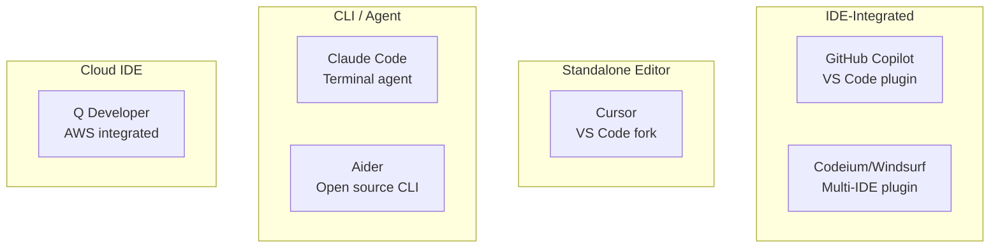
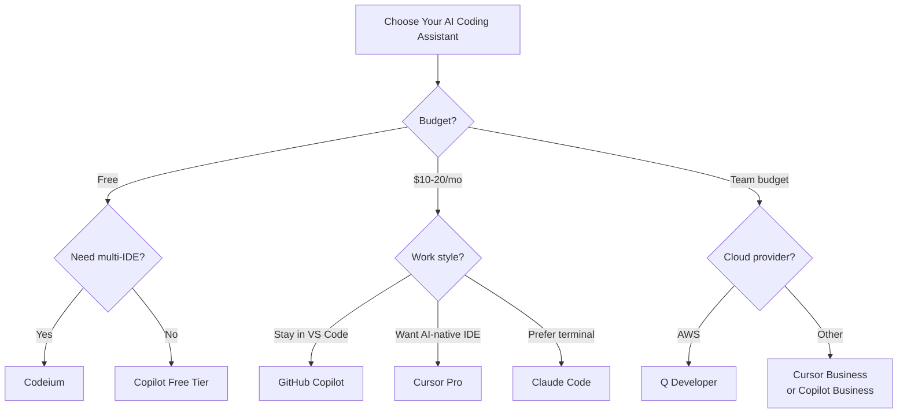

The AI coding assistant market exploded in 2025. What started as a handful of tab-completion experiments has grown into a crowded field of sophisticated tools that can write entire functions, refactor modules, run terminal commands, and hold a multi-turn conversation about your codebase. The problem is no longer "does this exist?" — it's "which one is actually worth paying for, and for whom?"

This guide cuts through the noise. We tested the major players hands-on across real projects in TypeScript, Python, and Go, evaluated their pricing models honestly, and put together a decision framework you can use to pick the right tool for your situation. Whether you're a solo developer watching your budget or an engineering leader buying seats for a hundred-person team, there's a meaningful difference between these products — and the wrong choice costs real money and time.

---

## Our Top Picks

> **Best Overall:** GitHub Copilot — deep IDE integration, solid team features, and the largest install base means the most institutional knowledge baked in.
>
> **Best Free Option:** Codeium (now Windsurf) — genuinely capable free tier with no token limits that makes it easy to recommend to students and budget-constrained developers.
>
> **Best for Teams:** Cursor — the agent mode and codebase indexing make it stand out for collaborative projects where context across files matters more than raw autocomplete speed.
>
> **Best CLI / Agentic Tool:** Claude Code — if your workflow lives in the terminal and you need an assistant that can actually reason about a complex codebase without hand-holding, this is it.

---

## GitHub Copilot

GitHub Copilot is the tool that normalized AI pair programming. Launched in 2021 and now deeply embedded in VS Code, JetBrains IDEs, Visual Studio, and Neovim, Copilot has had years to mature while competitors are still finding their footing. That experience shows in the polish of the inline suggestions and the reliability of the basic autocomplete flow.

The 2025 Copilot upgrade added agent-mode capabilities under the name Copilot Workspace — a GitHub-native environment where Copilot can plan a multi-step implementation, create branches, open pull requests, and iterate based on CI feedback. For teams that live in GitHub, this tight integration is a genuine advantage.

**Pricing:** Individual plan starts at $10/month. The Business plan runs $19/seat/month and adds organization policy controls, audit logs, and IP indemnity. Enterprise is $39/seat/month and adds Copilot Workspace, fine-tuning on private codebases, and advanced admin controls.

**Best for:** Teams already invested in the GitHub ecosystem who want consistent, low-friction autocomplete across multiple IDEs.

**Pros:**
- Widest IDE support of any tool in this category
- Strong autocomplete that handles boilerplate and repetition well
- Copilot Chat covers code explanation, test generation, and PR summaries natively in VS Code
- Business/Enterprise tiers have serious compliance features (SOC 2, GDPR, IP indemnification)
- GitHub native: Copilot Workspace bridges the gap between chat and actual repo changes

**Cons:**
- At $10/month individual, it's no longer the cheap option — Codeium does more for free
- Copilot Workspace is still rough around the edges; the planning step often needs manual correction
- Context window for inline completions is smaller than Cursor's codebase-indexed approach
- The multi-model option (GPT-4o vs Claude Sonnet) is useful but adds configuration overhead

**Verdict:** If you're on a team using GitHub and you need something that just works with minimal setup, Copilot remains the safe default. The Enterprise tier is genuinely useful for larger organizations. For solo developers on a budget, look at Codeium first.

---

## Cursor

Cursor is the tool that most seriously challenged Copilot's dominance in 2025. Built as a VS Code fork rather than an extension, Cursor bets that a dedicated editor can do things a plugin never can — and that bet has largely paid off.

The signature feature is Cursor's codebase indexing. It builds a semantic index of your entire repository, which means when you open a chat or trigger an agent action, the model gets relevant context pulled from across your project rather than just the currently open file. In practice, this makes a huge difference for refactors, cross-file reasoning, and "why is this breaking?" investigations.

Cursor's agent mode is the most capable we tested. It can write files, run terminal commands, read error output, and iterate — all with a review step before changes land. We used it to migrate a 4,000-line Python service from one ORM to another, and it handled roughly 60% of the mechanical work correctly on the first attempt.

**Pricing:** Free tier allows limited completions. The Pro plan is $20/month and includes unlimited fast completions and a generous allowance of premium model requests. Business is $40/seat/month and adds team management, SSO, privacy mode, and centralized billing.

**Best for:** Individual developers and small-to-medium teams doing complex, multi-file work who want the most capable agent mode available.

**Pros:**
- Codebase indexing gives the model genuinely useful project context
- Agent mode is the most capable and controllable we tested
- Multi-model support (Claude 3.5 Sonnet, GPT-4o, Gemini) lets you route tasks to the right model
- Fast inline completion that rivals Copilot on day-to-day autocomplete
- `.cursorrules` file gives you fine-grained control over model behavior per project

**Cons:**
- It's a fork of VS Code, not an extension — JetBrains users are out of luck
- $20/month is meaningfully more expensive than Copilot's individual tier
- Codebase indexing occasionally surfaces irrelevant context and confuses the model
- Agent mode can go off-rails on large tasks without careful system prompt guidance
- The Business tier at $40/seat gets expensive fast for larger organizations

**Verdict:** Cursor is the best choice for developers who want the most powerful AI-assisted coding experience and are willing to commit to the editor. If you're on VS Code already, the switch is nearly painless. If you're on JetBrains, you'll need to weigh that trade-off carefully.

---

## Claude Code

Claude Code is Anthropic's answer to the "what if the AI assistant lived in your terminal?" question. It's not an IDE extension — it's a CLI tool that you run from your project root and interact with through a conversation interface in the terminal.

This sounds like a step backward, but in practice it's a different kind of tool that targets a different workflow. Claude Code can read your entire codebase, run shell commands, write files, and reason about complex multi-step problems in a way that feels closer to pairing with a thoughtful senior engineer than using an autocomplete tool. The model quality (Claude 3.5 Sonnet and Opus) is genuinely excellent for reasoning about architecture, debugging tricky issues, and writing well-structured code that fits existing patterns.

The agentic behavior is controlled and conservative by default — Claude Code will ask before running destructive commands and shows you what it's about to do before doing it. This makes it more suitable for developers who want to stay in the loop rather than those who want maximum autonomy.

**Pricing:** Claude Code uses Anthropic's API directly, so you pay for tokens consumed. Light usage (a few hours of development work per day) typically runs $20-50/month. Heavy agentic use with large codebases can push significantly higher. There's no flat subscription — it scales with use.

**Best for:** Senior developers and teams who want terminal-native AI assistance with strong reasoning, without being tied to a specific IDE.

**Pros:**
- Best reasoning quality of any tool tested for complex problems and architecture discussions
- Terminal-native workflow integrates cleanly with existing scripts, git hooks, and CI tools
- Conservative by default — explains what it will do and asks for confirmation
- Reads entire codebases, not just open files
- No IDE lock-in: works anywhere you have a terminal

**Cons:**
- Usage-based pricing is unpredictable — costs can spike on large agentic tasks
- No inline autocomplete; it's conversational, not tab-completion
- Terminal interface has a learning curve compared to IDE-integrated tools
- Requires an Anthropic API key and some CLI comfort to get started
- Not the right tool if you primarily want fast autocomplete suggestions

**Verdict:** Claude Code is the right choice if you do complex greenfield work or serious refactoring and you want a tool that can reason deeply rather than just complete lines quickly. The API pricing model is a real trade-off; set a spending limit in the Anthropic console and track it weekly.

---

## Amazon CodeWhisperer (now Q Developer)

Amazon rebranded CodeWhisperer as Amazon Q Developer in 2024, folding it into a broader suite of AI-powered developer tools for the AWS ecosystem. If you're building on AWS, Q Developer is worth understanding — it has tighter integration with IAM, CloudFormation, and the AWS SDK than any other tool.

For general-purpose coding, Q Developer is competent but not class-leading. The autocomplete is reliable on common patterns, and the chat interface covers the basics well. Where it distinguishes itself is AWS-specific work: generating CloudFormation templates, debugging Lambda functions, and understanding IAM policy syntax. Developers who spend a significant portion of their time on AWS infrastructure get more from Q Developer than from tools that treat AWS as just another API.

**Pricing:** The Individual tier is free, with a monthly limit on code suggestions and chat interactions that's generous enough for casual use. The Pro tier is $19/user/month and removes limits, adds organizational features, and enables integration with enterprise identity providers.

**Best for:** AWS-heavy shops and developers who want a free capable assistant without giving data to non-AWS providers.

**Pros:**
- Individual tier is genuinely free with no credit card required
- Deep AWS integration: best-in-class for CloudFormation, CDK, Lambda, and IAM
- Security scanning built in, flags common vulnerability patterns as you type
- Works in VS Code, JetBrains, and the AWS Cloud9 environment
- Data stays within AWS infrastructure — appealing for teams with cloud provider commitments

**Cons:**
- General coding quality trails Copilot, Cursor, and Claude Code on non-AWS work
- The rebrand to Q Developer fragmented the documentation — setup can be confusing
- Free tier limits on chat interactions are lower than Codeium's free offering
- Less active community and fewer third-party integrations than Copilot

**Verdict:** Q Developer makes the most sense as a free Copilot alternative for developers doing significant AWS work, or for organizations that need to keep code assistance within the AWS trust boundary. For pure coding quality, it's not the frontrunner.

---

## Codeium / Windsurf

Codeium launched as the "actually free Copilot alternative" and earned serious traction by delivering a capable experience at no cost. In late 2024, Codeium introduced Windsurf, their dedicated editor product (Cursor's direct competitor), while keeping the Codeium extension free across VS Code, JetBrains, Neovim, and a dozen other editors.

The free tier is the headline: unlimited autocomplete suggestions, no usage caps, and a chat interface — all without a credit card. For students, hobbyists, and developers evaluating AI assistance for the first time, Codeium is the obvious starting point.

Windsurf, the editor, added a notable feature called Flows — a collaborative agent mode where the AI can take longer-horizon actions across your codebase with a degree of context awareness that approaches Cursor's indexed mode. It's not quite at Cursor's level yet, but the trajectory is good and the pricing is more accessible.

**Pricing:** Codeium extension is free, permanently, with no artificial limits. Windsurf editor has a free tier with limited Flows credits. The Pro plan is $15/month and increases Flows credits. Teams plan is $35/user/month.

**Best for:** Budget-conscious developers who want capable AI assistance without a subscription, and teams evaluating AI coding tools before committing.

**Pros:**
- The free tier is the most capable in the market — no hidden limits on autocomplete
- Widest editor support of any tool (30+ editors and IDEs)
- Windsurf's Flows mode is a credible Cursor competitor at a lower price
- Fast autocomplete with low latency, even on the free tier
- Active development pace — product has improved substantially each quarter

**Cons:**
- Free tier uses older model checkpoints; Pro gets access to better models
- Windsurf is newer and has fewer polish hours than Cursor or Copilot
- Flows can be inconsistent on large codebases — context quality varies
- Enterprise features and compliance certifications are less mature than Copilot Business

**Verdict:** Start with Codeium's free extension. If you like it and want more agentic capability, try Windsurf Pro at $15/month before committing to Cursor at $20/month. For teams with existing compliance requirements, Copilot Business or Cursor Business are safer bets.

---

## Head-to-Head Comparison

```mermaid
xychart-beta
    title "Feature Coverage by Tool"
    x-axis ["Copilot", "Cursor", "Claude Code", "Q Developer", "Codeium"]
    y-axis "Score" 0 --> 10
    bar [8, 9, 7, 6, 7]
    bar [7, 9, 10, 5, 6]
    bar [8, 8, 6, 9, 7]
```

| Feature | GitHub Copilot | Cursor | Claude Code | Q Developer | Codeium/Windsurf |
|---|---|---|---|---|---|
| **Starting price** | $10/mo | Free / $20/mo | API usage (~$20-50/mo avg) | Free / $19/mo | Free / $15/mo |
| **Team plan** | $19/seat/mo | $40/seat/mo | API (pay per use) | $19/user/mo | $35/user/mo |
| **Inline autocomplete** | Excellent | Excellent | None | Good | Excellent |
| **Chat / Q&A** | Good | Excellent | Excellent | Good | Good |
| **Agent mode** | Basic (Workspace) | Excellent | Excellent | Limited | Good (Flows) |
| **Codebase indexing** | File-level | Full repo | Full repo | File-level | Improving |
| **IDE support** | VS Code, JetBrains, Vim, etc. | VS Code fork only | Terminal (any) | VS Code, JetBrains | 30+ editors |
| **Model choice** | GPT-4o / Claude | Claude / GPT-4o / Gemini | Claude 3.5 / Opus | Amazon Nova | Proprietary |
| **Free tier** | No | Limited | No | Yes (generous) | Yes (best-in-class) |
| **AWS integration** | Basic | Basic | Basic | Excellent | Basic |
| **SOC 2 / Compliance** | Yes (Business+) | Yes (Business) | Anthropic API ToS | Yes | Maturing |
| **IP indemnification** | Yes (Enterprise) | No | No | No | No |

---

## How to Choose the Right One

The right tool depends on three variables: your workflow, your team size, and your budget. Here's a decision framework that cuts through the options.

**If you are a solo developer or student:** Start with Codeium's free extension. It's the best free product available and costs nothing to try. If you find yourself wanting deeper agentic help on complex projects, upgrade to Windsurf Pro ($15/month) or Cursor Pro ($20/month). Don't pay for Copilot Individual when Codeium gives you more for free.

**If you're on a small team (2-20 developers):** Cursor Business at $40/seat/month is expensive, but the productivity gains on multi-file refactoring and agentic tasks are real. Run a two-week trial on Cursor Pro for two or three developers and measure actual productivity impact before buying seats. Alternatively, Copilot Business at $19/seat offers better compliance coverage for smaller teams that need audit logs without Cursor's price.

**If you're on a large team (20+ developers) or in a regulated industry:** GitHub Copilot Business or Enterprise is the default-safe choice. The IP indemnification (Enterprise tier only), audit logging, policy controls, and broad IDE support make it easier to roll out without security review surprises. The $39/seat Enterprise cost is significant, but the compliance infrastructure justifies it for most regulated use cases.

**If your stack is heavily AWS:** Amazon Q Developer is worth piloting alongside whatever you're already using. The free tier means there's no cost reason not to try it for AWS-specific work, even if you keep Copilot or Cursor for general coding.

**If you want agentic terminal-native work:** Claude Code is in a category of its own. It's not a replacement for inline autocomplete — it's a different tool for different tasks. Use it alongside a Copilot or Codeium extension if you need both patterns.

**Language considerations:** All of the major tools perform best on Python, TypeScript, and JavaScript — that's where the training data is richest. Cursor and Claude Code both handle Go and Rust better than average. Q Developer has the strongest coverage for infrastructure-as-code languages (HCL, CloudFormation YAML, CDK). For less common languages (Zig, Elixir, OCaml), the quality gap narrows and Codeium's free tier becomes harder to argue against.

---

## What About Open-Source Alternatives?

The open-source ecosystem has genuine options if you need on-premises deployment or want to avoid sending code to third-party APIs.

**Continue.dev** is the most mature open-source option. It's a VS Code and JetBrains extension that lets you connect any model — local via Ollama or LM Studio, or remote via Anthropic, OpenAI, or Groq API. If you have a requirement to keep code off external servers, Continue with a local Ollama instance running CodeLlama or Qwen 2.5 Coder is a viable path. Quality trails the commercial options, but the privacy trade-off is real.

**Tabby** is a self-hosted AI coding assistant with a clean admin interface, authentication, and multi-user support. It's better suited to teams that need a managed internal deployment than to individual developers tinkering with local models.

**Aider** is a terminal-based agentic coding tool similar in spirit to Claude Code, but open source and model-agnostic. It works with GPT-4o, Claude, and local models, and has a dedicated community that produces thoughtful benchmarks comparing model performance on coding tasks.

The honest assessment: for most teams, the productivity gap between commercial tools and open-source alternatives is still significant enough that the API costs are worth it. But for teams with strict data residency requirements or those operating in air-gapped environments, the open-source path is more viable than it was two years ago.

---

## Final Recommendations

After testing all of these tools across real projects, here is our honest take on where each one belongs:

**GitHub Copilot** is the enterprise default for good reason. Not the most innovative tool, but the most reliable and the safest bet for teams that need compliance, broad IDE support, and something that will still be well-supported in two years.

**Cursor** is the best tool for individual developers and small teams who want maximum capability and are willing to commit to the VS Code ecosystem. The agent mode is genuinely transformative for complex work.

**Claude Code** fills a specific niche: terminal-native, deeply reasoning, and excellent at problems that require thinking rather than autocomplete. Use it for architecture work, major refactors, and debugging sessions where you want a real conversation rather than suggestions. Budget for API costs accordingly.

**Amazon Q Developer** is the right free alternative for AWS-heavy developers. Not the most capable tool on general tasks, but the AWS-specific intelligence and free tier make it worth having alongside your primary tool.

**Codeium / Windsurf** is the best starting point for anyone who hasn't committed to a paid tool yet. The free tier is the most generous in the market, and Windsurf Pro at $15/month is the most affordable entry into serious agent-mode capabilities.

The market is moving fast enough that these rankings could shift meaningfully by mid-2026. What won't change is the evaluation framework: test with your actual codebase, measure actual productivity, and choose the tool that fits your workflow — not the one with the best demo.
