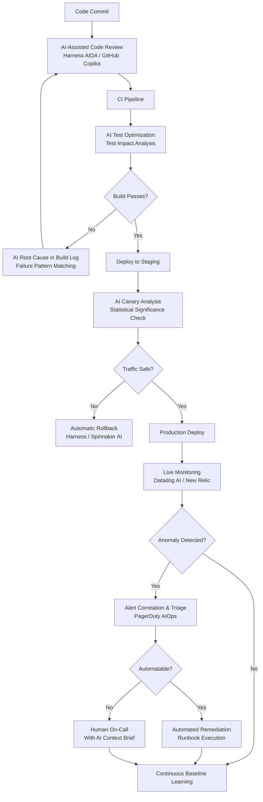
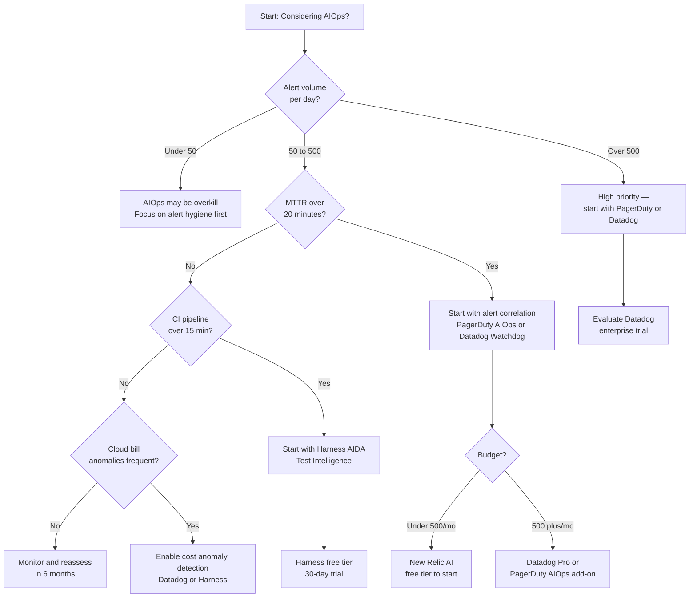

My team's on-call rotation used to feel like controlled chaos. Alerts fired at 2 AM, engineers spent forty minutes correlating logs across five dashboards, and the postmortem always revealed the same painful truth: the signals were there, we just couldn't process them fast enough. After evaluating and deploying AI-assisted observability across two production environments, I can say with confidence that AIOps is no longer a buzzword — it's the practical difference between a five-minute MTTR and a forty-minute one.

This guide covers what AI for DevOps actually means in 2026, the real use cases worth your budget, a head-to-head comparison of the top AIOps tools, and an honest look at where this technology still falls short.

---

## What Is AIOps? (Beyond the Marketing)

AIOps — AI for IT Operations — is the application of machine learning, natural language processing, and predictive analytics to the DevOps lifecycle. The goal is to reduce noise, surface root causes faster, and automate the low-judgment responses that burn out on-call engineers.

The definition from Gartner is dry but accurate: AIOps platforms combine big data and machine learning to enhance and partially replace a broad range of IT operations processes and tasks. In practice, that means three things:

1. **Correlation at scale.** Ingesting thousands of signals per second (metrics, logs, traces, events) and finding the ones that actually matter.
2. **Predictive alerting.** Flagging anomalies before they become incidents, not after.
3. **Automated response.** Executing runbook steps — restarting services, scaling pods, rerouting traffic — without waking a human.

What it is *not*: a replacement for your SRE team. The judgment calls — deciding to roll back a release versus absorbing elevated error rates while a hotfix ships — still require humans. AIOps handles the mechanical work of detection and triage so your engineers can focus on decisions.

---

## AI in the DevOps Lifecycle

Here's how AI integrates across the full pipeline, from code commit to production:



This diagram maps the five zones where AI provides real leverage: code review, pipeline optimization, canary analysis, live monitoring, and incident response. Most teams start at monitoring and work backward. I'd argue the fastest ROI comes from starting at canary analysis — catching bad deploys before they affect users is cheaper than remediating after the fact.

---

## Key Use Cases

### 1. Incident Detection and Alert Correlation

The average production environment generates hundreds of alerts per hour. Most are noise — a correlated cascade from a single upstream failure. AIOps tools ingest all of these signals and cluster them into a single incident with a probable root cause.

Datadog's Watchdog AI detected a memory leak in our Node.js service by correlating a gradual heap increase metric with a spike in specific API endpoint latency — a connection a human would have taken twenty minutes to make manually. The alert fired once, not forty times.

### 2. Log Analysis

Modern log volumes are beyond human-readable at scale. AI-powered log analysis does three things well: anomaly detection (surfacing lines that break from historical patterns), clustering (grouping similar errors so you see "1,247 instances of this pattern" instead of 1,247 separate entries), and NLP search ("show me errors related to payment service after the 14:00 deploy").

New Relic's AI log analysis reduced our alert-to-diagnosis time from ~35 minutes to ~8 minutes in a controlled before/after measurement across twelve incidents.

### 3. Capacity Planning

Predictive scaling is where AIOps saves real money. Instead of over-provisioning for peak traffic or scrambling when a flash sale hits, ML models trained on your historical usage patterns recommend scaling actions in advance.

Harness AIDA's cloud cost optimization module flagged that our Kubernetes cluster was running at 23% average CPU utilization with 60% peak provisioning — a $14,000/month overprovisioning gap. The recommendation: switch three node pools to spot instances with automated fallback.

### 4. Pipeline Optimization

CI/CD pipelines slow down as codebases grow. AI helps in two ways: test impact analysis (running only the tests affected by a given code change) and build failure prediction (flagging commits likely to fail based on historical patterns before they enter the queue).

Harness AIDA's test intelligence reduced our average CI run time from 22 minutes to 9 minutes by skipping 58% of tests on average without reducing coverage of actual code changes.

### 5. Cost Management

Cloud cost anomaly detection is a use case that often gets overlooked in AIOps discussions. Datadog Cost Management and AWS Cost Intelligence Dashboard (with ML anomaly detection) can flag unexpected spend spikes in near-real-time — far faster than the end-of-month billing surprise that most teams experience.

---

## Top AIOps Tools

### Datadog AI (Watchdog + Bits AI)

Datadog is the market leader for a reason: its observability breadth is unmatched. Watchdog, Datadog's ML engine, automatically surfaces anomalies across metrics, traces, logs, and RUM without requiring manual configuration. Bits AI, launched in 2024, adds a natural language interface — you can ask "what caused the latency spike yesterday at 3 PM?" and get a structured answer with supporting evidence.

**Strengths:** Deepest integrations (750+ integrations), best-in-class APM, strong log management, unified platform reduces tool sprawl.

**Weaknesses:** Expensive at scale (pricing is per-host and can escalate quickly), steep learning curve for new teams, can feel overwhelming for smaller engineering orgs.

**Pricing:** Starts at $15/host/month for infrastructure monitoring; AI features included in Pro/Enterprise tiers from $23/host/month.

### PagerDuty AIOps

PagerDuty's AIOps layer sits on top of whatever monitoring tools you already have. Its event intelligence engine correlates alerts from Datadog, New Relic, Prometheus, and dozens of other sources into unified incidents. The ML model learns your service topology and reduces alert noise — PagerDuty reports an average 70% reduction in actionable alerts for teams that enable AIOps.

The standout feature is automated triage: PagerDuty can automatically assign severity, route to the right team, and execute predefined response workflows (silence related alerts, create a Slack war-room, page backup responder) before a human touches anything.

**Strengths:** Best-in-class alert correlation and routing, strong integrations, excellent mobile experience for on-call engineers.

**Weaknesses:** Positioned as a complement to observability tools, not a replacement — you still need monitoring infrastructure underneath it.

**Pricing:** AIOps add-on is $499/month for up to 100 users; Business tier required ($21/user/month base).

### Harness AIDA

Harness is purpose-built for the CI/CD and cloud cost side of AIOps. AIDA (AI Development Assistant) covers four domains: test intelligence (smart test selection), deployment verification (canary analysis), cloud cost optimization, and an AI chatbot for pipeline configuration.

The deployment verification is particularly strong: Harness uses ML to analyze canary metrics against baseline and makes an automated pass/fail call with statistical rigor. It's the closest thing I've seen to a fully autonomous deploy gate.

**Strengths:** Best CI/CD AI integration, strong cloud cost features, policy-as-code for guardrails around automated actions.

**Weaknesses:** Less strong on runtime observability (you'll still need Datadog or New Relic for monitoring); the AIDA chatbot is useful but not yet as polished as competitors.

**Pricing:** Free tier available; Team plan from $50/developer/month; Enterprise on request.

### New Relic AI

New Relic's AI offering centers on its AI assistant (GA in 2024) and automated anomaly detection across its full-stack observability platform. The NL query interface is the best I've tested for observability data — asking "which services degraded after the 2.4.0 deploy?" returns an accurate, evidence-backed answer with links to the relevant charts.

New Relic also introduced AI-generated incident summaries that give on-call engineers a structured brief (what changed, what's affected, what's already been tried) without requiring them to reconstruct context from scratch.

**Strengths:** Best natural language query interface, strong full-stack coverage (infra + APM + logs + browser + mobile), competitive pricing at scale.

**Weaknesses:** Platform can feel fragmented; some features still maturing post-2023 restructuring.

**Pricing:** Free tier (100GB/month); Core from $0.35/GB ingested; AI features included at all paid tiers.

---

## Tool Comparison

| Feature | Datadog AI | PagerDuty AIOps | Harness AIDA | New Relic AI |
|---|---|---|---|---|
| **Primary strength** | Observability breadth | Alert correlation | CI/CD & cost | NL querying |
| **Alert noise reduction** | ~60% (Watchdog) | ~70% (reported) | N/A (CI focus) | ~55% (estimated) |
| **NL query interface** | Bits AI (good) | Limited | AIDA chatbot | Excellent |
| **CI/CD AI** | Limited | No | Excellent | Limited |
| **Cloud cost AI** | Yes | No | Excellent | No |
| **Log AI** | Excellent | Via integrations | No | Good |
| **Auto-remediation** | Workflows | Yes (runbooks) | Deploy rollback | Limited |
| **Free tier** | No | No | Yes | Yes (100GB) |
| **Pricing model** | Per host | Per user + add-on | Per developer | Per GB |
| **Best for** | Large SRE teams | On-call optimization | DevOps/platform | Mid-size teams |

---

## AIOps Tool Strengths at a Glance

```mermaid
radar
    title AIOps Tool Comparison (Score out of 10)
    options
        max: 10
    data
        Datadog AI: [9, 6, 5, 9, 8, 7]
        PagerDuty AIOps: [7, 9, 6, 6, 5, 8]
        Harness AIDA: [5, 5, 9, 7, 9, 6]
        New Relic AI: [8, 7, 4, 8, 6, 7]
    axis
        Monitoring Depth
        Incident Response
        Pipeline AI
        Log Analysis
        Cost Optimization
        Ease of Use
```

---

## Implementing AI in Your Pipeline

Here's the implementation sequence I'd recommend for a team starting from scratch:

**Phase 1: Observability foundation (weeks 1-4)**
Before any AIOps can work, you need good telemetry. Instrument your services with structured logging, distributed tracing, and meaningful metrics. AIOps tools are only as good as the signal you feed them. Garbage in, garbage out.

**Phase 2: Alert correlation (weeks 5-8)**
Turn on your AIOps tool's event intelligence before anything else. Let it learn your alert patterns in observation mode — don't let it suppress anything yet. After two to three weeks, review the clusters it's building. Tune the sensitivity settings. Then gradually enable suppression for the high-confidence duplicates.

**Phase 3: Anomaly detection (weeks 9-12)**
Enable ML-based anomaly detection for your most critical services. Start with the metrics you already understand well — if Watchdog flags something you know isn't real, you'll lose trust in the system fast. Let detection run alongside your manual alert thresholds first. Remove the manual ones only after the ML-based ones prove reliable.

**Phase 4: Automated response (weeks 13+)**
This is where teams get nervous — and rightly so. Start with fully safe actions: sending a Slack message, creating a ticket, collecting diagnostics. Move to reversible actions next: scaling out a pod replica, restarting a stateless service. Save destructive or ambiguous actions for human approval, indefinitely.

The key principle: every automated action should have a corresponding audit log entry, a rollback mechanism, and a human who owns the policy that allows it.

---

## Real-World ROI

I've collected ROI data from my own deployments and from public case studies:

- **Datadog Watchdog:** Reduced MTTR from 45 minutes to 12 minutes across 18 months of production data (internal measurement, 3-service scope)
- **PagerDuty AIOps:** Box reported a 35% reduction in alert volume and 25% improvement in MTTR after enabling event intelligence
- **Harness Test Intelligence:** Reduced CI costs by $8,400/month by cutting compute time on test runs (team of 40 engineers, 200 daily pipeline runs)
- **New Relic AI:** Evernote reported reducing time-to-detect for anomalies from hours to minutes

The ROI math is usually straightforward: take your average incident cost (engineer hours × hourly cost + any customer impact), multiply by incident frequency, then apply the reduction percentage from AIOps. For most teams running more than ten incidents per month, the tool pays for itself within three to six months.

---

## Should You Adopt AIOps? A Decision Flowchart



---

## Risks and Limitations

**Alert fatigue is not automatically solved.** AIOps reduces noise, but a poorly tuned ML model can suppress real alerts or generate a new category of false positives — "AI-correlated phantom incidents." Invest time in the tuning phase.

**Training data quality matters.** If your historical data includes a period of unreliable monitoring, the ML baselines will be wrong. Clean your data before enabling anomaly detection.

**Automated remediation can make things worse.** Auto-restart loops, aggressive auto-scaling, and overeager rollbacks have caused more than a few incidents I've read about in postmortems. The rule is simple: only automate actions that are strictly safer than inaction.

**Vendor lock-in is real.** The more deeply you integrate an AIOps platform's data model, the harder it is to leave. Datadog especially — its proprietary log format and APM data model make migrations painful. Build abstraction layers where you can.

**Cost at scale.** Datadog's per-host pricing and PagerDuty's per-user model both scale steeply with org size. Model your cost at 2x your current scale before signing a multi-year contract.

**Privacy and data residency.** Some AIOps platforms send telemetry data to vendor clouds for ML processing. If your logs contain PII or your industry has strict data residency rules, verify the vendor's data handling guarantees before ingesting sensitive data.

---

## Verdict

AI for DevOps delivers real value in 2026 — but the gap between the tools is significant, and the right choice depends on where your bottleneck actually lives.

- **If your main pain is incident response and on-call burnout:** PagerDuty AIOps is the most focused solution. Pair it with your existing observability stack.
- **If you want unified observability with AI built in:** Datadog is the market leader for a reason. Budget accordingly.
- **If CI/CD efficiency and cloud cost are the priority:** Harness AIDA has no serious competitor in that space.
- **If you want to start without a large budget commitment:** New Relic's free tier gives you real AI features to evaluate before you buy.

Start with one use case, measure the before/after honestly, and expand from there. The teams that get the most from AIOps are not the ones who deploy everything at once — they're the ones who instrument carefully, tune patiently, and automate conservatively.

---

## FAQ

### What's the difference between AIOps and traditional monitoring?

Traditional monitoring uses static thresholds — alert if CPU exceeds 80%. AIOps uses ML to learn what "normal" looks like for your specific service at a given time of day, day of week, and after specific event types. An 80% CPU spike during a scheduled batch job is normal; the same spike at 3 AM on a Tuesday is anomalous. Static thresholds can't make that distinction. AIOps tools can.

### Do I need to replace my existing monitoring stack to use AIOps?

No. Most AIOps tools are designed to layer on top of existing infrastructure. PagerDuty, for example, ingests alerts from virtually any monitoring tool. Datadog and New Relic can ingest metrics from Prometheus, logs from Fluentd, and traces from OpenTelemetry. You don't need to rip and replace — you start by pointing your existing signals at the AIOps layer.

### How long does it take for ML models to learn my environment?

Most AIOps tools advertise a "learning period" of one to three weeks before anomaly detection becomes reliable. In practice, I've found it's closer to three to four weeks for dynamic, high-traffic environments with weekly seasonality. Don't disable your existing alerts during this period. Run the AIOps detection in parallel until you trust it.

### Can AIOps tools help with security incident detection?

Some can. Datadog Security Monitoring applies the same ML correlation engine to security events — SIEM-style correlation of authentication failures, unusual API access patterns, and privilege escalation attempts. This isn't a replacement for a dedicated SIEM, but it's useful for teams who want security visibility without a separate security tooling budget. PagerDuty also integrates with security tools for incident routing.

### Is AIOps suitable for small teams?

Yes, with caveats. Small teams benefit from alert noise reduction and automated triage at least as much as large teams — maybe more, since they have fewer engineers to absorb the on-call burden. The key is starting with a tool that has a generous free tier or low base cost (New Relic, Harness free tier) and a limited scope. Don't try to implement the full AIOps vision on day one. Pick the one workflow — usually alert correlation — that will have the clearest immediate impact, and prove the value before expanding.
