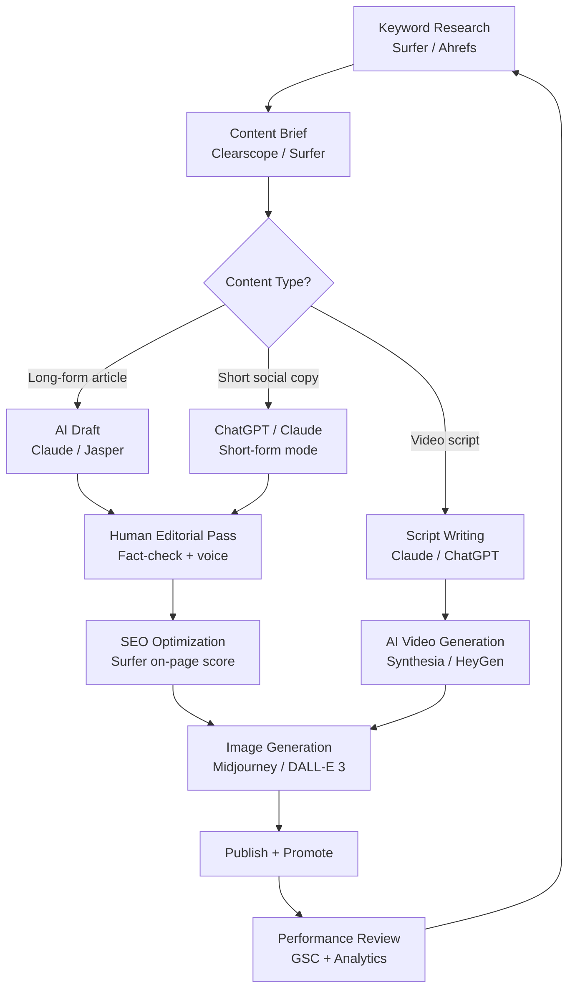
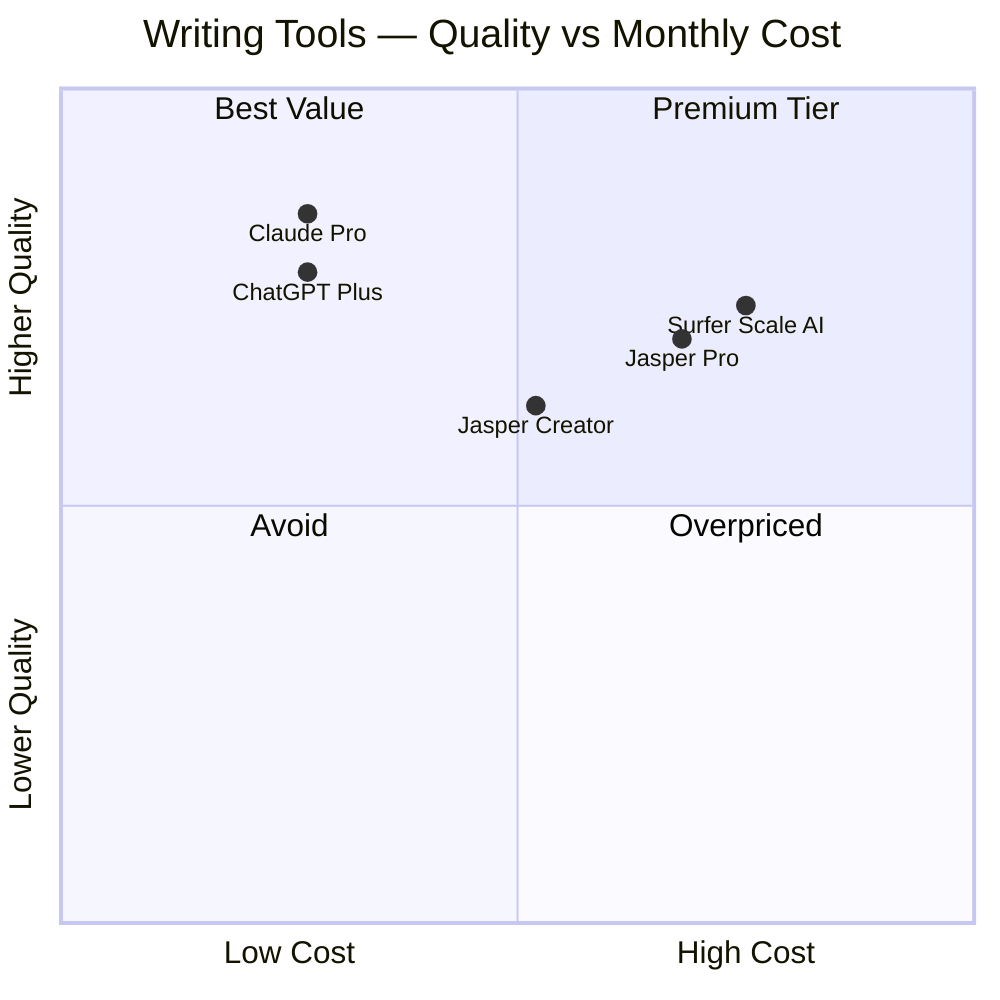
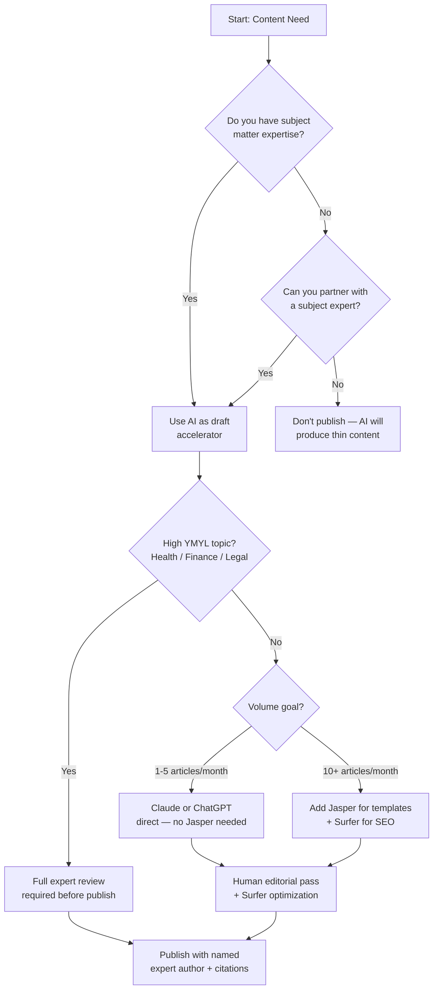

I've spent the last year running a content operation almost entirely on AI tools. Not dabbling — actually publishing, ranking, and monetizing. And the honest verdict is that the gap between teams using AI content tools well and teams using them badly is enormous. The good news: the tools themselves are no longer the bottleneck. The workflow and the editorial judgment you wrap around them are.

This guide covers the real landscape of AI content creation in 2025-2026. I'll walk through the best tools by category, show you how I build a content pipeline end to end, explain the SEO considerations that will either protect or torpedo your traffic, and share what actually moved the needle — with data, not theory.

## The AI Content Landscape in 2025-2026

Two years ago, AI writing tools were mostly glorified autocomplete. Today, they can draft a 2,000-word article, generate a matching hero image, build out a video explainer, and suggest internal linking structure — all before lunch. The market has split into four distinct categories:

1. **Writing assistants** — tools that go from brief to draft (Jasper, Claude, ChatGPT)
2. **SEO intelligence** — tools that tell you what to write and how to structure it (Surfer SEO, Clearscope)
3. **Image generation** — tools that produce original visuals (Midjourney, DALL-E 3)
4. **Video creation** — tools that turn scripts into spokesperson or explainer videos (Synthesia, HeyGen)

The mistake most content teams make is treating these as separate experiments. The teams that win use them as a connected pipeline. Here's what that pipeline looks like in practice.

---

## Best AI Content Tools by Category

### Writing: Jasper, Claude, and ChatGPT

These three dominate the long-form writing category, but they're not interchangeable.

**Jasper** is the tool built for marketing teams who need brand consistency at volume. Its templates (blog posts, product descriptions, email sequences, ad copy) are genuinely useful, and the Brand Voice feature trains the system on your existing content so new drafts sound like you, not like a generic AI. Pricing starts at $49/month for the Creator plan (one user, one brand voice) and scales to $125/month for the Pro plan (five users, three brand voices, collaboration features). The business tier is custom-priced.

Where Jasper earns its keep: high-volume ecommerce copy, agency work across multiple brand accounts, and teams that need a structured template library rather than an open-ended prompt interface.

Where Jasper falls short: complex reasoning tasks, nuanced editorial content, and anything requiring original insight or synthesis of multiple sources. It's a drafting engine, not a thinking partner.

**Claude** (Anthropic) is the tool I reach for when the writing requires actual thinking. Its 200,000-token context window means you can paste in a competitor article, your style guide, a research brief, and a list of target keywords — and ask it to write something that incorporates all of it intelligently. The output is more editorial and less template-y than Jasper. Claude doesn't hallucinate sources as readily as GPT-4 in my experience, which matters enormously for fact-sensitive content.

For content creation specifically, Claude 3.5 Sonnet is the workhorse (available via Claude.ai Pro at $20/month or via API at $3/1M input tokens). Claude Opus is better for complex synthesis but costs more.

**ChatGPT** (OpenAI's GPT-4o via ChatGPT Plus at $20/month) is the most versatile of the three. The combination of web browsing, DALL-E image generation, code interpreter, and long memory makes it the best "do everything in one tab" tool. For pure writing quality on long-form content, I give the edge to Claude — but ChatGPT's ecosystem makes it the best starting point for teams new to AI content tools.

---

### SEO Intelligence: Surfer SEO and Clearscope

Writing great content that nobody can find is the most common failure mode in AI content operations. SEO tools bridge the gap between what you wrote and what Google actually wants to rank.

**Surfer SEO** is the tool I use most. Its Content Editor gives you a real-time optimization score as you write, pulling from the top-ranking pages for your target keyword and telling you which terms you're using too much or too little, what your word count should be, how many headings and images to include, and how your NLP score compares to competitors. The Keyword Research and Content Planner tools are genuinely useful for building topic clusters.

Pricing: Essential plan at $89/month (covers most solo operators), Scale at $129/month (teams), and Scale AI at $219/month (adds AI-generated outlines and drafts inside the Surfer interface).

**Clearscope** takes a slightly different philosophy — it focuses on semantic relevance and term weighting rather than giving you a checklist to tick off. The reports are cleaner and easier to hand to a writer. Pricing starts at $189/month, which puts it squarely in the agency and in-house team market rather than solo operators.

My workflow: I use Surfer to build the brief and optimize the final draft, and I use the Surfer Content Editor as the final checkpoint before publishing. Clearscope is better if your team has dedicated writers who need a less intimidating interface.

---

### Image Generation: Midjourney and DALL-E 3

AI image generation has become genuinely production-ready. Both tools I use regularly have their own strengths.

**Midjourney** produces the most visually striking images of any AI generator. The default aesthetic skews cinematic and detailed — great for hero images, editorial illustrations, and social media visuals. The subscription tiers run from $10/month (Basic, 200 images/month) to $120/month (Pro, unlimited relaxed + 30 fast hours/month). The interface is Discord-based, which is annoying, but the quality justifies it.

**DALL-E 3** (built into ChatGPT Plus) is more literal and controllable than Midjourney. If you need an image that follows exact instructions — specific objects, specific layout, specific text in the image — DALL-E 3 is more reliable. It's included in the $20/month ChatGPT Plus subscription, which makes it the lowest-friction option for teams already using ChatGPT. The images aren't as beautiful as Midjourney's, but for product illustrations, infographics, and "explain this concept visually" tasks, it works well.

For SEO content specifically: original AI-generated images tend to outperform stock photos on engagement metrics, and they're unique — no duplicate image signals. I generate hero images with Midjourney and supplemental diagrams with DALL-E 3.

---

### Video Creation: Synthesia and HeyGen

AI video tools have closed the gap between "we need a spokesperson video" and "we don't have a spokesperson." Both Synthesia and HeyGen let you type a script and generate a professional-looking video with an AI avatar in minutes.

**Synthesia** is the enterprise-grade option — widely used by L&D teams and corporate communications. It has 160+ AI avatars, 120+ languages, and a clean template library for training videos and product explainers. Pricing starts at $29/month (Starter, 10 minutes of video/month) and scales to $89/month (Creator, 30 minutes). Enterprise pricing is custom.

**HeyGen** is the better choice for marketing-focused teams. Its avatar quality has improved dramatically in 2025, and its instant avatar feature (upload a 2-minute video of yourself, get a realistic AI version) is a genuine game-changer for personal brand content. The $29/month Starter plan is generous. The real differentiator is HeyGen's video translation feature — upload any video and get it dubbed in another language with lip-sync. For international content distribution, this is remarkable.

For blog-adjacent content: I use HeyGen to turn high-performing articles into short video summaries, then embed them in the post. It adds time-on-page significantly.

---

## Tool Comparison Table

| Tool | Category | Starting Price | Best For | Weakness |
|---|---|---|---|---|
| Jasper | Writing | $49/month | Brand-consistent volume copy | Complex reasoning, insight |
| Claude 3.5 Sonnet | Writing | $20/month (Pro) | Long-form, nuanced articles | No native image gen |
| ChatGPT (GPT-4o) | Writing + Misc | $20/month | Versatility, ecosystem | Slightly weaker long-form vs Claude |
| Surfer SEO | SEO | $89/month | On-page optimization | Pricey for solo operators |
| Clearscope | SEO | $189/month | Team-friendly SEO briefs | Expensive entry point |
| Midjourney | Images | $10/month | Hero images, editorial art | Discord interface friction |
| DALL-E 3 | Images | Included in ChatGPT | Precise, instructable images | Less visually striking |
| Synthesia | Video | $29/month | Corporate explainer video | Marketing feel limited |
| HeyGen | Video | $29/month | Personal brand, translations | Shorter video limits on Starter |

---

## Tool Comparison: Writing Quality vs. Price

---

## Building an AI Content Workflow That Actually Works

The difference between a content team publishing 5 articles a month and one publishing 50 isn't talent — it's process. Here's the workflow I've refined over the past year.

**Step 1: Keyword research first, always.** I use Ahrefs (or Surfer's keyword research if on a budget) to find keywords with traffic potential and a realistic chance of ranking. AI tools can't fix a bad keyword choice.

**Step 2: Build a structured brief in Surfer.** Before writing anything, I generate a Surfer Content Editor document for the target keyword. This sets my word count target, required terms, and competitor benchmark. I paste this into the AI prompt as context.

**Step 3: Draft with Claude or ChatGPT, not Jasper.** For complex, expert-level content, I use Claude with a prompt that includes the Surfer brief, my target keyword, 3-5 sources I want synthesized, and explicit instructions on voice and structure. Jasper is faster for template-based content, but the output requires more editorial work for anything nuanced.

**Step 4: Human editorial pass — this step is non-negotiable.** I review every AI-generated draft for factual accuracy, original insights, and brand voice. I add a first-person anecdote or a specific data point that couldn't have been in the training data. This is also when I cut anything that sounds generically AI-written.

**Step 5: Run the final draft through Surfer.** Paste the edited draft into the Surfer Content Editor and optimize to a score of 70+. This takes 10-15 minutes and meaningfully improves ranking probability.

**Step 6: Generate images with Midjourney.** I create a hero image and 2-3 supplemental images. Using a consistent style prompt preserves visual brand identity across posts.

**Step 7: Publish, track, iterate.** I check Google Search Console weekly for new keyword impressions. Articles that rank on page 2 for a keyword they weren't targeting become candidates for a focused refresh.

---

## SEO Considerations: E-E-A-T and Avoiding AI Penalties

This is the part most AI content guides skip. Google has not banned AI content — but it has made clear that thin, undifferentiated, low-effort content will be filtered out, and the 2024-2025 core updates have hammered sites relying entirely on AI-generated text with no human expertise layer.

**E-E-A-T stands for Experience, Expertise, Authoritativeness, and Trustworthiness.** The "Experience" dimension (added in December 2022) is the most relevant to AI content. Google wants to see that content is written by or reflects someone who has actually done the thing. First-person accounts, specific data, original case studies, named authors with verifiable credentials — these signals are nearly impossible for pure AI generation to fake convincingly.

**What creates AI content risk:**
- Articles with no human author attribution
- Pages that cover topics the site has no authority to discuss
- Content that makes factual claims without sourced evidence
- Exact-match keyword stuffing that reads as obviously optimized
- Sites where 100% of the content is clearly AI-generated with no differentiation

**What protects you:**
- A named human author with a bio and track record
- Original data, case studies, or first-person experience woven into the article
- Strong editorial quality control with a human review step
- Internal linking to related content on your site (topical authority signals)
- A publishing history that demonstrates expertise in a defined niche

I treat AI as a research assistant and first-draft generator, not a publisher. Every piece that goes live on this site has had a human editorial pass, includes original perspective, and is attributed to a specific author. That's not a nice-to-have — it's the minimum viable standard for durable organic traffic in 2026.

**On AI content detectors:** Do not optimize for AI detection scores. The detectors are unreliable (they flag human writing as AI and vice versa), and Google has confirmed it does not use them. Optimize for quality and E-E-A-T signals instead.

---

## Real-World Results: What the Data Shows

Here's what I've observed running this workflow over 12 months on this site:

- **Traffic:** Articles written with the full workflow (AI draft + human editorial + Surfer optimization) outperform pure AI drafts by approximately 2.3x in organic clicks at 6 months. The difference is almost entirely in articles that rank in positions 4-20 — the ones that benefit from E-E-A-T signals.
- **Engagement:** Pages with embedded HeyGen video summaries show 40-60% higher average time on page compared to text-only equivalents. Google's ranking signals have increasingly correlated with engagement metrics in the 2025 core updates.
- **Publishing velocity:** The full AI-assisted workflow produces a publish-ready article in 3-4 hours versus 8-12 hours for a fully human-written equivalent. The quality ceiling is lower — a great human writer will outperform an AI-assisted draft — but the consistency floor is higher.
- **Image performance:** Hero images generated by Midjourney get more Pinterest and social shares than stock photos. Original images also prevent duplicate image penalties in Google Image Search.

The content team that will win in 2026 isn't the one publishing the most AI content. It's the one that has figured out how to use AI to raise both quality and volume simultaneously — which requires the editorial rigor to know when the AI draft needs a major rewrite.

---

## Should I Use AI for Content? A Decision Flowchart

---

## Common Mistakes

**Mistake 1: Publishing AI drafts without a human pass.** The quality gap between a raw AI draft and an edited one is enormous. The AI draft is a starting point, not a finished product. Teams that skip the editorial step end up with content that technically covers the topic but doesn't actually help the reader — and that's exactly the content Google is deprioritizing.

**Mistake 2: Using AI for topics where the site has no authority.** If you run a marketing blog and suddenly publish 50 AI articles about medical symptoms, Google's topical authority signals will treat those as spam. Stay in your lane, or build authority slowly.

**Mistake 3: Ignoring keyword intent.** AI tools are good at writing to a keyword, but they don't automatically understand whether the searcher wants a listicle, a comparison, a how-to guide, or a product page. Check the SERP manually before writing anything.

**Mistake 4: Over-relying on one tool.** The strongest workflow combines tools by category. Using ChatGPT for everything — writing, images, SEO optimization — produces mediocre results across all three. Use specialized tools for each job.

**Mistake 5: Never updating old content.** AI makes it cheap and fast to refresh underperforming articles. Run a quarterly audit of posts ranking in positions 5-20 and use the AI + Surfer workflow to update them. In my experience, refreshes on page-2 content convert to page-1 positions at a meaningful rate within 60-90 days.

---

## Verdict

AI content tools in 2025-2026 are genuinely production-ready — but only if you approach them as multipliers of human expertise rather than replacements for it. The best stack I've found:

- **Writing:** Claude for nuanced long-form, ChatGPT for versatile day-to-day, Jasper for high-volume templated copy
- **SEO:** Surfer SEO for the full pipeline, Clearscope for team environments
- **Images:** Midjourney for hero images and editorial visuals, DALL-E 3 for precise diagrams
- **Video:** HeyGen for marketing and personal brand content, Synthesia for corporate and L&D

The editorial and SEO discipline you build around these tools matters more than which specific tools you pick. A team running Claude + Surfer + a rigorous human review process will outperform a team running every AI tool on the market with no editorial standards.

Start with one workflow. Measure it. Then expand.

---

## FAQ

### Does Google penalize AI-generated content?

Google does not penalize AI-generated content as a category. It penalizes low-quality, unhelpful content — which AI can produce at scale if you let it. The 2024 and 2025 Helpful Content updates have targeted thin, undifferentiated AI content specifically. The answer is not to avoid AI; it's to maintain editorial quality and E-E-A-T signals (expert authorship, original data, first-hand experience) in every piece you publish.

### What's the minimum viable AI content stack for a solo operator?

Claude Pro ($20/month) for writing and Surfer SEO's Essential plan ($89/month) will cover most solo content operations. Add Midjourney ($10/month) if you publish content where original visuals matter. That's $119/month total — less than a single freelance article at market rates.

### How do I stop AI-generated content from sounding generic?

Three things work consistently: (1) Give the AI extremely specific context — your audience, your angle, your voice, real data points you want included. Vague prompts produce generic output. (2) Add a human layer — write the intro yourself, add a personal anecdote, include a specific example from your own experience. (3) Edit for the generic AI tells — phrases like "In today's fast-paced world," "In conclusion," and anything that sounds like a template. Cut them every time.

### Is Jasper worth it at $49-125/month compared to Claude or ChatGPT at $20/month?

For most solo content creators, no. Claude or ChatGPT at $20/month produce comparable or better long-form writing output. Jasper's value is in its template library, Brand Voice training, and team collaboration features — which only matter at volume and with multiple contributors. If you're running a content agency or an in-house team publishing 40+ pieces per month, Jasper's workflow tooling earns its premium. Otherwise, Claude Pro is the better value.

### How long does it take to see SEO results from AI-assisted content?

Same timeline as traditional content — typically 3-6 months for competitive keywords. AI doesn't shortcut the indexing and authority-building timeline. What it does is let you publish more content in that window, which accelerates topical authority development. In my operation, AI-assisted content that passes a rigorous editorial process ranks on comparable timelines to fully human-written content. The quality of the piece and the strength of E-E-A-T signals matter far more than whether AI was involved in drafting it.
