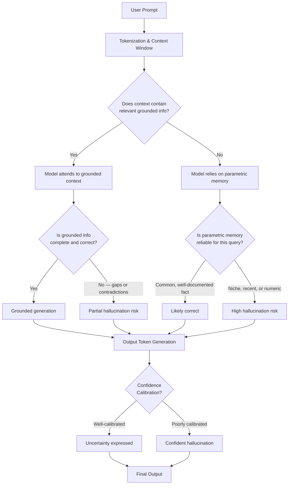
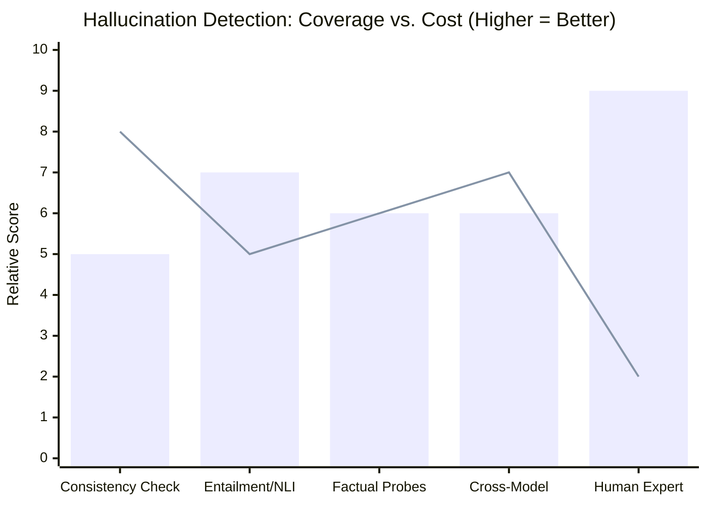
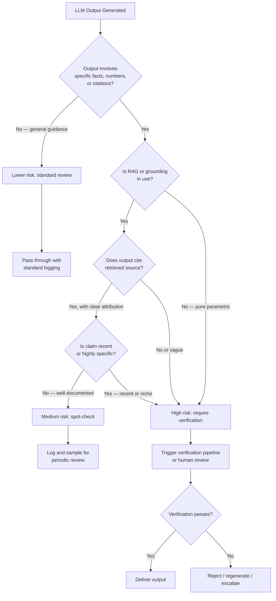

In February 2023, a lawyer named Steven Schwartz filed court documents citing six legal cases as precedent. Every single one of those cases was fabricated. ChatGPT had invented them wholesale — complete with realistic-sounding judges, dockets, and rulings that had never existed. Schwartz faced sanctions. The incident made national news. And it crystallized a problem that anyone building on top of large language models has to reckon with: **AI hallucinations are not edge cases. They are a fundamental property of how these systems work.**

I've spent time stress-testing LLMs for production use, and the hallucination question comes up in almost every project. This guide is the one I wish I'd had before my first run-in with confidently wrong model output. We'll go from the mechanical "why" all the way through detection, mitigation, and which models actually behave better.

---

## What Are AI Hallucinations?

An AI hallucination is when a language model generates output that is factually incorrect, logically inconsistent, or entirely fabricated — but presents it with the same fluency and confidence as accurate information. The term is borrowed loosely from neuroscience, where it describes perception without external stimulus. In LLMs, it describes generation without grounding.

Hallucinations are not typos or garbled text. The model produces coherent, well-structured output. Sentences flow correctly, grammar is clean, the tone is professional. The content is simply wrong — and often wrong in ways that are hard to spot without domain knowledge.

This matters more than it might seem. A model that outputs obvious gibberish is easy to catch. A model that invents a plausible-sounding court case, a realistic-looking scientific citation, or a subtly incorrect drug dosage is dangerous precisely because it looks right.

The problem is not specific to any one provider. Claude, GPT-4, Gemini, Llama — they all hallucinate. The rates differ, the failure modes differ, and the mitigations differ. But none of them is immune.

---

## Why LLMs Hallucinate

Understanding the mechanics makes the problem less mysterious and the solutions more tractable. There are three core reasons.

### 1. Training Data Limitations

LLMs learn from massive corpora of text — web pages, books, code, forums, news. That data is imperfect in multiple ways:

- **Gaps**: The model has never seen certain information, so it confabulates something plausible.
- **Contradictions**: The training data contains conflicting claims. The model averages across them rather than resolving them.
- **Staleness**: Knowledge has a cutoff. Events, version numbers, regulatory changes, and org charts after the cutoff simply do not exist in the model's world.
- **Noise**: Low-quality or incorrect information in the training corpus gets memorized alongside correct information.

### 2. Next-Token Prediction

At inference time, an LLM generates text one token at a time, selecting each token based on what is statistically most likely given the context. The model is not "looking up" facts — it is pattern-matching on the probability distribution it learned from training.

This means the model will confidently generate whatever token sequence is statistically likely, regardless of whether that sequence is grounded in fact. If your prompt pattern resembles thousands of text passages that mention "Einstein's paper on X," the model will generate the name of a paper — real or invented — because that is what fits the pattern.

### 3. Confidence Calibration Failures

Well-calibrated models express uncertainty when they don't know something. LLMs are notoriously poorly calibrated. They assign similar-looking confidence to things they know well and things they're effectively guessing. RLHF (reinforcement learning from human feedback) training can make this worse: human raters often prefer fluent, confident answers, which trains the model to sound certain even when it shouldn't be.

The result is a system that doesn't have a reliable "I don't know" signal. It fills gaps with plausible-sounding completions instead of flagging uncertainty.

---

## How Hallucinations Happen in the Generation Pipeline

Here's a simplified view of how a hallucination can enter at multiple stages of inference:

The critical insight here is that hallucination risk is highest when: (a) the context window contains no grounding, (b) the fact is obscure or recent, and (c) calibration fails to flag uncertainty.

---

## Types of Hallucinations

Not all hallucinations look the same. I've found it useful to think about them in three categories, each requiring different detection and mitigation approaches.

### Factual Hallucinations

The most obvious type. The model states something that is simply not true:

- Fake citations, case law, or studies (the Schwartz incident above)
- Incorrect statistics, dates, or numbers
- Fabricated biographical details about real people
- Invented product features or API parameters

These are dangerous because they're indistinguishable from correct facts to a reader without domain knowledge.

### Logical Hallucinations

The model's reasoning contains valid-sounding steps that don't actually follow. The premises might even be correct, but the conclusion is wrong. This shows up especially in:

- Multi-step math or arithmetic
- Legal or regulatory reasoning chains
- Code that "looks like it should work" but has a subtle logic error
- Causal inference ("since X, therefore Y" where Y doesn't actually follow from X)

### Source Attribution Hallucinations

The model correctly conveys a general idea but attributes it to the wrong person, paper, or document. Or it fabricates a quote and attributes it to a real person. This is particularly pernicious in academic, legal, or journalistic contexts where the attribution itself carries the evidentiary weight.

---

## Detection Methods

There is no single reliable way to catch all hallucinations. In practice, you layer multiple approaches.

### Automated Detection

**Consistency checking**: Send the same question multiple times with slight prompt variations and compare outputs. A hallucination often varies across runs; a grounded fact typically does not.

**Entailment verification**: Use a separate model or NLI (natural language inference) classifier to check whether the model's output is entailed by retrieved source documents. Tools like TruLens and RAGAS do this for RAG pipelines.

**Factual grounding probes**: For specific claim types (dates, names, numbers), extract structured claims from the output and verify them against a trusted database or search API.

**Self-consistency**: Chain-of-thought prompting with multiple reasoning paths and majority voting. If 4 out of 5 reasoning chains reach the same answer, it's more likely to be correct.

### Human Review

For high-stakes outputs, there is no substitute for domain expert review. The challenge is scaling it:

- **Spot-checking**: Review a random sample of outputs, weighted toward high-risk queries.
- **Rubric-based evaluation**: Give reviewers specific criteria — Is every fact verifiable? Does every citation exist? Are numbers rounded suspiciously?
- **Red-team exercises**: Specifically try to elicit hallucinations. If you can reliably trigger them, you can put guardrails in place.

### Cross-Model Verification

Query multiple models with the same prompt and flag divergent outputs for human review. Disagreement between GPT-4 and Claude on a specific factual claim is a strong signal to investigate further. This doesn't eliminate hallucinations, but it catches a meaningful fraction of them cheaply.

---

## Detection Method Effectiveness

Here's a practical comparison of how these approaches stack up across the dimensions that matter in production:

> Bar = Detection coverage. Line = Cost efficiency (inverse of cost). Human expert wins on coverage, loses on scale. Automated methods win on scale but miss subtle logical hallucinations.

In practice, the best production setups combine automated entailment checking on RAG-grounded outputs with periodic expert spot-checks and red-team exercises. Automated methods catch the high-frequency failures; humans catch the subtle ones that matter most.

---

## Mitigation Strategies

Detecting hallucinations after the fact is expensive. The better investment is reducing them at the source.

### Retrieval-Augmented Generation (RAG)

RAG is the single highest-ROI mitigation for factual hallucinations. Instead of relying on the model's parametric memory, you retrieve relevant documents at query time and inject them into the context window. The model then generates based on grounded source material.

The gains are real but not unlimited. RAG reduces but does not eliminate hallucination:

- The model can still misinterpret retrieved documents.
- Retrieval failures (fetching the wrong document) shift the problem rather than solving it.
- Logical hallucinations persist even with perfect retrieval.

The key variables in RAG quality are chunk size, retrieval strategy (dense vs. sparse vs. hybrid), reranking, and whether the model is explicitly instructed to refuse when retrieved context doesn't support an answer.

### Constrained Decoding

For structured output tasks — JSON extraction, classification, filling a form — constrained decoding forces the model to generate only tokens that are valid within a schema. Libraries like Outlines and Guidance implement this at the token level. You cannot hallucinate a field name that isn't in your schema when the decoding is constrained to that schema.

This works well for narrow, well-defined output formats. It doesn't help with free-form generation tasks.

### Fine-Tuning for Calibration

Fine-tuning a model on examples that demonstrate appropriate hedging — "I'm not certain, but…", "based on the provided document…", "I don't have reliable information about…" — can improve calibration. Constitutional AI and similar RLHF variants specifically train for epistemic honesty.

The limitation is that fine-tuning requires data, infrastructure, and ongoing maintenance. It's not practical for every team, but it's the right answer for specialized domains with high accuracy requirements and available labeled data.

### Guardrails and Output Validation

Post-generation validation pipelines catch problems before they reach users:

- **Schema validation**: Reject outputs that don't match the expected format.
- **Claim extraction + search**: Parse factual claims from the output and run them against a search API or database.
- **Hallucination classifiers**: Fine-tuned classifiers (e.g., trained on SelfCheckGPT data) that score the likelihood an output contains a hallucination.
- **Prompt-level constraints**: Explicit instructions like "only answer based on the provided context; if you cannot find the answer in the context, say so" reduce hallucination rates substantially.

Prompt-level constraints are the cheapest intervention and should be the first thing you add. They're not foolproof, but they cut hallucination rates meaningfully on well-behaved models.

---

## Real-World Impact

Hallucinations have caused concrete, documented harm:

**Legal**: Beyond the Schwartz case, there are documented instances of hallucinated legal citations appearing in filings across multiple jurisdictions. At least one case resulted in opposing counsel catching a fabricated precedent mid-trial.

**Medical**: Studies have shown LLMs can generate plausible-sounding but incorrect drug dosages, contraindications, and treatment protocols. In consumer health contexts, this is a serious safety risk.

**Software**: "Confident but wrong" code suggestions can introduce subtle security vulnerabilities, incorrect API usage, or logic errors that pass code review but fail in production. GitHub Copilot and similar tools have been shown to suggest insecure code patterns.

**Finance**: LLMs queried for company financials, regulatory filings, or market data can confabulate figures that look real. Automated pipelines built on these outputs propagate errors at scale.

The pattern is consistent: hallucinations are most dangerous in high-stakes domains where the outputs look authoritative and the reviewer lacks the domain knowledge to catch errors.

---

## When to Raise the Alert: A Decision Flowchart

Use this as a triage tool, not an absolute gate. The cost of verification should scale with the downstream risk of the output.

---

## Model Comparison: Which Hallucinate Less?

This is the question everyone asks. The honest answer is that benchmark results shift with every model release, and lab-reported numbers should be treated as lower bounds (they test under favorable conditions). That said, some patterns hold up in practice as of early 2026:

| Model | Factual Hallucination Rate (TruthfulQA-style) | Calibration | Best Mitigation |
|---|---|---|---|
| **Claude 3.5 Sonnet / Claude 3 Opus** | Low-medium | Good — tends to hedge appropriately | Long-context RAG, explicit grounding instructions |
| **GPT-4o** | Low-medium | Medium — can be overconfident | Structured output + constrained decoding |
| **Gemini 1.5 Pro** | Medium | Medium | RAG with strong retrieval reranking |
| **Llama 3.3 70B** | Medium-high | Variable | Fine-tuning + guardrails for deployment |
| **Mistral Large** | Medium | Medium | Factual probes + human spot-check |
| **GPT-4o mini / Claude Haiku** | Higher than their larger siblings | Lower — smaller models are less calibrated | Use only for constrained tasks with schema validation |

A few practical observations from my own testing:

**Claude tends to refuse more often** when it lacks grounding. This means fewer hallucinations but more "I can't help with that" responses. Whether that's a feature or a bug depends on your use case.

**GPT-4o is more willing to attempt answers** even with weak context, which gets you coverage but at the cost of higher hallucination risk on edge cases.

**Smaller models hallucinate more, full stop.** If you're using GPT-4o mini or Claude Haiku for tasks that require factual accuracy, add strong validation pipelines. The cost savings are real; so is the increased error rate.

**Model version matters.** A model that performs well on an internal benchmark today may behave differently after a fine-tune update next quarter. Pin model versions in production and re-evaluate on updates.

---

## Verdict

AI hallucinations are an inherent property of current LLM architectures, not a bug to be patched in the next release. The three-part cause — training data limits, next-token prediction, and calibration failures — is baked into the model class. Progress is real: newer models hallucinate less, hedge more appropriately, and can be grounded more effectively with RAG. But the problem will not disappear.

The practical path forward for any team deploying LLMs in production:

1. **Assume hallucinations will happen.** Design your workflow to catch them.
2. **Ground the model when you can.** RAG with good retrieval is the highest-ROI mitigation for factual tasks.
3. **Add prompt-level constraints.** They're cheap and they work.
4. **Layer automated and human review** based on downstream risk.
5. **Choose models that match your calibration needs.** For high-stakes factual tasks, lean toward models that refuse rather than invent.
6. **Track and measure.** Set up evaluation pipelines before you go to production, not after you find the first mistake.

The goal is not a hallucination-free system. That doesn't exist. The goal is a system where hallucinations are rare, detectable, and recoverable before they cause real harm.

---

## FAQ

### Are AI hallucinations getting better over time?

Yes, meaningfully so. Models from 2024–2025 hallucinate substantially less than GPT-3-era systems on standard benchmarks. Techniques like RLHF with factuality feedback, retrieval augmentation during pretraining, and improved calibration training have all contributed. But improvement is not elimination — even the best current models produce hallucinations on niche or recent topics, and the problem is likely to persist in some form in next-token prediction architectures.

### What types of questions trigger the most hallucinations?

Several patterns reliably produce higher hallucination rates: specific numeric claims (statistics, dates, prices), citations and bibliographic details, information about niche or recent topics, multi-step reasoning tasks, and questions about real people's less-documented activities. Broad conceptual questions ("explain how X works") hallucinate less than narrow factual queries ("what was the exact ruling in Case X on Date Y").

### Can you use LLMs to detect their own hallucinations?

Partially. Self-consistency approaches — generating multiple answers and checking agreement — catch some hallucinations. Prompting the model to critique its own output can catch obvious errors. But models tend to consistently hallucinate the same things, so a model that fabricated a citation is often confident that citation is correct even when asked to verify it. Cross-model checking (using a different LLM as a verifier) is more reliable than self-verification.

### How should I communicate hallucination risk to non-technical stakeholders?

Frame it as a quality control problem, not a safety catastrophe. Every information system has error rates — databases have dirty data, search engines surface outdated pages, human analysts make mistakes. LLMs have a specific error mode (confident confabulation) that requires specific controls (grounding, validation, review). The message is: we can deploy these systems responsibly if we design for the error mode, not in spite of it.

### Does RAG fully solve the hallucination problem?

No. RAG substantially reduces factual hallucinations by grounding the model in retrieved source material, but it introduces its own failure modes. If retrieval fails (wrong document fetched, incomplete context), the model may still hallucinate. If the source documents themselves contain errors, the model will faithfully reproduce those errors. Logical and attribution hallucinations persist even with perfect retrieval. RAG is the right first mitigation for most production use cases, but it needs to be paired with retrieval quality monitoring and output validation.
