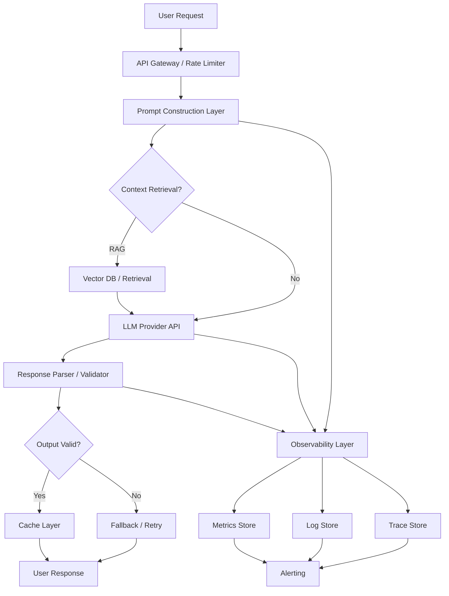
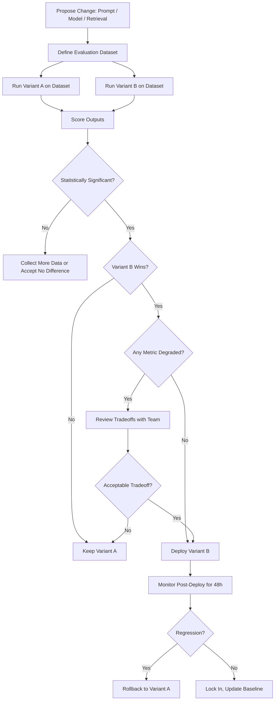

Shipping an LLM feature is the easy part. Keeping it healthy after launch is where most teams fall flat. The first time a prompt regression silently degrades output quality for 40% of users — and nobody notices for two weeks because there are no alerts — you learn exactly how different AI in production is from traditional software.

I've been through that. This guide covers what I wish I'd known: what to measure, what to log, which tools actually help, and how to stay on top of a live LLM system without drowning in dashboards.

---

## Why AI in Production Is Different

Traditional API monitoring is mostly a latency and error rate problem. You watch p99, you watch 5xx rates, you set a few thresholds, done.

LLM monitoring is harder in three specific ways.

**Output quality is probabilistic.** The same prompt can produce a great answer on Tuesday and a subtly wrong one on Wednesday after a model version update you didn't control. There's no HTTP status code for "this response is coherent but factually wrong."

**Cost is a first-class concern.** A runaway prompt that uses 10x more tokens than expected will destroy your margin before any latency alert fires. Token usage is a metric you have to watch the same way you watch memory.

**Failure modes are silent.** Models hallucinate, ignore instructions, leak PII from context, and produce off-brand tone — none of which throws a 500. You need application-level checks that traditional APM tools were never designed to run.



That architecture shows where the observability layer has to live: it touches the prompt construction, the LLM call, and the response parsing — not just the outer HTTP boundary.

---

## Monitoring Essentials

### Latency

LLM latency has two distinct numbers you need to track separately.

**Time to first token (TTFT)** is how long the user waits before seeing anything. This is the number that determines whether your app feels responsive. Most providers target under 500ms TTFT on uncached requests; anything over 1.5s will hurt perceived quality noticeably.

**Total generation time** is the full wall-clock time. This depends heavily on output length, so you can't compare raw numbers across use cases without normalizing by token count. Track *tokens per second* as the stable metric, and alert when it drops below your baseline.

Realistic p95 targets for common workloads in 2025-2026:
- Short completion (under 200 output tokens): 2–4 seconds total
- Document summarization (500–1000 output tokens): 8–15 seconds
- Code generation (1000+ output tokens): 15–40 seconds

### Token Usage

Track input tokens and output tokens separately, per model, per prompt template. The breakdown matters because output tokens cost 3–5x more than input tokens on most providers, and the ratio varies dramatically by use case.

Useful derived metrics:
- **Average input tokens per request** — spike here means your context assembly is bloating
- **Average output tokens per request** — spike here means prompts are generating verbose responses you didn't intend
- **Token cost per successful task** — the metric that actually tells you if the feature is financially sustainable

### Error Rates

Track these separately:
- **Provider errors** (rate limits, timeouts, 5xx from the API) — these need standard retry logic with exponential backoff
- **Parse errors** (model returned text you couldn't parse into expected JSON/schema) — these indicate prompt reliability problems
- **Validation errors** (response parsed fine but failed business logic checks) — these indicate output quality degradation
- **Fallback activations** — how often your retry/fallback path triggered

If parse errors or validation errors are above 2–3%, your prompt needs work before you worry about anything else.

### Cost

Set up cost tracking at the request level, not the billing dashboard level. By the time you see a spike in your monthly invoice it's too late to debug. Calculate cost as:

```
cost = (input_tokens * input_price_per_token) + (output_tokens * output_price_per_token)
```

Tag costs by: feature, user tier, prompt template version, and model. That breakdown will tell you which feature is expensive, not just that your total bill went up.

---

## Logging Best Practices

### What to Log

At minimum, log these fields on every LLM call:

| Field | Why |
|---|---|
| `request_id` | Tie logs, traces, and user reports together |
| `model` | You'll change models; you need to know which was used |
| `prompt_template_id` and `version` | Attribute quality changes to specific prompt changes |
| `input_token_count` | Cost and debugging |
| `output_token_count` | Cost and verbosity tracking |
| `latency_ms` | p50/p95/p99 trending |
| `finish_reason` | "stop" vs "length" vs "content_filter" tells you a lot |
| `cost_usd` | Calculated at log time |
| `retrieval_hit` | Whether RAG context was used, and from what source |
| `user_feedback` | Thumbs up/down if you surface it |

Log the full prompt and response for a *sample* of traffic — not everything. A 10% sample is usually enough for debugging and evaluation, and full logging at scale gets expensive fast.

### PII Handling

This is the area I see teams get wrong most often. LLM inputs frequently contain user-generated content that includes names, email addresses, health information, and financial details. Logging the raw prompt means you're logging all of that.

Three patterns that work:

**Scrub before logging.** Run a lightweight regex pass or use a library like Microsoft's Presidio to detect and redact PII before the log is written. Fast, keeps data in your system.

**Log a hash instead of the content.** For exact-match debugging (e.g., "was this specific input sent?"), log a SHA-256 hash of the prompt rather than the prompt itself. You can verify matches without storing the content.

**Structured prompt templates.** Design prompts so user data fills typed slots, then log the template name and the slot schema — not the filled values. This is the cleanest approach architecturally.

Make sure your logging policy is captured in your privacy policy and that retention periods are set correctly. LLM call logs with user content should typically be treated as personal data.

### Storage and Retention

Observability data has a natural tiering:

- **Hot (0–7 days):** Full structured logs, real-time query access, used for active debugging
- **Warm (7–90 days):** Aggregated metrics and sampled traces, used for trend analysis and evals
- **Cold (90+ days):** Archived for compliance, rarely queried

Most teams underestimate log volume. A system handling 10,000 LLM calls/day with full prompt/response logging at an average of 2KB per call generates ~20GB/day. Sample aggressively or your storage bill will surprise you.

---

## Observability Stack: Tool Comparison

Four tools dominate the LLM observability space right now. Here's how they actually compare.

### LangSmith

LangChain's observability layer. Best-in-class if you're already on the LangChain/LangGraph stack. Captures every chain step, tool call, and LLM invocation automatically. The evaluation workflow — define a dataset, run evals, compare prompt versions — is the most complete I've seen.

Pricing: Free tier for low volume. Team plan starts at ~$49/month. Enterprise requires contact.

Weak points: The tight LangChain coupling is a feature if you use it, a liability if you don't. Instrumenting non-LangChain code requires more manual effort.

### Helicone

Provider-agnostic proxy that sits between your app and the LLM API. You change one URL, and every call goes through Helicone's logging layer. Zero SDK changes required. The tradeoff is you're routing traffic through their infra.

Pricing: Free up to 10,000 requests/month. Pro is $20/month for 500K requests. They have an open-source self-hosted version if you don't want to send traffic through their proxy.

Strong points: The cost analytics and user-level cost attribution are among the best available. Setup is genuinely 5 minutes.

Weak points: You're adding a hop in the critical path. Their p99 latency overhead is typically 20–50ms, which matters if you're chasing every millisecond.

### Braintrust

Focused on evaluation and experiment tracking. Less of a real-time monitoring tool, more of a systematic way to run evals, track prompt versions, and score outputs. Integrates with OpenAI, Anthropic, and most providers.

Pricing: Free for individuals. Teams at $150/month for 3 seats.

Strong points: The evaluation dataset management and scoring workflow is excellent. Good for teams that want to run A/B experiments on prompts rigorously.

Weak points: Less suited as a real-time monitoring dashboard. You'll likely want it alongside something else rather than instead of something else.

### Datadog LLM Observability

If your team is already on Datadog, their LLM Observability product (launched in 2024) integrates directly into your existing APM and alerting setup. You get LLM traces alongside your infrastructure metrics, which makes correlation — "did the LLM response quality drop when our DB latency spiked?" — actually possible.

Pricing: Add-on to existing Datadog plan. Volume-based, typically adds 10–20% to an existing bill.

Strong points: Best-in-class if you want everything in one pane of glass. Correlation with infrastructure is genuinely powerful.

Weak points: Expensive if you're not already on Datadog. Overkill for smaller teams.

---

## Tool Comparison Table

| Tool | Best For | Pricing Start | Self-Hosted? | Real-Time Alerts? | Eval Workflow? |
|---|---|---|---|---|---|
| LangSmith | LangChain teams, evals | Free tier | No | Yes | Excellent |
| Helicone | Any provider, fast setup | Free / $20/mo | Yes (OSS) | Basic | Minimal |
| Braintrust | Prompt A/B testing | Free / $150/mo | No | No | Excellent |
| Datadog LLM | Existing Datadog users | ~+15% to bill | No | Excellent | Basic |
| Custom (OpenTelemetry) | Full control | Infra cost only | Yes | Configurable | Manual |

```mermaid
xychart-beta
    title "LLM Observability Tools: Feature Coverage (1-5 scale)"
    x-axis ["Real-Time Monitoring", "Eval Workflow", "Cost Tracking", "Setup Speed", "Self-Host Option"]
    y-axis "Score" 0 --> 5
    bar [4, 5, 3, 3, 2]
    bar [4, 2, 5, 5, 4]
    bar [2, 5, 3, 3, 2]
    bar [5, 3, 4, 2, 2]
```



*Bars: LangSmith (blue), Helicone (orange), Braintrust (green), Datadog (red)*

---

## Alerting Strategies

Bad alerts are worse than no alerts. An alert that fires every day trains teams to ignore it.

**What to alert on (high signal):**
- Provider error rate > 5% over 5 minutes
- p95 latency > 2x baseline over 10 minutes
- Cost per hour > 2x trailing 7-day average
- Parse/validation error rate > 5% over 15 minutes
- Any finish_reason of "content_filter" (review these manually)

**What NOT to alert on:**
- Individual slow requests (noise)
- Token count per request fluctuating (expected variance)
- Cost per request (too variable — track hourly cost instead)

For alerting infrastructure, Datadog and Grafana both work well. If you're using Helicone, their webhook alerts cover the basics. For teams that want simple Slack alerts without a full APM stack, Axiom with a custom alert rule is an underrated choice.

---

## A/B Testing LLM Changes

Every time you change a prompt, a model, or a retrieval strategy, you're running an experiment. Treat it like one.

The three things that go wrong without a proper A/B framework:

1. You change two things at once and can't attribute which caused the quality change
2. You evaluate on developer examples that don't represent real user traffic
3. You declare victory based on one metric while a different metric degraded silently

A minimal A/B process for LLM changes:

1. Define your evaluation dataset from real production traffic (100–500 examples minimum, sampled recently)
2. Define your scoring criteria *before* you run the experiment (correctness, instruction-following, length, cost)
3. Run both variants on the same dataset
4. Use an LLM judge (GPT-4o or Claude works fine as a judge) to score both, or write deterministic checks where possible
5. Check for statistical significance before deploying — especially for small quality differences



Shadow mode is useful for model upgrades: route 5% of real traffic to the new model, log both responses, and score them offline before committing to the switch.

---

## Cost Management

Token costs compound quietly. Here are the most effective levers I've seen in practice.

**Prompt compression.** Review your system prompts for redundancy. A 4,000-token system prompt that could be rewritten to 1,500 tokens with the same information saves 2,500 tokens on every single request. On 10,000 daily calls, that's 25M tokens/day of savings — real money at $3/1M input tokens.

**Prompt caching.** Anthropic's Claude and OpenAI's API both support prompt caching. With Claude, cached tokens cost $0.30/1M instead of $3.00/1M — a 10x reduction. For applications with large, stable system prompts (RAG context, tool schemas, long documents), this is the highest-leverage cost optimization available.

**Model routing.** Not every request needs your most capable model. Classify requests by complexity at the router level — simple extractions and classifications can go to a cheap model (Claude Haiku, GPT-4o mini, Gemini Flash), while complex reasoning goes to the expensive one. A 70/30 split between cheap and expensive models often cuts costs by 50%+ with minimal quality impact.

**Output length constraints.** Add explicit `max_tokens` limits and instruct the model to be concise. Unbounded output generation is one of the most common cost bugs I've seen in production LLM apps.

**Request caching.** For high-traffic applications where many users ask the same or similar questions, a semantic cache (e.g., GPTCache, Momento) can serve cached responses without hitting the LLM API. Cache hit rates of 20–40% are common for consumer apps with predictable query patterns.

---

## Incident Response

When something goes wrong with a production LLM system, the debugging path is different from traditional software.

**Step 1: Triage the failure type.** Is it a provider outage (check status.anthropic.com, status.openai.com)? A rate limit? A quality degradation? Each has a different response.

**Step 2: Contain.** If quality has degraded, consider rolling back to the previous prompt version. Most teams don't version-control their prompts — if you don't, this step is unavailable to you, which is a forcing function to start doing it.

**Step 3: Sample affected outputs.** Pull a random sample of requests from the incident window and review them. Look for the pattern: Is the model ignoring a specific instruction? Generating shorter responses than usual? Failing on a specific input type?

**Step 4: Root cause.** Common causes in rough order of frequency:
- Prompt template bug introduced in a recent deploy
- Model version update by the provider (OpenAI and Anthropic both do silent version updates)
- Context/retrieval quality degradation (e.g., a data source went stale)
- Input distribution shift (users started asking different things)
- Rate limiting causing retries that change effective latency

**Step 5: Fix and verify.** Make one change at a time. Rerun your evaluation dataset to confirm the fix before re-deploying.

Document incidents using the standard 5W format (what, when, who was affected, why it happened, what was done). LLM incident reports are valuable future training data for your evaluation suite.

---

## Verdict

If you're running LLMs in production and your observability setup is "we watch the API latency in Datadog and check the bill monthly," you're flying blind. That works until the first silent quality regression or the first surprise $40,000 invoice.

The stack I'd recommend for most teams today:

- **Helicone** for fast, zero-friction logging and cost tracking if you want to be up in an hour
- **LangSmith** if you're on LangChain or need a serious eval workflow
- **Braintrust** alongside either for systematic A/B testing
- **Datadog** if you need everything in one place and are already paying for it

Start by logging token usage and cost per request — those two metrics alone will surface the most expensive problems first. Then add quality evals once your monitoring foundation is solid. You can't improve what you can't measure, and with LLMs, the things worth measuring are different from every other kind of software you've shipped.

---

## FAQ

### What is LLM observability and why does it matter?

LLM observability is the practice of capturing enough structured data — logs, metrics, and traces — from your AI system that you can understand what it's doing, why it's failing, and how much it costs. It matters because LLMs fail silently: a degraded response looks exactly like a good one in your HTTP logs. Without application-level observability, you're relying on users to report problems after they've already been affected.

### How do I monitor LLM quality in production without human review of every response?

You can't review every response manually at scale, but you can sample intelligently. Flag responses that hit certain criteria — short output relative to the prompt, content filter activations, high user report rates, parse failures — and route those to a review queue. For systematic quality tracking, use an LLM-as-judge approach where a separate model scores a random sample of outputs against a rubric. This gives you a quality trend line without needing human reviewers on every call.

### What's the most common mistake teams make with LLM logging?

Logging too much or too little, with nothing in between. Teams that log every token of every prompt and response hit storage costs they didn't plan for and create PII compliance problems. Teams that log only HTTP status codes have nothing to debug with when quality degrades. The right answer is structured logging of metadata (token counts, latency, model, template version, cost) for 100% of traffic, plus sampled full prompt/response capture at 5–10%, with PII scrubbing before any of it hits storage.

### How do I know when to switch LLM providers or models?

Run a continuous evaluation against a fixed dataset of representative tasks. If a new model scores higher on your rubric, costs less, and doesn't regress on any critical dimension, it's worth switching. Don't switch based on benchmarks alone — benchmark inputs rarely look like your production inputs. The evaluation dataset should come from real user traffic.

### What's prompt caching and how much can it actually save?

Prompt caching lets you pay a fraction of the normal input token price for content that doesn't change between requests — typically your system prompt, few-shot examples, or large document context. With Claude's API, cached tokens cost $0.30/1M vs $3.00/1M for uncached (a 10x reduction). For an app with a 3,000-token system prompt running 10,000 requests/day, caching saves roughly $81/day or $2,430/month at those rates. It's one of the highest-ROI optimizations available and takes about an hour to implement.
