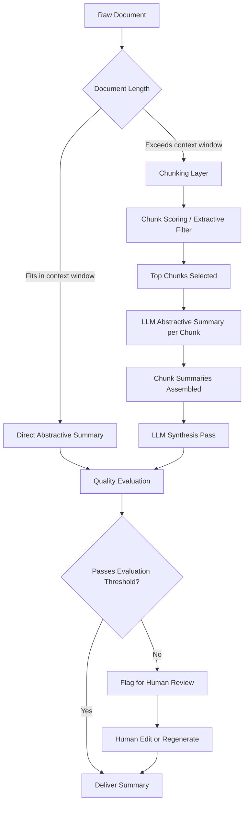
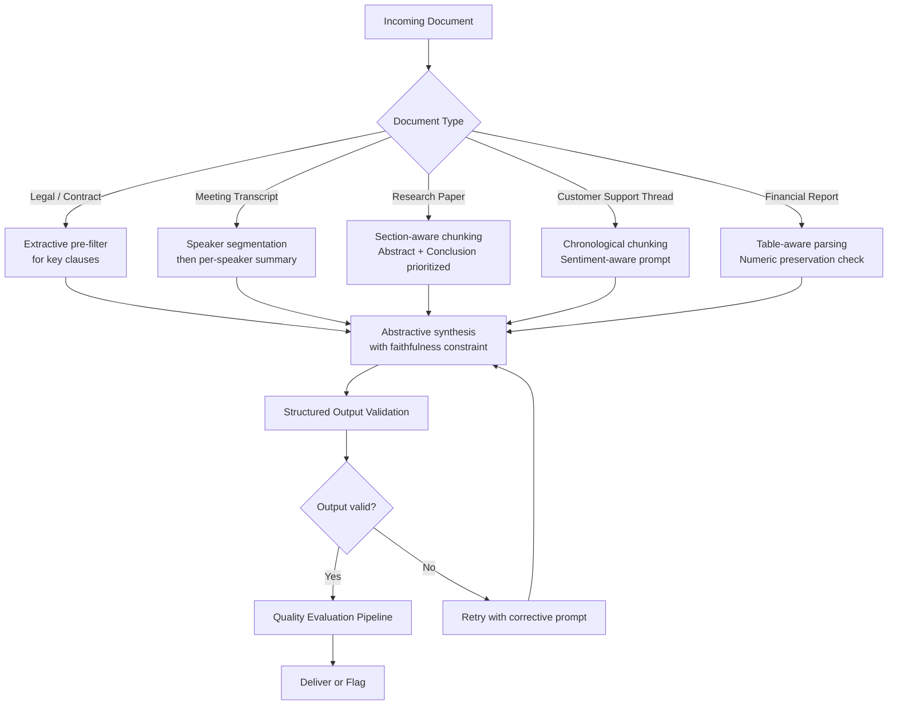
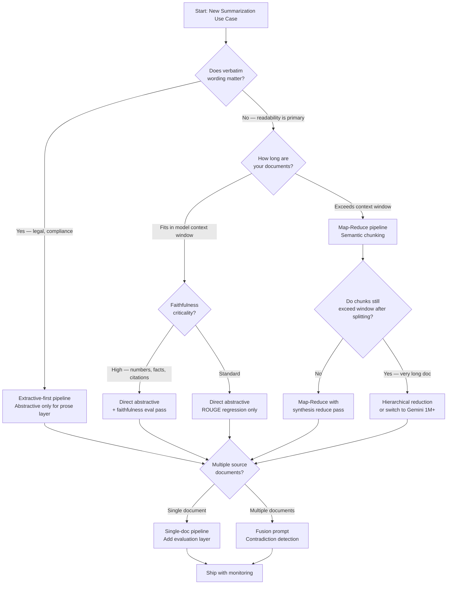

The demo always looks clean: paste in a document, get back a crisp three-paragraph summary. Ship it to production and the reality lands differently. The model omits the most important numbers. The summary confidently describes something that isn't in the source. A 90-page contract gets truncated at token limit and the model hallucinates the rest. I've hit all three of those walls.

This guide is the technical tutorial I wish I'd had before building my first production summarizer. We'll cover the fundamentals of AI summarization — extractive, abstractive, and hybrid approaches — then move through model selection, chunking strategies for long documents, code patterns that actually hold up, quality evaluation, and multi-document summarization. By the end, you'll have a framework to build LLM summarization pipelines that don't embarrass you in production.

---

## Types of AI Summarization

Before writing a line of code, you need to know which type of summarization your use case actually needs. The three major approaches have genuinely different trade-offs.

### Extractive Summarization

Extractive methods select and stitch together sentences or passages directly from the source text. Nothing is paraphrased or synthesized — the output is a subset of the input.

**When to use it:** Legal documents where exact wording matters. Meeting transcripts where you want verbatim quotes. Compliance use cases where invented phrasing creates liability.

**Limitations:** The output can feel choppy since sentences were written in context. It cannot consolidate information spread across multiple paragraphs. And it struggles badly with poorly structured source text.

Classic extractive approaches include TF-IDF sentence scoring, TextRank (graph-based), and BERT-based sentence ranking models like `bert-extractive-summarizer`.

### Abstractive Summarization

Abstractive methods use a language model to generate new text that captures the meaning of the source. The output can synthesize, reframe, and compress information in ways that extractive methods cannot.

**When to use it:** Most cases where readability matters — customer support summaries, executive briefings, research synthesis, meeting recaps. This is where LLMs like Claude and GPT-4o genuinely shine.

**Limitations:** The model can hallucinate facts not present in the source, alter numerical claims, or lose specificity when compressing aggressively. You need evaluation and validation pipelines.

### Hybrid Summarization

Hybrid approaches run an extractive pass first — pulling the most relevant passages — then feed those passages to an LLM for abstractive synthesis. The extractive step controls what the model sees; the abstractive step controls how it reads.

**When to use it:** Long documents where you can't fit the full text in context. Research synthesis where faithfulness matters but you still want polished prose. Any situation where you want to reduce hallucination risk without losing the fluency of abstractive output.

This is the approach I default to for most production work.

---

## The Summarization Pipeline

Here's how a production-grade LLM summarization system flows from raw document to final output:



The key insight here is the branching at document length. Most teams skip this and assume their documents will always fit in the context window. They don't. A clean pipeline handles both paths explicitly.

---

## Choosing a Model for LLM Summarization

Model selection for summarization isn't about raw benchmark scores. It's about context window, faithfulness to source, and cost per token at your expected volume.

### Claude (Anthropic) — 200K context

Claude 3.5 Sonnet and Claude 3 Opus are the models I reach for first on summarization tasks. The 200K context window on Sonnet handles the vast majority of real-world documents without chunking. More importantly, Claude tends to stay close to the source — it's less likely to embellish or add claims not present in the input than GPT-4o in my testing.

Claude also follows instructions about format precisely. If you tell it to produce a summary in exactly five bullet points with no preamble, it does that reliably. That kind of control matters when summaries are feeding downstream systems.

**Best for:** Long-form documents, legal and compliance content, cases where faithfulness is the primary constraint.

### GPT-4o (OpenAI) — 128K context

GPT-4o produces fluent, polished summaries and is strong on structured output. The 128K window is sufficient for most business documents. Where it diverges from Claude is in its tendency to be slightly more "editorializing" — adding context or framing that wasn't explicitly in the source. Sometimes that's useful. Sometimes it's a faithfulness problem.

GPT-4o mini is the right call for high-volume, lower-stakes summarization where cost dominates quality. Add validation pipelines accordingly.

**Best for:** High-volume pipelines, customer-facing prose where fluency matters most, structured-output extraction combined with summarization.

### Gemini 1.5 / 2.0 (Google) — up to 2M context

Gemini's 2M token context window is in a category of its own. If you're summarizing entire codebases, book-length documents, or multi-hour transcripts, Gemini is the only model that handles this natively without chunking. Quality is competitive with GPT-4o but calibration can be less consistent — you'll want stronger evaluation pipelines.

**Best for:** Extremely long documents where chunking is impractical. Multi-hour video transcripts. Large codebase analysis.

### Summary Comparison

| Model | Context Window | Faithfulness | Cost/1M tokens (approx) | Best Use Case |
|---|---|---|---|---|
| Claude 3.5 Sonnet | 200K | High | ~$3 input / $15 output | Long docs, compliance, production default |
| GPT-4o | 128K | Medium-High | ~$2.50 / $10 | High volume, structured output |
| GPT-4o mini | 128K | Medium | ~$0.15 / $0.60 | Bulk, low-stakes, add validation |
| Gemini 1.5 Pro | 1M | Medium | ~$1.25 / $5 | Extremely long documents |
| Gemini 2.0 Flash | 1M | Medium | ~$0.10 / $0.40 | Very long, cost-sensitive |

Prices shift frequently — verify on the provider's pricing page before budgeting.

---

## Chunking Strategies for Long Documents

The hardest part of production summarization is not the summarization itself. It's handling documents that exceed the context window cleanly. Bad chunking is where most summarizers fall apart.

### Fixed-Size Chunking

The naive approach: split every N tokens with overlap.

```python
def fixed_chunk(text: str, chunk_size: int = 4000, overlap: int = 200) -> list[str]:
    tokens = text.split()  # simplified; use a real tokenizer in production
    chunks = []
    start = 0
    while start < len(tokens):
        end = min(start + chunk_size, len(tokens))
        chunks.append(" ".join(tokens[start:end]))
        start += chunk_size - overlap
    return chunks
```

This works but it's blunt. A chunk boundary can land mid-sentence, mid-table, or mid-argument. The overlap helps but doesn't solve the structural problem.

### Semantic Chunking

Better: split on natural document boundaries — paragraphs, sections, headings — and only sub-split when a section exceeds the limit.

```python
import re

def semantic_chunk(text: str, max_tokens: int = 4000) -> list[str]:
    # Split on section boundaries (headings, paragraph breaks)
    sections = re.split(r'\n#{1,3} |\n\n', text)
    chunks = []
    current = []
    current_len = 0

    for section in sections:
        section_len = len(section.split())  # approx token count
        if current_len + section_len > max_tokens and current:
            chunks.append("\n\n".join(current))
            current = []
            current_len = 0
        current.append(section)
        current_len += section_len

    if current:
        chunks.append("\n\n".join(current))
    return chunks
```

For production, replace the `len(section.split())` approximation with a proper tokenizer from `tiktoken` (OpenAI) or `anthropic-tokenizer`.

### Map-Reduce Summarization

Map-Reduce is the standard pattern for summarizing long documents in two passes:

1. **Map pass**: Summarize each chunk independently.
2. **Reduce pass**: Feed all chunk summaries to the model and synthesize a final summary.

```python
async def map_reduce_summarize(
    chunks: list[str],
    client,  # anthropic or openai client
    map_prompt: str,
    reduce_prompt: str,
) -> str:
    # Map: summarize each chunk
    chunk_summaries = []
    for chunk in chunks:
        response = await client.messages.create(
            model="claude-3-5-sonnet-20241022",
            max_tokens=500,
            messages=[{
                "role": "user",
                "content": f"{map_prompt}\n\n---\n\n{chunk}"
            }]
        )
        chunk_summaries.append(response.content[0].text)

    # Reduce: synthesize chunk summaries
    combined = "\n\n---\n\n".join(chunk_summaries)
    final = await client.messages.create(
        model="claude-3-5-sonnet-20241022",
        max_tokens=1000,
        messages=[{
            "role": "user",
            "content": f"{reduce_prompt}\n\n---\n\n{combined}"
        }]
    )
    return final.content[0].text
```

The map prompt and reduce prompt should be different. The map prompt asks for a faithful, detailed summary of the chunk. The reduce prompt asks for synthesis, thematic consolidation, and key takeaway extraction.

### Hierarchical Summarization

For very long documents, a single reduce pass can still exceed the context window if there are many chunks. The solution is recursive reduction: summarize chunks in groups, then summarize those summaries.

```python
def hierarchical_summarize(chunk_summaries: list[str], group_size: int = 5) -> list[str]:
    """Recursively reduce summaries until one remains."""
    if len(chunk_summaries) <= 1:
        return chunk_summaries
    groups = [
        chunk_summaries[i:i + group_size]
        for i in range(0, len(chunk_summaries), group_size)
    ]
    # Each group gets combined and summarized — recurse until done
    return groups  # in practice, call the LLM on each group then recurse
```

---

## Building a Summarizer: End-to-End Code Pattern

Here's a practical, production-oriented summarizer that handles both short and long documents:

```python
import anthropic
from dataclasses import dataclass

@dataclass
class SummaryResult:
    summary: str
    chunk_count: int
    strategy: str  # "direct" | "map_reduce" | "hierarchical"

CONTEXT_LIMIT_TOKENS = 150_000  # conservative for Claude 200K

def estimate_tokens(text: str) -> int:
    # Rough approximation: 1 token ≈ 4 characters
    return len(text) // 4

def build_summarizer(client: anthropic.Anthropic):
    def summarize(
        document: str,
        style: str = "executive",  # "executive" | "detailed" | "bullets"
        max_output_tokens: int = 800,
    ) -> SummaryResult:
        token_estimate = estimate_tokens(document)

        style_instructions = {
            "executive": "Write a concise executive summary in 3-4 paragraphs. Focus on key findings, decisions, and recommended actions.",
            "detailed": "Write a comprehensive summary preserving all important details, numbers, and named entities.",
            "bullets": "Write a summary as a flat bulleted list. Each bullet is one distinct point. No sub-bullets.",
        }[style]

        base_prompt = f"""Summarize the following document. {style_instructions}

Stay strictly within the content provided. Do not add context, interpretation, or information not present in the source.

DOCUMENT:
"""

        if token_estimate < CONTEXT_LIMIT_TOKENS:
            # Direct summarization
            response = client.messages.create(
                model="claude-3-5-sonnet-20241022",
                max_tokens=max_output_tokens,
                messages=[{"role": "user", "content": base_prompt + document}]
            )
            return SummaryResult(
                summary=response.content[0].text,
                chunk_count=1,
                strategy="direct",
            )
        else:
            # Map-reduce for long documents
            chunks = semantic_chunk(document, max_tokens=3500)
            chunk_summaries = []

            for chunk in chunks:
                r = client.messages.create(
                    model="claude-3-5-sonnet-20241022",
                    max_tokens=400,
                    messages=[{
                        "role": "user",
                        "content": "Summarize this section faithfully and concisely:\n\n" + chunk
                    }]
                )
                chunk_summaries.append(r.content[0].text)

            combined = "\n\n---\n\n".join(chunk_summaries)
            final = client.messages.create(
                model="claude-3-5-sonnet-20241022",
                max_tokens=max_output_tokens,
                messages=[{
                    "role": "user",
                    "content": f"The following are section summaries of a long document. {style_instructions}\n\nSECTION SUMMARIES:\n\n{combined}"
                }]
            )
            return SummaryResult(
                summary=final.content[0].text,
                chunk_count=len(chunks),
                strategy="map_reduce",
            )

    return summarize
```

The key design decisions here: the style parameter drives a meaningfully different prompt rather than just labeling the output, the token threshold is conservative (don't push right up to the model's limit), and the strategy is logged in the result for debugging.

---

## Summarization Workflow by Document Type

Different document types need different pipeline configurations:



The document type routing matters more than most teams realize. A financial report prompt that asks the model to "stay close to the source" without additional instructions about numbers will still paraphrase dollar figures. Add an explicit instruction: "Reproduce all monetary figures, percentages, and dates exactly as they appear in the source."

---

## Quality Evaluation

This is where most summarization projects fall short. ROUGE scores get computed in a notebook, look reasonable, and the team ships. Then someone notices the summary inverted a key finding.

### ROUGE Scores

ROUGE (Recall-Oriented Understudy for Gisting Evaluation) measures n-gram overlap between the generated summary and a reference summary. It's cheap to compute and useful as a regression signal, but it has serious blind spots.

```python
from rouge_score import rouge_scorer

def evaluate_rouge(
    generated: str,
    reference: str,
) -> dict[str, float]:
    scorer = rouge_scorer.RougeScorer(
        ["rouge1", "rouge2", "rougeL"], use_stemmer=True
    )
    scores = scorer.score(reference, generated)
    return {
        "rouge1_f": scores["rouge1"].fmeasure,
        "rouge2_f": scores["rouge2"].fmeasure,
        "rougeL_f": scores["rougeL"].fmeasure,
    }
```

ROUGE scores above 0.4 on ROUGE-1 are generally acceptable for abstractive summarization. Below 0.3 is a red flag. But a summary can score 0.5 on ROUGE and still be factually wrong — high lexical overlap does not guarantee faithfulness.

### Faithfulness Evaluation

Faithfulness measures whether every claim in the summary is supported by the source document. This is the metric that actually matters for production. The best automated approach uses a separate LLM as a critic:

```python
def evaluate_faithfulness(
    summary: str,
    source: str,
    client: anthropic.Anthropic,
) -> dict:
    prompt = f"""You are evaluating whether a summary is faithful to its source document.

For each sentence in the summary, determine if it is:
- SUPPORTED: Directly supported by the source
- UNSUPPORTED: Claims something not present in the source
- CONTRADICTS: Contradicts something in the source

Source:
{source}

Summary:
{summary}

Return a JSON object with:
- overall_faithfulness: float from 0.0 to 1.0
- unsupported_claims: list of unsupported sentences
- contradictions: list of contradicting sentences
- verdict: "pass" | "review" | "fail"

Use verdict "fail" if any contradictions exist.
Use verdict "review" if unsupported_claims are present.
Use verdict "pass" only if all claims are supported."""

    response = client.messages.create(
        model="claude-3-5-sonnet-20241022",
        max_tokens=800,
        messages=[{"role": "user", "content": prompt}]
    )
    import json
    return json.loads(response.content[0].text)
```

This is LLM-as-judge — use a strong model (Claude Sonnet or GPT-4o) as the evaluator, not the same model you used to generate the summary. Different model, different failure modes.

### Human Evaluation Rubric

For high-stakes pipelines, automated metrics are not enough. Keep a set of reference documents with gold-standard summaries. Periodically run human evaluation using a structured rubric:

| Dimension | Score 1 | Score 3 | Score 5 |
|---|---|---|---|
| **Faithfulness** | Multiple contradictions | Minor omissions | All claims supported |
| **Coverage** | Key points missing | Most points present | Comprehensive |
| **Conciseness** | Redundant / verbose | Acceptable length | Tight, no padding |
| **Coherence** | Hard to follow | Readable | Flows naturally |
| **Specificity** | Vague generalities | Some specifics | Precise, concrete |

Aim for a sample of 50-100 documents per evaluation cycle. Weight recent failures more heavily — they reveal prompt regressions or distribution shifts.

---

## Multi-Document Summarization

Summarizing a single document is tractable. Summarizing a cluster of related documents — competitive intelligence, research corpus, support ticket threads — is harder. The challenge is deduplication and contradiction resolution.

### The Fusion Approach

Rather than summarizing documents independently and concatenating, fuse them. Give the model the documents together with an explicit instruction to synthesize across sources:

```python
def multi_doc_summarize(
    documents: list[dict],  # [{"title": ..., "content": ...}]
    client: anthropic.Anthropic,
    question: str | None = None,
) -> str:
    doc_block = "\n\n---\n\n".join([
        f"DOCUMENT {i+1}: {doc['title']}\n\n{doc['content']}"
        for i, doc in enumerate(documents)
    ])

    focus = f"\nFocus especially on answering: {question}" if question else ""

    prompt = f"""You will be given multiple related documents. Synthesize them into a single coherent summary.

Rules:
1. Consolidate overlapping information — don't repeat the same point from multiple sources.
2. Flag contradictions explicitly: note when documents disagree on a fact.
3. Attribute key claims to their source document where relevant.
4. Preserve all specific numbers, dates, and named entities.{focus}

DOCUMENTS:
{doc_block}"""

    response = client.messages.create(
        model="claude-3-5-sonnet-20241022",
        max_tokens=1200,
        messages=[{"role": "user", "content": prompt}]
    )
    return response.content[0].text
```

The `question` parameter is valuable for query-focused summarization — when you have a specific question and want the summary to answer it rather than cover everything uniformly.

### Handling Contradictions

When documents conflict, you have three options:

1. **Flag and present both**: "Document A states X; Document B states Y." Let the human decide.
2. **Recency-weight**: Prefer the most recent document when there's a clear date hierarchy.
3. **Confidence-weight**: Use a secondary model to evaluate which claim is better supported, then surface the winner with a note.

Option 1 is the safest default for production. Options 2 and 3 are appropriate when you have strong metadata (clear timestamps, source authority scores) and the contradictions are systematic.

---

## Choosing Your Summarization Strategy

Use this decision flowchart before you write any code. The wrong architecture for your constraints will cost more time to fix later than picking the right one upfront.



This flowchart handles the four major decision axes: verbatim fidelity, document length, faithfulness requirements, and single vs. multi-document. Most production summarizers live somewhere in the middle of this graph — map-reduce with a faithfulness eval pass is the most common configuration I end up with.

---

## Common Pitfalls

**Over-compression loses the signal.** Asking the model for a "brief two-sentence summary" of a 50-page technical report will produce two sentences that are technically accurate but useless. Match summary length to source complexity.

**Prompts that don't constrain the model produce embellishment.** Without explicit faithfulness instructions, models will add context they infer, not facts they read. Always include: "Do not add information not present in the source document."

**Ignoring token limits until production.** Test with your 99th-percentile document length, not your average. The documents that break your pipeline are never the typical ones.

**Single-pass quality evaluation.** ROUGE scores alone will miss hallucinated facts. Add a faithfulness check before you call a summary production-ready.

**No versioning of prompts.** Prompt changes can silently degrade summary quality. Store your summarization prompts in version control and re-run your evaluation suite after every change.

**Using the same model for generation and evaluation.** A model that confidently hallucinates a number will confidently evaluate that number as correct. Use a different model — or a different provider — as your evaluator.

---

## Real-World Applications

**Legal document review**: Extract key clauses, obligations, and risk factors from contracts. The extractive pre-filter ensures verbatim capture of defined terms; the abstractive pass creates readable summaries for non-legal stakeholders.

**Customer support summarization**: Summarize ticket threads and customer conversation history before routing to a human agent. Reduces average handle time by giving agents context immediately.

**Research synthesis**: Summarize clusters of academic papers around a topic, identifying consensus findings, contradictions, and open questions. Query-focused multi-document summarization works well here.

**Earnings call summarization**: Process transcripts of quarterly earnings calls to extract key metrics, guidance changes, and management commentary. Requires strict numeric faithfulness — add a structured extraction step to pull all figures before summarizing.

**Incident postmortem generation**: Summarize incident timelines from log data, Slack threads, and runbooks into structured postmortems. The hybrid approach (extract relevant log lines, then abstractive synthesis) handles the noise-to-signal ratio in raw incident data.

**Meeting transcript summarization**: One of the highest-volume use cases. Combine speaker diarization output with a per-speaker summary pass, then synthesize into a single meeting recap with action items extracted as a structured list.

---

## Verdict

LLM summarization is genuinely useful and genuinely dangerous in the same system if you don't engineer it carefully. The models themselves — Claude, GPT-4o, Gemini — are capable enough for production summarization today. The failure modes are almost always architectural: no chunking strategy for long documents, no faithfulness evaluation, no prompt versioning, no handling of the edge cases that live in your real document corpus.

My practical defaults after building several production summarizers:

1. **Claude 3.5 Sonnet** as the default model — high faithfulness, excellent instruction following, 200K window handles most documents without chunking.
2. **Semantic chunking over fixed-size** — preserves document structure, produces better chunk summaries.
3. **Hybrid pipeline** — extractive filter into abstractive synthesis when faithfulness is the primary constraint.
4. **Faithfulness evaluation on every output** before delivery, using a second model as judge.
5. **Explicit prompt constraints** — always instruct the model not to add information beyond the source.
6. **Style parameters in the API** — let callers specify output format rather than building separate summarizers for each use case.

Start with the direct path for documents that fit in context. Add map-reduce when you need it. Add hierarchical reduction only when map-reduce overflows. Complexity should be earned by document length, not assumed upfront.

---

## FAQ

### What is the difference between extractive and abstractive summarization?

Extractive summarization selects and assembles sentences directly from the source text without modifying them. Abstractive summarization uses a language model to generate new sentences that paraphrase and synthesize the source. Extractive is more faithful by construction; abstractive produces more readable, coherent output. Hybrid approaches use extractive filtering as a faithfulness guardrail and abstractive generation for readability.

### How do I summarize a document that is longer than the model's context window?

Use a chunking strategy — semantic chunking preferred — to split the document into segments that fit within the limit. Summarize each chunk independently in a map pass, then synthesize the chunk summaries in a reduce pass. For extremely long documents, you may need hierarchical reduction: summarize groups of chunk summaries, then summarize those results. Gemini's 1M-2M context window avoids this for many cases, at the cost of higher latency and per-token expense.

### How do I prevent the model from hallucinating in summaries?

Three layers: (1) include an explicit faithfulness instruction in the prompt — "do not add information not present in the source"; (2) use a hybrid pipeline where an extractive step controls what the model sees; (3) run a faithfulness evaluation pass using a second LLM as critic after generation. None of these eliminates hallucination entirely, but layering all three reduces it to manageable rates.

### Is ROUGE a reliable metric for summarization quality?

ROUGE is useful as a regression signal — if ROUGE-1 drops significantly after a prompt change, something likely got worse. But it's not sufficient as a quality gate because high n-gram overlap does not guarantee faithfulness. A summary can score well on ROUGE while containing fabricated numbers or inverted conclusions. Always pair ROUGE with a faithfulness evaluation and periodic human review.

### When should I use query-focused summarization instead of generic summarization?

Use query-focused summarization when the consumer of the summary has a specific question or decision to make. Generic summarization covers everything uniformly; query-focused summarization emphasizes information relevant to the query and can ignore portions of the document that don't bear on it. This is especially valuable for multi-document summarization where you're synthesizing a large corpus around a specific topic or decision.
