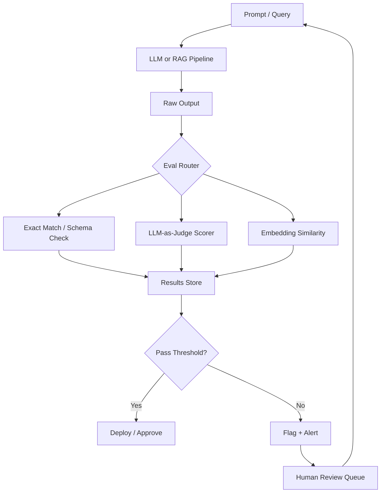
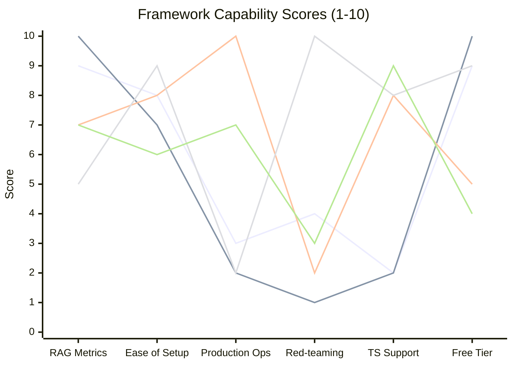
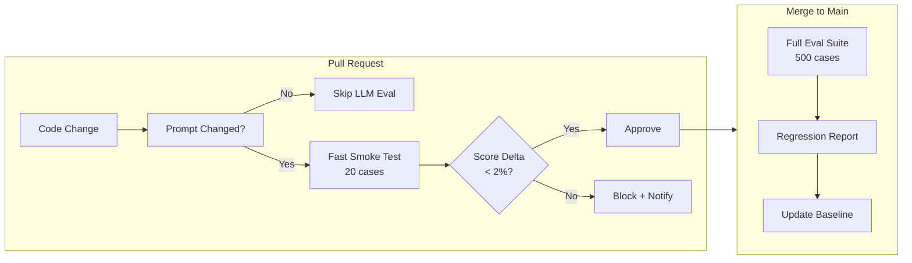

I shipped a RAG chatbot to production last year that scored 94% on our internal accuracy tests. Two weeks later, a customer showed me a screenshot: the bot had confidently cited a product policy we'd retired six months earlier. Our eval suite hadn't caught it because we were testing the wrong things with the wrong tools.

That experience sent me deep into the world of LLM evaluation frameworks. This guide is the resource I wish I'd had before that embarrassing incident — a practical breakdown of the top LLM testing frameworks, the metrics that actually matter, and how to build an eval pipeline that catches real failures before your users do.



---

## Why LLM Testing Is Fundamentally Different

Unit testing for traditional software is binary: the function either returns the right value or it doesn't. LLM evaluation is probabilistic, multi-dimensional, and context-dependent. A response can be grammatically perfect, factually wrong, contextually irrelevant, and mildly toxic — all at once.

Three properties make LLM outputs uniquely hard to test:

**Non-determinism.** Most models run with temperature > 0. Run the same prompt ten times and you get ten slightly different answers. Your eval framework has to account for this variance, or you'll get flaky tests that pass and fail at random.

**No ground truth for open-ended tasks.** What's the "correct" summary of a 10-page document? There isn't one. Evaluation often requires a reference answer, a rubric, or another LLM acting as a judge — each of which introduces its own error rate.

**Distribution shift.** A prompt that worked perfectly with GPT-4o might produce worse results after a model update, or when the retrieved context changes, or when users start asking slightly different questions than your test set assumed. Static evals go stale fast.

This is why dedicated LLM testing frameworks exist. They're not replacing unit tests — they're adding a new layer that traditional CI pipelines don't have the vocabulary to express.

---

## Key Metrics That Actually Matter

Before picking a framework, you need to know what you're measuring. The LLM eval space has converged on a handful of dimensions:

**Correctness / Accuracy** — Does the answer match the reference answer or known fact? This ranges from exact string matching (for structured outputs) to semantic similarity scoring (for free-form text). Typical implementation: embedding cosine similarity or LLM-as-judge with a grading rubric.

**Faithfulness** — For RAG applications, does the response stay grounded in the retrieved context? A faithful response doesn't introduce facts that aren't present in the source documents. This is the metric that would have caught my production incident. Faithfulness scores below 0.85 are a serious red flag.

**Answer Relevance** — Is the response actually addressing what was asked? A model can be faithful to its context and still answer the wrong question. Relevance is measured by comparing the semantic meaning of the answer to the query, not the context.

**Toxicity / Safety** — Does the output contain harmful, biased, or policy-violating content? Most frameworks hook into a classifier model (often a fine-tuned BERT variant or a dedicated safety model) to score this dimension automatically.

**Latency** — Time to first token and total response time. This isn't a "quality" metric but it belongs in your eval suite. A response that takes 45 seconds may be accurate but unusable. Track p50, p90, and p99.

**Context Precision and Recall** (RAG-specific) — Are the retrieved chunks actually relevant to the question? Are you retrieving all the chunks you need? These two metrics diagnose retrieval problems separately from generation problems, which is critical for debugging.

---

## Top LLM Testing Frameworks

### DeepEval

DeepEval is my current default for greenfield projects. It's open-source (MIT license), Python-native, and ships with out-of-the-box implementations of 14+ metrics including faithfulness, answer relevance, contextual precision, contextual recall, hallucination, bias, and toxicity.

The killer feature is that its metrics are themselves LLM-powered — DeepEval uses a configurable judge model (defaulting to GPT-4o, but you can swap in Claude or any API-compatible model) to evaluate complex dimensions like faithfulness that can't be captured by heuristics alone.

Setup is genuinely fast:

```python
from deepeval import assert_test
from deepeval.metrics import FaithfulnessMetric, AnswerRelevancyMetric
from deepeval.test_case import LLMTestCase

test_case = LLMTestCase(
    input="What is our refund policy?",
    actual_output=chatbot_response,
    retrieval_context=retrieved_chunks
)

assert_test(test_case, [
    FaithfulnessMetric(threshold=0.85),
    AnswerRelevancyMetric(threshold=0.80)
])
```

DeepEval integrates with pytest, which means your LLM tests live alongside your unit tests and run in the same CI pipeline. The Confident AI cloud platform (paid tier) adds regression tracking, dataset management, and a visual dashboard — useful once your eval suite grows beyond a few dozen test cases.

**Pricing:** Open-source core is free. Confident AI cloud starts at $49/month for teams.

**Best for:** Python teams building RAG applications who want comprehensive out-of-the-box metrics and pytest integration.

---

### RAGAS

RAGAS (Retrieval Augmented Generation Assessment) is purpose-built for evaluating RAG pipelines. Where DeepEval is a general-purpose eval framework, RAGAS is laser-focused on the specific failure modes of retrieval-augmented systems.

Its core metrics — faithfulness, answer relevance, context precision, context recall, and context entity recall — map directly onto the components of a RAG pipeline. This makes it invaluable for diagnosing whether your quality problems live in the retriever or the generator.

RAGAS also introduced the concept of "reference-free evaluation": you can score faithfulness and relevance without needing manually labeled ground truth answers. This is a big deal for teams that can't afford to create large labeled datasets.

The framework supports LangChain and LlamaIndex natively, which covers most of the RAG pipeline ecosystem. Recent versions added support for async evaluation and batch processing, making it practical for large test sets.

**Pricing:** Fully open-source (Apache 2.0). No paid tier as of writing.

**Best for:** Teams with LangChain or LlamaIndex RAG pipelines who need deep diagnosis of retrieval vs. generation failures.

---

### LangSmith

LangSmith is Langchain's commercial observability and evaluation platform. It's less of a standalone testing framework and more of a full-stack operations tool: tracing, datasets, human annotation, automated evaluation, and a playground for prompt iteration — all in one place.

Where DeepEval and RAGAS are libraries you pull into your codebase, LangSmith is a SaaS platform you instrument your code to send data to. Every LLM call gets traced, stored, and made available for evaluation. This is both its strength (operational visibility) and its constraint (vendor lock-in to LangChain's ecosystem).

The evaluation workflow in LangSmith is solid: you build a dataset of input/output pairs, run evaluators (custom Python functions or LLM-powered graders) against them, and track metrics over time. The UI makes it easy for non-engineers to annotate outputs and contribute to the ground truth dataset.

For teams already using LangChain or LangGraph in production, LangSmith is the obvious choice. The tracing integration is one line of code and the visibility payoff is immediate.

**Pricing:** Free tier (up to 5,000 traces/month). Developer plan at $39/month. Plus plan at $299/month with higher limits and team features.

**Best for:** Teams running LangChain/LangGraph in production who want tracing, evaluation, and human annotation in a single platform.

---

### Promptfoo

Promptfoo takes a different philosophical approach: it's a CLI-first tool built for testing prompts before they ship, not evaluating production behavior after the fact. If DeepEval is pytest for LLM outputs, Promptfoo is more like a linter for your prompt engineering workflow.

You define test cases in YAML, run `promptfoo eval`, and get a report comparing multiple prompts or model configurations against your test set. It's fast, it's local, and it doesn't require you to adopt any particular framework or cloud platform.

```yaml
prompts:
  - "Answer this support question: {{question}}"
  - "You are a helpful support agent. Answer: {{question}}"

providers:
  - openai:gpt-4o
  - anthropic:claude-3-5-sonnet-20241022

tests:
  - vars:
      question: "How do I reset my password?"
    assert:
      - type: contains
        value: "reset"
      - type: llm-rubric
        value: "Response should be polite and under 100 words"
```

Promptfoo's red-teaming features are genuinely impressive — it can automatically generate adversarial inputs to probe for jailbreaks, PII leakage, and policy violations. For teams doing serious prompt hardening, this is worth the setup time.

**Pricing:** Open-source core is free. Promptfoo Cloud (team features, hosted results) starts at $500/month.

**Best for:** Prompt engineers who want a fast feedback loop for comparing prompts and models, especially teams doing safety/red-team testing.

---

### Braintrust

Braintrust is the most "enterprise" of the frameworks in this list. It's a cloud platform with a strong focus on experiment tracking, dataset versioning, and collaborative workflows — closer to MLflow or Weights & Biases than to a testing library.

The core loop in Braintrust is: create an experiment, run your LLM pipeline against a dataset, score the outputs with custom or built-in scorers, and compare against a baseline. Results are stored persistently, enabling true regression analysis across model versions, prompt changes, and dataset updates.

Braintrust's scoring API is clean and flexible — you can write scorers in Python or TypeScript, use their built-in LLM-as-judge scorers, or integrate third-party classifiers. The UI is polished enough that product managers can actually interpret the results, which matters for organizations where non-engineers need to participate in quality review.

The SDK supports both Python and TypeScript, and the TypeScript support is noticeably better than most competitors — relevant for teams with Next.js or Node.js inference layers.

**Pricing:** Free tier (limited experiments). Pro at $150/month. Enterprise pricing on request.

**Best for:** Enterprise teams who need experiment tracking, dataset versioning, and collaborative evaluation workflows across engineering and product.

---

## Framework Comparison

| Feature | DeepEval | RAGAS | LangSmith | Promptfoo | Braintrust |
|---|---|---|---|---|---|
| **Open-source** | Yes (MIT) | Yes (Apache 2) | No | Yes (core) | No |
| **RAG metrics** | Yes | Yes (specialized) | Yes | Limited | Yes |
| **Production tracing** | No | No | Yes | No | Partial |
| **Red-teaming** | Basic | No | No | Excellent | No |
| **TypeScript SDK** | No | No | Yes | Yes | Yes |
| **pytest integration** | Yes | Yes | No | No | No |
| **LLM-as-judge** | Yes | Yes | Yes | Yes | Yes |
| **Human annotation UI** | Via cloud | No | Yes | No | Yes |
| **Free tier** | Yes | Yes (fully) | Yes (limited) | Yes | Yes (limited) |
| **Best for** | RAG + pytest | RAG diagnosis | LangChain ops | Prompt testing | Enterprise |



*Lines represent DeepEval, RAGAS, LangSmith, Promptfoo, Braintrust (in order)*

---

## Building an Eval Suite from Scratch

Most teams skip directly to picking a framework and end up with an eval suite that looks thorough but catches nothing real. Here's the order of operations I've found actually works:

**Step 1: Collect real failure examples first.** Before writing a single test, spend a week logging actual production outputs and tagging the bad ones. What types of errors actually appear? Hallucinated facts? Unhelpful refusals? Responses that miss the point? Your test suite should exercise these failure modes, not the ones you imagined in a planning doc.

**Step 2: Define your task taxonomy.** Group your use cases into 3-5 distinct task types (e.g., "factual Q&A", "document summarization", "structured extraction", "policy lookup"). Each type needs different metrics and different thresholds. Don't use a single faithfulness threshold across all task types.

**Step 3: Build a seed dataset of 50-100 cases.** Small is fine to start. Each case needs: input, expected output (or a rubric), relevant context (if RAG), and a label for which task type it is. Store these in version control alongside your code.

**Step 4: Run your framework on the seed dataset.** Score every case. Manually review the ones where the automated score disagrees with your intuition. Calibrate your thresholds based on what the scores actually mean in practice, not what sounds reasonable in theory.

**Step 5: Add 10 new cases every week.** New cases should come from production failures, edge cases discovered in development, and deliberate adversarial examples. An eval suite that doesn't grow stops being useful.

---

## Regression Testing for Prompts

Prompt changes are the most common source of quality regressions, and the least often tested. Here's the pattern I use:

Every time I modify a prompt, I run a diff evaluation: run the old prompt and the new prompt against the same 100-case dataset, compare scores side by side, and require that the new prompt doesn't regress more than 2 percentage points on any metric before merging.

With Promptfoo this looks like:

```bash
promptfoo eval --output results-new.json
promptfoo eval --config prompts-old.yaml --output results-old.json
promptfoo compare results-old.json results-new.json
```

With DeepEval, it's a pytest run against two config fixtures. With Braintrust, it's built into the experiment comparison UI.

The key insight is that "the new prompt sounds better" is not a valid reason to ship. Every prompt change needs a before/after score delta.

---

## CI/CD Integration

LLM evals belong in your CI pipeline. A failing eval shouldn't necessarily block a deployment (latency and cost evals might be advisory), but faithfulness and toxicity failures absolutely should.

Here's a minimal GitHub Actions workflow using DeepEval:

```yaml
name: LLM Eval
on: [pull_request]

jobs:
  eval:
    runs-on: ubuntu-latest
    steps:
      - uses: actions/checkout@v4
      - name: Install deps
        run: pip install deepeval
      - name: Run eval suite
        env:
          OPENAI_API_KEY: ${{ secrets.OPENAI_API_KEY }}
        run: pytest tests/eval/ -v --tb=short
      - name: Upload results
        if: always()
        uses: actions/upload-artifact@v4
        with:
          name: eval-results
          path: eval_results.json
```

A few things I've learned the hard way about CI evals:

**Gate on the important metrics, not all metrics.** A 1-point drop in answer relevance on a prompt change that improves faithfulness by 5 points is a good trade. Don't block every PR on every metric.

**Cache your judge model calls.** LLM-as-judge evals are expensive. Cache results for test cases that haven't changed so you're only paying to evaluate the delta.

**Run a fast smoke test on every PR, full eval on merge to main.** Your fast smoke test might be 20 representative cases that run in under a minute. The full 500-case suite can run overnight on merges.



---

## Common Mistakes

**Evaluating outputs instead of outcomes.** A response can score 0.92 on faithfulness and still be useless to the user. Include task completion rate (did the user get what they needed?) as a metric, even if you have to measure it through user feedback rather than automation.

**Using GPT-4o as your only judge model.** LLM judges have biases — GPT-4o slightly favors verbose responses, Claude slightly favors cautious ones. Use at least two different judge models and flag cases where they disagree. Agreement between judges is itself a signal of eval quality.

**Building a huge dataset before validating your metrics.** I've seen teams spend three months labeling 2,000 examples only to discover their faithfulness threshold was calibrated wrong and half the labels were meaningless. Label 50 cases, validate your metrics make sense, then scale.

**Ignoring the reference context in RAG evals.** If you evaluate answer quality without checking whether the retrieved context was even correct, you're blaming the generator for retriever failures. Always include retrieval metrics alongside generation metrics.

**Running evals only before release.** Production distribution shifts over time. Set up a weekly eval run against a sample of real production traffic. Models get updated, knowledge bases get stale, and user query patterns evolve. Static evals don't catch any of this.

---

## Verdict

If I had to recommend one framework to someone starting today:

- **Building a RAG application in Python?** Start with DeepEval. The metrics are solid, the pytest integration is clean, and the documentation is good enough to get productive in an afternoon.

- **Running LangChain or LangGraph in production?** LangSmith is the obvious choice. The tracing alone is worth it, and the eval features integrate without any extra setup.

- **Testing prompts before shipping, especially for safety?** Promptfoo's CLI workflow and red-teaming capabilities are the best in class for this specific job.

- **Enterprise team that needs experiment tracking and team collaboration?** Braintrust's polish and TypeScript support make it worth the price.

- **Debugging a failing RAG pipeline?** RAGAS is the most targeted tool for separating retrieval failures from generation failures.

The honest answer is that most mature teams end up using two or three of these together. RAGAS for pipeline diagnosis, DeepEval for the pytest CI suite, and LangSmith for production tracing is a combination I've seen work well at multiple organizations. They complement rather than duplicate each other.

Whatever you pick, start earlier than feels necessary. The teams that have robust eval infrastructure when something breaks in production are the ones that fix it in hours instead of days.

---

## FAQ

### How many test cases do I actually need to start?

Start with 30-50 well-curated cases covering your most important task types and known failure modes. A small dataset of real, carefully chosen examples beats a large dataset of synthetic or poorly-labeled examples. You can always grow the dataset — what you can't easily undo is building your calibration around bad labels.

### Can I use an open-source judge model instead of GPT-4o or Claude?

Yes, and it's worth doing for cost reasons once you're running large eval suites. Llama-3-based judge models (particularly fine-tunes like Prometheus or Llama-3-Judge) perform surprisingly well on faithfulness and relevance scoring. They're weaker on nuanced rubrics and safety classification. A practical approach: use a strong commercial model to build your baseline, then validate that a cheaper open-source judge produces similar rankings before switching.

### How do I handle non-determinism in my evals?

For metrics like faithfulness and relevance, run each test case 3 times and average the scores. For correctness on structured outputs, use temperature=0 (deterministic) during eval runs. Set thresholds with a small buffer (e.g., require 0.87 when you care about 0.85) to account for variance. Flag test cases where scores vary by more than 0.10 across runs — that variance is itself a signal that the output is borderline and needs human review.

### What's the difference between offline evals and online evals?

Offline evals run against a static dataset before deployment — this is what DeepEval, RAGAS, and Promptfoo do by default. Online evals score real production traffic continuously — LangSmith and Braintrust support this. You need both. Offline evals catch regressions before they ship. Online evals catch distribution shift, real user behavior, and model degradation over time. Most teams start with offline and add online after they're comfortable with their metrics.

### How do I convince my team to invest time in eval infrastructure?

Frame it as incident prevention, not quality theater. Calculate the cost of your last production LLM incident: engineering hours to diagnose, time to fix, impact on users. A solid eval suite that catches one such incident per quarter pays for itself many times over. Start by automating the test that would have caught your last incident — that's usually the most persuasive demonstration you can give.
