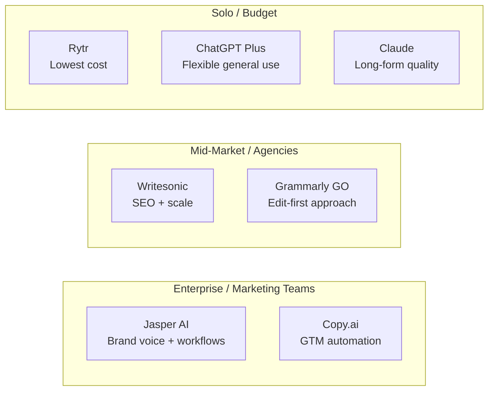
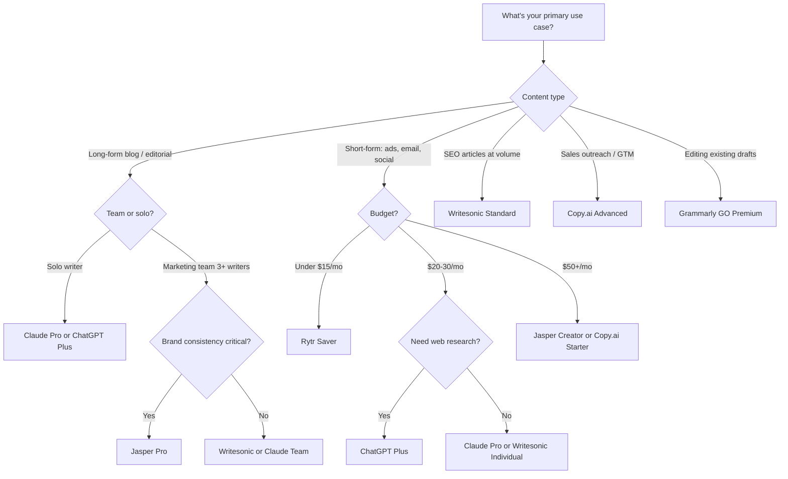

The AI writing tool market is crowded, expensive, and full of products that are essentially the same GPT-4 wrapper with a different color scheme. But the best tools in this space have genuinely differentiated — not just on output quality, but on workflow integration, brand voice features, SEO tooling, and the very different ways they handle team collaboration. Picking the wrong one means paying $100/month for features you'll never use, or worse, running your entire content operation through a tool that creates more editing work than it saves.

We spent time running real content briefs through seven of the most popular AI writing tools — blog posts, ad copy, email sequences, product descriptions — and graded them on output quality, editing workflow, pricing honesty, and how much human polish they actually require on the back end. Here's what we found.

---

## TL;DR

> **Best for marketing teams:** Jasper AI — the brand voice training and campaign workflow templates justify the price for teams publishing at volume.
>
> **Best for sales and GTM copy:** Copy.ai — its GTM automation workflows handle cold emails, sequences, and landing page variants better than any dedicated tool we tested.
>
> **Best for SEO content at scale:** Writesonic — the built-in Surfer SEO integration and bulk article generation make it the clearest win for content agencies running high-volume operations.
>
> **Best value for individuals:** Rytr — at $9/month it's not trying to be Jasper, but for freelancers churning out short-form copy it's genuinely good enough.
>
> **Best raw writing quality:** Claude (Anthropic) — not a dedicated writing tool, but the output quality on long-form analysis and nuanced editorial content beats every purpose-built tool here.

---

## Jasper AI

Jasper is the tool that taught the market what an AI writing platform could look like. Launched in 2021 as Jarvis, it rebranded and raised a $125M Series A in 2022 on the promise that enterprise marketing teams needed more than raw GPT-4 access — they needed branded, governed, scalable content infrastructure. That pitch has aged reasonably well.

The signature feature is Jasper's brand voice system. You feed it your existing content, tone guidelines, and product information, and it builds a style model that carries forward across everything the platform generates. In practice this works better than you'd expect: copy generated for a B2B SaaS company actually sounds different from copy generated for a DTC skincare brand, not just because of the prompt but because of how Jasper layers brand-specific context into every generation.

The template library — over 50 templates covering blog posts, social ads, email subjects, product descriptions, and more — is also genuinely useful for teams who don't want to write their own prompts from scratch. The Campaigns feature lets you define a product launch and generate a full suite of assets (blog post, LinkedIn copy, email, ad variants) that share a consistent message.

**Pricing:** Creator plan is $49/month (1 seat, unlimited words, basic brand voice). Pro is $69/month (up to 5 seats, full brand voice, 3 brand voices, campaign workflows). Business is custom pricing with SSO, advanced analytics, and API access. There's a 7-day free trial.

**Best for:** Marketing teams at mid-size to enterprise companies who need consistent brand voice across multiple writers and content types.

**Pros:**
- Brand voice training is the best in class — outputs genuinely reflect your tone
- Campaign mode creates asset suites from a single brief, not just individual pieces
- Large template library covers almost every marketing content type
- Integrates with Surfer SEO, Webflow, WordPress, and HubSpot
- Team features (user permissions, shared brand voices, workflow approvals) are solid

**Cons:**
- $49/month for a solo writer is hard to justify when Claude or ChatGPT costs $20
- The AI-generated first drafts still need meaningful editing — don't expect to publish directly
- Long-form blog posts frequently include generic filler paragraphs that need to be cut
- The SEO mode feels bolted on compared to Writesonic's native integration
- Business tier pricing is opaque — you'll need a sales call to get a real number

**Verdict:** Jasper earns its price for teams, not individuals. If you have 3+ writers and a need for consistent brand voice, the ROI math works. Solo bloggers or freelancers should look at cheaper options.

---

## Copy.ai

Copy.ai started as a short-form copy tool — the kind of thing you'd use to generate 10 Facebook ad variants in two minutes — and has since pivoted aggressively toward what it calls "GTM AI": the idea that AI should automate entire go-to-market workflows, not just generate individual copy assets.

That pivot is actually interesting. Copy.ai's Workflows product lets you build multi-step automation sequences: pull in a prospect's LinkedIn profile, enrich it with company data, generate a personalized cold email, and output it in a format ready for your sales tool — without a single human touch point until the rep reviews and sends. For sales development teams doing high-volume outbound, this is a genuinely different value proposition than "generate better copy."

In our testing, the short-form copy quality is competitive but not the best — Jasper's brand voice system produces more consistent results for marketing use cases. Where Copy.ai shines is in the automation layer. The ability to chain data sources, logic steps, and AI generation into a repeatable workflow is something most competitors haven't matched.

**Pricing:** Free plan includes 2,000 words/month and basic templates. Starter is $49/month for unlimited copy and basic workflows. Advanced is $249/month with full workflow automation, CRM integrations, and 5 seats. Enterprise is custom.

**Best for:** Sales and marketing teams who want to automate GTM workflows — not just generate copy, but string together enrichment, personalization, and content generation in automated sequences.

**Pros:**
- Workflows product is genuinely differentiated for sales and marketing automation
- Short-form copy (ads, email subject lines, CTAs) is fast and decent quality
- Good CRM integrations: Salesforce, HubSpot, Outreach
- Free tier is more generous than most competitors
- Infobase lets you upload company knowledge that carries across all generations

**Cons:**
- The pivot to "GTM AI" means the product is trying to be many things — it's not the best at any single one
- Long-form blog content quality is mediocre; you're better served by Jasper or Claude for that
- Workflow builder has a learning curve and occasionally produces unpredictable outputs
- $249/month for the Advanced plan is expensive if you only want copy generation
- Customer support response times can be slow on the lower tiers

**Verdict:** Copy.ai's best use case is sales workflow automation, not copywriting. If your primary need is better ad copy or blog posts, there are better-value tools. If you want to automate outbound sequences, it's in a category of its own.

---

## Writesonic

Writesonic plays a different game than Jasper or Copy.ai: it's explicitly built for SEO-focused content teams who need to produce optimized articles at scale. The native Surfer SEO integration — available on paid plans — means you can generate, score, and iterate on an article's keyword optimization inside a single workflow.

The Ahrefs-connected features (pulling keyword data directly into briefs) and the bulk article generation mode are genuinely useful for agencies managing large content calendars. We generated a batch of 10 product-category blog posts and found the structural quality to be consistently above average — better topic coverage, reasonable heading hierarchies, and fewer of the "transition filler" paragraphs that plague other tools.

What surprised us is how capable Writesonic's factual accuracy mode has become. Articles generated with this setting pull from real-time web data and cite sources inline, which is meaningful for content about pricing, product comparisons, or anything that needs current information. This isn't perfect — we found a couple of incorrect statistics that slipped through — but it's ahead of most competitors on grounding.

**Pricing:** Free plan gives 25 credits/month. Individual plan is $20/month for 100 articles/month. Standard is $99/month for unlimited articles and Surfer SEO integration. Agency plan starts at $299/month with API access, white-label, and dedicated support.

**Best for:** Content agencies and SEO-focused teams who need to produce optimized, keyword-targeted articles at volume.

**Pros:**
- Surfer SEO integration is the tightest in the market — brief, generate, and score in one place
- Real-time factual grounding with source citations reduces hallucination risk for current topics
- Bulk generation mode is practical for agencies managing large content calendars
- Chatbot and landing page generators are above-average quality
- Competitive pricing — the Individual plan at $20/month is good value for solo writers

**Cons:**
- Output quality on brand-specific content is behind Jasper — it lacks real brand voice training
- The interface has a lot of features that feel incomplete rather than polished
- Article quality on complex topics still requires significant subject matter expert editing
- Surfer SEO integration is only available on the Standard plan ($99/month) and above
- Customer success is noticeably better on the Agency tier; lower tiers feel underserved

**Verdict:** Writesonic is the strongest choice for SEO content at scale. If you're an agency running 50+ articles a month and need built-in optimization, the Standard plan at $99/month is competitive with buying Jasper plus Surfer separately.

---

## Rytr

Rytr is what happens when you strip an AI writing tool down to its essentials and focus on making it cheap and fast. At $9/month for the Saver plan, it's the most accessible paid option in this space, and for individual freelancers or small businesses producing short-form copy, it works.

The use case sweet spot is clear: Rytr is excellent for email copy, social media captions, product descriptions, and ad variants. The tone selector (26 tones from "convincing" to "inspirational") and use-case templates make it fast to produce passable copy without much prompt engineering. We found the short-form output quality competitive with early-era Jasper — solid, not impressive.

Where Rytr falls short is everything that requires depth. Long-form blog posts are structurally thin, factual accuracy is unreliable, and there's no brand voice system to speak of. The "Magic Command" feature (write your own prompt) is useful but you'll notice you're effectively just using a thin GPT-4 wrapper with a prettier UI.

**Pricing:** Free plan gives 10,000 characters/month. Saver is $9/month for 100,000 characters. Unlimited is $29/month. No enterprise or team tier.

**Best for:** Freelancers and solo operators who need fast short-form copy (emails, social, ads, product descriptions) without a large budget.

**Pros:**
- Most affordable paid tier in the market at $9/month
- Fast — simple templates generate copy in seconds
- Good use-case coverage for short-form: email, social, ads, descriptions
- 40+ languages supported
- Clean, simple interface with low learning curve

**Cons:**
- No brand voice training — every output has to be guided by prompt alone
- Long-form content quality is mediocre and structurally weak
- Factual accuracy is unreliable; no real-time grounding
- No team or collaboration features
- The ceiling is low — once you grow past basic short-form copy needs, you'll outgrow it fast

**Verdict:** Rytr is a good entry point for individuals who want AI writing assistance without a significant budget commitment. It's not trying to be Jasper and it succeeds at being Rytr. Scale past basic short-form needs and you'll want to upgrade.

---

## Claude (Anthropic)

Claude isn't marketed as a writing tool — it's a general-purpose AI assistant — but in practice it produces some of the best long-form writing output of anything in this roundup, and it's worth including specifically because content teams increasingly use it as a direct alternative to purpose-built writing tools.

What makes Claude stand out is its instruction fidelity and long-context capability. Give it a 10,000-word document to analyze and summarize, or a 2,000-word draft to revise in a specific editorial voice, and it handles the entire context window coherently — something most writing tools can't match because they're generating from brief inputs rather than reasoning over existing content.

In our testing, Claude's long-form blog posts had the most natural editorial voice and the fewest filler paragraphs. It's also noticeably more willing to say "I don't know" or hedge a claim rather than confidently state something incorrect — which is important for content teams with editorial standards.

**Pricing:** Claude.ai Pro is $20/month for individual use with priority access and the largest context. API pricing is $3/1M input tokens and $15/1M output tokens for Claude 3.5 Sonnet. Team plan is $25/seat/month.

**Best for:** Content teams that need high-quality long-form writing, document analysis, and editorial revision — especially if they're already using Claude for other work.

**Pros:**
- Best raw writing quality for long-form editorial, analysis, and nuanced content
- 200K token context window handles massive documents that break other tools
- Instruction following is excellent — it maintains style, tone, and constraint guidelines across long generations
- No hallucinated facts or invented citations (it hedges uncertainty instead)
- $20/month competes favorably with purpose-built tools on per-output quality

**Cons:**
- No writing-specific templates, brand voice training, or SEO integration
- No real-time web access for current pricing, product data, or news
- Requires more prompt engineering than template-driven tools
- No bulk generation or content calendar features
- Team collaboration features are basic compared to Jasper or Copy.ai

**Verdict:** Use Claude when output quality matters more than workflow automation. It's the best pure writing engine in this comparison, but it's not a content management platform — you'll need to handle templates, workflows, and SEO integration yourself.

---

## ChatGPT Plus

ChatGPT is the baseline that every other tool in this list is compared against, and in 2025 it's a more capable writing tool than its reputation among content professionals suggests. The addition of real-time web browsing, code execution, and memory across conversations has made it meaningfully more useful for content workflows.

The biggest practical advantage ChatGPT has over Claude is the ability to run research and write in a single session — browse a competitor's pricing page, pull recent stats from a news article, and incorporate that into a draft without switching tools. For content that needs to be current and grounded, this matters.

The Custom GPTs feature also lets you build reusable writing assistants with persistent instructions — effectively a low-code brand voice and template system. A marketing team can build a "Blog Writer GPT" that always follows their style guide, uses their tone, and starts from their preferred article structure. It's not as polished as Jasper's brand voice system, but it's more flexible and it's included in the $20/month plan.

**Pricing:** ChatGPT Plus is $20/month. Team plan is $25/seat/month with longer context and no data training. Enterprise is custom.

**Best for:** Teams that need flexible AI assistance across writing, research, and analysis — and who value the ability to browse the web and run code in the same session as drafting.

**Pros:**
- Real-time web browsing is genuinely useful for current-event content and research
- Custom GPTs enable reusable writing assistants with persistent style instructions
- Code Interpreter can analyze data files and create charts for data-driven content
- Broad ecosystem: DALL-E for images, plugins for integrations, memory for context persistence
- Strong short-form output for ads, emails, and social

**Cons:**
- Long-form quality and instruction fidelity are behind Claude for complex editorial work
- Custom GPTs require setup and maintenance — it's not as turnkey as Jasper's templates
- Context length (128K tokens) is shorter than Claude's 200K
- Writing quality degrades on longer outputs — the second half of a long article is noticeably weaker
- No native SEO integration

**Verdict:** ChatGPT Plus is the most versatile tool in this list for teams who do many different things with AI. It's not the best pure writing tool, but the web browsing and ecosystem integrations make it indispensable for content teams that need research-backed, current content.

---

## Grammarly GO

Grammarly GO is a different kind of tool than everything else in this roundup. Rather than generating content from a brief, it sits in your existing workflow — email, Google Docs, Notion, browser — and offers AI-assisted writing, rewriting, and style improvement inline.

The value proposition is "edit-first AI" rather than "generate-first AI," and for writers who already have a draft-and-edit workflow, it's a more natural fit than Jasper or Copy.ai. You write your rough draft, then use Grammarly GO to improve tone, clarity, concision, and grammar in a single integrated pass.

What surprised us is how good the context-awareness has become. When you ask Grammarly to improve a paragraph, it actually understands what the paragraph is trying to do and improves it in that direction — rather than rewriting it into generic corporate-speak. The Adjust the Tone feature (more confident, more formal, more casual) is granular and consistently useful.

**Pricing:** Free plan includes basic grammar and tone. Premium is $12/month with full grammar, clarity, and style suggestions. Business is $15/seat/month with team style guides, brand tone, and analytics. Grammarly GO (AI generation features) are included on Premium and above.

**Best for:** Writers who prefer a draft-and-edit workflow rather than AI-first generation, and teams who want AI assistance embedded directly in their existing tools rather than a separate platform.

**Pros:**
- Inline editing experience is the most natural of any tool here — it goes where you write
- Context-aware rewriting actually preserves the intent of your original draft
- Broad app coverage: Gmail, Outlook, Google Docs, Notion, Slack, browser
- Business plan's team style guides are useful for enforcing consistent voice across teams
- Most affordable team pricing in this roundup at $15/seat/month

**Cons:**
- Not a generation tool — if you need to generate 20 blog posts from briefs, look elsewhere
- AI generation features (Grammarly GO) are limited compared to dedicated writing platforms
- Free plan doesn't include the AI writing features that make GO compelling
- Long-form content generation is weak; it's built for editing, not drafting
- The product tries to do too many things — spelling checker, plagiarism, AI generation, style guide — and none of them are best-in-class

**Verdict:** Grammarly GO is the best choice if you want AI assistance embedded in your existing writing workflow rather than a separate content generation platform. For teams with experienced writers who need editing support, it's excellent. For teams that need to generate content from scratch at volume, look at Jasper or Writesonic.

---

## Head-to-Head Comparison

| Feature | Jasper | Copy.ai | Writesonic | Rytr | Claude | ChatGPT | Grammarly GO |
|---|---|---|---|---|---|---|---|
| **Starting price** | $49/mo | $49/mo | $20/mo | $9/mo | $20/mo | $20/mo | $12/mo |
| **Team plan** | Yes | Yes | Yes | No | Yes | Yes | Yes |
| **Brand voice training** | Excellent | Basic | No | No | Via prompt | Via GPT | Via style guide |
| **Long-form quality** | Good | Mediocre | Good | Poor | Excellent | Good | Editing only |
| **Short-form quality** | Excellent | Excellent | Good | Good | Good | Good | Editing only |
| **SEO integration** | Surfer (paid) | No | Surfer (native) | No | No | No | No |
| **Real-time web access** | No | No | Yes | No | No | Yes | No |
| **Workflow automation** | Campaign mode | GTM workflows | Bulk gen | No | No | Custom GPTs | No |
| **Free tier** | 7-day trial | 2,000 words | 25 credits | 10K chars | No | Yes (limited) | Yes |
| **Best at** | Brand content | GTM automation | SEO scale | Budget short-form | Editorial quality | Research + write | Inline editing |

---

```mermaid
xychart-beta
    title "AI Writing Tool Scores (0-10, Our Testing)"
    x-axis ["Long-form Quality", "Short-form Quality", "Brand Voice", "SEO Features", "Value for Price", "Team Features"]
    y-axis "Score" 0 --> 10
    bar [7, 9, 10, 6, 5, 8]
    bar [5, 9, 5, 3, 6, 7]
    bar [7, 7, 4, 10, 7, 6]
    bar [4, 7, 2, 2, 9, 2]
    bar [9, 7, 3, 1, 8, 5]
    bar [7, 7, 4, 2, 8, 7]
    bar [4, 5, 6, 1, 8, 7]
```

*Bars in order: Jasper, Copy.ai, Writesonic, Rytr, Claude, ChatGPT, Grammarly GO*

---

## How to Choose

---

## Open-Source Alternatives

The commercial tools in this roundup all sit on top of foundation models that you can access directly — and increasingly, teams with engineering resources are choosing to do exactly that.

**LLaMA 3 + custom prompts** via Ollama or a hosted endpoint gives you a free base for content generation with zero per-token cost. The output quality on writing tasks is competitive with Rytr and lower-tier Writesonic, though you'll need to invest in prompt engineering and evaluation infrastructure to get consistent results. Good for high-volume content operations that can absorb engineering time in exchange for zero marginal cost.

**Jan.ai** is a desktop application that runs open-source models locally. For writers who have data privacy concerns about sending content to cloud APIs — common in legal, healthcare, or financial services — running a local model through Jan.ai is a practical option. Mistral 7B runs adequately on a modern MacBook for short-form copy tasks.

**PrivateGPT** is a self-hosted document Q&A system. Less useful for raw content generation, but valuable for teams that want to query internal documentation, style guides, or brand knowledge without sending it to a third-party API. Combine it with a local model for a fully on-premises content research workflow.

The honest trade-off: open-source solutions require more setup, maintenance, and evaluation than commercial tools. They make sense when data privacy requirements are strict, volume is very high, or the budget for commercial tools isn't available.

---

## Final Recommendations

After running real content through each of these tools, here's how we'd structure the decision:

**For enterprise marketing teams:** Jasper Pro or Business. The brand voice system, campaign workflows, and team governance features justify the premium if you have 3+ writers publishing regularly. The ROI is in consistency and speed, not in raw output quality that can replace human writers.

**For sales teams and GTM automation:** Copy.ai Advanced. Nothing else in this list can automate an end-to-end outbound sequence with data enrichment and personalized copy generation in the same workflow. If outbound volume is your challenge, this is the right tool.

**For content agencies doing SEO at scale:** Writesonic Standard. The Surfer SEO integration and bulk generation features, combined with competitive pricing, make this the most practical tool for agencies managing large content calendars.

**For individual writers and freelancers:** Claude Pro at $20/month produces the best raw writing quality of anything in this list. If you don't need SEO integration or brand voice features, it's the highest-quality writing engine at the lowest comparable price.

**For teams on a tight budget:** Rytr Saver at $9/month for short-form or Writesonic Individual at $20/month for longer content. Both provide genuine value without requiring a significant budget commitment.

**For editing-first workflows:** Grammarly GO Business. If your writers already produce drafts and you need AI-assisted refinement — not generation — Grammarly's inline experience is superior to using any of the dedicated platforms as an editing tool.

---

## FAQ

### Can I use these tools to replace a content writer entirely?

No, and this is a common and expensive mistake. Every tool in this roundup produces output that requires meaningful human editing before publishing — the tools that don't advertise this are being dishonest about their limitations. What they realistically replace is the blank-page problem: the time spent going from nothing to a rough structure that a writer can improve. For a skilled writer, that might save 30-60 minutes per article. That's real value, but it's editing acceleration, not writer replacement.

### Does Google penalize AI-generated content?

Google's official position is that it evaluates content quality regardless of how it was produced. In practice, thinly generated content with no original perspective, factual depth, or editing tends to rank poorly — not because it was AI-generated, but because it's low-quality. The tools that produce the highest-risk output are the ones that encourage publishing without editing: bulk-generated articles with no subject matter review. Edited, research-backed content that happens to use AI in the drafting process is not at elevated risk.

### Is Jasper worth it for a solo content creator?

At $49/month, probably not. The features that justify Jasper's price — brand voice training, campaign workflows, team collaboration — are designed for multi-writer teams with consistent content operations. A solo creator publishing 2-4 articles a month will get better value from Claude Pro or ChatGPT Plus at $20/month and invest the $29 difference in a Surfer SEO subscription if SEO matters.

### How do these tools handle factual accuracy?

This is the biggest practical risk with AI writing tools. None of them guarantee factual accuracy, and several — particularly Rytr and Jasper — will confidently generate plausible-sounding statistics, quotes, or product details that are simply fabricated. ChatGPT and Writesonic have real-time web access that reduces (but doesn't eliminate) this risk. Claude is the most conservative: it hedges claims it's uncertain about rather than inventing confident answers. For any content where factual accuracy matters, always verify statistics, quotes, and product claims against primary sources before publishing.

### What's the actual time saving per article in practice?

In our testing: for a 1,500-word blog post, a skilled writer using a tool like Jasper or Claude saved roughly 45-90 minutes compared to writing from scratch — primarily in the outline and first-draft stages. The editing pass after AI generation took about the same time as editing any rough draft. The tools marketed as "publish-ready" content generators consistently disappointed — outputs required more editing work than the standard "rough draft" framing would suggest. Set expectations around AI as a drafting accelerator, not a publishing pipeline.
