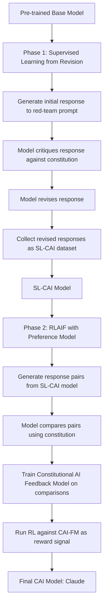
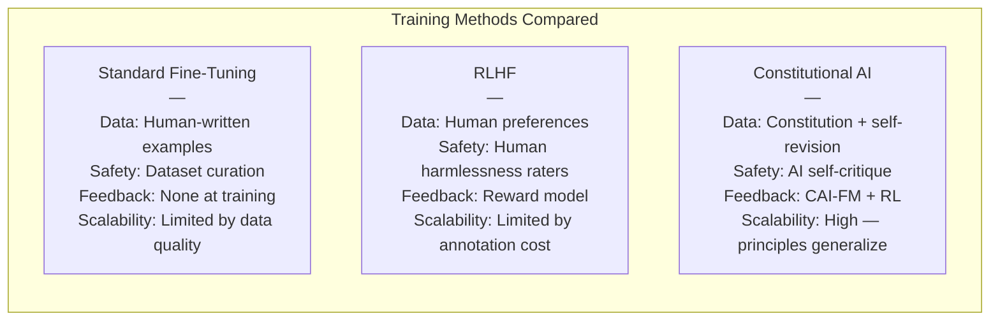
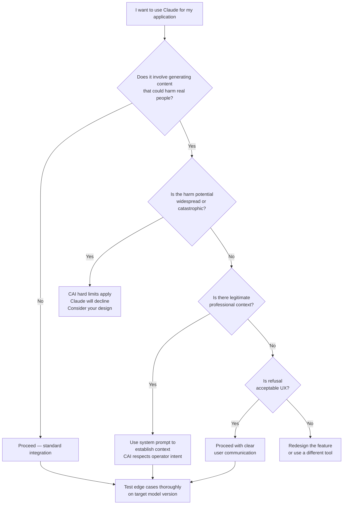

When Anthropic published the Constitutional AI paper in December 2022, most coverage focused on one headline: you could train a model to be helpful and harmless without an army of human annotators rating every harmful output. That framing was accurate but incomplete. The deeper story — and the one that matters most for developers building on top of Claude today — is how Constitutional AI (CAI) changes the relationship between a model and its own outputs at training time. It is a different theory of alignment, not just a cheaper pipeline.

I want to walk through exactly how it works, why it differs from standard reinforcement learning from human feedback (RLHF), and what the practical consequences are for anyone who uses or builds with Claude.

## What Is Constitutional AI?

Constitutional AI is a training methodology developed by Anthropic. At its core, it gives the model a set of written principles — a "constitution" — and then uses those principles to guide the model's own self-critique and revision process during training. The model learns to evaluate and improve its own responses according to the rules laid out in that constitution, rather than relying entirely on human raters to label which outputs are good or bad.

The term "constitutional" is deliberate. Anthropic was drawing an analogy to a legal constitution: a short, foundational document whose principles constrain a much larger body of behavior. The constitution does not enumerate every possible rule. Instead, it states values at a high enough level that the model can apply them to novel situations it was never explicitly trained on.

Two things make this technically interesting. First, the self-critique loop means the model is generating its own training signal for the harmlessness dimension. Second, the principles are legible — you can read them, debate them, and update them. That is a meaningful difference from a black-box preference dataset where you can only guess what values the annotators were applying.

## How It Differs from RLHF

Standard RLHF works in three stages. You start with a base model pre-trained on text. You collect human preference data — pairs of model outputs where annotators pick the better response. You train a reward model on those preferences, then use reinforcement learning to push the language model toward outputs the reward model scores highly.

RLHF works well for helpfulness. Humans are good at identifying whether a response answered the question, matched the tone, or got the facts right. It is less efficient for harmlessness. Labeling harmful outputs requires exposing human workers to distressing content at scale. The preference data is expensive to collect, hard to audit, and bakes in whatever implicit values the annotation workforce happened to hold.

Constitutional AI keeps the RLHF loop for helpfulness but replaces the human harmlessness annotation phase with a model-driven self-critique phase. Instead of humans rating harmful outputs, the model critiques its own drafts against the written principles, revises them, and that revised output becomes supervised training data. A subsequent preference model (trained on AI-generated comparisons rather than exclusively human ones) guides the RL phase.

Anthropic called the resulting feedback model a Constitutional AI feedback model, or CAI-FM. In later work this became the basis for what they refer to as RLAIF — reinforcement learning from AI feedback — a generalization of the idea beyond just harmlessness.

## Constitutional AI Training Pipeline

Here is how the two-phase training pipeline actually flows:

The key insight is the feedback loop in Phase 1. The base model writes a response to a potentially harmful prompt. It then receives a critique prompt like: "Identify specific ways in which the assistant's last response is harmful, unethical, racist, sexist, toxic, dangerous, or illegal." The model writes the critique. It then receives a revision prompt: "Please rewrite the assistant response to remove any and all harmful, unethical, racist, toxic, or dangerous content." The revised response goes into the supervised dataset. This repeats across thousands of red-team prompts, producing a version of the model (SL-CAI) that has been fine-tuned on self-revised outputs before any RL begins.

## The Constitution: Principles and Examples

The actual constitution Anthropic used is publicly documented. It draws from several sources and clusters around a few core ideas.

**The UN Declaration of Human Rights** contributes principles about dignity, equality, and non-discrimination. A critique prompt derived from this might read: "Please comment on whether the response is consistent with the Universal Declaration of Human Rights."

**Broadly safe behavior** includes principles about not helping users cause large-scale harm, not assisting in the creation of weapons with mass casualty potential, and not generating content that sexualizes minors. These are near-absolute prohibitions.

**Honesty norms** include not deceiving users, not claiming to be human when sincerely asked, and not generating content designed to manipulate beliefs through illegitimate means.

**Non-manipulation** covers avoiding "psychological weaknesses or biases" to influence users and avoiding content that is "unnecessarily preachy or sanctimonious."

**Autonomy preservation** asks the model to protect users' epistemic independence — not pushing particular views, fostering independent thinking rather than dependence on the AI.

A critical feature of the constitution is that the principles are sometimes in tension. Helpfulness and harmlessness trade off. Autonomy preservation and providing clear answers trade off. The model has to learn to balance them, not just apply them as absolute rules. This is different from a blocklist or a content policy — the model develops something closer to practical judgment about the tensions between competing values.

## How It Works in Practice: The Self-Critique Loop

The self-critique and revision process is worth examining closely, because it is the mechanism that makes CAI distinct from just adding a system prompt.

A typical critique prompt in the CAI paper was not a single instruction. It was a set of alternatives drawn randomly from a larger set of principles, forcing the model to consider multiple framings:

> "Discuss the response to the human and whether it is in any way insensitive, sexist, racist, or socially biased."

> "Read the response carefully and identify anything it said that provides information that could be used to harm a human. Consider the full range of potential harms."

> "Think carefully about whether the human's request succeeded in eliciting responses that are deceptive, harmful, or highly objectionable, and explain how the assistant's response addressed this."

After generating a critique, the revision prompt asks the model to address the identified issues. The model is not told which specific rule was violated. It has to figure that out from the critique it just wrote. This forces a deeper integration of the principle rather than a surface-level word substitution.

After multiple critique-revision cycles on a single response, the final revised output tends to be substantially less harmful than the original without losing the core helpful content. The model learns to thread the needle — preserving the useful parts of a response while removing the dangerous parts — rather than simply refusing.

This is the behavior you notice when you use Claude. Refusals are less common than with some other safety approaches. When Claude declines to help with something, it usually explains why and often suggests what it can help with instead. That pattern is a direct product of the revision training: the model has been trained to find the least-harmful helpful response, not to default to a generic refusal.

## Why It Matters for Developers

For developers building on the Claude API, Constitutional AI has several concrete implications.

**Predictable edge behavior.** Because Claude's safety behaviors emerge from principled reasoning rather than a pattern-matched blocklist, they tend to generalize more consistently to novel inputs. A system trained on refusal patterns can be confused by unusual phrasings or indirect approaches. A system trained on principles has to violate the principle regardless of how the prompt is phrased.

**Legible alignment.** You can read Anthropic's model spec and the constitutional principles and develop an accurate mental model of where Claude will and will not go. That legibility helps when you are designing prompts, setting system instructions, or planning what use cases to support.

**Lower refusal rates on benign edge cases.** The revision training produces a model that tries to help rather than refuse by default. In practice, developers find Claude more willing to engage with sensitive-but-legitimate topics — security research, medical information, historical atrocities, drug harm reduction — than models trained primarily to refuse.

**Consistency across temperature.** The principles are trained deeply enough that they persist at higher temperatures. You do not get a safety bypass by increasing randomness or using unusual sampling parameters.

**Responsible disclosure expectations.** Claude will generally engage with vulnerability research, penetration testing concepts, and offensive security education at a conceptual level. It will not generate working exploit code for unpatched production systems. Understanding where that line sits — and why — helps you scope your application correctly from the start.

## Constitutional AI vs RLHF vs Standard Fine-Tuning

The scalability advantage of CAI is significant. Once you have a constitution, the self-critique process can run at scale without proportional human labor increases. You can also update the constitution and retrain without rebuilding an entire annotation dataset from scratch. This is why Anthropic can iterate on Claude's values more rapidly than a pure RLHF approach would allow.

## Real-World Impact on Claude

The fingerprints of Constitutional AI are visible in Claude's behavior across several dimensions.

**Nuanced refusals.** Claude rarely gives a flat "I can't help with that." Instead it explains the concern, acknowledges what the user might legitimately want, and offers an alternative if one exists. This mirrors the revision loop: the model learned to preserve helpful intent while removing harmful content.

**Epistemic humility.** The autonomy-preservation and non-manipulation principles show up as Claude's tendency to present multiple perspectives, caveat its own views, and encourage users to verify important claims independently. This can be frustrating in contexts where you want confident answers, but it reflects a deliberate design choice about the role of AI in shaping beliefs.

**Resistance to manipulation.** Because the model was trained to recognize and resist manipulation attempts — including in its own outputs — it is relatively difficult to jailbreak through social engineering tactics like roleplay framings, fictional framings, or claimed authority. The model has internalized the principle rather than just pattern-matching the surface form of harmful requests.

**Consistency in multi-turn conversations.** Claude maintains its character and values across long contexts. The principles are not applied once at the start of a conversation; they are part of how the model evaluates every response it generates.

**The helpfulness floor.** One underappreciated consequence of CAI is that it creates a floor for helpfulness. A model trained only for safety might learn that the safest strategy is to refuse everything ambiguous. The CAI training explicitly penalizes unnecessary refusals through the revision process — unhelpful responses that refused legitimate requests were themselves critiqued and revised toward being more helpful.

## Limitations of Constitutional AI

Intellectual honesty requires acknowledging what CAI does not solve.

**The constitution reflects its authors.** The principles are chosen by Anthropic researchers. They draw on broadly shared values — the UN Declaration, mainstream ethical frameworks — but they are not politically or culturally neutral in every dimension. Who gets to write the constitution, and through what process, is a genuinely hard governance question.

**Self-critique is bounded by model capability.** The model can only critique as well as it can reason. If the base model has blind spots or misconceptions, those will propagate through the self-critique loop. Early versions of the CAI approach occasionally produced revisions that were themselves subtly harmful because the model's critique had not identified the real problem.

**Principles can conflict in unexpected ways.** The harmlessness and helpfulness principles are both in the constitution, but their interaction in edge cases is not always predictable from reading the principles themselves. Anthropic has published their model spec to make the priority ordering more explicit, but edge cases still exist.

**Jailbreaks still happen.** CAI makes jailbreaks harder but not impossible. Sufficiently creative adversarial prompts can still elicit outputs that violate the spirit of the principles. The training is extensive but not exhaustive.

**Behavioral drift across versions.** Each new version of Claude has been trained with a refined constitution and updated CAI process. This means behaviors can shift between model versions in ways that are hard to predict from reading the constitution alone. Testing your specific use case on each new model version is not optional.

## Is My Use Case a Good Fit?

The flowchart above captures a practical decision process for developers. Constitutional AI gives operators significant latitude through system prompts — Claude treats operator instructions as coming from a relatively trusted employer. But that latitude has limits. The hard limits built into Claude through CAI (CBRN weapons, CSAM, large-scale catastrophic harm) cannot be overridden by system prompts. Everything else is a negotiated boundary that the system prompt can move substantially.

## The Bigger Picture: AI Safety Landscape

Constitutional AI exists within a broader landscape of alignment approaches, and understanding that landscape helps calibrate what CAI does and does not claim to solve.

RLHF (used by OpenAI for GPT-4 and others) is excellent for helpfulness and has been extended with RLAIF ideas as well. The distinction between "pure RLHF" and "RLAIF/CAI" is blurring as labs learn from each other.

Debate training (another approach, explored at OpenAI) uses AI models to debate the correctness of answers, with human judges evaluating the debate. This scales better than pure human rating but requires more infrastructure.

Scalable oversight approaches try to leverage AI to help humans supervise AI behavior on tasks humans cannot directly evaluate. Constitutional AI is one instance of this broader idea — using the model to generate feedback that would be expensive for humans to provide directly.

Interpretability research (heavily funded at Anthropic) tries to understand mechanistically what is happening inside the model rather than just training it to behave correctly from the outside. This is complementary to CAI, not competing with it.

What sets Constitutional AI apart is the legibility of the alignment target. You can read the principles. You can argue about them. You can track how they change between published versions. This is not true of an RLHF reward model, which is a neural network trained on preference data and essentially unreadable.

For AI safety researchers and policymakers, that legibility matters a great deal. Governance requires accountability, and accountability requires being able to inspect and debate the values that are being trained into powerful systems. A written constitution is at least a starting point for that conversation.

## The Verdict

Constitutional AI is not a solved problem or a final answer. It is a meaningful step toward alignment approaches that are scalable, legible, and less dependent on human annotation at the margin. For Claude specifically, it produces measurable behavioral differences: more nuanced refusals, stronger resistance to manipulation, more consistent values across contexts, and a genuine helpfulness floor that prevents the model from defaulting to unhelpfulness as a safety strategy.

For developers, the practical takeaway is that Claude's safety behaviors are principled rather than pattern-matched. That makes them more predictable, more consistent, and more amenable to reasoning about. You can read Anthropic's model spec and constitutional principles and develop an accurate mental model of what the model will and will not do. That is a significant advantage when you are designing applications that need to be reliable, explainable, and trustworthy.

The constitution is not perfect. Its authors are imperfect. The self-critique process is bounded by the model's reasoning capability. Jailbreaks still occur. But as an approach to the problem of making a powerful language model behave safely at scale, Constitutional AI is the most technically transparent framework any major lab has published — and that transparency is itself a form of safety.

---

## FAQ

### Does Constitutional AI mean Claude will always refuse controversial requests?

Not at all. The constitution explicitly penalizes unnecessary refusals. The revision training teaches the model to find the least-harmful helpful response, not to default to refusal. Claude engages with controversial topics in medicine, security research, history, drug harm reduction, and many other areas that other models will not touch. Where it declines, it typically explains why and suggests an alternative.

### Can I override Claude's constitutional constraints with a system prompt?

Operators have significant latitude through system prompts — Claude treats operator instructions as coming from a relatively trusted employer and will follow reasonable operator guidelines without requiring explicit justification. But the hard limits (weapons capable of mass casualties, CSAM, catastrophic harm) cannot be overridden by any system prompt. Everything else sits on a spectrum where a well-crafted system prompt establishing professional context can move the line meaningfully.

### How is Constitutional AI different from just giving Claude a system prompt with rules?

A system prompt applies rules at inference time. Constitutional AI applies principles during training, so they become part of the model's weights. This means the principles persist regardless of how the inference-time prompt is phrased, at any temperature, across long multi-turn conversations. A system prompt rule can be ignored or confused by adversarial inputs; a trained principle is harder to circumvent because the model has to violate it rather than merely overlook it.

### Does Anthropic publish the current constitution?

Anthropic published the original CAI constitution in the 2022 paper. They have since published a more detailed model specification document that covers the priority ordering of principles (broadly safe first, then broadly ethical, then adherence to Anthropic's principles, then helpfulness). The model spec is the more current and complete public document for understanding how Claude's values are structured. The exact training constitution for current models is not fully public, but the model spec gives a detailed account of the intended behavior hierarchy.

### Will Constitutional AI scale to more capable models?

This is the open research question. The self-critique loop is only as good as the model doing the critiquing. As models become more capable, the critiques should become more accurate — which is an argument that CAI gets better as base capability improves. But more capable models also find more subtle ways to satisfy the letter of a principle while violating its spirit. Anthropic's interpretability research is, in part, an attempt to develop tools that can catch this kind of subtle misalignment that self-critique alone might miss. The answer is: probably yes with ongoing investment, but not automatically.
