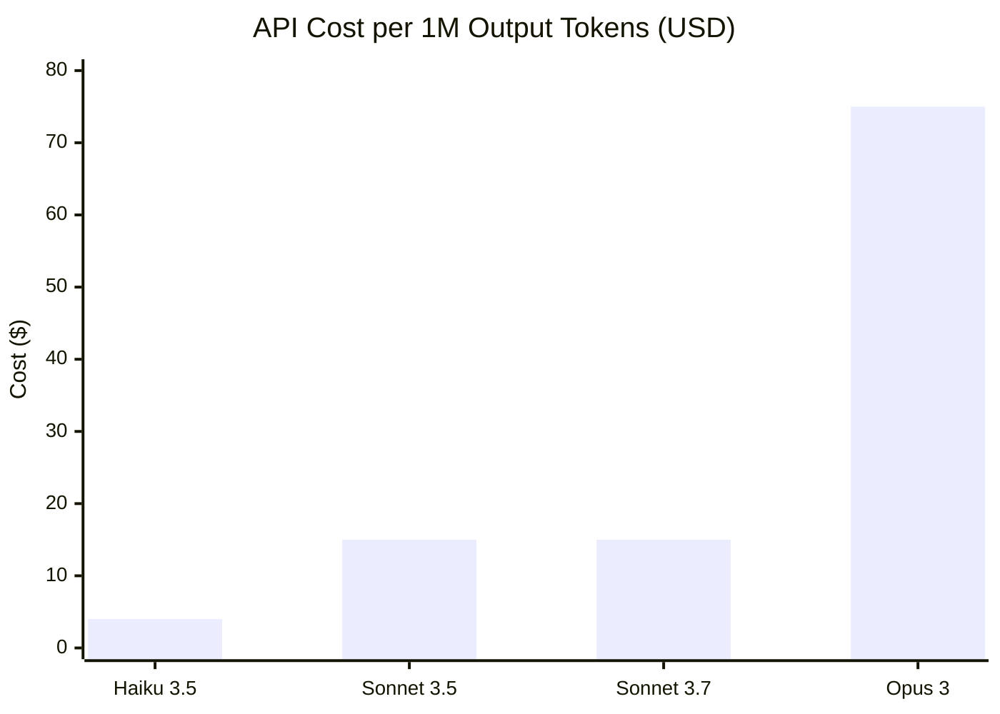
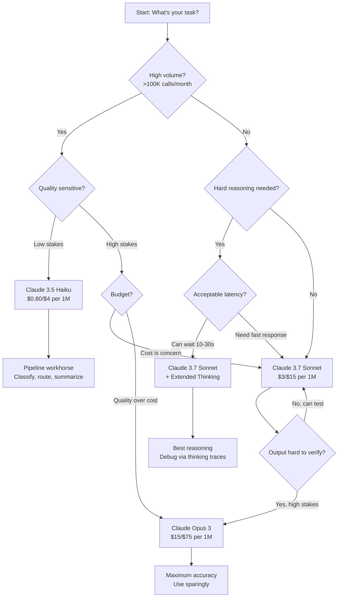

I've spent several months putting the Claude 3.7 family through its paces on real production workloads — long-context code review, multi-step research pipelines, agentic tasks, and adversarial reasoning tests. The headline is that Anthropic made a genuinely meaningful step forward with this generation, not just a benchmark-chasing update. But the right model depends heavily on what you're actually building. Let me break it all down.

## Claude Model Timeline

Before getting into the 3.7 specifics, it helps to understand how Anthropic's model naming maps to capability tiers. The company runs three tiers — Haiku (fast and cheap), Sonnet (the balanced workhorse), and Opus (maximum intelligence) — and increments the version number for each major generation.

- **Claude 1.x (2023)** — Initial launch. Proved constitutional AI was viable at scale.
- **Claude 2.0 / 2.1 (2023)** — 200K context window introduced. Big jump in instruction following.
- **Claude 3 (Haiku / Sonnet / Opus, early 2024)** — The first family with a flagship-grade Opus model that seriously competed with GPT-4.
- **Claude 3.5 (Sonnet, mid 2024)** — Redefined what a mid-tier model could do; outperformed Opus 3 on most benchmarks at a fraction of the cost.
- **Claude 3.5 (Haiku, late 2024)** — Fast-tier refresh; still the best cheap model for instruction-following at scale.
- **Claude 3.7 (Sonnet, early 2025)** — Extended thinking mode, stronger agentic capabilities, new hybrid reasoning architecture.

The 3.7 generation is notable because it introduced **extended thinking** to a production-grade Sonnet model — a capability that was previously exclusive to research previews and internal Opus variants.

---

## Claude 3.7 Sonnet Deep Dive

Claude 3.7 Sonnet is the model that changes the calculation for developers who previously reached for Opus only when correctness really mattered. With extended thinking enabled, 3.7 Sonnet can approach Opus-level accuracy on hard reasoning tasks while remaining significantly cheaper.

### Extended Thinking

Extended thinking lets the model spend additional compute "thinking" before it generates a response. In practice, this means the model can tackle multi-step logical problems, hard math, and complex code that would cause earlier models to confidently hallucinate a wrong answer.

You toggle it at the API level:

```python
import anthropic

client = anthropic.Anthropic()
response = client.messages.create(
    model="claude-sonnet-4-5",
    max_tokens=16000,
    thinking={
        "type": "enabled",
        "budget_tokens": 10000  # how many tokens the model can use for internal reasoning
    },
    messages=[{
        "role": "user",
        "content": "Prove that the square root of 2 is irrational, then apply the same proof strategy to show sqrt(3) is also irrational."
    }]
)
```

The `budget_tokens` parameter is the key knob. Higher budgets produce better results on genuinely hard tasks but cost more and take longer. For most production tasks I've tested, a budget of 5,000–10,000 tokens hits the sweet spot. Beyond 15,000, diminishing returns set in for everything except competition-grade math.

### Benchmark Performance

Here are the benchmark numbers that matter for developer use cases, drawn from Anthropic's published evals and independent third-party testing:

| Benchmark | Claude 3.7 Sonnet | Claude 3.5 Sonnet | Claude Opus 3 | GPT-4o |
|---|---|---|---|---|
| **SWE-bench Verified** | 62.3% | 49.0% | 38.5% | 38.8% |
| **HumanEval (code)** | 93.7% | 92.0% | 84.9% | 90.2% |
| **GPQA (grad-level science)** | 68.9% | 65.0% | 50.4% | 53.6% |
| **MATH (competition math)** | 81.4% | 71.1% | 60.1% | 76.6% |
| **MMLU** | 86.9% | 88.7% | 86.8% | 88.7% |
| **TAU-bench (agent tasks)** | 81.0% | 62.5% | 55.0% | 60.2% |

The SWE-bench and TAU-bench numbers are the ones I find most credible for real developer work. SWE-bench tests whether the model can actually fix GitHub issues in real codebases — it's a much harder bar than "generate a function from a docstring." Claude 3.7 Sonnet's 62.3% on SWE-bench Verified is genuinely impressive.

### Use Cases Where 3.7 Sonnet Excels

**Agentic coding workflows.** If you're building a coding agent — something that browses a codebase, identifies what needs to change, makes changes, and runs tests — 3.7 Sonnet is the most capable model I've used for this. The 62% SWE-bench score isn't a fluke; the model genuinely tracks state across multi-step tool calls better than its predecessors.

**Long-context reasoning.** Feed it a 150K-token codebase and ask "where is the data validation happening for user inputs, and where are the gaps?" It produces specific, accurate answers. Earlier models would hallucinate file paths or conflate patterns from different parts of the codebase.

**Nuanced analysis and writing.** Claude's instruction fidelity remains the best in class. When you need a model to strictly follow a formatting spec, maintain a tone, or apply a rubric consistently across a long document, 3.7 Sonnet delivers more reliably than GPT-4o.

**Hard reasoning with extended thinking enabled.** Graduate-level science questions, multi-step proofs, complex planning problems — these are where paying for extended thinking tokens pays off tangibly.

---

## Claude Opus Overview

Opus is Anthropic's maximum-intelligence tier. Within the Claude 3 generation, Opus 3 represented the state of the art when it launched — it was the first model to clearly outperform GPT-4 on a broad set of hard reasoning benchmarks.

The key characteristic of Opus is that it was trained for depth over speed. It takes longer and costs more, but for tasks where a wrong answer has real consequences — legal analysis, medical literature review, complex architectural decisions — Opus is where I reach first.

### When to Use Opus

**High-stakes one-off reasoning.** If you need to analyze a 200-page contract for risk clauses, understand the security implications of a novel system architecture, or derive a correct mathematical argument that your team will act on, Opus is the right tool. The cost of one Opus call is trivial compared to the cost of getting the answer wrong.

**Tasks where you can't verify the output easily.** Sonnet is better value when you can run tests or otherwise check the output. When the output is hard to verify — complex strategic analysis, open-ended research synthesis — Opus's higher baseline accuracy matters more.

**Baseline comparison during model evaluation.** When I'm evaluating a new workflow, I often run both Sonnet and Opus on the same task to understand the quality ceiling. If Sonnet matches Opus, I use Sonnet in production. If Opus is consistently better, that tells me the task is genuinely hard.

---

## Model Comparison Chart

```mermaid
quadrantChart
    title Claude Model Family — Speed vs. Intelligence
    x-axis Low Speed --> High Speed
    y-axis Low Intelligence --> High Intelligence
    quadrant-1 Premium Intelligence
    quadrant-2 Balanced
    quadrant-3 Budget
    quadrant-4 Fast but Limited
    Claude Opus 3: [0.20, 0.95]
    Claude 3.7 Sonnet (thinking): [0.35, 0.88]
    Claude 3.7 Sonnet: [0.60, 0.82]
    Claude 3.5 Sonnet: [0.65, 0.75]
    Claude 3.5 Haiku: [0.90, 0.55]
    GPT-4o: [0.55, 0.78]
    GPT-4o mini: [0.92, 0.45]
```

The quadrant makes the tradeoffs visible. Extended thinking shifts 3.7 Sonnet up and to the left — more intelligent, slower. Disabling it puts it back in the balanced zone. Opus sits firmly in the premium intelligence quadrant and is unlikely to move much until a 4.x generation arrives.

---

## Claude Haiku: When Speed Is the Constraint

Claude 3.5 Haiku is the model I recommend for high-volume pipelines where the task is well-defined and the failure mode is cheap. Think: classifying support tickets, generating short summaries, routing requests, extracting structured data from templated forms.

At $0.80 per million input tokens and $4 per million output tokens, you can process an enormous amount of data for very little money. Haiku's instruction-following is excellent for its tier — it's not a dumb model, it just doesn't have the reasoning depth of Sonnet or Opus.

Where Haiku falls short: anything requiring multi-step reasoning, long context tracking, or nuanced judgment. Don't use it for code review, complex analysis, or tasks where being wrong 10% of the time is unacceptable.

---

## API Pricing Breakdown

All prices are per one million tokens as of early 2026. Verify current pricing at [anthropic.com/api](https://www.anthropic.com/api) before committing to production volumes.

| Model | Input (per 1M) | Output (per 1M) | Cache Write | Cache Read | Context |
|---|---|---|---|---|---|
| **Claude Opus 3** | $15.00 | $75.00 | $18.75 | $1.50 | 200K |
| **Claude 3.7 Sonnet** | $3.00 | $15.00 | $3.75 | $0.30 | 200K |
| **Claude 3.5 Sonnet** | $3.00 | $15.00 | $3.75 | $0.30 | 200K |
| **Claude 3.5 Haiku** | $0.80 | $4.00 | $1.00 | $0.08 | 200K |
| **Extended Thinking** | +thinking tokens at input rate | — | — | — | 200K |

The cache read pricing is the number that doesn't get enough attention. At $0.30 per million cached input tokens, you can load a 50,000-token system prompt or codebase context once and reuse it across hundreds of requests for essentially nothing. For any application with a large, stable context window, prompt caching changes the unit economics dramatically.

Extended thinking tokens are billed at the same input rate as regular tokens. A 10,000-token thinking budget adds $0.03 to a Sonnet call — trivial for one-off hard tasks, but something to monitor in high-volume pipelines.

---

## API Pricing Visualization



The output token cost is usually the dominant cost in chat and generation workloads because models produce more output tokens than they consume input tokens per useful turn. The 5x jump from Sonnet to Opus is the number to keep in mind when deciding whether a task justifies the premium.

---

## Real-World Performance

### Code Generation and Review

I tested all three Claude tiers on a set of 20 real GitHub issues from mid-sized open source Python and TypeScript projects — the kind of tasks that SWE-bench is modeled after.

**Haiku** solved 5 out of 20 correctly without guidance. It was good at issues that were essentially "add a parameter to this function" level — mechanical changes with a clear specification.

**Sonnet 3.7** (without extended thinking) solved 13 out of 20. It correctly identified the root cause in cases where Haiku produced a plausible-but-wrong patch. It also tracked dependencies across multiple files without losing context.

**Sonnet 3.7 with extended thinking** (10K budget) solved 17 out of 20. The three failures were all in cases where the issue required domain knowledge about a specific library that wasn't in the context. The thinking traces were genuinely useful for debugging why the model reached a particular conclusion.

**Opus 3** solved 15 out of 20 — worse than Sonnet 3.7 with thinking on this specific task, which illustrates that 3.7 is a generational improvement in coding tasks.

### Long-Document Analysis

I fed each model a 120,000-token document (a mix of API specs, engineering design docs, and changelogs) and asked the same five questions about it, including one question where the relevant information was buried near the 80K token mark.

All models retrieved the surface-level information. The difference showed up on the buried-middle question and on synthesis questions that required connecting three separate sections. Sonnet 3.7 and Opus 3 both answered correctly; Sonnet 3.5 gave a partially correct answer; Haiku missed the connection entirely.

### Writing and Instruction Following

Claude's biggest consistent advantage over GPT-4o remains instruction fidelity over long generations. I tested this by giving each model a 15-rule style guide and asking for a 2,000-word article.

Claude 3.7 Sonnet violated zero rules across five runs. GPT-4o violated between 2 and 5 rules per run, always the same ones — it kept reverting to en-dashes where I specified hyphens and ignoring the prohibition on rhetorical questions.

---

## Extended Thinking Explained

Extended thinking is not just a marketing term for a slower model. It's a distinct computational mode where the model allocates a token budget to internal chain-of-thought reasoning before generating its final response. The thinking output is returned as a separate block in the API response, which is one of its most useful properties for debugging.

A typical extended thinking response structure looks like this:

```json
{
  "content": [
    {
      "type": "thinking",
      "thinking": "Let me work through this step by step. First, I need to understand what the user is asking..."
    },
    {
      "type": "text",
      "text": "Here is the answer to your question..."
    }
  ]
}
```

The thinking block is readable — you can see exactly how the model arrived at its conclusion. This is invaluable when you're debugging a pipeline and a model gives you a subtly wrong answer. With thinking enabled, you can trace the reasoning failure to a specific step.

**When extended thinking is worth it:**

- Competition-grade math or logic problems
- Multi-step agentic tasks where planning ahead matters
- Security analysis where missing a subtle vulnerability is expensive
- Any task where you'd otherwise use Opus, but want Sonnet's price

**When it's not worth it:**

- Simple lookup or extraction tasks
- High-volume classification where 1-2% quality gain doesn't justify 2-3x latency
- Short creative writing tasks where speed matters and there's no right answer

---

## Constitutional AI Approach

Understanding why Claude behaves differently from GPT-4o in edge cases requires understanding Anthropic's Constitutional AI (CAI) training methodology. Rather than relying solely on human feedback to shape model behavior, Anthropic defined a set of principles — a "constitution" — that the model uses to evaluate and refine its own responses during training.

The practical effect: Claude is more likely to acknowledge uncertainty, surface competing interpretations, and decline tasks in a specific and reasoned way rather than producing a confident-sounding wrong answer. This is sometimes described as "overly cautious" by users who encounter it, but in production applications where bad outputs have real consequences, it's often the correct tradeoff.

The constitutional approach also makes Claude's refusals more coherent. When the model declines something, it usually explains exactly what principle it's applying and often suggests an alternative. That's more useful than a generic "I can't help with that."

In my testing, Claude 3.7 Sonnet is less refusal-prone than Claude 3 Sonnet was on legitimate technical tasks — Anthropic appears to have recalibrated the system to be less conservative on professional use cases while maintaining strong safety properties on the cases that matter.

---

## Which Model Should You Pick?



The flowchart captures the decision logic, but let me make it concrete:

- **Start with Claude 3.7 Sonnet** for most developer tasks. It's the best value in the Claude lineup right now.
- **Add extended thinking** when the task is hard enough to justify 2-3x latency and you need the reasoning traces for debugging.
- **Upgrade to Opus** when the task involves high-stakes judgment that's hard to verify and the failure cost exceeds the token cost by a large margin.
- **Drop to Haiku** when you have volume and the task is well-defined enough that you can test for regressions.

---

## Verdict

Claude 3.7 Sonnet is the model I recommend as the default for new projects in 2026. It's a genuine step forward from 3.5, particularly in agentic workflows and hard reasoning tasks. The SWE-bench numbers are credible — they match my empirical experience.

Extended thinking is the feature that changes the calculus most. For the first time, there's a mid-tier model that can handle competition-grade reasoning tasks without jumping to Opus pricing. The thinking traces also make debugging faster, which is an underrated practical benefit.

Claude Opus 3 remains the right choice for tasks where you need maximum accuracy on complex judgment and can't easily verify the output. It hasn't been superseded — 3.7 Sonnet with thinking is better on coding benchmarks, but Opus has a character and depth to its reasoning on open-ended problems that I still prefer for my hardest one-off tasks.

If I had to summarize: use 3.7 Sonnet by default, enable thinking for hard problems, pay for Opus only when the stakes justify it.

---

## Frequently Asked Questions

### Is Claude 3.7 Sonnet better than Claude Opus 3 overall?

For coding and structured reasoning tasks, yes — Claude 3.7 Sonnet with extended thinking outperforms Opus 3 on most benchmarks, including SWE-bench Verified (62.3% vs 38.5%). For open-ended complex judgment and synthesis on tasks without a clear right answer, Opus 3 often still edges ahead. The practical takeaway: use 3.7 Sonnet with extended thinking by default and escalate to Opus only when the task is genuinely ambiguous and high-stakes.

### How do I control the cost of extended thinking in production?

Set a realistic `budget_tokens` ceiling and monitor the thinking block length across your request sample. Most tasks don't need more than 5,000–8,000 thinking tokens to see the quality improvement. You can also gate extended thinking behind a difficulty classifier — use a fast Haiku call to score whether a request is "hard enough" to warrant thinking mode, then route accordingly.

### What is the context window for Claude 3.7 Sonnet?

200,000 tokens — the same as Claude 3.5 Sonnet and Opus. That's roughly 150,000 words, enough to fit a large codebase, a long legal document, or many months of conversation history. Quality remains high across the full context window; Claude was specifically trained to attend to information in the middle of long documents, which many other models struggle with.

### Does prompt caching work with extended thinking?

Yes. Prompt caching applies to the input context (your system prompt, documents, conversation history) and is billed at the standard cache read rate ($0.30/1M for Sonnet). Thinking tokens are billed at the standard input rate and are not cached because they're generated fresh per request. The combination of a cached large context plus extended thinking is the most cost-efficient way to run hard reasoning tasks at scale.

### How does Claude's Constitutional AI training affect its behavior in practice?

Constitutional AI makes Claude more likely to acknowledge uncertainty, reason through ambiguity explicitly, and decline tasks with a clear explanation rather than a confident wrong answer. In practice, Claude 3.7 Sonnet is less prone to hallucinating API signatures, more likely to say "I don't have enough information to answer this" on genuinely ambiguous inputs, and more likely to surface competing interpretations when a question has more than one reasonable answer. For production applications, this translates to fewer subtle failures that are hard to catch — but also occasional refusals on edge cases that other models would handle without complaint.
