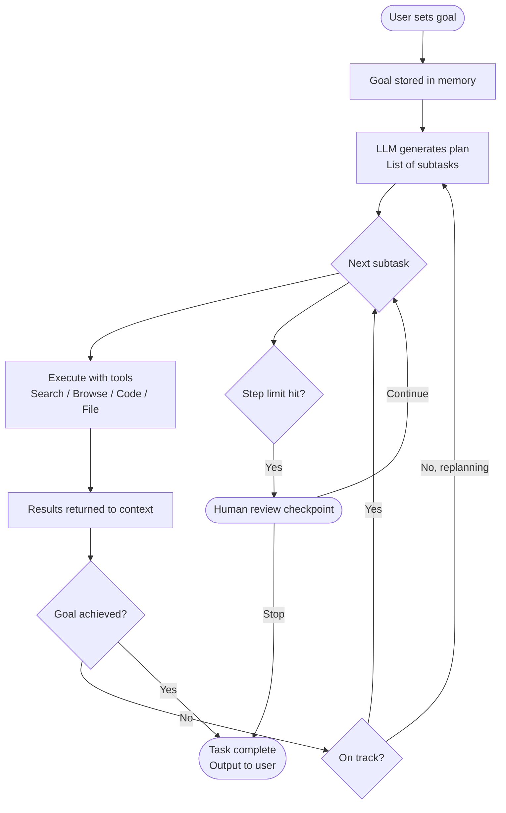
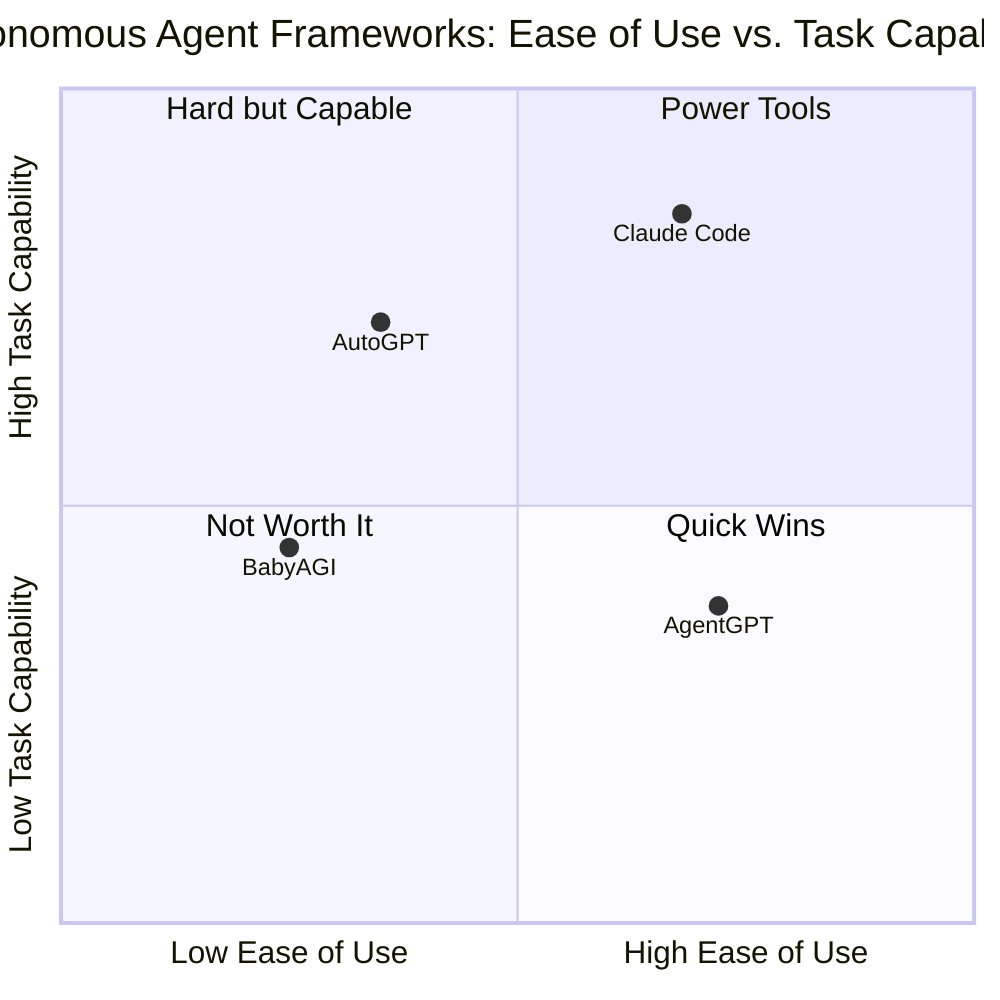
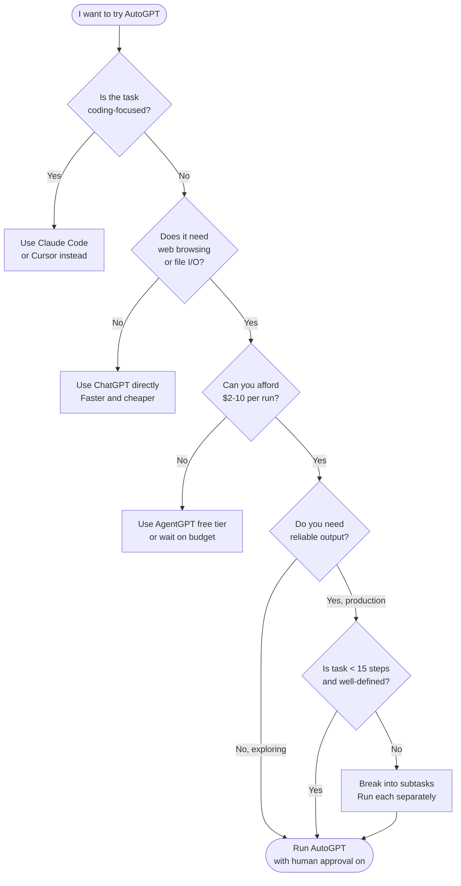

I spent two weeks running AutoGPT on real tasks — researching competitors, writing code, managing files, browsing the web — and came away with a verdict that is harder to summarize than I expected. AutoGPT is genuinely impressive as a piece of engineering and genuinely frustrating as a daily tool. If you have heard the hype and want to know whether autonomous AI agents are actually useful right now, this is the honest account.

## What Is AutoGPT?

AutoGPT is an open-source autonomous AI agent that uses a large language model — GPT-4 by default — to pursue a goal without step-by-step human prompting. You give it a goal, optionally a name and a role, and it figures out a plan, executes the plan using tools, evaluates the results, and keeps going until it decides the goal is met or you stop it.

The project launched on GitHub in March 2023 and became one of the fastest-growing repositories in history. As of late 2025 the codebase has matured considerably. There is now a web interface called AutoGPT Platform, a more stable CLI, plugin support, and a growing library of pre-built agents. The core idea has not changed: give the model agency over a loop rather than requiring a human to drive every turn.

The distinction between AutoGPT and a chatbot like ChatGPT is not just cosmetic. A chatbot waits for you. An autonomous agent acts on your behalf. That shift from reactive to proactive is what makes the technology both exciting and risky.

## How AutoGPT Works: The Goal-Plan-Execute-Evaluate Loop

The architecture of AutoGPT and most autonomous agents follows the same basic cycle. Understanding this cycle is essential for understanding both the power and the failure modes.

**Goal ingestion.** You provide a natural-language goal. "Research the top five competitors to Notion and write a comparison table." The agent stores this goal and any constraints you set.

**Planning.** The model generates a list of subtasks. For the Notion competitor research it might create tasks like: search for productivity tools, open each competitor's website, extract pricing, check G2 reviews, synthesize a table. Planning quality varies heavily with goal clarity. Vague goals produce sprawling plans that burn through tokens without finishing.

**Execution.** Each subtask is executed using available tools: web search, web browsing, Python execution, file reading and writing, API calls, memory retrieval. The model generates tool calls, the tool runs, results come back into context.

**Evaluation.** After each step the model evaluates whether the subtask is complete and whether it is making progress toward the goal. If not, it replans. This is where loops happen — the model can convince itself it is making progress while spinning in place.

**Termination.** The agent either declares the goal complete, hits a token or step limit, or waits for human approval if you have configured a checkpoint.

The diagram above shows why costs climb fast. Every loop iteration sends the growing context back to the model. A 20-step task on GPT-4 can easily push $3–8 in API fees before you see a finished output.

## Key Features

### Web Browsing

AutoGPT can open URLs, navigate pages, extract text, and follow links. I used it to pull pricing from six SaaS websites in one run. It worked, but it was slow — about 90 seconds per page — and it failed on JavaScript-heavy dashboards that required a login. Anything behind authentication is out of reach without custom tooling.

### Code Execution

The agent can write Python and execute it in a sandboxed environment. I tested it on data processing tasks: loading a CSV, computing summary statistics, and producing a chart. It succeeded cleanly three out of five times. The other two runs it wrote code that referenced libraries it assumed were installed but were not, then looped through install attempts that ate tokens without recovering.

### File Management

AutoGPT can read and write files on disk. This is where it genuinely saved me time. I pointed it at a folder of raw research notes and asked it to produce a structured briefing document. It read each file, synthesized the content, and wrote a clean output. No loops, no drama. File-in, file-out tasks are where the agent shines.

### Memory

AutoGPT uses two types of memory. Short-term memory is the context window — expensive, limited, shared with everything else happening in the loop. Long-term memory uses a vector store (Chroma or Pinecone depending on your setup) to retrieve relevant notes from earlier in the session. In practice, long-term retrieval helps on tasks that span many steps but adds latency and occasionally retrieves irrelevant content that confuses the next planning step.

## Setting Up AutoGPT

The setup is more involved than most AI tools. You need an OpenAI API key, Python 3.11 or later, and either Docker (recommended) or a local Python environment. The official AutoGPT Platform has a hosted version that skips the local setup, but you pay per run on top of API costs.

For local setup the rough steps are:

1. Clone the repository from `github.com/Significant-Gravitas/AutoGPT`
2. Copy `.env.template` to `.env` and add your `OPENAI_API_KEY`
3. Set `SMART_LLM=gpt-4-turbo` and `FAST_LLM=gpt-3.5-turbo` in `.env` to reduce cost
4. Run `docker compose up` or `./run.sh` depending on your platform
5. Navigate to `localhost:8000` for the web interface or use the CLI directly

The configuration file gives you control over: which model to use for reasoning versus fast tasks, whether to require human approval before each action, file system access limits, web browsing toggle, and plugin loading. I recommend enabling human approval for the first several runs. Watching the agent work in supervised mode teaches you far more about its failure modes than reading documentation.

## Real-World Testing: What Works and What Breaks

I ran AutoGPT on ten different task categories. Here is what I found.

**Research synthesis: works well.** Given a clear research question, a list of sources to check, and a structured output format, AutoGPT performs reliably. It is slower than doing it yourself but produces decent first drafts that need editing rather than complete rewrites.

**Writing long documents: mixed results.** It can draft outlines and section content but loses coherence across long outputs. By section four of a six-section document it was repeating points from section two. The lack of a persistent writing plan in context is the culprit.

**Coding tasks: hit or miss.** Short, well-defined scripts work. Anything requiring debugging loops or iterative refinement collapses into token-burning retry cycles. GPT-4 is a better coding assistant when used as a chatbot with human steering.

**Data extraction: works with caveats.** Structured extraction from plain-text web pages is reliable. Dynamic pages, login walls, and anti-scraping protections all cause failures that the agent handles poorly — it tends to retry the same broken approach multiple times.

**Email and calendar tasks: needs custom plugins.** Out of the box, AutoGPT cannot access your email or calendar. Plugin integrations exist but require setup and API credentials for each service. Not turnkey.

**Creative tasks: poor.** The planning overhead of the agent loop adds nothing to creative work. Use ChatGPT directly for writing, brainstorming, or ideation. The autonomous loop is overkill and the output is not better.

## AutoGPT vs. The Competition

Several autonomous agent frameworks have launched since AutoGPT. They differ significantly in architecture, cost profile, and target user.

**BabyAGI** is the philosophical ancestor of AutoGPT — a minimal implementation of the task-queue agent loop. It is easier to understand and modify but has fewer built-in tools. Good for learning the architecture, not for production use.

**AgentGPT** is a hosted, browser-based agent that requires no setup. The trade-off is lower capability — it cannot execute code or write files — and less control. It is the right choice if you want to demo autonomous agents without a local environment.

**Claude Code** is a different category. It is a coding-focused agentic tool built on Claude that operates inside your terminal with access to your file system and shell. Its task scope is intentionally narrow — it works on code — but within that scope it is substantially more reliable than AutoGPT. I use Claude Code daily. I use AutoGPT occasionally.

The honest summary: AutoGPT is the most capable general-purpose open-source agent but also the most demanding to run correctly. Claude Code wins on reliability for engineering tasks. AgentGPT wins on accessibility for non-technical users. BabyAGI wins if you want to study the architecture.

## Cost Analysis: Token Burn Is Real

This is the section most blog posts skip. AutoGPT is expensive to run compared to using a model directly.

Every planning step, every tool call result, and every evaluation sends a large chunk of context to the model. On GPT-4 Turbo the pricing is $0.01 per 1K input tokens and $0.03 per 1K output tokens. A modest 20-step research task typically consumes 40,000–80,000 tokens. That is $0.40–$1.60 per run on input alone, not counting output tokens or retries.

In my testing, a two-hour research task that I could do manually cost between $4 and $11 in API fees depending on how many dead ends the agent hit. A task that looped — which happened often — could cost $15–25 before I killed it. These are not costs you can ignore for anything approaching regular use.

The mitigation strategies are: use `gpt-3.5-turbo` for the fast model role, set strict step limits, use the human approval mode to kill bad loops early, and choose tasks where the output value exceeds the token cost. For a $200/month research budget you are getting roughly 15–50 meaningful task runs, depending on complexity.

## Limitations: The Hard Truth

**Loop failures are frequent.** The agent gets stuck replanning the same failed approach. It will try the same broken web request four times before giving up, burning tokens on each attempt. The evaluation step is not reliable enough to catch this consistently.

**Context window pressure degrades quality.** As the task grows longer the model has to work with an increasingly crowded context. Later steps are worse than earlier steps almost universally. Long tasks should be broken into shorter sub-sessions with human checkpoints.

**No real state persistence.** Close the session and the agent loses track of where it was. The vector memory helps but is not a substitute for proper task state management. If your system crashes mid-task you are starting over.

**Security requires careful configuration.** AutoGPT with file write access and code execution can do real damage if pointed at the wrong directories. The default configuration is more permissive than I would recommend for anything connected to production data.

**It is slow.** A task that takes a human 30 minutes often takes AutoGPT 90 minutes of wall-clock time when you account for API latency, tool execution, and retry cycles. Speed is not a selling point.

## Should You Use AutoGPT? A Decision Flowchart

## The Future of Autonomous Agents

The trajectory is clear even if the timeline is not. Autonomous agents will get better as models improve at planning, as tool ecosystems mature, and as frameworks develop better loop-termination logic. The evaluation step — deciding whether progress is real — is the hardest unsolved problem, and every major lab is working on it.

What I expect in the next one to two years: better multi-agent coordination where specialist agents hand off to each other instead of one generalist agent doing everything; persistent state management so tasks can resume across sessions; tighter integration with enterprise systems so agents can actually access the tools people use at work; and cost compression as model prices continue to fall.

The real shift will come when agent evaluation improves enough that you can trust the output without reviewing every step. Right now the overhead of supervision partially cancels the time savings. When that flips — when reviewing agent output takes ten minutes instead of thirty — autonomous agents become genuinely transformative for knowledge work.

## Verdict

AutoGPT is the best open-source autonomous agent available and also a tool I would not recommend to most users right now. The gap between the demo and reliable daily use is wide. Token costs are real. Loops are frustrating. Setup is non-trivial.

That said, for the right tasks — well-defined research synthesis, file-based data processing, multi-step web extraction — it works well enough to be worth the effort. The key is treating it as a supervised power tool, not a set-and-forget automation. Keep human approval enabled, set step limits, and pick tasks where you can judge the output quality quickly.

If you are a developer curious about the agent architecture: run it. It is one of the best ways to understand how autonomous agents actually work, where they fail, and what makes them hard to build reliably. If you are a business user looking for reliable automation: wait twelve months. The technology is improving fast enough that the version available in late 2026 will be materially better than what exists today.

## FAQ

### Is AutoGPT free to use?

AutoGPT itself is open-source and free. However it requires an OpenAI API key, and those calls cost real money. Expect $2–15 per non-trivial task on GPT-4. Using GPT-3.5 for the fast model role reduces costs by 60–70% at some quality cost.

### How is AutoGPT different from just using ChatGPT?

ChatGPT requires you to direct every step. AutoGPT plans and executes on its own across multiple steps, using tools like web browsers and code runners that ChatGPT does not have. The trade-off is cost, speed, and reliability — ChatGPT with human guidance is often faster for tasks that need good judgment.

### Can AutoGPT access the internet?

Yes. Web browsing is a built-in capability. It can open URLs, extract text, and follow links. It cannot log into websites or handle JavaScript-heavy single-page applications reliably. Anti-bot measures on many sites also cause failures.

### What is the difference between AutoGPT and an AI workflow tool like Zapier or Make?

Zapier and Make execute fixed, pre-defined workflows. AutoGPT plans its own workflow based on a goal and adapts when things do not work. AutoGPT is more flexible but less reliable and more expensive. For predictable, repetitive tasks, a traditional workflow tool is a better choice.

### Should I use AutoGPT for work tasks involving sensitive data?

I would not. AutoGPT sends everything to OpenAI's API, including any content it retrieves from files or the web. It also requires local file system access if you enable file tools. Review your company's data policies before using any cloud-connected agent on confidential information.
