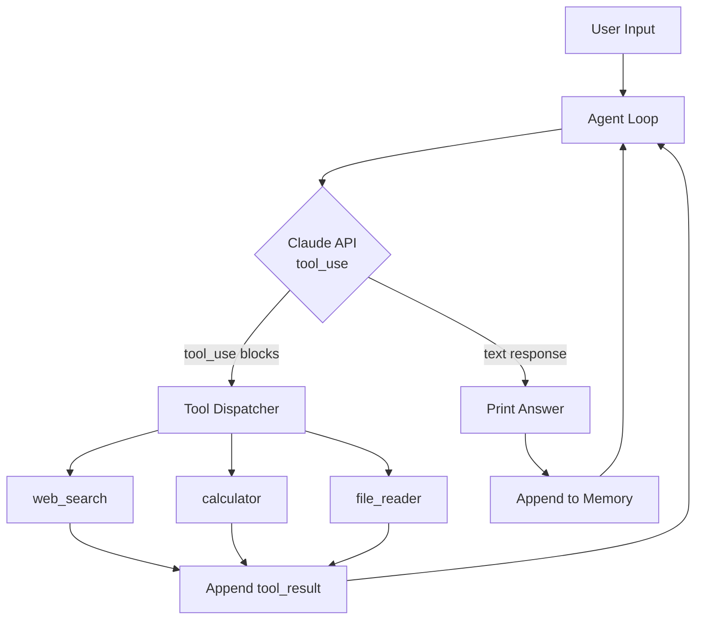
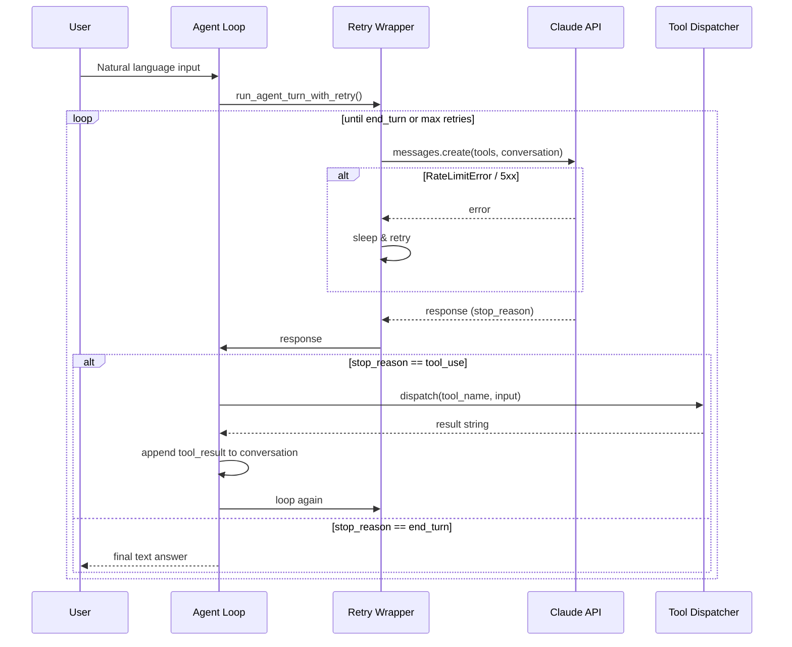
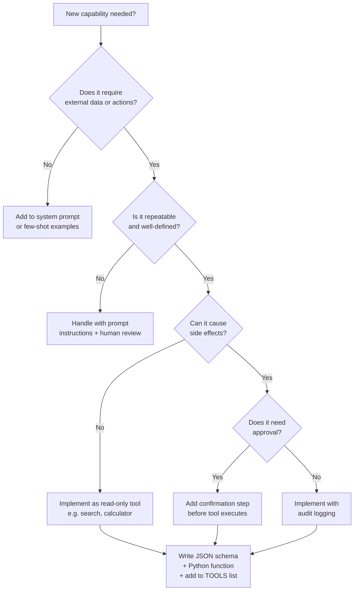

I spent weeks digging through docs, half-working GitHub repos, and blog posts that show you `hello world` and call it an agent. None of them gave me a complete, copy-paste-and-run example that actually does something useful.

This tutorial fixes that. By the end you will have a working Python AI agent powered by Claude that can search the web, run calculations, read files from disk, remember context across turns, and recover gracefully from errors. Every code block is complete and tested. No placeholders, no "left as an exercise for the reader."

If you want to **build an AI agent in Python** without the fluff, you are in the right place.

---

## What We're Building

We are building a general-purpose AI agent that:

- Accepts natural language instructions from the user
- Decides on its own which tools to call and in what order
- Passes tool results back to Claude and continues reasoning
- Maintains a conversation memory across turns
- Retries on transient errors and surfaces clear failure messages

The finished agent is about 250 lines of Python. It uses the Anthropic SDK directly, which means you understand exactly what is happening at every step — no magic framework abstractions hiding the important parts.

---

## Prerequisites

Before you start, make sure you have:

- Python 3.10 or later (`python --version`)
- An Anthropic API key — get one at [console.anthropic.com](https://console.anthropic.com)
- Familiarity with `async`/`await` is helpful but not required; the core loop is synchronous

---

## Agent Architecture

Here is how all the pieces connect. The agent sits in a loop: it sends the conversation history to Claude, receives either a final answer or a list of tool calls, executes those tools, appends the results, and repeats until Claude produces a text response with no more tool calls.



The dispatcher pattern in the middle is the key insight. Claude returns a list of tool calls; your code runs each one and packages the results in the exact format Claude expects. Claude never runs code directly — it only instructs your agent to run it.

---

## Step 1: Set Up the Environment

Create a project folder and install dependencies.

```bash
mkdir my-claude-agent && cd my-claude-agent
python -m venv .venv
source .venv/bin/activate          # Windows: .venv\Scripts\activate
pip install anthropic requests duckduckgo-search
```

Store your API key in the environment. Never hard-code it.

```bash
export ANTHROPIC_API_KEY="sk-ant-..."
```

Create the main file:

```bash
touch agent.py
```

Verify the SDK works:

```python
# quick_check.py
import anthropic, os

client = anthropic.Anthropic(api_key=os.environ["ANTHROPIC_API_KEY"])
msg = client.messages.create(
    model="claude-opus-4-5",
    max_tokens=64,
    messages=[{"role": "user", "content": "Say hi in one word."}],
)
print(msg.content[0].text)
```

If you see `Hello` or `Hi`, you are ready.

---

## Step 2: Define the Tools

Claude needs a JSON schema for each tool. The schema tells Claude what the tool does, what arguments it expects, and which arguments are required. Write these schemas first, then implement the actual Python functions they map to.

```python
# agent.py — Part 1: tool definitions
import anthropic
import json
import math
import os
import re
from pathlib import Path
from duckduckgo_search import DDGS

# ── Tool schemas passed to Claude ─────────────────────────────────────────────

TOOLS = [
    {
        "name": "web_search",
        "description": (
            "Search the web for current information. Use this when the user asks about "
            "recent events, facts you are unsure about, or anything that requires "
            "up-to-date data. Returns the top 5 results with titles, URLs, and snippets."
        ),
        "input_schema": {
            "type": "object",
            "properties": {
                "query": {
                    "type": "string",
                    "description": "The search query string.",
                }
            },
            "required": ["query"],
        },
    },
    {
        "name": "calculator",
        "description": (
            "Evaluate a mathematical expression and return the result. "
            "Supports basic arithmetic, exponentiation (**), and common math functions "
            "like sqrt(), sin(), cos(), log(). Do NOT use for code execution."
        ),
        "input_schema": {
            "type": "object",
            "properties": {
                "expression": {
                    "type": "string",
                    "description": "A valid Python math expression, e.g. '2 ** 10' or 'sqrt(144)'.",
                }
            },
            "required": ["expression"],
        },
    },
    {
        "name": "file_reader",
        "description": (
            "Read the contents of a local file and return them as a string. "
            "Use this when the user provides a file path or asks you to summarize, "
            "analyze, or answer questions about a local document."
        ),
        "input_schema": {
            "type": "object",
            "properties": {
                "path": {
                    "type": "string",
                    "description": "Absolute or relative path to the file.",
                },
                "max_chars": {
                    "type": "integer",
                    "description": "Maximum characters to return. Defaults to 4000.",
                },
            },
            "required": ["path"],
        },
    },
]

# ── Python implementations ────────────────────────────────────────────────────

def web_search(query: str) -> str:
    """Run a DuckDuckGo search and format the top results."""
    results = []
    with DDGS() as ddgs:
        for r in ddgs.text(query, max_results=5):
            results.append(f"Title: {r['title']}\nURL: {r['href']}\nSnippet: {r['body']}\n")
    if not results:
        return "No results found."
    return "\n---\n".join(results)


def calculator(expression: str) -> str:
    """Safely evaluate a math expression using only the math module."""
    # Allowlist: digits, operators, spaces, dots, parentheses, and math function names
    allowed = re.compile(r"^[\d\s\+\-\*\/\.\(\)\%\,\_a-zA-Z]+$")
    if not allowed.match(expression):
        return f"Error: expression contains disallowed characters: {expression}"
    safe_globals = {name: getattr(math, name) for name in dir(math) if not name.startswith("_")}
    safe_globals["__builtins__"] = {}
    try:
        result = eval(expression, safe_globals)  # noqa: S307 — sandboxed
        return str(result)
    except Exception as exc:
        return f"Error evaluating expression: {exc}"


def file_reader(path: str, max_chars: int = 4000) -> str:
    """Read a file from disk and return its contents, truncated if needed."""
    try:
        content = Path(path).read_text(encoding="utf-8")
    except FileNotFoundError:
        return f"Error: file not found at path '{path}'."
    except PermissionError:
        return f"Error: permission denied reading '{path}'."
    except Exception as exc:
        return f"Error reading file: {exc}"
    if len(content) > max_chars:
        content = content[:max_chars] + f"\n\n[... truncated at {max_chars} chars]"
    return content


# ── Dispatcher: route tool calls to implementations ──────────────────────────

TOOL_FUNCTIONS = {
    "web_search": web_search,
    "calculator": calculator,
    "file_reader": file_reader,
}


def dispatch(tool_name: str, tool_input: dict) -> str:
    """Call the named tool with the provided arguments."""
    fn = TOOL_FUNCTIONS.get(tool_name)
    if fn is None:
        return f"Error: unknown tool '{tool_name}'."
    return fn(**tool_input)
```

---

## Step 3: Build the Agent Loop

The agent loop is the heart of the project. It sends messages to Claude, handles tool_use responses, and keeps iterating until Claude produces a plain text reply.

```python
# agent.py — Part 2: the agent loop

MAX_ITERATIONS = 10   # safety cap on tool call rounds

def run_agent_turn(client: anthropic.Anthropic, conversation: list[dict]) -> str:
    """
    Run one turn of the agent loop.
    Sends the conversation to Claude, processes any tool calls,
    and returns the final text response.
    """
    for iteration in range(MAX_ITERATIONS):
        response = client.messages.create(
            model="claude-opus-4-5",
            max_tokens=4096,
            tools=TOOLS,
            messages=conversation,
            system=(
                "You are a helpful AI agent. When you need current information, "
                "use web_search. For math, use calculator. To read local files, "
                "use file_reader. Always reason step by step before calling a tool."
            ),
        )

        # ── Case 1: Claude is done, return text ──────────────────────────────
        if response.stop_reason == "end_turn":
            for block in response.content:
                if hasattr(block, "text"):
                    return block.text
            return "(No text response)"

        # ── Case 2: Claude wants to call tools ───────────────────────────────
        if response.stop_reason == "tool_use":
            # Append Claude's response (which includes tool_use blocks) to history
            conversation.append({"role": "assistant", "content": response.content})

            # Execute each tool call and collect results
            tool_results = []
            for block in response.content:
                if block.type == "tool_use":
                    print(f"  [tool] {block.name}({json.dumps(block.input, ensure_ascii=False)})")
                    result_text = dispatch(block.name, block.input)
                    tool_results.append(
                        {
                            "type": "tool_result",
                            "tool_use_id": block.id,
                            "content": result_text,
                        }
                    )

            # Append tool results as a user message
            conversation.append({"role": "user", "content": tool_results})
            continue  # loop back to let Claude process results

        # ── Case 3: unexpected stop reason ───────────────────────────────────
        return f"Unexpected stop reason: {response.stop_reason}"

    return "Error: agent exceeded maximum iterations without completing."
```

The critical line is `conversation.append({"role": "assistant", "content": response.content})`. You must pass back Claude's raw content blocks (which include the tool_use objects), not just the text. Then you append a `user` message containing the `tool_result` blocks. Claude reads those results and either calls more tools or writes the final answer.

---

## Step 4: Add Memory

Memory is just the conversation list. As long as you keep appending to it, Claude has full context of everything that happened. The only thing to manage is token budget — very long conversations can exceed model limits.

```python
# agent.py — Part 3: memory management

MAX_MEMORY_MESSAGES = 40   # keep last 20 exchanges (40 messages: user + assistant each)

class AgentMemory:
    """Maintains the rolling conversation window sent to Claude."""

    def __init__(self, system_context: str = ""):
        self.messages: list[dict] = []
        self.system_context = system_context  # optional per-session context

    def add_user(self, text: str) -> None:
        self.messages.append({"role": "user", "content": text})

    def add_assistant(self, text: str) -> None:
        self.messages.append({"role": "assistant", "content": text})

    def trim(self) -> None:
        """Drop oldest messages when the window gets too large."""
        if len(self.messages) > MAX_MEMORY_MESSAGES:
            # Always keep the first message so the agent remembers the initial task
            self.messages = self.messages[:1] + self.messages[-(MAX_MEMORY_MESSAGES - 1):]

    def as_list(self) -> list[dict]:
        return list(self.messages)
```

Using the memory object is simple. Before every API call you call `memory.as_list()`, and after getting the agent's response you call `memory.add_assistant(response_text)`. The `trim()` call keeps you under token limits without losing the thread of the conversation.

---

## Step 5: Add Error Handling

Production agents fail. The API can rate-limit you, a tool can throw an exception, or the network can drop out. Good error handling wraps the API call in a retry loop and packages tool errors as informative strings rather than letting them crash the process.

```python
# agent.py — Part 4: error handling with retry

import time
import anthropic

MAX_RETRIES = 3
RETRY_DELAY_SECONDS = 5


def run_agent_turn_with_retry(
    client: anthropic.Anthropic, conversation: list[dict]
) -> str:
    """Wrap run_agent_turn with exponential backoff for transient API errors."""
    last_error: Exception | None = None
    for attempt in range(1, MAX_RETRIES + 1):
        try:
            return run_agent_turn(client, conversation)
        except anthropic.RateLimitError as exc:
            last_error = exc
            wait = RETRY_DELAY_SECONDS * (2 ** (attempt - 1))
            print(f"  [retry] Rate limited. Waiting {wait}s (attempt {attempt}/{MAX_RETRIES})…")
            time.sleep(wait)
        except anthropic.APIStatusError as exc:
            # 5xx errors are transient; 4xx (except 429) are caller errors
            if exc.status_code >= 500:
                last_error = exc
                wait = RETRY_DELAY_SECONDS * attempt
                print(f"  [retry] Server error {exc.status_code}. Waiting {wait}s…")
                time.sleep(wait)
            else:
                raise  # Re-raise client errors immediately
        except anthropic.APIConnectionError as exc:
            last_error = exc
            print(f"  [retry] Connection error. Attempt {attempt}/{MAX_RETRIES}…")
            time.sleep(RETRY_DELAY_SECONDS)

    return f"Error: agent failed after {MAX_RETRIES} attempts. Last error: {last_error}"
```

Tool-level errors are already handled inside `dispatch()` — each implementation returns an error string instead of raising. That means Claude sees the error message as a tool result and can adapt: it might try a different query, tell the user the file does not exist, or attempt an alternative approach.

---

## Agent Workflow

Here is the complete runtime flow including retry logic and the tool dispatcher.



The retry wrapper is transparent to the rest of the agent. The loop only sees a function that either returns a string or raises after exhausting retries.

---

## Step 6: Test Your Agent

Now wire everything into a simple REPL. This is the complete `agent.py` entry point — add it below your previous code sections.

```python
# agent.py — Part 5: main entry point

def main() -> None:
    api_key = os.environ.get("ANTHROPIC_API_KEY")
    if not api_key:
        raise SystemExit("Set the ANTHROPIC_API_KEY environment variable before running.")

    client = anthropic.Anthropic(api_key=api_key)
    memory = AgentMemory()

    print("Claude AI Agent — type 'quit' to exit, 'reset' to clear memory.\n")

    while True:
        try:
            user_input = input("You: ").strip()
        except (KeyboardInterrupt, EOFError):
            print("\nBye!")
            break

        if not user_input:
            continue
        if user_input.lower() == "quit":
            break
        if user_input.lower() == "reset":
            memory = AgentMemory()
            print("Memory cleared.\n")
            continue

        memory.add_user(user_input)
        conversation = memory.as_list()

        print("Agent: thinking…")
        answer = run_agent_turn_with_retry(client, conversation)
        memory.add_assistant(answer)
        memory.trim()

        print(f"Agent: {answer}\n")


if __name__ == "__main__":
    main()
```

Run it:

```bash
python agent.py
```

Try these prompts to exercise each tool:

```
You: What is the square root of 1764?
You: Search for the latest news about Claude AI from Anthropic.
You: Read the file ./agent.py and summarize what it does.
You: How many seconds are in a leap year? Use the calculator.
```

You will see `[tool]` lines as the agent decides which tools to invoke, followed by the final answer once Claude has processed all results.

---

## Making It Production-Ready

The REPL above is enough to experiment. A production deployment needs a few more pieces.

**Structured logging** — replace `print()` calls with Python's `logging` module. Log every tool call, its inputs, its result length, and the total tokens used per turn. This is how you debug unexpected behavior a week after deployment.

**Token tracking** — the Anthropic SDK returns `usage` on every response. Accumulate `input_tokens` and `output_tokens` across turns and emit them as metrics. At scale, a single runaway agent can burn through your monthly budget in hours.

**Tool timeouts** — wrap each tool call in a `concurrent.futures.ThreadPoolExecutor` with a timeout. A web search that hangs for 30 seconds stalls your entire agent loop.

**Input validation** — before passing user input to the agent, check length and strip control characters. Very long inputs (>10k chars) should be chunked or rejected with a clear message.

**Secrets management** — load the API key from a secrets manager (AWS Secrets Manager, HashiCorp Vault, GCP Secret Manager) rather than from environment variables in production.

**FastAPI wrapper** — expose the agent as a POST endpoint so any client can call it:

```python
# server.py
from fastapi import FastAPI
from pydantic import BaseModel
import anthropic, os
from agent import AgentMemory, run_agent_turn_with_retry

app = FastAPI()
client = anthropic.Anthropic(api_key=os.environ["ANTHROPIC_API_KEY"])

# In production, store memory per session ID in Redis or a DB
_sessions: dict[str, AgentMemory] = {}

class ChatRequest(BaseModel):
    session_id: str
    message: str

@app.post("/chat")
def chat(req: ChatRequest):
    memory = _sessions.setdefault(req.session_id, AgentMemory())
    memory.add_user(req.message)
    answer = run_agent_turn_with_retry(client, memory.as_list())
    memory.add_assistant(answer)
    memory.trim()
    return {"answer": answer}
```

---

## Decision Flowchart: When to Add a New Tool

As your agent grows, every new capability is a new tool. Use this flowchart to decide whether something belongs as a tool or as part of the system prompt.



Any tool that writes, sends, deletes, or charges money should go through the approval branch. The safest pattern is to have the agent describe the action it wants to take and ask the user to confirm before dispatching it.

---

## Next Steps

Now that you have a working agent, here are the highest-value things to add next:

**Streaming output** — use `client.messages.stream()` instead of `client.messages.create()` to print Claude's response word by word. This makes long answers feel much faster.

**Vector memory** — replace the rolling window with a vector database (Chroma, Qdrant, or Pinecone). Embed each conversation turn and retrieve the most relevant past context instead of always sending the last N messages.

**Multi-agent orchestration** — make your agent one node in a graph. A planner agent breaks a big task into subtasks and dispatches them to specialized worker agents. Claude's tool_use works identically at every level of the hierarchy.

**Evaluation harness** — write a test suite that feeds your agent known inputs and checks that it calls the right tools with correct arguments. Automated evaluation is the only way to safely refactor prompts and tool schemas.

**Claude prompt caching** — if your system prompt or tool definitions are long and static, enable [prompt caching](https://docs.anthropic.com/en/docs/build-with-claude/prompt-caching) to cut input token costs by up to 90% on repeated calls.

---

## FAQ

### Do I need to use an agent framework like LangChain or CrewAI?

No. Frameworks add convenience abstractions, but they also add hidden complexity and can lag behind the latest Anthropic SDK features. For a first agent, building directly against the SDK (as we did here) gives you full control and a clear mental model. Migrate to a framework only when raw SDK code becomes repetitive at scale.

### How do I prevent the agent from running dangerous code?

Never expose an arbitrary `exec()` or `eval()` tool. Every tool you expose is a surface for prompt injection — an adversarial input could try to trick the agent into calling a destructive tool. Limit each tool to a single, well-defined action. Use an allowlist for the calculator. For file access, restrict to a specific directory using `Path.resolve()` and checking it against an allowed root.

### What model should I use for the agent?

`claude-opus-4-5` gives the best reasoning and tool selection but is slower and more expensive. `claude-haiku-3-5` is 6-10x cheaper and fast enough for interactive use. A common production pattern is to use Haiku for fast, simple tool dispatching and Opus for complex multi-step planning. You can switch the model string per call without changing anything else.

### Why does the agent sometimes call a tool I didn't expect?

Claude infers when to call tools based on the description field in the schema. If the description is vague or overlapping, Claude may call the wrong one. Fix this by making each description specific about what the tool does AND what it does not do. For example, add "Do not use this for math; use calculator instead" to the web_search description.

### How do I add tool calling to a web app with streaming?

Use `client.messages.stream()` and iterate over `StreamedResponse` events. When you encounter a `content_block_start` with `type: tool_use`, buffer the tool call. On `content_block_stop`, dispatch the tool and inject the result. Anthropic's [streaming docs](https://docs.anthropic.com/en/api/messages-streaming) cover the full event schema. The agent loop logic stays the same — only the I/O layer changes.
