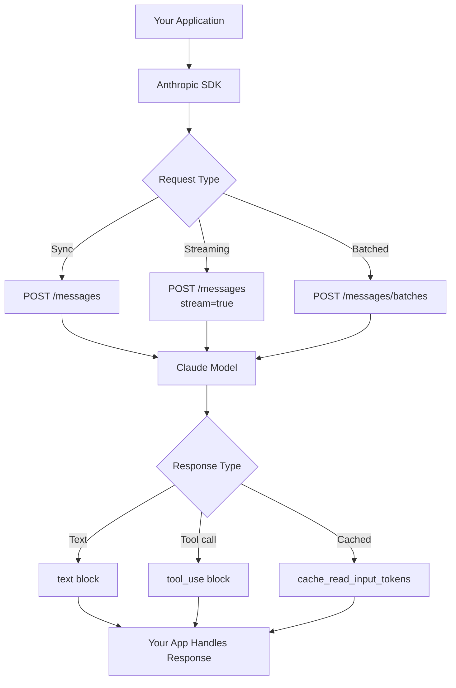
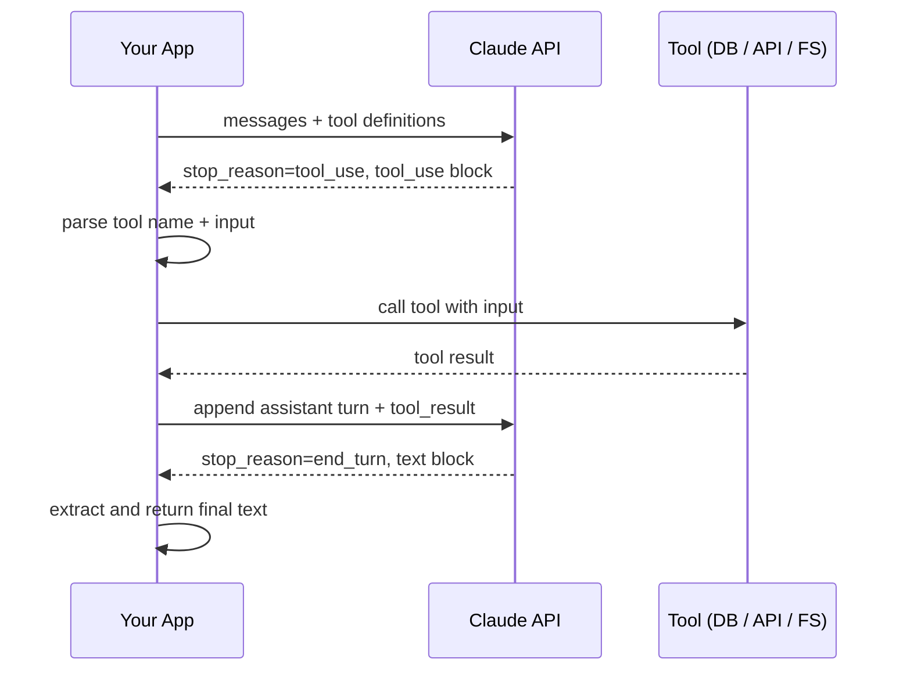
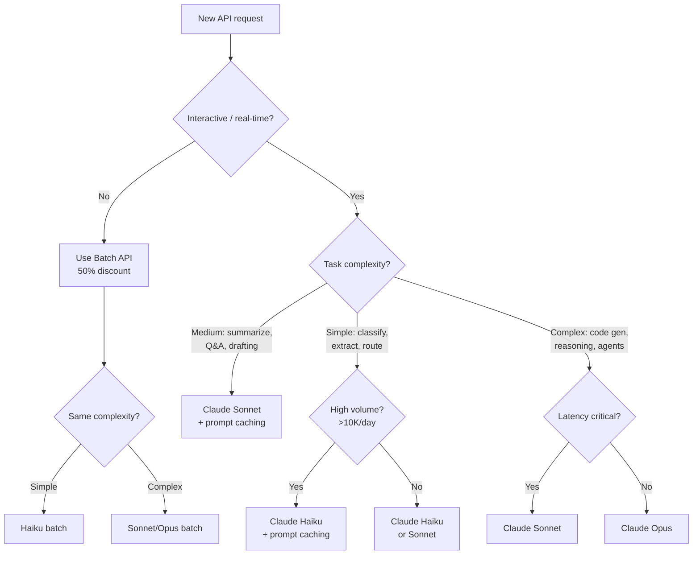

I've shipped production apps on top of a half-dozen LLM APIs, and the Claude API is the one I keep coming back to. The instruction-following is tighter, the context window is enormous, and prompt caching alone has cut my input costs by 80% on chat applications with large system prompts. This tutorial walks you through everything — from your first API call to a production-ready architecture — with working code at every step.

By the end you'll understand not just how to call the API, but when to use streaming vs. synchronous calls, how to design system prompts, how to handle tool use for function calling, and how to run this economically at scale.

---

## What You'll Build

We're going to build a developer assistant that can:

- Answer questions about a codebase loaded into context
- Stream responses in real time
- Call external tools (search, execute code)
- Cache a large system prompt to cut costs
- Return structured JSON for downstream processing

Each section is self-contained. You can stop after any of them and have a working piece of software.

---

## Getting Started

### Get an API Key

Go to [console.anthropic.com](https://console.anthropic.com), create an account, and generate an API key from the dashboard. Store it as an environment variable — never hardcode it.

```bash
export ANTHROPIC_API_KEY="sk-ant-..."
```

### Install the SDK

The official Python SDK is the fastest path to production. Install it with pip:

```bash
pip install anthropic
```

For TypeScript/Node.js:

```bash
npm install @anthropic-ai/sdk
```

This tutorial uses Python throughout, but the TypeScript SDK is nearly identical in structure.

---

## API Architecture

Before writing code, it helps to understand how the pieces fit together. Every Claude API call flows through a clear pipeline.



The model always returns a list of content blocks. A simple reply is one `text` block. A tool-use response is one `tool_use` block with a name and structured input. Streaming returns the same blocks but delivers them as server-sent events so your UI can update progressively.

---

## Your First API Call

Let's start with the simplest possible thing — a synchronous message.

```python
import anthropic

client = anthropic.Anthropic()  # reads ANTHROPIC_API_KEY from env

message = client.messages.create(
    model="claude-opus-4-5",
    max_tokens=1024,
    messages=[
        {"role": "user", "content": "Explain async/await in Python in three sentences."}
    ]
)

print(message.content[0].text)
```

The response object has a few fields worth knowing about immediately:

```python
print(message.id)               # msg_01XFDUDYJgAACzvnptvVoYEL
print(message.model)            # claude-opus-4-5
print(message.stop_reason)      # "end_turn" | "max_tokens" | "tool_use"
print(message.usage.input_tokens)   # tokens consumed by the prompt
print(message.usage.output_tokens)  # tokens consumed by the response
```

`stop_reason` tells you why the model stopped generating. `"end_turn"` means a natural completion. `"max_tokens"` means you hit the limit and the response is truncated — you'll want to raise `max_tokens` or truncate your input. `"tool_use"` means the model wants to call a function before it can continue, which we'll handle later.

---

## Streaming Responses

Synchronous calls are fine for batch workloads, but any user-facing application should stream. The latency difference is dramatic — instead of waiting 3-8 seconds for a full response, the user sees text appearing within 300ms.

```python
import anthropic

client = anthropic.Anthropic()

with client.messages.stream(
    model="claude-opus-4-5",
    max_tokens=1024,
    messages=[
        {"role": "user", "content": "Write a Python function to parse JSON safely."}
    ]
) as stream:
    for text in stream.text_stream:
        print(text, end="", flush=True)

print()  # newline after stream ends

# You can still access the final message object after streaming
final_message = stream.get_final_message()
print(f"\nTokens used: {final_message.usage.input_tokens} in, {final_message.usage.output_tokens} out")
```

For a FastAPI backend serving a frontend, you'd return a `StreamingResponse`:

```python
from fastapi import FastAPI
from fastapi.responses import StreamingResponse
import anthropic

app = FastAPI()
client = anthropic.Anthropic()

@app.post("/chat")
async def chat(prompt: str):
    def generate():
        with client.messages.stream(
            model="claude-opus-4-5",
            max_tokens=2048,
            messages=[{"role": "user", "content": prompt}]
        ) as stream:
            for text in stream.text_stream:
                yield f"data: {text}\n\n"

    return StreamingResponse(generate(), media_type="text/event-stream")
```

The frontend reads this with the `EventSource` API or `fetch` with `ReadableStream`.

---

## System Prompts and Temperature

System prompts are where you define the model's persona, constraints, and context. They go in a `system` parameter at the top level, not inside the `messages` array.

```python
message = client.messages.create(
    model="claude-opus-4-5",
    max_tokens=2048,
    system="""You are a senior Python engineer reviewing code for a fintech startup.
Your priorities in order: security, correctness, performance, readability.
Always flag any handling of financial amounts that uses floating-point arithmetic.
Format your responses as: VERDICT (pass/warn/fail), then FINDINGS as a bullet list.""",
    messages=[
        {"role": "user", "content": "Review this function:\n\n```python\ndef calculate_fee(amount, rate):\n    return amount * rate\n```"}
    ]
)
```

**Temperature** controls randomness. The range is 0 to 1.

- `0.0` — deterministic, always picks the highest-probability token. Use for extraction, classification, and structured output.
- `0.3–0.5` — slight variation while staying focused. Good for code generation and technical writing.
- `0.7–1.0` — creative, diverse, surprising. Use for brainstorming and creative content.

```python
# For code review — deterministic
message = client.messages.create(
    model="claude-opus-4-5",
    max_tokens=1024,
    temperature=0.0,
    system="You are a code reviewer. Be precise and consistent.",
    messages=[{"role": "user", "content": code_to_review}]
)

# For writing a product description — some creativity
message = client.messages.create(
    model="claude-opus-4-5",
    max_tokens=1024,
    temperature=0.7,
    system="You are a product copywriter.",
    messages=[{"role": "user", "content": "Write a tagline for our API monitoring tool."}]
)
```

A rule of thumb I use: if I'd be frustrated by two different answers to the same question, use low temperature. If I want variety, use higher temperature.

---

## Working with Images

Claude supports vision natively. Pass images as base64-encoded content blocks alongside your text.

```python
import anthropic
import base64
from pathlib import Path

client = anthropic.Anthropic()

def analyze_screenshot(image_path: str, question: str) -> str:
    image_data = base64.standard_b64encode(Path(image_path).read_bytes()).decode("utf-8")

    message = client.messages.create(
        model="claude-opus-4-5",
        max_tokens=1024,
        messages=[
            {
                "role": "user",
                "content": [
                    {
                        "type": "image",
                        "source": {
                            "type": "base64",
                            "media_type": "image/png",  # or image/jpeg, image/gif, image/webp
                            "data": image_data,
                        },
                    },
                    {
                        "type": "text",
                        "text": question
                    }
                ],
            }
        ],
    )
    return message.content[0].text

# Example: analyze a UI screenshot for accessibility issues
result = analyze_screenshot(
    "dashboard_screenshot.png",
    "List any accessibility issues visible in this UI. Focus on color contrast and missing alt text."
)
print(result)
```

You can also pass images by URL if they're publicly accessible:

```python
{
    "type": "image",
    "source": {
        "type": "url",
        "url": "https://example.com/diagram.png"
    }
}
```

Image token costs scale with dimensions. A 1024×1024 PNG costs around 1600 tokens. Resize large images before sending them if the detail isn't necessary for the task.

---

## Tool Use / Function Calling

Tool use is where the Claude API really separates itself. You define tools with JSON schemas, and the model decides when to call them based on the conversation. This enables agents that can actually do things — search the web, query databases, run code.

```python
import anthropic
import json

client = anthropic.Anthropic()

tools = [
    {
        "name": "search_codebase",
        "description": "Search the codebase for functions, classes, or patterns. Returns matching file paths and line numbers.",
        "input_schema": {
            "type": "object",
            "properties": {
                "query": {
                    "type": "string",
                    "description": "The search term or pattern to look for"
                },
                "file_type": {
                    "type": "string",
                    "description": "File extension to filter by, e.g. 'py', 'ts'",
                    "enum": ["py", "ts", "js", "go", "rs"]
                }
            },
            "required": ["query"]
        }
    },
    {
        "name": "get_file_contents",
        "description": "Read the contents of a specific file from the codebase.",
        "input_schema": {
            "type": "object",
            "properties": {
                "file_path": {
                    "type": "string",
                    "description": "Relative path to the file"
                }
            },
            "required": ["file_path"]
        }
    }
]

def search_codebase(query: str, file_type: str = None) -> str:
    # In a real implementation, this would grep the actual codebase
    return json.dumps({
        "results": [
            {"file": "src/auth/session.py", "line": 47, "match": f"def {query}("},
            {"file": "tests/test_auth.py", "line": 12, "match": f"# test {query}"}
        ]
    })

def get_file_contents(file_path: str) -> str:
    # In a real implementation, this would read the actual file
    return f"# Contents of {file_path}\n# (placeholder)"

def run_agent(user_message: str) -> str:
    messages = [{"role": "user", "content": user_message}]

    while True:
        response = client.messages.create(
            model="claude-opus-4-5",
            max_tokens=4096,
            tools=tools,
            messages=messages
        )

        if response.stop_reason == "end_turn":
            # Model is done — return the final text response
            for block in response.content:
                if block.type == "text":
                    return block.text

        if response.stop_reason == "tool_use":
            # Model wants to call tools — execute them and continue
            messages.append({"role": "assistant", "content": response.content})

            tool_results = []
            for block in response.content:
                if block.type == "tool_use":
                    print(f"[Tool call] {block.name}({block.input})")

                    if block.name == "search_codebase":
                        result = search_codebase(**block.input)
                    elif block.name == "get_file_contents":
                        result = get_file_contents(**block.input)
                    else:
                        result = json.dumps({"error": f"Unknown tool: {block.name}"})

                    tool_results.append({
                        "type": "tool_result",
                        "tool_use_id": block.id,
                        "content": result
                    })

            messages.append({"role": "user", "content": tool_results})

answer = run_agent("Find where session tokens are validated and explain the logic.")
print(answer)
```

The loop is the key pattern: send a message, check if the model wants to call a tool, execute the tool, add the result to the conversation, and continue. The model decides when it has enough information to answer.

---

## Tool Use Workflow

Here is how the tool use loop looks as a diagram, which makes the agentic pattern much easier to reason about.



Each iteration through this loop is one "step" of the agent. Complex tasks may take 3-10 steps. Budget `max_tokens` generously for multi-step agents — the model accumulates context as it goes.

---

## Prompt Caching

Prompt caching is the single highest-impact cost optimization available on the Claude API. It lets you cache the first portion of your prompt (system prompt, static context, tool definitions) and pay 90% less for those tokens on every subsequent request.

The economics are compelling: cached input tokens cost $0.30 per million instead of $3.00. A 10,000-token system prompt sent 1,000 times costs $30 without caching and $3 with caching — saving $27 per thousand conversations.

```python
import anthropic

client = anthropic.Anthropic()

# This large system prompt will be cached after the first request
SYSTEM_PROMPT = """You are an expert code reviewer for a Python backend team.

[... your large system prompt here — could be thousands of tokens of coding standards,
examples of good and bad code, team conventions, security guidelines, etc. ...]

The rest of this prompt is a placeholder representing 8,000 tokens of context.
""" * 50  # simulate a large prompt

def review_code(code: str) -> dict:
    response = client.messages.create(
        model="claude-opus-4-5",
        max_tokens=2048,
        system=[
            {
                "type": "text",
                "text": SYSTEM_PROMPT,
                "cache_control": {"type": "ephemeral"}  # mark this block for caching
            }
        ],
        messages=[
            {"role": "user", "content": f"Review this code:\n\n```python\n{code}\n```"}
        ]
    )

    usage = response.usage
    print(f"Input tokens: {usage.input_tokens}")
    print(f"Cache creation tokens: {usage.cache_creation_input_tokens}")  # first request only
    print(f"Cache read tokens: {usage.cache_read_input_tokens}")           # subsequent requests

    return {"review": response.content[0].text}

# First call: cache is created (slightly more expensive)
review_code("def add(a, b): return a + b")

# Second call: cache is read (90% cheaper on the system prompt)
review_code("def multiply(a, b): return a * b")
```

Cache entries survive for 5 minutes by default and are refreshed each time they're hit. For a busy API with constant traffic, your cache hit rate will be very high. For batch jobs, pre-warm the cache with a cheap dummy request before starting the batch.

You can also cache conversation history, tool definitions, and long document context using the same `cache_control` marker — not just system prompts.

---

## Structured Output (JSON Mode)

Many applications need the model to return structured data — not prose, but valid JSON that can be parsed and used programmatically. There are two reliable patterns.

**Pattern 1: Instruct and parse**

```python
import json
import anthropic

client = anthropic.Anthropic()

def extract_pr_metadata(pr_description: str) -> dict:
    response = client.messages.create(
        model="claude-opus-4-5",
        max_tokens=512,
        temperature=0.0,
        system="""Extract metadata from pull request descriptions.
Return ONLY valid JSON with this exact schema:
{
  "title": string,
  "type": "feature" | "bugfix" | "refactor" | "docs" | "chore",
  "risk_level": "low" | "medium" | "high",
  "affected_services": string[],
  "requires_migration": boolean
}
Return nothing else — no explanation, no markdown fencing, just the JSON object.""",
        messages=[{"role": "user", "content": pr_description}]
    )

    return json.loads(response.content[0].text)

metadata = extract_pr_metadata("""
Adds OAuth2 support to the user authentication service.
Updates the users table to add oauth_provider and oauth_id columns.
Requires a database migration before deployment.
Affects: auth-service, api-gateway
""")

print(metadata)
# {'title': 'Add OAuth2 support', 'type': 'feature', 'risk_level': 'high',
#  'affected_services': ['auth-service', 'api-gateway'], 'requires_migration': True}
```

**Pattern 2: Prefill the assistant turn**

You can pre-fill the assistant's response to force it to start with the opening brace, which prevents any preamble:

```python
response = client.messages.create(
    model="claude-opus-4-5",
    max_tokens=512,
    temperature=0.0,
    messages=[
        {"role": "user", "content": f"Extract metadata from:\n\n{pr_description}\n\nReturn only JSON."},
        {"role": "assistant", "content": "{"}  # prefill forces JSON output
    ]
)

# Prepend the opening brace we prefilled
raw = "{" + response.content[0].text
return json.loads(raw)
```

Both patterns work well. Use low temperature (0.0–0.1) for structured output to minimize parse failures.

---

## Error Handling and Retries

The Claude API returns specific HTTP status codes you need to handle differently.

```python
import anthropic
import time
import random

client = anthropic.Anthropic()

def call_with_retry(messages: list, max_retries: int = 3, **kwargs) -> anthropic.types.Message:
    for attempt in range(max_retries):
        try:
            return client.messages.create(
                model="claude-opus-4-5",
                max_tokens=1024,
                messages=messages,
                **kwargs
            )

        except anthropic.RateLimitError as e:
            # 429 — back off and retry
            wait = (2 ** attempt) + random.uniform(0, 1)
            print(f"Rate limited. Waiting {wait:.1f}s before retry {attempt + 1}/{max_retries}")
            time.sleep(wait)

        except anthropic.APIStatusError as e:
            if e.status_code == 529:
                # API overloaded — back off more aggressively
                wait = (4 ** attempt) + random.uniform(0, 2)
                print(f"API overloaded. Waiting {wait:.1f}s")
                time.sleep(wait)
            elif e.status_code >= 500:
                # Server error — retry
                wait = 2 ** attempt
                time.sleep(wait)
            else:
                # 4xx client error — don't retry, fix the request
                raise

        except anthropic.APIConnectionError:
            # Network error — retry with backoff
            time.sleep(2 ** attempt)

    raise RuntimeError(f"Failed after {max_retries} retries")
```

The most common errors in production are rate limits (429) and occasional API overload (529). Both are transient and handled by exponential backoff. A `400 Bad Request` usually means your message structure is malformed — check your content block format, especially when using tool results.

---

## Cost Optimization Tips

Beyond prompt caching, here are the optimizations that actually move the needle.

**Right-size your model.** Claude Haiku costs 20x less than Claude Opus per token. Triage requests by complexity: use Haiku for classification and simple extraction, Sonnet for general tasks, Opus for complex reasoning and code generation. Most production workloads are 60-70% Haiku-eligible.

**Set tight `max_tokens`.** The API charges for tokens generated, not requested. But setting `max_tokens` too high encourages the model to pad responses. If your use case produces 200-token answers, set `max_tokens=512` rather than the default 4096. This also protects you from runaway generation on edge cases.

**Trim system prompts ruthlessly.** Every sentence in a system prompt that doesn't change behavior costs you money. Audit your system prompts regularly. "You are a helpful assistant." is 6 tokens you can often delete. "Always respond in a professional and courteous tone." is 10 more tokens that the model already tends to do by default.

**Use the Batch API for async workloads.** Batch requests have a 24-hour SLA and cost 50% less. Nightly processing jobs, bulk data extraction, and offline analysis should always use the Batch API.

**Monitor cache hit rates.** If you've enabled prompt caching and your `cache_read_input_tokens` is low relative to `input_tokens`, your prompts aren't structured to be cacheable. The cached prefix must be identical across requests — any variation resets the cache.

---

## Model Selection Decision Flowchart



---

## Production Checklist

Before you ship a Claude API integration to real users, run through this list.

**Security**
- [ ] API key stored in environment variables, never in source code or logs
- [ ] API key rotated periodically; old keys revoked
- [ ] Requests rate-limited at the application layer to prevent runaway costs
- [ ] User inputs sanitized; prompt injection mitigations in place

**Reliability**
- [ ] Exponential backoff and retry logic implemented for 429/529 errors
- [ ] `max_tokens` set conservatively to cap per-request cost
- [ ] Timeout set on API calls (recommend 30s for sync, 120s for streaming)
- [ ] Fallback behavior defined for API unavailability

**Cost**
- [ ] Prompt caching enabled for all system prompts > 1,024 tokens
- [ ] Model tier matched to task complexity
- [ ] Token usage logged per request for monitoring and alerting
- [ ] Monthly spend alerts configured in the Anthropic console

**Quality**
- [ ] `stop_reason` checked — handle `"max_tokens"` as a truncation error
- [ ] Structured output responses validated with JSON schema before use
- [ ] Evaluation set exists and is run before each prompt change
- [ ] Tool call inputs validated before passing to actual tools

**Observability**
- [ ] Request IDs (`message.id`) logged for debugging
- [ ] Model name and version logged (you want to know when you change models)
- [ ] P50/P95 latency tracked by model and endpoint
- [ ] Error rates tracked by status code

---

## FAQ

### Which Claude model should I use in 2026?

For most general-purpose applications, Claude Sonnet gives the best balance of quality and cost. Use Haiku when you're doing high-volume, structured tasks like classification or extraction. Use Opus when you need maximum reasoning quality and cost is secondary — complex code analysis, long-document synthesis, or multi-step agents that need to get it right the first time.

### How do I keep my costs predictable?

Set `max_tokens` per request, implement a monthly budget alert in the Anthropic console, and log token usage to a time-series database. Enable prompt caching early — even if you're not at high volume yet, building caching-aware prompt structure from the start is much easier than retrofitting it later.

### Can I fine-tune Claude on my own data?

Anthropic does not currently offer public fine-tuning for Claude models. Instead, use few-shot examples in your system prompt, retrieval-augmented generation (RAG) to inject relevant context, and prompt engineering to shape model behavior. These techniques can get you 90% of the benefit of fine-tuning for most use cases.

### How should I handle long conversations that exceed the context window?

The Claude API supports a 200K token context window, which is enough for very long conversations. When conversations do grow long, summarize older turns into a compact history block and replace the raw message history. A good pattern: when the conversation exceeds 80% of your context budget, send a summarization request and replace the oldest messages with the summary.

### Is the Claude API HIPAA / SOC 2 compliant?

Anthropic's API does have compliance certifications available — check the Anthropic Trust Center at trust.anthropic.com for current documentation on HIPAA Business Associate Agreements, SOC 2 Type II, and data processing agreements. For sensitive regulated data, review the data retention and privacy policies carefully before sending PHI or PII to any model API.
