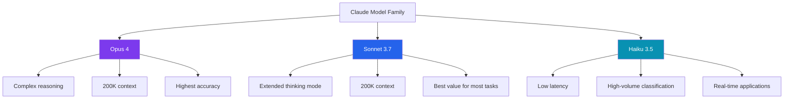
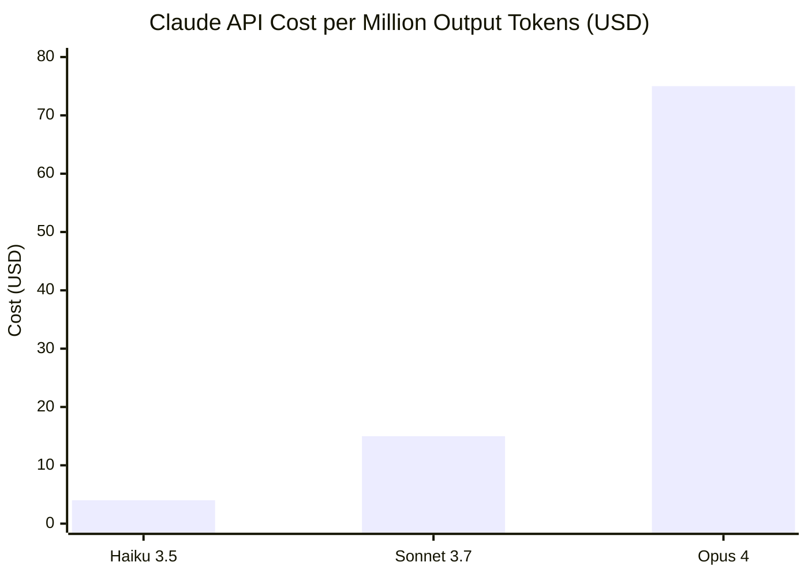
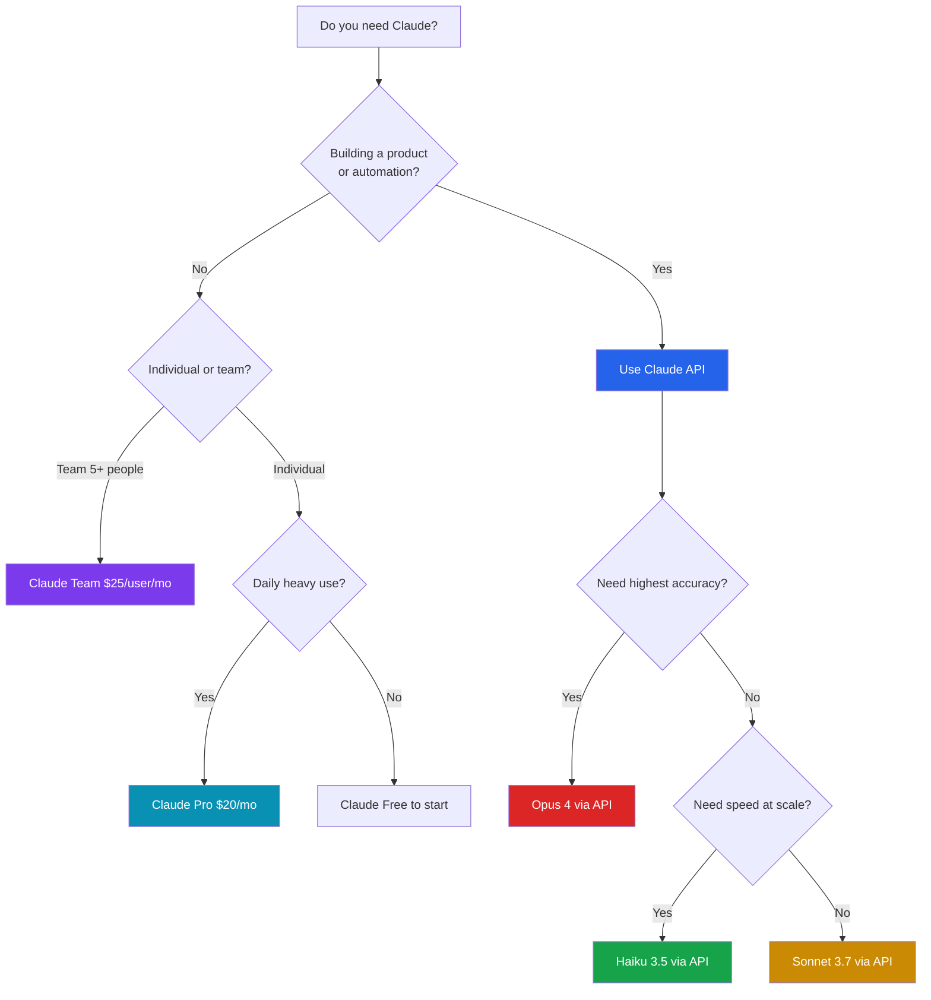

Anthropic's Claude has carved out a distinct position in a market that now has no shortage of capable AI assistants. Where OpenAI leads on raw brand recognition and Google on ecosystem integration, Claude has become the model that engineers and writers reach for when they need a longer conversation, a more careful answer, and fewer guard-rail surprises. After spending months working with Claude daily—across code reviews, long-document analysis, and API-driven automation—here's my honest take on what it actually delivers in 2026.

## What Is Claude?

Claude is a family of large language models built by Anthropic, a safety-focused AI lab founded in 2021 by former OpenAI researchers. The name refers to both the underlying models and the consumer chat interface available at claude.ai. Anthropic trains Claude using a technique called Constitutional AI, which bakes in a set of principles at the RLHF stage rather than relying solely on human raters to flag bad outputs. The practical effect: Claude tends to be more forthcoming about its uncertainty, more willing to push back on a flawed premise, and less prone to sycophantic agreement than some competitors.

The model lineup follows a tiered naming scheme—Opus, Sonnet, and Haiku—ordered from most capable to fastest. Each tier gets updated periodically; by late 2025 the active generation is Claude 3.5 across most tiers, with Claude 3.7 Sonnet released in early 2026 as the current frontier model.

## Key Features

### Extended Context Window

Claude's most operationally significant feature is its context window. Claude 3.5 Sonnet and Opus both support **200,000 tokens** of context—roughly 150,000 words, or a full software codebase of moderate size. In practice I've fed it 80-page PDFs, entire React codebases, and multi-chapter manuscripts and received coherent, cross-referenced answers. This is not just a spec sheet number; the model actually uses content from deep inside a long document rather than focusing only on the most recent tokens.

### Artifacts

Artifacts is the feature that makes Claude's chat interface worth comparing to an IDE rather than just a chat box. When you ask Claude to write code, build an HTML page, create an SVG, or draft a structured document, the output renders in a side panel where you can preview, copy, or continue editing. The practical benefit is that you can iterate on a React component or a data table entirely within the conversation without constantly copying text to another editor.

### Projects

Projects allow you to give Claude persistent context across multiple conversations. You upload files—docs, style guides, codebases, personal notes—and every chat within that project starts with that context loaded. For teams this means you can attach API documentation, internal style guides, or codebase overviews and stop re-explaining the same context every session. It's meaningfully more useful than simple system prompts.

### Vision and File Handling

Claude can process images, PDFs, and a growing list of document formats directly. Vision capabilities include reading charts, interpreting UI screenshots, analyzing architectural diagrams, and OCR-style extraction from scanned documents. I've used it to turn a messy whiteboard photo of a database schema into a working SQL DDL—it worked on the first pass.

### Claude Code

Claude Code is Anthropic's terminal-based coding agent, released in 2025 and substantially upgraded in early 2026. It runs from your command line, reads your local files, and can execute shell commands in a supervised loop. Unlike GitHub Copilot, Claude Code is designed for multi-file, multi-step tasks: it can plan a refactor across a repository, run your test suite, read the failures, and iterate toward a fix. It's the most complete agentic coding workflow I've used that doesn't require a browser-based IDE.

## Model Lineup

The three tiers serve genuinely different workloads, and choosing the wrong one in production is an easy way to either overpay or under-perform.

**Claude Opus 4** is Anthropic's flagship reasoning model. It handles complex multi-step problems, nuanced ethical reasoning, and tasks that require synthesizing information across very long contexts. Latency is higher and cost is significantly above the other tiers. Use Opus when correctness matters more than speed—deep research, legal document review, architecture decisions.

**Claude Sonnet 3.7** (current as of early 2026) is the workhorse. It offers roughly 80% of Opus's reasoning capability at a fraction of the cost and significantly lower latency. The 3.7 release added extended thinking mode—an opt-in chain-of-thought mechanism that lets the model work through harder problems before committing to an answer. For most developers and teams, Sonnet is the right default.

**Claude Haiku 3.5** is the speed-and-cost tier. It handles classification, extraction, summarization, and light code generation fast enough for real-time user-facing applications. At API scale, Haiku's per-token price makes workflows that would be cost-prohibitive with Opus entirely practical.

## Pricing Breakdown

Claude pricing has two dimensions: the consumer/team subscription tiers and the API model pricing. Both matter depending on whether you're an individual user or building on top of the API.

### Subscription Tiers

**Free** — Access to Claude Sonnet with usage limits. Good for light personal use and evaluation. No Projects access, limited Artifacts usage, and rate limits that make it impractical for sustained work.

**Pro — $20/month** — Significantly higher usage limits on Sonnet, plus access to Opus during non-peak hours. Full Artifacts and Projects features. The right tier for individual power users, writers, and developers doing solo work.

**Team — $25/user/month** (minimum 5 seats) — Everything in Pro plus centralized billing, admin controls, expanded context on Projects, and higher rate limits tuned for concurrent team use. Conversation data is excluded from training by default.

**Enterprise — custom pricing** — SSO, audit logs, expanded API rate limits, custom data retention, BAA availability for HIPAA-adjacent use cases, and dedicated support. Contact Anthropic sales.

### API Pricing (per million tokens, as of late 2025)

| Model | Input | Output |
|---|---|---|
| Claude Opus 4 | $15.00 | $75.00 |
| Claude Sonnet 3.7 | $3.00 | $15.00 |
| Claude Haiku 3.5 | $0.80 | $4.00 |

Prompt caching is available across all models and reduces input costs by up to 90% on repeated context—critical for Projects-style workflows where the same system prompt or document is reused across many requests.

## Real-World Use Cases

### Developer Workflows

I use Claude Code daily for tasks that span multiple files. My typical pattern: describe the refactor at a high level, let Claude read the relevant source files, review the proposed plan, then approve execution. For a recent migration of a Next.js app from the Pages Router to App Router, Claude handled the mechanical transformation—restructuring layouts, rewriting data-fetching patterns, updating imports—across roughly 40 files. What would have been a two-day solo chore took about three hours of supervised iteration.

For code review, Claude with Projects beats both standalone chat and most IDE plugins. I attach the repository README, the test conventions doc, and a style guide; Claude's comments are consistent with our actual patterns rather than generic advice.

### Long-Document Analysis

The 200K context window makes Claude the right tool for contracts, research papers, and technical specifications. I've used it to compare two vendor MSAs side by side, identify divergent liability clauses, and draft a comparison table—all in a single prompt. The analysis holds together across the full document length in a way that models with smaller windows simply cannot match.

### Content Creation

Claude's writing quality is the best of the current generation for long-form drafts that need a consistent voice. I feed it an outline, a few example paragraphs establishing tone, and rough notes; it produces drafts that need editing rather than complete rewrites. The key difference from competitors: Claude is less likely to pad content with filler phrases or produce generic transitions. It also pushes back when the outline has gaps rather than fabricating content to fill them.

## Claude vs. Competitors

Claude's closest competitors are GPT-4o (OpenAI) and Gemini 1.5 Pro / 2.0 (Google).

**vs. GPT-4o**: GPT-4o has better ecosystem integration—it connects to Dall-E, voice mode, and a huge plugin catalog. Claude beats it on context reliability (GPT-4o's 128K window loses coherence before Claude's 200K does) and on writing quality for long-form text. For coding, the gap is narrow; both are strong, but Claude Code as an agentic workflow tool has no direct equivalent in the OpenAI consumer product.

**vs. Gemini 1.5 Pro**: Gemini's context window is technically larger (1M+ tokens), but real-world retrieval quality at very long contexts is inconsistent. Gemini's advantage is Google Workspace integration and multimodal breadth (native video understanding). Claude wins on reasoning consistency and the quality of nuanced written output.

Neither comparison is absolute—the right model depends on the task. I run Haiku for high-volume classification, Sonnet for most development and writing work, and pull in Gemini when I'm working directly inside Google Docs.

## The Rough Edges

It would be dishonest to leave out the frustrations.

**Rate limits on Pro are still noticeable.** Heavy Pro users regularly hit usage caps during peak hours, which sends you back to Sonnet when you specifically needed Opus. Anthropic has improved this over 2025 but it hasn't fully gone away.

**Claude Code is powerful but rough.** The agentic loop occasionally gets stuck, reruns unnecessary steps, or asks for confirmation at a frequency that defeats the purpose of automation. The UX is still clearly "engineering preview" rather than polished product.

**No native image generation.** Claude analyzes images but won't create them. If your workflow includes image synthesis alongside text, you're maintaining a second tool.

**Knowledge cutoff gaps.** Like all LLMs, Claude's training data has a cutoff. For fast-moving technical topics—new framework releases, recent API changes—it will confidently describe the state of the world from its training window. Always verify currency-sensitive claims.

**Refusals can be over-cautious.** Claude occasionally refuses tasks that are clearly benign—security research, red-teaming prompts, creative fiction with dark themes. The pattern has improved but remains more conservative than some developers want.

## Who Should Use Claude?

The answer isn't one-size-fits-all. Here's how I'd route different users:

**Use Claude Free** if you're evaluating the product or need occasional help with writing and light research.

**Use Claude Pro** if you're an individual developer, writer, analyst, or researcher who works with AI daily. The $20/month pays for itself quickly if you're using Projects and Artifacts regularly.

**Use Claude Team** if you're a small engineering or content team that wants shared context, admin controls, and higher throughput without managing API keys and billing per-user.

**Use the Claude API** if you're building a product, need programmatic control, want to mix models (Haiku for cheap high-volume tasks, Sonnet for quality-sensitive ones), or need to integrate Claude into an existing application or workflow.

**Skip Claude (for now)** if your primary need is image generation, deep Google Workspace integration, or voice interaction—there are better-suited tools for each.

## Pros and Cons Summary

**Pros**
- 200K token context window that actually works at depth
- Best-in-class long-form writing quality
- Claude Code is a genuinely useful agentic coding workflow
- Extended thinking mode on Sonnet 3.7 handles harder reasoning tasks
- Projects feature makes persistent context practical for teams
- Prompt caching makes API usage costs manageable at scale
- Constitutional AI training leads to more honest uncertainty communication

**Cons**
- Pro plan rate limits hit at inconvenient times
- No native image generation
- Claude Code UX is still rough for non-technical users
- More conservative refusals than some developers need
- No voice mode in the consumer product
- Enterprise pricing requires a sales conversation

## The Verdict

Claude is my primary AI assistant in 2026, and I don't think that's a particularly controversial position among developers who've worked with it seriously. The combination of a reliable long context window, strong reasoning on Sonnet 3.7, and Claude Code as an agentic coding layer covers the majority of what I actually need from an AI tool.

The honest caveat is that the Pro plan rate limits and Claude Code's rough edges prevent it from being a seamless experience. If those friction points are dealbreakers for your workflow, GPT-4o or Gemini may suit you better today. But for long-document analysis, complex coding tasks, and high-quality writing—especially when you're building on the API—Claude is the benchmark everything else is measured against.

If you're evaluating it for a team, start with a Pro subscription for a month before committing to Team pricing. The features are identical enough that you'll learn what you actually need before signing a longer contract.

---

## FAQ

### Does Claude remember previous conversations?

By default, no—each new conversation starts fresh. The Projects feature adds persistent context by letting you upload files and set a system prompt that loads in every conversation within that project. But Claude does not retain conversational memory across separate sessions the way a human assistant would unless you use Projects or pass prior context explicitly.

### Is Claude HIPAA-compliant for healthcare use cases?

A Business Associate Agreement (BAA) is available for Enterprise customers, which is a prerequisite for HIPAA-compliant deployment. The Free, Pro, and Team tiers do not include a BAA. If you're handling PHI, you need Enterprise and should review Anthropic's data processing terms carefully before using Claude in clinical or patient-facing workflows.

### What makes Claude's context window better than competitors with similar numbers?

The raw token count matters less than how the model uses content from deep in the context. Claude's architecture maintains retrieval quality across very long inputs—I've tested this by placing key facts at positions 150,000+ tokens into a document and asking questions that require those facts. The answers were accurate. With other models, degradation at equivalent positions is noticeable. That said, costs scale with context length, so pass only what's needed.

### Can Claude write code in languages other than Python and JavaScript?

Yes. Claude handles Go, Rust, TypeScript, Ruby, Java, C++, SQL, Bash, and a long tail of less common languages reliably. In my experience Rust and Go quality is especially good—the output respects idiomatic patterns rather than translating Python logic into syntax-compatible but un-idiomatic code. Claude Code also works with any language your local toolchain supports since it executes commands rather than running a language-specific engine.

### How does prompt caching work and when should I use it?

Prompt caching lets you mark sections of your input as cacheable. Anthropic's API stores those tokens server-side for up to five minutes (or longer with extended cache options). If your next request reuses the same cached prefix, you pay a reduced input rate—typically 10% of the standard input price. This is especially valuable for Projects-style workflows where every request shares a large system prompt or document, and for agents that make many calls with the same tool definitions or context loaded at the top of each prompt.
