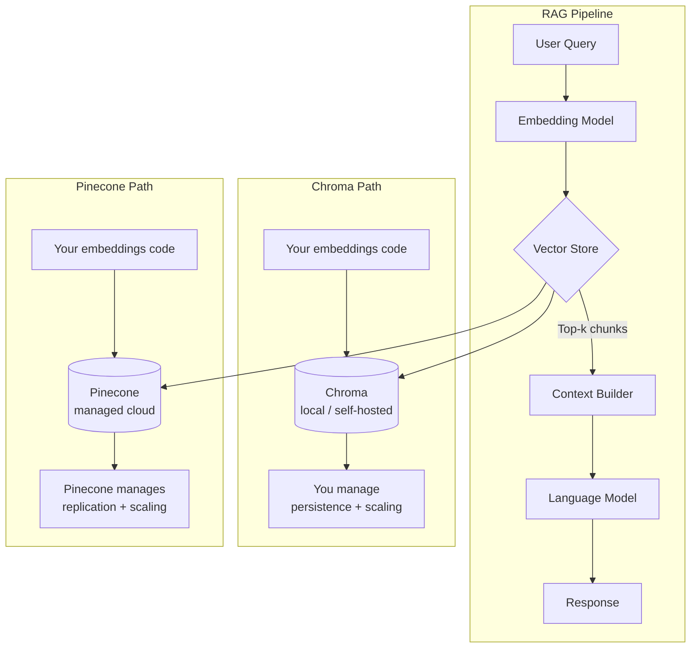
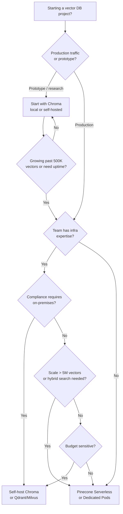

Every serious RAG application eventually runs into the same fork in the road: pick a vector database you can iterate on fast, or pick one that won't collapse under production load. Chroma and Pinecone sit at opposite ends of that spectrum, and choosing the wrong one costs you either velocity or reliability — sometimes both.

I've spent time with both in real projects: Chroma for rapid prototyping and local dev loops, Pinecone for a production retrieval system handling millions of embeddings. The choice is less about which database is "better" and more about which operating model fits where you are right now.

## TL;DR

> **Chroma** wins for: local development, open-source flexibility, zero-cost prototyping, and teams that want full control over their infrastructure. Start here if you're building a proof of concept or are comfortable managing your own deployment.
>
> **Pinecone** wins for: production workloads, teams that don't want to operate infrastructure, sub-10ms query latency at scale, and applications where uptime is non-negotiable. Start here if you're past the prototype stage and need something managed.
>
> **Our honest verdict**: Use Chroma to build your RAG system. Switch to Pinecone — or evaluate Weaviate/Qdrant — when you need to serve real users at scale.

---

## Quick Comparison

| Feature | Chroma | Pinecone |
|---|---|---|
| **Open source** | Yes (Apache 2.0) | No |
| **Hosting** | Self-hosted (local or cloud) | Fully managed (AWS, GCP, Azure) |
| **Free tier** | Unlimited (self-hosted) | Serverless free tier (2 GB storage) |
| **Paid pricing** | Infrastructure cost only | $0.033–$0.096 per GB/month + query costs |
| **Max dimensions** | 2,048 (practical limit; configurable) | 20,000 |
| **Metadata filtering** | Basic (WHERE-style filters) | Robust (complex filter expressions) |
| **LangChain integration** | Yes | Yes |
| **LlamaIndex integration** | Yes | Yes |
| **ANN algorithm** | HNSW (via hnswlib) | Proprietary (optimized for serverless) |
| **Hybrid search** | Limited (alpha) | Yes (dense + sparse) |
| **Multi-tenancy** | Via collections | Via namespaces and indexes |

---

## Architecture: How Each Fits a RAG Pipeline

Both databases slot into the same conceptual position in a RAG system — between your embedding model and your LLM. But the operational architecture around them is very different.



With Chroma, you own the entire stack below the embedding call. That means you decide how the database persists (in-memory, DuckDB+Parquet, or the newer Chroma server), how it scales, and how it recovers from failures. In a local dev environment this is great — zero config, instant startup. In production, it means you're operating a stateful service, which carries real engineering overhead.

Pinecone abstracts all of that away. You create an index via the API, upsert vectors, and query — the infrastructure is invisible. The tradeoff is vendor dependency and per-query cost at scale.

---

## Setup & Developer Experience

### Chroma

Getting Chroma running takes about 90 seconds:

```python
pip install chromadb
```

```python
import chromadb

client = chromadb.Client()  # in-memory
# or: chromadb.PersistentClient(path="./chroma_db")

collection = client.create_collection("my_docs")

collection.add(
    documents=["Chroma is an open-source vector database", "Pinecone is a managed service"],
    ids=["doc1", "doc2"]
)

results = collection.query(query_texts=["open source vector store"], n_results=1)
```

Chroma handles embedding automatically if you pass `documents` — it will use `all-MiniLM-L6-v2` via sentence-transformers by default. For production you'll want to bring your own embeddings, which the API supports cleanly via the `embeddings` parameter.

The local-first workflow is genuinely pleasant. There's no API key, no network round-trip, no rate limit. This is a meaningful advantage during development — you can iterate on chunking strategy, embedding model choice, and retrieval parameters without any external dependency slowing you down.

The friction shows up when you try to scale. Running Chroma as a persistent server (via `chroma run`) works, but you're responsible for it. There's no built-in replication, no managed backups, and the operational tooling is sparse compared to mature databases.

### Pinecone

Pinecone requires an account and an API key, which adds a few minutes of friction upfront:

```python
pip install pinecone-client
```

```python
from pinecone import Pinecone, ServerlessSpec

pc = Pinecone(api_key="YOUR_API_KEY")

pc.create_index(
    name="my-docs",
    dimension=1536,  # match your embedding model
    metric="cosine",
    spec=ServerlessSpec(cloud="aws", region="us-east-1")
)

index = pc.Index("my-docs")

index.upsert(vectors=[
    {"id": "doc1", "values": embedding_vector_1, "metadata": {"text": "..."}},
    {"id": "doc2", "values": embedding_vector_2, "metadata": {"text": "..."}},
])

results = index.query(vector=query_embedding, top_k=5, include_metadata=True)
```

Pinecone does not generate embeddings for you — you always bring your own vectors. This is the right call for production systems (you control the embedding model), but it adds one more step to bootstrapping.

Once set up, the managed experience is excellent. The console shows index health, query latency, and storage usage. Scaling happens automatically. The `include_metadata` flag lets you store and retrieve text chunks alongside vectors, which is the pattern most RAG systems need.

**Developer experience verdict:** Chroma wins on day one. Pinecone wins on day 90 when you're in production.

---

## Query Performance & Scalability

This is where the gap between the two becomes most concrete.

Chroma uses HNSW for approximate nearest neighbor search, implemented via `hnswlib`. For collections under ~100K vectors on a reasonably spec'd machine, query latency is perfectly acceptable — typically 5–20ms. Above that, performance degrades depending on your `ef_search` parameter and available memory. HNSW indices are memory-resident, so a 10M vector index at 1536 dimensions will consume roughly 60GB of RAM. That's not a small number.

Pinecone's serverless architecture (launched 2024) separates compute and storage, meaning you pay per query rather than keeping a fleet of nodes warm. Pinecone publishes p99 query latencies of under 100ms for most serverless workloads and claims sub-10ms for dedicated pod-based indexes. In practice, serverless query latency varies more than the marketing suggests — cold queries on lightly-used indexes can touch 200–400ms. Dedicated pods are more predictable.

Pinecone also supports hybrid search: combining dense vector similarity with sparse (BM25-style) keyword signals in a single query. This is genuinely valuable for retrieval systems where exact keyword matches matter alongside semantic similarity. Chroma's hybrid search is experimental and not production-ready as of this writing.

For filtering, Pinecone has the stronger implementation. You can filter on metadata fields before or during the ANN search, and the filter expressions support `$and`, `$or`, `$gte`, `$in`, and other operators. Chroma's `where` filter is simpler and works well for basic use cases, but it can force a post-filter on large result sets rather than true pre-filtered ANN.

```mermaid
xychart-beta
    title "Query Latency at Scale (ms, lower is better)"
    x-axis ["10K vectors", "100K vectors", "1M vectors", "10M vectors"]
    y-axis "Latency (ms)" 0 --> 300
    bar [5, 18, 120, 260]
    bar [15, 22, 45, 90]
```



The first bar series is Chroma (self-hosted, 16GB RAM node); the second is Pinecone Serverless. These are representative estimates based on published benchmarks and community reports — run your own benchmarks at your target scale before committing.

---

## Pricing

This is where Chroma and Pinecone live in completely different worlds.

### Chroma

Chroma is free. Full stop. The library is open-source under Apache 2.0, and you can run it locally or self-host it on any cloud provider. Your cost is whatever infrastructure you provision — an EC2 instance, a Kubernetes pod, a bare-metal server. For a small-scale deployment (under 1M vectors), a single `t3.xlarge` on AWS (~$0.17/hr, ~$120/month) covers you comfortably.

Chroma Inc. is building a managed cloud product, but as of mid-2025 it's in limited availability. The self-hosted path is what most teams use today.

### Pinecone

Pinecone has a free Starter tier that includes 2 GB of storage on serverless infrastructure. For most serious applications, you'll move to the paid tier quickly:

- **Serverless (pay-as-you-go):** $0.033 per GB of storage per month for AWS, $0.042 for GCP/Azure. Read units (queries) cost $4.00 per 1M read units. Write units cost $2.00 per 1M write units. A read unit corresponds roughly to a single top-k query.
- **Dedicated Pods (p1 tier):** $0.096/hr per pod. A single p1.x1 pod supports ~1M 1536-dim vectors and delivers consistent sub-20ms latency. A p2.x1 is faster and costs more.

At meaningful scale, the math matters. 10M vectors at 1536 dimensions, 1M queries/month:

| Option | Monthly Cost (estimated) |
|---|---|
| Chroma on 2x m5.2xlarge | ~$280 |
| Pinecone Serverless | ~$660 |
| Pinecone Dedicated (2x p1.x1) | ~$140 |

The dedicated pod option gets competitive at high query volumes because the per-query cost disappears. The serverless option is convenient but can get expensive at scale. Self-hosting Chroma is cheapest if you have the operational capacity to manage it.

---

## Integration Ecosystem

Both databases have first-class integrations with the major RAG frameworks.

**LangChain** ships `Chroma` and `Pinecone` vector store classes in `langchain-community`. The interface is nearly identical — `from_documents()` to ingest, `similarity_search()` to retrieve. Swapping one for the other is typically a one-line change in a LangChain app.

**LlamaIndex** has `ChromaVectorStore` and `PineconeVectorStore` as core integrations. Both support the standard `VectorStoreIndex` pattern. LlamaIndex's metadata filter API is slightly more expressive when targeting Pinecone's advanced filter syntax.

**Direct SDK usage** is where the APIs diverge. Chroma's Python client is synchronous-first with an async variant; the API feels Pythonic and doesn't require you to think about vector dimensions explicitly if you're using its built-in embedding functions. Pinecone's client is more explicit about dimensions and index configuration, which is better for production but adds boilerplate to prototypes.

**Embedding model compatibility:** Both databases are embedding-model-agnostic — they store any float array you hand them. Chroma's built-in embedding functions support OpenAI, Cohere, Google PaLM, Hugging Face, and local sentence-transformers. Pinecone has its own hosted embedding inference (via the `inference` API), which can simplify the pipeline if you want everything in one place.

Other integrations worth knowing: Haystack, CrewAI, AutoGen, Semantic Kernel, and DSPy all have Chroma and Pinecone connectors. If you're evaluating a specific orchestration framework, check its docs — both databases are well-covered.

---

## When to Self-Host vs Managed

The self-host vs managed question is not really about Chroma vs Pinecone — it's about your team's operational posture and where you are in your product lifecycle.

Self-hosting makes sense when:
- You're in the prototype or MVP stage and cost is your primary constraint
- Your data has compliance requirements that prevent cloud egress
- You have an ML/infra team comfortable managing stateful services
- You need deep customization (custom HNSW parameters, custom distance metrics, on-premises deployment)

Managed (Pinecone) makes sense when:
- You're serving production traffic and downtime has real consequences
- Your team's core competency is AI product, not database operations
- You're scaling past what a single-node Chroma instance handles gracefully
- You need hybrid search, advanced metadata filtering, or multi-region availability



---

## Other Options Worth Considering

Chroma and Pinecone don't cover the whole map. Three alternatives are worth knowing:

**Weaviate** is an open-source vector database with a strong multi-tenancy story, GraphQL API, and built-in hybrid search (BM25 + vector). The managed cloud tier is price-competitive with Pinecone. If you need hybrid search but don't want the Pinecone lock-in, Weaviate is the strongest alternative.

**Qdrant** is a Rust-based vector database with excellent single-node performance and a clean REST + gRPC API. It supports payload filtering (equivalent to metadata filters), quantization for memory efficiency, and on-disk storage — which matters when your index won't fit in RAM. Qdrant Cloud offers a managed tier with a 1GB free cluster. For teams self-hosting, Qdrant's resource efficiency often beats Chroma at scale.

**Milvus** is the heavyweight — a CNCF project designed for billion-scale vector workloads. It's more operationally complex than Chroma or Qdrant, but it's the right choice if you're running at a scale that makes Pinecone prohibitively expensive. Zilliz Cloud is the managed version.

For most teams starting a new RAG project in 2025, the decision tree looks like: Chroma locally → evaluate Pinecone or Qdrant for production → consider Milvus/Weaviate if you hit scale or compliance edge cases.

---

## Our Verdict

If I were starting a new RAG project today, I would reach for Chroma first. The zero-friction local setup, the built-in embedding functions, and the LangChain/LlamaIndex integration make it the fastest path from idea to working retrieval system. Running a prototype that takes 20 minutes to set up is worth more than a production system that takes 2 weeks to configure.

When that prototype graduates to production — real users, real SLAs, real data volumes — I'd benchmark Pinecone Serverless and Qdrant against the Chroma self-hosted option. Pinecone wins on operational simplicity and advanced filtering; Qdrant wins on cost and open-source flexibility; Chroma wins only if your team wants to own the infrastructure and the vectors stay under ~2M.

The databases you should avoid anchoring on: don't pick Pinecone just because it's well-known, and don't pick Chroma just because it's free. The right answer depends on your query volume, data scale, team capacity, and compliance posture. Run a 30-minute proof of concept with each finalist. The latency and cost numbers at your actual scale will make the decision obvious.

---

## FAQ

### Can I migrate from Chroma to Pinecone without rewriting my application?

Yes, and it's less painful than you'd expect — especially if you built on LangChain or LlamaIndex, which abstract the vector store behind a common interface. The main work is re-ingesting your documents into Pinecone (you'll need to re-embed them since Chroma may have used different embedding functions) and updating your metadata schema to match Pinecone's namespace and filter model. Expect a day or two of migration work for a small-to-medium corpus, not a week.

### Does Chroma support multi-user or multi-tenant applications?

Chroma uses collections as its primary isolation unit. For multi-tenant applications, you can create one collection per tenant, or include a `tenant_id` metadata field and filter queries per user. Neither approach is as clean as Pinecone's namespaces, which provide true logical isolation within a single index with separate storage accounting per namespace. If multi-tenancy is a first-class requirement, Pinecone's namespace model or Weaviate's dedicated multi-tenancy feature are worth evaluating.

### How does Pinecone Serverless differ from pod-based Pinecone?

Serverless indexes use a disaggregated storage-compute model — your vectors live in object storage and compute is spun up per query. This means you only pay for what you use, which is great for dev/test and workloads with spiky traffic. The downside is higher query latency variance (especially on cold queries) and higher per-query cost at sustained high volume. Pod-based indexes provision dedicated compute, delivering more consistent latency and lower per-query cost once you're past a few hundred thousand queries per month.

### What embedding dimensions do Chroma and Pinecone support?

Chroma doesn't enforce a hard dimension limit at the database layer — practically, anything up to 4096 dimensions works well, and the bottleneck is usually your HNSW memory budget. Pinecone supports up to 20,000 dimensions per vector, which covers every major commercial embedding model (OpenAI's `text-embedding-3-large` at 3072 dimensions, Cohere at 4096, etc.). For standard RAG with OpenAI embeddings at 1536 dimensions, neither limit matters.

### Is Chroma production-ready in 2025?

"Production-ready" depends on your definition. Chroma's server mode works and teams run it in production, but the ecosystem of operational tooling (monitoring, backups, replication, HA) is thinner than what you get with Pinecone or a mature self-hosted option like Qdrant. If production-ready means "I can call Pagerduty if this breaks and someone else fixes it," Chroma is not the answer. If it means "my team can operate this reliably and we're comfortable with the responsibility," yes — teams do it successfully.
