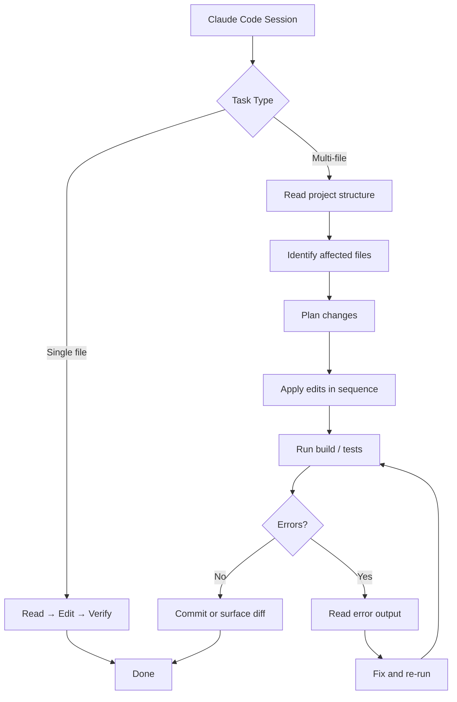
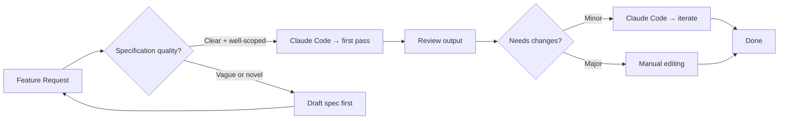
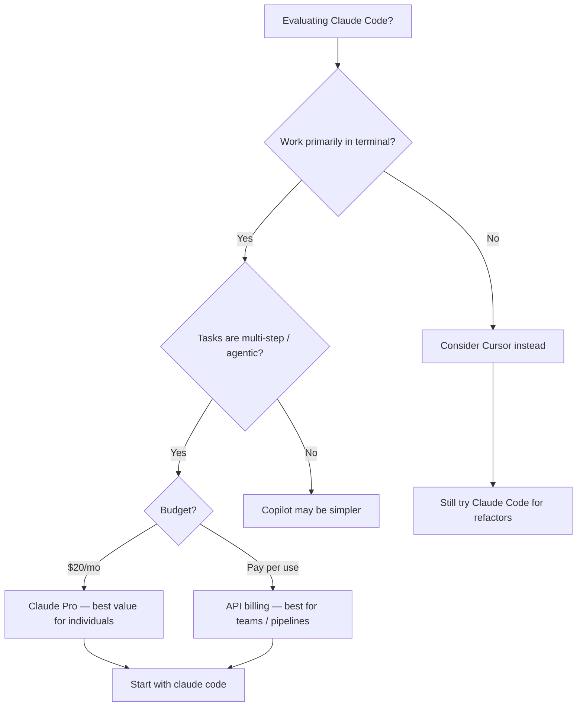

I have been using Claude Code as my primary terminal coding assistant for the past two months, running it against a real production monorepo — TypeScript backend, Next.js frontend, roughly 80,000 lines of code across 400 files. The verdict is nuanced enough that a one-line take would be dishonest. This is the full picture: what Claude Code does well, where it trips, how it prices out, and whether it should replace the tools already in your workflow.

## What Is Claude Code?

Claude Code is Anthropic's agentic coding tool that lives entirely in your terminal. Unlike Cursor (an AI-native editor) or GitHub Copilot (a VS Code extension), Claude Code is a command-line interface. You invoke it in your project directory, describe what you want in natural language, and it reads files, writes code, runs shell commands, calls external tools, and commits changes — all from the same session.

The philosophical difference is significant. Cursor and Copilot augment a GUI editor. Claude Code *is* the interface. There is no sidebar, no inline autocomplete, no diff viewer with click-to-accept buttons. You work in the terminal, you read its output, and you approve or reject actions through a conversation. For developers who already live in the terminal, this feels natural. For everyone else, there is a learning curve.

What makes Claude Code distinct from a simple chat interface is its agentic loop. It does not just generate code and hand it back to you. It can execute that code, read the output, notice the error, fix the file, run the tests again, and iterate — all without you prompting each step. This loop is where the genuine productivity gains come from.

## Key Features

### Terminal-First Design

Claude Code runs as an npm package (`@anthropic-ai/claude-code`). You install it globally, `cd` into your project, and type `claude`. That is the entire setup. From there, every interaction is conversational. The tool reads your project's file tree, respects `.gitignore`, and builds context from the files you reference or that it determines are relevant.

This terminal-native design has a real benefit: it fits into existing shell workflows without friction. Pipe output into it. Run it in a script. Combine it with `make` targets. The tool does not require you to switch applications or re-establish context in a separate GUI window.

### Agentic Coding Loop

The defining capability of Claude Code is autonomous iteration. When I asked it to add server-side pagination to a REST endpoint that previously returned full arrays, it did not just write the handler. It read the existing route, identified the TypeScript types used by the response, updated the OpenAPI schema, modified the corresponding frontend hook to pass page parameters, added a test, ran the test suite, caught a type mismatch in the response shape, fixed it, and re-ran the suite. I watched a sixteen-minute task collapse into about three minutes of reviewing its output.

The agentic loop is not magic — it is a well-structured prompt-and-tool-call architecture running against Claude's reasoning capabilities — but the practical effect is that multi-step tasks that used to require sustained human attention can now run with intermittent oversight.

### Git Integration

Claude Code has native awareness of your git state. It reads `git diff`, `git log`, and `git status` without being asked. When I tell it to "fix the bug introduced in the last commit," it reads the diff first, identifies the change, and targets its fix precisely. It can write commit messages, stage specific files, and create branches. I use this constantly: "stage everything except the config changes and write a conventional commit message" takes about two seconds.

### MCP (Model Context Protocol) Tool Support

Claude Code supports MCP — Anthropic's open standard for connecting AI tools to external data sources and services. In practice this means you can extend Claude Code with tools that access your database, query your internal documentation, call your CI/CD API, or read from proprietary data sources. I connected it to our Jira instance and Linear project board. Telling Claude Code "implement the feature described in LIN-412" and having it pull the ticket text before writing code is a meaningful workflow improvement.

MCP is still maturing, and the available integrations are thinner than what exists for Cursor or Copilot. But the protocol is open and well-documented, so the ecosystem is growing.

### Multi-File Editing

Claude Code does not restrict itself to a single file. It can plan changes across your entire codebase, identify every affected file, and execute the changes in sequence. When I refactored a shared utility that touched 23 import sites, Claude Code mapped the dependency graph, made consistent changes across all 23 files, ran the build to catch any it missed, and fixed two edge cases it initially overlooked. The whole operation took about eight minutes. Manual find-and-refactor with my editor would have taken the better part of an afternoon.



## Setup and Getting Started

Getting Claude Code running takes under five minutes.

```bash
npm install -g @anthropic-ai/claude-code
```

You need an Anthropic API key or an active Claude Pro subscription. Set the key as an environment variable:

```bash
export ANTHROPIC_API_KEY=sk-ant-...
```

Then navigate to any project directory and start a session:

```bash
cd /your/project
claude
```

On first launch, Claude Code reads your project structure and asks a few orientation questions — which files are entry points, what the test command is, whether there are directories to ignore. Answer them once and it remembers. After that, sessions start cold in about two seconds.

The experience inside a session is a REPL. You type a request, Claude Code responds with a plan, asks for permission to run commands or write files if the action is potentially destructive, and executes. You can interrupt at any point. Approval is granular: you can approve individual file writes without approving shell command execution, for instance.

I recommend starting with read-only tasks: "explain what this file does" or "identify all the places where we call the payments API." This builds your intuition for how it explores context before you trust it with writes.

## Real-World Usage

### Refactoring

Refactoring is where Claude Code earns its keep most consistently. The agentic loop handles the tedious parts — tracking where an interface is implemented, finding every call site for a renamed method, updating tests to reflect a new signature — while I focus on reviewing the output rather than executing it.

A representative example: migrating from a custom error class hierarchy to a standard `Result<T, E>` pattern across a TypeScript API. The change touched 34 files. Claude Code completed it in two passes — a first pass that handled the straightforward cases, and a second pass after I pointed out two files it missed. Total time from my perspective: about fifteen minutes of intermittent attention.

The key habit I have developed is never letting Claude Code run a large refactor unreviewed. I ask it to show me a plan first, review the plan, then approve execution file by file on anything that touches core business logic.

### Debugging

Claude Code is a strong debugging partner specifically because it can run code and read the output itself. The debugging loop I now follow: describe the symptom, tell Claude Code to reproduce it, and watch it iterate. It reads stack traces, identifies the relevant code path, hypothesizes a cause, adds logging or modifies test inputs to confirm the hypothesis, and fixes the root cause.

For a recent bug — intermittent 500 errors on a webhook endpoint that appeared only under load — Claude Code traced the error through three layers of middleware, identified a race condition in how we were reusing a shared HTTP client between async calls, and proposed a fix with the correct concurrency pattern. I would have reached the same diagnosis eventually, but Claude Code got there in one unbroken chain of reasoning rather than requiring me to stay in context across a context-switching workday.

### Building New Features

New features are where I am more selective about using Claude Code. It excels when the task is well-specified and the codebase has consistent patterns it can follow. "Add a `/health` endpoint that returns database connection status, following the same structure as the existing `/metrics` endpoint" produces excellent output in one pass.

It is less reliable when the feature requires product judgment or involves a part of the codebase with inconsistent patterns. In those cases, I use Claude Code to generate a first draft — giving me something concrete to critique rather than a blank file — and then edit heavily.



## Pricing

Claude Code pricing works through two routes.

**Claude Pro subscription ($20/month):** Access to Claude Code is included with a Claude Pro subscription. This gives you a usage allowance that Anthropic describes in terms of "turns" rather than raw tokens. In my experience, moderate daily use — a few hours of active coding sessions — is comfortably within the Pro allowance. Heavy sessions with many large file reads and writes can hit rate limits by late afternoon if I have been running long autonomous tasks.

**API usage (pay-per-token):** If you provide your own API key, you pay Anthropic's standard API rates. As of April 2026, Claude Sonnet is priced at $3.00 per million input tokens and $15.00 per million output tokens. A typical Claude Code session that edits a few files and runs a refactor might consume 50,000–200,000 tokens, so costs range from roughly $0.20 to $1.50 per session. Heavy agentic tasks with many file reads can push higher.

For individual developers, the Pro subscription at $20/month is clearly the better value if you use the tool daily. For teams building Claude Code into automated pipelines or CI workflows, direct API pricing is the right route.

There is no team or enterprise tier for Claude Code itself as a standalone product — enterprise procurement goes through Claude's API or Anthropic's enterprise agreements.

## Claude Code vs Cursor vs GitHub Copilot

| | Claude Code | Cursor | GitHub Copilot |
|---|---|---|---|
| **Interface** | Terminal / REPL | GUI editor (VS Code fork) | VS Code extension |
| **Agentic loop** | Yes — full autonomous iteration | Yes — Agent mode | Limited (Copilot Workspace) |
| **Multi-file edits** | Yes | Yes (Composer) | Limited |
| **Inline autocomplete** | No | Yes (Tab) | Yes |
| **MCP / tool support** | Yes | Limited | No |
| **Git awareness** | Native | Via VS Code git | Via VS Code git |
| **Price** | $20/mo (Pro) or API | $20/mo (Pro) | $10/mo (Individual) |
| **Best for** | Agentic tasks, refactors, CLI workflows | Daily coding with GUI comfort | Inline autocomplete, VS Code users |

The honest comparison: if you want inline autocomplete and a familiar GUI, Cursor is better. If you want the tool to autonomously complete multi-step tasks while you do something else, Claude Code is better. GitHub Copilot is best for developers who spend most of their time in VS Code and want assistance without changing their editor.

Many developers — myself included — use more than one. I run Claude Code for autonomous tasks and refactors, and I keep Cursor open for the sessions where I want inline suggestion flow while actively writing new code.

## Rough Edges

**Rate limits on Claude Pro.** Heavy users will hit the Pro plan's rate limits, especially during long autonomous sessions that read many large files. When you hit a limit, you have to wait or switch to API billing. Anthropic's limits are deliberately not published in detail, which makes it hard to predict when you will be throttled. This is the single most common frustration I have seen in the Claude Code community.

**No GUI or diff viewer.** There is no visual diff. Claude Code tells you what it changed, shows you the relevant sections, and you can run `git diff` to see the full picture — but there is no click-to-accept-or-reject UX. Developers who rely heavily on visual diff workflows will miss this. It is a deliberate design choice (terminal-first), not an oversight, but it is a real adjustment.

**Learning curve for large codebases.** Claude Code gets better the more context you give it. For the first few sessions in a new codebase, its file selection is sometimes off — it reads related-sounding but ultimately irrelevant files and misses the right ones. Guiding it improves quickly, and after a week of regular use in a project it rarely makes context mistakes. But the onboarding period requires patience.

**Long tasks can drift.** For very open-ended agentic tasks — "implement the entire checkout flow" — Claude Code can drift from the original intent after many steps, especially if it encounters ambiguity and makes assumptions rather than asking. Breaking large goals into smaller, reviewable checkpoints is essential.

**No offline support.** Every interaction requires an API call. There is no local model option. For developers in environments with restricted internet access or strict data residency requirements, this is a blocker.



## Pros and Cons

**Pros**
- Genuinely autonomous multi-step task execution with self-correction
- Deep git integration — reads diffs, writes commit messages, manages branches
- MCP tool support extends it to external data sources and services
- Terminal-native design fits naturally into existing shell workflows
- Strong multi-file refactoring with dependency tracking
- Included in Claude Pro at no additional cost

**Cons**
- No inline autocomplete or GUI — steep adjustment for non-terminal developers
- Rate limits on Pro plan are opaque and can throttle heavy sessions
- Long autonomous tasks can drift without clear intermediate checkpoints
- No visual diff viewer for reviewing changes
- No offline or local model support
- MCP ecosystem is still thin compared to mature extensions for VS Code tools

## Verdict

Claude Code is the right tool if you want an AI that works autonomously through multi-step coding tasks and fits cleanly into a terminal workflow. It is not the right tool if you want inline autocomplete while actively typing or if you prefer a visual interface for reviewing AI-generated changes.

For me, it has become an essential part of the toolchain for the class of tasks I least wanted to do manually: large refactors, debugging sessions that cross multiple files, and grinding through well-specified features that follow existing patterns. The agentic loop genuinely works — the self-correction behavior saves me from catching trivial errors manually, and the git integration removes an entire category of commit-message busywork.

The pricing is fair. At $20/month with Claude Pro, the value is clear for any developer who uses it more than a few times a week. At API rates, a serious daily user would likely spend $30–80/month depending on task complexity — still competitive for the productivity return.

If you are evaluating AI coding tools in 2026, Claude Code deserves an honest trial. Give it a week on a real project, start with read-only tasks, and build up to agentic runs once you understand how it explores context. The learning curve is real but short.

---

## FAQ

### Do I need Claude Pro to use Claude Code, or can I use my own API key?

Both options work. With a Claude Pro subscription ($20/month), Claude Code is included in the plan and draws from a shared usage allowance. With a direct API key, you pay Anthropic's published token rates for whatever model you configure (Claude Sonnet is the default). For individual developers, Pro is usually the better value. For teams running Claude Code in CI pipelines or automated workflows, direct API billing is the right choice because you can control and budget token usage precisely.

### How does Claude Code handle sensitive code or proprietary data?

All code and context you share with Claude Code is sent to Anthropic's API to generate responses. Anthropic publishes its data handling and privacy policy at anthropic.com. Claude Code does not store your code persistently between sessions, but the session content is transmitted to Anthropic's servers. If your organization has strict data residency or code confidentiality requirements, review Anthropic's enterprise agreement terms before deploying team-wide.

### Can Claude Code replace GitHub Copilot for inline autocomplete?

No. Claude Code has no inline autocomplete feature. It is a conversational REPL, not an editor integration. If you rely on character-by-character or line-by-line autocomplete suggestions while typing, Copilot or Cursor's Tab completion serves that need. Claude Code excels at tasks you describe in natural language and let run autonomously — not at augmenting your keystrokes in real time.

### What happens when Claude Code hits a rate limit mid-task?

When you hit the Claude Pro rate limit, Claude Code will notify you that it cannot continue until the limit resets (typically the next hour or the next day depending on the limit type). Any work it has already written to disk is preserved — you will not lose completed file edits. You can resume the session once the limit resets, or switch to an API key for the remainder of the task. Planning large autonomous tasks for low-usage periods of the day reduces how often this happens.

### Is Claude Code useful for small projects, or only for large codebases?

It is useful at any size, but the value scales with codebase complexity. For a small personal project with a few hundred lines, the overhead of a conversational REPL may feel heavier than just editing the file directly. For a project with thousands of lines across dozens of files — especially one with interconnected modules where a change in one place cascades to several others — Claude Code's ability to track those dependencies and execute changes across files is where it pays off most clearly. The feature that works at any scale is the debugging loop: describe a bug, let Claude Code iterate on reproducing and fixing it, and review the result.
