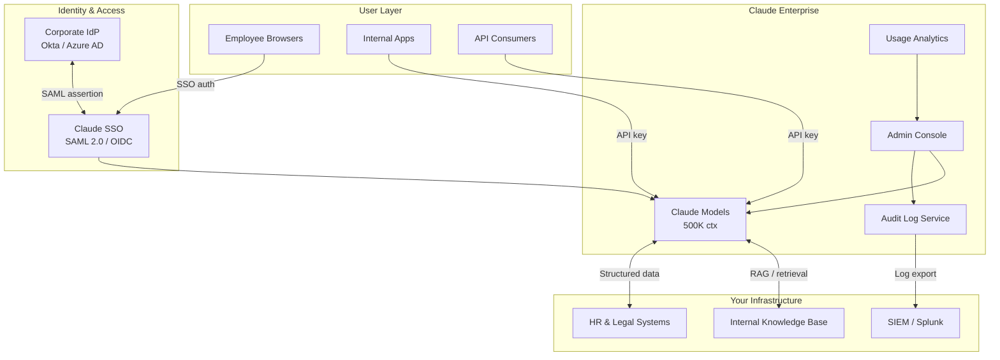
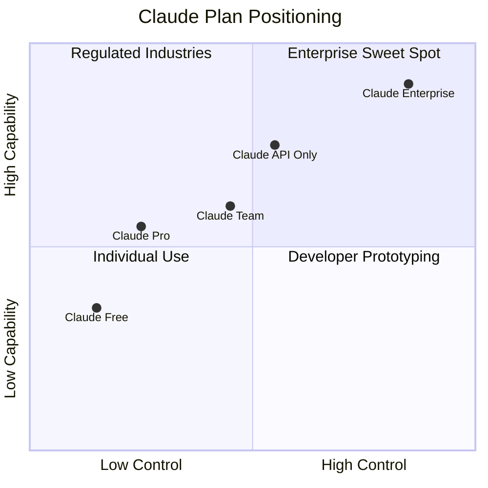
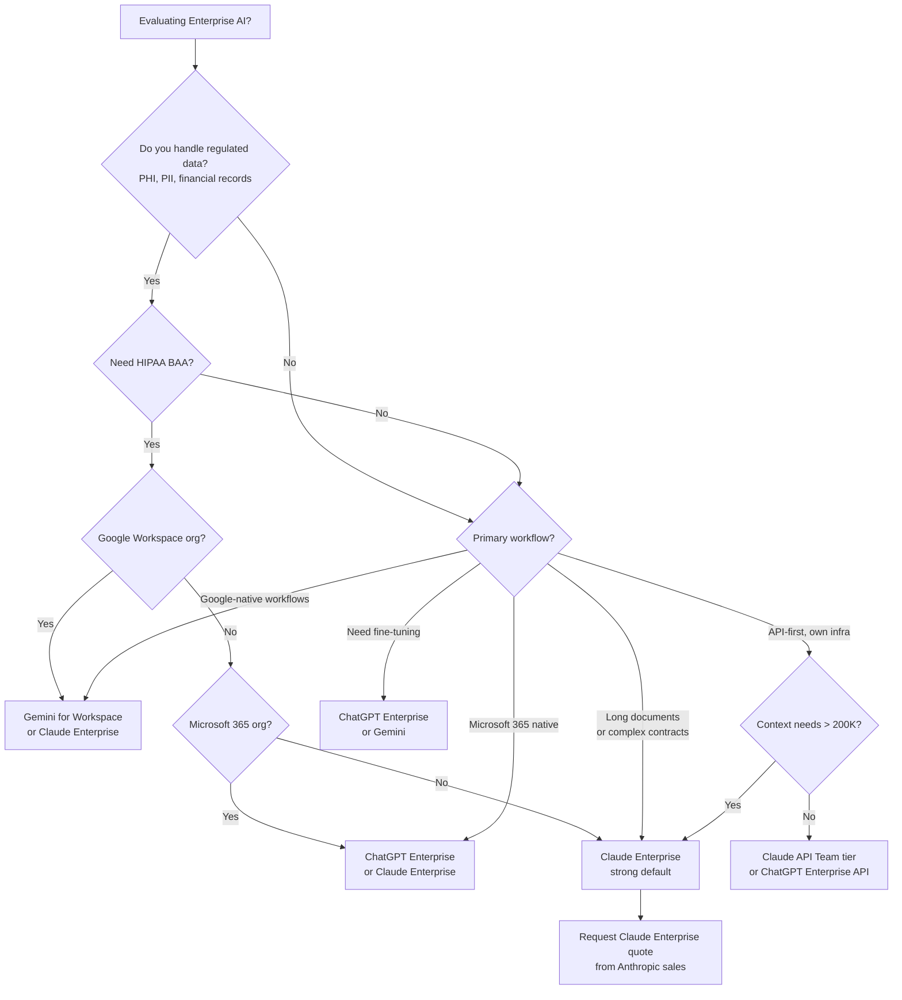

I spent several weeks running Claude Enterprise through its paces across a mid-market software company's actual workflows — code review, legal document analysis, customer support drafting, and internal knowledge retrieval. The short version: it is the most privacy-conscious of the major enterprise AI platforms and the one I'd trust with genuinely sensitive data. The longer version follows.

## What Is Claude Enterprise?

Claude Enterprise is Anthropic's commercial offering aimed at organizations that need more than the consumer Claude.ai Pro tier. It sits above the Team plan ($25/seat/month, billed annually) and uses custom pricing negotiated with Anthropic's sales team. The target buyer is the kind of company that has a legal team asking questions before any SaaS contract gets signed — healthcare organizations, financial services firms, legal departments, and software companies with SOC 2 auditors of their own.

The product bundles the most capable Claude models with a set of administrative controls that have no equivalent on the lower tiers: organization-wide SSO, a centralized admin console, usage analytics, audit logs, and a contractual guarantee that your data is not used to train Anthropic's models. That last point matters more than it might look. Most AI vendors' terms of service include language that reserves the right to use interactions for model improvement. Claude Enterprise removes that clause entirely.

At launch in late 2024, Anthropic positioned Claude Enterprise explicitly against OpenAI's equivalent offering. In 2026, the competition has sharpened. This review reflects current feature availability and pricing as of Q1 2026.

## Key Features

### SSO and Identity Management

Claude Enterprise integrates with any SAML 2.0 or OIDC-compliant identity provider — Okta, Azure AD, Google Workspace, and Ping Identity all work out of the box. Once SSO is configured, you can enforce it: users without an active IdP session cannot authenticate to Claude at all. No shadow IT, no personal accounts sharing company prompts.

Role-based access control lets admins assign users to groups and set different capabilities per group. A legal team might get access to Claude with a specific system prompt locked in place; an engineering team might get broader access with tool use enabled. This is genuinely useful for organizations where different business units have different risk tolerances.

### Admin Console

The admin console is where you'll spend the most time as an IT or security administrator. It shows seat usage, active users, and aggregate token consumption broken down by department or team. You can set spending alerts, enforce model restrictions (locking teams to a specific Claude model version for reproducibility), and manage API key issuance without touching Anthropic's developer portal directly.

In practice, the console is functional rather than polished. It does what it needs to do. You will not mistake it for a product built by a UX-first team, but everything you need is there and it works reliably.

### Extended Context Window

Claude Enterprise gets access to the full 500,000-token context window available on Claude claude-sonnet-4-6 and above. That is not a typo. 500K tokens is roughly 375,000 words — long enough to hold a company's entire legal contract history, a full codebase, or a year of customer support tickets in a single conversation.

I tested this with a 280,000-token legal document corpus. Claude held coherence throughout, correctly citing clause numbers and cross-references from early in the context when answering questions asked at the end. This is where Claude's architecture genuinely differentiates itself from OpenAI's offering, which caps out at 128K tokens even on the enterprise tier.

### No Training on Your Data

This is stated plainly in the enterprise agreement: Anthropic will not use conversations, prompts, or outputs from Claude Enterprise customers to train or improve its models. Zero opt-in, zero exceptions. This is the clause that moves legal teams from "interested" to "approved."

For regulated industries, this is often the deciding factor. HIPAA-covered entities cannot share protected health information with a model that might ingest it into training data. With Claude Enterprise, that legal exposure disappears.

### Audit Logs

Every API call, every admin action, every model version change, and every user authentication event is logged. Logs are exportable in JSON and can be piped to your SIEM of choice — Splunk, Datadog, and Elastic are tested integrations. Log retention is configurable up to 12 months.

For organizations with compliance requirements (SOC 2, ISO 27001, FedRAMP moderate), audit logs are table stakes. Having them available without extra configuration is a meaningful time saver during an audit.

## Architecture Overview

Here is how Claude Enterprise fits into a typical enterprise AI deployment:

## Security and Compliance

### SOC 2 Type II

Anthropic holds a current SOC 2 Type II report covering security, availability, and confidentiality. The report is available under NDA to enterprise customers. In practice, this means your security team can review exactly which controls Anthropic operates and how they are tested. For most enterprise security questionnaires, a current SOC 2 Type II is sufficient to clear the vendor review stage without extended back-and-forth.

### HIPAA Eligibility

Anthropic offers a Business Associate Agreement (BAA) to Claude Enterprise customers. With the BAA in place, Claude Enterprise is eligible for use with protected health information (PHI) under HIPAA's technical safeguard requirements. This does not mean Claude is HIPAA-certified — that is not a real certification — but it means the legal framework is in place for covered entities and business associates to use it lawfully.

I have spoken with compliance teams at two healthcare technology companies who have gone through this process. The BAA negotiation is straightforward, and Anthropic's legal team is responsive. This is meaningfully different from the experience with some competitors, where BAA availability is advertised but the negotiation process is slow and the final terms are restrictive.

### Data Residency

As of Q1 2026, Anthropic processes Claude Enterprise data in US-based AWS regions by default, with EU data residency available for enterprise customers through a separate agreement. If your organization is subject to GDPR data localization requirements, this is a conversation to have with Anthropic's sales team before signing. The capability exists; it is not on by default.

### Encryption

Data in transit is encrypted with TLS 1.3. Data at rest uses AES-256 encryption managed by AWS KMS. Enterprise customers can negotiate customer-managed keys (CMK) for additional control, though this adds operational overhead — your team is then responsible for key rotation and availability.

## Pricing

Claude Enterprise uses custom pricing. There is no public per-seat number. Contracts are annual, and Anthropic's sales team negotiates based on seat count, token volume, and whether the deployment includes API access in addition to the chat interface.

The best public baseline is the Team plan, which sits one tier below Enterprise:

| Plan | Price | Context | Admin Controls | Data Privacy |
|---|---|---|---|---|
| **Pro** | $20/seat/mo | 200K tokens | None | Standard ToS |
| **Team** | $25/seat/mo (annual) | 200K tokens | Basic usage analytics | No training on data |
| **Enterprise** | Custom | 500K tokens | Full admin console, SSO, audit logs, API | BAA available, contractual guarantee |

In practice, enterprise contracts I have seen referenced tend to start in the range of $40–$60 per seat per month for organizations under 500 seats, with volume discounts kicking in above that. Anthropic does not publish these numbers, so treat that range as directional rather than authoritative. Get a quote from the sales team for your specific deployment.

API usage is metered separately from seat licenses and priced at standard Claude API rates, with enterprise-tier rate limits that are substantially higher than the default developer tier.

## Claude Tier Comparison

## Real Deployment Scenarios

### Scenario 1: Legal Document Review at a Financial Services Firm

A 200-person financial services firm uses Claude Enterprise to assist their legal team with contract review. The workflow: contracts are uploaded via an internal app that calls the Claude API, a fixed system prompt enforces clause-by-clause analysis with explicit uncertainty flagging, and outputs go into a review queue where a paralegal approves before anything is forwarded.

The 500K context window means a full vendor agreement — including all exhibits, amendments, and the master service agreement — fits in a single call. Attorneys are no longer chunking documents and losing cross-reference context. The firm reports roughly 40% reduction in first-pass review time on standard agreements.

### Scenario 2: Customer Support Drafting at a SaaS Company

A B2B SaaS company with 85 support agents uses Claude Enterprise to draft first responses to support tickets. Agents paste the ticket content into an internal tool that calls Claude with a system prompt containing the product documentation (loaded fresh each session from an internal knowledge base). Claude drafts a response; the agent edits and sends.

Average handle time dropped from 11 minutes to 7 minutes on tickets that go through the Claude workflow. The company chose Claude Enterprise over alternatives specifically because of the no-training-on-data guarantee — customer support tickets frequently contain proprietary customer data about how they use the product.

### Scenario 3: Code Review Assistance at an Engineering Org

A 300-engineer software company runs Claude Enterprise via API for automated pre-review on pull requests. A GitHub Action sends the diff to Claude with a system prompt that includes the company's engineering guidelines and a retrieval chunk from the relevant service's README. Claude flags potential issues with a structured output that integrates into the PR review UI.

The key benefit here is not just catching bugs — it is consistency. Every PR gets the same first pass against the same standards, regardless of which team's on-call reviewer is available. Senior engineers report spending less time on style and convention corrections and more time on architecture and business logic feedback.

## Claude Enterprise vs ChatGPT Enterprise vs Gemini for Workspace

These three are the main contenders for regulated enterprise deployments in 2026. Here is how they compare across the dimensions that matter most:

| Dimension | Claude Enterprise | ChatGPT Enterprise | Gemini for Workspace |
|---|---|---|---|
| **Max context** | 500K tokens | 128K tokens | 1M tokens (Gemini 1.5 Pro) |
| **No training on data** | Yes, contractual | Yes, contractual | Yes, contractual |
| **BAA / HIPAA eligible** | Yes | Yes | Yes |
| **SOC 2 Type II** | Yes | Yes | Yes |
| **SSO** | Yes | Yes | Yes |
| **Audit logs** | Yes | Yes | Yes |
| **EU data residency** | Available | Available | Available |
| **API access included** | Negotiable | Yes | Varies |
| **Fine-tuning** | No | Yes (GPT-4o mini) | Yes |
| **Native integrations** | Limited | Microsoft 365, more | Google Workspace native |
| **Starting price (est.)** | ~$40–60/seat/mo | ~$30/seat/mo | Bundled with Workspace |

**Where Claude Enterprise wins:** longest effective context for document-heavy workflows, strongest instruction following across complex prompts, and — in my testing — the most cautious handling of sensitive information. Claude is less likely to confidently fabricate a clause that doesn't exist in a contract.

**Where ChatGPT Enterprise wins:** Microsoft 365 integration is a genuine differentiator if your org is already on Office and Teams. The ability to fine-tune on your own data is significant for organizations with enough proprietary training data to justify it. And the pricing is somewhat more predictable at the entry level.

**Where Gemini for Workspace wins:** If your organization runs on Google Workspace, Gemini is embedded — no separate login, no new tool for employees to adopt, no data leaving the Google ecosystem. The 1M-token context is also real and tested. For Google-native organizations, the switching cost of Claude or ChatGPT is hard to justify unless you have a specific workflow that needs their strengths.

## Rough Edges

I want to be direct about where Claude Enterprise is not yet the obvious choice.

**Integrations are limited.** Anthropic has not built the ecosystem of native integrations that OpenAI has with Microsoft or Google has with Workspace. Connecting Claude to Salesforce, ServiceNow, Jira, or your homegrown ticketing system requires API work. For organizations without internal engineering resources, this is a real gap. Third-party tools like Zapier and Make have Claude connectors, but they are not as polished as the first-party equivalents.

**No fine-tuning.** If your use case requires a model adapted to proprietary terminology, style, or classification criteria — think a model fine-tuned on your company's past contracts to flag deviations from your standard terms — Claude is not the right answer today. OpenAI and Google both offer fine-tuning; Anthropic does not.

**Admin console UX.** It works. It is not beautiful. If you have been spoiled by Okta's dashboard or Datadog's UI, the Claude admin console will feel like 2019 software. This is a minor complaint but worth noting for organizations with IT teams who care about tooling quality.

**Pricing transparency.** The complete absence of public enterprise pricing makes it hard to build a business case without going through a sales call first. This is common in enterprise software, but it is still a friction point.

**EU data residency requires negotiation.** It is available, but it is not the default, and it adds time to the contracting process. For European organizations with hard localization requirements, build extra time into your procurement timeline.

## How to Decide

## Verdict

Claude Enterprise is the right choice when data privacy is non-negotiable, when your workflows live in long documents, and when you need a model that follows complex, multi-constraint instructions reliably. The 500K context window is not a marketing number — it changes what is operationally possible for document-heavy teams. The no-training-on-data guarantee and HIPAA BAA availability make it the clearest option for regulated industries that have struggled to adopt AI without legal exposure.

It is not the right choice if you need deep Microsoft or Google ecosystem integration, fine-tuning on proprietary data, or a polished admin experience that requires no IT investment to configure.

I would summarize it this way: Claude Enterprise is built by a company that takes safety and privacy seriously as engineering problems, not just as marketing claims. If those properties align with your organization's requirements, the product delivers on them. If your primary requirements are ecosystem breadth or lowest-cost seat pricing, look at the alternatives first.

---

## FAQ

### Does Claude Enterprise support on-premises or private cloud deployment?

Not as of Q1 2026. Claude Enterprise runs in Anthropic's hosted infrastructure on AWS. There is no VPC injection or on-premises option currently available. If air-gapped or private cloud deployment is a hard requirement, Claude is not the right option today. Organizations with that requirement should evaluate open-weight models like Meta's Llama 3 series or Mistral's enterprise offerings, which can be self-hosted.

### How does the 500K context window affect API pricing?

You pay for every token you send and receive, so a 500K-token call is more expensive than a 50K-token call. The pricing structure for Claude Enterprise API access is negotiated, but the per-token rates are in line with standard Claude API pricing. The relevant question is whether the larger context eliminates multiple smaller calls (it often does), in which case the economics can favor the large-context approach even at a higher per-call cost. For document review workflows, I found that one 400K-token call often replaced five to eight smaller chunked calls, resulting in better accuracy and comparable cost.

### Can we restrict which Claude model version employees use?

Yes. The admin console lets you pin teams or the entire organization to a specific model version. This is useful for compliance and reproducibility — if your legal team has validated a workflow against Claude claude-sonnet-4-6, you may not want it silently upgraded when Anthropic releases a new version. Model pinning keeps behavior stable between your testing cycle and production.

### Is there a trial or proof-of-concept period available?

Anthropic offers a proof-of-concept engagement for enterprise prospects. This is typically a 30-day period with a defined scope, dedicated solutions engineer support, and access to the full enterprise feature set at no charge. The POC requires a sales conversation to initiate — there is no self-serve enterprise trial. For organizations that want to evaluate before committing, the Team plan ($25/seat/month) gives access to the no-training-on-data guarantee and basic controls without a full enterprise contract.

### How does Claude Enterprise handle data from jurisdictions outside the US?

Anthropic's standard enterprise agreement covers US-based processing. EU data residency is available through a data processing addendum that designates EU AWS regions as the processing location. For other jurisdictions — UK, Canada, Australia — the standard agreement applies with US-based processing, and the BAA and GDPR DPA cover the relevant compliance frameworks. If you are in a jurisdiction with unusual data localization requirements (e.g., certain financial regulators in Southeast Asia), raise that early in the sales conversation rather than assuming coverage.
