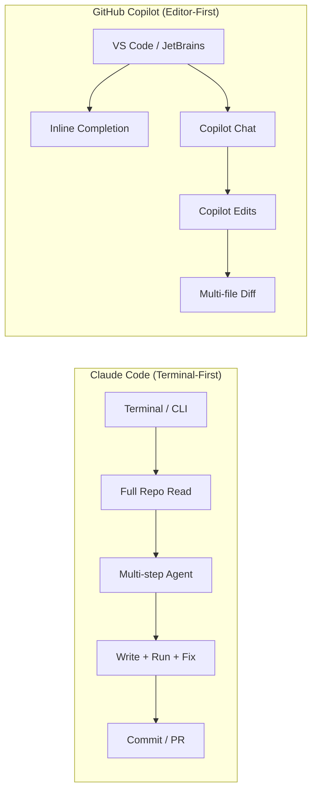
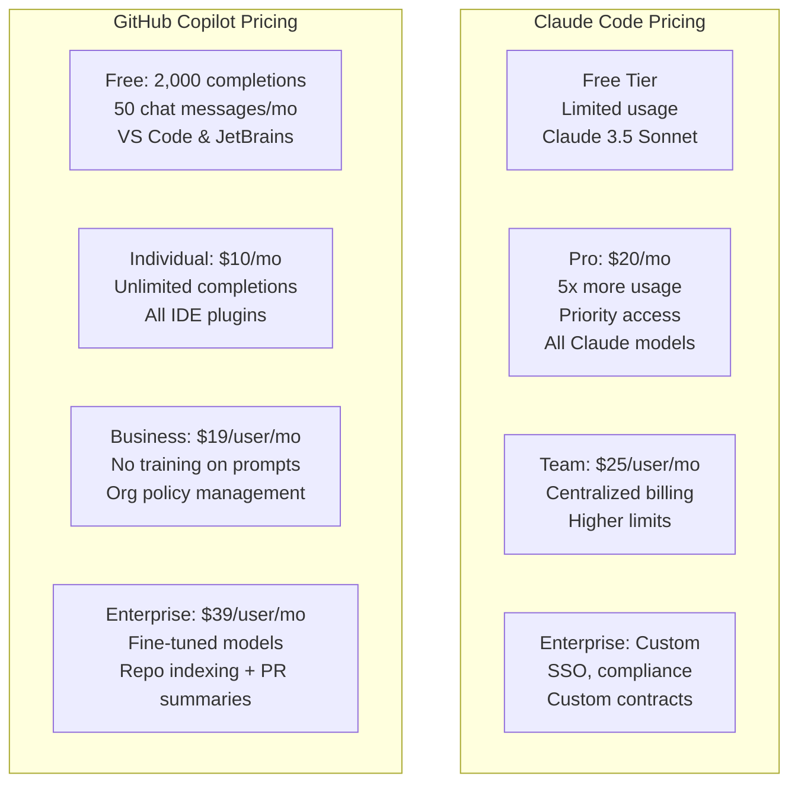
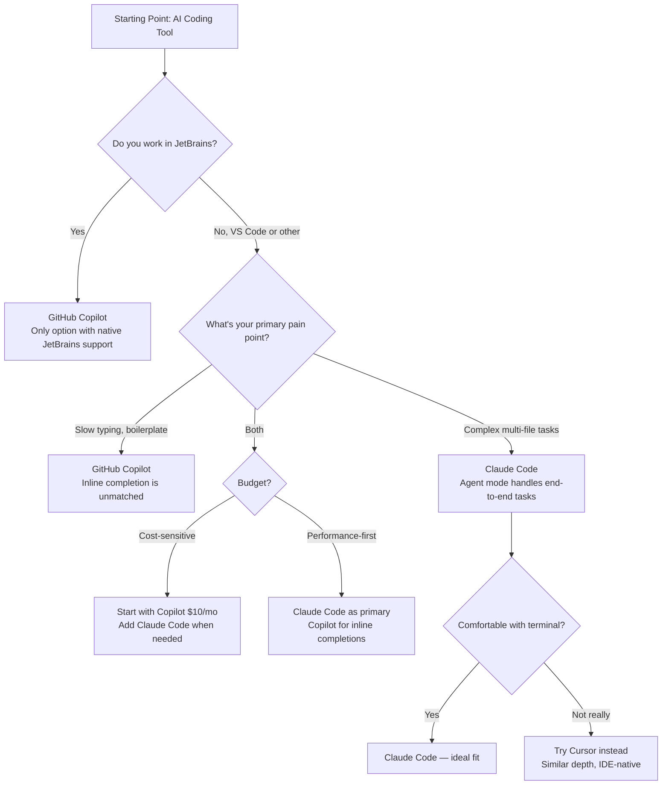

Two philosophies of AI-assisted coding have emerged, and they couldn't be more different. GitHub Copilot asks: how do we make the editor smarter? Claude Code asks: what if the AI just worked autonomously in the terminal and handled the whole task?

That split — editor-first vs terminal-first — isn't aesthetic. It shapes what each tool can do, what it costs, where it fails, and which developers should be reaching for it. I've been using both tools on production codebases for the better part of a year, and the answer to "which is better?" depends heavily on how you actually work.

## TL;DR

> **Claude Code** wins for: autonomous multi-step tasks, whole-codebase understanding, complex refactors across many files, debugging that requires reading and reasoning across the full repo, and developers comfortable running AI from the terminal.
>
> **GitHub Copilot** wins for: inline ghost-text completions as you type, low-friction IDE integration that doesn't require changing editors, lower price, and teams with enterprise data-control requirements.
>
> **For most individual developers in 2026**: Claude Code is the more powerful tool for big-picture work; Copilot is more convenient for the moment-to-moment flow. Many serious developers use both — and that's not a cop-out answer, it's actually how the tools complement each other.

---

## Quick Comparison

| Feature | Claude Code | GitHub Copilot |
|---|---|---|
| **Primary interface** | Terminal / CLI | IDE plugin (VS Code, JetBrains, Vim) |
| **Inline completions** | No | Yes — core feature |
| **Whole-codebase context** | Yes (reads full repo) | Limited (open tabs, `@workspace` search) |
| **Agent / autonomous mode** | Yes — core feature | Copilot Workspace (beta), Copilot Edits |
| **Context window** | 200K tokens (Claude 3.5 Sonnet) | Varies by model; GPT-4o at 128K |
| **Runs terminal commands** | Yes | No |
| **IDE integration** | VS Code extension (secondary) | Native first-class plugin |
| **Language support** | Broad | Broad |
| **Individual pricing** | $20/month (Pro) | $10/month (Individual) |
| **Business pricing** | $25/user/month (Team) | $19/user/month (Business) |
| **Free tier** | Yes (limited usage) | Yes (2,000 completions/mo) |
| **Data controls** | Standard privacy policy | Copilot Business: no training on prompts |

---

## Code Completion

This is the most immediate place the tools diverge. GitHub Copilot exists largely because of inline code completion — the ghost text that appears as you type, suggesting the next line or the next function body. It's fast, it's embedded in your editor flow, and after a year of using it you stop noticing it's AI and start just accepting the good suggestions.

Claude Code does not do inline completion. Full stop. If you're mid-function and you want the next few lines suggested in-editor, Claude Code is not the tool for that job.

This is a meaningful concession. For boilerplate-heavy work — writing similar route handlers, generating database models, scaffolding test cases — Copilot's completion loop is a genuine productivity multiplier. You type a function signature and a comment, Copilot fills in the body, you hit Tab, done. The loop is fast and satisfying.

Where Copilot's completion falls short is context depth. Inline suggestions draw from the current file and recently opened tabs. They don't have visibility into how your entire codebase is structured. So you'll occasionally get suggestions that use the wrong import path, call a function with the wrong signature, or re-implement something that already exists in a utility module you've never opened in this session.

Claude Code doesn't have the inline loop. What it has instead is a chat interface where you describe what you want — "write a function that normalizes phone numbers in the same format as the existing validators in `/src/utils/`" — and it reads the relevant files before generating code. The output is more likely to fit cleanly into your existing patterns because it actually read those patterns first.

Neither is obviously better. They solve different parts of the same problem.

---

## Agentic Coding: Where the Gap Is Biggest

This is the section that matters most for developers doing non-trivial work.

### Claude Code's Terminal Agent

Claude Code's core value proposition is that it can handle multi-step tasks autonomously. You give it a goal, and it figures out the steps: reads the relevant files, writes code, runs tests, reads the failure output, fixes the issue, re-runs tests, and keeps going until it's done or asks you a clarifying question.

In practice, this looks like: "Migrate the `/api/users` endpoint from the legacy database client to the new one we just added. Make sure the tests pass." Claude Code will read the endpoint, read the new database client, write the migration, run the test suite, see which tests fail, read the failures, fix them, and loop until the suite is green — all without you babysitting each step.

I used it to refactor a 2,000-line auth module that touched 14 files. I described the new interface I wanted, pointed it at the relevant directory, and walked away for fifteen minutes. When I came back, it had made changes across all 14 files, run the tests, caught two edge cases it had missed, fixed them, and left me a summary of what it changed and why. I reviewed the diff and found it had made one questionable decision about error handling that I reverted — but 90% of the work was done correctly in a single session.

That's not something Copilot can do today.

### Copilot Workspace and Copilot Edits

GitHub has been working on its own take on agentic coding. Copilot Edits lets you select a set of files, describe a change in natural language, and get a multi-file diff you can accept or reject per file. It's a meaningful step beyond single-file completion, and for defined, bounded tasks — "update these three files to use the new API signature" — it works well.

Copilot Workspace is the more ambitious version: you describe a task from a GitHub Issue, it plans out the changes, and you iterate on the plan before it generates code. As of early 2026, it still feels like a beta product compared to the fluency of Claude Code's terminal agent. The planning step adds friction, and the execution is less autonomous — you're steering more, the AI is driving less.

If Copilot is your only tool, Copilot Edits is worth using for multi-file changes. But if you've spent time with Claude Code's agent mode, going back to Copilot Edits for complex tasks feels like a step down in capability.

---

## Context and Codebase Understanding

The fundamental architectural difference between these tools is how much of your codebase they can see at once.

**GitHub Copilot** works within the editor session. The inline completion model sees your current file and open tabs. Copilot Chat has a `@workspace` command that searches across your local project, but it works by selecting a subset of your files — the selection algorithm isn't fully transparent, and on large repos we occasionally got answers that missed important context from files outside the active session.

**Claude Code** reads your full repository before responding to requests that need it. You can point it at a directory and it will read every file, or you can let it search intelligently. Either way, the model sees the whole picture. Ask it "where is authentication handled in this app?" and it will return specific files, explain how they relate, and show you the actual code — not just the files that happened to be open.

This matters more than it sounds. When Claude Code refactors a function, it knows how that function is called across every file in the project, not just in the files you have open. When it writes a new component, it checks your existing components for naming conventions, pattern usage, and shared utilities. The output fits into your codebase more naturally because the model actually knows your codebase.

For greenfield work or small projects, this advantage is modest. For large, established codebases where the existing patterns matter enormously, it's substantial.

---

## Benchmark Comparison

Benchmark numbers should be taken with appropriate skepticism — they measure specific tasks under controlled conditions, not your actual workflow. With that caveat:

```mermaid
xychart-beta
    title "AI Coding Tool Performance (Estimated, Higher = Better)"
    x-axis ["Code Completion", "Multi-file Refactor", "Bug Diagnosis", "Test Generation", "Codebase Q&A"]
    y-axis "Relative Score" 0 --> 100
    bar [55, 88, 85, 82, 90]
    bar [92, 58, 60, 70, 55]
```

The pattern in our experience is consistent with what benchmarks suggest: Claude Code (left bars) has a substantial advantage in tasks requiring reasoning across a whole codebase — refactoring, debugging across files, understanding and explaining an existing project. GitHub Copilot (right bars) dominates in inline completion speed and volume.

On SWE-bench (a benchmark measuring an AI's ability to resolve real GitHub issues from popular open-source repos), Claude 3.5 Sonnet consistently scores in the high 40s to low 50s percent range. That's a meaningful indicator of autonomous code task capability. Copilot's underlying models vary — it lets you choose between GPT-4o and Claude 3.5 Sonnet in chat mode, which muddies the comparison — but the tool's current agent infrastructure limits how much of that model capability it can express on complex tasks.

---

## Pricing Deep Dive

Pricing is simpler than it looks once you understand what you're comparing.

**Claude Code Pro at $20/month** gets you: significantly more usage than the free tier, priority access during high-demand periods, access to Claude's full model range (Sonnet, Opus when available), and the full terminal agent capability. There's no artificial limit on task complexity or file count — you're paying for model time, not features.

**GitHub Copilot Individual at $10/month** gets you: unlimited inline completions, full Copilot Chat access, IDE integration across VS Code, JetBrains, Vim, Neovim, and others, and the ability to switch between GPT-4o and Claude 3.5 Sonnet in chat mode. At this price, it's the most cost-effective AI coding tool available for solo developers who want the inline completion experience.

**The team and enterprise math** tilts toward Copilot at scale. Copilot Business at $19/user/month includes the critical data privacy commitment — prompts are not used to train models — and organization-level policy management. Claude Code's Team plan at $25/user/month is more expensive and has less enterprise infrastructure built around it. If you're buying for 50+ engineers who need enterprise data controls, Copilot is the more mature option.

For individuals, the price difference ($10/month vs $20/month) is real but often irrelevant if you're using Claude Code for the kind of complex agentic tasks that save hours per week. The question is whether you actually use those capabilities.

---

## IDE and Workflow Integration

This is the other axis where the tools diverge sharply, and it's ultimately a question of where you live when you code.

**GitHub Copilot** integrates natively into your existing environment. Install the extension, sign in, and you're done. It works in VS Code, Visual Studio, JetBrains (IntelliJ, PyCharm, WebStorm, etc.), Vim, Neovim, and GitHub.com itself. For developers embedded in JetBrains for Java or Kotlin work, Copilot is the only reasonable choice — Claude Code has no JetBrains integration at all.

The Copilot experience inside VS Code is polished and deeply integrated. Chat lives in the sidebar. Inline completions appear naturally. The `@workspace`, `@file`, and `@terminal` references in chat let you bring in context without leaving the editor. You never need to switch windows or leave your coding flow.

**Claude Code** is primarily a terminal tool. You open a terminal, navigate to your project directory, run `claude`, and interact through a conversation interface that can read files, run commands, and make changes. There is a VS Code extension, but it's secondary — the terminal is where Claude Code is designed to work.

For developers who are comfortable in the terminal and already switch between terminal and editor regularly, this isn't much friction. You're running tests in the terminal, using git in the terminal, running your dev server in the terminal — adding Claude Code to that workflow is natural.

For developers who live in the editor and rarely touch the terminal directly, the context switch is real and takes getting used to.

---

## How to Choose

**Choose Claude Code if:**
- You regularly tackle large, multi-file tasks that benefit from autonomous execution
- You're comfortable working in the terminal and treating AI as a task-runner rather than a completion engine
- You work on large, established codebases where full-project context makes a meaningful difference
- You're willing to pay $20/month for a tool that can handle complex engineering work end-to-end

**Choose GitHub Copilot if:**
- You want inline code completion as you type — nothing else currently matches it
- You work in JetBrains IDEs and need native integration
- You're price-sensitive and $10/month is more appropriate for your usage
- You work in an enterprise environment with strict data controls and vendor compliance requirements
- You're newer to AI coding tools and want the lowest-friction starting point

**Use both if:**
- You want the best of both paradigms: Copilot for moment-to-moment completions while writing code, Claude Code for larger autonomous tasks, refactors, and debugging sessions
- This is actually how a growing number of senior engineers use these tools in 2026, and the costs add up to $30/month — which is easy to justify if you're using both regularly

---

## Our Verdict

GitHub Copilot and Claude Code aren't really competing for the same use case, even though they're both called "AI coding tools."

Copilot is an editor enhancement. It makes the act of typing code faster and more accurate. It lives in your existing workflow without asking you to change anything. For developers who primarily want to write code faster, it's the cleaner fit and the better value.

Claude Code is an AI agent that happens to also help with coding. It can take a task and complete it — not just suggest the next lines, but read the codebase, make changes across multiple files, run the tests, fix the failures, and hand you something that works. For developers who want to offload chunks of engineering work rather than just type faster, it's genuinely in a different capability category.

My actual recommendation: start with GitHub Copilot if you've never used either. The $10/month entry point is low, the learning curve is near zero, and the inline completion habit is valuable in any workflow. Once you've got that baseline, try Claude Code for a specific complex task — a substantial refactor, a debugging session on a hard bug, migrating a component to a new pattern. If it saves you a meaningful amount of time on that task, you'll know whether the additional $10/month is worth it for your workflow.

For what it's worth: I run both. Copilot stays running in VS Code for the completion flow. Claude Code gets opened in the terminal when a task is too big or too cross-cutting to want to drive manually. The combination costs $30/month and has changed how much I can ship in a week.

---

## Frequently Asked Questions

### Can Claude Code replace GitHub Copilot entirely?

Not cleanly, because Claude Code doesn't do inline completions. If you depend on ghost-text suggestions appearing as you type — which many developers do after getting used to Copilot — you can't get that from Claude Code. What you can do is use Claude Code for the majority of your complex work and lean on the editor's native autocomplete for the basic typing. Some developers make that trade-off happily; others miss Copilot's completions immediately.

### Does Claude Code work inside VS Code?

Yes — there's an official Claude Code extension for VS Code. But it's not the primary interface the tool is designed around. The extension lets you run Claude Code commands from within the editor, but the deeper agent features and the full autonomous task-execution workflow work best from the terminal. If staying inside VS Code is a hard requirement, Cursor (which builds similar agentic depth into an IDE) is worth evaluating alongside these two.

### Which tool is better for beginners or developers new to AI coding tools?

GitHub Copilot, by a significant margin. The zero-friction installation, the familiar IDE environment, and the simple value proposition (suggestions appear as you type — accept or reject) mean you can get value on day one without learning new workflows. Claude Code requires comfort with the terminal and a mental model of how to prompt an autonomous agent, which is a higher learning curve. Copilot first, Claude Code once you're ready for more.

### How does GitHub Copilot's choice of AI model affect the comparison?

Copilot Individual lets you choose between GPT-4o and Claude 3.5 Sonnet in Copilot Chat. This is actually significant — you can get Claude's model quality through Copilot's interface. However, what you can't get through Copilot is Claude's autonomous agent behavior: the ability to read files, run terminal commands, and loop until the task is done. The model is powerful, but the tool infrastructure around it limits what the model can express on complex tasks. Claude Code uses the same Claude 3.5 Sonnet model but in an environment specifically designed to let it act autonomously.

### Is the $10/month price difference between Claude Code Pro and Copilot Individual worth it?

Depends on how you use it. If you're running Claude Code on several complex, autonomous tasks per week — multi-file refactors, debugging sessions, feature scaffolding — and it's saving you 2+ hours per week, the extra $10/month is trivially justified. If you're using it occasionally for chat-style questions and it's not changing your output velocity, stick with Copilot and the free Claude.ai tier for occasional complex requests. Run both for a month and see which one you actually open more.
