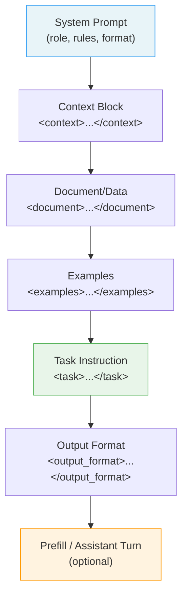
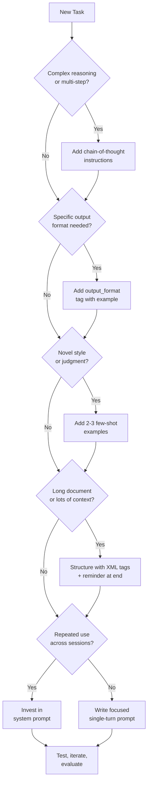
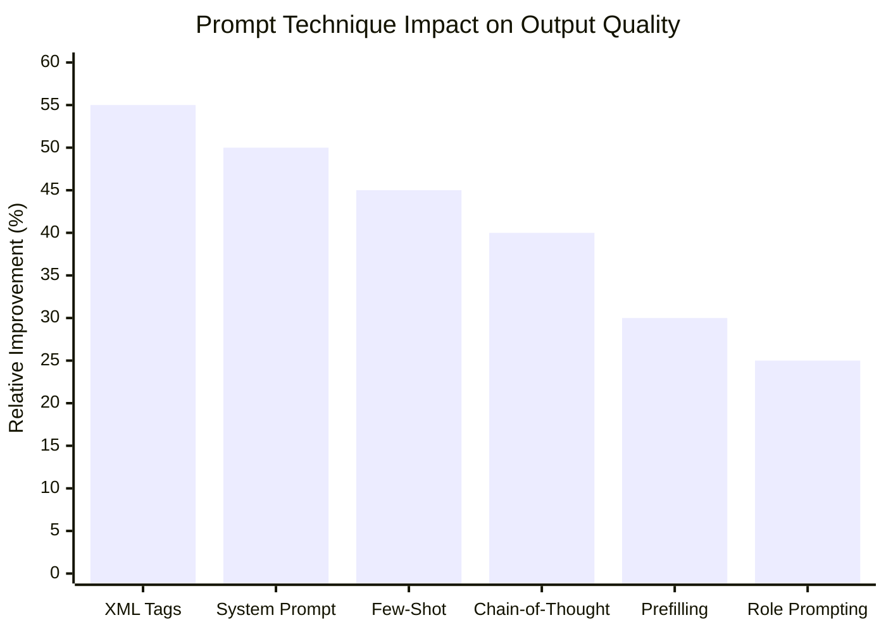

I've spent the last six months running Claude across production workflows — code review pipelines, document analysis, automated drafting, and agentic tasks. In that time I've made every prompting mistake in the book, and I've found a set of techniques that consistently produce better results. This guide captures what actually works, with real examples you can adapt today.

Claude is not just a smarter autocomplete. The way you structure a prompt changes the reasoning path, the output format, and how reliably the model follows your intent. Good claude prompt engineering is learnable, and the payoff is significant: better outputs, fewer retries, and lower token costs.

---

## Why Claude Prompting Is Different

Most prompt engineering guides treat models as interchangeable. They are not. Claude has a distinct training approach — it is trained to be helpful, harmless, and honest using a technique called Constitutional AI. That matters for prompting because Claude responds well to explicit reasoning instructions, is more likely to refuse genuinely harmful requests, and tends to surface uncertainty rather than confabulate confidently.

The practical consequences:

- Claude genuinely benefits from being told *why* a task matters, not just *what* to do.
- Claude's instruction-following is strong but literal. Ambiguous instructions produce ambiguous outputs.
- Claude will push back if a request conflicts with its training. This is a feature, not a bug — but it means prompt framing matters more than with models that comply blindly.
- Claude handles very long context windows (200K tokens as of Claude 3.5 Sonnet) better than most models, but you still need to structure that context thoughtfully.

One more thing: Claude 3.5 Sonnet, Haiku, and Opus are genuinely different models with different cost and capability trade-offs. The prompting principles in this guide apply to all three, but heavier techniques like chain-of-thought and multi-shot examples matter more on Sonnet/Opus and less on Haiku where you're optimizing for speed.

---

## The XML Tags Advantage

This is the single highest-leverage technique I know for claude prompt engineering. Claude is explicitly trained to recognize and respect XML-style tags as structural delimiters. When you wrap content in tags, Claude treats that section differently from surrounding prose — it understands boundaries, roles, and context with much higher reliability.

**Without XML tags (bad):**
```
Here is some customer feedback: customers are unhappy with shipping times. Analyze this and suggest three improvements. Also, the customer's name is Sarah Johnson.
```

Claude has to guess which parts are data vs. instructions vs. context. Outputs are inconsistent.

**With XML tags (good):**
```xml
<task>Analyze customer feedback and suggest three concrete improvements.</task>

<customer_info>
  Name: Sarah Johnson
  Tier: Premium
</customer_info>

<feedback>
  Shipping times are too slow. My last two orders arrived four days late.
  The packaging was also damaged on the second order.
</feedback>
```

Now Claude knows exactly what is instructions, what is reference context, and what is the data to analyze. Outputs become far more consistent, and you can swap out the content inside tags without rewriting the whole prompt.

**Useful tag conventions I rely on:**

| Tag | Purpose |
|---|---|
| `<task>` | The core instruction |
| `<context>` | Background information Claude should know |
| `<examples>` | Few-shot demonstrations |
| `<document>` | Long-form content to analyze |
| `<output_format>` | How you want results structured |
| `<constraints>` | Rules and limits |
| `<thinking>` | Ask Claude to show its reasoning |

You can name tags anything that makes semantic sense. Claude understands the intent from the tag name. What matters is that you are consistent and that the structure is unambiguous.

---

## System Prompts That Work

The system prompt is your highest-leverage configuration. It runs before every user turn and shapes Claude's persona, scope, and behavior throughout the conversation. Most teams underinvest here and wonder why Claude behaves inconsistently across sessions.

A strong system prompt for claude prompt engineering has four components:

**1. Role and context**
Tell Claude who it is and what environment it's operating in. Be specific — "You are an expert" is weaker than "You are a senior backend engineer specializing in Python and PostgreSQL, working on a B2B SaaS product."

**2. Behavioral rules**
State what Claude should always do and what it should never do. These act as guardrails that survive across the whole session.

**3. Output conventions**
Specify formatting expectations once in the system prompt rather than repeating them in every user message.

**4. Uncertainty handling**
Explicitly tell Claude what to do when it doesn't know something. By default it may guess. A good system prompt says: "If you are uncertain, say so explicitly and explain what additional information you would need."

**Example system prompt:**
```
You are a technical documentation editor for a developer tools company. You help engineers write clear, accurate API documentation.

Always:
- Use active voice
- Include a working code example for every endpoint
- Flag any parameters you cannot verify as accurate with [VERIFY]

Never:
- Invent endpoint behavior you haven't been shown
- Use marketing language or superlatives
- Skip the error response section

Format all documentation using the template in <doc_template> tags. If a user provides a spec that contradicts the template, follow the template and note the conflict.

If information is missing from the spec, ask for it rather than guessing.
```

That system prompt will give you consistent, structured output across hundreds of interactions without repeating yourself.

---

## Prompt Structure Anatomy

Here is how I think about the anatomy of a well-structured Claude prompt:



The order matters. Claude reads top to bottom. Put context before task, examples before instructions, and format requirements at the end where they feel like "final instructions before you start." The optional prefill (covered in Advanced Techniques) goes last and commits Claude to a particular starting point.

---

## Chain-of-Thought with Claude

Chain-of-thought (CoT) prompting — asking Claude to reason through a problem before answering — consistently improves accuracy on complex tasks. The improvement is especially pronounced for:

- Multi-step math or logic
- Code debugging
- Legal or policy analysis
- Decisions with trade-offs
- Anything where the first-pass answer is likely wrong

The simplest form is just appending "Think step by step before answering." But you can get more control by structuring the thinking explicitly:

```xml
<task>
  Review this SQL query for performance issues and suggest optimizations.
</task>

<query>
  SELECT * FROM orders o
  JOIN customers c ON o.customer_id = c.id
  WHERE o.status = 'pending'
  ORDER BY o.created_at DESC;
</query>

<thinking_instructions>
  Before giving your answer:
  1. Identify what the query is doing
  2. List every potential performance issue you can see
  3. Consider index usage, full table scans, and cardinality
  4. Rank issues by severity
  Then provide your optimized query and explanation.
</thinking_instructions>
```

On Claude 3.5 Sonnet, I've found that explicit thinking structure like this reduces "hallucinated optimization" significantly — where Claude suggests an index that can't exist or rewrites a query incorrectly.

For tasks where you want Claude's reasoning process but not in the final output, you can ask it to use `<thinking>` tags internally and then produce a clean answer. Extended Thinking (available via API on some Claude models) takes this further by giving the model dedicated token budget for reasoning before it replies.

---

## Few-Shot Examples

Few-shot prompting — providing two to five examples of the input/output pattern you want — is the fastest way to align Claude with a specific style, format, or judgment call that's hard to describe verbally.

I use few-shot examples when:
- The output format is unusual or highly specific
- I need Claude to match a tone or voice
- The task requires domain judgment that's hard to articulate as rules
- I've seen Claude get the format wrong with pure instruction

**Structure your examples clearly:**

```xml
<examples>
  <example>
    <input>Bug report: Login button doesn't work on mobile Safari</input>
    <output>
      **Severity:** P1
      **Component:** Auth / Frontend
      **Likely cause:** Touch event handler or Safari-specific CSS issue
      **Suggested owner:** Frontend team
      **Next step:** Reproduce on BrowserStack with iOS Safari 16+
    </output>
  </example>

  <example>
    <input>Bug report: Chart colors look wrong in dark mode</input>
    <output>
      **Severity:** P3
      **Component:** UI / Charts
      **Likely cause:** Hardcoded hex colors not respecting CSS variables
      **Suggested owner:** Design systems team
      **Next step:** Audit chart color tokens against dark mode palette
    </output>
  </example>
</examples>

<task>Triage the following bug report using the same format.</task>

<input>Bug report: CSV export is missing the "notes" column</input>
```

Two examples is usually enough. More than five is often counterproductive — Claude starts pattern-matching too rigidly and loses generalization. Pick examples that cover different parts of the input space, not just variations of the same case.

---

## Handling Long Documents

One of Claude's genuine advantages is its 200K token context window. But stuffing an entire document into a prompt without structure is leaving performance on the table.

**What I do for long document prompts:**

1. Tell Claude what the document is *before* showing it.
2. State the task *before and after* the document. Repetition at the end of a long context significantly helps.
3. Use a `<document>` tag so Claude treats the content as reference material, not instructions.
4. If the document has sections, add landmark comments inside it: `<!-- Section: Financial Summary -->`.

```xml
<task>
  Extract all commitments made by the vendor in this contract and present them as a numbered list.
  For each commitment, note the section number and whether it has a deadline.
</task>

<document>
<!-- Full vendor contract text here, 50+ pages -->
[CONTRACT TEXT]
</document>

<reminder>
  Remember: only include explicit commitments made by the vendor, not by our company.
  List them in order of importance to us as the customer.
</reminder>
```

The `<reminder>` block at the end re-states the key constraint after Claude has read the long document. This counters the tendency for models to lose focus on early instructions after processing large amounts of text.

---

## Prompting Strategy Flowchart

When I sit down to write a Claude prompt for a new task, here is the decision process I run through:



The key insight: don't reach for complexity first. Start with the simplest prompt that might work, test it, and add structure only where you see the output fail.

---

## Common Mistakes

**1. Over-prompting with contradictory instructions**
If your prompt says "be concise" and also "be comprehensive," Claude will guess which one wins. Pick one, or separate them: "Be concise in the summary section. Be comprehensive in the technical details section."

**2. Burying the task**
I see prompts where the actual instruction is on line 40 after three paragraphs of context. Claude reads everything, but the task instruction should be prominent. Use a `<task>` tag and put it early.

**3. Omitting format instructions and then being surprised**
If you don't specify format, Claude picks one. Sometimes it picks well; often it doesn't match what you need. Invest 30 seconds in an `<output_format>` tag.

**4. No examples for novel patterns**
If you're asking Claude to do something it doesn't encounter often — a custom data schema, a specific code style, a niche document format — skip the examples and you'll spend time on revisions. Two examples save ten correction turns.

**5. Not testing edge cases**
A prompt that works on your one example may fail on messy real-world inputs. Test with short inputs, long inputs, inputs that are off-topic, and inputs with missing fields. Real users will send all of these.

**6. Treating refusals as failures**
Claude occasionally declines or asks clarifying questions. Before retrying with a more forceful instruction, read the refusal. It often contains useful information about what Claude is missing or what it found ambiguous. Address the underlying issue rather than adding pressure.

---

## Advanced Techniques

### Prefilling the Assistant Turn

One of the most underused claude prompting tips is prefilling. When using the Claude API, you can start the assistant's response for it. Claude will continue from wherever you leave off. This is powerful for:

- Locking Claude into a specific format (e.g., starting with `{` forces JSON)
- Skipping preamble and disclaimers
- Enforcing a specific starting phrase

**API example (Python):**
```python
response = client.messages.create(
    model="claude-3-5-sonnet-20241022",
    max_tokens=1024,
    messages=[
        {"role": "user", "content": "Analyze this SQL query for issues: SELECT * FROM users"},
        {"role": "assistant", "content": "```json\n{\"issues\": ["}  # prefill
    ]
)
```

Claude will complete the JSON from where you left off, rather than writing "Sure! Here is my analysis..." first. This reduces token waste and gives you reliable structured output.

### Tool Use Prompts

When using Claude with tool use (function calling), the prompt framing matters as much as the tool definitions. Three rules I follow:

1. **Name tools as verbs**, not nouns. `search_documents` is clearer than `document_search`. Claude calls tools more accurately when the name implies an action.
2. **Write tool descriptions as first-person statements of what the tool does**, not passive descriptions. "Returns a list of matching documents from the knowledge base" beats "Documents are returned from the knowledge base."
3. **Tell Claude when NOT to use a tool**. If Claude should prefer to answer from context before searching, say so explicitly: "Only call `search_documents` if the answer is not available in the provided context."

### Role Prompting for Expertise

Asking Claude to take on a specific expert role reliably shifts the quality and depth of its responses. But vague roles ("You are an expert") underperform specific ones:

| Weaker | Stronger |
|---|---|
| "You are an expert reviewer" | "You are a staff engineer with 10 years of Python experience reviewing a junior developer's first production PR" |
| "You are a helpful assistant" | "You are a technical writer who specializes in API documentation for REST APIs used by enterprise customers" |
| "You are a data analyst" | "You are a business analyst at a Series B SaaS company preparing a churn analysis for the board" |

The specificity gives Claude more signal about tone, depth, audience, and what to include or omit.

---

## Technique Effectiveness Comparison

Based on my production testing across code, document analysis, and structured data tasks:



XML structure and system prompts have the highest leverage because they affect every output, not just edge cases. Chain-of-thought and few-shot examples shine on specific task types. Prefilling and role prompting are situational but high-value when they apply.

---

## Real Examples: Before and After

### Example 1 — Code Review

**Before (weak prompt):**
```
Review this Python code.

def get_user(id):
    user = db.query("SELECT * FROM users WHERE id = " + str(id))
    return user
```

**After (strong prompt):**
```xml
<task>
  Review the following Python function for security vulnerabilities, correctness,
  and style. Provide specific line-by-line feedback, then a revised version.
</task>

<code language="python">
def get_user(id):
    user = db.query("SELECT * FROM users WHERE id = " + str(id))
    return user
</code>

<output_format>
## Issues Found
[Numbered list of issues with severity: Critical / High / Medium / Low]

## Revised Code
[Fixed version with inline comments explaining each change]

## Summary
[2-3 sentence summary of the overall code health]
</output_format>
```

**Result:** The weak prompt produced a paragraph of vague feedback. The strong prompt produced a numbered issue list (correctly flagging SQL injection as Critical), a fixed version using parameterized queries, and a concise summary — all in the first response, no follow-up needed.

---

### Example 2 — Document Summarization

**Before:**
```
Summarize this 30-page market research report.
[pasted document]
```

**After:**
```xml
<task>
  Summarize the attached market research report for a VP of Product.
  Focus on: key market trends, top three competitor threats, and recommended actions.
  Skip methodology details and raw data tables.
</task>

<audience>VP of Product with 10 minutes to read this before a board meeting</audience>

<document>
[pasted document]
</document>

<output_format>
## Key Market Trends (3-5 bullet points)
## Top 3 Competitor Threats (with evidence from the report)
## Recommended Actions (ranked by impact)
## What We Did Not Include (one sentence on what was deprioritized and why)
</output_format>
```

**Result:** The weak prompt produced a 600-word summary that included methodology, data tables, and appendix references — none of which the VP needed. The structured prompt produced exactly what was needed, in under 300 words, correctly filtered to what mattered for the audience.

---

## Verdict

Claude prompt engineering rewards specificity, structure, and explicit reasoning. The gap between a casual prompt and a well-engineered one is not marginal — I regularly see 40-60% improvements in output quality on complex tasks when proper structure is applied.

Start with XML tags and a solid system prompt. Add chain-of-thought for multi-step reasoning. Use few-shot examples when format or judgment matters. Test with real edge cases, not just happy paths. And remember that prefilling and tool use prompts are powerful tools that most developers never touch.

The investment in good prompting pays off every time the prompt runs. On high-volume production workflows, that compounds fast.

---

## FAQ

### Does prompt engineering work differently on Claude Haiku vs. Sonnet vs. Opus?

Yes, meaningfully. Haiku is optimized for speed and cost — it responds well to simple, direct prompts but benefits less from chain-of-thought on complex tasks. Sonnet hits the best balance of quality and cost for most production use cases and handles elaborate prompt structures well. Opus is most capable at open-ended reasoning but costs more per token, so invest in tight prompts there to avoid unnecessary output length.

### Should I use XML tags even for short, simple prompts?

For very short tasks (one-sentence prompts), XML tags add overhead without value. Use them when your prompt has multiple distinct components: context, task, format requirements, examples. A rule of thumb: if your prompt has more than two distinct "sections," tag them.

### How do I know if my prompt is the problem vs. the model's capability?

Run the same task with three different prompt structures and compare outputs. If all three fail in the same way, it may be a model capability ceiling. If they produce different results, the prompt is the variable — keep iterating. Also check: is the model missing information, or is it there and the model ignored it? Missing information is a context problem; ignored information is often a structure problem.

### Can I use these techniques with the Claude API and Claude.ai chat?

XML tags, chain-of-thought, few-shot examples, and role prompting all work in both the API and the Claude.ai chat interface. Prefilling (seeding the assistant turn) is API-only. System prompts are also API-only in their explicit form, though in Claude.ai you can approximate them by leading the conversation with a strong framing message.

### How often should I revisit and update my prompts?

Any time you notice output quality drifting, when you switch Claude model versions, or when your underlying task changes. I also recommend a quarterly review pass on high-usage prompts — user behavior and data distributions shift over time, and prompts written six months ago often have implicit assumptions that no longer hold.
