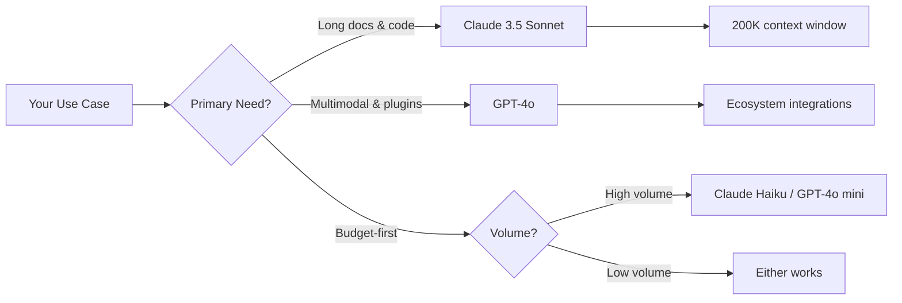
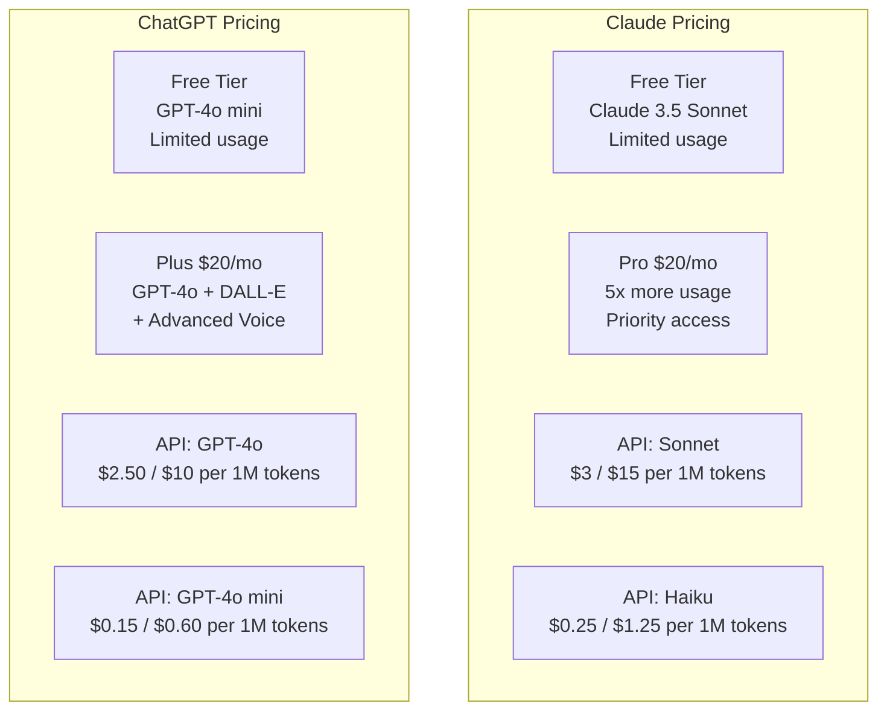

Choosing between Claude and ChatGPT used to feel like splitting hairs. That era is over. The two assistants have diverged sharply in how they handle code, long documents, API design, and reasoning — and picking the wrong one for your stack is a real tax on productivity and budget.

## TL;DR

> **Claude 3.5 Sonnet** wins for: long-document analysis, code refactoring across large codebases, nuanced instruction-following, and teams that need a generous context window without burning through budget fast.
>
> **GPT-4o** wins for: multimodal tasks (image input, voice), deep ecosystem integrations (plugins, DALL-E, Bing search), and teams already committed to the OpenAI toolchain.
>
> **For pure developer use in 2026**: Claude has the edge on context and code quality. ChatGPT has the edge on breadth of integrations. Neither is the obvious winner for every job — this article explains when each one earns its keep.

---

## Quick Comparison

| Feature | Claude 3.5 Sonnet | GPT-4o |
|---|---|---|
| **Context window** | 200,000 tokens | 128,000 tokens |
| **Pro tier price** | $20/month (Claude.ai Pro) | $20/month (ChatGPT Plus) |
| **API input price** | $3.00 / 1M tokens | $5.00 / 1M tokens (standard) |
| **API output price** | $15.00 / 1M tokens | $15.00 / 1M tokens |
| **Image input** | Yes (vision) | Yes (vision + DALL-E generation) |
| **Voice mode** | No | Yes (Advanced Voice) |
| **Code interpreter** | No native sandbox | Yes (Code Interpreter tool) |
| **Web browsing** | No (as of writing) | Yes (Bing-powered) |
| **Instruction following** | Excellent | Good |
| **Best-in-class at** | Long context, code, analysis | Multimodal, integrations |

---

## Code Generation

This is where the choice gets concrete. Both models can write a React component or a Python script from a one-liner. The differences show up at the edges.

```mermaid
xychart-beta
    title "Code Benchmark Scores (Higher = Better)"
    x-axis ["HumanEval", "SWE-bench", "MBPP", "CodeContests"]
    y-axis "Score (%)" 0 --> 100
    bar [92, 49, 91, 43]
    bar [90, 38, 88, 47]
```

### Where Claude 3.5 Sonnet pulls ahead

**Large refactors.** Feed Claude a 3,000-line TypeScript file and ask it to migrate from a class-based pattern to hooks. It tracks variable scope, preserves edge cases in conditionals, and maintains consistent naming across the entire file. GPT-4o tends to drift — renaming things inconsistently or dropping edge-case handling in the second half of a long file.

**Instruction fidelity.** Tell Claude "never use `any` in this TypeScript, always handle the error case explicitly, and prefer `const` over `let`." It will maintain those constraints across a long generation. GPT-4o frequently slips back to defaults after the first few hundred tokens.

**Fewer hallucinated APIs.** Claude is noticeably more cautious about inventing function signatures. When it doesn't know a library's API, it tends to say so or use the most conservative, obviously-correct approach. GPT-4o is more willing to guess — sometimes right, often wrong in subtle ways.

### Where GPT-4o pulls ahead

**Code execution.** GPT-4o's Code Interpreter actually runs the code in a sandboxed Python environment. You can upload a CSV and ask it to run an analysis — it will iterate on errors until it gets a working result. Claude generates code but doesn't execute it, so you're the runtime. For data scientists doing exploratory analysis, this is a meaningful difference.

**Debugging with screenshots.** Drop in a screenshot of a broken UI and ask GPT-4o what's wrong with the CSS. The vision + code combination is genuinely useful. Claude can analyze images too, but the workflow for UI debugging feels less integrated.

**Shorter scripts and one-off utilities.** For quick scripts where context length doesn't matter, GPT-4o is fast and usually correct. The quality difference narrows significantly at small scale.

> **Claude pros for code:**
> - Handles 200K token context without losing coherence
> - Strict instruction following across long generations
> - Less hallucination of library APIs
> - Better at explaining *why* code is structured a certain way
>
> **Claude cons for code:**
> - No code execution environment
> - No web search to look up the latest library docs
> - Slower to get started if you need image → code workflows

> **GPT-4o pros for code:**
> - Code Interpreter: actually runs and iterates
> - Bing search integration for looking up current docs
> - Strong multimodal: screenshot → CSS fix
> - Broad plugin ecosystem
>
> **GPT-4o cons for code:**
> - Shorter context window (128K vs 200K)
> - Higher API cost per token at standard tier
> - Instruction drift on long, constrained generations

---

## Reasoning and Analysis

This is where the philosophical differences between the two products become most visible.

Claude was trained with an emphasis on careful, hedged reasoning. Ask it a hard question and it will often walk through the uncertainty explicitly, flag where it might be wrong, and give you a more useful confidence calibration than a confident-sounding wrong answer. This is irritating if you just want a quick answer; it's invaluable when you're making a decision with real stakes.

GPT-4o reasons well too, but it leans toward confidence. It's more likely to commit to an answer and less likely to surface the "however, if we assume X instead..." type of caveat that Claude produces naturally. For most conversational use, this feels better. For technical analysis, it can mislead.

**Where Claude genuinely excels at reasoning:**

- Multi-step logical problems where it needs to backtrack
- Legal or policy document analysis (long + nuanced)
- Code review where it needs to hold the full diff in mind while commenting on each hunk
- Comparing many options across multiple criteria simultaneously

**Where GPT-4o holds its own or wins:**

- Tasks that benefit from browsing (current events, recent package versions)
- Math with code execution (it can verify the answer by running it)
- Conversational tasks where a confident, direct tone is preferred
- Any task where image analysis is part of the reasoning chain

One practical test: ask both models to find the bug in a 500-line function with a subtle off-by-one error buried deep in a loop. Claude 3.5 Sonnet catches it more consistently and explains the reason with less hand-waving. This is not a contrived benchmark — it's the kind of work developers actually do.

---

## API and Developer Experience

If you're building on these models rather than using the chat interfaces, the developer experience diverges meaningfully.

### Anthropic's Claude API

Anthropic's Python and TypeScript SDKs are clean and well-typed. The message structure is straightforward: a `system` prompt, then a list of `messages`. Tool use (function calling) works with a similar schema to OpenAI's, so migration isn't a full rewrite.

**Prompt caching** is a standout feature. If you have a large system prompt or a long document that you're referencing across many requests, you can cache that context at a reduced token rate. Cache hits cost $0.30/1M tokens on Claude 3.5 Sonnet vs $3.00/1M for uncached input — a 10x reduction for high-volume apps with repeated context.

Rate limits at the default tier are reasonable for development but can bite at production scale. Anthropic's tier progression (from default to higher tiers) requires a spend history, so plan ahead if you expect spikes.

**Streaming** works well. Tool use with streaming is supported and stable. The API error messages are generally helpful and specific — a small thing that saves a lot of time in debugging.

### OpenAI's API

The OpenAI API is more mature as an ecosystem. More third-party libraries, more Stack Overflow answers, more example repos on GitHub. The Assistants API adds persistent threads, file storage, and built-in tools (Code Interpreter, file search) that Anthropic doesn't offer natively.

For teams building stateful agents or applications that benefit from managed storage, OpenAI's infrastructure reduces the amount of plumbing you write. Claude leaves more of that to you — which is more flexible but more work.

OpenAI also has fine-tuning available on several models. Anthropic does not offer fine-tuning on Claude as a standard product offering. If fine-tuning on proprietary data is a hard requirement, GPT-4o or GPT-4o mini are the practical options.

**API pricing at a glance:**
- Claude 3.5 Sonnet: $3 input / $15 output per 1M tokens
- GPT-4o: $5 input / $15 output per 1M tokens (standard; prices may vary with batching)
- Claude Haiku 3.5: $0.80 input / $4 output (cheapest capable fast model)
- GPT-4o mini: $0.15 input / $0.60 output (very cheap, lower quality ceiling)

The comparison is complicated by the fact that GPT-4o mini is significantly cheaper than any Claude model at the low end, making it attractive for classification or summarization tasks where quality requirements are modest.

---

## Context Window and Long Documents

The 200K vs 128K token gap is the most concrete, measurable difference between these two products, and it matters more than people expect.

200,000 tokens is roughly 150,000 words — about 500 pages of text. You can load an entire codebase, a full legal agreement stack, a year's worth of meeting notes, or an API specification with examples and still have room for a long conversation about it.

128,000 tokens is not small. You can fit a large novel or a major open-source repository. But in practice, developers regularly hit this limit when trying to paste an entire codebase into context, analyze very long log files, or compare multiple long documents simultaneously.

The quality of what happens *near the context limit* also differs. Claude was specifically trained to attend to information spread across long contexts rather than focusing primarily on the beginning and end. OpenAI has improved this substantially, but Claude still has an advantage when the relevant signal is buried in the middle of a 100K-token document.

**Practical examples where 200K matters:**

- Loading an entire Next.js project to ask "what's the pattern for error handling in this codebase?"
- Analyzing a year of customer support tickets to find the most common pain points
- Reviewing a complete security audit report and asking which findings affect your specific stack
- Comparing two long API specifications side by side

For most chat-style use, you'll never notice the difference. For document-heavy developer workflows, Claude's context advantage is real.

---

## Pricing Breakdown

| Tier | Claude | ChatGPT |
|---|---|---|
| **Free** | Claude.ai free (limited, Sonnet access) | ChatGPT free (limited GPT-4o) |
| **Pro / Plus** | $20/month (Claude.ai Pro) | $20/month (ChatGPT Plus) |
| **Team** | $25/user/month | $25-30/user/month |
| **Enterprise** | Custom pricing | Custom pricing |
| **API (fast model)** | Haiku 3.5: $0.80/$4 per 1M | GPT-4o mini: $0.15/$0.60 per 1M |
| **API (flagship)** | Sonnet 3.5: $3/$15 per 1M | GPT-4o: $5/$15 per 1M |
| **API (premium)** | Opus 3: $15/$75 per 1M | GPT-4o (batch): lower rates |

At the Pro tier, the products are identically priced at $20/month — the decision comes down to features, not cost. At the API level, Claude Sonnet is cheaper on input tokens ($3 vs $5 per 1M), which adds up significantly at production scale. However, GPT-4o mini is dramatically cheaper than any Claude model for high-volume, lower-stakes tasks.

A realistic cost example: if your app makes 10 million API calls per month with ~500 token inputs and ~200 token outputs, you're looking at roughly:
- Claude 3.5 Sonnet: ~$18/month input + ~$30/month output = **~$48/month**
- GPT-4o: ~$30/month input + ~$30/month output = **~$60/month**
- GPT-4o mini: ~$0.90/month input + ~$1.20/month output = **~$2.10/month**

That last number is not a typo. For bulk summarization or classification tasks, GPT-4o mini's price is in a different category from the flagship models.

---

## Who Should Pick Which?

**Choose Claude 3.5 Sonnet if you are:**

- Building a code review or documentation tool that needs to process entire files or repositories
- Doing research or analysis on long documents (legal, financial, technical)
- Building an application where instruction-following precision matters (the model must follow system prompt rules consistently)
- An individual developer who wants the best chat-based coding assistant without code execution
- Concerned about API costs at scale (cheaper input token pricing)

**Choose GPT-4o if you are:**

- Building a product that needs real-time web search as a feature
- Doing data analysis workflows where code execution and iteration matter
- Working heavily with images, audio, or voice (GPT-4o's multimodal breadth is unmatched)
- Using OpenAI's Assistants API for managed state, file storage, or thread management
- Building on an established OpenAI-dependent tech stack and don't want to manage two API integrations

**Choose GPT-4o mini if you are:**

- Running high-volume classification, routing, or summarization at scale
- Doing any task where cost is the primary constraint and a capable-but-not-brilliant model is sufficient
- Prototyping quickly before deciding on a flagship model

**Choose Claude Haiku 3.5 if you are:**

- Similar to GPT-4o mini use cases, but prefer staying in the Anthropic ecosystem
- Need a fast, cheap model that still follows complex system prompts reliably

---

## Our Verdict

For developers, **Claude 3.5 Sonnet is the better default choice in 2026** — but it's not a clean sweep.

The context window advantage is genuine and frequently relevant. The instruction-following quality means you can trust your system prompt to actually shape model behavior. The API pricing is slightly better at the flagship tier. And for the core developer workflow of reading code, understanding it, and improving it, Claude is measurably ahead.

Where GPT-4o wins, it wins decisively. Code Interpreter is a genuine superpower for data work. The browsing capability removes a whole class of "model doesn't know about package X released last month" frustrations. The voice and image generation integrations make it the obvious choice for consumer-facing products with those features.

The honest answer for most developer teams: run a trial with both on your actual workload. Take three real tasks from your backlog, run each through both models via the API, and score the results yourself. The benchmarks are useful, but your specific domain, your prompt style, and your quality bar are what matter. The cost of a two-week trial is trivial compared to the cost of building on the wrong foundation.

If you're starting from scratch and can't run a trial: use Claude for anything involving long documents or complex codebases, and use GPT-4o for anything involving images, voice, or current web data. That split is a reasonable starting point that you can refine as you learn where each model earns its keep in your specific workflow.

---

## Frequently Asked Questions

### Can Claude and ChatGPT access the internet?

As of early 2026, GPT-4o has Bing-powered web search available in both the chat interface and via the API. Claude does not have built-in web search — it works from its training data plus whatever context you provide in the prompt.

### Which model is better at following complex system prompts?

Claude 3.5 Sonnet has a clear edge here. It maintains constraints across long generations more reliably than GPT-4o, which tends to drift back toward default behavior after a few hundred tokens. If your application depends on the model adhering strictly to rules (format, tone, refusal criteria), Claude is the safer choice.

### Is Claude's 200K context window actually usable, or does quality drop?

Quality does degrade somewhat at the extreme end of any context window, but Claude handles long contexts better than most models its size. Information buried in the middle of a 150K-token document is more reliably surfaced by Claude than by GPT-4o at 128K. For practical developer tasks, you're unlikely to hit meaningful quality issues below 100K tokens in either model.

### Which API is easier to integrate?

Both APIs have solid SDKs and documentation. The OpenAI ecosystem has more third-party tooling, tutorials, and community resources — a real advantage for getting started quickly. Anthropic's API is clean and well-designed, and teams familiar with OpenAI's structure will find the migration straightforward. The Anthropic Assistants-equivalent features are less developed, so if you need managed state or file storage, OpenAI's Assistants API has a head start.

### Does Claude support fine-tuning?

Not as a standard offering. Anthropic offers fine-tuning through enterprise agreements, but it's not available as a self-serve product the way OpenAI's fine-tuning API is. If fine-tuning is a hard requirement for your use case, GPT-4o or GPT-4o mini are the practical options.
