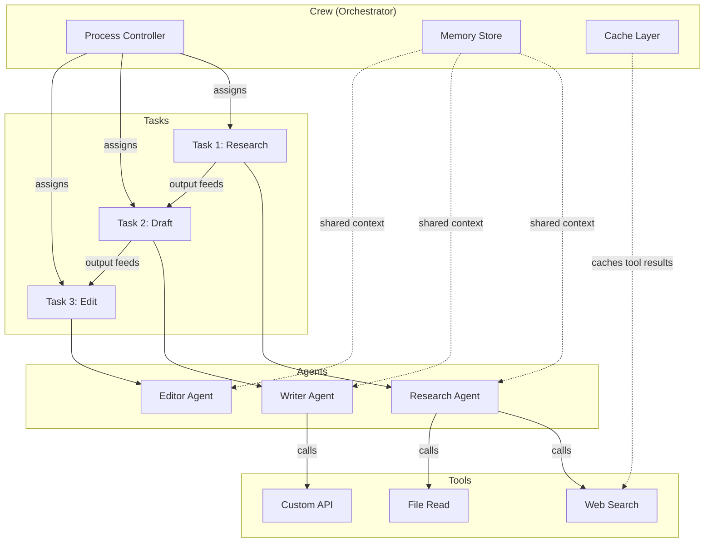
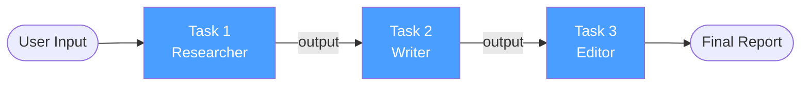
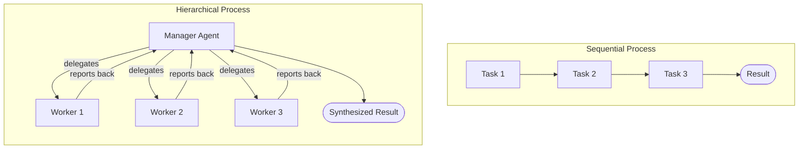
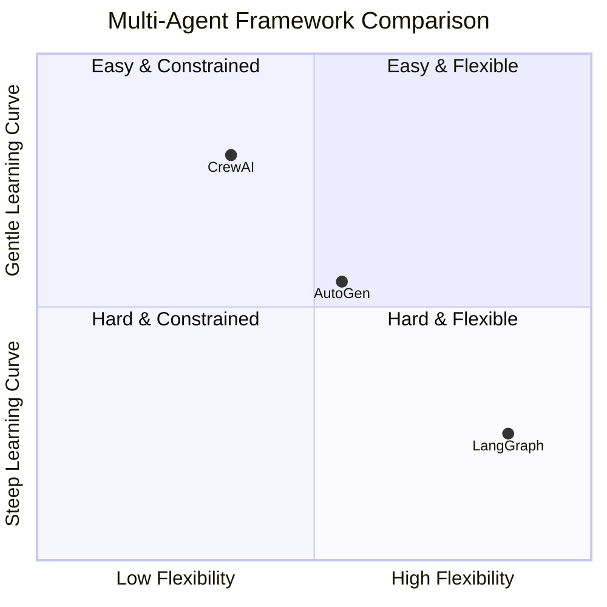

I've built multi-agent systems in LangGraph, AutoGen, and plain Python. CrewAI is the only framework where I got a working, useful prototype in under an hour on my first try. That's not an accident — it's a deliberate design choice. CrewAI trades low-level flexibility for high-level readability, and for most teams starting with multi-agent workflows, that tradeoff is exactly right.

This is a practical CrewAI tutorial. I'll walk through the core concepts, build a real research crew end-to-end, explain the execution patterns, compare CrewAI against LangGraph and AutoGen, and give an honest verdict on where it belongs in your stack.

---

## What Is CrewAI?

CrewAI is an open-source Python framework for orchestrating multiple AI agents that collaborate to complete complex tasks. It was created by João Moura and released in late 2023. The core idea is simple: instead of prompting a single LLM to do everything, you define a team of specialized agents — each with a role, a goal, and a set of tools — and then assign tasks across that team.

The framework handles the coordination: which agent runs next, what output gets passed to whom, how memory is shared, and when the crew is done. You write high-level declarations; CrewAI handles the plumbing.

Under the hood, CrewAI uses LangChain for tool integration and supports any LLM that LangChain supports — OpenAI, Anthropic, Ollama, Groq, and more. As of version 0.80+, it also ships its own lighter-weight tool interface that doesn't require LangChain at all.

---

## Key Concepts

Before writing code, you need four vocabulary words. Everything else builds on these.

### Agents

An **agent** is a role definition. It tells the LLM who it is, what it cares about, and how it should behave. An agent has:

- `role` — job title (e.g., "Senior Research Analyst")
- `goal` — what it's optimizing for
- `backstory` — personality and context that shape its reasoning
- `tools` — the functions it can call
- `llm` — which model powers it (defaults to the crew-level LLM)

The backstory is not decoration. It dramatically affects output quality. A researcher agent with a backstory that emphasizes skepticism and source verification produces notably different research than one described as "helpful and thorough."

### Tasks

A **task** is a unit of work assigned to an agent. It has:

- `description` — what needs to be done, in plain English
- `expected_output` — what a good result looks like
- `agent` — which agent is responsible
- `context` — optional list of other tasks whose output this task can read

Tasks are the building blocks of your pipeline. They're declarative — you describe the outcome, not the steps.

### Crews

A **crew** is the team itself. It binds agents and tasks together and controls execution. The crew defines:

- Which agents and tasks belong to it
- The process (sequential or hierarchical)
- Whether verbose logging is on
- The shared memory configuration

### Tools

**Tools** are Python functions that agents can call during execution — web search, file reading, API calls, code execution. CrewAI has built-in tools (SerperDevTool, WebsiteSearchTool, FileReadTool, etc.) and supports custom tools via a simple decorator pattern.

### Processes

A **process** controls the execution order. CrewAI supports two:

- `Process.sequential` — tasks run in order, each passing output to the next
- `Process.hierarchical` — a manager agent breaks down the goal, delegates to worker agents, and synthesizes results

---

## CrewAI Architecture

Here's how the pieces connect at runtime:



The Process Controller sequences task execution. Each agent receives its task description, its tools, and the output of any upstream tasks listed in `context`. The Memory Store (when enabled) persists facts across agent turns. The Cache Layer prevents redundant tool calls — if two agents would both search the same URL, only one HTTP request goes out.

---

## Building a Research Crew: Full Code Example

Let me build something useful: a crew that researches a technology topic, writes a summary report, and edits it for clarity. This is one of the most common real-world CrewAI patterns.

### Install

```bash
pip install crewai crewai-tools
```

Set your environment variables:

```bash
export OPENAI_API_KEY="sk-..."
# Optional: Serper for web search
export SERPER_API_KEY="..."
```

### Define the Crew

```python
from crewai import Agent, Task, Crew, Process
from crewai_tools import SerperDevTool, WebsiteSearchTool

# Tools
search_tool = SerperDevTool()
web_reader = WebsiteSearchTool()

# ── Agents ─────────────────────────────────────────────────────────────────

researcher = Agent(
    role="Senior Technology Researcher",
    goal=(
        "Find accurate, up-to-date information about the given topic. "
        "Prioritize primary sources — official docs, research papers, and "
        "authoritative news outlets. Flag anything you cannot verify."
    ),
    backstory=(
        "You are a skeptical researcher with 10 years of experience covering "
        "AI and software infrastructure. You distrust hype and always look for "
        "concrete benchmarks, pricing data, and real-world adoption signals."
    ),
    tools=[search_tool, web_reader],
    verbose=True,
    max_iter=5,        # max LLM iterations per task
    memory=True,
)

writer = Agent(
    role="Technical Writer",
    goal=(
        "Transform research notes into a clear, structured markdown report "
        "that a senior engineer would find useful. Include a TL;DR, key "
        "findings, and a recommendations section."
    ),
    backstory=(
        "You've written for engineering blogs and internal wikis for a decade. "
        "You write short sentences, prefer active voice, and never pad word "
        "count. You cite sources inline."
    ),
    tools=[],
    verbose=True,
    memory=True,
)

editor = Agent(
    role="Senior Editor",
    goal=(
        "Review the draft for factual accuracy, clarity, and structure. "
        "Cut anything redundant. Ensure the report could stand alone without "
        "the original research notes."
    ),
    backstory=(
        "You are a detail-oriented editor who has reviewed hundreds of "
        "technical documents. You check for unsupported claims, inconsistent "
        "terminology, and logical gaps."
    ),
    tools=[],
    verbose=False,
    memory=True,
)

# ── Tasks ──────────────────────────────────────────────────────────────────

research_task = Task(
    description=(
        "Research the current state of {topic}. Cover: what it is, "
        "who the main vendors/projects are, realistic use cases, known "
        "limitations, and pricing if applicable. Produce a structured "
        "set of notes with source URLs."
    ),
    expected_output=(
        "Markdown notes with sections: Overview, Key Players, Use Cases, "
        "Limitations, Pricing, and Sources. Minimum 500 words."
    ),
    agent=researcher,
)

writing_task = Task(
    description=(
        "Using the research notes, write a polished markdown report about "
        "{topic}. Audience: senior engineers evaluating adoption. "
        "Include a TL;DR at the top and a Recommendations section at the end."
    ),
    expected_output=(
        "A complete markdown report, 600-900 words, with TL;DR, sections "
        "matching the research notes, inline citations, and Recommendations."
    ),
    agent=writer,
    context=[research_task],   # writer sees researcher's output
)

editing_task = Task(
    description=(
        "Edit the draft report for {topic}. Fix any factual inconsistencies, "
        "remove padding, improve sentence clarity, and ensure the report "
        "is self-contained. Return the final polished version."
    ),
    expected_output=(
        "The final, edited markdown report. Track changes are not needed — "
        "just return the clean final version."
    ),
    agent=editor,
    context=[writing_task],    # editor sees the draft
)

# ── Crew ───────────────────────────────────────────────────────────────────

research_crew = Crew(
    agents=[researcher, writer, editor],
    tasks=[research_task, writing_task, editing_task],
    process=Process.sequential,
    verbose=True,
    memory=True,
    cache=True,
    max_rpm=20,   # rate-limit API calls
)

# ── Run ────────────────────────────────────────────────────────────────────

result = research_crew.kickoff(inputs={"topic": "vector databases in 2026"})
print(result.raw)
```

A few things worth noting in this code:

- `context=[research_task]` is how you wire output between tasks. Without this, the writer starts from scratch.
- `max_iter=5` prevents runaway loops. The default is 15, which is often too generous for simple tasks.
- `max_rpm=20` is essential if you're on a paid API with rate limits. I've hit rate-limit errors in production by forgetting this.
- `memory=True` at the crew level enables a shared vector store (backed by ChromaDB by default) that all agents can read and write.

---

## Crew Execution Patterns

### Sequential Process

Sequential is the default and the right choice for linear pipelines — research → write → edit, data extraction → transform → validate, scrape → summarize → post.

Each task runs in order. The output of task N is available to task N+1 if you set `context`. The final task's output is the crew's result.



### Hierarchical Process

Hierarchical introduces a **manager agent** that CrewAI creates automatically. You don't define it — you just switch the process and provide a `manager_llm`. The manager decomposes the goal, decides which worker agents to invoke and in what order, and synthesizes the final answer.

```python
from crewai import Process
from langchain_openai import ChatOpenAI

crew = Crew(
    agents=[researcher, writer, editor],
    tasks=[research_task, writing_task, editing_task],
    process=Process.hierarchical,
    manager_llm=ChatOpenAI(model="gpt-4o"),
    verbose=True,
)
```

Hierarchical is better when the subtask breakdown isn't obvious upfront — think "plan and execute a market analysis" where the manager decides which angles are worth investigating. The downside: it costs more tokens (the manager sees all agent outputs) and is harder to debug when something goes wrong.

Use sequential when you know the exact steps. Use hierarchical when the problem requires dynamic planning.

---

## Sequential vs Hierarchical Workflow



---

## Memory and Caching

### Memory

CrewAI has four memory types:

| Type | What It Stores | Scope |
|---|---|---|
| **Short-term** | Recent task outputs and observations | Current crew run |
| **Long-term** | Facts extracted from prior runs | Persisted across runs (SQLite) |
| **Entity** | Named entities (people, companies, concepts) | Current + across runs |
| **Contextual** | Automatically injected relevant memories | Assembled at task start |

Enable all with `memory=True`. For fine-grained control:

```python
from crewai.memory import LongTermMemory, ShortTermMemory, EntityMemory

crew = Crew(
    ...
    memory=True,
    long_term_memory=LongTermMemory(),
    short_term_memory=ShortTermMemory(),
    entity_memory=EntityMemory(),
)
```

Long-term memory is the most powerful and the most dangerous. If early runs contain errors, those errors get stored and can pollute future runs. Periodically wiping the memory store during development is good hygiene.

### Caching

`cache=True` on the Crew caches tool call results. If the researcher calls `SerperDevTool` with the same query twice in one run, the second call returns the cached result instantly. This saves both money and time on longer research tasks.

You can disable caching per-tool if freshness matters:

```python
search_tool = SerperDevTool(cache_results=False)
```

---

## CrewAI vs LangGraph vs AutoGen

These three frameworks overlap in purpose — multi-agent coordination — but differ sharply in philosophy.



| Dimension | CrewAI | LangGraph | AutoGen |
|---|---|---|---|
| **Mental model** | Role-based team | Directed graph | Conversational agents |
| **Learning curve** | Low | High | Medium |
| **Flexibility** | Medium | High | Medium-High |
| **Debugging** | Moderate (verbose logs) | Excellent (LangSmith) | Moderate |
| **State management** | Memory store | Full graph state | Conversation history |
| **Human-in-the-loop** | Supported, not central | First-class feature | First-class feature |
| **Best for** | Role-based pipelines | Complex stateful workflows | Conversational multi-agent |
| **Python version** | 3.10+ | 3.9+ | 3.10+ |
| **Backing** | CrewAI Inc. | LangChain team | Microsoft Research |

**Choose CrewAI when** you need a working multi-agent pipeline quickly, the workflow is well-defined (research → write → review), and your team doesn't need to reason about graph state directly.

**Choose LangGraph when** your workflow has branches, loops, conditional routing, or you need production-grade observability via LangSmith. LangGraph's state machine model is significantly more expressive — and significantly harder to learn.

**Choose AutoGen when** your use case is inherently conversational (agents debating, checking each other's work through dialogue) or you want tight Microsoft ecosystem integration.

I've used all three on real projects. CrewAI is the fastest to production for standard pipelines. LangGraph is the right choice for workflows that would need custom control flow in CrewAI. AutoGen is the weakest of the three for production reliability, though its research pedigree is strong.

---

## Pricing

CrewAI itself is **free and open-source** (MIT license). You pay only for the LLMs your agents call.

**CrewAI Enterprise** (announced 2024, pricing by request) adds:
- A visual Crew builder UI
- Hosted execution with autoscaling
- Team collaboration and versioning
- Enhanced observability dashboard
- Dedicated support and SLA

For self-hosted deployments, the main cost is LLM tokens. A typical research crew run (3 agents, 3 tasks, 5 tool calls) with GPT-4o will consume roughly 15,000–30,000 tokens total — about $0.15–$0.45 per run at current pricing. With Claude 3.5 Sonnet as the backbone, expect similar output quality at lower cost per token.

Budget tip: use a strong model (GPT-4o, Claude 3.5 Sonnet) for the manager/planner in hierarchical crews and a cheaper model (GPT-4o mini, Claude Haiku) for worker agents that do repetitive extraction or formatting tasks.

---

## Limitations

CrewAI is not the right tool for every problem. After building with it seriously, here are the genuine friction points:

**State is implicit.** In a sequential crew, task output flows through a chain of string passes. There's no typed state schema — unlike LangGraph where you define an explicit `TypedDict`. This makes debugging harder as crews grow past four or five tasks.

**Hierarchical process can be unpredictable.** The manager agent's task delegation decisions are LLM-generated, which means they can vary between runs on identical inputs. For deterministic pipelines, this is a problem.

**Tool errors are noisy.** When a tool call fails mid-task, the agent often retries in ways that are hard to predict and expensive in tokens. Robust error handling requires writing custom tool wrappers.

**Memory can drift.** Long-term memory works best when you curate it. In practice, agents store redundant or contradictory facts across runs, and the retrieval mechanism doesn't always surface the most relevant entry.

**Observability is basic without third-party integration.** The built-in verbose logs are useful for development but not production monitoring. You'll need LangSmith, Arize Phoenix, or a custom callback to get real telemetry.

---

## Verdict

CrewAI earns its popularity. The role-based mental model is intuitive, the documentation is good, and the time from `pip install` to a working multi-agent system is genuinely short.

For teams starting with multi-agent AI workflows, CrewAI is the right entry point. It handles the 80% case — structured pipelines where specialized agents collaborate toward a defined goal — without requiring a PhD in graph theory.

For advanced use cases — complex conditional branching, tight human-in-the-loop requirements, or production observability at scale — I'd look at LangGraph. The learning curve is steeper, but the expressiveness pays off.

The best path I've seen in practice: start with CrewAI to validate that multi-agent orchestration solves your problem, then migrate the most complex workflows to LangGraph once you understand your state management needs. The conceptual overlap is large enough that the migration is not as painful as it sounds.

---

## FAQ

### Do I need OpenAI to use CrewAI?

No. CrewAI supports any LangChain-compatible LLM provider — Anthropic, Groq, Ollama (for local models), Mistral, and others. Set the `llm` parameter on your agents:

```python
from langchain_anthropic import ChatAnthropic

agent = Agent(
    role="Researcher",
    goal="...",
    backstory="...",
    llm=ChatAnthropic(model="claude-3-5-sonnet-20241022"),
)
```

### How many agents should a crew have?

Start with two or three. More agents mean more LLM calls, more token cost, and more places for the pipeline to fail. I've seen reliable production crews with two agents handle tasks that beginners try to split across five or six. Add agents when you have a concrete reason — usually when a single agent's context window is overwhelmed or when the role separation genuinely improves output quality.

### Can CrewAI agents run in parallel?

Sequential process is serial by design. Hierarchical process can invoke multiple workers in sequence within a single manager-directed run, but CrewAI doesn't natively parallelize workers across threads. For true parallelism, you'd need to kick off multiple sub-crews concurrently using Python's `asyncio` or `concurrent.futures`. The team has flagged parallel execution as a roadmap item.

### How do I handle sensitive data?

CrewAI agents pass data as strings through the LLM. If your tasks involve PII or proprietary information, that data will appear in LLM API requests. Use local models (Ollama) or enterprise API agreements with no-training guarantees. Also audit which tools agents can call — a poorly scoped web search tool can leak data in its queries.

### What's the difference between `kickoff` and `kickoff_for_each`?

`kickoff(inputs={...})` runs the crew once with a single input dict. `kickoff_for_each(inputs=[{...}, {...}])` runs the crew once per input — useful for batch processing a list of topics, documents, or records. Each run is independent; memory is not shared across `kickoff_for_each` iterations by default.
