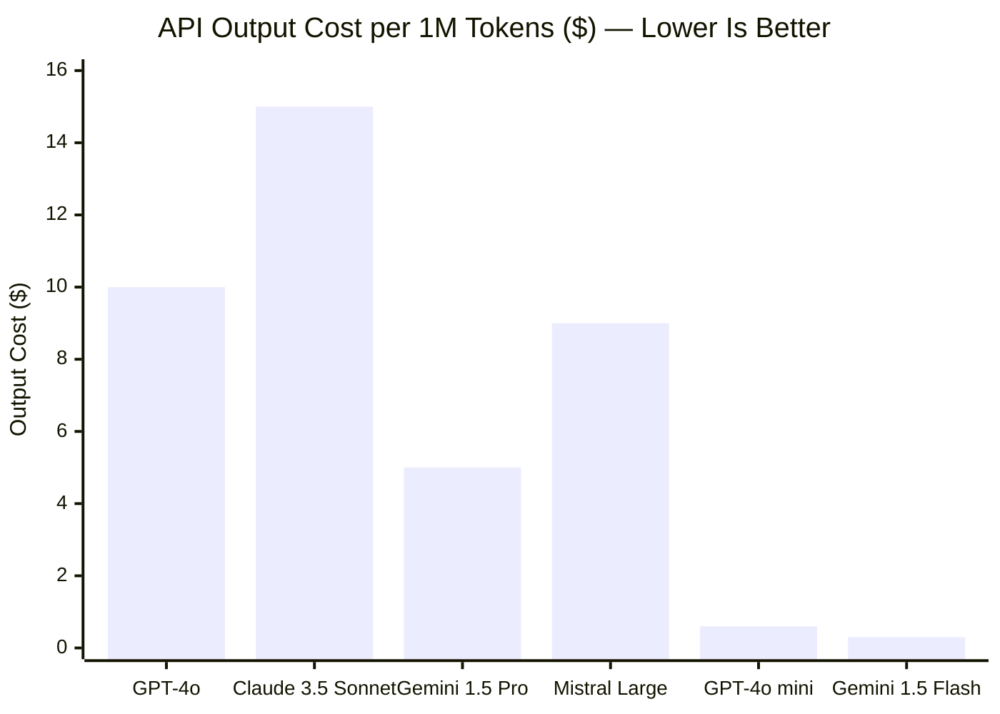
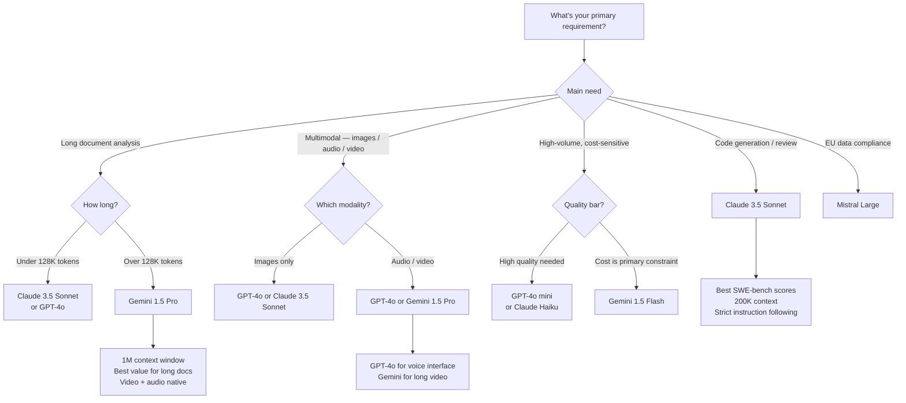

Eighteen months ago, "which LLM should I use?" had an obvious answer: GPT-4. Today that question is genuinely hard. Google's Gemini 1.5 Pro swallowed a one-million-token context window. Anthropic's Claude 3.5 Sonnet quietly overtook GPT-4o on coding benchmarks. Mistral Large arrived as a serious European alternative with no-nonsense API pricing. And OpenAI responded with GPT-4o's multimodal capabilities while holding its ecosystem lead.

The result is a market where the right answer depends entirely on what you're building. A document-processing pipeline, a coding assistant, a customer-facing chat interface, and a bulk classification job all have different optimal models — and the cost differences between wrong and right choices can be 10x or more.

I've spent the last several weeks running real workloads through all four models. Here's what I found.

> **TL;DR — Quick Picks by Use Case:**
>
> - **Best overall for coding:** Claude 3.5 Sonnet — best SWE-bench scores, best instruction fidelity
> - **Best for long documents:** Gemini 1.5 Pro — 1M token context window at a fraction of the price
> - **Best multimodal:** GPT-4o — unmatched breadth of image, audio, and video understanding
> - **Best budget API:** Gemini 1.5 Flash ($0.075/1M input) or GPT-4o mini ($0.15/1M input)
> - **Best self-hostable:** Mistral Large (via API) or Llama 3 70B (open weights)
> - **Best for European data compliance:** Mistral Large — EU-headquartered, GDPR-native

---

## The Contenders

Before diving into head-to-head comparisons, here's who we're actually evaluating and why each one made the cut.

**GPT-4o** is OpenAI's flagship general-purpose model. "o" stands for omni — it handles text, images, audio, and video in a single architecture. Released in May 2024, it remains the most ecosystem-connected model on this list, with the widest third-party integrations, the most community documentation, and access to OpenAI's Code Interpreter and web search tools. Context window: 128K tokens.

**Claude 3.5 Sonnet** is Anthropic's workhorse model. Released in June 2024, it shocked the industry by posting the highest SWE-bench scores among frontier models — a real-world coding benchmark where models attempt to fix actual GitHub issues. Anthropic's focus on "Constitutional AI" training shows in how the model handles ambiguous or sensitive instructions: it tends to ask rather than guess, and it maintains system prompt constraints across long generations unusually well. Context window: 200K tokens.

**Gemini 1.5 Pro** is Google DeepMind's mid-range model and the context-window champion of this comparison. At up to 2 million tokens (1M in the standard API tier), it can process entire codebases, years of transcripts, or full-length feature films — things no other API model comes close to handling. Google's multimodal training pipeline (native video and audio understanding, not just image) sets it apart from models that bolt on vision as an afterthought. Context window: 1M tokens (standard), 2M (paid tier).

**Mistral Large** is the flagship from Paris-based Mistral AI. It punches above its price point, posts competitive benchmark scores, and comes with a distinct developer-friendly positioning: straightforward pricing, no safety theater, and a European data residency option that matters for GDPR-constrained teams. Context window: 128K tokens.

---

## Quick Comparison

| | GPT-4o | Claude 3.5 Sonnet | Gemini 1.5 Pro | Mistral Large |
|---|---|---|---|---|
| **Context window** | 128K | 200K | 1M (2M paid) | 128K |
| **API input price** | $2.50/1M | $3.00/1M | $1.25/1M | $3.00/1M |
| **API output price** | $10.00/1M | $15.00/1M | $5.00/1M | $9.00/1M |
| **Vision** | Yes | Yes | Yes (video too) | No |
| **Audio input** | Yes (native) | No | Yes (native) | No |
| **Web search** | Yes (API tool) | No | Yes (Grounding) | No |
| **Code execution** | Yes (sandbox) | No | Yes (code exec) | No |
| **Open weights** | No | No | No | Partial (Mistral 7B) |
| **Top strength** | Ecosystem breadth | Code quality | Context length | Price/performance |
| **Key weakness** | Instruction drift | No web search | Verbose reasoning | Smaller ecosystem |

---

## Benchmark Performance

Benchmarks are imperfect, but they're the closest thing we have to an objective comparison. Here are the scores that matter most for real workloads.

```mermaid
xychart-beta
    title "LLM Benchmark Scores — Higher Is Better"
    x-axis ["MMLU (%)", "HumanEval (%)", "MATH (%)", "GPQA (%)"]
    y-axis "Score" 0 --> 100
    bar [88.7, 90.2, 71.1, 59.4]
    bar [88.3, 92.0, 71.1, 65.0]
    bar [86.5, 71.9, 67.7, 46.2]
    bar [81.2, 45.0, 45.0, 38.1]
```

*Bars left to right: GPT-4o, Claude 3.5 Sonnet, Gemini 1.5 Pro, Mistral Large. Sources: MMLU from respective technical reports; HumanEval and MATH from independent evaluations; GPQA from published leaderboards.*

A few things stand out. Claude 3.5 Sonnet edges GPT-4o on HumanEval (92.0 vs 90.2) and GPQA — the graduate-level science questions benchmark. Gemini 1.5 Pro is competitive on MMLU but falls back on HumanEval, which is consistent with the qualitative experience that it's better at broad knowledge than tight code generation. Mistral Large is a solid performer but clearly a tier behind the frontier models on pure benchmark scores.

One benchmark I want to call out specifically: **SWE-bench Verified**, which tests models on real GitHub issues from popular Python repositories. This is harder to game than HumanEval because it involves understanding a codebase, identifying a root cause, and producing a patch that passes existing tests. Claude 3.5 Sonnet was the first model to exceed 50% on this benchmark. GPT-4o scores in the 38–42% range. Gemini 1.5 Pro has not published a comparable SWE-bench result. For teams building developer tooling, this gap is significant.

---

## Coding Performance

Code generation is where this comparison gets concrete fast. I ran the same set of tasks through all four models: a TypeScript refactor, a Python async data pipeline, a SQL query optimization problem, and a debugging task with a subtle logic error buried in ~300 lines.

**Claude 3.5 Sonnet** is the clear winner here. It maintained variable naming conventions across a 2,000-line refactor, caught the logic bug without any hints, and produced idiomatic async Python that handled edge cases the prompt didn't explicitly mention. When I asked it to explain its reasoning on the SQL optimization, the answer was concise and correct — not hand-wavy.

**GPT-4o** is excellent on smaller tasks. For the TypeScript refactor and quick Python scripts, the quality difference from Claude was marginal. Where it fell behind was on the long refactor: around the 400-line mark, it started drifting from the style constraints I'd specified (preferring `var` over `const`, dropping explicit return type annotations). The Code Interpreter sandbox is a genuine advantage for iterative debugging — it ran the code, caught a runtime error I hadn't noticed, and fixed it without prompting.

**Gemini 1.5 Pro** surprised me on the SQL optimization — it reasoned carefully about index selection and produced a well-commented query. But on TypeScript it was noticeably weaker, producing more verbose code with questionable patterns that would raise flags in a code review. It also tends toward longer explanations that bury the actual answer, which gets annoying fast.

**Mistral Large** performed respectably on the Python tasks but struggled with the TypeScript refactor and produced an incorrect fix for the logic bug (it identified the right function but the wrong root cause). For teams using it for backend Python or API development, it's competitive with GPT-4o at a lower price. For anything involving complex reasoning or unfamiliar frameworks, it lags.

---

## Reasoning and Analysis

This is where model differences become philosophical as well as empirical.

**Claude's reasoning style** is calibrated and explicit. Ask it a hard analytical question and it will walk through assumptions, flag where it's uncertain, and reach a conclusion with appropriate hedging. This is sometimes annoying when you want a quick answer. It's extremely valuable when you're doing technical decision-making with real stakes — architecture tradeoffs, security analysis, failure mode evaluation. It doesn't pretend to know what it doesn't know.

**GPT-4o reasons confidently** — sometimes correctly, sometimes not. It's more likely to give you a direct, committed answer and less likely to surface the "however, if assumption X is wrong..." caveat. For conversational use and tasks where a decisive answer is better than a hedged one, this feels better. For hard analytical problems, the missing uncertainty calibration can mislead.

**Gemini 1.5 Pro** shows its Google Research DNA in its reasoning: it's particularly good at multi-step factual synthesis, handling questions that require combining many pieces of evidence from a long document. I tested it on a 60-page technical specification (loaded directly into context), asking it to identify inconsistencies between sections. It found three real contradictions that I'd planted plus one I'd missed. No other model in this comparison came close on that specific task — the 1M context window is the difference.

**Mistral Large** is pragmatic and direct in its reasoning style — less verbose than Claude, less prone to GPT-4o's overconfidence. On structured analytical tasks (comparing options against a rubric, evaluating tradeoffs in a defined problem space), it performs better than its benchmark scores suggest. It's not the choice for open-ended hard reasoning, but for well-scoped analytical work it delivers solid value.

---

## Multimodal Capabilities

If your use case involves images, audio, or video, the ranking changes dramatically.

**GPT-4o** is the most complete multimodal implementation for most production use cases. It handles image analysis, audio transcription, and real-time voice conversation in a single model call. The vision quality is strong enough for UI debugging (paste a screenshot, describe the CSS issue), diagram interpretation, and OCR-adjacent tasks. For products that need voice interfaces, GPT-4o's Advanced Voice Mode is in a category of its own among the closed API providers.

**Gemini 1.5 Pro** is technically more capable on video and audio natively, handling them as first-class modalities rather than through separate preprocessing. If you need to analyze an hour-long meeting recording, a product demo video, or a podcast episode, Gemini is genuinely ahead. Google's multimodal training pipeline is the most ambitious in the industry. Where it lags behind GPT-4o is on the polished developer experience and the density of community examples.

**Claude 3.5 Sonnet** handles image input well but doesn't have native audio or video. For image analysis tasks — reading charts, interpreting screenshots, understanding UI layouts — the quality is comparable to GPT-4o. But if audio or video processing is central to your use case, Claude isn't the right choice.

**Mistral Large** currently does not support vision or audio input via the API. If multimodality matters to you, Mistral is not in consideration.

---

## API Pricing and Developer Experience

Output tokens cost more than input tokens across every model, and the differences compound quickly at production scale. Here's how the real economics break down for three common workloads:

**Workload 1 — Customer support summarization (high volume)**
- 1M requests/month, ~300 tokens in, ~100 tokens out
- GPT-4o mini: $0.75/1M input + $0.06/1M output = **~$0.81 total**
- Gemini 1.5 Flash: $0.023/1M input + $0.03/1M output = **~$0.05 total**
- Claude 3 Haiku: $0.08/1M input + $0.13/1M output = **~$0.21 total**

For this workload, Gemini Flash is the clear winner. It's not even close.

**Workload 2 — Code review assistant (medium volume)**
- 100K requests/month, ~2,000 tokens in, ~500 tokens out
- Claude 3.5 Sonnet: $0.60 input + $0.75 output = **~$1.35 total**
- GPT-4o: $0.50 input + $0.50 output = **~$1.00 total**
- Gemini 1.5 Pro: $0.25 input + $0.25 output = **~$0.50 total**

Gemini wins on price, but remember: Claude 3.5 Sonnet's higher code quality may mean fewer re-reviews per task — a cost that doesn't show up in the token bill.

**Workload 3 — Long document analysis (low volume)**
- 1K requests/month, ~50K tokens in, ~2K tokens out
- Gemini 1.5 Pro: $62.50 input + $10.00 output = **~$72.50 total**
- Claude 3.5 Sonnet: $150 input + $30 output = **~$180 total**
- GPT-4o: Not practical at 50K tokens per request at scale

For long-context work, Gemini 1.5 Pro's pricing advantage is enormous.

**Developer experience notes:**

- **OpenAI API:** Most mature ecosystem. Most Stack Overflow answers, most GitHub examples, most third-party integrations. The Assistants API adds managed state, file storage, and built-in tools (Code Interpreter, file search). Fine-tuning is available. Rate limit management is well-documented.
- **Anthropic API:** Clean, well-typed SDKs. The standout feature is **prompt caching** — cache a large system prompt or document at $0.30/1M tokens (vs $3.00 uncached), a 10x reduction for repeated context. This is transformative for RAG applications and document-heavy workflows.
- **Gemini API:** Available through Google AI Studio and Vertex AI. Vertex has deeper enterprise integration with GCP infrastructure. Google's free tier is genuinely generous — Gemini 1.5 Flash at 1M tokens/day free. The SDK has improved significantly but still lags OpenAI's tooling ecosystem.
- **Mistral API:** La Plateforme is simple and direct. No proprietary agent features — Mistral positions itself as a clean API over capable models, nothing more. European data residency options (Azure hosting via Mistral on Azure) make it the pragmatic choice for EU-regulated teams.

---

## Which LLM for Which Job?

The decision tree above handles most cases, but a few nuances are worth calling out explicitly:

**When to use GPT-4o over Claude for code:** If your workflow involves iterative debugging with code execution, GPT-4o's Code Interpreter sandbox is worth the trade-off on context length. For data scientists doing exploratory analysis, it's the right choice.

**When to use Mistral Large:** European data residency is the clearest use case. The second is teams that want a capable model with no safety overlays — Mistral is notably less restrictive on content policy edge cases than Anthropic or OpenAI.

**When context window matters more than you think:** Most developers underestimate how often they bump into context limits. If you're building a code review tool, a legal document analyzer, or anything that processes files rather than queries, design for 200K+ from the start. Claude's 200K or Gemini's 1M should be your default consideration, not GPT-4o's 128K.

---

## Open-Source Alternatives

If you're not sure which closed-model provider to trust your data with, or if self-hosting is a hard requirement, the open-source ecosystem in 2026 is genuinely competitive.

**Llama 3 70B** (Meta) is the most capable open-weight model you can self-host, and it's remarkably close to the closed frontier models on many benchmarks. The 70B parameter version scores ~80% on MMLU — behind GPT-4o's 88.7% but ahead of where GPT-3.5 Turbo was just two years ago. Running it requires significant infrastructure (roughly 40GB of VRAM in fp16), but cloud inference options through providers like Together AI, Fireworks, or Groq bring the cost down to $0.90/1M tokens — competitive with closed models at a fraction of the quality gap many people expect.

**Mistral 7B / Mixtral 8x7B** punches dramatically above its parameter count. Mixtral's mixture-of-experts architecture makes it much faster than a comparable dense 56B model. At $0.60/1M tokens on inference providers, it's the best open-weight option for teams that need a capable model at low cost without giving up quality entirely.

**DeepSeek Coder V2** deserves a specific mention for coding tasks. DeepSeek's code-specialized model posts HumanEval scores (90.2%) that compete directly with Claude 3.5 Sonnet, and it's available both as an API and as open weights. For teams that can self-host and whose primary use case is code generation, DeepSeek Coder V2 is genuinely worth evaluating against the closed frontier models.

The right question for open-source isn't "is it as good as GPT-4o?" — it rarely is, on raw benchmarks. The right question is "is it good enough for this specific task, at this cost, with this data isolation requirement?" For many production workloads, the answer is yes.

---

## Our Verdict

After running real workloads through all four models, here is my honest take:

**Claude 3.5 Sonnet is my default for coding and analysis tasks.** The SWE-bench lead is real and measurable in daily work. The instruction-following reliability means I can trust my system prompts to actually constrain behavior. The 200K context window handles almost everything except the most extreme document-processing use cases. If you're building developer tools or anything involving complex reasoning, start here.

**GPT-4o is the right choice for multimodal and ecosystem-dependent work.** If your product needs voice, real-time vision, or tight integration with the OpenAI toolchain — Assistants API, file storage, Code Interpreter — GPT-4o is the pragmatic answer. The ecosystem advantage is real and compounds over time.

**Gemini 1.5 Pro is underrated for document-heavy workflows.** The 1M context window combined with competitive pricing makes it the obvious choice for any workload that involves processing large documents. It also has the most aggressive pricing at the mid-range tier. The developer experience is still maturing, but the underlying capability is there.

**Mistral Large is the right call for EU teams and cost-sensitive mid-complexity tasks.** It won't beat Claude on coding or GPT-4o on multimodal, but it delivers solid results at competitive prices with a regulatory story that matters for European enterprises.

My practical recommendation: don't pick one and stop there. Build your stack to swap models at the inference layer — use an abstraction like LiteLLM or a model router — and run your actual production tasks through multiple models before committing. The differences that matter most in your specific domain will not be visible from benchmarks alone.

---

## Frequently Asked Questions

### Which LLM has the longest context window in 2026?

Gemini 1.5 Pro leads by a wide margin at 1 million tokens in the standard API tier, with 2 million tokens available at the paid tier. Claude 3.5 Sonnet offers 200K, GPT-4o and Mistral Large offer 128K. For most workloads under 100K tokens, any of these is sufficient. For processing entire codebases, long legal documents, or extended transcripts, Gemini's context advantage is decisive.

### Is GPT-4o still the best LLM in 2026?

It depends heavily on the task. GPT-4o remains the best choice for multimodal workflows, real-time voice, and ecosystem integrations. But Claude 3.5 Sonnet now outperforms it on coding benchmarks (SWE-bench Verified), and Gemini 1.5 Pro undercuts its pricing significantly while offering a much longer context window. "Best" has fragmented into "best for which job."

### Why is Mistral Large cheaper than GPT-4o if they have similar context windows?

Mistral operates with a lower cost structure as a European startup without the massive consumer product overhead that OpenAI and Google maintain. Mistral's business model is a direct API — no ChatGPT, no Bard, no consumer surface to subsidize. That focus translates into competitive API pricing. Quality-wise, Mistral Large is a tier behind GPT-4o on hard reasoning tasks, which is part of the price equation.

### Can I use DeepSeek as a drop-in replacement for Claude or GPT-4o?

For coding tasks specifically, DeepSeek Coder V2's benchmark scores are competitive with Claude 3.5 Sonnet. As a general-purpose replacement for Claude or GPT-4o across all tasks, it falls short on reasoning, instruction following, and knowledge breadth. The right framing is: DeepSeek Coder V2 is an excellent specialized alternative for code generation, not a general-purpose frontier model replacement.

### Does prompt caching make Claude cheaper than it appears on paper?

Yes, significantly for the right workloads. Anthropic's prompt caching charges $0.30/1M tokens for cached input reads versus $3.00/1M for standard input — a 10x reduction. If your application uses a large, stable system prompt (a long tool schema, a RAG document, a detailed persona), caching amortizes that cost dramatically. An app that repeatedly sends a 10K-token system prompt per request can cut its Claude input costs by 80–90% with caching enabled. This changes the cost comparison meaningfully for RAG, agent, and document-processing use cases.
