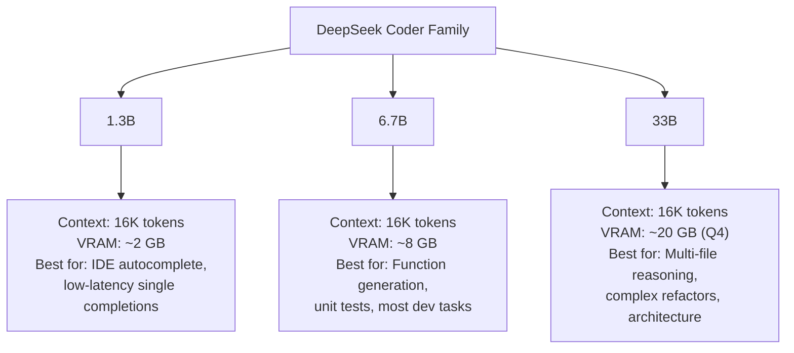
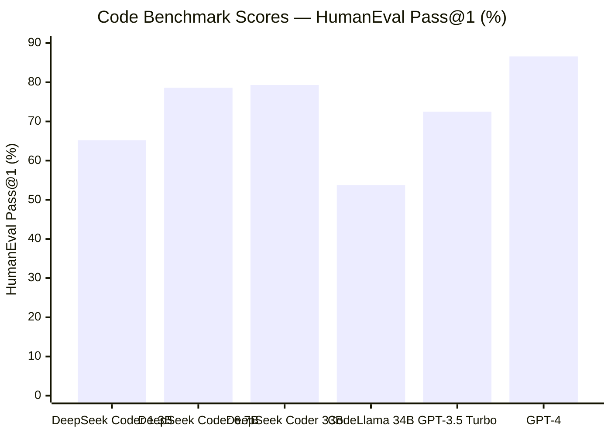
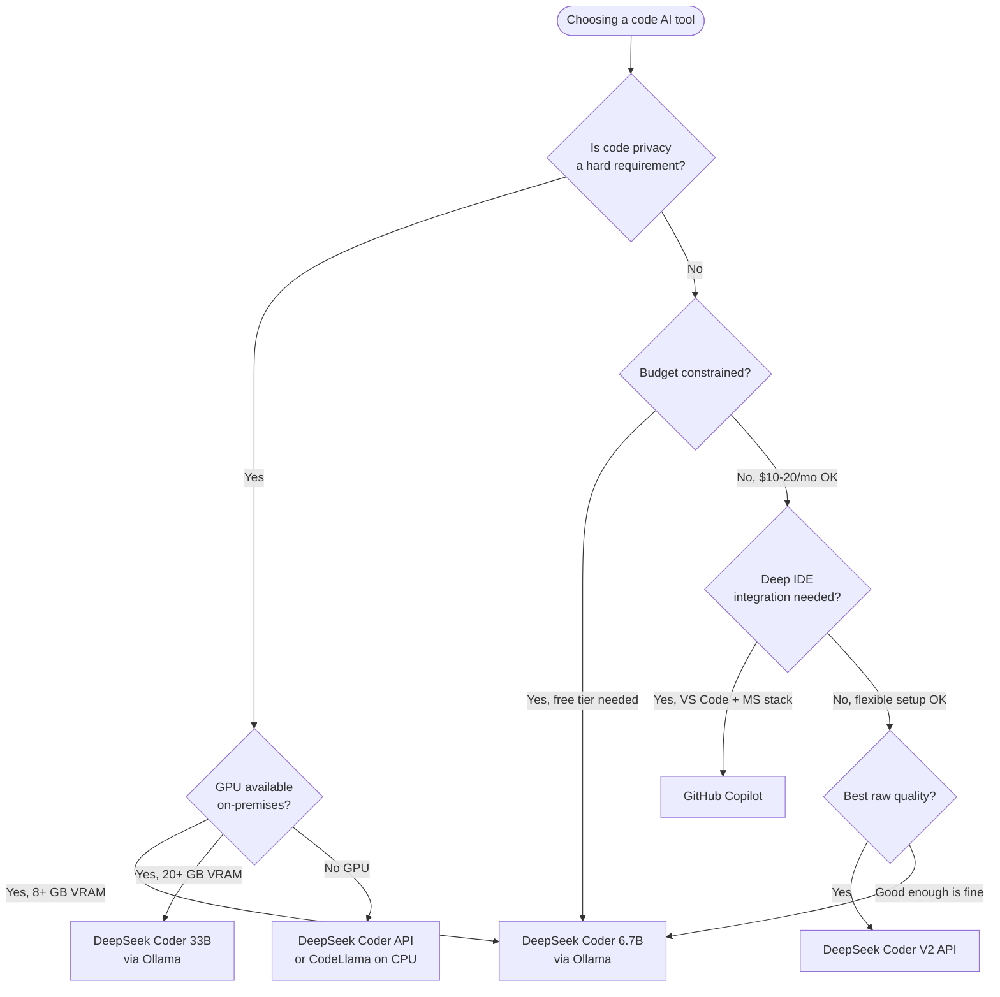

I've been burned by AI coding tools that ace benchmarks and choke on real work. So when DeepSeek Coder started circulating in developer communities with genuinely strong HumanEval numbers, I didn't take the marketing at face value — I ran it through tasks I actually do every week. Here's what I found.

## What Is DeepSeek Coder?

DeepSeek Coder is a family of open-weight code-specialized large language models released by DeepSeek AI, a Chinese research lab. The models were trained from scratch on a mix of code (87%) and natural language (13%), covering 338 programming languages. Unlike models that are fine-tuned from a general-purpose base, DeepSeek Coder was pre-trained on code-heavy data from the start — which shows in how it handles lower-level constructs, algorithm-heavy tasks, and multi-file codebases.

What makes DeepSeek Coder stand out isn't one single feature. It's the combination of strong benchmark performance, permissive licensing (MIT for most variants), and the ability to run entirely on your own hardware. For teams worried about code leaking into a vendor's training pipeline, that last point is significant.

The models are available in both base and instruct variants. The instruct variants are fine-tuned for instruction-following and are what you'd actually use in an editor or CLI tool. The base variants are better for further fine-tuning on your own data.

## The Model Lineup

DeepSeek Coder ships in three size tiers, each with a different hardware profile and capability ceiling:



**DeepSeek Coder 1.3B** is fast enough for real-time autocomplete. It fits on a modest GPU or even runs on CPU for shorter completions. The quality is limited — it handles boilerplate well but struggles with anything that requires holding more than a few hundred lines of context in mind. Think of it as a smarter Copilot for line-level suggestions.

**DeepSeek Coder 6.7B** is the workhorse. On an RTX 3080 (10 GB VRAM) or a Mac M-series with 16 GB unified memory, it runs at a practical speed — around 20–40 tokens per second depending on hardware. This is the variant I used for most of my testing. It generates coherent functions, writes reasonable unit tests, and can usually work through a bug if you provide the relevant context.

**DeepSeek Coder 33B** is where the capability ceiling lifts noticeably. You need a beefy GPU (or multiple), but the results on complex tasks — especially multi-file reasoning and architectural refactoring — are in a different tier. If you're running an on-premises inference server for a team, this is the variant worth deploying.

There's also a **DeepSeek Coder V2** released in mid-2024, which dramatically improves on the original lineup. V2 uses a Mixture-of-Experts architecture with 236B total parameters but only 21B active per forward pass, making it surprisingly efficient. For this review I focus primarily on the original 6.7B and 33B, since those are what most developers self-host.

## Code Generation Quality

DeepSeek Coder's benchmark performance is genuinely impressive, particularly for an open-weight model. Here's how the 6.7B and 33B variants compare to other major code models:



A few things stand out from these numbers:

- **DeepSeek Coder 6.7B beats CodeLlama 34B on HumanEval** — a model roughly five times smaller. That's not a minor improvement; it's a signal that the training data mix and pre-training approach matter more than raw parameter count.
- **The 6.7B and 33B are close on HumanEval**, but the gap widens on harder benchmarks like MBPP+ (multi-step Python problems) and DS-1000 (data science tasks) where the 33B's larger working memory pays off.
- **GPT-4 still leads**, but the gap is smaller than you'd expect given that GPT-4 costs money per token and DeepSeek Coder can run locally for free after setup.

On **MBPP** (Mostly Basic Python Problems), DeepSeek Coder 6.7B scores around 74.9% and the 33B hits roughly 79.3%. These are competitive numbers that translate to real-world correctness on the kinds of utility functions and algorithmic tasks that fill a developer's day.

## Language Support

DeepSeek Coder's training covered 338 programming languages, but the practical quality varies significantly by language. Based on my testing and community reports:

**Strongest:**
- Python — the model thinks in Python. Numpy, Pandas, FastAPI, Pydantic all render cleanly.
- JavaScript / TypeScript — modern ES2022+ patterns, React hooks, async/await all handled well
- Java — verbose but correct; Spring Boot boilerplate generates fine
- C / C++ — surprisingly strong, especially for systems-level code with pointer arithmetic
- Rust — better than most models at ownership semantics, though it occasionally fights the borrow checker on complex lifetime annotations
- Go — idiomatic goroutine and channel patterns work
- SQL — CTEs, window functions, query optimization suggestions are solid

**Moderate:**
- PHP, Ruby, Kotlin, Swift — functional but not brilliant
- Bash / shell scripting — handles common patterns, struggles with edge cases

**Weaker:**
- Less common languages (COBOL, Fortran, niche DSLs) — present in training data but quality is inconsistent

The practical takeaway: if you work primarily in Python, TypeScript, or a mainstream compiled language, DeepSeek Coder covers your stack well.

## Real-World Testing

Benchmarks are a starting point, not a verdict. Here are three tasks I actually ran through DeepSeek Coder 6.7B Instruct via Ollama:

### Task 1: Write a rate-limited async HTTP client in Python

I gave the model this prompt: *"Write a Python async HTTP client class that wraps httpx, enforces a configurable per-second rate limit using a token bucket algorithm, retries on 429 and 5xx responses with exponential backoff up to 3 attempts, and logs every request and response status."*

The result was a 90-line class that was 85% correct on first pass. The token bucket implementation was accurate. The retry logic handled 429 and 5xx correctly. The one failure: it imported `asyncio.Queue` and built a slightly off token refill mechanism that didn't account for time drift. I pointed this out in the follow-up message and it fixed it correctly in one turn. Total time including iteration: about 4 minutes. That's faster than writing it from scratch and faster than finding a reliable library.

### Task 2: Explain and fix a subtle TypeScript bug

I pasted a 60-line TypeScript snippet with a closure-capture bug inside a `forEach` loop (the classic `var` vs `let` scoping issue, hidden inside a nested async callback). I asked the model to find and explain the bug without giving hints.

It identified the problem correctly, explained why the closure was capturing the wrong variable reference, and suggested two fixes — one using `let` in the loop declaration, one refactoring to `for...of`. The explanation was clear enough that I'd use it verbatim in a code review comment. This is the task that impressed me most.

### Task 3: Generate a SQL migration with rollback

I described a schema change: adding a nullable `metadata JSONB` column to a PostgreSQL table and creating an index on a specific key within that column. I asked for both the up migration and a safe rollback script.

The generated SQL was syntactically correct and included the right `IF NOT EXISTS` guard on the index. The rollback dropped the index before the column (correct order). It did not add a `CONCURRENT` qualifier to the index creation, which would matter in production. When I asked it to add `CONCURRENTLY`, it did — but this is the kind of production-awareness gap that you need to catch in review.

**Overall assessment:** DeepSeek Coder 6.7B functions like a strong junior-to-mid-level developer. It handles most well-specified tasks correctly, iterates usefully when given feedback, and catches bugs when shown the relevant context. It does not proactively raise production concerns without prompting. Treat its output as a solid first draft, not a final commit.

## Self-Hosting with Ollama

The fastest path to running DeepSeek Coder locally is Ollama. If you have Ollama installed:

```bash
# Pull and run the 6.7B instruct model
ollama run deepseek-coder:6.7b-instruct

# Or the 33B instruct variant
ollama run deepseek-coder:33b-instruct
```

Ollama handles quantization automatically. The default is Q4_K_M, which cuts VRAM requirements roughly in half compared to full precision while preserving most of the quality.

**Hardware requirements (approximate):**

| Model | VRAM (Q4) | RAM (CPU fallback) | Tokens/sec (RTX 3080) |
|---|---|---|---|
| 1.3B | ~2 GB | ~4 GB | 80–120 |
| 6.7B | ~6 GB | ~10 GB | 25–45 |
| 33B | ~20 GB | ~36 GB | 5–12 |

For the 33B on a single consumer GPU, you'll need at least a 24 GB card (RTX 3090/4090) or accept partial CPU offload, which slows generation significantly. A Mac Studio with 64 GB unified memory runs the 33B at a reasonable clip — around 15–20 tokens/second.

To use DeepSeek Coder with **Continue** (the VS Code/JetBrains extension), add this to your `config.json`:

```json
{
  "models": [{
    "title": "DeepSeek Coder 6.7B",
    "provider": "ollama",
    "model": "deepseek-coder:6.7b-instruct"
  }]
}
```

You can also serve it via Ollama's OpenAI-compatible endpoint (`localhost:11434/v1`) and point any OpenAI SDK client at it — no code changes needed beyond the base URL.

## API Access and Pricing

If you don't want to self-host, DeepSeek offers API access to their models through the DeepSeek Platform. As of early 2026, pricing for DeepSeek Coder V2 (the flagship) sits well below GPT-4 class models — generally in the range of $0.10–$0.20 per million input tokens and $0.20–$0.30 per million output tokens. These numbers shift with promotions, so check the official pricing page before budgeting.

The API is OpenAI SDK-compatible, which means you can swap it in by changing the base URL and API key:

```python
from openai import OpenAI

client = OpenAI(
    api_key="your_deepseek_api_key",
    base_url="https://api.deepseek.com/v1"
)

response = client.chat.completions.create(
    model="deepseek-coder",
    messages=[{"role": "user", "content": "Write a binary search in Rust"}]
)
```

The main caveat with the API for proprietary codebases: your code leaves your infrastructure. For open-source projects this is fine. For anything with trade-secret value, self-hosting is the safer default.

## DeepSeek Coder vs Copilot vs CodeLlama

Here's how the three main options compare for typical development workflows:

| Criteria | DeepSeek Coder 6.7B | GitHub Copilot | CodeLlama 34B |
|---|---|---|---|
| **HumanEval Pass@1** | 78.6% | ~72% (est.) | 53.7% |
| **Cost** | Free (self-hosted) | $10–$19/mo | Free (self-hosted) |
| **Privacy** | Full (local) | Code sent to GitHub | Full (local) |
| **IDE integration** | Via Continue/extensions | Native | Via Continue/extensions |
| **Context window** | 16K tokens | 8K tokens | 16K tokens |
| **Setup effort** | Medium (Ollama) | Minimal | Medium (Ollama) |
| **Multi-language** | 338 languages | 50+ languages | ~40 languages |
| **Best use case** | Backend, algorithms, open-weight flexibility | Daily autocomplete, MS ecosystem | Privacy-first, general coding |



**My honest take:** Copilot wins on frictionless daily autocomplete inside VS Code and JetBrains — the IDE integration is seamless and the latency is low. DeepSeek Coder wins on privacy, cost, and raw benchmark quality for a comparable model size. CodeLlama has largely been superseded by DeepSeek Coder on every dimension that matters for new deployments.

If you're a solo developer or small team that can tolerate a one-time Ollama setup, DeepSeek Coder 6.7B gives you Copilot-comparable quality for $0/month after hardware.

## Limitations

DeepSeek Coder is not a complete replacement for a human engineer, and there are specific situations where it falls short:

**Production awareness gaps.** As noted in my SQL test, the model generates correct code more reliably than it generates production-safe code. Indexes without `CONCURRENT`, missing transactions, and absent error boundaries are patterns I saw repeatedly. Always review for operational correctness, not just logical correctness.

**Context window ceiling.** 16K tokens sounds generous, but a moderately-sized Python service with multiple files can exceed that quickly. The model can't see what it can't fit in context, and it doesn't always tell you when something is missing. Provide the most relevant files explicitly.

**License ambiguity on commercial use.** The original DeepSeek Coder models use MIT license, which allows commercial use. DeepSeek Coder V2 has a different license with restrictions for providers building services with it at scale. Read the license if your use case is commercial deployment.

**Chinese-language training influence.** Occasional comments and docstrings generate in Chinese, especially when the model is uncertain. This is easy to catch in review but worth knowing.

**Not great at code review.** Ask it to generate code and it's strong. Ask it to critique existing code for design flaws, security issues, or performance bottlenecks and it often produces surface-level observations. For code review tasks, Claude 3.5 Sonnet or GPT-4 is meaningfully better.

**No web access or real-time data.** The model's knowledge has a training cutoff. It doesn't know about library releases, CVEs, or API changes that happened after that cutoff.

## Verdict

DeepSeek Coder is the best open-weight code model available for self-hosting as of early 2026. The 6.7B variant punches well above its weight class on benchmarks, runs on consumer hardware, and handles the majority of real development tasks correctly on first or second pass. The 33B is worth deploying for teams that need higher-quality multi-file reasoning and have the GPU budget for it.

It's not perfect — production awareness gaps mean every output needs review, and the 16K context window creates friction on large codebases. But at the price of zero ongoing API cost and with full control over where your code goes, it's an easy recommendation for developers who care about privacy and want to reduce dependency on commercial APIs.

If you're still paying for Copilot and your primary use case is backend Python, TypeScript, or systems code, DeepSeek Coder 6.7B via Ollama is worth a one-week trial. I'd be surprised if you switched back.

## FAQ

### Does DeepSeek Coder support code completion inside VS Code?

Yes. The easiest path is the Continue extension, which is free and connects to any Ollama-served model. Set the model to `deepseek-coder:6.7b-instruct` in Continue's config and you get inline completions and a chat sidebar. The experience is close to Copilot, though the autocomplete trigger latency depends on your local hardware.

### How does DeepSeek Coder V2 compare to the original models?

DeepSeek Coder V2 (released May 2024) is a significant leap forward. It uses a 236B MoE architecture with 21B active parameters per forward pass and extends the context window to 128K tokens. On HumanEval it hits approximately 90.2% — competitive with GPT-4 class models. If you have API access, V2 is the better choice. For self-hosting, it requires more serious infrastructure.

### Is it safe to use DeepSeek Coder with proprietary code?

Self-hosted variants are safe from a data-leakage perspective — nothing leaves your hardware. The DeepSeek API routes your code to their servers, which raises the same considerations as any cloud API. For proprietary or regulated codebases, self-hosting the 6.7B or 33B is the appropriate path.

### Can DeepSeek Coder write tests as well as implementation code?

It can write unit tests for code you provide, and the quality is decent for standard pytest or Jest patterns. It won't proactively suggest test cases for edge conditions it hasn't been shown. Give it the function plus a description of what it should guard against, and the test quality improves significantly.

### How does quantization affect code quality?

In my testing, Q4_K_M quantization shows minimal quality degradation compared to full-precision on standard coding tasks. The HumanEval score drops by roughly 1–2 percentage points, which is within noise. Q2 quantization shows more meaningful degradation and I don't recommend it for production use. For most developers, Q4_K_M is the right tradeoff between VRAM usage and output quality.
