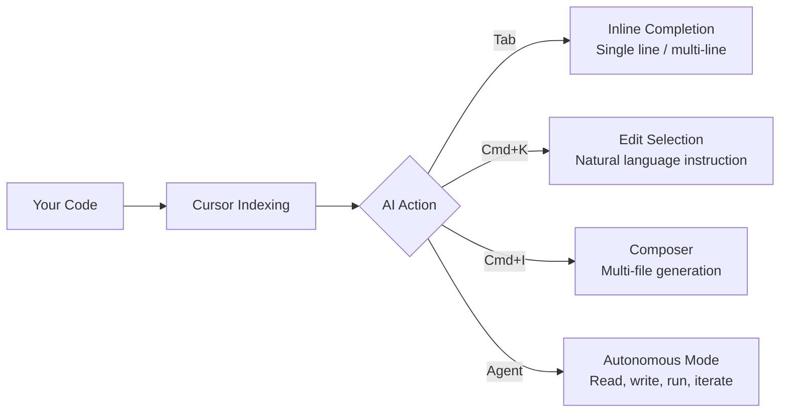
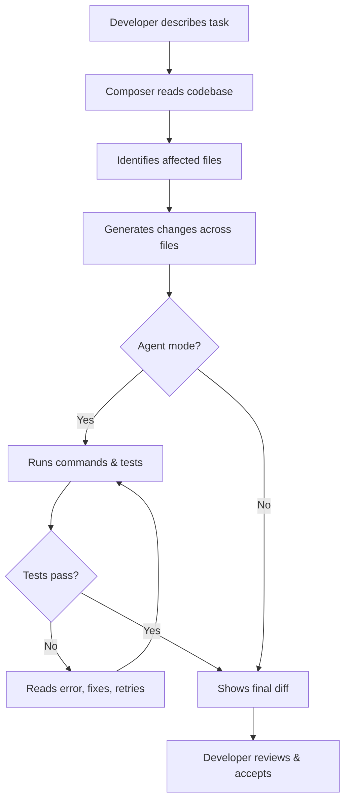
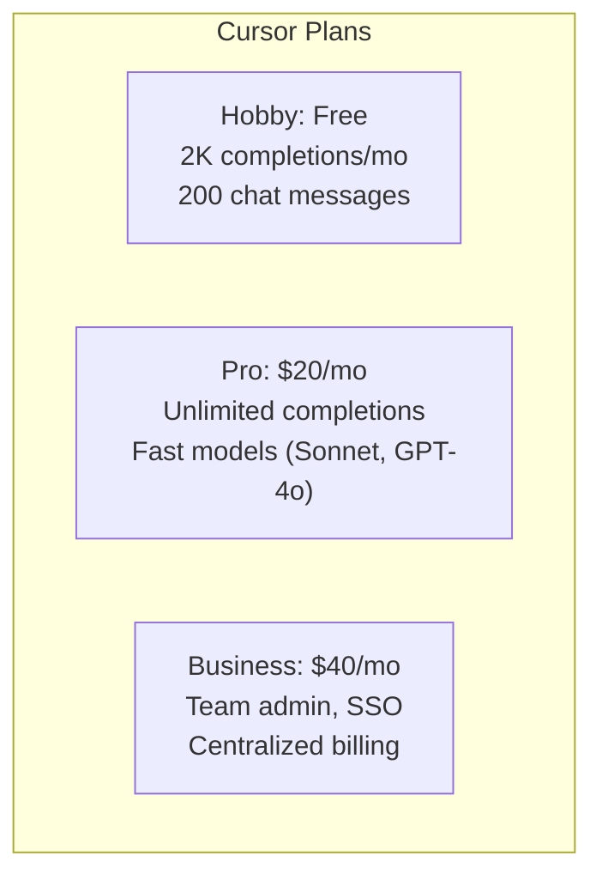

Cursor took the developer world by storm in 2024, and the hype has not died down. If anything, the tool has matured while the conversation around AI-assisted coding has grown more nuanced. After spending two weeks using Cursor as my primary editor on a real production codebase — a Next.js application with about 40,000 lines of TypeScript — I have a clearer picture of where it delivers and where it still frustrates. This is that review.

## What Is Cursor?

Cursor is an AI-native code editor built as a fork of VS Code. The team at Anysphere took the VS Code source, kept virtually everything developers rely on — extensions, keybindings, themes, the terminal — and built a deep AI layer directly into the editing experience rather than bolting it on as an extension.

That distinction matters. GitHub Copilot is an extension that sits on top of VS Code. Cursor rewrote the editor's core interactions so that AI context, file awareness, and multi-file edits are first-class citizens of the UI, not afterthoughts shoehorned into a side panel.

The models powering Cursor change over time, but as of early 2026 the editor ships with access to Claude 3.5 Sonnet, GPT-4o, and several other frontier models. You can switch between them depending on the task. This flexibility turns out to matter more than I initially expected.

## Key Features That Stand Out

**Tab completion that actually thinks ahead.** Cursor's Tab completion is not the character-by-character autocomplete you might expect. It predicts entire logical blocks, sometimes spanning five to fifteen lines, based on what you were just doing. After renaming a function, it anticipates the corresponding test file changes. After adding a new prop to a React component, it suggests the prop type update and the usage site simultaneously. It is uncanny in a way that takes a day or two to stop surprising you.

**Composer for multi-file edits.** Composer is Cursor's answer to the problem that most coding tasks span more than one file. You open it with `Cmd+I`, describe what you want in plain language, and Cursor generates diffs across however many files the change requires. Creating a new API endpoint, for instance, might touch a route file, a controller, a schema, a test file, and an OpenAPI spec. Composer handles that in one pass. Each file's changes appear as a diff you can accept or reject individually before anything is written to disk.

**Agent mode for autonomous coding.** Agent mode is a step further than Composer. Instead of generating a single plan and waiting for your approval, Agent iterates: it runs your tests, reads the output, writes fixes, and re-runs until the tests pass or it asks for your input. It can also search the web, read documentation, and use terminal commands. I found it most reliable for well-defined tasks — "make this failing test pass" or "migrate this module from CommonJS to ESM." For open-ended features, it tends to drift after three or four steps.

**Codebase indexing.** Cursor indexes your entire project and uses that index to provide context-aware answers. Ask it "where is user authentication handled?" and it returns an accurate answer with file links, not a hallucination. This is genuinely useful in large codebases where you have not memorized every module.

**Chat with file and symbol references.** The chat panel lets you reference specific files (`@filename`), symbols (`@functionName`), or even recent terminal output. This precision reduces the noise that plagues general-purpose AI chats, where you spend half your time explaining which file you mean.

## Setting Up Cursor

Setup is straightforward. Download the installer from the Cursor website, run it, and Cursor asks whether you want to import your VS Code settings. The import works well — extensions install automatically, themes carry over, and your keybindings survive intact. I was productive within ten minutes of first launch.

You will be prompted to log in and choose a subscription tier. On the free tier you get a limited number of completions per month. The Pro tier ($20/month) removes those limits and unlocks priority access to the fastest models. After logging in, open the settings panel to choose your preferred model and configure context window size. Keeping the context at "auto" works fine unless you have specific latency requirements.

One thing to note: Cursor uploads your code to its servers to generate completions. There is a privacy mode that avoids storing code, and the team has published its data handling policy, but if you work on highly sensitive proprietary code you should read that policy carefully before onboarding your whole team.

## Real-World Usage: Two Weeks In

**Days one and two** were mostly about adjusting habits. I kept reaching for Copilot's inline suggestion flow before remembering that Cursor's Tab behavior is different. Cursor's completions are slower to trigger but substantially more complete. Once I stopped fighting the rhythm, the productivity gains became obvious.

**By day four,** Composer had become my go-to for anything that would normally require opening three or four files in sequence. Refactoring a data model that touched twelve files took about twenty minutes with Composer. My estimate for the same task done manually was an hour and a half. The diff review step is non-negotiable — Composer made two incorrect assumptions in that session — but catching a mistake in a diff is much faster than hunting it down after the fact.

**Week two** was where Agent mode got a serious workout. I had a suite of integration tests that had been broken for two weeks because of a dependency version conflict. I described the problem to Agent, let it read the test output and the lockfile, and watched it work through five iterations before arriving at a fix that passed locally. I would have found the fix eventually, but Agent got there faster and without me having to context-switch away from something else.

The feature I used least was the web search integration. It is there, and it works, but the retrieved content is not always current enough to be authoritative on fast-moving libraries. I ended up reading documentation directly more often than relying on Cursor to fetch it.

## Cursor vs VS Code + Copilot

This is the comparison most developers actually need. Here is the honest breakdown.

**Arguments for switching to Cursor:**
- Multi-file edits via Composer have no direct equivalent in Copilot. Copilot's Edits feature exists but is narrower in scope.
- Agent mode's ability to run tests and iterate is a qualitative step beyond Copilot's workflow.
- The model-switching flexibility means you can use the best model for each task rather than being locked to whatever Microsoft has negotiated.
- Codebase indexing is more capable than Copilot's workspace awareness in most real-world tests.

**Arguments for staying with VS Code + Copilot:**
- If your company has a Microsoft 365 or GitHub Enterprise subscription, Copilot may effectively cost nothing additional. Cursor Pro at $20/month is a real line item.
- Copilot's integration with GitHub pull requests and code review is tighter.
- Some teams have compliance requirements that make Cursor's data handling less straightforward to approve.
- If you rely heavily on extensions that interact with the VS Code API at a low level, there is a small but nonzero chance of compatibility issues in Cursor's fork.

For individual developers on the Pro tier, I think Cursor is the stronger daily driver. For teams, the procurement and compliance story still needs work.

## Pricing: Is It Worth $20/Month?

Cursor has three tiers.

**Hobby (free):** 2,000 completions per month, limited Composer and Agent usage, access to slower model variants.

**Pro ($20/month):** Unlimited completions, priority model access, faster response times, access to all current models including Claude 3.5 Sonnet and GPT-4o.

**Business ($40/user/month):** Everything in Pro plus team management, SSO, audit logs, and a stronger data privacy guarantee.

The free tier is enough to evaluate whether Cursor fits your workflow. It is not enough for daily professional use — 2,000 completions disappear fast when Tab is predicting entire code blocks every few keystrokes.

At $20/month for Pro, the math is simple. If Cursor saves you one hour per week — a conservative estimate based on my two-week experience — and your time is worth $50/hour, you are getting $200/month of productivity for $20. Even the most skeptical reading of the productivity gains clears that bar comfortably.

The Business tier is where the value proposition gets murkier. At $40/user/month, teams need to see clear, measurable productivity improvements to justify the line item, especially compared to Copilot which may already be covered by existing agreements.

## The Rough Edges

No review is complete without honest criticism.

**Model switching friction.** Switching between Claude and GPT-4o requires opening a settings dropdown mid-conversation. It is not painful, but it interrupts flow at exactly the moment you want to stay focused. A quick-switch keybinding would help.

**Agent mode reliability drops on complex tasks.** Agent is impressive until it is not. On tasks that require more than five or six steps, it sometimes loses the thread — applying a fix that contradicts something it decided two steps earlier. Treating Agent as a capable junior developer who needs check-ins rather than an autonomous system that runs unsupervised is the right mental model.

**Composer occasionally misreads large contexts.** On repositories over about 80,000 lines, I noticed Composer occasionally missing relevant files from its edit set. The codebase indexing is good but not perfect, and the quality of Composer's output correlates directly with how well it identified the right context.

**Startup time.** Cursor is slower to launch than a stock VS Code installation. On my M2 MacBook Pro, it takes about four seconds to reach a usable state. Not a dealbreaker, but noticeable.

**Subscription management.** The billing portal is basic. There is no per-seat usage dashboard for teams, which makes it hard for engineering managers to understand which team members are actually using the tool and deriving value from it.

**Occasional hallucinations in symbol references.** The `@symbol` reference feature in chat is excellent but not infallible. On two occasions during my two weeks, Cursor cited a function signature that did not quite match the actual code. Always verify before acting on these references.

## Who Should Use Cursor?

**Definitely use Cursor if you:**
- Work alone or in a small team and can make your own tooling decisions quickly.
- Spend significant time on refactoring, migrations, or feature work that touches many files.
- Work in TypeScript, Python, or Go — the languages where Cursor's completions are most polished.
- Are comfortable reviewing AI-generated diffs before accepting them.
- Have already been using Copilot and feel like you are hitting its ceiling.

**Approach cautiously if you:**
- Work at a company with strict data governance requirements — validate the privacy policy with your security team first.
- Are new to AI-assisted coding entirely. Start with Copilot's simpler model before taking on Cursor's richer feature set.
- Rely on VS Code extensions that touch the editor at a low API level — test compatibility before committing.

**Stick with what you have if you:**
- Are satisfied with Copilot and your team is unlikely to see productivity gains that justify switching costs.
- Work primarily in languages that current AI models handle less well (e.g., COBOL, Erlang, niche DSLs).
- Need enterprise compliance guarantees that the Business tier does not yet fully satisfy.

## Pros and Cons Summary

**Pros**
- Tab completion that predicts logical blocks, not just tokens
- Composer makes multi-file refactors genuinely fast
- Agent mode handles well-defined autonomous tasks impressively
- Codebase indexing provides accurate, cited answers to architecture questions
- Model flexibility — switch between Claude, GPT-4o, and others per task
- Imports VS Code settings with minimal friction
- Privacy mode available for sensitive codebases

**Cons**
- $20/month is an additional cost on top of existing tooling spend
- Agent mode loses coherence on complex, long-horizon tasks
- Startup time is slower than vanilla VS Code
- Model-switching UX creates minor flow interruptions
- Billing and team usage dashboards are underdeveloped
- Occasional symbol-reference hallucinations require manual verification
- Data handling policy requires careful review for regulated industries

## The Verdict

After two weeks of daily professional use, Cursor earns a strong recommendation for individual developers and small teams who are willing to build the habit of reviewing AI-generated diffs carefully.

The Tab completion alone is worth the subscription for any developer who writes a lot of code. Composer is a genuine productivity multiplier for refactoring work. Agent mode is impressive enough in its current form to justify experimentation, even if it is not yet reliable enough to run unsupervised on complex features.

The tool is not perfect. The rough edges are real, and teams with strict compliance requirements will need to do their homework before rolling it out broadly. But as an editor designed around the premise that AI is a first-class collaborator rather than a bolted-on assistant, Cursor is the most coherent implementation of that idea available today.

**Rating: 8.5 / 10**

If you are on the fence, start with the free tier. You will know within a week whether the Tab completions and Composer workflow match how you actually code. Most developers who try it seriously do not go back.
