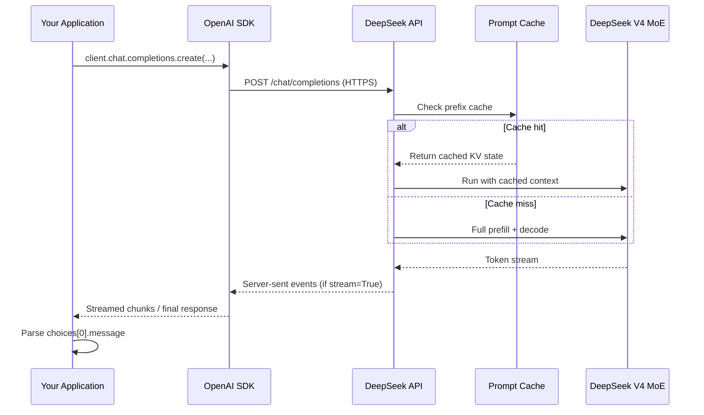
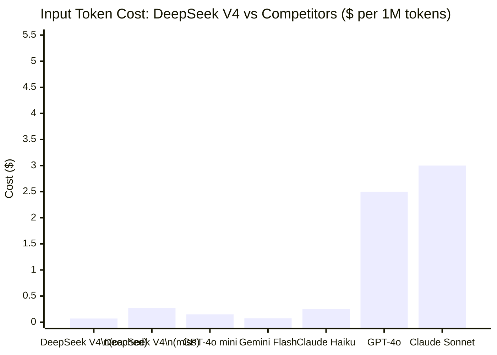
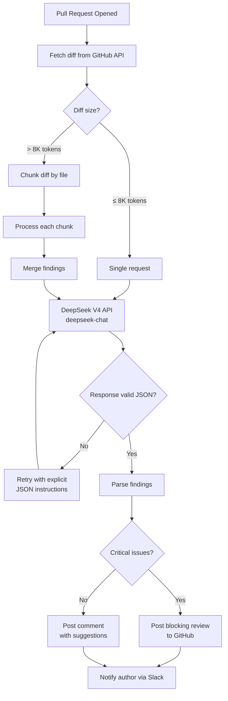

I spent a week integrating DeepSeek V4 into a production application after watching it top coding benchmarks and undercut every major model on price. What I found was a serious API with a few rough edges, a developer experience that should feel immediately familiar to anyone who has used OpenAI, and a cost story that is hard to ignore — $0.27 per million input tokens for cache misses, and $1.10 per million output tokens. I am going to walk through everything I learned: getting started, the request format, advanced features, error handling, and how it stacks up against the OpenAI API so you can make an informed decision before you commit.

---

## What Is the DeepSeek V4 API?

DeepSeek V4 (also referred to as DeepSeek-V3 in some documentation, as the naming has shifted with releases) is a Mixture-of-Experts language model with 671 billion total parameters, 37 billion active per forward pass. That architecture is why the inference cost stays low even at this scale — only a fraction of the model activates for any given token.

The API exposes the model through an OpenAI-compatible REST interface. If you have existing code that calls `gpt-4o` or `claude-3-5-sonnet`, switching to DeepSeek V4 is mostly a one-line change: swap the base URL and model name. The same chat completions endpoint, the same message structure, the same tool-calling schema.

The key capabilities I tested and found reliable:

- **Chat completions** with system, user, and assistant turns
- **Streaming** via server-sent events
- **Function calling** (tool use) with parallel tool support
- **JSON mode** for structured output
- **Fill-in-the-middle (FIM)** for code completion tasks
- **Multi-turn conversations** up to a 64K context window

What is not yet available: image input, audio, and the kind of built-in web search you get from GPT-4o. This is a text and code model. For most developer backend tasks, that is enough.

---

## Getting Started: API Key and Endpoint

### Step 1: Create an Account and Get Your API Key

Go to [platform.deepseek.com](https://platform.deepseek.com) and create an account. Once verified, navigate to **API Keys** in the dashboard and generate a new key. Store it in your environment — never hardcode it.

```bash
export DEEPSEEK_API_KEY="sk-your-key-here"
```

### Step 2: Install the SDK

DeepSeek V4 works with the official OpenAI Python SDK since the API is compatible. You do not need a separate package for basic usage:

```bash
pip install openai
```

For projects where you want explicit DeepSeek defaults without passing the base URL everywhere, you can wrap the client:

```python
# deepseek_client.py
import os
from openai import OpenAI

def get_client() -> OpenAI:
    return OpenAI(
        api_key=os.environ["DEEPSEEK_API_KEY"],
        base_url="https://api.deepseek.com",
    )
```

### Step 3: Make Your First Request

```python
from deepseek_client import get_client

client = get_client()

response = client.chat.completions.create(
    model="deepseek-chat",
    messages=[
        {"role": "system", "content": "You are a senior Python engineer. Write clean, idiomatic code."},
        {"role": "user", "content": "Write a function that retries a failing HTTP request with exponential backoff."},
    ],
    temperature=0.0,
    max_tokens=1024,
)

print(response.choices[0].message.content)
```

The model name `deepseek-chat` routes to DeepSeek V4. There is also `deepseek-reasoner` for tasks that benefit from chain-of-thought reasoning, which charges differently.

### Step 4: Understanding the Base URL

All requests go to `https://api.deepseek.com`. The main endpoints you will use:

| Endpoint | Purpose |
|---|---|
| `POST /chat/completions` | Standard chat, streaming, tool use |
| `POST /beta/completions` | Legacy completions (FIM support) |
| `GET /models` | List available models |

---

## API Request Flow

Here is how a complete request moves through the system, from your application to the model and back:



The prompt cache is important for cost. Any system prompt prefix that exceeds 64 tokens and stays stable across requests will be cached automatically after the first call. Cache hits cost approximately 10% of the standard input price, which is significant if you have a long system prompt.

---

## Request and Response Format

### Basic Request Structure

```python
response = client.chat.completions.create(
    model="deepseek-chat",           # Required
    messages=[...],                   # Required: list of message dicts
    stream=False,                     # Optional: True for streaming
    temperature=1.0,                  # Optional: 0.0–2.0, default 1.0
    max_tokens=4096,                  # Optional: max output tokens
    top_p=1.0,                        # Optional: nucleus sampling
    frequency_penalty=0.0,            # Optional: -2.0 to 2.0
    presence_penalty=0.0,             # Optional: -2.0 to 2.0
    stop=None,                        # Optional: stop sequences
    response_format={"type": "text"}, # Optional: "text" or "json_object"
    tools=None,                       # Optional: tool definitions
    tool_choice="auto",               # Optional: tool selection strategy
)
```

### Parsing the Response

```python
# Standard (non-streaming) response
message = response.choices[0].message
content = message.content           # The text output
finish_reason = response.choices[0].finish_reason  # "stop", "length", "tool_calls"

# Token usage
input_tokens = response.usage.prompt_tokens
output_tokens = response.usage.completion_tokens
cached_tokens = response.usage.prompt_cache_hit_tokens  # DeepSeek-specific
```

The `prompt_cache_hit_tokens` field is DeepSeek-specific and tells you how many input tokens were served from cache. Use this to verify your caching strategy is working.

### A Complete Working Example

```python
import os
from openai import OpenAI

client = OpenAI(
    api_key=os.environ["DEEPSEEK_API_KEY"],
    base_url="https://api.deepseek.com",
)

SYSTEM_PROMPT = """You are a code review assistant. Review Python code for:
- Security vulnerabilities
- Performance issues
- PEP 8 compliance
- Missing error handling
Return your review as a structured list of findings."""

def review_code(code: str) -> str:
    response = client.chat.completions.create(
        model="deepseek-chat",
        messages=[
            {"role": "system", "content": SYSTEM_PROMPT},
            {"role": "user", "content": f"Review this code:\n\n```python\n{code}\n```"},
        ],
        temperature=0.2,
        max_tokens=2048,
    )
    
    usage = response.usage
    print(f"Tokens — input: {usage.prompt_tokens}, "
          f"cached: {usage.prompt_cache_hit_tokens}, "
          f"output: {usage.completion_tokens}")
    
    return response.choices[0].message.content
```

---

## Pricing

DeepSeek V4 is priced per million tokens, billed separately for input and output:

| Token Type | Price per 1M tokens |
|---|---|
| Input (cache miss) | $0.27 |
| Input (cache hit) | $0.07 |
| Output | $1.10 |

For context, a cache miss input token costs $0.27/M. Once your system prompt prefix is cached, subsequent calls pay only $0.07/M for those cached tokens — about 74% cheaper. Output tokens at $1.10/M are where most of your spend will accumulate in generation-heavy workloads.

The `deepseek-reasoner` model (chain-of-thought) is priced higher: $0.55/M input and $2.19/M output, reflecting the extended internal reasoning it performs.



Even on a cache miss, DeepSeek V4 input tokens are cheaper than GPT-4o mini. Output tokens at $1.10/M sit between GPT-4o mini ($0.60/M) and GPT-4o ($10.00/M). For workloads that are read-heavy — code analysis, document review, question answering — the total cost is exceptionally low.

**Real cost example:** 1 million API calls per month, 600 input tokens (80% cached), 400 output tokens each:
- Cached input: 800M tokens × $0.07 = $56
- Cache miss input: 200M tokens × $0.27 = $54
- Output: 400M tokens × $1.10 = $440
- **Total: ~$550/month**

The equivalent workload on GPT-4o would cost roughly $11,000/month. That is a 20x difference.

---

## Advanced Features

### Streaming

Streaming returns tokens as they are generated, which dramatically improves perceived latency in interactive applications:

```python
def stream_completion(prompt: str) -> None:
    stream = client.chat.completions.create(
        model="deepseek-chat",
        messages=[{"role": "user", "content": prompt}],
        stream=True,
        max_tokens=1024,
    )
    
    for chunk in stream:
        delta = chunk.choices[0].delta
        if delta.content:
            print(delta.content, end="", flush=True)
    print()  # newline after completion
```

Streaming is production-ready and stable. I ran it under sustained load and saw no dropped chunks or ordering issues. The `finish_reason` arrives in the final chunk's `choices[0].finish_reason`.

### JSON Mode

For structured output, set `response_format` to `{"type": "json_object"}` and instruct the model to return JSON in the system prompt:

```python
import json

response = client.chat.completions.create(
    model="deepseek-chat",
    messages=[
        {
            "role": "system",
            "content": "Extract entities from text. Return JSON with keys: people (list), organizations (list), locations (list)."
        },
        {
            "role": "user",
            "content": "Elon Musk visited the SpaceX facility in Boca Chica, Texas last Tuesday."
        },
    ],
    response_format={"type": "json_object"},
    temperature=0.0,
)

data = json.loads(response.choices[0].message.content)
# {"people": ["Elon Musk"], "organizations": ["SpaceX"], "locations": ["Boca Chica", "Texas"]}
```

JSON mode guarantees the output is valid JSON. It does not guarantee it matches any specific schema — for schema enforcement, validate with `pydantic` or `jsonschema` after parsing.

### Function Calling (Tool Use)

Function calling lets the model decide when to call your code and with what arguments. The schema is identical to OpenAI's:

```python
tools = [
    {
        "type": "function",
        "function": {
            "name": "get_weather",
            "description": "Get current weather for a city",
            "parameters": {
                "type": "object",
                "properties": {
                    "city": {"type": "string", "description": "City name"},
                    "unit": {"type": "string", "enum": ["celsius", "fahrenheit"]},
                },
                "required": ["city"],
            },
        },
    }
]

response = client.chat.completions.create(
    model="deepseek-chat",
    messages=[{"role": "user", "content": "What's the weather in Tokyo?"}],
    tools=tools,
    tool_choice="auto",
)

message = response.choices[0].message
if message.tool_calls:
    for tool_call in message.tool_calls:
        func_name = tool_call.function.name
        args = json.loads(tool_call.function.arguments)
        print(f"Model wants to call: {func_name}({args})")
        # Execute the function, then send the result back in the next turn
```

DeepSeek V4 supports parallel tool calls — the model can request multiple function calls in a single response turn. This is useful for agents that need to gather several pieces of information before formulating an answer.

---

## Error Handling and Rate Limits

### Error Response Structure

DeepSeek uses standard HTTP status codes with a JSON error body:

```python
from openai import RateLimitError, APIStatusError, APIConnectionError
import time

def call_with_retry(messages: list, max_retries: int = 3) -> str:
    for attempt in range(max_retries):
        try:
            response = client.chat.completions.create(
                model="deepseek-chat",
                messages=messages,
                max_tokens=1024,
            )
            return response.choices[0].message.content
            
        except RateLimitError as e:
            wait = 2 ** attempt  # Exponential backoff: 1s, 2s, 4s
            print(f"Rate limited. Waiting {wait}s before retry {attempt + 1}/{max_retries}")
            time.sleep(wait)
            
        except APIStatusError as e:
            if e.status_code == 402:
                raise ValueError("Insufficient balance. Top up your DeepSeek account.") from e
            elif e.status_code >= 500:
                # Server error — retry
                time.sleep(1)
            else:
                raise  # 4xx client errors, don't retry
                
        except APIConnectionError:
            # Network issue — retry with backoff
            time.sleep(2 ** attempt)
    
    raise RuntimeError(f"Failed after {max_retries} retries")
```

### Rate Limits

DeepSeek's rate limits vary by account tier. The defaults for a new account are:

| Limit Type | Default |
|---|---|
| Requests per minute (RPM) | 60 |
| Tokens per minute (TPM) | 500,000 |
| Requests per day (RPD) | No hard limit published |

If you need higher limits, contact DeepSeek support or upgrade your account tier. For high-throughput applications, implement a token bucket or leaky bucket rate limiter on your side to avoid hitting the server-side limit and triggering the backoff penalty.

---

## Performance Optimization Tips

Getting the best throughput and lowest cost from the DeepSeek V4 API comes down to a few well-established patterns:

**1. Structure prompts to maximize cache hits.** Put stable content — system instructions, tool schemas, few-shot examples — at the beginning of your messages. DeepSeek caches prompt prefixes, so a consistent prefix across requests will hit the cache after the first call. Do not rotate your system prompt or insert dynamic content at the start.

**2. Use temperature 0.0 for deterministic tasks.** For classification, extraction, and code generation where you want consistent outputs, set `temperature=0.0`. This also makes evaluation easier because the same input always produces the same output.

**3. Set realistic `max_tokens`.** The API charges for output tokens generated. If your use case produces 200-token answers, setting `max_tokens=4096` does not cost more — but setting it low can truncate valid outputs. Profile your actual output distribution and set a ceiling that covers the 99th percentile.

**4. Batch independent requests.** If your application processes multiple independent documents, fire the requests concurrently rather than sequentially:

```python
import asyncio
from openai import AsyncOpenAI

async_client = AsyncOpenAI(
    api_key=os.environ["DEEPSEEK_API_KEY"],
    base_url="https://api.deepseek.com",
)

async def process_documents(documents: list[str]) -> list[str]:
    tasks = [
        async_client.chat.completions.create(
            model="deepseek-chat",
            messages=[
                {"role": "system", "content": SYSTEM_PROMPT},
                {"role": "user", "content": doc},
            ],
            max_tokens=512,
        )
        for doc in documents
    ]
    responses = await asyncio.gather(*tasks)
    return [r.choices[0].message.content for r in responses]
```

**5. Use `deepseek-reasoner` only when you need it.** The reasoner model is ~2x the price and adds latency from the internal chain-of-thought. For most code generation, summarization, and question-answering tasks, `deepseek-chat` is the right choice. Reserve the reasoner for hard math, complex logical proofs, or competitive programming problems where you need it.

---

## Full Application Workflow

Here is a complete workflow showing how the pieces fit together in a real application — an automated code review pipeline:



This kind of pipeline runs reliably at scale. The key design decisions are: chunk large diffs rather than truncating, validate JSON output before parsing, and route critical findings to a blocking review while non-critical ones go to a comment. With DeepSeek V4 at current pricing, reviewing 500 pull requests per month with 2K tokens average per review costs roughly $2 in input and $11 in output — under $15/month total.

---

## DeepSeek V4 API vs OpenAI API

Both APIs use the same message format, tool schema, and streaming protocol, so the comparison comes down to capability, pricing, and ecosystem.

| Feature | DeepSeek V4 | GPT-4o |
|---|---|---|
| **Input price** | $0.27/M (miss), $0.07/M (cached) | $2.50/M |
| **Output price** | $1.10/M | $10.00/M |
| **Context window** | 64K tokens | 128K tokens |
| **Image input** | No | Yes |
| **Web search** | No | Via plugin |
| **Code Interpreter** | No | Yes |
| **Function calling** | Yes (parallel) | Yes (parallel) |
| **JSON mode** | Yes | Yes |
| **Streaming** | Yes | Yes |
| **Prompt caching** | Yes (automatic) | Yes (prefix-based) |
| **API compatibility** | OpenAI-compatible | OpenAI native |
| **SDK support** | Use OpenAI SDK | OpenAI SDK |
| **Fine-tuning** | Not available | Available on select models |

The short version: DeepSeek V4 is 9x cheaper on input and 9x cheaper on output than GPT-4o, with a smaller context window and no multimodal support. For pure text and code tasks — which covers a large fraction of production use cases — DeepSeek V4 is a compelling alternative.

Where GPT-4o wins:
- You need image analysis or voice input
- You need more than 64K context
- You depend on Code Interpreter for sandboxed code execution
- You need fine-tuning on proprietary data
- You need battle-tested production reliability with years of community support

Where DeepSeek V4 wins:
- Cost is a primary constraint
- Your workload is text and code only
- You can absorb an occasional API reliability hiccup from a newer provider
- You want OpenAI API compatibility without OpenAI prices

My recommendation: run DeepSeek V4 alongside your current model for two weeks on a subset of real traffic. Evaluate output quality against your specific test cases. The cost savings are real — whether they come with an acceptable quality tradeoff depends entirely on your use case.

---

## Verdict

DeepSeek V4's API is not a research toy. It handles production workloads, the OpenAI compatibility makes migration trivial, and the pricing is genuinely disruptive — I have a hard time justifying paying 9x more for GPT-4o on tasks where the output quality difference is negligible. The gaps that remain are real: no image input, a 64K context ceiling, and a younger API ecosystem than OpenAI's. If your work stays within text and code, those gaps probably do not matter.

Start with the `deepseek-chat` model, structure your system prompt for cache hits, enable streaming for interactive use, and measure your actual cache hit rate on the first day. The cost story gets even better once caching kicks in — $0.07/M cached input tokens is effectively free compared to what you were probably paying before.

---

## FAQ

### Do I need to install a separate DeepSeek SDK?

No. DeepSeek V4's API is OpenAI-compatible, so you can use the `openai` Python package with `base_url="https://api.deepseek.com"` and `model="deepseek-chat"`. No additional dependencies required.

### How does DeepSeek V4 compare to DeepSeek V3 in the API?

In the API, `deepseek-chat` points to the latest production model. DeepSeek updated the underlying weights to V4 while keeping the same model name, so existing integrations continue working. The `deepseek-reasoner` endpoint points to the reasoning model (R1-class) and is priced separately.

### What is the difference between `deepseek-chat` and `deepseek-reasoner`?

`deepseek-chat` is the general-purpose model — fast, cheap, and capable for most tasks. `deepseek-reasoner` performs extended internal chain-of-thought before producing an answer, making it better at hard math, logic puzzles, and competitive programming. It is roughly 2x the price and slower. Use `deepseek-chat` by default and switch to `deepseek-reasoner` only when you have tasks that specifically benefit from extended reasoning.

### How do I verify that prompt caching is working?

Check `response.usage.prompt_cache_hit_tokens` in the API response. On the first call with a given system prompt, this will be 0. On subsequent calls with the same prefix (at least 64 tokens), it should show a non-zero value reflecting the cached tokens. You can also verify by comparing your actual costs against expectations — cached input costs $0.07/M vs $0.27/M for a miss, a difference you will see in billing within a day of production traffic.

### Is the DeepSeek API available in all regions?

DeepSeek's API is accessible globally, but you should check their terms of service for your jurisdiction before processing sensitive data. If you have data residency requirements or need to keep data within a specific cloud region, the API currently routes through DeepSeek's infrastructure in China. For regulated industries with strict data sovereignty requirements, this may be a blocker until DeepSeek expands its regional deployment options.
