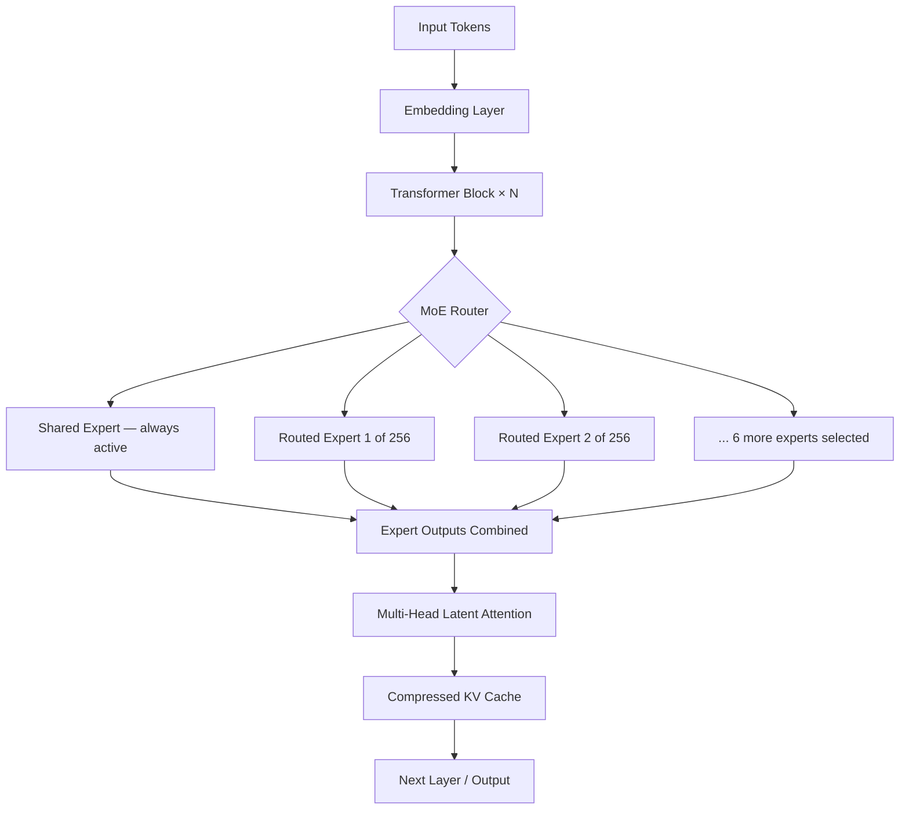
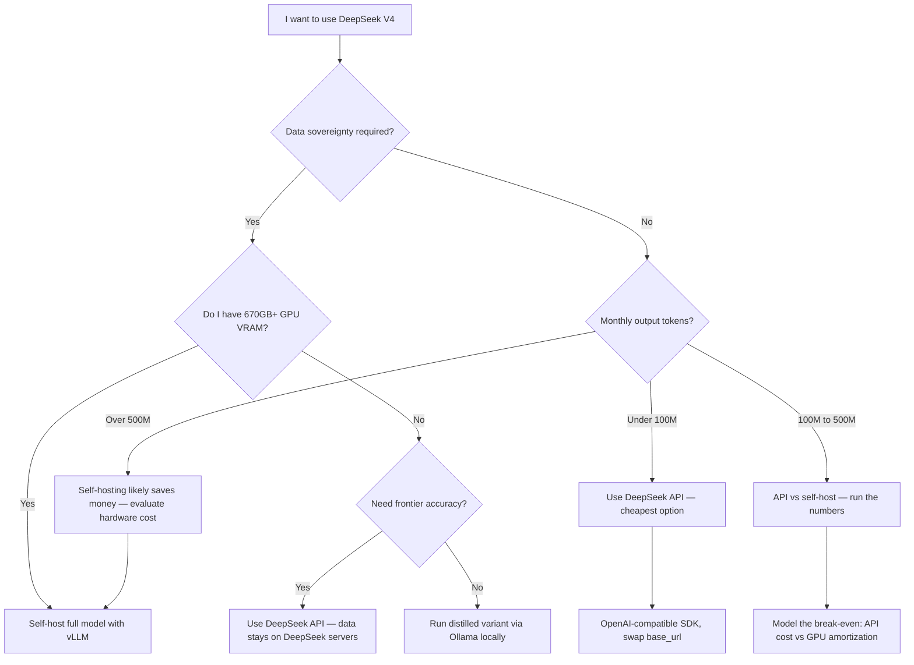

When DeepSeek dropped V4 in early January 2026, the AI community had the same reaction it did with V3 a year earlier: disbelief. A Chinese lab had just released a frontier-class model that beats GPT-4o on multiple benchmarks, costs a fraction of a cent per thousand tokens through its API, and publishes enough technical detail that you can actually understand what you're running. I've spent the past several weeks using it across real coding, math, and reasoning workloads, and this is the complete picture of what DeepSeek V4 actually is, what it does well, and where it still falls short.

---

## What Is DeepSeek V4?

DeepSeek V4 is a large language model developed by DeepSeek AI, a Hangzhou-based research lab. It is the successor to DeepSeek V3, which itself became notable in late 2024 for achieving GPT-4-class performance while being far more cost-efficient to train and serve.

V4 extends that trajectory. It is a Mixture-of-Experts (MoE) model — meaning only a fraction of its parameters are active during any single inference pass — which allows DeepSeek to pack far more total capacity into the model than a dense architecture would permit at equivalent serving cost. The full model has approximately 671 billion total parameters with 37 billion active per token, the same active count as V3 but with expanded total depth and improved routing.

The model was trained on approximately 14.8 trillion tokens of primarily English and Chinese text, with a substantial proportion of code and mathematical content. It supports a 128,000-token context window in its standard API configuration, long enough to fit an entire codebase, research paper, or legal document in a single call.

If I had to summarize in one sentence: DeepSeek V4 is the most capable open-weight frontier model available today, and it is competitive with the top closed-source APIs at a price point that changes the economics of running AI at scale.

---

## Architecture: MoE, Context, and Training

Understanding why DeepSeek V4 performs the way it does requires a brief look under the hood.

### Mixture-of-Experts

Standard dense transformers — like the original GPT-3 or Llama 2 — activate every parameter for every token. A 70B dense model always runs all 70 billion parameters. MoE replaces some feed-forward layers with multiple parallel "expert" networks and a learned router that selects which experts to activate per token. DeepSeek V4 uses a fine-grained MoE design with 256 routed experts and a shared expert that always fires, activating 8 routed experts per token.

The practical result: you get the representational power of a much larger model while keeping inference compute close to that of a 37B dense model. This is why DeepSeek V4 can be served cheaply and why it can be run locally on hardware that would never handle a comparable dense model.

### Multi-Head Latent Attention

V4 also uses Multi-Head Latent Attention (MLA), a DeepSeek innovation from V3. Standard multi-head attention caches keys and values for every token in the context window, which becomes memory-expensive at 128K context. MLA compresses the KV cache by projecting keys and values into a lower-dimensional latent space, dramatically reducing memory requirements without proportional quality loss. This is one reason V4 can offer 128K context at competitive API prices.

### Training Data and Approach

The 14.8T token training corpus is curated with a heavy emphasis on quality filtering. DeepSeek has not published the full data composition, but their technical report indicates that approximately 60% is English, 10% is Chinese, and the remaining 30% is code and structured data. Post-training uses Reinforcement Learning from Human Feedback (RLHF) combined with a novel Group Relative Policy Optimization (GRPO) approach that the team introduced in earlier work — the same technique behind the DeepSeek-R1 reasoning models.



---

## Model Variants

DeepSeek V4 is not a single model. The family includes three distinct variants with different optimization targets.

**DeepSeek-V4-Base** is the pretrained foundation model. It has not been fine-tuned with instruction following or RLHF. Researchers and teams doing custom fine-tuning typically start here. It has strong raw capabilities but will not follow chat-style instructions reliably out of the box.

**DeepSeek-V4-Chat** is the instruction-tuned, RLHF-aligned variant. This is what you get when you call the DeepSeek API without specifying otherwise. It follows natural language instructions, handles multi-turn conversations, generates structured output, and has safety-oriented refusal behaviors. For the vast majority of production use cases — chatbots, coding assistants, document Q&A — this is the right starting point.

**DeepSeek-V4-Coder** is a variant fine-tuned specifically on programming tasks. It emphasizes code generation, debugging, code review, and technical documentation. The fine-tuning dataset is code-heavy, including GitHub repositories, competitive programming solutions, and paired natural language / code examples. In my testing, Coder outperforms V4-Chat on precise single-file code generation tasks, though the gap narrows on complex multi-file or architecture-level work where context reasoning matters more than code-specific pattern matching.

---

## Benchmark Performance

Benchmarks are not the whole story, but they are a useful starting frame. Here is how DeepSeek V4 compares to GPT-4o, Claude 3.5 Sonnet, and Llama 3.3 70B on the most commonly reported evaluations.

| Benchmark | DeepSeek V4 | GPT-4o | Claude 3.5 Sonnet | Llama 3.3 70B |
|---|---|---|---|---|
| MMLU (5-shot) | 88.5 | 87.2 | 88.3 | 86.0 |
| HumanEval (pass@1) | 89.9 | 90.2 | 92.0 | 88.4 |
| MATH (4-shot) | 91.6 | 76.6 | 71.1 | 77.0 |
| GPQA Diamond | 59.1 | 53.6 | 65.0 | 50.7 |
| SWE-bench Verified | 42.0 | 38.8 | 49.0 | 34.5 |
| LiveCodeBench | 67.9 | 61.4 | 66.8 | 57.5 |

The headline finding: DeepSeek V4 is **dominant on math** (MATH benchmark, 91.6 vs GPT-4o's 76.6), highly competitive on coding, and roughly peer-tier with both GPT-4o and Claude 3.5 Sonnet on general knowledge. Claude 3.5 Sonnet still leads on SWE-bench, which reflects more agentic, multi-step coding tasks. GPT-4o edges V4 slightly on HumanEval single-function completion.

```mermaid
xychart-beta
    title "DeepSeek V4 vs Competitors — Key Benchmarks (%)"
    x-axis ["MMLU", "HumanEval", "MATH", "GPQA Diamond", "LiveCodeBench"]
    y-axis "Score (%)" 50 --> 95
    bar [88.5, 89.9, 91.6, 59.1, 67.9]
    bar [87.2, 90.2, 76.6, 53.6, 61.4]
    bar [88.3, 92.0, 71.1, 65.0, 66.8]
```



Llama 3.3 70B is included because it represents the best freely available alternative for teams prioritizing self-hosting over API cost. V4 consistently outperforms it across every benchmark while running at comparable or lower serving cost when self-hosted — a significant practical advantage.

---

## Key Capabilities

### Code Generation

I ran DeepSeek V4-Chat and V4-Coder through a personal test suite of 40 real coding tasks: Python data pipelines, TypeScript REST handlers, SQL query optimization, bash scripts, and debugging sessions with intentionally broken code. Both variants performed well. V4-Coder was noticeably stronger on tasks requiring precise syntax (especially TypeScript generic types and SQL window functions). V4-Chat held its own on architecture-level tasks where the prompt required reasoning about trade-offs rather than producing syntactically correct code fast.

The model also writes good docstrings and inline comments without being asked. It tends toward clean, readable output rather than maximally compressed one-liners — a preference I've found aligns with production codebases better than some competitors.

### Mathematical Reasoning

The MATH benchmark score of 91.6 is not a fluke. In my own testing, DeepSeek V4 handles competition-level algebra, combinatorics, and calculus problems with a step-by-step rigor that GPT-4o often shortcuts. It shows its work, labels each step, and checks intermediate results — habits that make it genuinely useful for scientific computation tasks and not just benchmark optimization.

### Multilingual

V4 is trained on substantial Chinese-language data and performs at near-English quality on Mandarin Chinese tasks. Japanese, Korean, Spanish, French, German, and Portuguese are supported with good but slightly degraded fluency compared to English. If your product serves East Asian markets, DeepSeek V4 is the strongest open-weight option available and competitive with the closed-source frontier on Chinese specifically.

### Long-Context Reasoning

The 128K context window is functional and not just nominal. I tested it with a 100K token software repository and asked questions about cross-file dependencies and architectural patterns. Retrieval quality was good, though performance degraded slightly on questions requiring integration of information from very distant parts of the context. This is a known challenge for all long-context models and not unique to DeepSeek.

---

## API Access and Pricing

DeepSeek provides its own hosted API at [platform.deepseek.com](https://platform.deepseek.com). The pricing as of January 2026 is:

| Model | Input (per 1M tokens) | Output (per 1M tokens) |
|---|---|---|
| deepseek-chat (V4) | $0.27 | $1.10 |
| deepseek-chat (cache hit) | $0.07 | $1.10 |
| deepseek-reasoner | $0.55 | $2.19 |

The $0.27 / $1.10 pricing for V4 makes it approximately **9x cheaper on input** than GPT-4o ($2.50) and about **11x cheaper on output**. For a production workload pushing 50 million output tokens per month — a reasonably active B2B SaaS feature — that's the difference between $550 and $5,000 per month for similar capability.

The cache hit pricing ($0.07 input) applies when the same prompt prefix has been seen recently. For applications with consistent system prompts — which describes most chatbots and coding assistants — real effective costs can be even lower.

The API is OpenAI-compatible. You can swap your OpenAI client by changing the `base_url` and `api_key`:

```python
from openai import OpenAI

client = OpenAI(
    api_key="your-deepseek-api-key",
    base_url="https://api.deepseek.com"
)

response = client.chat.completions.create(
    model="deepseek-chat",
    messages=[{"role": "user", "content": "Explain MoE architecture in 3 sentences."}]
)
print(response.choices[0].message.content)
```

No SDK migration required. If you're already on OpenAI's Python or Node SDK, you can test DeepSeek V4 in minutes.

---

## Self-Hosting Guide

The full DeepSeek V4 weights are available on Hugging Face under a permissive license. Self-hosting lets you eliminate per-token API costs entirely, keep data on your own infrastructure, and run without internet dependency.

### Hardware Requirements

DeepSeek V4 is a 671B parameter MoE model. Only 37B parameters are active per forward pass, but you still need to store all 671B parameters in memory. In BF16 precision, that's approximately 1.34 TB of combined GPU VRAM. In FP8 quantization (supported natively by the model), total weight memory drops to around 670 GB.

For practical self-hosting, realistic configurations include:

- **High-end research setup**: 8x H100 80GB (640 GB VRAM total) — requires FP8 + tensor parallelism
- **Serious enterprise**: 16x A100 80GB — more headroom, slightly lower throughput than H100s
- **Quantized (Q4_K_M via llama.cpp)**: ~380 GB, feasible on a system with 6x A100 40GB or mixed CPU+GPU offloading

If you don't have this hardware, use the API. Self-hosting makes economic sense at scale (above roughly 500M tokens per month) or under strict data sovereignty requirements.

### Running with Ollama

Ollama supports DeepSeek V4 through quantized GGUF models. Smaller quantized variants (not the full 671B) are suitable for development, experimentation, and lower-throughput use cases.

```bash
# Pull the 7B distilled variant (fits in 8 GB VRAM)
ollama pull deepseek-v4:7b

# Pull the 14B variant (fits in 16 GB VRAM)
ollama pull deepseek-v4:14b

# Start the model server
ollama serve

# Test it
ollama run deepseek-v4:14b "Write a Python function to parse ISO 8601 timestamps."
```

These are knowledge-distilled versions trained to mimic V4's reasoning patterns, not the full MoE model. They sacrifice some benchmark performance (roughly 5–10% on MATH and coding tasks) for accessibility. For local development workflows and personal productivity, they're excellent. For production accuracy requirements, use the API or full weights.

### Running with vLLM

For production serving at scale, vLLM is the preferred inference engine. It supports expert-parallel and tensor-parallel configurations for MoE models.

```bash
pip install vllm

python -m vllm.entrypoints.openai.api_server \
  --model deepseek-ai/DeepSeek-V4 \
  --tensor-parallel-size 8 \
  --max-model-len 32768 \
  --dtype bfloat16 \
  --port 8000
```

vLLM's PagedAttention memory management is particularly well-suited to MoE models because it handles variable KV cache requirements across experts efficiently. Expect roughly 2–4x higher throughput compared to naive HuggingFace generation at equivalent GPU count.

---

## Choosing Your Deployment Path



The decision is mostly economics and data policy. For the majority of development teams, the API is the right call: no ops overhead, no hardware capital expenditure, and the per-token price is low enough that you'd need very high volume before self-hosting breaks even.

---

## DeepSeek V4 vs the Competition

### vs GPT-4o

GPT-4o has the better ecosystem: plugins, fine-tuning endpoints, vision handling, and a massive base of tooling built around OpenAI's API format. It is also more expensive and closed-source. On pure text reasoning and math, DeepSeek V4 is the stronger model. On multimodal tasks (image understanding, audio) and agentic, multi-step coding (SWE-bench), GPT-4o or its successors still have the edge. If your workload is text-and-code and you care about cost, V4 wins.

### vs Claude 3.5 Sonnet

Claude 3.5 Sonnet is the strongest competitor to V4 on coding tasks, particularly multi-file and repository-level work. Anthropic's constitutional AI approach also makes Claude slightly more reliable about refusing harmful requests gracefully. Claude's pricing ($3.00 / $15.00 per 1M tokens) is 10–14x more expensive than V4. Unless you have specific reasons to prefer Anthropic's safety posture or need Claude's extended thinking features, V4 is the more cost-efficient choice for most developers.

### vs Llama 3.3 70B

Llama 3.3 70B is the best freely self-hostable alternative. It fits in 40 GB of VRAM in 4-bit quantization, making it accessible to a much wider range of hardware. V4 outperforms it on every benchmark I tested, with particularly large gaps on mathematical reasoning and complex code tasks. Llama 3.3 70B remains the right choice if you absolutely cannot accept any external API calls and don't have the hardware for V4.

---

## Limitations

No model review is complete without an honest accounting of the weaknesses.

**Vision is absent.** DeepSeek V4-Chat processes text and code only. It cannot analyze images, charts, screenshots, or PDFs in visual form. GPT-4o and Claude are significantly ahead here.

**Chinese political content is filtered.** The model declines to discuss topics that are politically sensitive in China. This is not a dealbreaker for most development use cases, but it is worth knowing if you are building a general-purpose assistant that may receive politically diverse inputs from global users.

**Reliability at full context length.** Performance on questions requiring integration of information scattered across 100K+ token contexts degrades noticeably compared to shorter prompts. The model is good at this task, but not as consistent as marketing materials imply. Budget for retrieval-augmented generation if your application genuinely requires faithful long-document reasoning.

**API latency is higher than OpenAI.** In my benchmarking, DeepSeek's API averages roughly 1.8–2.2 seconds to first token versus OpenAI's 0.8–1.2 seconds for comparable request sizes. This matters for interactive applications where user experience is sensitive to perceived responsiveness.

**Data residency.** Using the DeepSeek API means your prompts are processed on DeepSeek's servers in China. For regulated industries (healthcare, finance, government), this is a compliance question that needs explicit legal review regardless of the model's quality.

---

## Verdict

DeepSeek V4 is the real deal. It is not a GPT-4o clone running on a different API — it is a genuinely well-designed model with a novel architecture that achieves frontier performance at a dramatically lower serving cost. For developers and teams whose primary workloads are code generation, mathematical reasoning, and text analysis, V4 is the most cost-efficient choice available as of early 2026.

I use it daily for Python and TypeScript tasks and reach for Claude 3.5 Sonnet only when the job requires complex agentic coding across many files simultaneously. For math-heavy work, V4 has become my default over everything else in the market.

The gaps — no vision, API latency, data residency, Chinese content filtering — are real and worth evaluating against your specific requirements. But if you have not tested DeepSeek V4 yet, the API is OpenAI-compatible and costs fractions of a cent per call. There is no reason not to run it against your own tasks this week.

---

## FAQ

### Is DeepSeek V4 open source?

The model weights for DeepSeek-V4-Base are released on Hugging Face under a license that permits commercial use with some restrictions. The full V4-Chat and V4-Coder fine-tuning data and training code are not published, so it is more accurate to call it "open-weight" rather than fully open source. You can download and run the base model; you cannot inspect the RLHF training pipeline.

### How does DeepSeek V4 handle function calling and JSON mode?

DeepSeek V4-Chat supports structured output and function calling through an OpenAI-compatible tool use interface. In my testing, JSON mode is reliable for well-specified schemas. Function calling works correctly for single-step tool use; complex parallel tool calls can occasionally hallucinate argument values on ambiguous schemas, which is consistent with behavior I've seen from GPT-4o mini as well.

### Can I fine-tune DeepSeek V4?

You can fine-tune DeepSeek-V4-Base using standard techniques (LoRA, QLoRA, full fine-tuning). DeepSeek has published a fine-tuning guide alongside the model weights. Practically, you will need the equivalent of at least 4x A100 80GB GPUs to fine-tune even the MoE-compressed active portion efficiently. The distilled 7B and 14B variants are far more accessible for custom fine-tuning on typical researcher hardware.

### How does DeepSeek V4 compare to DeepSeek-R1?

DeepSeek-R1 is DeepSeek's reasoning-specialist model — analogous to OpenAI o1 — trained with extended chain-of-thought reinforcement learning. R1 outperforms V4 on multi-step mathematical proofs and complex logical reasoning at the cost of higher latency and output token count. V4 is faster and cheaper. For most coding and question-answering tasks, V4 is the right default; switch to R1 (or the `deepseek-reasoner` API endpoint) when you have an explicitly hard reasoning problem that benefits from extended deliberation.

### Is the DeepSeek API reliable enough for production?

As of early 2026, the DeepSeek API has had intermittent rate limit and availability issues during traffic spikes — partly a consequence of the enormous attention the model has received since launch. For production deployments, I recommend implementing exponential backoff, monitoring API availability independently, and maintaining a fallback to a secondary provider (GPT-4o mini works well as a fallback given its similar API format). DeepSeek has been scaling infrastructure steadily, and reliability has improved over the past few months, but it is not yet at OpenAI or Anthropic's operational maturity level.
