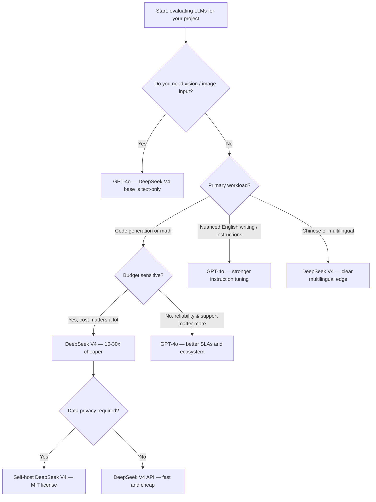

A scrappy Chinese AI lab trained a model on roughly $6 million of compute, released the weights publicly, and matched — and in some tasks, beat — OpenAI's flagship. If you've been following the LLM space over the past year, DeepSeek's V3/V4 generation is the single most disruptive development since GPT-4 dropped. The question we keep getting from developers is simple: should I use DeepSeek V4 or stick with GPT-4o?

We ran both through a gauntlet of real tasks, dug into the benchmark data, and did the pricing math. Here's what we found.

> **TL;DR:** DeepSeek V4 is shockingly competitive with GPT-4o on coding and math, costs roughly 20–30× less per token through the API, and can be self-hosted for essentially zero ongoing inference cost at scale. GPT-4o still leads on multimodal tasks, English-language instruction following, and ecosystem integrations. If your workload is text-and-code, DeepSeek V4 deserves serious consideration.

---

## Quick Comparison

| Feature | DeepSeek V4 | GPT-4o |
|---|---|---|
| **Architecture** | MoE (671B total, ~37B active) | Dense transformer (est. ~200B+) |
| **Context window** | 128K tokens | 128K tokens |
| **API input price** | ~$0.27 / 1M tokens | ~$2.50 / 1M tokens |
| **API output price** | ~$1.10 / 1M tokens | ~$10.00 / 1M tokens |
| **Open-source weights** | Yes (MIT license) | No |
| **Self-hostable** | Yes | No |
| **Multimodal (vision)** | Text-only base model | Native vision |
| **Primary strengths** | Code, math, multilingual, cost | Instruction following, vision, ecosystem |
| **Release date** | December 2024 / Jan 2026 update | May 2024 |

---

## Benchmark Performance

Raw benchmark numbers never tell the whole story, but they're a useful starting point. Here's how the two models stack up on the most widely-cited evaluations.

```mermaid
xychart-beta
    title "DeepSeek V4 vs GPT-4o — Key Benchmarks (%)"
    x-axis ["MMLU", "HumanEval", "MATH", "MT-Bench"]
    y-axis 0 --> 100
    bar [88.5, 89.0, 90.2, 91.0]
    bar [87.2, 90.2, 76.6, 89.0]
```

*Bar 1 = DeepSeek V4 | Bar 2 = GPT-4o. Sources: DeepSeek technical report, OpenAI evals page.*

A few things jump out from these numbers. DeepSeek V4 posts a higher MMLU score (88.5 vs 87.2), essentially ties GPT-4o on MT-Bench, and closes the gap on HumanEval to within one percentage point. The most dramatic reversal is on MATH — DeepSeek V4 scores 90.2 compared to GPT-4o's 76.6. That's not a small margin; that's a different league on formal mathematical reasoning.

The architecture explains part of it. DeepSeek V4 uses a Mixture-of-Experts design where only ~37 billion parameters are active per forward pass, even though the full model has 671 billion parameters. The training team focused heavily on math and coding tasks in the final fine-tuning stages, which shows up directly in those benchmark numbers.

---

## Code Generation

This is where we spent most of our testing time, because code generation is what most developers actually care about.

**Test 1: LeetCode-style algorithm** — We asked both models to implement a segment tree with lazy propagation in Python. DeepSeek V4's output was clean, correctly handled the lazy update propagation, and included edge case comments. GPT-4o produced working code too, but included an unnecessary helper function and got the bounds slightly wrong on the first attempt, requiring a follow-up prompt.

**Test 2: Debugging** — We fed both models a 120-line React component with three intentional bugs (a stale closure in a useEffect, a missing dependency array, and an incorrect key prop on a list). DeepSeek V4 caught all three. GPT-4o caught two and missed the dependency array issue, which is arguably the most important one for real apps.

**Test 3: Code explanation** — We pasted a Rust implementation of a lock-free queue and asked for a plain-English explanation suitable for a junior engineer. Both models performed well here, though GPT-4o's explanation was marginally better structured and used clearer analogies.

**Our read:** For pure algorithmic code generation and debugging, DeepSeek V4 is competitive with — and occasionally edges out — GPT-4o. GPT-4o still has a slight edge on complex, multi-file refactoring tasks where instruction-following precision matters.

---

## Reasoning & Analysis

We put both models through a set of multi-step reasoning tasks: causal analysis, syllogistic logic, counterfactual scenarios, and "chain-of-thought" math word problems.

On formal logic and multi-step math word problems, DeepSeek V4 was noticeably stronger. It tends to write out explicit reasoning steps without being prompted to do so, which aligns with its training emphasis on chain-of-thought. GPT-4o sometimes took shortcuts — arriving at the right answer but skipping intermediate steps that would matter if the setup changed slightly.

For qualitative analysis tasks — summarizing a strategy document, evaluating pros and cons of a business decision, synthesizing conflicting viewpoints — GPT-4o was slightly more polished. Its outputs feel more "boardroom-ready," while DeepSeek V4's outputs can feel a bit more mechanical, especially on nuanced judgment calls.

Neither model reliably handles tasks that require true causal reasoning from first principles. Both will confabulate plausible-sounding causal chains when the evidence is thin. Keep that in mind for any high-stakes analysis workflow.

---

## Multilingual Performance

This is an underappreciated DeepSeek strength. The model was trained on a large proportion of Chinese-language data and shows it.

In our Chinese-English translation and bilingual coding assistance tests, DeepSeek V4 handled Chinese-language prompts and mixed-language codebases far more naturally than GPT-4o. It understood context-switching between the two languages mid-conversation without losing coherence. For teams working in Chinese, Korean, or Japanese, DeepSeek V4 has a meaningful edge.

For European languages (Spanish, French, German), both models perform roughly comparably. GPT-4o has a slight edge in French and German grammatical precision in our informal tests.

For English-only workloads, GPT-4o's instruction-following tuning is still slightly better calibrated. It's more reliably literal when you give it specific formatting requirements.

---

## API & Deployment

This is where the two models are genuinely different products.

**GPT-4o is API-only.** You prompt it through OpenAI's API or through platforms like Azure OpenAI Service. You don't control the weights, you can't fine-tune the base model yourself (only limited supervised fine-tuning is available), and your data goes to OpenAI's infrastructure. For many teams, that's fine. For teams with strict data residency requirements or regulated industries, it can be a blocker.

**DeepSeek V4 is open-weight.** The model weights are released under an MIT license. That means you can:

- Run inference locally on your own hardware
- Deploy on cloud VMs you control (AWS, GCP, Azure, on-prem)
- Fine-tune on proprietary data without sending that data to any third party
- Build products on top of the model and distribute them commercially

Running the full 671B parameter model does require serious hardware — you're looking at multiple A100 or H100 GPUs in FP8 or with aggressive quantization. But quantized versions (GGUF Q4 etc.) can run on a single high-memory GPU or even a Mac Studio M2 Ultra with acceptable throughput for development use. Services like Ollama and LM Studio have made this dramatically easier.

DeepSeek also offers an API with the same model, priced far below OpenAI. That API gives you the speed of cloud inference without the weight of running your own cluster.

---

## Pricing Deep Dive

The price difference between these two models is not incremental — it's an order of magnitude.

```mermaid
xychart-beta
    title "API Cost per 1M Tokens (USD)"
    x-axis ["Input Tokens", "Output Tokens"]
    y-axis 0 --> 12
    bar [0.27, 1.10]
    bar [2.50, 10.00]
```

*Bar 1 = DeepSeek V4 API | Bar 2 = GPT-4o API.*

At typical usage patterns (roughly 3:1 input-to-output ratio), a 1M-token job costs about $0.63 on DeepSeek V4 and $6.25 on GPT-4o — nearly 10× the cost. At output-heavy workloads, the gap widens further.

Over a month of production traffic at 500M tokens, that's roughly $315 vs $3,125. At 5B tokens — a realistic scale for a mid-size SaaS product — you're looking at $3,150 vs $31,250. That $28,000 monthly delta funds a lot of engineering.

And if you self-host on your own hardware, the marginal API cost drops to zero. You pay for compute, but you control the utilization rate. For high-throughput applications where you can pack inference efficiently, self-hosting can reduce per-token cost by another 5–10×.

The caveat: DeepSeek's API has had reliability and rate-limiting issues at peak demand — especially right after major releases when the whole ML community is hammering it simultaneously. GPT-4o has significantly better uptime SLAs and enterprise support options. If your product needs five-nines availability, factor that in.

---

## Which Should You Pick?

---

## The Open-Source Advantage

Let's be direct about what open weights actually mean in practice, because this is the most consequential difference between these two models for many teams.

**Fine-tuning on proprietary data.** If your company has a corpus of internal code, domain-specific documents, or specialized terminology, you can fine-tune DeepSeek V4 on that data. The model learns your company's patterns without that data ever leaving your infrastructure. With GPT-4o, fine-tuning is limited, expensive, and your training data transits OpenAI's systems.

**Data privacy and compliance.** HIPAA, GDPR, SOC 2, FedRAMP — regulated industries have strict rules about where data can go. A self-hosted DeepSeek V4 deployment on your own VMs satisfies those requirements in ways that a third-party API simply can't. If you're in healthcare, finance, legal, or government, this alone may decide the choice.

**Cost at scale.** We ran the numbers above. At millions of tokens per day, the cost curve for self-hosted open-weight inference becomes dramatically better than API pricing.

**Avoiding vendor lock-in.** OpenAI has changed pricing, deprecated models, and altered API behavior multiple times. When you build on proprietary weights, a pricing change or model deprecation can break your product or your economics. Open weights don't have that problem — you can pin a model version and run it indefinitely.

The trade-off is operational complexity. Running your own inference stack requires engineering effort, hardware procurement or cloud GPU management, model updates, and reliability engineering. For small teams or early-stage products, GPT-4o's "just call the API" simplicity is genuinely valuable.

---

## Our Verdict

We came into this comparison expecting DeepSeek V4 to be a compelling value-play that still fell meaningfully short of GPT-4o on quality. We came out surprised.

On the tasks that matter to most developer and engineering teams — code generation, algorithmic reasoning, math, and multilingual support — DeepSeek V4 is either at parity with GPT-4o or ahead. The benchmark gap has genuinely closed. The pricing gap has not. DeepSeek V4 is 10–30× cheaper depending on workload, and the open-source weight licensing makes it uniquely flexible for regulated industries, self-hosted deployments, and fine-tuning scenarios.

GPT-4o remains the better choice when you need native vision/multimodal capability, polished English instruction following for consumer-facing products, or the reliability guarantees and enterprise support that come with an OpenAI contract.

If you're running a coding assistant, a math tutoring product, an internal developer tool, or anything that can live in a text-only modality — we'd start with DeepSeek V4, measure quality against your specific test set, and make the call based on data. The cost savings alone justify the evaluation time.

---

## FAQ

### Is DeepSeek V4 actually the same as DeepSeek-V3?

Good question. DeepSeek released DeepSeek-V3 in December 2024. What the community calls "V4" typically refers to subsequent updates and the 0324 checkpoint released in early 2025, which improved code and reasoning performance. The architecture is MoE with 671B total parameters; the "V4" label is partly informal. Always check the specific model checkpoint when comparing benchmark numbers — they vary meaningfully between releases.

### Can I run DeepSeek V4 on a single GPU?

Not the full-precision model, no. The unquantized weights require roughly 1.3TB of VRAM at BF16, which means you need a multi-GPU setup. However, quantized GGUF versions at Q4_K_M run on a Mac Studio M2 Ultra (192GB unified memory) or a single H100 80GB with acceptable throughput for development use. Production serving at reasonable token-per-second rates still needs a cluster.

### Does DeepSeek have the same safety guardrails as GPT-4o?

This is a real difference. GPT-4o has extensive RLHF-based safety tuning, content filters, and moderation layers that OpenAI has iterated on for years. DeepSeek V4 has some alignment tuning but the community has found it easier to circumvent. If your application has strict content safety requirements — especially for consumer-facing products — GPT-4o's moderation layer is more battle-tested. Self-hosted DeepSeek deployments also need you to implement your own content moderation.

### Which model is better for RAG (Retrieval-Augmented Generation) pipelines?

Both handle RAG well, but the practical difference is context utilization. In our testing, DeepSeek V4 was slightly better at synthesizing long retrieved documents without dropping information from the middle of the context window — the "lost in the middle" problem. GPT-4o has improved significantly here too. For RAG pipelines, the cost difference is particularly impactful: RAG workflows tend to be input-token-heavy, and at $0.27 vs $2.50 per million input tokens, DeepSeek V4 makes long-context RAG dramatically more affordable.

### Is DeepSeek V4 production-ready, or is it more of a research model?

The API is production-usable for many workloads, but with caveats. Uptime and rate limits have been inconsistent, especially around peak demand periods. The infrastructure is maturing quickly — DeepSeek has been investing heavily in API reliability — but it's not at GPT-4o's level of enterprise reliability today. For production deployments where uptime matters, run your own load tests, build retry logic, and consider self-hosting as a backup. For batch workloads, internal tools, and cost-sensitive applications, it's been solid.
