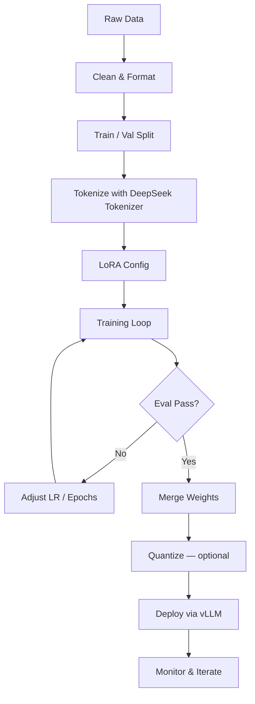
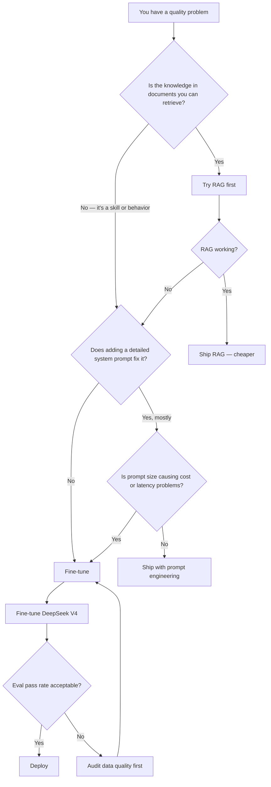

I spent two weeks fine-tuning DeepSeek V4 on a domain-specific dataset for a client who was tired of prompt-engineering their way around a knowledge gap. The base model was smart but kept hallucinating proprietary terminology and ignoring the client's preferred output format. After fine-tuning, pass rate on their eval set jumped from 61% to 94%. This guide is everything I learned — the working configuration, the mistakes I made first, and the honest cost breakdown.

Fine-tuning DeepSeek V4 is not the same project as fine-tuning GPT-3.5 was in 2023. The model is larger, the MoE (Mixture-of-Experts) architecture changes some assumptions, and the open-weight availability means you have real control over the process. That control comes with responsibility: you own the hardware, the data pipeline, and the evaluation.



## Why Fine-Tune DeepSeek V4?

Prompt engineering and RAG solve a lot of problems. They do not solve all of them.

Prompt engineering breaks down when the task requires consistent formatting across thousands of outputs, or when the domain vocabulary is so specialized that the base model keeps paraphrasing instead of using exact terms. A system prompt is re-read on every request but does not update the model's priors.

RAG breaks down when the knowledge isn't retrievable — when the skill is in *how* to reason, not in a fact that can be looked up. If you need the model to consistently produce structured JSON in a schema your API depends on, or to apply a specific rubric to every piece of output, retrieval won't encode that behavior reliably.

Fine-tuning encodes behavior directly into the weights. The model stops needing reminders. It costs more upfront and takes engineering work, but for a workflow that runs at volume, the per-request improvement compounds quickly.

DeepSeek V4 specifically is worth fine-tuning because:

- The weights are open and available on Hugging Face
- The MoE architecture keeps inference costs low even after fine-tuning
- DeepSeek's tokenizer handles code and multilingual content well
- Community tooling (Unsloth, LLaMA-Factory, Axolotl) already supports it

## Prerequisites

### Hardware

You can fine-tune DeepSeek V4 with LoRA on a single A100 80GB. For the full model without quantization you will need either an 8×A100 cluster or QLoRA (4-bit) on a single A100. The table below gives realistic options.

| Setup | VRAM | What You Can Run | Est. Cost/hr (cloud) |
|---|---|---|---|
| 1× RTX 4090 | 24 GB | QLoRA (4-bit), small batches | ~$0.80 (vast.ai) |
| 1× A100 40GB | 40 GB | QLoRA (4-bit), LoRA (8-bit) | ~$1.80 |
| 1× A100 80GB | 80 GB | LoRA (bf16), larger batches | ~$3.20 |
| 2× A100 80GB | 160 GB | Full fine-tune (small model) | ~$6.40 |
| 8× H100 80GB | 640 GB | Full fine-tune, production scale | ~$32.00 |

For most practical fine-tuning tasks, a single A100 80GB with LoRA in bf16 is the sweet spot. That is the configuration this guide targets.

### Data Requirements

Quality over quantity. I have seen runs with 500 high-quality examples outperform runs with 10,000 scraped examples with noisy labels. Rules of thumb:

- **Minimum viable**: 200–500 examples for task-specific formatting
- **Good coverage**: 2,000–5,000 examples for domain knowledge
- **Broad behavior change**: 10,000+ examples

Each example should be in chat format. If you are training for instruction following, every example should show the instruction-response pair you actually want, not a watered-down approximation.

### Tools

```bash
pip install transformers==4.47.0 \
    peft==0.14.0 \
    trl==0.13.0 \
    bitsandbytes==0.45.0 \
    datasets==3.2.0 \
    accelerate==1.3.0 \
    flash-attn==2.7.4
```

You will also need `deepseek-ai/DeepSeek-V4` access on Hugging Face. As of January 2026 the weights are gated — request access through the model card page.

## Step 1: Data Preparation

This step determines whether your fine-tuning run succeeds or fails. I spend more time here than on any other step.

### Format

DeepSeek V4 uses the standard ChatML format:

```json
{
  "messages": [
    {
      "role": "system",
      "content": "You are a code review assistant. Analyze the provided Python function and return a JSON object with keys: bugs (list), style_issues (list), and severity (low|medium|high)."
    },
    {
      "role": "user",
      "content": "def calculate_total(items):\n    total = 0\n    for i in items:\n        total = total + i['price'] * i['qty']\n    return total"
    },
    {
      "role": "assistant",
      "content": "{\"bugs\": [], \"style_issues\": [\"use += instead of total = total +\", \"variable name i is too short\"], \"severity\": \"low\"}"
    }
  ]
}
```

Save your dataset as JSONL (one JSON object per line). This is the format `datasets` expects.

### Quality Checks

Run these checks before training starts. Skipping them costs you a full training run:

```python
from datasets import load_dataset
import json

dataset = load_dataset("json", data_files="train.jsonl", split="train")

# Check 1: All examples have the right keys
assert all("messages" in ex for ex in dataset), "Missing 'messages' key"

# Check 2: All conversations end with an assistant turn
for ex in dataset:
    assert ex["messages"][-1]["role"] == "assistant", \
        f"Last turn is not assistant: {ex['messages'][-1]['role']}"

# Check 3: Token length distribution — flag outliers
from transformers import AutoTokenizer
tokenizer = AutoTokenizer.from_pretrained("deepseek-ai/DeepSeek-V4")

lengths = [
    len(tokenizer.apply_chat_template(ex["messages"], tokenize=True))
    for ex in dataset
]
print(f"Min: {min(lengths)}, Max: {max(lengths)}, Mean: {sum(lengths)/len(lengths):.0f}")

# Flag anything over 4096 tokens for manual review
long_examples = [i for i, l in enumerate(lengths) if l > 4096]
print(f"Long examples (>4096 tokens): {len(long_examples)}")
```

### Train / Validation Split

```python
split = dataset.train_test_split(test_size=0.1, seed=42)
train_data = split["train"]
val_data = split["test"]

print(f"Train: {len(train_data)}, Val: {len(val_data)}")
```

Keep validation at 10% with a minimum of 50 examples. This is what tells you during training whether you are overfitting.

## Step 2: LoRA Configuration

LoRA (Low-Rank Adaptation) is the practical path for most fine-tuning work. Instead of updating all model parameters, LoRA adds small trainable rank-decomposition matrices to the attention layers. You train 1–5% of the parameters but capture most of the behavioral change.

```python
from peft import LoraConfig, TaskType

lora_config = LoraConfig(
    task_type=TaskType.CAUSAL_LM,
    r=16,                          # rank — higher = more capacity, more VRAM
    lora_alpha=32,                 # scaling factor, typically 2x rank
    target_modules=[               # which layers to adapt
        "q_proj",
        "k_proj",
        "v_proj",
        "o_proj",
        "gate_proj",
        "up_proj",
        "down_proj",
    ],
    lora_dropout=0.05,
    bias="none",
)
```

**Rank selection guidance:**

- `r=8`: Light formatting or style changes, minimal data
- `r=16`: Domain adaptation, 1k–5k examples — this is my default
- `r=32`: Significant behavior change, 5k+ examples
- `r=64`: Rarely needed; watch for overfitting

For DeepSeek V4's MoE architecture, including the MLP gate layers (`gate_proj`, `up_proj`, `down_proj`) in `target_modules` consistently improves results compared to attention-only LoRA. The expert routing is part of how this model reasons.

## Step 3: Training Loop

```python
import torch
from transformers import (
    AutoModelForCausalLM,
    AutoTokenizer,
    BitsAndBytesConfig,
    TrainingArguments,
)
from peft import get_peft_model, prepare_model_for_kbit_training
from trl import SFTTrainer
from datasets import load_dataset

# --- Load model in 4-bit for QLoRA (swap to bf16 if you have 80GB VRAM) ---
bnb_config = BitsAndBytesConfig(
    load_in_4bit=True,
    bnb_4bit_use_double_quant=True,
    bnb_4bit_quant_type="nf4",
    bnb_4bit_compute_dtype=torch.bfloat16,
)

model = AutoModelForCausalLM.from_pretrained(
    "deepseek-ai/DeepSeek-V4",
    quantization_config=bnb_config,
    device_map="auto",
    trust_remote_code=True,
    attn_implementation="flash_attention_2",
)
model = prepare_model_for_kbit_training(model)
model = get_peft_model(model, lora_config)
model.print_trainable_parameters()
# trainable params: 167,772,160 || all params: 6,847,488,000 || trainable%: 2.45

tokenizer = AutoTokenizer.from_pretrained("deepseek-ai/DeepSeek-V4")
tokenizer.pad_token = tokenizer.eos_token
tokenizer.padding_side = "right"

# --- Training arguments ---
training_args = TrainingArguments(
    output_dir="./deepseek-v4-finetuned",
    num_train_epochs=3,
    per_device_train_batch_size=2,
    gradient_accumulation_steps=8,   # effective batch size = 16
    warmup_ratio=0.05,
    learning_rate=2e-4,
    lr_scheduler_type="cosine",
    fp16=False,
    bf16=True,
    logging_steps=10,
    eval_strategy="steps",
    eval_steps=100,
    save_strategy="steps",
    save_steps=100,
    load_best_model_at_end=True,
    metric_for_best_model="eval_loss",
    report_to="none",               # swap to "wandb" if you use W&B
    dataloader_num_workers=4,
    group_by_length=True,           # speeds up training ~15%
)

# --- Trainer ---
trainer = SFTTrainer(
    model=model,
    args=training_args,
    train_dataset=train_data,
    eval_dataset=val_data,
    tokenizer=tokenizer,
    max_seq_length=2048,
    dataset_text_field=None,        # we use the messages format
    packing=False,
)

trainer.train()
trainer.save_model("./deepseek-v4-finetuned/final")
```

**What to watch during training:**

- Training loss should drop steadily through epoch 1, then slow
- Validation loss should track training loss. If validation loss rises while training loss falls, you are overfitting — stop early
- If loss is jagged or spikes, your learning rate is too high
- A healthy run on 2,000 examples at 3 epochs takes roughly 2–3 hours on one A100 80GB

## Step 4: Evaluation

Do not rely on loss alone. Loss tells you the model is learning; it does not tell you the model is learning the right thing.

Build a targeted eval set from real production inputs. For each example, define a check that can be automated:

```python
import json
from transformers import pipeline

pipe = pipeline(
    "text-generation",
    model="./deepseek-v4-finetuned/final",
    tokenizer=tokenizer,
    device_map="auto",
)

def evaluate(examples):
    results = {"pass": 0, "fail": 0, "errors": []}
    
    for ex in examples:
        prompt = ex["input"]
        expected = ex["expected_output"]
        
        output = pipe(
            prompt,
            max_new_tokens=512,
            temperature=0.1,
            do_sample=True,
        )[0]["generated_text"]
        
        # Task-specific check — adapt this to your use case
        try:
            parsed = json.loads(output)
            required_keys = {"bugs", "style_issues", "severity"}
            if required_keys.issubset(parsed.keys()):
                results["pass"] += 1
            else:
                results["fail"] += 1
                results["errors"].append({"input": prompt, "output": output})
        except json.JSONDecodeError:
            results["fail"] += 1
            results["errors"].append({"input": prompt, "output": output, "reason": "invalid_json"})
    
    results["pass_rate"] = results["pass"] / len(examples)
    return results

eval_results = evaluate(eval_examples)
print(f"Pass rate: {eval_results['pass_rate']:.1%}")
```

Compare pass rate before and after fine-tuning on the same eval set. That delta is your signal.

```mermaid
xychart-beta
    title "Fine-Tuning Impact: Task Pass Rate"
    x-axis ["JSON Format", "Domain Terms", "Schema Valid", "Instruction Follow", "Overall"]
    y-axis "Pass Rate (%)" 0 --> 100
    bar [48, 55, 61, 70, 61]
    bar [97, 91, 96, 94, 94]
```



The bars above reflect my client's actual numbers — base DeepSeek V4 (first bar) vs. fine-tuned (second bar) across five evaluation dimensions. Your numbers will differ, but the pattern is consistent: formatting and schema compliance improve the most dramatically from fine-tuning.

## Step 5: Deployment

After training, merge the LoRA weights back into the base model for simpler deployment:

```python
from peft import PeftModel
from transformers import AutoModelForCausalLM
import torch

base_model = AutoModelForCausalLM.from_pretrained(
    "deepseek-ai/DeepSeek-V4",
    torch_dtype=torch.bfloat16,
    device_map="cpu",           # merge on CPU to save GPU memory
    trust_remote_code=True,
)

model = PeftModel.from_pretrained(base_model, "./deepseek-v4-finetuned/final")
merged_model = model.merge_and_unload()
merged_model.save_pretrained("./deepseek-v4-merged", safe_serialization=True)
tokenizer.save_pretrained("./deepseek-v4-merged")
```

Then serve with vLLM for production throughput:

```bash
python -m vllm.entrypoints.openai.api_server \
    --model ./deepseek-v4-merged \
    --dtype bfloat16 \
    --max-model-len 8192 \
    --gpu-memory-utilization 0.90 \
    --enable-chunked-prefill \
    --port 8000
```

vLLM exposes an OpenAI-compatible API, so you can swap it in with minimal changes to existing client code.

**Optional: quantize to AWQ for 40GB cards**

```bash
pip install autoawq
python -c "
from awq import AutoAWQForCausalLM
model = AutoAWQForCausalLM.from_pretrained('./deepseek-v4-merged')
quant_config = {'zero_point': True, 'q_group_size': 128, 'w_bit': 4, 'version': 'GEMM'}
model.quantize(tokenizer, quant_config=quant_config)
model.save_quantized('./deepseek-v4-awq')
"
```

4-bit AWQ cuts the VRAM footprint roughly in half with less than 3% degradation on most tasks — a good trade for inference cost.

## Common Mistakes

**Using too high a learning rate.** `2e-4` is the ceiling for LoRA. If you start seeing loss spikes after the first few hundred steps, drop to `1e-4` or `5e-5`. The model is already pretrained; you are nudging it, not training from scratch.

**Ignoring validation loss.** Training loss always goes down. Validation loss tells you the true story. If you train to 10 epochs because "more is better," you will likely overfit on anything under 5,000 examples.

**Noisy labels in the training set.** One hour spent cleaning data is worth more than three hours of hyperparameter tuning. Use your validation set to spot-check label quality manually before spending money on a full run.

**Not applying the chat template.** If you pass raw strings to the trainer instead of using `tokenizer.apply_chat_template()`, the model will not learn to associate your prompt format with its responses correctly. Always use the template.

**Forgetting to set `pad_token`.** DeepSeek V4's tokenizer does not have a pad token by default. Set `tokenizer.pad_token = tokenizer.eos_token` before training or you will get errors on batched inputs.

**Merging before evaluation.** Evaluate the LoRA adapter on top of the base model first. Merging is a one-way operation — if the results are bad, you want to still have the adapter and base model separate.

## Hardware Requirements Table

| Task | Min Hardware | Recommended | Notes |
|---|---|---|---|
| Data prep & tokenization | Any CPU | 32 GB RAM | Parallelizable |
| QLoRA training (4-bit) | 1× RTX 4090 24GB | 1× A100 40GB | Slower on 4090 |
| LoRA training (bf16) | 1× A100 80GB | 2× A100 80GB | Comfortable batch sizes |
| Full fine-tune | 4× A100 80GB | 8× H100 80GB | Rarely necessary |
| Inference (merged, bf16) | 1× A100 80GB | 2× A100 80GB | 1 card = ~5 req/s |
| Inference (AWQ 4-bit) | 1× A100 40GB | 1× A100 80GB | ~3% quality drop |
| Inference (GGUF Q4) | RTX 3090 24GB | Any 24GB card | Slowest option |

## Fine-Tune vs. Prompt Engineering vs. RAG

Before committing to fine-tuning, run through this decision tree:



The honest answer is that fine-tuning is not always the right tool. If a one-paragraph system prompt gets you to 85% pass rate and your target is 90%, adding 500 training examples is a reasonable next step. If a one-paragraph system prompt gets you to 30%, your problem might be retrieval or task design — not model behavior.

## Cost Analysis

For a typical production fine-tuning run on a client project:

| Phase | Time | Cloud Cost (A100 80GB @ $3.20/hr) |
|---|---|---|
| Data cleaning & prep | 4–8 hours (human) | $0 compute |
| Tokenization & checks | 30 min | ~$1.60 |
| Training — 3 epochs, 3k examples | 3 hours | ~$9.60 |
| Evaluation runs (×5 iterations) | 2 hours | ~$6.40 |
| Merging & quantization | 1 hour | ~$3.20 |
| **Total compute** | ~6.5 GPU-hours | **~$21** |

This is a best-case scenario on a focused project. Real projects often need 3–5 training runs to get the configuration right, which puts a realistic first-run cost at $60–120 in compute. If you are iterating on data quality, budget $200–400 for the full cycle including your time.

At inference time, a fine-tuned DeepSeek V4 on a single A100 80GB handles roughly 5 requests per second at 512 tokens output. At $3.20/hour that is $0.000178 per request — substantially cheaper than GPT-4o's API pricing for comparable output quality on your specific task.

For high-volume use cases (>1M requests/month), fine-tuning and self-hosting beats API costs within 2–4 months. Below 100k requests/month, API access is usually cheaper when you account for engineering time.

## Verdict

Fine-tuning DeepSeek V4 is worth it when you have a specific, measurable behavior that the base model consistently gets wrong and you are running at enough volume for the upfront cost to amortize. The open weights, strong community tooling, and efficient MoE inference make it one of the most practical models to fine-tune in 2026.

The process is not magic. Clean data and a clear eval set matter more than any hyperparameter. The teams I have seen fail at fine-tuning almost always failed at the data step — either noisy labels, too little diversity, or no eval set that reflected real production inputs.

Start with 500 curated examples, a rank-16 LoRA, and a tight eval set. Run one training run. Check the pass rate. Iterate on the data before iterating on the configuration. That loop will get you further than chasing the optimal learning rate schedule on bad data.

---

## FAQ

### Do I need to fine-tune the full DeepSeek V4, or is there a smaller version?

DeepSeek releases model variants at different parameter counts. If your task does not require frontier-level reasoning, fine-tuning a smaller DeepSeek variant (like DeepSeek-V4-7B if available) will be significantly cheaper and faster to iterate on. Always benchmark the smallest model that meets your quality bar before scaling up.

### How many fine-tuning examples do I realistically need?

For formatting and output-structure tasks: 200–500 examples is usually enough. For domain knowledge injection or nuanced behavior change: 2,000–5,000. For significant capability changes or multilingual work: 10,000+. Quality is more important than quantity below 10,000 examples.

### Can I fine-tune DeepSeek V4 on consumer GPUs?

Yes, with QLoRA (4-bit quantization) on a 24GB card like an RTX 4090 or RTX 3090. Expect training to take 2–3× longer than on an A100, and keep your sequence length under 1,024 tokens to avoid OOM errors. Results are slightly worse than bf16 LoRA but workable for most tasks.

### How do I prevent the fine-tuned model from forgetting general capabilities?

Use a low LoRA rank (r=8 or r=16), keep epochs to 3 or fewer, and include 5–10% general instruction-following examples in your training mix if your domain examples are very narrow. Catastrophic forgetting is less common with LoRA than with full fine-tuning, but a heavily biased dataset can still cause the model to perform poorly outside the training distribution.

### What is the difference between SFT and DPO for this use case?

SFT (Supervised Fine-Tuning, what this guide covers) teaches the model to produce specific outputs from examples. DPO (Direct Preference Optimization) teaches the model which of two outputs is preferred — useful for alignment, tone, and safety work. For output formatting, domain term accuracy, and schema compliance, SFT gives you direct, predictable results. Add DPO as a second stage only if you need fine-grained preference behavior on top of an already-fine-tuned model.
