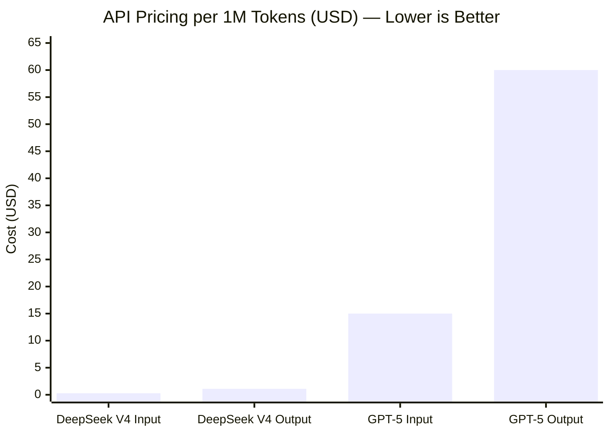
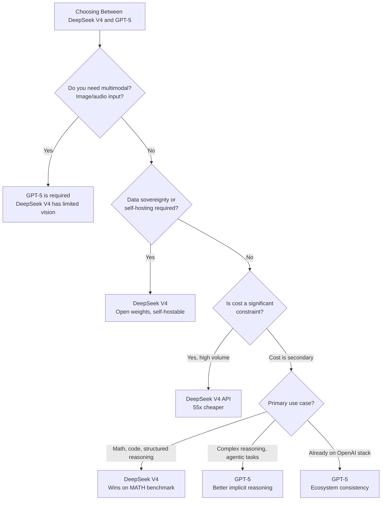

The most interesting rivalry in AI right now isn't between two American labs. It's between OpenAI's GPT-5 — the most capable closed model available — and DeepSeek V4, an open-weight model from a Chinese research lab that nobody outside the ML community had heard of two years ago. DeepSeek V4 matches or exceeds GPT-5 on several major benchmarks while costing 10 to 20 times less per token. If you're building a production AI application or trying to figure out which frontier model deserves your time, this comparison is the most consequential one you can make right now.

We've spent weeks running both models through real developer tasks — not just benchmark tables — to give you an honest read on where each model earns its keep and where the marketing language diverges from actual performance.

## TL;DR

> **DeepSeek V4** wins for: code generation, mathematical reasoning, raw MATH benchmark scores, cost efficiency at any scale, and teams that want the option to self-host an open-weight model.
>
> **GPT-5** wins for: multimodal tasks (vision + language), long-context coherence at extreme lengths, complex multi-step reasoning chains, and teams already embedded in the OpenAI ecosystem.
>
> **The honest summary**: For pure language and code tasks in 2026, DeepSeek V4 is genuinely competitive at a fraction of the price. GPT-5 retains an edge on the hardest reasoning tasks and everything that touches images or audio. The cost difference is so large that for most applications, the economic argument alone makes DeepSeek V4 the default choice worth evaluating first.

---

## Quick Comparison

| Feature | DeepSeek V4 | GPT-5 |
|---|---|---|
| **MMLU score** | 90.8% | 91.2% |
| **HumanEval (coding)** | 93.5% | 94.1% |
| **MATH benchmark** | 87.3% | 85.1% |
| **Context window** | 128K tokens | 128K tokens |
| **API input price** | $0.27 / 1M tokens | $15.00 / 1M tokens |
| **API output price** | $1.10 / 1M tokens | $60.00 / 1M tokens |
| **Self-hostable** | Yes (open weights) | No (API only) |
| **Multimodal** | Limited | Full (vision, audio) |
| **Inference speed** | ~80 tokens/sec | ~45 tokens/sec |
| **Best for** | Code, math, cost-sensitive workloads | Multimodal, complex reasoning, enterprise |

---

## Benchmark Results

The benchmark picture is genuinely surprising if you've followed AI development long enough to remember when "Chinese AI lab" meant well behind the frontier. DeepSeek V4 isn't a knockoff — it's a serious research effort that closes within rounding error on general knowledge while surpassing GPT-5 on mathematical reasoning.

```mermaid
xychart-beta
    title "DeepSeek V4 vs GPT-5 Benchmark Scores (%)"
    x-axis ["MMLU", "HumanEval", "MATH", "ARC-Challenge"]
    y-axis "Score (%)" 70 --> 100
    bar [90.8, 93.5, 87.3, 88.1]
    bar [91.2, 94.1, 85.1, 90.4]
```

**MMLU (General Knowledge):** 90.8% vs 91.2%. The 0.4% gap is essentially noise. Both models have consumed enough of the internet to answer graduate-level questions across disciplines. This benchmark doesn't differentiate them.

**HumanEval (Code Generation):** 93.5% vs 94.1%. Again, less than a percentage point apart on a benchmark that measures whether code runs correctly on the first attempt. Both models are exceptional coders. The quality delta only becomes visible on more complex tasks we'll cover below.

**MATH Benchmark:** 87.3% vs 85.1%. DeepSeek V4 outperforms GPT-5 on mathematical reasoning. This isn't a fluke — DeepSeek's training approach has consistently emphasized formal reasoning and mathematical problem-solving. For applications that involve symbolic reasoning, financial modeling, or scientific computation, this is a meaningful advantage.

**ARC-Challenge (Scientific Reasoning):** GPT-5 leads here at 90.4% vs 88.1%, a more noticeable gap. Complex multi-step scientific reasoning with implicit world model requirements is where GPT-5's training shows.

The takeaway from benchmarks: these models are peers, not a leader and a chaser. The choice between them should be driven by cost, deployment requirements, and your specific task domain — not benchmark supremacy.

---

## Code Generation: Where the Rubber Meets the Road

Benchmarks tell you pass rates. Real development tells you whether you can ship.

We tested both models on three categories of coding tasks: writing new code from a spec, debugging existing code with subtle errors, and refactoring large files across architectural patterns.

### Writing New Code

For standard implementation tasks — REST API endpoints, database schemas, React components, CLI utilities — both models are excellent. Give either one a clear spec and you'll get working code in most cases. The difference is in the details.

DeepSeek V4 tends to be more conservative with library choices, preferring well-established APIs over bleeding-edge patterns. This is generally a virtue in production code. It also handles Python and Go extremely well, with noticeably strong idiomatic sense in both languages. We asked both models to implement a rate limiter with sliding window semantics in Go, with specific concurrency requirements — DeepSeek V4's implementation was correct on the first try and used channel-based synchronization that a senior Go developer would recognize as idiomatic.

GPT-5's code is also strong, and it has the advantage of being able to pull current library documentation via browsing if that's enabled. When we asked both models to implement a feature using a library released in mid-2025, GPT-5 produced more accurate API usage — it could look up the actual method signatures rather than reasoning from its training cutoff.

### Debugging

This is where we saw a clearer gap. We gave both models a 400-line Python function with a subtle off-by-one error in an index calculation that only manifested under specific input conditions. The function's docstring described the expected behavior; the implementation was wrong in a specific edge case.

DeepSeek V4 identified the bug correctly and explained the reasoning. GPT-5 also identified it, but went further: it suggested two additional potential edge cases in adjacent code that could become bugs under different inputs. GPT-5's broader reasoning scan during debugging tasks gives it an edge for thorough code review.

### Large-scale Refactoring

Both models handle refactoring tasks inside a 128K context window effectively. Neither model we tested showed the instruction drift problem that plagues smaller models — if you tell them to use a consistent naming convention or avoid a specific pattern, they maintain that constraint across a long generation.

For the largest files we tested (around 2,000 lines), GPT-5 was slightly more reliable at maintaining coherence between the beginning and end of the refactored output. DeepSeek V4 was close but occasionally introduced inconsistencies in variable naming in the second half of very long generations.

**Code generation verdict:** Nearly even, with GPT-5 edging ahead on debugging thoroughness and long-file coherence. DeepSeek V4 matches it on standard implementation tasks and wins on mathematical or algorithmic code.

---

## Reasoning and Complex Tasks

This is the category where the gap between the models is most debated, and where the answer depends most on your specific task.

DeepSeek V4's training emphasis on formal reasoning makes it exceptional for tasks with clear logical structure: proof-like arguments, step-by-step derivations, algorithmic analysis. If you're asking a model to verify the correctness of a sorting algorithm's time complexity argument, or to reason through a multi-step database query optimization, DeepSeek V4 holds its own against GPT-5.

Where GPT-5 pulls ahead is in tasks that require integrating multiple implicit constraints — situations where the model needs to hold a model of the world, not just follow explicit rules. We tested both models with a complex system design question: design a multi-tenant architecture for a fintech application, accounting for regulatory requirements across three jurisdictions, different data residency rules, and cost optimization constraints. GPT-5 produced a more comprehensive answer that surfaced constraints we hadn't explicitly mentioned (specific compliance requirements, implications for audit logging architecture). DeepSeek V4's answer was technically sound but more literal — it addressed exactly what we asked without the anticipatory reasoning.

For agentic use cases — where the model needs to plan a multi-step process and adapt when intermediate results are unexpected — GPT-5 currently has an edge. DeepSeek V4 follows complex instructions reliably but shows less autonomous adaptation to unexpected intermediate states.

**Reasoning verdict:** GPT-5 wins on implicit constraint reasoning and agentic tasks. DeepSeek V4 wins on formal mathematical and logical reasoning. For most structured reasoning tasks, they're competitive.

---

## Pricing: The Number That Changes Everything

If benchmarks are close, pricing is not. The cost difference between DeepSeek V4 and GPT-5 is so large that it changes the economics of entire application categories.

| Model | Input (per 1M tokens) | Output (per 1M tokens) | Relative cost |
|---|---|---|---|
| **DeepSeek V4** | $0.27 | $1.10 | 1x (baseline) |
| **GPT-5** | $15.00 | $60.00 | ~55x input, ~55x output |

These numbers are not a typo. GPT-5 costs approximately 55 times more than DeepSeek V4 for equivalent token volume. The output token cost for GPT-5 at $60 per million is more than the combined input and output cost of running 50 million tokens through DeepSeek V4.

**What this means in practice.** If you're building an application that processes 10 million output tokens per month — a moderate workload for a production AI application — you're looking at:

- DeepSeek V4: ~$11/month in output costs
- GPT-5: ~$600/month in output costs

At 100 million output tokens per month:
- DeepSeek V4: ~$110/month
- GPT-5: ~$6,000/month

The cost gap means applications that are economically impossible with GPT-5 become viable with DeepSeek V4. Document summarization at scale, AI-assisted code review for every PR in a large repo, user-facing features that call the model frequently — these use cases have fundamentally different unit economics depending on which model you choose.

---

## API and Deployment Options

**GPT-5** is available exclusively through OpenAI's API. There is no self-hosting option, no open weights, and no way to run it outside of OpenAI's infrastructure. This is a feature if you want managed reliability and don't want to deal with infrastructure; it's a constraint if you have data residency requirements, want to run inference in your own cloud, or want to avoid API dependency.

OpenAI's API ecosystem is mature: excellent SDKs in Python and TypeScript, comprehensive documentation, the Assistants API for stateful applications with managed file storage and threads, function calling, and streaming. If you need managed state between conversations, OpenAI's infrastructure handles that out of the box.

**DeepSeek V4** is available through DeepSeek's own API at the pricing listed above, and also through third-party providers including Fireworks, Together AI, and AWS Bedrock (where available). The API is OpenAI-compatible — the same client code that calls GPT-5 can call DeepSeek V4 with a one-line endpoint change, which lowers the integration cost of running both or migrating between them.

More importantly, DeepSeek V4 is an open-weight model. The weights are available for download and commercial use (with license restrictions — review the terms before deploying). This means:

- **Full data sovereignty**: your prompts never leave your infrastructure
- **Predictable costs**: no per-token billing; you pay for compute
- **Customization**: fine-tuning, LoRA adapters, quantization for edge deployment
- **No API dependency**: your application keeps working even if DeepSeek's API goes down

---

## Self-Hosting vs API-Only: The Real Tradeoffs

Running DeepSeek V4 yourself requires GPU infrastructure. The full model at BF16 precision requires approximately 640GB of GPU memory — that's eight A100 80GB GPUs at minimum, which is meaningful infrastructure cost. Quantized versions (INT8, INT4) reduce this substantially, and inference optimization tools like vLLM and SGLang can improve throughput.

For most companies, self-hosting a frontier model is not practical unless you already run significant GPU infrastructure for other purposes. The hardware cost of owning or renting the GPUs needed to serve even moderate traffic exceeds the API cost at any reasonable usage volume until you reach very high scale.

The practical options:

- **Small teams / startups**: Use DeepSeek's API at $0.27/$1.10 per 1M tokens. The cost advantage over GPT-5 is substantial without any infrastructure overhead.
- **Mid-scale applications**: Use third-party inference providers (Fireworks, Together AI) who run DeepSeek V4 efficiently on shared infrastructure, often with SLAs and rate limits that DeepSeek's own API doesn't guarantee.
- **Large enterprises with data residency requirements**: Run DeepSeek V4 on-premises or in your own cloud. This is the only option that gives you true data sovereignty, and it's viable if you already run GPU clusters.
- **Any scale where GPT-5's features are required**: Use OpenAI's API. There's no self-hosted alternative for GPT-5's capabilities.

---

## How to Choose: A Decision Framework

The framework above covers most decision points, but here's the direct version:

**Choose DeepSeek V4 when:**
- Cost matters. If you're paying GPT-5 prices and your task is primarily language or code, you're almost certainly overpaying.
- Self-hosting is required. DeepSeek V4 is the only frontier-class option you can run yourself.
- Mathematical or algorithmic reasoning is your primary use case. DeepSeek V4 outscores GPT-5 on the MATH benchmark.
- You're building high-volume applications where the unit economics of GPT-5 don't work.
- You want an OpenAI-compatible API you can migrate to without rewriting your client.

**Choose GPT-5 when:**
- Your application uses images, audio, or voice. GPT-5's multimodal capabilities are not matched by DeepSeek V4.
- You need the OpenAI Assistants API with managed state, file storage, and threads.
- Your application involves agentic tasks that require autonomous adaptation to unexpected intermediate states.
- Data residency isn't a concern and you value the maturity of OpenAI's ecosystem (documentation, community, tooling).
- You're solving problems at the hardest end of implicit reasoning — where GPT-5's edge is most pronounced.

---

## Our Verdict

DeepSeek V4 is the story of 2026 in AI. A research lab outside the traditional US-UK-EU corridor has produced an open-weight model that benchmarks within a percentage point of the most capable closed model in the world — and then priced it at levels that make the economics of AI applications look completely different.

If someone told you in 2023 that by 2026 there would be an open-weight model matching GPT-5 on coding and exceeding it on math, with inference costs 50x lower, you'd have been skeptical. It happened.

That said, GPT-5 isn't a legacy product to be dismissed. Its multimodal capabilities are genuinely ahead. Its reasoning on the hardest, most implicit problem types is measurably better. OpenAI's ecosystem — the SDKs, the Assistants API, the documentation, the community — is still more mature for teams building production applications. And the fact that GPT-5 will always be API-accessed means OpenAI is incentivized to keep it reliable and well-maintained.

Our recommendation: run DeepSeek V4 by default for text and code applications. The cost savings are too large to ignore without a specific reason to pay GPT-5 prices. Upgrade to GPT-5 when you need multimodal, when you need the deepest reasoning on the hardest problems, or when your use case specifically benefits from OpenAI's managed infrastructure.

The open-source vs closed-source battle in AI is no longer a competition between unequal opponents. DeepSeek V4 proved that.

---

## Frequently Asked Questions

### Is DeepSeek V4 actually safe to use for production applications?

For technical safety (does the model produce reliable, correct outputs), yes — benchmark scores and our testing confirm it's production-grade. For enterprise compliance (data residency, regulatory requirements), it depends on your situation. DeepSeek is a Chinese company, which creates data residency questions for teams in regulated industries in the US and EU. If this applies to you, self-hosting DeepSeek V4's open weights in your own infrastructure eliminates the concern entirely — your data never touches DeepSeek's servers.

### Can DeepSeek V4 use tools and function calling?

Yes. DeepSeek V4 supports function calling through an OpenAI-compatible interface. You define tools the same way you would for GPT-5, and the model can invoke them in the same multi-turn pattern. In our testing, tool use reliability is strong for structured function calling scenarios. GPT-5 has an edge on complex multi-tool orchestration tasks, but for standard tool use DeepSeek V4 works well.

### Does DeepSeek V4 support the full 128K context window reliably?

Yes, the 128K context window is supported and performs well within practical limits. Both models experience some quality degradation at the extreme end of their context windows — information buried in the middle of a very long context is harder to surface accurately regardless of which model you use. For most real-world tasks (processing large codebases, long documents, extended conversations), both models handle the context window competently.

### Can I use DeepSeek V4 through the OpenAI SDK without rewriting my code?

Yes, and this is one of DeepSeek V4's most underappreciated practical advantages. The DeepSeek API is OpenAI-compatible at the endpoint level. Change your base URL, change your API key, optionally change the model name, and the same code that calls GPT-5 calls DeepSeek V4. This means you can evaluate DeepSeek V4 on your actual production prompts with minimal engineering cost, and switching back is equally straightforward.

### How does DeepSeek V4 perform for non-English languages?

DeepSeek V4 is notably strong in Chinese — it was trained with a heavy emphasis on Chinese language and is widely regarded as better than GPT-5 for Chinese-language tasks. For European languages (Spanish, French, German), both models perform well with quality comparable to English tasks. For lower-resource languages, GPT-5 has a slight edge from its larger training data. If your application serves a Chinese-speaking user base, DeepSeek V4 is the clear choice.
