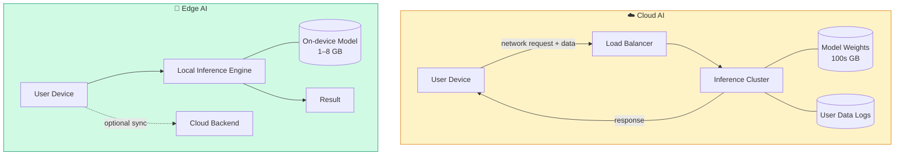
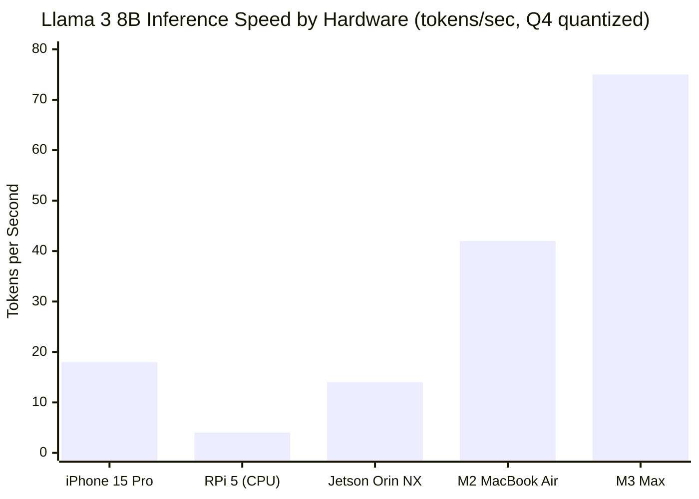
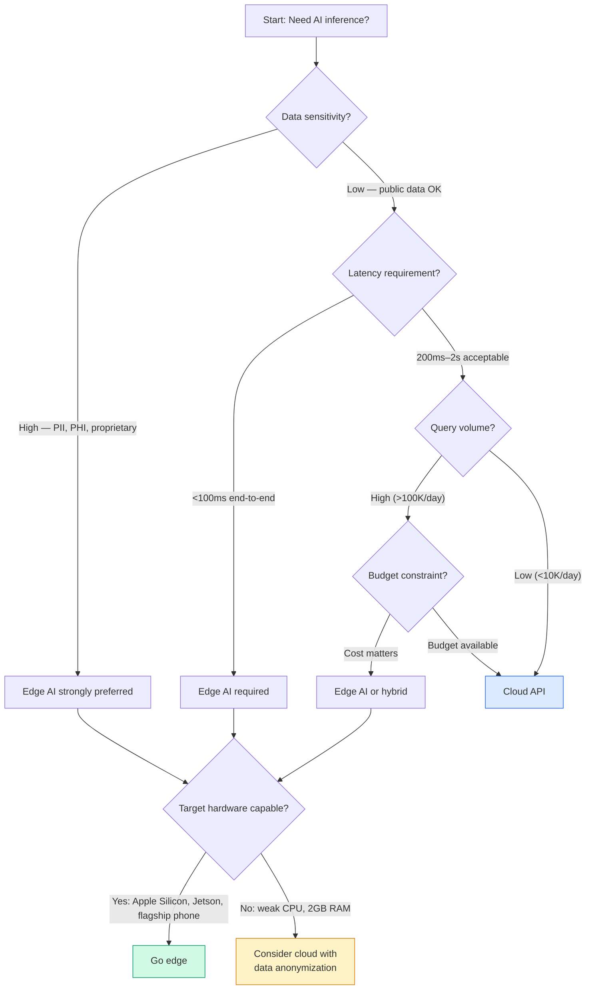

I ran a 7-billion-parameter language model on a Raspberry Pi 5 last month. Inference was slow — about 3 tokens per second — but it worked. The model never sent a single byte to a remote server, cost nothing per query, and kept running when my home internet went down. That experience made the abstract promise of edge AI feel concrete in a way that benchmarks usually don't.

Edge AI is having a real moment. Qualcomm is building NPUs into mid-range Android chips. Apple's Neural Engine has been shipping for years and is now powerful enough to run 3B-parameter models in real time. Microsoft published Phi-3 Mini specifically because it fits on a phone. The gap between "runs on a server" and "runs on your device" is closing faster than most developers realize.

This is a technical overview of what edge AI actually involves: what it means, why you'd choose it, what hardware and models are available, how to optimize for constrained environments, and where it falls short.

---

## What Is Edge AI?

Edge AI means running machine learning inference on the device that collected the data — a phone, a laptop, an embedded board, a camera, a sensor cluster — rather than sending that data to a remote server and waiting for a response.

The word "edge" comes from network topology. In the classic cloud model, your device (the "edge" of the network) sends data to centralized compute. Edge AI inverts that: the compute comes to the edge.

This is distinct from training. Almost nobody trains large models on-device — the compute and memory requirements are too high. Edge AI is about inference: taking a pre-trained model and running it locally to generate predictions, transcriptions, classifications, embeddings, or text.

The models involved range from tiny classifiers that detect a wake word (a few hundred kilobytes) to 8-billion-parameter LLMs that require 6–8 GB of RAM and a capable GPU or NPU. The unifying characteristic is that the model weights live on the device and inference happens locally.

---

## Why Run Models Locally?

There are four reasons teams move to on-device AI, and they're not all about the same use case.

### Privacy

This is the clearest case. Medical records, legal documents, private conversations, proprietary source code — some data simply shouldn't leave the device. Sending it to a third-party API creates a chain of custody problem even if that API has good security. On-device inference eliminates the network exposure entirely.

Healthcare is an obvious domain. A clinical note summarization tool that runs locally doesn't need a BAA with your model vendor. A mental health app that analyzes journal entries can make privacy a hard guarantee rather than a policy claim.

### Latency

A round-trip to a cloud API involves DNS resolution, TLS handshake, queuing at the inference provider, model execution, and return transmission. On a good day that's 200–400ms. On a bad day, with a loaded API or mobile network congestion, it's seconds.

On-device inference latency is bounded by local hardware. An Apple M3 running a 3B-parameter model generates tokens in well under 100ms per token. That's fast enough for real-time voice transcription, autocomplete in a text editor, or AR overlays on a camera feed.

### Cost

Cloud inference isn't free. At $15 per million output tokens (Claude Sonnet pricing), a product with 100,000 daily active users doing even modest inference can run up a meaningful monthly bill. On-device inference has zero marginal cost per query once the model is shipped.

The tradeoff is engineering complexity and a larger app binary. But for consumer products with high query volumes, the economics often favor on-device after a few hundred thousand users.

### Offline Operation

Cloud AI stops working when the network does. Edge AI doesn't care. This matters for field applications (agriculture, construction, utilities), transportation (in-vehicle, underground), and any consumer product that needs to work reliably without assuming connectivity.

---

## Edge vs Cloud Architecture

The key structural difference is that in the edge model, user data never leaves the device during inference. The optional cloud sync arrow represents telemetry or result logging — data the application chooses to send, not data required by the inference pipeline.

---

## Available Models for Edge Deployment

Not every model can run on-device. The practical ceiling is around 8B parameters for devices with a dedicated GPU or NPU, and around 1–3B parameters for CPU-only inference. Here are the models worth knowing.

### Phi-3 Mini (Microsoft)

Phi-3 Mini 3.8B is Microsoft's most compelling edge model. It achieves benchmark scores competitive with models twice its size, largely because it was trained on carefully curated "textbook quality" data rather than raw internet text. The 4-bit quantized version runs at about 20 tokens/second on an iPhone 15 Pro using Core ML. It handles summarization, Q&A, code generation, and reasoning tasks well. Context window is 4K tokens in the base version, 128K in the long-context variant (though the long-context version is too large for most phones).

### Gemma 2B and 7B (Google)

Google's Gemma models are Apache-licensed and designed with on-device deployment in mind. Gemma 2B runs on midrange Android hardware. Gemma 7B needs a desktop GPU or Apple Silicon. Google provides MediaPipe integration, which means Gemma 2B can run through a well-optimized inference pipeline directly in an Android app. Quality is solid for its size — better than Llama 2 7B on most benchmarks, roughly comparable to Mistral 7B.

### Llama 3 8B (Meta)

Llama 3 8B is the current reference model for edge LLMs. In 4-bit quantized form (Q4_K_M in GGUF format), it requires about 5 GB of RAM and generates around 25–40 tokens/second on Apple M-series chips. On an NVIDIA Jetson Orin NX with 16 GB, it runs at around 15 tokens/second. For developer laptops and high-end embedded hardware, this is the model I'd reach for first. The instruction-tuned variant (Llama-3-8B-Instruct) handles chat and assistant tasks without much prompting overhead.

### Whisper (OpenAI)

Whisper is a speech-to-text model, and it's one of the success stories of on-device AI. The `whisper.cpp` port runs the medium.en model (1.5 GB) at real-time or faster on an Apple M1. On a Raspberry Pi 5, the small.en model (244 MB) transcribes roughly 4x faster than real-time for typical speech. Whisper is the reason voice-controlled local applications are now practical. You don't need cloud STT for a voice interface — you just need whisper.cpp and a microphone.

---

## Hardware Options

### Smartphones

Modern flagship phones are the most capable edge AI hardware available to consumer developers. Apple's A-series and M-series chips include a dedicated Neural Engine that Apple claims can execute 35 trillion operations per second on the M3. The iPhone 15 Pro can run Phi-3 Mini 4-bit at interactive speeds. Android flagships with Snapdragon 8 Gen 3 have a Hexagon NPU that accelerates ONNX and TFLite models significantly.

Midrange Android hardware is more constrained — CPU-only inference for LLMs is painful, and NPU support is inconsistent. For reliable on-device LLM inference on Android, target devices with the Snapdragon 8-series or the Dimensity 9000+.

### Raspberry Pi 5

The Pi 5 is genuinely useful for edge AI in a way earlier Pi models weren't. With 8 GB of RAM and a 2.4 GHz Arm Cortex-A76, it can run Llama 3 8B at Q4 quantization — slowly (3–5 tokens/second), but correctly. For non-real-time applications like batch processing, document analysis, or local API serving on a home network, this is a $80 server that needs no cloud subscription.

The Pi lacks a GPU, so you're running everything on CPU. That means it's not suitable for vision models or real-time inference. But for a local assistant or offline summarization tool, it works.

### NVIDIA Jetson

The Jetson lineup is NVIDIA's edge AI hardware platform. The Jetson Orin Nano (8 GB, ~$200) runs Llama 3 8B at 10–15 tokens/second using llama.cpp with CUDA acceleration. The Jetson Orin NX (16 GB, ~$400) handles larger models and runs Whisper medium.en in faster-than-real-time. For robotics, autonomous vehicles, industrial automation, and field-deployed AI, Jetson is the professional choice — it supports CUDA and TensorRT, so you get full access to NVIDIA's optimization stack.

### Apple Silicon (M-series Macs)

Apple Silicon is the best edge AI hardware available today for developer workloads. The M2 MacBook Air has 16 GB unified memory and can run Llama 3 8B at Q4 at 30–50 tokens/second in llama.cpp. The M3 Max with 128 GB unified memory can run 70B models. The Metal GPU backend in llama.cpp is well-optimized, and Core ML provides access to the Neural Engine for supported models. If you're doing edge AI development, an Apple Silicon Mac is both your development machine and a reference target.

---

## Performance at a Glance

These are real-world numbers, not synthetic benchmarks. They assume Q4_K_M quantization and llama.cpp or Core ML as the inference engine. Your results will vary with prompt length, system load, and thermal throttling — the Pi 5 in particular slows down noticeably when it gets hot.

---

## Optimization Techniques

Running a model on a phone or embedded device requires getting the model small and fast enough to fit. Three techniques dominate the field.

### Quantization

Quantization reduces the numeric precision of model weights. A standard model stores each weight as a 32-bit float (FP32). Quantizing to 8-bit integers (INT8) cuts memory by 4x with minimal quality loss. Quantizing to 4-bit (the most common edge target) cuts it by 8x with modest quality loss. The Q4_K_M format in GGUF, for example, keeps some layers at higher precision to recover accuracy.

For LLMs, 4-bit quantization typically reduces perplexity (a measure of language model quality) by 5–15% compared to FP16, which is acceptable for most applications. 2-bit quantization is possible but quality degrades sharply — only useful for very simple tasks.

### Pruning

Pruning removes weights that contribute little to the model's output. Unstructured pruning zeros out individual weights; structured pruning removes entire neurons or attention heads. Structured pruning is more hardware-friendly because it actually shrinks the computation graph rather than just zeroing values.

The challenge is that pruning requires careful fine-tuning to recover accuracy, and the tooling is less mature than quantization. In practice, most on-device deployments use quantization rather than pruning unless they need to hit a very aggressive size target.

### Knowledge Distillation

Distillation trains a smaller "student" model to mimic the behavior of a larger "teacher" model. The student learns from the teacher's soft probability outputs (logits), not just the ground truth labels, which transfers more information than standard training. Phi-3 Mini is largely a product of this approach — Microsoft trained it to reproduce GPT-4-level outputs on curated tasks, which is why it outperforms raw parameter count comparisons.

You typically don't run distillation yourself unless you're building a specialized model for a narrow domain. But understanding it explains why some small models punch above their weight.

---

## Frameworks and Runtimes

### llama.cpp

The starting point for anyone running LLMs locally. llama.cpp is a C/C++ inference engine optimized for CPU and GPU inference of GGUF-format models. It supports Apple Metal, CUDA, OpenCL, and Vulkan backends. The API server mode lets you run a local OpenAI-compatible endpoint. Setup is straightforward: clone, compile, download a GGUF model, run. For prototyping on a Mac or Linux machine, this is the fastest path to working local inference.

### ONNX Runtime

ONNX Runtime is Microsoft's cross-platform inference engine. It supports models in the ONNX format, which most major frameworks (PyTorch, TensorFlow, Hugging Face) can export to. ONNX Runtime runs on CPU, CUDA, DirectML, CoreML, and NNAPI. This makes it the best choice for cross-platform deployment — the same model file can run on Windows, Linux, Android, and iOS with execution provider swapped. Microsoft used ONNX Runtime to ship Phi-3 Mini on Windows Copilot+ PCs.

### TensorFlow Lite

TensorFlow Lite (TFLite) is Google's on-device inference framework, targeting Android and embedded Linux. It supports INT8 and FP16 quantization, the Android NNAPI for GPU and DSP acceleration, and the Hexagon NPU on Snapdragon. If you're building an Android app with on-device AI, TFLite and MediaPipe are the most battle-tested path. The model conversion process from Keras or SavedModel is well-documented. Gemma 2B ships with an official TFLite weight file.

### Core ML

Core ML is Apple's on-device ML framework for iOS, macOS, watchOS, and tvOS. It routes inference to whichever available hardware is fastest: CPU, GPU, or Neural Engine. Models in Core ML format (.mlpackage) are deeply integrated with Xcode and the Swift ecosystem. If you're shipping an iOS or macOS app and want to use the Neural Engine, Core ML is the mandatory path — nothing else accesses it. The `coremltools` Python package handles conversion from PyTorch and ONNX. Apple ships private versions of Gemma and other models through the on-device model framework in recent iOS versions.

---

## Real-World Applications

**Voice interfaces without the cloud.** A Whisper-based transcription pipeline running locally handles voice commands, meeting notes, and dictation without sending audio anywhere. Combined with a local LLM for response generation, you have a fully offline voice assistant. This is how some privacy-focused productivity apps are built.

**Code completion on developer hardware.** Tools like Continue.dev and Ollama serve local model endpoints that IDE extensions can call. An M2 MacBook running Llama 3 8B can provide autocomplete responses in under 500ms — fast enough to feel interactive, free per query, and private by construction.

**Field data analysis.** An agricultural sensor network deployed across a farm can run anomaly detection models locally on each node. Detections get flagged and synced when connectivity is available, but the detection itself doesn't wait for the cloud. The same pattern applies to industrial quality control, infrastructure monitoring, and remote medical devices.

**Document processing in regulated industries.** Legal, financial, and healthcare companies that handle sensitive documents can run summarization and extraction models on-premises or on-device. No data leaves the controlled environment. This enables AI capability in environments where cloud AI is contractually or regulatorily blocked.

**Personalized on-device models.** Because the model runs locally and never shares data, it's possible to fine-tune or adapt it per-user without pooling user data. This is still early, but on-device LoRA adapters that personalize a base model for individual writing style or vocabulary are technically feasible on current flagship hardware.

---

## Should You Use Edge AI?

Use this flowchart as a starting point, not a hard rule. Most real deployments end up in a hybrid architecture: on-device inference for latency-sensitive or privacy-critical paths, cloud inference for complex queries that need a bigger model.

---

## Limitations

Edge AI is not a free lunch. Here are the real constraints.

**Model capability ceiling.** The best models in the world — GPT-4o, Claude 3.5 Sonnet, Gemini 1.5 Pro — don't run on-device. The capability gap between a 7B on-device model and a 100B+ cloud model is real. For complex reasoning, long-document analysis, or tasks that require broad world knowledge, cloud models are still significantly better.

**Context length.** Most practical on-device LLMs top out at 4K–8K tokens of context. Cloud models offer 100K–1M+ tokens. If your application requires reasoning over long documents, edge AI currently can't match cloud capability.

**Hardware fragmentation.** Android has hundreds of chipset variants with inconsistent NPU support and driver quality. What runs well on a Snapdragon 8 Gen 3 may run poorly on a Dimensity 700. Testing edge AI on Android requires either targeting a narrow hardware range or investing heavily in compatibility engineering.

**Battery and thermal constraints.** Running a 7B model on a phone at full speed will drain a battery in 2–3 hours and make the device hot to the touch. For sustained use cases, this is a real product problem. Applications need to be intelligent about when to run local inference versus deferring or using a simpler model.

**Deployment and updates.** Shipping a 2–5 GB model inside or alongside an app creates distribution challenges. App stores have binary size limits. Delta updates for model weights are technically complex. Users on limited data plans may resist a large download. These are solvable engineering problems, but they're not free.

---

## Verdict

Edge AI has crossed from research curiosity to production-viable technology for a meaningful range of applications. If your use case involves sensitive data, requires sub-100ms latency, faces high query volume, or needs offline reliability, on-device inference deserves serious evaluation.

The best entry point in 2026 is llama.cpp with Llama 3 8B Q4_K_M on Apple Silicon, or ONNX Runtime with Phi-3 Mini on Snapdragon hardware. Both paths are well-documented, have active communities, and produce working prototypes in hours.

The ceiling is real — you're giving up access to the most capable models in the world, long context windows, and multimodal capability at scale. But within that ceiling, edge AI delivers privacy, speed, and economics that cloud inference can't match.

Build a hybrid. Use on-device for what it's good at, and route to the cloud when the task genuinely needs it. That split is where most serious production deployments land.

---

## FAQ

### What's the minimum hardware for running a useful LLM on-device?

For a language model that can handle Q&A and summarization, I'd target at least 8 GB of RAM and either a modern mobile NPU or an Apple Silicon chip. Below that, you're limited to smaller specialized models (Phi-3 Mini at 4-bit, Gemma 2B) with shorter context windows. A Raspberry Pi 5 with 8 GB of RAM technically qualifies, but inference will be slow — plan for 3–5 tokens/second with Llama 3 8B.

### Is 4-bit quantization accurate enough for production?

For most text generation, summarization, and Q&A tasks: yes. The quality degradation from FP16 to Q4_K_M is noticeable in careful evals but usually not noticeable in real user interactions. For tasks requiring precise numerical reasoning or sensitive classification decisions, test carefully — quantization errors tend to compound in those scenarios.

### Can I fine-tune a model locally and keep the weights on-device?

Full fine-tuning locally is impractical on most consumer hardware. LoRA fine-tuning (low-rank adaptation) is feasible on an Apple M3 Max or an NVIDIA RTX 4090 with a small dataset. Running inference with a locally fine-tuned adapter is supported by llama.cpp and Hugging Face's PEFT library. For a model that personalizes per-user, on-device LoRA adapters are technically possible on current high-end hardware, though the tooling is still early.

### How do on-device models compare to cloud models on coding tasks?

For single-file completions and simple functions, Llama 3 8B Instruct is competitive with GPT-3.5-level quality. For complex multi-file refactors, cross-file reasoning, or tasks that benefit from broad API knowledge, cloud models like Claude Sonnet or GPT-4o remain significantly better. The practical rule: on-device coding tools work well for autocomplete and boilerplate generation; route to the cloud for architectural decisions and complex debugging.

### Does running models on-device actually save money at scale?

It depends on your cost structure. If you're paying $0.01–$0.03 per API call at cloud rates, on-device saves that per-call cost in exchange for: engineering time to implement and maintain the inference pipeline, a larger app binary (2–5 GB), and reduced model capability. For consumer apps with high query volume (>500K queries/day), the math usually favors on-device. For B2B tools with lower volume and higher per-query value, cloud APIs often remain the better economic choice.
