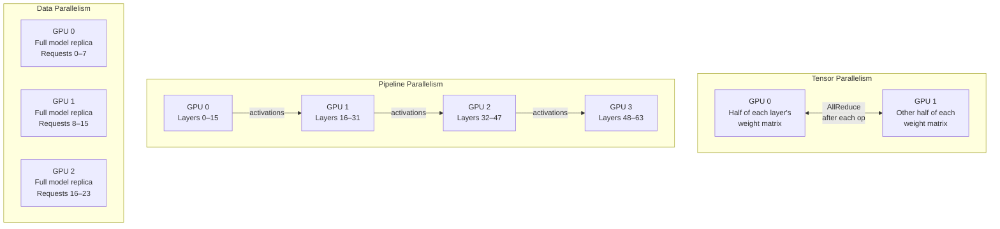
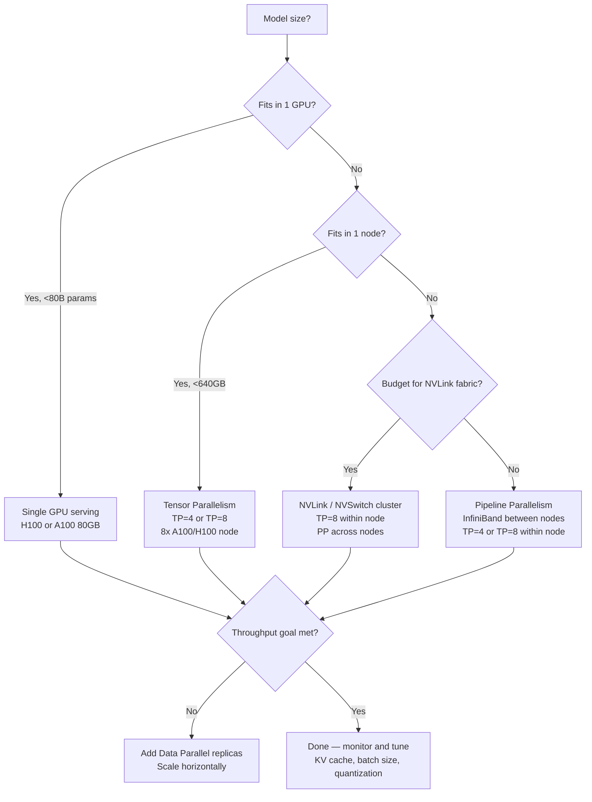

I ran my first LLaMA-2 70B inference job on a single A100 80 GB and immediately hit the wall every ML engineer eventually hits: the model barely fits in VRAM, throughput is embarrassingly low, and any attempt to batch more than four requests at once throws an out-of-memory error. The fix is not buying a bigger GPU. The fix is distributed LLM inference — spreading the model and its workload across multiple devices in a way that is coherent, efficient, and cheap enough to be worth running in production.

This guide covers how distributed inference actually works, which parallelism strategy matches which problem, the frameworks that implement these strategies well, and how to make a defensible hardware and cost decision before you sign anything.

## Why You Cannot Just Use One GPU

The arithmetic is unforgiving. A model parameter stored in fp16 takes 2 bytes. A 70B-parameter model therefore requires roughly 140 GB just for the weights — already beyond any single consumer or datacenter GPU available today. The 175B GPT-3 class model needs around 350 GB. Llama 3 405B in fp16 requires over 800 GB.

Memory is only half the problem. Attention's KV cache grows with sequence length and batch size. At a 4 K context window with a batch of 32, the KV cache for Llama 3 70B adds another 30–40 GB on top of the weights. At 32 K context the cache dominates the budget entirely.

Single-GPU throughput is also bounded by memory bandwidth, not compute. The best H100 SXM5 has 3.35 TB/s of HBM3 bandwidth. Serving a 70B model at full utilization means loading roughly 140 GB of weights per forward pass, yielding a theoretical ceiling of about 23 forward passes per second — before KV cache, activation memory, or any overhead. Real-world single-GPU throughput on large models lands 60–70 % below that ceiling.

Distributing inference across GPUs lets you break both constraints simultaneously: more aggregate VRAM for the weights, and more aggregate bandwidth for throughput.

## The Three Parallelism Strategies

There are three canonical ways to split an LLM across devices. They solve different problems and compose with each other.

### Tensor Parallelism

Tensor parallelism (TP) splits individual weight matrices across GPUs within the same layer. In the attention block, each GPU holds a subset of the attention heads. In the MLP block, each GPU holds a column slice of the up-projection matrix and the corresponding row slice of the down-projection matrix.

Every forward pass requires an AllReduce communication step across the TP group to combine partial results. This means tensor parallelism only works well when GPUs are connected by high-bandwidth interconnect — NVLink between GPUs on the same node or NVSwitch in an NVLink domain. Over PCIe or Ethernet, the AllReduce latency dominates and throughput collapses.

The practical rule: use tensor parallelism within a node (typically TP degree 4 or 8 on an 8-GPU node) and never stretch it across nodes unless you have InfiniBand HDR or NDR at minimum.

**Real number:** vLLM serving Llama 3 70B with TP=4 on four A100 80 GB GPUs (NVLink) achieves approximately 1,800 tokens/second at batch size 32. The same model with TP=4 over PCIe drops to around 900 tokens/second — the interconnect is the bottleneck.

### Pipeline Parallelism

Pipeline parallelism (PP) assigns consecutive transformer layers to different GPUs. GPU 0 runs layers 0–15, GPU 1 runs layers 16–31, and so on. Activations flow from one stage to the next via point-to-point communication (typically over NVLink or InfiniBand). Because each stage only sends one activation tensor rather than doing an AllReduce, pipeline parallelism tolerates higher-latency interconnects than tensor parallelism.

The classic problem with pipeline parallelism is the pipeline bubble: GPUs in earlier stages sit idle while the batch travels through later stages, and vice versa. Micro-batching reduces the bubble fraction — instead of sending one large batch through the pipeline, you slice it into micro-batches and keep all stages busy with different micro-batches simultaneously. The bubble fraction is approximately `1 / (number of micro-batches)`.

Pipeline parallelism is the right choice for multi-node deployments where inter-node bandwidth is limited (10–100 Gbps Ethernet) and when the model is so large that it cannot fit on a single node even with tensor parallelism.

**Real number:** DeepSpeed-Inference running a 175B model across 16 A100 nodes (8 GPUs each, PP=16, TP=8) achieves around 450 tokens/second at a 64-sequence batch. Bubble overhead at 8 micro-batches is approximately 12.5 %, which is acceptable at this scale.

### Data Parallelism

Data parallelism (DP) replicates the full model on each GPU (or each TP/PP group) and splits the incoming request stream across replicas. There is no per-token communication between replicas — each handles its batch independently and results are returned directly to the client.

Data parallelism does not help you fit a model that is too large for a single GPU. It helps you scale throughput once you already have a working single-replica deployment. Doubling the number of replicas doubles your requests-per-second capacity linearly, up to the point where your load balancer or upstream network becomes the bottleneck.

Most production deployments combine all three: TP within a node, PP across nodes, and DP across node groups to scale total throughput.

## Parallelism Strategy Comparison

```mermaid
xychart-beta
    title "Strategy Fit by Problem Dimension"
    x-axis ["Fits oversized model", "Scales throughput", "Low latency", "Works across nodes", "Simple to tune"]
    y-axis "Score (1-5)" 0 --> 5
    bar [1, 2, 5, 2, 4]
    bar [4, 3, 3, 5, 3]
    bar [2, 5, 3, 5, 5]
```

| Strategy | Solves VRAM limit | Scales throughput | Latency impact | Best interconnect | Complexity |
|---|---|---|---|---|---|
| Tensor Parallelism | Yes (within node) | Moderate | Low (with NVLink) | NVLink / NVSwitch | Medium |
| Pipeline Parallelism | Yes (multi-node) | Moderate | Medium (bubble) | InfiniBand or better | High |
| Data Parallelism | No | High (linear) | None | Any | Low |
| TP + PP + DP | Yes (large scale) | Very high | Medium | InfiniBand | Very high |

## Key Frameworks for Distributed LLM Inference

### vLLM

vLLM is the community standard for high-throughput LLM serving. Its core innovation is PagedAttention — a KV cache management algorithm borrowed from operating-system virtual memory. Instead of pre-allocating a contiguous VRAM block for each sequence's KV cache (which wastes memory when sequences end at different lengths), PagedAttention manages KV cache in fixed-size pages and reclaims them as sequences complete.

The practical result is 2–4x higher throughput than naive implementations at equivalent VRAM budgets, because more sequences fit in memory simultaneously. vLLM supports tensor parallelism natively via the `--tensor-parallel-size` flag and pipeline parallelism as of version 0.4. It exposes an OpenAI-compatible REST API out of the box, making migration from the OpenAI API straightforward.

**Best for:** Teams serving popular open-weight models (Llama, Mistral, Qwen) who want the highest tokens/second per dollar with a simple deployment story.

### Hugging Face Text Generation Inference (TGI)

TGI is Hugging Face's production serving solution. It ships with tensor parallelism, flash attention, continuous batching, and a well-maintained Docker image that supports most models in the Hugging Face Hub. The API surface is slightly different from OpenAI's, though there are compatibility layers.

TGI's strength is breadth: it handles quantized models (GPTQ, AWQ, bitsandbytes), Paged Attention, speculative decoding, and watermarking. Hugging Face's SaaS Inference Endpoints product runs TGI under the hood, so teams that want managed infrastructure without deep DevOps work can skip self-hosting entirely.

**Best for:** Teams already invested in the Hugging Face ecosystem or those who want managed serving without leaving the HF toolchain.

### NVIDIA TensorRT-LLM

TensorRT-LLM is NVIDIA's high-performance inference library, optimized specifically for their GPU architectures. It compiles models into TensorRT engines that fuse operations, apply CUDA-level kernel optimizations, and exploit hardware features (like FP8 precision on H100s) that general-purpose frameworks leave on the table.

The tradeoff is compilation time and flexibility. Building a TensorRT engine for a large model can take 30–60 minutes, and re-compilation is required whenever you change batch size limits, sequence length limits, or precision settings. The engine is also GPU-architecture-specific — an engine compiled for A100 will not run on H100 without recompilation.

At maximum throughput, TensorRT-LLM typically delivers 20–40 % higher tokens/second than vLLM on the same hardware, which matters when you are running thousands of GPUs and each percentage point is a real dollar figure.

**Best for:** Teams running NVIDIA GPUs at scale who can absorb the operational complexity in exchange for peak performance.

### DeepSpeed-Inference

DeepSpeed-Inference is Microsoft's distributed inference library, part of the broader DeepSpeed ecosystem. It supports ZeRO-Inference (sharding model weights across GPUs without full replication), tensor parallelism, and pipeline parallelism at multi-node scale. It also includes Transformer-Kernels, a set of CUDA kernels tuned for inference.

DeepSpeed shines at the very large end of the model size range — 100B+ parameter models across 16 or more nodes — where the combination of pipeline and tensor parallelism needs to be orchestrated carefully. The API is more complex than vLLM or TGI, and community support is thinner for pure inference use cases (DeepSpeed's larger user base is training-focused).

**Best for:** Research teams and enterprises running genuinely massive models (175B+) across many nodes who need fine-grained parallelism control.

## Framework Comparison

| Framework | Max parallelism | KV cache efficiency | Ease of use | Hardware lock-in | Best model size |
|---|---|---|---|---|---|
| vLLM | TP + PP | Very high (PagedAttention) | High | None | 7B–70B |
| TGI | TP | High | High | None | 7B–70B |
| TensorRT-LLM | TP + PP | High | Medium | NVIDIA only | 7B–405B |
| DeepSpeed | TP + PP + ZeRO | Medium | Low | None | 70B–1T+ |

## Hardware Planning

Choosing hardware for distributed inference requires matching three constraints: VRAM budget (can you fit the model?), bandwidth (can you move activations fast enough?), and cost per token.

**A100 80 GB SXM:** The current production workhorse. NVLink 3.0 at 600 GB/s bidirectional within a node. Four A100s can serve Llama 3 70B at TP=4 with comfortable headroom. Eight A100s can serve a 130B model. Cloud spot pricing runs $2–3/GPU-hour; on-demand $3–4.

**H100 SXM5 80 GB:** The current performance leader. NVLink 4.0 at 900 GB/s, 3.35 TB/s HBM3 bandwidth, native FP8 support. A single H100 can serve Llama 3 70B in FP8 quantization. Four H100s in NVLink configuration push Llama 3 70B throughput to approximately 4,200 tokens/second at batch 32 — roughly 2.3x the A100 equivalent. Cloud on-demand runs $8–10/GPU-hour.

**AMD MI300X 192 GB:** AMD's answer to the H100. 192 GB of HBM3 memory per GPU means a single MI300X can hold Llama 3 70B in fp16 with room for generous KV cache. ROCm support in vLLM is stable as of early 2026. Cost is competitive with H100, and availability through cloud providers has improved. If your team is comfortable with ROCm, the MI300X is worth evaluating seriously.

**L4 / L40S (24–48 GB):** Lower-cost inference options for smaller models. An L4 handles 7B and 13B models easily and costs around $0.80/GPU-hour spot. Not suitable for models above 30B unless you are willing to aggressively quantize to 4-bit.

## KV Cache Optimization

The KV cache is often the binding memory constraint in production, not the weights. At long context lengths, the KV cache for a single sequence in Llama 3 70B grows to several gigabytes. Three techniques matter most.

**PagedAttention (vLLM's core mechanic):** Manages KV cache in fixed-size blocks rather than contiguous per-sequence allocations. Reduces memory fragmentation and allows effective KV cache utilization above 90 % in most workloads. The baseline requirement for high-throughput serving.

**Prefix caching:** When multiple requests share a common prompt prefix (a system prompt, a document, a few-shot example), the KV cache for that prefix can be computed once and reused. vLLM 0.4+ and TGI support prefix caching. In deployments where a fixed system prompt is used for all requests — common in chatbot and RAG applications — prefix caching cuts first-token latency by 40–70 % and halves the memory cost of that shared prefix.

**Quantization of KV cache:** The KV cache can be stored in FP8 or INT8 instead of FP16 without significant quality loss at most context lengths. TensorRT-LLM supports FP8 KV cache natively. vLLM added experimental FP8 KV cache support in 0.5. This effectively doubles the number of sequences that fit in VRAM at the cost of a small precision reduction.

## Cost Analysis

Distributed inference cost breaks down into three buckets: compute (GPU-hours), network (inter-node bandwidth charges on cloud), and engineering (the hours spent building and operating the system).

For a team serving 10 million tokens per day on Llama 3 70B:

| Setup | Hardware | Tokens/sec | GPUs needed | Est. cloud cost/month |
|---|---|---|---|---|
| Single A100 80GB | A100 SXM | ~450 | 1 | ~$2,400 |
| TP=4 A100 cluster | 4x A100 SXM | ~1,800 | 4 | ~$5,760 |
| TP=4 H100 cluster | 4x H100 SXM | ~4,200 | 4 | ~$15,840 |
| TP=4 A100 + quantization | 4x A100 SXM | ~2,400 (AWQ INT4) | 4 | ~$5,760 |

10 million tokens/day is approximately 116 tokens/second sustained. A single A100 comfortably handles that load, but with no headroom for traffic spikes. A TP=4 A100 cluster provides 15x headroom and lets you run multiple model variants simultaneously.

The single most impactful cost lever for most teams is not hardware selection — it is quantization. AWQ INT4 on Llama 3 70B reduces VRAM usage by ~50 % with a measured quality drop of 0.5–1.5 points on standard benchmarks. That halved VRAM requirement either lets you serve on half the GPUs or doubles your batch capacity on the same hardware.

The second most impactful lever is continuous batching, which all four frameworks support. Continuous batching replaces static batch inference (wait until a full batch accumulates, then process it) with dynamic insertion of new sequences as in-progress sequences complete. On workloads with variable request arrival rates, continuous batching improves GPU utilization by 30–50 % compared to static batching.

## The Verdict

Distributed LLM inference is not optional for serious production deployments of models above 13B parameters. The memory math makes single-GPU serving impractical for anything in the 70B–405B range, and the throughput math makes it essential even for smaller models at scale.

My practical recommendation for most teams:

Start with vLLM and tensor parallelism on a single node (TP=4 or TP=8 depending on model size). Apply AWQ or GPTQ INT4 quantization if VRAM is tight. Enable PagedAttention and prefix caching from day one. Only add pipeline parallelism and multi-node complexity when a single 8-GPU node is genuinely insufficient for your throughput or model size requirements.

If you are running NVIDIA GPUs at scale and have an MLOps team comfortable with compilation pipelines, evaluate TensorRT-LLM for the 20–40 % throughput gain over vLLM. If you are operating at the frontier — 175B+ models across dozens of nodes — DeepSpeed-Inference gives you the parallelism control you need.

The hardware choice matters less than getting the software stack right. A well-tuned vLLM deployment on A100s will outperform a default TensorRT-LLM deployment on H100s in my experience. Instrument your deployment, measure KV cache utilization and GPU occupancy, and iterate.

## FAQ

### How do I choose between tensor parallelism and pipeline parallelism?

Use tensor parallelism when all GPUs are in the same node connected by NVLink or NVSwitch. Use pipeline parallelism when you must span multiple nodes — the AllReduce required by TP is too expensive over inter-node links. Most production deployments at scale use both: TP within a node, PP across nodes.

### What is the minimum viable hardware setup for running Llama 3 70B in production?

Two A100 80 GB GPUs with NVLink is the practical floor. That gives you 160 GB aggregate VRAM — enough for the weights in FP16 with room for a reasonable KV cache. For better headroom and throughput, four A100s at TP=4 is the recommended starting point. A single H100 80 GB with FP8 quantization is also viable if you prefer fewer GPUs.

### Does distributed inference add latency compared to single-GPU?

Tensor parallelism adds a small AllReduce latency per transformer layer — typically 0.5–2 ms per layer on NVLink, which totals 15–60 ms across a 32-layer model. Pipeline parallelism adds pipeline bubble overhead but does not add per-token latency in steady state. For time-to-first-token, the communication overhead is often offset by the fact that each GPU handles a smaller weight fraction and completes its computation faster.

### When does it make sense to use a managed inference API instead of self-hosting?

If your team lacks MLOps capacity, or if your volume is under roughly 5 million tokens per day, managed inference APIs from Together AI, Fireworks AI, or Hugging Face Inference Endpoints will almost certainly be cheaper than self-hosted distributed inference when you account for engineering time. Self-hosting becomes cost-competitive at high volume, when you need custom model weights, or when data privacy requirements prohibit sending data to third-party APIs.

### How does speculative decoding interact with distributed inference?

Speculative decoding uses a small draft model to generate candidate tokens and a large verifier model to accept or reject them. In distributed inference, the draft and verifier can run on different GPU groups simultaneously. TGI and vLLM both support speculative decoding. The throughput gain is highest for workloads with predictable token distributions (coding, structured data) and lowest for open-ended generation. Expect 1.5–2.5x throughput improvement in favorable workloads with no change in output quality.
