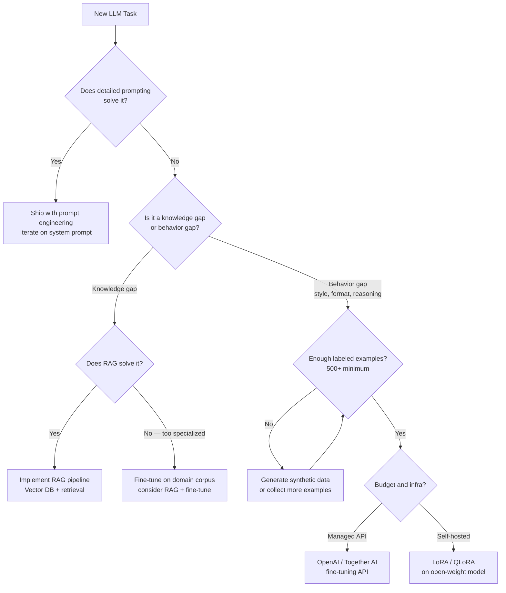
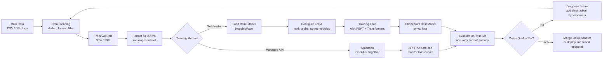
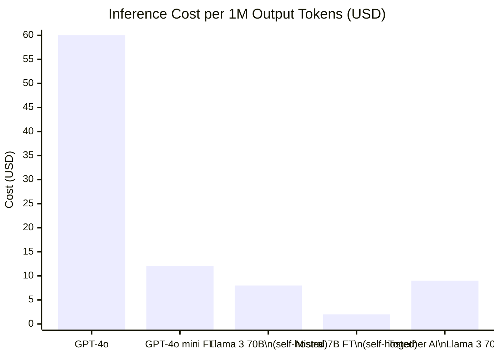

I've watched teams spend six figures fine-tuning a model when a better system prompt would have solved the same problem in an afternoon. I've also watched teams spend months wrestling with prompt engineering on tasks where fine-tuning would have cut error rates by 40% in two weeks. The decision of when to fine-tune an LLM is one of the most consequential — and most frequently botched — calls in applied AI.

This guide is the one I wish existed when I started. It covers the real decision criteria, the different fine-tuning approaches, how to prepare data that actually works, the full training pipeline, cost realities, and the services worth considering. There's working code throughout.

## When to Fine-Tune (vs RAG vs Prompting)

Before writing a single line of training code, you need to know whether fine-tuning is the right tool at all. Most use cases don't need it — and the ones that do need it often need it in combination with other techniques.

Here's how I think about the decision:

**Prompt engineering first.** If the base model can do the task when given a detailed system prompt and a few examples, ship that. The operational cost is near-zero, you can iterate in minutes, and every model improvement benefits you automatically. System prompts can encode persona, output format, tone, refusal criteria, domain vocabulary, and multi-step reasoning chains. They're underrated.

**RAG (Retrieval-Augmented Generation) second.** If the task requires up-to-date information, proprietary documents, or a knowledge base that exceeds the context window, add retrieval before you add training. RAG adds knowledge without changing model weights. The knowledge can be updated without retraining. It's the right choice for most enterprise knowledge-base applications.

**Fine-tuning when the above two fail.** Fine-tuning earns its keep when:
- The task requires a style, tone, or output structure the model can't reliably hold through prompting
- You need consistent domain-specific behavior across millions of calls (cost matters)
- You're doing classification, extraction, or generation where response format must be perfect
- The base model lacks domain knowledge that isn't easily retrieved (specialized medical, legal, or scientific reasoning)
- Latency is critical and you need a smaller, specialized model instead of a large general one



One more dimension worth naming: **privacy**. If your training data or inference data can never leave your infrastructure, managed fine-tuning APIs are off the table and you're looking at self-hosted open-weight models.

## Types of Fine-Tuning

Not all fine-tuning is the same. The technique you choose has a major impact on cost, quality, and infrastructure requirements.

### Full Fine-Tuning

You update all model weights using your dataset. This gives the most expressive adaptation but requires enormous compute. Fine-tuning a 70B parameter model full-scale requires 8+ A100 80GB GPUs and produces a complete model copy you need to host. For most teams, this is overkill — and the quality improvement over parameter-efficient methods on typical tasks is marginal.

**When it makes sense:** You have a specialized domain with massive proprietary data (think a major hospital system fine-tuning on millions of annotated clinical notes), a large infrastructure budget, and need the absolute ceiling on quality.

### LoRA (Low-Rank Adaptation)

LoRA freezes the original model weights and trains small low-rank decomposition matrices that are injected into the attention layers. Instead of updating billions of parameters, you're training millions — a 100-1000x reduction in trainable parameters.

The insight is that weight updates during fine-tuning have low intrinsic rank, so you can approximate them efficiently. At inference time, the LoRA weights merge into the base model with zero latency overhead.

**Typical stats:** A 7B model fine-tuned with LoRA uses ~16GB VRAM. Training a good LoRA on 2,000 examples takes 1-3 hours on a single A100. The resulting adapter is a few hundred MB, not the full 14GB model.

### QLoRA (Quantized LoRA)

QLoRA combines LoRA with 4-bit quantization of the base model weights. The base model is loaded in 4-bit NF4 format (cutting memory roughly 4x), then LoRA adapters are trained in 16-bit precision. This lets you fine-tune a 70B model on two consumer GPUs.

**Typical stats:** A 13B model fine-tuned with QLoRA fits in 12GB VRAM — a consumer gaming GPU. Quality is within a few points of full LoRA. For most applied use cases, QLoRA is the default starting point.

### Prefix Tuning and Prompt Tuning

These methods train a small set of "soft prompt" tokens prepended to every input, leaving all model weights frozen. They're extremely parameter-efficient but less expressive than LoRA for behavior changes. They work well for format and style adaptation when you need to run many task-specific variants on the same base model.

| Method | Trainable Params | VRAM (13B model) | Quality | Speed |
|---|---|---|---|---|
| Full fine-tuning | 100% | 200GB+ | Highest | Slowest |
| LoRA | 0.1-1% | 40GB | High | Fast |
| QLoRA | 0.1-1% | 12GB | High (≈LoRA) | Medium |
| Prefix tuning | <0.01% | 24GB | Medium | Fastest |

## Data Preparation

This is where fine-tuning projects succeed or die. I've seen well-resourced teams ship mediocre models because their training data was messy, and I've seen scrappy teams get excellent results from 800 carefully curated examples.

The format depends on your task:

**Instruction following** (most common):
```json
{
  "messages": [
    {"role": "system", "content": "You are a senior code reviewer..."},
    {"role": "user", "content": "Review this Python function:\n\n```python\ndef process_order(items):\n    total = 0\n    for item in items:\n        total += item['price']\n    return total\n```"},
    {"role": "assistant", "content": "**Issues found:**\n\n1. No input validation — `items` could be None or empty\n2. No handling for missing 'price' key\n3. No type checking for price values\n\n**Revised version:**\n\n```python\ndef process_order(items: list[dict]) -> float:\n    if not items:\n        return 0.0\n    return sum(\n        float(item['price'])\n        for item in items\n        if isinstance(item.get('price'), (int, float))\n    )\n```"}
  ]
}
```

**Classification** (label each input):
```json
{"text": "Our server is down and customers can't check out", "label": "P0_incident"}
{"text": "The dark mode toggle doesn't work on Firefox", "label": "bug_report"}
{"text": "Would love to see export to PDF added", "label": "feature_request"}
```

**Quality rules I apply to every dataset:**

1. **Minimum 500 examples, ideally 1,000-5,000.** Below 500, the model memorizes rather than generalizes. Above 10,000, returns diminish and you're often better off with a larger base model.
2. **Consistent format.** Pick one output format and never deviate. If some examples end with a period and some don't, the model learns inconsistency.
3. **Representative edge cases.** The hardest examples — ambiguous inputs, long inputs, unusual formats — should be proportionally represented. Easy examples alone produce models that fail on the hard cases your users will actually send.
4. **No duplicates or near-duplicates.** Run deduplication. A dataset with 1,000 examples where 300 are paraphrases of the same three scenarios will overfit badly.
5. **Human-reviewed quality bar.** If you're generating synthetic data with GPT-4o or Claude, have a human review a 10% sample and reject any that miss the quality bar. Synthetic data can subtly propagate model biases.

A quick Python snippet for formatting and validating JSONL training data:

```python
import json
from pathlib import Path

def validate_training_file(path: str) -> dict:
    examples = []
    errors = []
    
    with open(path) as f:
        for i, line in enumerate(f):
            try:
                ex = json.loads(line.strip())
                if "messages" not in ex:
                    errors.append(f"Line {i}: missing 'messages' key")
                    continue
                msgs = ex["messages"]
                if msgs[-1]["role"] != "assistant":
                    errors.append(f"Line {i}: last message must be from assistant")
                    continue
                examples.append(ex)
            except json.JSONDecodeError as e:
                errors.append(f"Line {i}: invalid JSON — {e}")
    
    total_tokens = sum(
        sum(len(m["content"].split()) * 1.3 for m in ex["messages"])
        for ex in examples
    )
    
    return {
        "valid_examples": len(examples),
        "errors": errors,
        "estimated_tokens": int(total_tokens),
        "estimated_training_cost_openai": f"${total_tokens * 8 / 1_000_000:.2f}"
    }

result = validate_training_file("training_data.jsonl")
print(json.dumps(result, indent=2))
```

## Training Pipeline

Here's the full picture of how a fine-tuning run flows from raw data to deployed model:



### Running a QLoRA Fine-Tune with PEFT

This is a minimal but complete setup for fine-tuning Mistral 7B with QLoRA on a single A100 or equivalent:

```python
from transformers import AutoModelForCausalLM, AutoTokenizer, TrainingArguments
from peft import LoraConfig, get_peft_model, prepare_model_for_kbit_training
from trl import SFTTrainer
from datasets import load_dataset
import torch

MODEL_ID = "mistralai/Mistral-7B-Instruct-v0.3"

# Load model in 4-bit quantization
model = AutoModelForCausalLM.from_pretrained(
    MODEL_ID,
    load_in_4bit=True,
    torch_dtype=torch.float16,
    device_map="auto",
    bnb_4bit_compute_dtype=torch.float16,
    bnb_4bit_quant_type="nf4",
    bnb_4bit_use_double_quant=True,
)
model = prepare_model_for_kbit_training(model)

tokenizer = AutoTokenizer.from_pretrained(MODEL_ID)
tokenizer.pad_token = tokenizer.eos_token
tokenizer.padding_side = "right"

# LoRA configuration
lora_config = LoraConfig(
    r=16,                    # rank — higher = more capacity, more memory
    lora_alpha=32,           # scaling factor, typically 2x rank
    target_modules=[         # which layers to adapt
        "q_proj", "k_proj", "v_proj", "o_proj",
        "gate_proj", "up_proj", "down_proj"
    ],
    lora_dropout=0.05,
    bias="none",
    task_type="CAUSAL_LM",
)
model = get_peft_model(model, lora_config)
model.print_trainable_parameters()
# Output: trainable params: 41,943,040 || all params: 7,283,343,360 || trainable%: 0.58

dataset = load_dataset("json", data_files={
    "train": "train.jsonl",
    "validation": "val.jsonl"
})

training_args = TrainingArguments(
    output_dir="./output",
    num_train_epochs=3,
    per_device_train_batch_size=4,
    gradient_accumulation_steps=4,   # effective batch size = 16
    warmup_steps=100,
    learning_rate=2e-4,
    fp16=True,
    logging_steps=25,
    evaluation_strategy="steps",
    eval_steps=100,
    save_strategy="steps",
    save_steps=100,
    load_best_model_at_end=True,
    report_to="wandb",                # or "tensorboard"
)

trainer = SFTTrainer(
    model=model,
    args=training_args,
    train_dataset=dataset["train"],
    eval_dataset=dataset["validation"],
    dataset_text_field="text",
    max_seq_length=2048,
    tokenizer=tokenizer,
)

trainer.train()
trainer.model.save_pretrained("./final_adapter")
```

After training, merge the LoRA adapter back into the base model for single-file deployment:

```python
from peft import PeftModel

base_model = AutoModelForCausalLM.from_pretrained(MODEL_ID, torch_dtype=torch.float16)
model = PeftModel.from_pretrained(base_model, "./final_adapter")
merged_model = model.merge_and_unload()
merged_model.save_pretrained("./merged_model")
tokenizer.save_pretrained("./merged_model")
```

## Evaluation

Evaluation is the step most teams do badly. Watching training loss go down is not evaluation. You need a held-out test set with ground-truth labels, and you need to measure what actually matters for your task.

**For classification and extraction**, the metrics are straightforward:
```python
from sklearn.metrics import classification_report, confusion_matrix
import json

def evaluate_model(model, tokenizer, test_file: str):
    results = []
    with open(test_file) as f:
        for line in f:
            example = json.loads(line)
            # run inference
            inputs = tokenizer(example["input"], return_tensors="pt").to(model.device)
            with torch.no_grad():
                outputs = model.generate(**inputs, max_new_tokens=50)
            prediction = tokenizer.decode(outputs[0], skip_special_tokens=True)
            results.append({
                "predicted": prediction.strip(),
                "expected": example["label"]
            })
    
    predicted = [r["predicted"] for r in results]
    expected = [r["expected"] for r in results]
    print(classification_report(expected, predicted))
    return results
```

**For generation tasks** (summaries, code, explanations), you need at minimum:
- **ROUGE scores** against reference outputs as a sanity check
- **Human evaluation** on a 50-100 example sample — read the outputs yourself
- **Format compliance rate** — does the model follow the output structure?
- **Failure mode analysis** — categorize failures, not just count them

One metric I always track that teams often skip: **regression rate**. After fine-tuning, does the model lose general capability? Test it on standard benchmarks (or a small internal suite of general tasks) before and after. A fine-tuned model that's great at your specific task but now fails at basic reasoning is an operational liability.

## Cost Analysis

The numbers below are approximate and should be verified against current vendor pricing, but the relative comparisons are stable.

**Training costs** (one-time per run):

| Approach | Hardware | Time (2K examples) | Cost |
|---|---|---|---|
| OpenAI GPT-4o mini fine-tuning | Managed | 30-60 min | ~$8-20 |
| OpenAI GPT-3.5 fine-tuning | Managed | 30-60 min | ~$3-8 |
| QLoRA on Mistral 7B | 1x A100 (cloud) | 1-2 hours | ~$3-6 |
| LoRA on Llama 3 70B | 4x A100 (cloud) | 3-5 hours | ~$20-40 |
| Full FT on Llama 3 70B | 8x A100 (cloud) | 12-24 hours | ~$100-200 |

**Inference costs** (ongoing, per 1M tokens):

The bigger cost driver is usually inference, not training — because you fine-tune once but run inference millions of times.



Self-hosting a fine-tuned 7B model on a single A10G GPU (spot pricing) costs roughly $0.50-1.50/hour, which at typical throughput translates to $1-3 per 1M output tokens — dramatically cheaper than GPT-4o for high-volume workloads. The break-even against GPT-4o mini is typically around 5-10M tokens/month, accounting for hosting overhead.

## Fine-Tuning Services

### OpenAI Fine-Tuning

The easiest entry point. Upload a JSONL file, call an API, get a fine-tuned model endpoint back. OpenAI supports fine-tuning on GPT-4o mini (best quality), GPT-3.5, and a few others.

```python
from openai import OpenAI
client = OpenAI()

# Upload training file
with open("training_data.jsonl", "rb") as f:
    file_response = client.files.create(file=f, purpose="fine-tune")

# Start fine-tuning job
job = client.fine_tuning.jobs.create(
    training_file=file_response.id,
    model="gpt-4o-mini-2024-07-18",
    hyperparameters={"n_epochs": 3},
    validation_file=val_file_id,  # optional but recommended
)

print(f"Fine-tuning job: {job.id}")

# Check status
job_status = client.fine_tuning.jobs.retrieve(job.id)
print(f"Status: {job_status.status}")
print(f"Fine-tuned model: {job_status.fine_tuned_model}")
```

**Pros:** Zero infrastructure, excellent documentation, well-integrated with the rest of the OpenAI API. **Cons:** Your training data goes to OpenAI's servers (check their data terms), you can't inspect or modify the training process, and the per-token inference cost on the fine-tuned endpoint is higher than self-hosting at scale.

### Together AI

Together AI offers fine-tuning on a wide range of open-weight models (Llama 3, Mixtral, Mistral, Qwen) through a managed API that feels similar to OpenAI's. The resulting model runs on Together's infrastructure, with inference priced competitively.

Particularly useful if you want the flexibility of open-weight models without managing GPU infrastructure yourself. They expose hyperparameter controls and training metrics that OpenAI's API doesn't surface.

### Anyscale / Ray

If you're already using Ray for distributed workloads, Anyscale's LLM fine-tuning offering integrates cleanly. Better suited for large-scale enterprise training jobs than for quick fine-tuning experiments.

### Self-Hosted (Hugging Face + PEFT)

The most flexible and cheapest at scale. The code in this guide runs on any machine with a capable GPU. Cloud options: Lambda Labs, CoreWeave, Vast.ai, and RunPod all offer bare GPU rentals at competitive rates. For teams with existing GPU infrastructure (common in ML-heavy orgs), self-hosting a fine-tune is often the default.

## Common Mistakes

**Confusing "fine-tuned" with "better."** A fine-tuned model is not automatically superior to the base model. It's specialized. I've seen teams fine-tune a model into a corner — excellent on the training distribution, brittle on anything slightly different.

**Not splitting train/validation/test properly.** Use a true held-out test set that you never look at until final evaluation. Using the validation set to make training decisions (early stopping, hyperparameter tuning) is expected — but if you then report the validation score as the final result, you've overfit your hyperparameters. Keep the test set sealed.

**Training too long.** Most fine-tuning jobs overfit before epoch 5. Watch your validation loss. If it's going up while training loss goes down, stop. Three epochs is often the right answer for small datasets.

**Ignoring the system prompt during training.** If your production system uses a system prompt, include it in every training example. A model fine-tuned on bare user/assistant pairs will behave differently when you add a system prompt at inference time.

**Skipping the baseline.** Before spending time and money on fine-tuning, test the base model with a well-crafted few-shot prompt against your evaluation set. I've killed fine-tuning projects this way — not because fine-tuning is bad, but because the few-shot baseline was already good enough.

**Treating fine-tuning as a one-time event.** Production data drifts. Models fine-tuned six months ago on user patterns from that period degrade over time. Build a data flywheel: log production inputs, flag failures, add them to the next training run.

## Verdict

Fine-tuning LLMs is a powerful tool with a real cost in time, money, and operational complexity. Use it when you have a clear behavioral gap that prompting and RAG can't close, when you have enough quality training examples, and when the inference economics favor a specialized model over a general one.

For most new projects, the order is: prompt first, add retrieval second, fine-tune third. The teams that get the most value from fine-tuning are the ones who treat data quality as the primary constraint, not model selection or training configuration.

If you're starting today: run a QLoRA fine-tune on Mistral 7B or Llama 3 8B with your data, evaluate it honestly against the base model, and compare it to GPT-4o mini with a strong few-shot prompt. The experiment takes a weekend and will tell you whether fine-tuning is worth the investment for your specific use case.

---

## FAQ

### How many training examples do I actually need?

For classification with 5-10 categories: 100-200 examples per class often works. For complex generation tasks (code, analysis, structured output): 1,000-3,000 examples total is a reasonable starting point. Below 500 for generation tasks, you're likely to overfit. Above 10,000, you're often better served by a larger or newer base model rather than more data.

### Can I fine-tune on synthetic data generated by GPT-4o?

Yes, and it works reasonably well — OpenAI's terms of service for this have evolved, so check the current policy. The main risk is that synthetic data can be more uniform than real data, which produces models that handle typical cases well but fail on edge cases your actual users encounter. Always validate on a sample of real data.

### Does fine-tuning make the model hallucinate less?

Not directly. Fine-tuning adjusts behavior — style, format, domain vocabulary, reasoning patterns — but it doesn't fundamentally change a model's tendency to confabulate. If hallucination is the core problem, RAG (grounding answers in retrieved documents) is a better solution. Fine-tuning can reduce hallucination in a narrow domain by training the model to express appropriate uncertainty, but this requires deliberate training examples showing that behavior.

### How do I know if my fine-tuned model has overfit?

The clearest signal: validation loss rises while training loss falls. Check also for narrow distribution performance — if the model aces your test set but fails on production inputs that look slightly different (longer, different domain vocabulary, edge cases), it has overfit to your training distribution. Always test on real production samples before shipping.

### Should I fine-tune the base model or the instruct/chat model?

Start with the instruct or chat model (e.g., `Mistral-7B-Instruct`, `Llama-3-8B-Instruct`). These are already trained to follow instructions, which means you need far less data to adapt them to your task. Fine-tuning a base model requires substantially more examples to establish the instruction-following behavior before it can learn your task-specific behavior.
