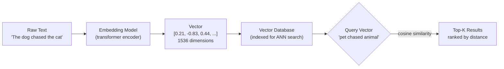
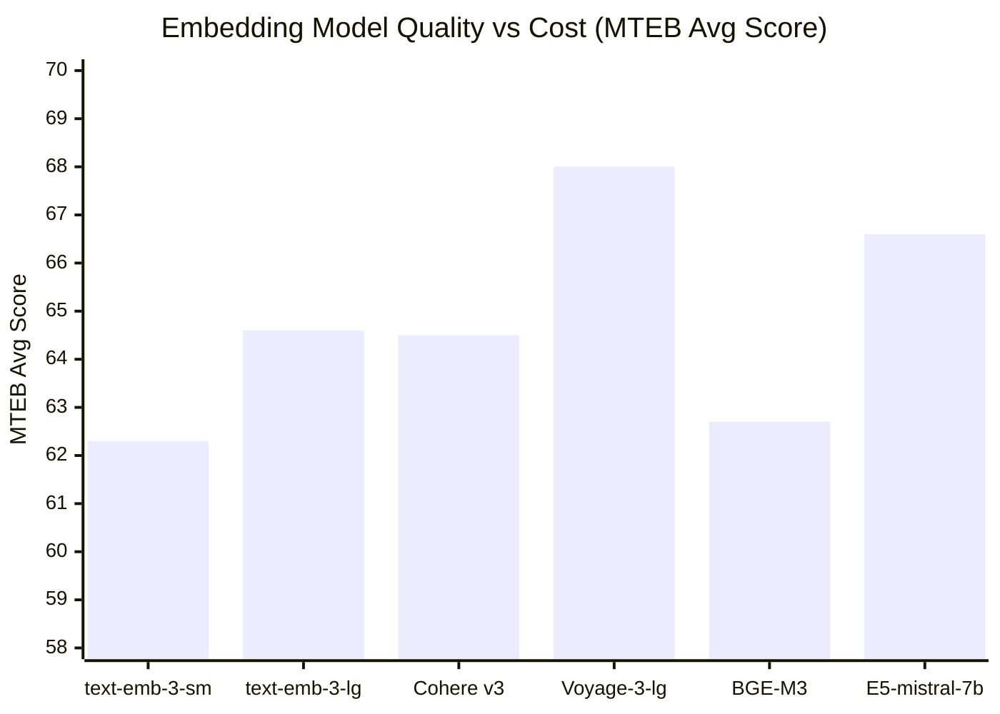
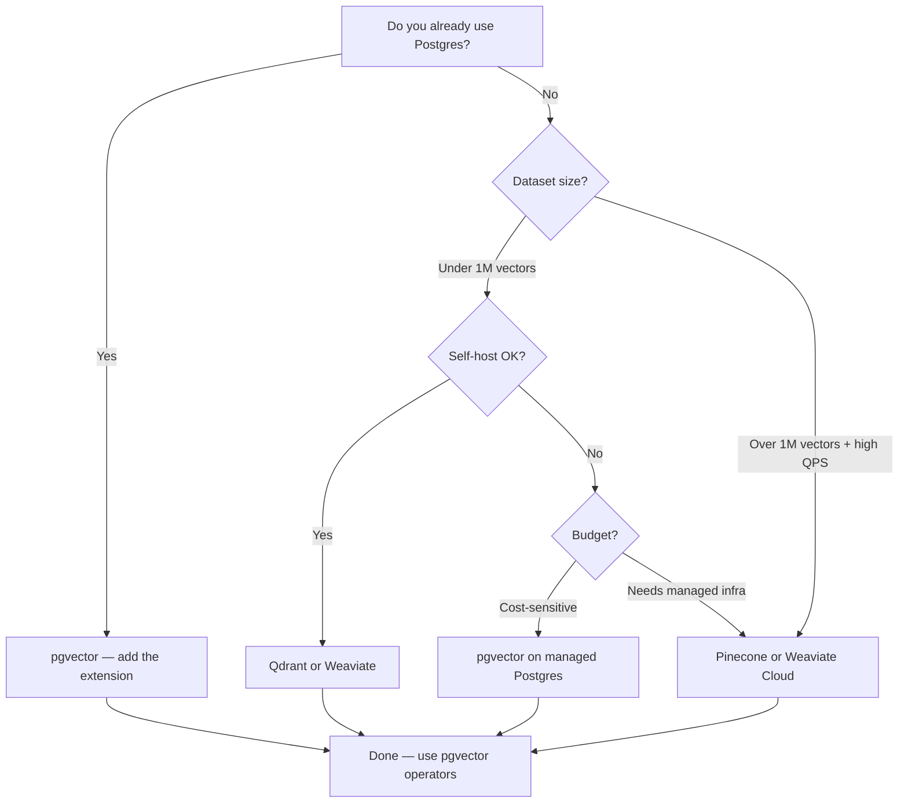

Search has a dirty secret. Traditional keyword search fails the moment a user writes "car engine failure" when your documentation says "vehicle motor malfunction." The words are different; the meaning is identical. Embeddings are how modern AI systems bridge that gap — and once you understand how they work, you will see them everywhere: semantic search, RAG pipelines, recommendation engines, duplicate detection, and clustering workflows.

This guide walks through text embeddings from the ground up — what they are, how the best models produce them, which model to pick for your use case, and how to build a working semantic search system with real code.

## What Are Embeddings?

An embedding is a list of floating-point numbers — a **vector** — that represents the meaning of a piece of text. You can think of it as coordinates in a very high-dimensional space, where texts with similar meanings land close together and texts with different meanings end up far apart.

Here is a concrete analogy. Imagine a map of cities. Berlin and Munich are close. Berlin and Tokyo are far apart. Now imagine a "meaning map" for words: "king" and "queen" are nearby. "dog" and "puppy" are nearby. "database" and "SQL" are nearby. "dog" and "SQL" are far apart. Embeddings are exactly this — a map of meaning, expressed as coordinates your computer can calculate distances between.

The classic demonstration: if you take the vector for "king", subtract "man", and add "woman", you land very close to "queen". The arithmetic works because the model has learned that the relationship between gendered royalty terms is consistent and geometric in embedding space.



The power is in that last step. You do not need exact keyword matches. You search by meaning, and results that are semantically close bubble to the top even if they share no words with the query.

## How Embedding Models Work

Every modern embedding model is built on a transformer architecture — the same fundamental building block behind GPT, Claude, and Gemini. The difference is in what the model is trained to produce.

Generative models like GPT are trained to predict the next token. Embedding models are trained with a different objective: **contrastive learning**. The model is shown millions of pairs of text. Some pairs are semantically similar (a question and its correct answer, a product and its description, paraphrases of each other). Some pairs are semantically dissimilar. The model learns to push similar pairs together in vector space and dissimilar pairs apart.

The most common training technique is **Multiple Negatives Ranking Loss** combined with **in-batch negatives**: for each positive pair in a training batch, every other sentence in the batch becomes a hard negative. This forces the model to learn fine-grained distinctions rather than just separating obvious opposites.

Some models add a second stage: **hard negative mining**, where a preliminary model retrieves the most confusing false positives and uses those as negatives in the final training round. This is why state-of-the-art embedding models are so much better than older sentence transformers — the negatives are harder, so the model learns sharper boundaries.

The output is typically the hidden state of a special `[CLS]` token (or a mean-pooled representation of all token hidden states), projected down to the target embedding dimension via a linear layer.

## Popular Embedding Models

The embedding model landscape has consolidated around a handful of serious options. Here is what actually matters in production.

### OpenAI text-embedding-3-small and text-embedding-3-large

OpenAI's third-generation embedding models are the safe default for most teams. `text-embedding-3-small` produces 1536-dimensional vectors and costs $0.02 per million tokens — cheap enough that even high-volume applications barely notice it. `text-embedding-3-large` produces 3072-dimensional vectors with meaningfully better quality on long-document retrieval tasks.

The standout feature of the v3 series is **Matryoshka Representation Learning (MRL)**: you can truncate the vector to a shorter dimension (say, 256 dimensions) without retraining and still get competitive quality. This is useful when you want to trade a small quality loss for a big reduction in storage and search latency.

### Cohere Embed v3

Cohere built their embedding API with retrieval as the primary use case. `embed-english-v3.0` and its multilingual sibling `embed-multilingual-v3.0` are among the best-performing models on retrieval benchmarks like BEIR. Cohere's distinguishing feature is the `input_type` parameter — you declare whether you are embedding a search query or a document being indexed, and the model uses different representations for each. This asymmetric approach consistently improves retrieval precision.

Cohere also runs a compression feature called **int8 quantization** that shrinks storage by 4x with minimal quality loss, which matters when you are storing hundreds of millions of vectors.

### Voyage AI

Voyage AI's models (`voyage-3`, `voyage-3-large`, `voyage-code-3`) are consistently at or near the top of the MTEB (Massive Text Embedding Benchmark) leaderboard. Anthropic acquired Voyage AI in late 2024, and if you are already using Claude, the integration is natural. `voyage-code-3` is specifically optimized for code retrieval — it outperforms general-purpose models significantly when your corpus is source code, docstrings, and technical documentation.

### Open-Source: BGE and E5

If you need to self-host — for privacy, cost, or offline reasons — the two families worth knowing are **BAAI/BGE** and **Microsoft/E5**.

**BGE** (Beijing Academy of AI) produces the `bge-m3` model, which handles multiple retrieval modes (dense, sparse, and multi-vector colbert-style) in a single model, and is multilingual across 100+ languages. `bge-large-en-v1.5` is the go-to for English-only workloads on a budget.

**E5** (EmbEddings from bidirEctional Encoder rEpresentations) from Microsoft comes in `e5-small`, `e5-base`, and `e5-large` variants and is designed for asymmetric retrieval — prefixing queries with "query:" and documents with "passage:" is required but gives strong results. `e5-mistral-7b-instruct` uses a 7B decoder-only model for embeddings and is one of the strongest open-source options for long-document retrieval.

## Model Comparison

| Model | Dimensions | MTEB Avg | Context | Price | Self-host |
|---|---|---|---|---|---|
| OpenAI text-embedding-3-small | 1536 | 62.3 | 8191 tokens | $0.02/M tokens | No |
| OpenAI text-embedding-3-large | 3072 | 64.6 | 8191 tokens | $0.13/M tokens | No |
| Cohere Embed v3 (English) | 1024 | 64.5 | 512 tokens | $0.10/M tokens | No |
| Voyage voyage-3-large | 1024 | 68.0 | 32000 tokens | $0.18/M tokens | No |
| Voyage voyage-code-3 | 1024 | — (code) | 32000 tokens | $0.18/M tokens | No |
| BAAI/BGE-M3 | 1024 | 62.7 | 8192 tokens | Free | Yes |
| Microsoft/E5-large-v2 | 1024 | 62.2 | 512 tokens | Free | Yes |
| E5-mistral-7b-instruct | 4096 | 66.6 | 32768 tokens | Free (7B params) | Yes |

*MTEB scores are approximate and change as benchmarks evolve. Check the [MTEB Leaderboard](https://huggingface.co/spaces/mteb/leaderboard) for current numbers.*



The pattern is clear: Voyage leads quality, OpenAI wins on simplicity and cost, and the open-source models (especially E5-mistral-7b) close the gap considerably if you can run 7B parameters.

## Building Semantic Search

Here is a working semantic search pipeline using Python. I will use OpenAI's embedding API, but the same pattern applies to any provider.

```python
import os
import json
import numpy as np
from openai import OpenAI

client = OpenAI(api_key=os.environ["OPENAI_API_KEY"])

def embed(texts: list[str], model: str = "text-embedding-3-small") -> np.ndarray:
    """Embed a list of texts and return a numpy array of vectors."""
    response = client.embeddings.create(input=texts, model=model)
    return np.array([item.embedding for item in response.data])

# --- Build the index ---
documents = [
    "The transformer architecture uses self-attention to process sequences in parallel.",
    "PostgreSQL supports full-text search with tsvector and GIN indexes.",
    "Docker containers share the host OS kernel but have isolated filesystems.",
    "RLHF fine-tunes language models using human preference data.",
    "Redis is an in-memory data store often used for caching and pub/sub.",
]

doc_vectors = embed(documents)  # shape: (5, 1536)

# --- Query ---
query = "How does containerization work?"
query_vector = embed([query])[0]  # shape: (1536,)

# --- Cosine similarity search ---
def cosine_similarity(a: np.ndarray, b: np.ndarray) -> np.ndarray:
    a_norm = a / np.linalg.norm(a)
    b_norm = b / np.linalg.norm(b, axis=1, keepdims=True)
    return b_norm @ a_norm

scores = cosine_similarity(query_vector, doc_vectors)
ranked = np.argsort(scores)[::-1]

for rank, idx in enumerate(ranked[:3], 1):
    print(f"{rank}. [{scores[idx]:.3f}] {documents[idx]}")
```

Running this returns Docker at rank 1 with a score around 0.72, even though the query says "containerization" and the document says "Docker containers." That is embeddings working as intended.

For production, replace the numpy brute-force search with a proper ANN (approximate nearest neighbor) index. The two most common are **FAISS** (Facebook AI Similarity Search) for in-process indexing and **pgvector** for Postgres-native storage with vector operators.

```python
# pgvector example — after `CREATE EXTENSION vector;`
import psycopg2

conn = psycopg2.connect(os.environ["DATABASE_URL"])
cur = conn.cursor()

# Store a document with its embedding
cur.execute(
    "INSERT INTO docs (content, embedding) VALUES (%s, %s)",
    (documents[0], doc_vectors[0].tolist())
)

# Query: nearest neighbors by cosine distance (<=>)
cur.execute(
    """
    SELECT content, 1 - (embedding <=> %s::vector) AS similarity
    FROM docs
    ORDER BY embedding <=> %s::vector
    LIMIT 5
    """,
    (query_vector.tolist(), query_vector.tolist())
)

for row in cur.fetchall():
    print(f"[{row[1]:.3f}] {row[0]}")
```

## Chunking for Embeddings

The single biggest quality mistake I see in production RAG systems is bad chunking. Embedding models have context limits — typically 512 to 8192 tokens — and they work best when each chunk has a **single coherent idea**.

A few chunking strategies worth knowing:

**Fixed-size chunking** splits text every N tokens with some overlap (e.g., 512 tokens, 50-token overlap). It is simple, predictable, and works reasonably well for dense technical prose. The downside is that it can split in the middle of a sentence or code block.

**Sentence-based chunking** splits on sentence boundaries and groups sentences until a token budget is hit. This produces more natural chunks but can be slow on large corpora.

**Semantic chunking** embeds each sentence, then groups adjacent sentences whose embedding distance is below a threshold. This is the most expensive approach but produces the most topically coherent chunks — especially useful for long documents that cover multiple distinct topics.

**Recursive document splitting** (the LangChain default) tries paragraph breaks first, then sentence breaks, then token breaks as a fallback. It is pragmatic and handles mixed-format documents reasonably well.

My rule of thumb: start with 512-token chunks and 10% overlap. Measure retrieval precision on a small eval set of 50-100 real queries before tuning further. Most teams over-engineer chunking before they have data to guide the decision.

## Storing Embeddings: Vector Databases

Once you have vectors, you need somewhere to put them that supports fast ANN search. The options have proliferated — here is the practical lay of the land.

**pgvector** is the path of least resistance if you are already on Postgres. It handles datasets up to tens of millions of vectors without specialized infrastructure, and you get joins, filters, and transactions for free. The tradeoff is that very high QPS workloads (thousands of queries per second) require careful index tuning.

**Pinecone** is a managed vector database optimized for real-time, high-QPS search. The serverless tier is cheap for small workloads, and the managed indexes handle sharding and replication automatically. The cost model gets expensive at scale — watch your write and storage bills.

**Weaviate** and **Qdrant** are open-source vector databases you can self-host or use as managed services. Both support hybrid search (combining dense vector search with BM25 keyword search), which tends to outperform pure semantic search in practice.

**ChromaDB** is a lightweight, embedded option popular for prototyping. It runs in-process with no server required, which makes it excellent for notebooks and local development, but it is not the right choice for production multi-user systems.



For most teams building their first RAG application: start with pgvector. Migrate to a dedicated vector database only when you have a real QPS or scale problem that pgvector cannot handle.

## Fine-Tuning Embeddings

General-purpose embedding models are trained on web text and broad domain data. If your corpus is highly domain-specific — legal contracts, medical literature, internal engineering docs, financial filings — fine-tuning on your own data can meaningfully improve retrieval quality.

The standard fine-tuning recipe:

1. **Generate training pairs** — positive pairs (query, relevant document) from your existing search logs, user feedback, or GPT-4 synthetic generation. Aim for at least 1000 pairs; 10,000+ is better.

2. **Mine hard negatives** — use your base model to retrieve the top-20 results for each query, then label the ones that are retrieved but wrong. These hard negatives make training much more effective than random negatives.

3. **Fine-tune with sentence-transformers** — the `sentence-transformers` library makes this straightforward:

```python
from sentence_transformers import SentenceTransformer, InputExample, losses
from torch.utils.data import DataLoader

model = SentenceTransformer("BAAI/bge-large-en-v1.5")

train_examples = [
    InputExample(texts=["query: what is an index?", "passage: A database index speeds up query lookups by creating a separate data structure."]),
    # ... more pairs
]

train_dataloader = DataLoader(train_examples, shuffle=True, batch_size=32)
train_loss = losses.MultipleNegativesRankingLoss(model)

model.fit(
    train_objectives=[(train_dataloader, train_loss)],
    epochs=3,
    warmup_steps=100,
    output_path="./fine-tuned-bge"
)
```

4. **Evaluate before and after** — use nDCG@10 on a held-out eval set. A 5-10 point improvement is realistic with good training data. A 20+ point improvement means your domain was very different from the pretraining distribution.

Fine-tuning is worth the effort when you have a high-volume application and a domain where general models underperform. For most teams, improving chunking and hybrid search (dense + BM25) delivers better ROI with less work.

## Common Pitfalls

**Mismatched query and document representations.** Some models (Cohere, E5, BGE with instruction tuning) expect different prefixes or `input_type` parameters for queries versus documents. Using the same representation for both can drop retrieval quality by 10-20 points. Always read the model card.

**Stale embeddings after document updates.** If you update a document and forget to re-embed it, your vector index is out of sync. Build re-embedding into your document ingestion pipeline, not as an afterthought.

**Ignoring context length limits.** Embedding models truncate silently when input exceeds their context limit. A 10,000-token document fed to a 512-token model produces an embedding of just the first 512 tokens. Always chunk before embedding, and verify chunk sizes programmatically.

**Pure semantic search for all queries.** Semantic search underperforms keyword search for exact-match queries: product IDs, error codes, proper nouns, version numbers. Hybrid search — combining BM25 and dense retrieval with reciprocal rank fusion — consistently outperforms either approach alone. If your vector database supports it, enable it.

**Not evaluating retrieval separately from generation.** In a RAG system, a bad answer can come from bad retrieval or bad generation. Most teams only measure the final answer quality. Measure retrieval precision separately — track whether the correct document appears in the top-5 for a set of gold queries — so you know which layer to fix.

**Over-engineering the embedding dimension.** Larger dimensions are not always better. For small-to-medium datasets, a 256-dimension vector often performs within 2-3% of a 1536-dimension vector while being 6x cheaper to store and search. Use the MRL capability of models that support it.

## Verdict

Text embeddings explained cleanly: they are vectors that encode meaning, enabling similarity-based retrieval that keyword search cannot match. The practical stack for most teams is OpenAI `text-embedding-3-small` or Voyage `voyage-3` for quality, pgvector for storage, and hybrid search (dense + BM25) for better overall precision. Fine-tune only after you have a solid chunking strategy and real eval data guiding your decisions.

The ecosystem is maturing fast, but the core concepts are stable. Learn them now and you will be able to evaluate new models and databases as they arrive rather than chasing each wave of benchmarks.

---

## FAQ

### What is the difference between embeddings and word vectors like Word2Vec?

Word2Vec produces one vector per word in a fixed vocabulary, and it does not account for context — "bank" gets the same vector in "river bank" and "bank account." Modern sentence embedding models produce a single vector for an entire text passage and are context-sensitive: the representation changes based on surrounding words. Sentence embeddings are consistently more useful for retrieval, classification, and clustering of real documents.

### How many dimensions do I actually need?

For most retrieval applications, 768 to 1536 dimensions covers the quality range where you stop seeing meaningful improvements. If your dataset is under 100,000 documents, 256-512 dimensions often works fine. The real constraint is not quality — it is storage cost and ANN index memory. Benchmark your use case at multiple dimensions before defaulting to the maximum.

### Can I use embeddings for languages other than English?

Yes. Cohere Embed Multilingual v3, BGE-M3, and the multilingual E5 models all handle 100+ languages with strong cross-lingual retrieval — meaning a query in Spanish can retrieve a relevant document in English. For monolingual non-English workloads, check if there is a language-specific model first; they often outperform multilingual models in that language.

### Do I need to re-embed everything when I switch models?

Yes. Vectors from different models live in incompatible spaces — you cannot compare a Cohere vector to an OpenAI vector. When you switch models, you must re-embed your entire corpus. This is a real migration cost to factor into model selection. It is one reason to start with a model you are willing to commit to for at least 12-18 months.

### What is the difference between semantic search and a full-text search index like Elasticsearch?

Full-text search (BM25/TF-IDF) ranks documents by term frequency and inverse document frequency — it requires lexical overlap between query and document. Semantic search uses embeddings to find conceptually related content even without shared terms. In practice, hybrid search — combining BM25 scores with cosine similarity scores via reciprocal rank fusion — outperforms either approach in isolation and is what most production retrieval systems use today.
