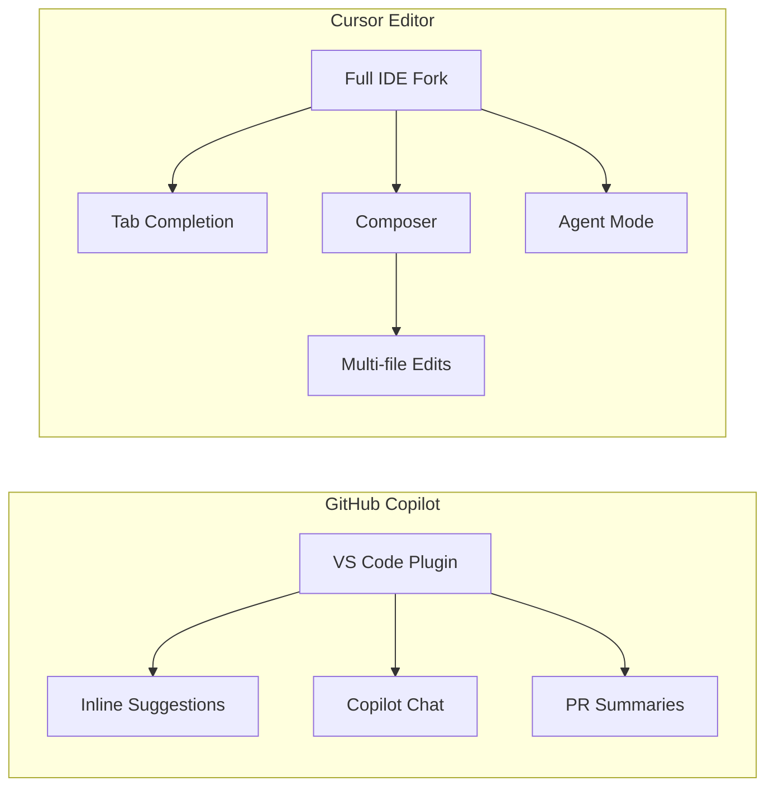
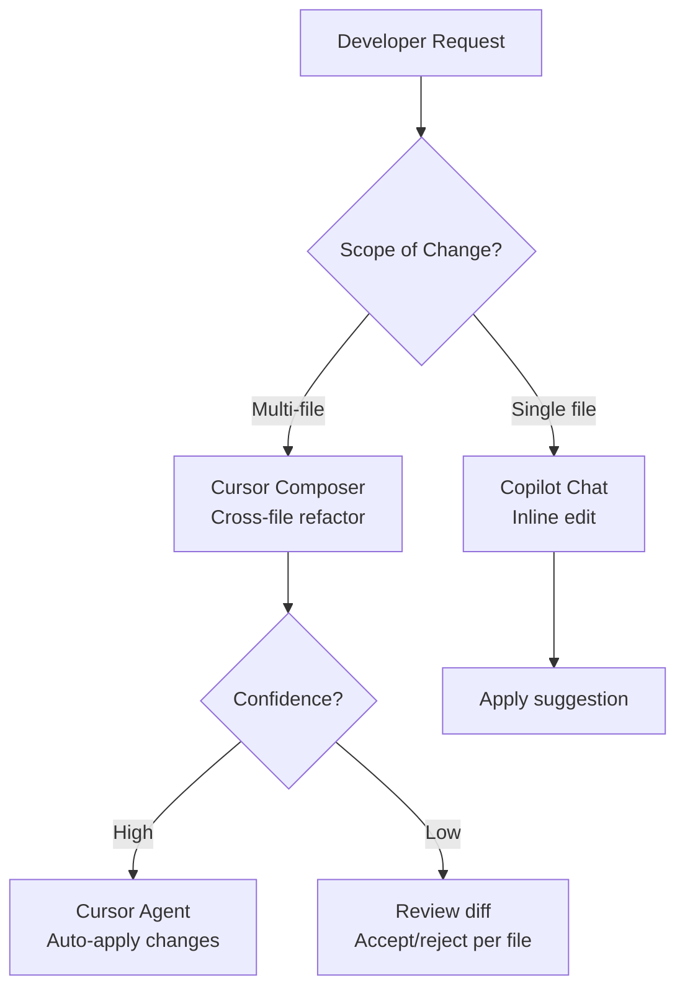
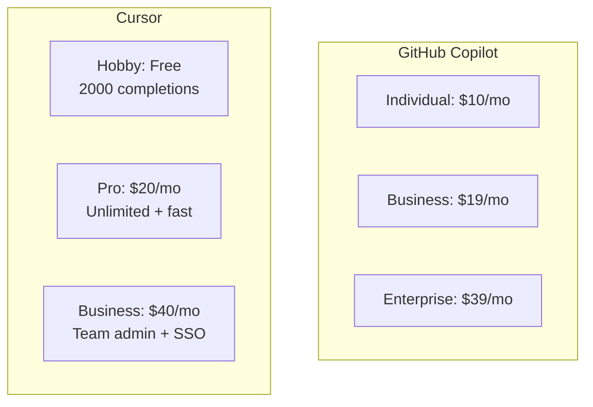

You're staring at a 500-line PR review. The diff touches six files, the original author left for vacation, and half the logic lives in a utility module you've never opened. You need answers fast — and you'd really like something smarter than a `grep` and a prayer.

This is exactly the scenario where AI coding tools have gone from novelty to necessity. But which one? GitHub Copilot has been around long enough to feel like part of the furniture, while Cursor arrived swinging with a full IDE overhaul and multi-file agent mode. We spent several weeks with both tools across real codebases — a Next.js app, a Python data pipeline, and a Go microservice — to give you an honest breakdown.

## At a Glance

| Feature | GitHub Copilot | Cursor |
|---|---|---|
| **Editor** | Plugin for VS Code, JetBrains, Neovim, etc. | Standalone IDE (VS Code fork) |
| **AI Models** | GPT-4o, Claude 3.5 Sonnet (selectable) | Claude 3.5 Sonnet, GPT-4o, custom models |
| **Inline Completion** | Yes, industry-standard | Yes, with more aggressive multi-line fills |
| **Chat Interface** | Copilot Chat (sidebar + inline) | Cursor Chat + Composer |
| **Agent / Multi-file Mode** | Copilot Workspace (beta), Copilot Edits | Cursor Composer (Agent mode) |
| **Codebase Indexing** | Limited (recent files, open tabs) | Full repo indexing with `@codebase` |
| **Starting Price** | $10/mo (Individual) | $20/mo (Pro) |
| **Best For** | Teams already in VS Code/JetBrains ecosystem | Developers who want the deepest AI integration |

## The Editor Experience

This is the biggest structural difference between the two tools, and it shapes everything else.

**GitHub Copilot is a plugin.** You keep your existing editor — VS Code, IntelliJ, Vim, whatever your team has standardized on — and Copilot layers on top. This is a genuine advantage in enterprise environments. IT policy, extensions, keybindings, themes, debugger configurations — none of that changes. Rolling out Copilot to a 200-person engineering org is an extension install and a license assignment. Done.

**Cursor is a full IDE.** It's built on a fork of VS Code, so the visual familiarity is real — your extensions mostly work, your keybindings transfer. But it is a separate application you have to install, maintain, and switch to. Some VS Code extensions behave slightly differently in Cursor's fork. For individuals, that's a one-time friction cost. For teams, it becomes a procurement, security review, and change management conversation.

What surprised us about Cursor is how fast the fork has caught up to VS Code proper. In daily use, the editor feels nearly identical. The AI features are embedded so deeply into the UI — the `Cmd+K` inline edit, the Composer panel, the `@` reference system — that switching back to plain VS Code starts to feel like working with one hand tied behind your back.

If you're choosing for yourself, Cursor's editor integration is genuinely better. If you're choosing for a team that hasn't asked to change editors, Copilot is the pragmatic call.

## Code Completion: Head to Head

Both tools offer ghost-text inline completions as you type. In this area, Copilot was the original standard-setter, and it remains excellent. Suggestions are fast, usually relevant, and the multi-line fill-in has gotten noticeably smarter over the past year.

Cursor's inline completion is more aggressive. It will frequently suggest entire function bodies, not just the next few lines. In our testing with boilerplate-heavy code — API route handlers, database models, test scaffolding — Cursor's fill-in saved measurable keystrokes. On more complex algorithmic code where correctness mattered more than speed, both tools produced suggestions that needed review regardless.

**Context awareness** is where they diverge most. Copilot's inline suggestions draw from your open files and recent edits. It's good at pattern-matching within a file and decent at picking up types from adjacent files you've opened. It does not, however, have a view of your full repository unless you're in one of the new Copilot Chat modes.

Cursor maintains a live index of your repo. Even in basic inline completion, it can pull in context from files you've never opened in the current session. In practice, this means fewer suggestions that use the wrong import path, call a deprecated method, or re-implement something that already exists in a utility module.

**Winner for completion:** Cursor, on context breadth. Copilot, on latency and reliability across different editors.

## Chat and Agent Mode

This is where the product gap has grown the widest, and it's where your decision will likely land.

**Copilot Chat** is a solid, well-integrated chat interface. Ask it about a function, get an explanation. Ask it to write a test, it writes a test. The inline chat (`Cmd+I` in VS Code) lets you make targeted edits with a natural language instruction. Copilot Edits, released in late 2024, extends this to multi-file changes — you describe what you want across several files, and Copilot proposes a diff.

**Cursor Composer** does the same thing, but the implementation feels a generation ahead. Composer operates in two modes: normal and Agent. In Agent mode, Cursor can read files, run terminal commands, interpret the output, and loop until it believes the task is done. We used it to scaffold a complete REST API from a spec file, including route definitions, middleware, error handlers, and a basic test suite. It ran the tests, caught a missing import, fixed it, and re-ran without any prompting.

Copilot's equivalent (Copilot Workspace) has been in beta for a while and, as of early 2026, still doesn't match the fluency of Cursor's Agent mode for complex tasks. It's improving, but Cursor is moving fast.

**Copilot Chat strengths:**
- Works natively inside JetBrains IDEs and GitHub.com
- GitHub-integrated commands (`/fix`, `/explain`, `/tests`) feel polished
- Consistent behavior across editor environments

**Cursor Composer strengths:**
- Agent mode can execute terminal commands and iterate on failures
- `@` references let you pull in specific files, docs, web URLs, or your full codebase
- Handles genuinely long, multi-step coding tasks with less manual intervention

## Codebase Awareness

Here's the comparison that matters most for working on established codebases rather than greenfield projects.

Copilot's codebase awareness is improving but remains session-scoped by default. The new `@workspace` command in Copilot Chat does search across your local project, but it works by sending a subset of your files to the model — the selection algorithm isn't fully transparent, and on large repos we occasionally got answers that missed relevant files.

Cursor indexes your entire repo on first open (with a local embedding store) and exposes this through `@codebase` in chat or Composer. Ask "where is payment processing handled in this app?" and Cursor will return specific file paths and code snippets from across the repo, not just what happens to be open. In our Go microservice tests, this made a substantial difference when we needed to trace how an interface was implemented across six different packages.

One important caveat: Cursor sends your code to its servers for indexing and inference. If your codebase contains proprietary algorithms, regulated data, or anything covered by strict data residency requirements, you need to review Cursor's privacy policy carefully. Copilot Business and Enterprise include organization-level data controls and a commitment that prompts are not used to train models — a meaningful difference for enterprise buyers.

## Pricing and Plans

| Plan | GitHub Copilot | Cursor |
|---|---|---|
| **Free** | 2,000 completions/mo, 50 chat messages | 2,000 completions/mo, limited Composer |
| **Individual / Pro** | $10/mo | $20/mo |
| **Business** | $19/mo per seat | $40/mo per seat |
| **Enterprise** | $39/mo per seat | Custom |
| **Key add-ons** | Copilot Enterprise includes docs indexing, PR summaries | Cursor Business adds SSO, centralized billing, privacy mode |

Copilot's Individual plan at $10/month is genuinely hard to beat for solo developers who are happy in their existing editor. For teams, Copilot Business at $19/seat includes audit logs, policy management, and the GitHub.com integration — features Cursor's $40/seat Business tier also covers, but at more than double the price.

Cursor Pro at $20/month gives you unlimited Composer usage, faster model access, and the full repo indexing. For individual developers doing heavy coding work, this is where most Cursor users land.

The pricing math shifts depending on what you're comparing. If your team already pays for GitHub Enterprise, Copilot Enterprise is bundled or discounted. If you're evaluating from scratch, Cursor Pro delivers more raw AI capability per dollar for individual developers, while Copilot Business wins on total cost at scale with its lower per-seat rate and existing enterprise integrations.

## What Developers Actually Say

Community sentiment across Reddit, Hacker News, and developer Twitter as of early 2026 breaks down along predictable lines.

Copilot users tend to praise its stability, its deep GitHub integration (especially PR summaries and issue references in chat), and the fact that it doesn't require changing their editor. The most common complaint is that codebase awareness lags behind Cursor for large monorepos, and that Copilot Workspace still feels beta-quality compared to Cursor's Agent mode.

Cursor users are enthusiastic about Composer and Agent mode to a degree that verges on evangelical. "I finished in two hours what would have taken me a day" is a recurring note, especially for scaffolding and refactoring tasks. The main complaints are around cost (particularly at team scale), occasional instability in the Cursor fork compared to VS Code proper, and concerns about sending proprietary code to Cursor's servers.

A smaller but notable segment uses both: Copilot for day-to-day completions in JetBrains (where Cursor doesn't run), and Cursor when tackling large feature work or refactors that benefit from Agent mode.

## GitHub Copilot: Pros and Cons

**Pros:**
- Works inside VS Code, IntelliJ, Vim, Neovim, and more — no editor switch required
- Lower per-seat cost for teams ($19/mo Business vs $40/mo)
- Deep GitHub.com integration: PR summaries, issue context, code search
- Enterprise-grade data controls and audit logs
- Stable, mature product with broad community knowledge
- Model selection (GPT-4o or Claude 3.5 Sonnet) available at the individual tier

**Cons:**
- Codebase awareness is session-scoped by default; `@workspace` is less comprehensive than Cursor's repo index
- Agent/multi-file mode (Copilot Workspace) still feels behind Cursor Composer as of early 2026
- Inline completion doesn't draw on full repo context
- JetBrains experience is good but not quite as polished as the VS Code version

## Cursor: Pros and Cons

**Pros:**
- Full repo indexing means `@codebase` and inline suggestions can draw on your entire project
- Composer Agent mode can execute terminal commands, read output, and iterate — genuinely agentic
- `@` reference system (files, docs, URLs, codebase) is flexible and powerful
- Faster iteration on AI features; the product has shipped significant improvements every few weeks
- Excellent for large refactors and multi-file scaffolding tasks

**Cons:**
- Requires switching to a separate IDE — a real friction point for teams
- More expensive at the team level ($40/mo Business vs $19/mo)
- Code is sent to Cursor's servers for indexing; less suitable for highly regulated environments without careful review
- VS Code fork occasionally lags on extension compatibility
- No native JetBrains or Vim support

## The Bottom Line

**Choose GitHub Copilot if:**
- Your team is standardized on VS Code, JetBrains, or Vim and you don't want to change editors
- You work in an enterprise environment where data controls, audit logs, and vendor SOC 2 compliance matter
- You're buying at scale and want the lower per-seat cost
- You primarily use AI for inline completions and occasional chat, not heavy agent tasks
- You're already paying for GitHub Enterprise and want integrated PR and issue features

**Choose Cursor if:**
- You're an individual developer or small team willing to adopt a new editor for significantly better AI depth
- You regularly tackle large refactoring tasks, feature scaffolding, or codebase exploration across many files
- You want the most capable agent mode available today without waiting for Copilot Workspace to mature
- You spend meaningful time in codebases you didn't write and need fast orientation

**Use both if:**
- You work across JetBrains (where Cursor doesn't run) and VS Code
- Your company provides Copilot licenses and you want to run Cursor on personal projects to evaluate the difference firsthand

In our testing, Cursor felt like the more ambitious product — faster feature development, deeper AI integration, and a clearer vision of what a "coding agent" should actually do. Copilot felt like the safer enterprise choice: well-supported, broadly compatible, and improving steadily without asking you to change how you work.

Neither tool makes you a better programmer by itself. But the right one, in the right workflow, genuinely does change how much you can accomplish in a day. Start with the free tier of each, bring them to a real project you're actively working on, and decide with your own fingers on the keyboard.
