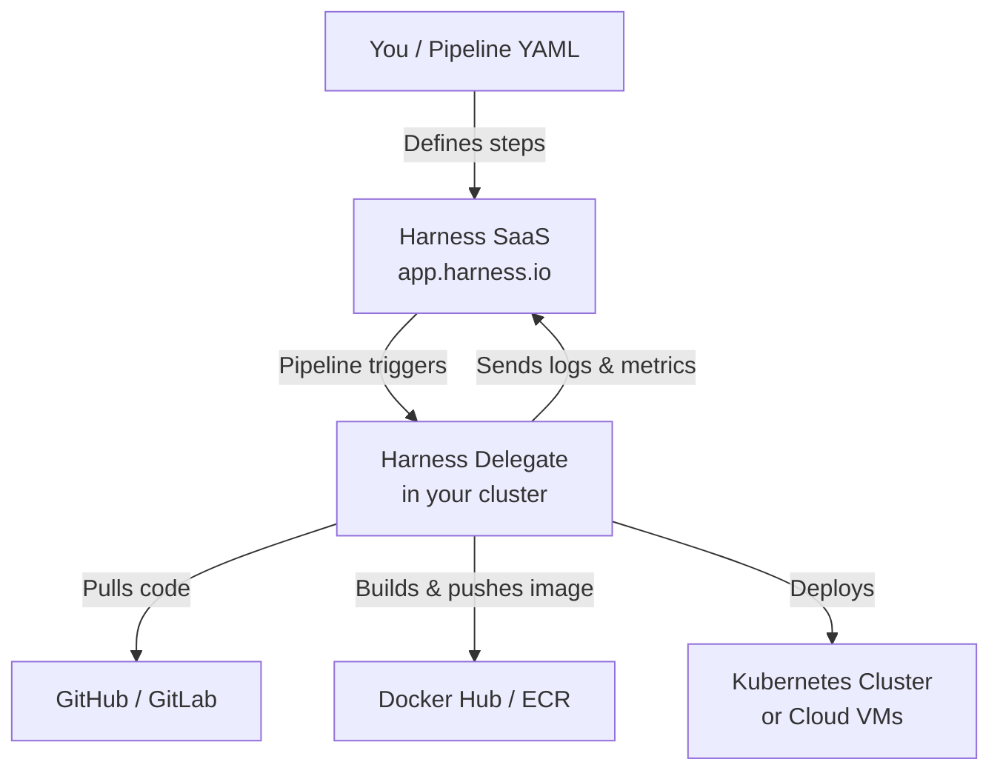
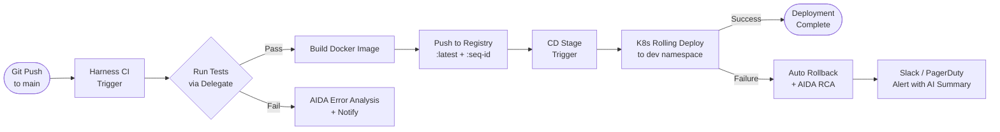
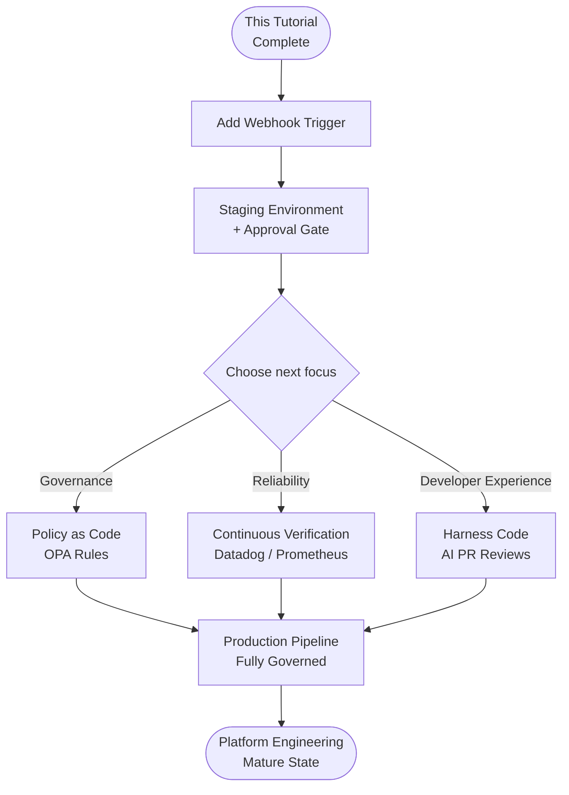

I remember the afternoon I first opened the Harness dashboard: tabs everywhere, YAML files that looked like alien scripture, and an error from the Delegate that gave me nothing useful to Google. Two hours in, I had a working pipeline. Six hours in, I had AI-assisted failure analysis turned on and my on-call rotation had already gotten quieter.

This tutorial walks you through exactly that journey — from zero to a full CI/CD pipeline with Harness AI Features enabled — in a way that actually makes sense the first time you read it.

Getting started with Harness CI/CD is easier than it looks from the outside, but only if you follow steps in the right order. Skip the Delegate setup and nothing works. Wire up AI features before your pipeline is stable and you'll be debugging two systems at once. This guide sequences everything so each step builds cleanly on the last.

---

## Prerequisites

Before you touch the Harness UI, make sure the following are in place:

- **A Harness account** — Free tier works for this tutorial. Sign up at [app.harness.io](https://app.harness.io).
- **A Kubernetes cluster or VM** — The Harness Delegate runs here. A local `kind` or `minikube` cluster is fine for learning.
- **`kubectl` installed and configured** — You'll apply the Delegate manifest from your terminal.
- **Docker installed** — Used in the CI pipeline build step.
- **A GitHub (or GitLab/Bitbucket) account** — To connect a source repository.
- **A Docker Hub or ECR account** — For pushing built container images.

If you're running Kubernetes locally, verify your cluster is healthy before proceeding:

```bash
kubectl cluster-info
kubectl get nodes
```

You should see at least one node in `Ready` state. If not, fix that first — the Delegate will install but immediately fail to register.

---

## Step 1: Create Your Harness Account and First Project

Head to [app.harness.io](https://app.harness.io) and sign up. The free plan includes unlimited pipelines with capped build minutes — plenty for getting started.

Once you're in:

1. Click **Projects** in the left nav, then **+ New Project**.
2. Give it a name: I'll use `demo-shop` throughout this tutorial.
3. Choose your organization (the default org is fine) and click **Save and Continue**.
4. Skip the module selection for now — you can enable CI and CD individually from the project dashboard.

The first thing Harness asks after project creation is whether you want to set up a pipeline using the wizard. Skip it. We're doing this manually so you understand each piece.

---

## Step 2: Install the Harness Delegate

The Delegate is the agent that runs inside your infrastructure. Every pipeline step executes through it — Harness never reaches directly into your network. This is the most important concept in the whole platform.

From your project, navigate to **Project Settings → Delegates → + New Delegate**.

Choose **Kubernetes** as the Delegate type. Harness generates a YAML manifest. Download it.

Apply the manifest:

```bash
kubectl apply -f harness-delegate.yml
```

Watch the pod come up:

```bash
kubectl get pods -n harness-delegate -w
```

Within two to three minutes you should see the pod reach `Running` state. Back in the Harness UI, the Delegate will appear as **Connected** with a green indicator.

If the Delegate stays in `Pending` or the pod restarts repeatedly, check its logs:

```bash
kubectl logs -n harness-delegate -l app=harness-delegate --tail=100
```

The most common problems at this stage are insufficient cluster resources (the Delegate needs at least 0.5 CPU and 768Mi memory) and network policies blocking outbound HTTPS to `app.harness.io`.

Here is how the Delegate fits into the overall Harness architecture:



The Delegate is the only component that needs outbound internet access. Your cluster nodes do not need to be publicly reachable.

---

## Step 3: Create Connectors

Connectors store credentials and tell Harness how to reach external systems. You need two before building a pipeline: a source code connector and a Docker registry connector.

### GitHub Connector

1. Go to **Project Settings → Connectors → + New Connector → Code Repositories → GitHub**.
2. Name it `github-demo-shop`.
3. Choose **Account** scope (lets all repos in the account use this connector).
4. Authentication: select **Personal Access Token**. Create a GitHub PAT with `repo` and `admin:repo_hook` scopes, paste it in.
5. Connectivity mode: **Connect through Delegate**. Select the Delegate you just installed.
6. Click **Save and Test** — Harness will verify the connection through the Delegate.

### Docker Hub Connector

1. **Connectors → + New Connector → Artifact Repositories → Docker Registry**.
2. Name it `dockerhub-demo-shop`.
3. Docker Registry URL: `https://index.docker.io/v2/`.
4. Authentication: your Docker Hub username and an access token (not your password — create one at hub.docker.com → Account Settings → Security).
5. Connectivity mode: **Connect through Delegate**.
6. Save and Test.

Both connectors should show a green **Verified** status. If either fails, the pipeline will fail at the corresponding step — fix connector issues now rather than debugging mid-pipeline.

---

## Step 4: Build Your First CI Pipeline

Now the fun part. In your project, navigate to **Continuous Integration → Pipelines → + Create a Pipeline**.

Name it `build-and-push`, choose **Inline** storage (YAML stored in Harness, not in your repo — you can switch later), and click **Start**.

Switch to the **YAML editor** view. Replace the default content with this:

```yaml
pipeline:
  name: build-and-push
  identifier: build_and_push
  projectIdentifier: demo_shop
  orgIdentifier: default
  stages:
    - stage:
        name: Build
        identifier: Build
        type: CI
        spec:
          cloneCodebase: true
          execution:
            steps:
              - step:
                  type: Run
                  name: Run Tests
                  identifier: run_tests
                  spec:
                    connectorRef: dockerhub-demo-shop
                    image: node:20-alpine
                    command: |
                      npm ci
                      npm test -- --passWithNoTests
              - step:
                  type: BuildAndPushDockerRegistry
                  name: Build and Push
                  identifier: build_and_push_image
                  spec:
                    connectorRef: dockerhub-demo-shop
                    repo: yourdockerhubusername/demo-shop
                    tags:
                      - latest
                      - <+pipeline.sequenceId>
          codebase:
            connectorRef: github-demo-shop
            repoName: your-github-username/demo-shop
            build:
              type: branch
              spec:
                branch: main
```

Replace `yourdockerhubusername` and `your-github-username` with your actual usernames.

Click **Save**, then **Run Pipeline**. Watch the execution in the **Execution** tab. Each step expands to show live logs streamed from the Delegate.

A successful first run looks like:

```
[Run Tests] npm ci: added 312 packages in 14s
[Run Tests] PASS src/app.test.js (2.1s)
[Build and Push] Successfully built abc123def456
[Build and Push] Pushed yourdockerhubusername/demo-shop:latest
[Build and Push] Pushed yourdockerhubusername/demo-shop:1
```

---

## Step 5: Add a CD Stage

With the image built and pushed, add a Continuous Delivery stage that deploys it to your Kubernetes cluster.

In the same pipeline YAML, add this stage block after the `Build` stage:

```yaml
    - stage:
        name: Deploy to Dev
        identifier: deploy_dev
        type: Deployment
        spec:
          deploymentType: Kubernetes
          service:
            serviceRef: demo_shop_svc
            serviceInputs:
              serviceDefinition:
                type: Kubernetes
                spec:
                  artifacts:
                    primary:
                      primaryArtifactRef: primary
                      sources:
                        - identifier: primary
                          spec:
                            connectorRef: dockerhub-demo-shop
                            imagePath: yourdockerhubusername/demo-shop
                            tag: <+pipeline.sequenceId>
                          type: DockerRegistry
          environment:
            environmentRef: dev
            deployToAll: false
            infrastructureDefinitions:
              - identifier: dev_k8s
          execution:
            steps:
              - step:
                  type: K8sRollingDeploy
                  name: Rolling Deploy
                  identifier: rolling_deploy
                  spec:
                    skipDryRun: false
            rollbackSteps:
              - step:
                  type: K8sRollingRollback
                  name: Rolling Rollback
                  identifier: rolling_rollback
                  spec: {}
```

Before this stage runs, you need to create two entities in **Continuous Delivery**:

- **Service** (`demo_shop_svc`): defines what gets deployed (the Docker image).
- **Environment + Infrastructure** (`dev` environment with `dev_k8s` infrastructure): defines where it deploys (your cluster namespace).

Both have UI wizards. For the infrastructure, you'll re-use the same Delegate and point to a namespace like `demo-shop-dev`.

---

## Step 6: Enable AI Features

Harness ships several AI capabilities under the **AIDA** (AI Development Assistant) umbrella. The most immediately useful for a new user are:

- **AI Error Analysis** — automatically explains pipeline failures and suggests fixes.
- **AI Root Cause Analysis (RCA)** — for CD failures, traces the failure back to a specific change or config drift.
- **AI Code Review suggestions** — available in Harness Code repositories.

### Enable AI Error Analysis

1. Go to **Account Settings → AI Features** (or **Project Settings → AI Features** for project scope).
2. Toggle **AI Error Analysis** to On.
3. No additional config needed — it activates for all pipelines in scope.

Now deliberately break your pipeline: change the test command to `npm run nonexistent` and run it. When the step fails, click the **AI Analysis** button that appears in the failure banner.

Harness AIDA will return something like:

> "The command `npm run nonexistent` failed because the script `nonexistent` is not defined in `package.json`. This is likely a typo or a missing script definition. Check your `package.json` `scripts` block and verify the intended command."

That's AIDA reading the raw logs and producing an actionable explanation — no prompt engineering required from you.

### Enable AI Root Cause Analysis for CD

For deployment failures, enable RCA under the same AI Features menu. RCA requires that your environment and service are set up with change tracking, which Harness handles automatically once the CD stage runs at least once successfully.

---

## Pipeline Flow Diagram

Here is the full pipeline from commit to deployed container:



---

## Troubleshooting Common Issues

**Delegate stays Pending / never connects**

Check pod events first: `kubectl describe pod -n harness-delegate -l app=harness-delegate`. Look for image pull errors (likely a network policy or registry auth issue) or resource pressure (`Insufficient cpu` or `Insufficient memory`). The Delegate image is pulled from Docker Hub — if your cluster nodes can't reach Docker Hub, you'll need to mirror the image or configure a pull secret.

**Connector test fails with "Unable to connect"**

This always routes through the Delegate. Verify the Delegate is Connected in the UI before debugging the connector. If the Delegate is connected but the test fails, check whether your cluster has outbound access to GitHub/Docker Hub from the Delegate pod: `kubectl exec -n harness-delegate <delegate-pod> -- curl -I https://github.com`.

**BuildAndPushDockerRegistry step fails with "unauthorized"**

Your Docker Hub access token may have expired or may be missing the `Read & Write` permission. Regenerate the token, update the connector secret in Harness, and retest the connector before re-running the pipeline.

**K8s Rolling Deploy fails with "ImagePullBackOff"**

The tag pushed during CI and the tag referenced in the CD stage must match. In the YAML above, both use `<+pipeline.sequenceId>`. If you customized the tag expression, verify it resolves to the same value in both stages by checking the **Execution Inputs** tab of a completed run.

**AIDA shows no analysis button**

AI features are scoped at account or project level. Confirm AIDA is enabled in **Project Settings → AI Features**, not just at the account level. Also verify your Harness plan includes AI features — free-tier availability changes over time, so check the current plan comparison at harness.io/pricing.

---

## Next Steps

Once your first pipeline is stable, here's where to go:

- **Add a trigger** — Set up a webhook trigger so every push to `main` automatically runs the pipeline without manual clicks. In Harness: **Triggers → + New Trigger → Webhook → GitHub**.
- **Add a staging environment** — Clone the CD stage, point it at a `staging` namespace, and add a manual approval gate between `dev` and `staging`.
- **Enable Harness Policy as Code** — Use OPA policies to enforce standards: every pipeline must have a test step, images must be scanned before push, deployments to production require two approvals.
- **Connect Harness to your observability stack** — Link Datadog, New Relic, or Prometheus. Harness CV (Continuous Verification) can automatically roll back if metrics degrade after a deploy.
- **Explore Harness Code** — Harness's built-in Git hosting adds AI-assisted PR reviews directly inside the platform, eliminating the GitHub connector hop for new projects.

Here is a suggested learning path after completing this tutorial:



---

## Tips and Best Practices

**Store pipeline YAML in your repo, not inline.** The Inline option is convenient for getting started, but as soon as the pipeline stabilizes, switch to **Remote** storage (Git experience). Your pipeline becomes version-controlled, reviewable in PRs, and auditable.

**Use expressions instead of hardcoded values.** `<+pipeline.sequenceId>` for image tags, `<+env.name>` for environment-specific config, `<+secrets.getValue("db_password")>` for credentials. Hardcoded values in YAML drift and break silently.

**Tag your Delegates.** If you run multiple Delegates (prod cluster vs. dev cluster), add selector tags in the Delegate YAML and reference those tags in pipeline steps. This ensures build steps run on the dev Delegate and production deploys run only on the production Delegate.

**Keep CI stages fast.** Run unit tests in CI, integration tests in a separate stage triggered on merge. A CI stage that takes fifteen minutes will be skipped or parallelized badly. Target under five minutes for the critical path.

**Review AI analysis outputs before acting on them.** AIDA is a strong first-pass tool, but it reads logs and applies heuristics — it doesn't have visibility into your system's operational history. Treat its output as a starting point for your investigation, not a final diagnosis.

**Rotate connector secrets on a schedule.** Harness stores connector credentials in its secret manager. Add a quarterly reminder to rotate PATs and access tokens. A stale token will fail silently at 3am on a Friday.

---

## FAQ

### Do I need a paid Harness plan to follow this tutorial?

No. The free plan supports everything in this tutorial: one Delegate, unlimited pipelines (with build minute caps), CI and CD stages, and basic AI features. As of early 2026, AIDA Error Analysis is available on the free tier. RCA and some advanced AI features require a paid plan. Check harness.io/pricing for the current breakdown — it changes faster than tutorials do.

### Can I run the Delegate on a VM instead of Kubernetes?

Yes. Harness supports a Docker-based Delegate for VM deployments. When generating the Delegate manifest, select **Docker** instead of Kubernetes. You get a `docker run` command with your account token embedded. The rest of the tutorial works identically — only the install step changes.

### How does Harness handle secrets?

Harness has a built-in secrets manager and integrates with HashiCorp Vault, AWS Secrets Manager, GCP Secret Manager, and Azure Key Vault. For this tutorial, the connector credentials are stored in Harness's default secrets manager. For production, connect your existing vault and reference secrets using `<+secrets.getValue("secret-name")>` in pipeline YAML — the plain-text value is never logged.

### What's the difference between a Delegate selector and a Delegate tag?

They're the same thing with different names in different parts of the UI. A **tag** is what you assign to the Delegate (e.g., `prod`, `dev`, `us-east-1`). A **selector** is how you reference that tag in a pipeline step or connector to say "this step must run on a Delegate with this tag." Use them together to ensure the right workloads run in the right environments.

### Can I use Harness with a monorepo?

Yes, and it works well. Harness supports path-based triggers so the pipeline only runs when files inside a specific directory change. In your webhook trigger settings, add a **file path filter** like `services/demo-shop/**`. Multiple services in the same repo get separate pipelines with separate path filters, and the Delegate handles them all without conflict.

---

Getting started with Harness CI/CD has a real learning curve, but it follows a clear progression: Delegate first, connectors second, CI pipeline third, CD stage fourth, AI features on top. Follow that order and each step is debuggable in isolation. Jump ahead and the errors multiply.

The AI features are not the reason to choose Harness, but they compound the value once you have a working pipeline. Error analysis alone has saved me hours of log-scrolling. Root cause analysis on deployment failures cut my incident response time meaningfully. Those aren't marketing claims — they're things that work quietly in the background once the foundation is solid.

Get the foundation right. The rest follows.
