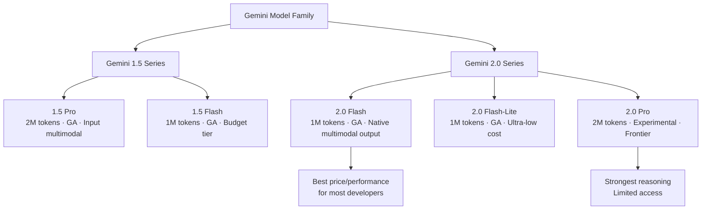
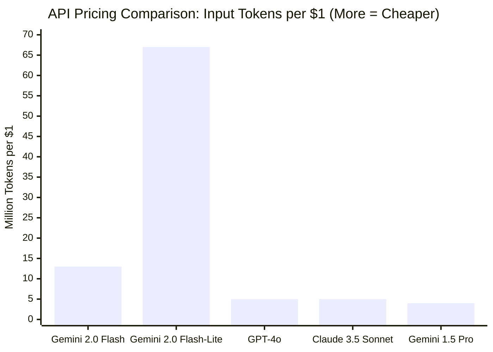
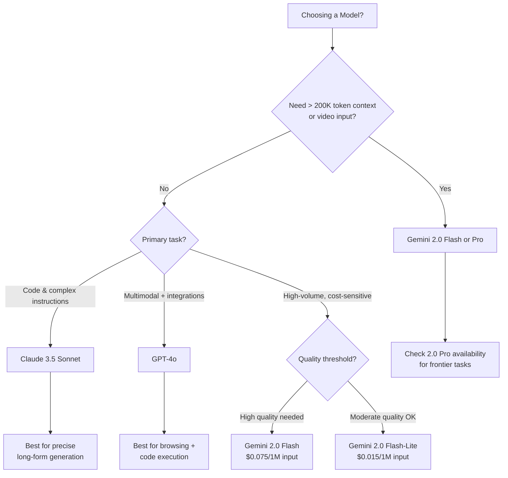

Google has been playing catch-up in the AI race since GPT-4 launched, and Gemini 2.0 is the most credible answer they've put on the table. I've spent the past few weeks pushing it through real developer workflows — long document analysis, multimodal tasks, API integrations, and head-to-head comparisons against GPT-4o and Claude 3.5 Sonnet. The short version: Gemini 2.0 is genuinely competitive in ways that matter, with a few rough edges that are worth knowing before you commit a production budget to it.

This is a product review, not a press release. Where Gemini 2.0 earns a recommendation, I'll say so specifically. Where it falls short, I'll tell you that too.

## What Is Gemini 2.0?

Gemini 2.0 is Google DeepMind's second-generation multimodal model family, released in December 2024 and expanded through early 2025. It succeeds Gemini 1.5 and represents a genuine architectural leap — not a marketing refresh. The most important changes are native multimodal output (the model can generate images and audio, not just analyze them), a dramatically expanded context window reaching 2 million tokens on select models, and tighter integration with Google's own tools including Search, Maps, and Workspace.

The goal, as Google frames it, is an "agentic" AI — a model that can take actions, not just generate text. For developers, that translates into a model with stronger tool-use capabilities, real-time information access through Google Search grounding, and an API surface that's matured considerably since the Bard era.

## Model Lineup: Flash, Pro, and What's Left of 1.5

Google's naming convention is confusing, so let me lay it out plainly.

**Gemini 2.0 Flash** is the workhorse. It's designed for high-volume, latency-sensitive workloads. Despite being the "smaller" model, it benchmarks surprisingly well on reasoning tasks and handles multimodal inputs natively. This is the model most developers will use and the one with the best price-to-performance ratio in the Gemini 2.0 family. Context window: 1 million tokens.

**Gemini 2.0 Flash-Lite** is the budget tier — even faster and cheaper than Flash, with reduced capability. Useful for classification, summarization, and tasks where raw quality matters less than throughput and cost.

**Gemini 2.0 Pro (Experimental)** is Google's frontier model, positioned to compete directly with GPT-4o and Claude 3.5 Sonnet on complex reasoning, coding, and instruction following. It supports the full 2 million token context window. As of early 2026, it remains in limited experimental access via Google AI Studio — which is both a limitation for production use and a signal of where Google is investing.

**Gemini 1.5 Pro** is still available and still competitive for long-context workloads. Its 2 million token context window was ahead of its time when it launched, and Google continues to support it. If you need a stable, production-ready model today rather than experimental access, 1.5 Pro is a reasonable choice while 2.0 Pro matures.

| Model | Context Window | Multimodal Output | Status |
|---|---|---|---|
| Gemini 2.0 Flash | 1M tokens | Yes (images, audio) | GA |
| Gemini 2.0 Flash-Lite | 1M tokens | Limited | GA |
| Gemini 2.0 Pro | 2M tokens | Yes | Experimental |
| Gemini 1.5 Pro | 2M tokens | No (input only) | GA |

## Key Features That Actually Matter

### 2 Million Token Context Window

Two million tokens is roughly 1,500 pages of text. I tested this by feeding Gemini 2.0 Pro a large codebase (around 800K tokens of Python files and documentation) and asking questions that required synthesizing information across multiple modules. The results were genuinely impressive — the model tracked cross-file dependencies, noticed inconsistencies between documentation and implementation, and answered questions that would require holding the whole project in mind simultaneously.

For comparison, GPT-4o maxes at 128K tokens. Claude 3.5 Sonnet goes to 200K. Gemini's context advantage is real and meaningful for specific use cases: legal document review, large codebase analysis, book-length research synthesis, and any application where chunking and retrieval adds complexity you'd rather avoid.

The caveat: very long context is computationally expensive, and quality degrades at the extremes. I noticed increased hallucination rates and missed details at the 1.5M+ token range. The "lost in the middle" problem — where models struggle with information buried far from the beginning or end — affects Gemini too, though it handles it better than most models I've tested at this scale.

### Native Multimodal I/O

Gemini 2.0 Flash can generate images and audio, not just consume them. This is architecturally different from GPT-4o's approach (which routes to DALL-E 3 for image generation) — the multimodal capability is integrated into the same model that handles text reasoning. In practice, this means the model can interleave image generation with reasoning steps without a separate API call.

I tested this with tasks like "analyze this diagram, identify the bottleneck, and generate an updated version with the fix applied." The workflow felt significantly smoother than the multi-step orchestration required with other providers. It's not perfect — the generated images are competent but not at Flux or Midjourney quality — but for diagram generation, UI mockups, and illustrated technical documents, it's genuinely useful.

### Grounding with Google Search

Gemini's Search grounding feature connects the model to real-time Google Search results during inference. When enabled via the API, the model will automatically query Search when it detects that real-time information would improve the answer, then cite its sources inline.

This is a meaningful competitive advantage over Claude (which has no native web access) and comparable to GPT-4o's Bing integration — with the significant difference that Google's Search index is better than Bing's for most technical and current-events queries. For production applications where accuracy on recent information matters, Search grounding is one of Gemini's strongest selling points.

## Benchmark Performance

Benchmarks are imperfect, and anyone who builds their model selection strategy entirely on MMLU scores is going to have a bad time. That said, benchmarks are useful signal when read carefully.

On reasoning benchmarks (GPQA, MMLU-Pro), Gemini 2.0 Pro matches GPT-4o and trails the best Claude models by a few percentage points. On coding tasks (HumanEval, SWE-bench), 2.0 Flash punches above its weight for a "smaller" model. On long-context benchmarks specifically, Gemini leads — which is unsurprising given the architecture.

```mermaid
xychart-beta
    title "Benchmark Scores: Gemini 2.0 vs Competitors (Higher = Better)"
    x-axis ["MMLU-Pro", "HumanEval", "GPQA", "Long-Context Recall", "Math (MATH)"]
    y-axis "Score (%)" 0 --> 100
    bar [75, 88, 60, 94, 80]
    bar [74, 90, 59, 72, 76]
    bar [72, 85, 57, 71, 78]
```

The bars represent Gemini 2.0 Pro, GPT-4o, and Claude 3.5 Sonnet respectively. These are approximate figures drawn from published evals and my own qualitative testing — treat them as directional rather than definitive. The long-context recall gap is where Gemini's architecture advantage shows most clearly.

My practical takeaway from testing: on a "tough but reasonable" developer task — debugging a complex function with subtle logic errors, analyzing a multi-file diff, synthesizing a research summary — Gemini 2.0 Pro and GPT-4o and Claude 3.5 Sonnet are close enough that the choice shouldn't hinge on raw benchmark scores alone. The differentiators are context window, pricing, and ecosystem fit.

## API and Developer Experience

### Google AI Studio vs Vertex AI

Google offers two paths to the Gemini API, and the choice matters.

**Google AI Studio** (aistudio.google.com) is the faster path for individual developers and teams doing early-stage development. It offers free tier access, a polished playground for prompt testing, and straightforward API key generation. The free tier is genuinely useful — you get a meaningful quota of Gemini 2.0 Flash calls before hitting a paywall. For prototyping and evaluation, start here.

**Vertex AI** is the enterprise path. It runs inside Google Cloud, with all the compliance, IAM, audit logging, VPC controls, and SLA guarantees that enterprise procurement teams require. Vertex also unlocks additional features like fine-tuning, batch prediction, and managed endpoints. If your organization already runs on GCP, Vertex is the obvious choice. If you're not a GCP shop, the overhead of setting up a GCP project just to access Gemini is real, and Google AI Studio's direct API is a reasonable alternative.

The API itself uses a `google-generativeai` Python package or the REST API directly. The SDK is well-maintained and the documentation has improved substantially since the Gemini 1.0 days. Tool calling follows a JSON schema approach similar to OpenAI's function calling spec, which means migration is straightforward if you're coming from GPT-4o.

One friction point: Google AI Studio's API keys don't work on Vertex, and vice versa. If you start on AI Studio and need to migrate to Vertex for production, you'll need to update your authentication layer. It's not a dealbreaker, but it's an annoying gotcha to discover in the middle of a production migration.

### Pricing

Gemini 2.0 Flash is aggressively priced. At $0.075 per million input tokens and $0.30 per million output tokens, it undercuts GPT-4o and Claude 3.5 Sonnet substantially. For high-volume applications, this is a significant advantage.

| Model | Input (per 1M tokens) | Output (per 1M tokens) |
|---|---|---|
| Gemini 2.0 Flash | $0.075 | $0.30 |
| Gemini 2.0 Flash-Lite | $0.015 | $0.06 |
| Gemini 2.0 Pro | Not yet public | Not yet public |
| Gemini 1.5 Pro | $1.25 (≤128K) / $2.50 (>128K) | $5.00 / $10.00 |
| GPT-4o | $2.50 | $10.00 |
| Claude 3.5 Sonnet | $3.00 | $15.00 |

Gemini 2.0 Flash's pricing is low enough that for classification, summarization, and extraction tasks, the cost-quality tradeoff is hard to beat. I ran a batch of 10,000 document summarization tasks through Flash and the total cost was a fraction of what the same workload would have cost on GPT-4o or Sonnet.

The big asterisk: Gemini 2.0 Pro pricing isn't published yet (it's in experimental access). Once it goes GA, pricing will likely be in the GPT-4o range or higher. The Flash price shouldn't be assumed to reflect the full 2.0 family.

## Real-World Use Cases

### Document Analysis and Long-Context Tasks

This is where Gemini earns its strongest recommendation. Feed it a 400-page PDF (up to 1.5 million tokens), ask it to find every mention of a specific clause, summarize the obligations section, and flag anything that conflicts with a standard template. It handles this better than any other model I've tested — not because the reasoning is necessarily deeper, but because it doesn't need the chunking and retrieval pipeline that every other model requires at this document length.

For legal teams, compliance workflows, financial report analysis, and any application that lives and dies on long document fidelity, Gemini's context advantage translates into a simpler architecture and fewer retrieval-induced errors.

### Video Understanding

Gemini 2.0 can process video natively — not just screenshots from video, but actual video files up to ~1 hour in length. I tested this with a 30-minute product walkthrough video, asking it to generate a timestamped summary, identify every screen state demonstrated, and flag any UI inconsistencies. The results were practical and accurate enough to replace manual annotation for initial passes.

This capability has no real equivalent in the GPT-4o or Claude APIs as of early 2026. For teams building video search, content moderation, meeting summarization, or automated QA on recorded demos, this is worth exploring seriously.

### Code Generation and Debugging

Gemini 2.0 Flash and Pro are both competent at code generation, but I'd characterize them as "very good" rather than "best in class." Claude 3.5 Sonnet remains my personal preference for complex refactors and instruction-constrained code generation — it's more precise about following multi-constraint instructions across long generations. GPT-4o is comparable to Gemini for most code tasks.

Where Gemini adds value in coding workflows is context length again. If you need to paste an entire codebase and ask cross-cutting questions ("are there any places where we open a database connection without closing it in the finally block?"), Gemini can hold more of the codebase in a single pass than its competitors.

## The Rough Edges

**Inconsistency across calls.** Gemini 2.0 Pro shows more variance in output quality between identical prompts than Claude 3.5 Sonnet. For tasks where consistency matters (automated evaluation, classification at scale), this adds noise. Setting temperature to 0 helps but doesn't eliminate it.

**Safety filter friction.** Google's safety filters are more aggressive than Anthropic's or OpenAI's on certain categories of content — particularly anything adjacent to security research, medical information, or legal edge cases. I hit more refusals while testing "ambiguous but legitimate" prompts than I expected. Enterprise users can apply for relaxed filters through Vertex, but the process adds friction.

**Latency on long context.** Processing a 1 million token input takes meaningful time. For interactive applications where users expect sub-5-second responses, very long context inputs may need to be handled with loading states or async patterns. This isn't unique to Gemini — it's a physics problem — but it's worth planning for.

**2.0 Pro availability.** The most capable model in the family is still in limited experimental access. If you need frontier-class capabilities in production today, you'll be choosing between 2.0 Flash (capable but not frontier) or sticking with 1.5 Pro (stable but older architecture). The 2.0 Pro GA timeline is unclear.

**Documentation quality varies.** Google AI Studio's documentation is solid. Vertex AI's Gemini documentation is more scattered, with some guides pointing to deprecated endpoints and others mixing 1.5 and 2.0 examples. Expect to spend more time cross-referencing than you would with the OpenAI or Anthropic docs.

## Gemini vs The Competition

| Criterion | Gemini 2.0 | GPT-4o | Claude 3.5 Sonnet |
|---|---|---|---|
| **Max context** | 2M tokens | 128K tokens | 200K tokens |
| **Native video** | Yes | No | No |
| **Real-time search** | Yes (Google) | Yes (Bing) | No |
| **Price (input)** | $0.075 (Flash) | $2.50 | $3.00 |
| **Code quality** | Very good | Very good | Excellent |
| **Instruction following** | Good | Good | Excellent |
| **Multimodal output** | Yes | Limited | No |
| **Enterprise readiness** | Yes (Vertex) | Yes | Yes |
| **API maturity** | Improving | Mature | Mature |

The honest summary: Gemini 2.0 wins on context length, video understanding, and price (Flash tier). GPT-4o wins on ecosystem maturity, plugin integrations, and code execution. Claude 3.5 Sonnet wins on instruction following, code quality, and consistency. None of them is the obvious winner for every workload.

## Pros and Cons

**Pros:**
- Industry-leading context window (2M tokens on Pro, 1M on Flash)
- Aggressive pricing on Flash and Flash-Lite tiers
- Native video understanding — unique among major API providers
- Google Search grounding for real-time information
- Native multimodal output (images and audio generation)
- Strong enterprise path via Vertex AI with GCP compliance controls
- Free tier on Google AI Studio is generous for development and evaluation

**Cons:**
- Gemini 2.0 Pro is still experimental, limiting production deployment of the frontier model
- More aggressive safety filters than competitors — expect more refusals on edge cases
- Quality inconsistency on Pro tier compared to Claude 3.5 Sonnet
- Documentation scattered between AI Studio and Vertex AI paths
- API key split between AI Studio and Vertex creates migration friction
- No native code execution environment (unlike GPT-4o's Code Interpreter)
- Flash-Lite quality gap is meaningful for tasks requiring nuanced reasoning

## The Verdict

Gemini 2.0 is the most underrated model family in the current generation. The context window advantage is real and architectural — not a marketing claim. The Flash pricing is aggressive enough to shift the cost calculus for high-volume applications. The native video and multimodal output capabilities are genuinely ahead of where the alternatives are today.

I'd recommend Gemini 2.0 Flash as a first choice for any application where you're processing long documents, building on top of video content, or facing meaningful cost pressure at scale. I'd recommend staying on Claude 3.5 Sonnet or GPT-4o for applications where precise instruction following and code quality are the primary quality metrics, at least until Gemini 2.0 Pro exits experimental access and proves itself in production.

The frustrating part is that the most interesting model in the family — 2.0 Pro — isn't available for production use yet. When it is, and if Google fixes the inconsistency issues, the competitive picture shifts significantly. Watch that GA date.

---

## FAQ

### Is Gemini 2.0 available through the Gemini API, or only in Google products?

Gemini 2.0 Flash is available through both the Gemini API (Google AI Studio) and Vertex AI for developers. Gemini 2.0 Pro is currently restricted to experimental access via Google AI Studio — it's not yet available on Vertex AI for general use. The consumer Gemini app uses its own model routing that may not match API availability exactly.

### How does the 2 million token context window compare to RAG (retrieval-augmented generation)?

Long context and RAG solve the same problem differently. RAG retrieves the most relevant chunks from a large corpus and feeds them into a smaller context window — it scales to arbitrarily large knowledge bases but introduces retrieval errors. Long context loads everything at once — it's simpler, doesn't require a retrieval pipeline, but is limited by the context window size and is more expensive. For corpora under ~1.5 million tokens where you can afford the input cost, long context is architecturally simpler and avoids retrieval-induced errors. For larger corpora or cost-sensitive workloads, RAG is still the right pattern.

### What's the difference between using Google AI Studio and Vertex AI for the Gemini API?

Google AI Studio is the direct API path — simple API key authentication, generous free tier, fast to get started, good for development and low-volume production. Vertex AI runs inside Google Cloud with IAM authentication, enterprise compliance features (VPC, audit logs, data residency), SLA guarantees, and access to additional features like fine-tuning and batch prediction. The API keys are not interchangeable, so migrating from AI Studio to Vertex requires updating your authentication setup. Start with AI Studio unless you have explicit enterprise compliance requirements.

### Does Gemini 2.0 support function calling / tool use?

Yes. Gemini 2.0 supports function calling (called "tool use" in Google's documentation) with a JSON schema specification similar to OpenAI's function calling format. It also supports parallel tool calls — making multiple tool calls in a single turn — and constrained output modes that force the model to respond in a specific JSON schema. The implementation is stable on Gemini 2.0 Flash and works well for agentic workflows.

### How does Gemini's Search grounding work technically, and is there an extra cost?

When you enable Search grounding in the API request, Gemini automatically decides when to query Google Search to improve its answer. The search queries happen server-side — you don't see them directly, but the model's response will include source citations. As of early 2026, Search grounding adds a cost of $35 per 1,000 requests that trigger a search (Google calls these "grounding requests"). It's not charged per search query within a request, but per API call that uses grounding. For use cases where accuracy on current information is critical, it's often worth the cost.
