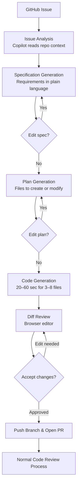
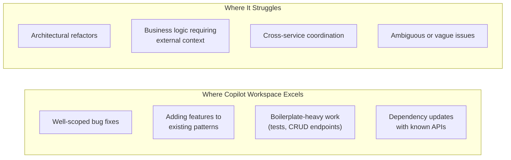
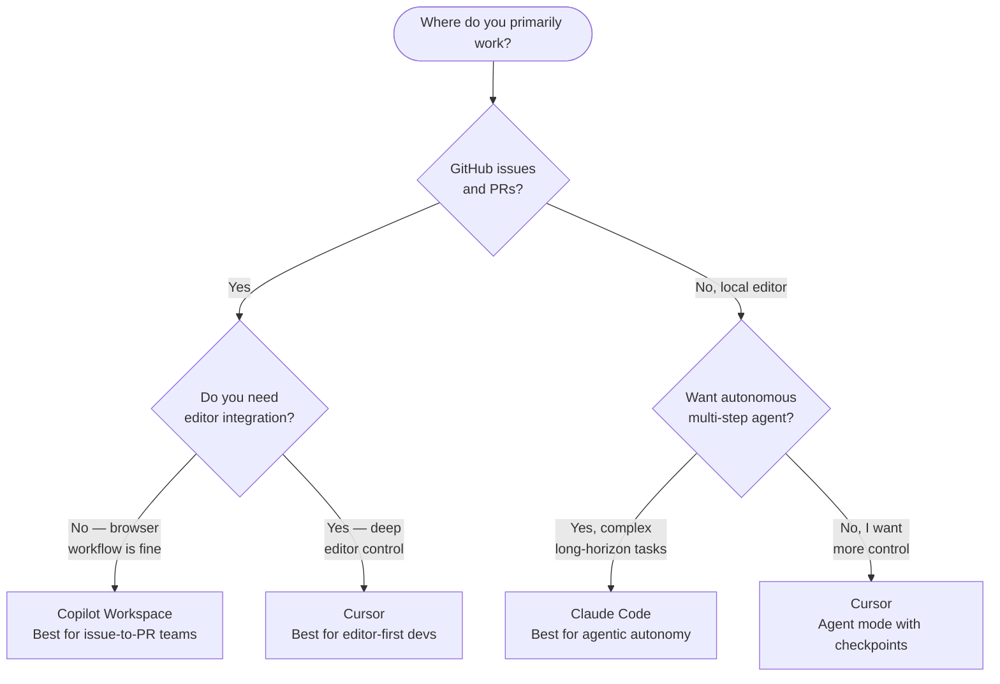

I spent three weeks throwing real GitHub issues at Copilot Workspace — everything from "add pagination to this API endpoint" to "refactor the authentication module to support OAuth2." The results were more interesting than I expected, and not always in the ways the marketing suggests. If you are evaluating whether Copilot Workspace belongs in your development workflow, this is the review I wish I had before I started.

## What Is Copilot Workspace?

Copilot Workspace is GitHub's attempt to build an AI development environment that operates at the task level rather than the file level. Where GitHub Copilot (the original extension) works line by line inside your editor, Copilot Workspace steps back and works at the level of an entire GitHub issue. You open a task, Copilot Workspace reads the issue, generates a specification, writes a plan, produces code changes across multiple files, and creates a pull request — all without you writing a single line of code yourself.

The product launched in public preview in 2024 and has iterated steadily since. By early 2026, it has graduated from novelty experiment to something that serious development teams are piloting for real work. It is not replacing senior engineers, but for a specific category of well-defined tasks, it is meaningfully reducing the time from "issue created" to "PR ready for review."

Copilot Workspace lives in the browser. You access it directly from any GitHub issue by clicking the "Open in Workspace" button. There is no local installation required. All the context comes from your repository, and all the output goes back into GitHub as a draft pull request.

## How It Works: Issue to PR

The workflow is the product's biggest differentiator. Understanding it precisely matters because the quality of the output depends entirely on how well you set up each stage.

**Stage 1 — Issue analysis.** When you open an issue in Copilot Workspace, the system reads the issue title, body, and comments. It also reads your repository's README, recent commit history, and key source files it considers relevant. From this it generates a natural-language description of the current state of the codebase and what the issue is asking for. This is your first sanity check. If the system misunderstands the issue at this stage, everything downstream will be wrong. I found that well-written issues with clear acceptance criteria produced accurate analyses. Vague issues like "improve performance" produced generic analyses that were not useful.

**Stage 2 — Specification generation.** Copilot Workspace converts the issue analysis into a structured specification: a list of requirements the solution must satisfy. You can edit this specification freely before proceeding. This is the most powerful intervention point in the entire workflow. Spending two minutes refining the spec consistently produced better code downstream.

**Stage 3 — Plan generation.** The system translates the specification into a concrete plan: which files will be created, which files will be modified, and what each change will accomplish. Again, you can edit the plan. This is where you catch structural mistakes — for instance, a plan that proposes modifying the wrong module or missing a dependency update.

**Stage 4 — Code generation.** With the plan approved, Copilot Workspace generates code. This is the step most people focus on, but it is actually the least important place to intervene. By the time code is being generated, the spec and plan have already constrained what is possible. The code generation step is fast — typically 20 to 60 seconds for tasks involving three to eight files.

**Stage 5 — Review and PR.** The generated code appears as a diff for each file. You review the diffs, make edits in the browser editor, and when satisfied, push the branch and open a pull request. Copilot Workspace pre-fills the PR description with a summary derived from the specification.

## Key Features

**Specification generation.** The spec step is what separates Copilot Workspace from raw code generation tools. By surfacing requirements explicitly — in human-readable form, before any code is written — the system gives you a chance to correct misunderstandings while the cost of correction is low. In my testing, editing the spec to add one or two missing requirements consistently produced better implementations than accepting the first spec and patching the code afterward.

**Multi-file editing.** Copilot Workspace tracks dependencies across your codebase and generates coordinated changes. When I asked it to add a new REST endpoint, it updated the route file, the controller, the type definitions, the test file, and the OpenAPI spec in one pass. Each file's changes are presented as a separate diff, so you can accept them individually. This is the feature that makes Workspace feel qualitatively different from asking a chatbot to write code.

**Built-in terminal.** The workspace includes a cloud-hosted terminal connected to a snapshot of your repository. You can run your test suite, execute build commands, and verify that the generated code actually works before pushing anything. In practice, I used the terminal on about half of my sessions. For larger changes, being able to confirm `npm test` passes in the workspace environment saved me from pushing broken branches.

**Session continuity.** Copilot Workspace saves your session. If you close the browser tab and return later, the spec, plan, and generated code are still there. This is more useful than it sounds — complex tasks sometimes need a second look after stepping away.

**GitHub-native context.** Because Workspace operates directly on GitHub, it has access to your full issue history, label taxonomy, linked PRs, and commit history. It uses this context to produce analysis that is more repository-aware than anything you could get from pasting code into a general-purpose AI chat.

## Real-World Testing

I tested Copilot Workspace against a TypeScript monorepo — roughly 55,000 lines of code, a mix of Express APIs, React frontends, and shared utility libraries. I ran 22 tasks over three weeks, ranging from small bug fixes to medium-sized feature additions.

**Where it excelled:**

The best results came from clearly scoped, well-defined issues. "Add rate limiting to the /api/auth/login endpoint using the existing rate-limiter package" produced a correct, minimal implementation in under two minutes of total interaction time. The spec was accurate on the first pass, the plan touched exactly the right files, and the code followed existing conventions. I accepted it with one minor edit and it passed all tests.

Bug fixes with good reproduction steps also performed well. "Fix the date formatting bug in the invoice export — amounts over $10,000 lose the comma separator" led to Workspace correctly identifying the formatting utility, writing a fix, and updating the corresponding unit test. I would have found the same bug in about the same time, but Workspace did the mechanical work while I focused on the review.

**Where it struggled:**

Open-ended architectural tasks were a consistent weak point. "Refactor the user service to separate read and write operations" gave Workspace too much latitude. The generated spec was reasonable but generic. The plan proposed a reasonable structure but missed several call sites. The resulting code needed significant manual editing. This is not a failure — it is the right expectation — but it means Workspace is not a tool for design-level decisions.

Tasks that required understanding business context also underperformed. "Update the pricing calculation to match the new enterprise discount tiers" produced code that was syntactically correct but logically wrong because the business rules were in a Confluence doc, not in the repository. Copilot Workspace only reads what is in GitHub.

**Summary from 22 tasks:**
- Accepted with minimal editing: 11 tasks (50%)
- Accepted after significant editing: 7 tasks (32%)
- Abandoned and done manually: 4 tasks (18%)

That 82% acceptance rate for a three-week evaluation is a meaningful productivity signal. The four abandoned tasks were all architectural or required context outside the repository.

## Pricing

Copilot Workspace is included with GitHub Copilot Pro and GitHub Copilot Business — no separate purchase required.

**Copilot Individual / Pro ($10–19/month depending on plan):** Includes Workspace access with usage subject to fair-use limits during preview. Limits are generous enough that I hit them only once across 22 sessions.

**Copilot Business ($19/user/month):** Includes Workspace for the whole team, plus the organizational controls, audit logs, and policy management that enterprises require. This is the tier most teams will care about.

**Copilot Enterprise ($39/user/month):** Adds Copilot knowledge bases (which let Workspace read your internal documentation, not just the repository), fine-tuned models on your codebase, and deeper integration with GitHub Advanced Security.

If your organization already pays for GitHub Copilot Business, you already have access to Copilot Workspace. There is no incremental budget conversation to have. That zero-marginal-cost entry point is one of Workspace's biggest practical advantages over standalone tools.

## Copilot Workspace vs Cursor vs Claude Code

These three tools overlap in that they all apply AI to multi-file coding tasks, but they solve different problems and fit different workflows.

**Copilot Workspace** operates at the task level inside GitHub. It is browser-based, requires no local setup, and is tightly integrated with the issue-to-PR workflow. You trade deep editor integration for a structured, checkpoint-based pipeline that is easier to audit and review. It is strongest for teams already working in GitHub issues and wanting AI help that stays inside that process.

**Cursor** is a local AI-native editor. It is faster for exploratory coding, handles larger contexts more fluidly, and gives you more moment-to-moment control through Tab completion, Composer, and Agent mode. It is strongest for developers who want AI deeply embedded in their editor experience and are comfortable managing the review process themselves.

**Claude Code** is a terminal-based agentic coding tool from Anthropic. It is the most autonomous of the three — capable of long multi-step tasks with minimal hand-holding — but also the least structured. It does not have Workspace's explicit spec/plan checkpoints or Cursor's visual diff review. It is strongest for experienced developers comfortable giving an AI significant latitude on complex tasks.

The honest answer is that most professional developers will end up using more than one of these tools for different situations. Copilot Workspace for structured issue-driven work. Cursor for exploratory feature development. Claude Code for complex autonomous tasks when you can afford to let the agent run.

## Limitations

**Repository context only.** Copilot Workspace reads your GitHub repository. It does not read your internal documentation, your Slack history, your Jira tickets, or your architecture decision records — unless you are on the Enterprise tier with knowledge bases configured. Any task that requires that context will produce incomplete results.

**No local environment awareness.** The cloud terminal runs against a snapshot, not your local development environment. If your project depends on local environment variables, external services, or a specific database state, you cannot fully validate the generated code inside Workspace. You will need to clone the branch and test locally.

**Browser-only interface.** You cannot use Copilot Workspace from your local editor. If you want to make changes, you either use the browser editor or pull the generated branch locally and continue in your normal workflow. The handoff between Workspace and local development is smoother than it sounds, but it is a context switch.

**Complex tasks degrade predictably.** The issue-to-spec-to-plan pipeline works well for contained tasks. For tasks that span more than about eight to ten files, or that require multiple rounds of design judgment, quality degrades quickly. The pipeline is not built for architectural discovery work.

**Spec and plan editing requires investment.** The quality of output correlates directly with the quality of the spec. Teams that treat the spec step as a rubber stamp will consistently be disappointed. Teams that learn to edit specs carefully will see substantially better results. This is a skill that takes a few sessions to develop.

## Verdict

Copilot Workspace is the most structurally sound AI coding workflow I have used. The issue-to-spec-to-plan-to-code pipeline forces checkpoints that reduce the cost of catching AI mistakes early. For teams that already live in GitHub issues, it is the most natural integration of AI into that process I have seen.

It is not the most powerful AI coding tool available. Cursor's Agent mode is more capable for exploratory work. Claude Code handles longer, more complex tasks better. But Copilot Workspace has something the others do not: a structured process that is easy to teach, easy to audit, and easy to integrate into a team's existing code review culture.

The 82% acceptance rate I saw in real testing — on a moderately complex production codebase — is the number that matters. For well-scoped issues, Copilot Workspace consistently gets developers to a reviewable starting point faster than working alone. That is the bar it needs to clear, and it clears it reliably.

If your team is on Copilot Business, you have access to this today. Start with your ten most recent small bug-fix issues. Run them through Workspace. You will develop an intuition for where it helps and where it does not within a few sessions.

**Rating: 8 / 10**

---

## FAQ

### Does Copilot Workspace replace GitHub Copilot in my editor?

No. Copilot Workspace and Copilot in the editor are separate features that work at different levels. Copilot in VS Code or JetBrains handles line-level and function-level completions as you type. Copilot Workspace handles task-level work starting from a GitHub issue. Most developers use both: Workspace to scaffold a task, then the editor extension to refine the generated code locally.

### Can I use Copilot Workspace on private repositories?

Yes. Copilot Workspace works with both public and private repositories. Your code is sent to GitHub's servers for processing, subject to the same data handling terms as the rest of GitHub Copilot. If your organization has enabled Copilot with a privacy agreement, that agreement covers Workspace sessions as well. Always confirm with your security team before routing sensitive IP through any AI tool.

### How does the built-in terminal work?

The terminal spins up a cloud-hosted container from a snapshot of your repository at the time you opened the Workspace session. You can install dependencies, run tests, and execute build scripts. The container is ephemeral — it does not persist state between sessions, and it does not have access to your local machine or any external services your project depends on. Think of it as a CI-style environment for quick validation, not a full development environment.

### Is Copilot Workspace available for all GitHub plan types?

Workspace is currently included with GitHub Copilot Individual, Pro, Business, and Enterprise. It is not available without a Copilot subscription. If you are on the free GitHub tier, you can use the free tier of GitHub Copilot (which as of 2026 includes limited completions per month) to access Workspace with fair-use rate limits. Teams doing serious evaluation should be on at least the Business tier.

### How should I write issues to get the best results?

Write issues the way you would write them for a junior developer who is competent but unfamiliar with your codebase. Include: the current behavior, the desired behavior, any relevant file names or function names, and specific acceptance criteria. Avoid issues that are purely conceptual ("improve the architecture") without specifying what change you want to see. The more concrete the issue, the more accurate the specification — and the better the code.
