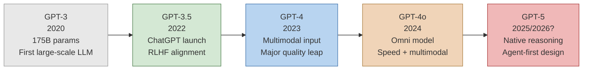
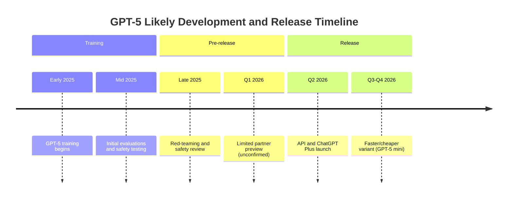

Every time OpenAI releases a new flagship model, the coverage splits into two camps: people breathlessly declaring it changes everything, and people dismissing it as marginal. Both reactions are usually wrong. GPT-5 is the most anticipated model in the company's history, and I want to give you something more useful than hype or skepticism — a grounded look at what we actually know, what the evidence suggests, and how to think about it as a developer or team lead deciding what to build on right now.

Let me be upfront: GPT-5 has not been officially released as of this writing. What follows is informed speculation based on public statements from OpenAI leadership, research directions visible in their published work, benchmark signals from interim models, and the competitive pressure that Anthropic's Claude and Google's Gemini are applying. I'll flag clearly when something is confirmed versus when I'm connecting dots.

---

## What We Know So Far

OpenAI has been unusually cagey about GPT-5, but a few things have leaked out of interviews, investor briefings, and the occasional off-script comment.

Sam Altman confirmed in multiple interviews through 2025 that GPT-5 is in training and that the team expects it to represent a meaningful step up from GPT-4o in reasoning, reliability, and capabilities. "Meaningfully smarter" was the phrasing he used. That's deliberately vague, but coming from the company's CEO, it signals something beyond the incremental upgrades we saw with GPT-4 Turbo and GPT-4o.

The company has also signaled through its research publications that it is investing heavily in:

- **Longer context handling** at much higher quality than current models
- **Multimodal reasoning** across images, audio, video, and code simultaneously
- **Agent-oriented architectures** that allow models to plan and execute multi-step tasks more reliably
- **Improved calibration** — the model knowing what it doesn't know

What OpenAI has not disclosed publicly: architecture details, parameter counts, training data, or timeline. The era of companies publishing papers about every model is over. GPT-5 will likely arrive with a product announcement and an API, not a research paper.

---

## Expected Features

### Advanced Reasoning

The clearest signal of where GPT-5 is headed comes from OpenAI's o1 and o3 series. These reasoning models introduced explicit chain-of-thought computation at inference time — the model spends more compute "thinking" before answering. The limitation with o1 and o3 is that they're specialized and expensive. GPT-5 is expected to incorporate this reasoning capability more natively, making it available at lower cost and across more types of tasks.

I expect GPT-5 to close much of the gap between GPT-4o's speed and o3's reasoning depth. The practical result for developers would be a general-purpose model that handles complex, multi-step problems without requiring you to route to a specialized reasoning model.

### Expanded Multimodal Capabilities

GPT-4o introduced "omni" multimodality — images, audio, and text in a single model. GPT-5 is expected to deepen this. Credible signals point toward:

**Video input.** Being able to submit a clip and ask the model to analyze it, describe it, or reason about events in it. This would open use cases in support, education, and media that currently require specialized models.

**Improved audio reasoning.** Not just transcription or voice output, but genuine reasoning about audio content — identifying speakers, interpreting tone, and following audio instructions.

**Real-time multimodal conversation.** The GPT-4o Advanced Voice demo was impressive but limited. GPT-5 is expected to enable lower-latency, more coherent long-form voice interaction where the model maintains context naturally across a full conversation.

### Longer and Higher-Quality Context

GPT-4o supports 128K tokens. GPT-5 is expected to expand this substantially — 256K or 1M tokens are the numbers that have appeared in speculation, with 512K being a credible middle estimate. But raw context length is only part of the story.

The more important development is what happens with information in the middle of a long context. Current models — including GPT-4o — struggle with "lost-in-the-middle" degradation, where information in the middle of a long document gets de-emphasized compared to the beginning and end. Claude has made notable progress on this. Expect OpenAI to address it directly in GPT-5, since it's a known and embarrassing limitation at enterprise scale.

### Agent Capabilities

This is where I expect GPT-5 to have the largest real-world impact. OpenAI has been building toward agents for years: the plugin ecosystem, Code Interpreter, the Assistants API, Operator. GPT-5 should represent a step-change in the model's ability to plan and execute multi-step tasks with tools.

Concretely, this means better performance at:

- Writing and running code across multiple files and debugging its own errors
- Navigating web pages and interacting with applications
- Managing long-horizon tasks that span multiple tool calls and decision points
- Recovering gracefully when a tool call fails or returns unexpected output

The underlying capability being improved is goal persistence — keeping the right objective in mind across a long chain of actions, even when intermediate steps produce noisy or ambiguous results.

---

## GPT Evolution: From GPT-3 to GPT-5

To understand where GPT-5 fits, it helps to see the trajectory clearly.

Each generation has had a defining characteristic. GPT-3 proved scale worked. GPT-3.5 proved alignment via RLHF made models usable. GPT-4 proved multimodality and reliability could coexist. GPT-4o proved you could make a capable model fast and cheap enough for consumer apps. GPT-5's defining characteristic looks to be reasoning depth combined with autonomous execution.

---

## Benchmark Predictions

I'll make specific predictions here rather than hide behind vague language. These are informed guesses, not certainties, and I'll be happy to be wrong if GPT-5 exceeds them.

**MMLU (broad knowledge):** GPT-4o scores around 88-89%. I expect GPT-5 to reach 91-93%. The gains on knowledge benchmarks tend to be incremental — the real improvements show up elsewhere.

**MATH (mathematical reasoning):** GPT-4o scores around 76%. o3 scores 96%+. GPT-5 should land in the 88-94% range, reflecting the integration of reasoning capabilities that o-series models introduced.

**SWE-bench Verified (real-world coding tasks):** GPT-4o scores around 38%. Claude 3.5 Sonnet scores around 49%. I expect GPT-5 to reach 60-70%, which would be a significant leap and would likely reclaim the coding benchmark crown for OpenAI.

**HumanEval (code generation):** GPT-4o is at about 90%. The ceiling here is getting close to 100%, so I expect GPT-5 around 94-96% — an incremental gain on a nearly saturated benchmark.

**Long-context recall:** This is where I expect the most striking improvement. Current GPT-4o performance on long-context needle-in-a-haystack tests degrades meaningfully beyond 50K tokens. GPT-5 should maintain much higher recall at 200K+ tokens, which matters enormously for production use cases.

---

## GPT-5 vs GPT-4o vs Claude: Where Each Model Is Expected to Land

This comparison puts GPT-5 alongside the two models it will most directly compete with at launch.

```mermaid
xychart-beta
    title "Expected Capability Scores (Estimated, 0-100 scale)"
    x-axis ["Reasoning", "Code", "Long Context", "Multimodal", "Agents", "Speed"]
    y-axis "Score" 0 --> 100
    bar [72, 85, 70, 85, 68, 90]
    bar [88, 92, 88, 80, 85, 72]
    bar [85, 90, 95, 70, 78, 82]
```

*Bar 1: GPT-4o (current). Bar 2: GPT-5 (estimated). Bar 3: Claude 3.5 Sonnet (current).*

A few things jump out from this picture. GPT-5 is expected to exceed Claude 3.5 Sonnet on reasoning and code while closing the gap on long context. Claude's long-context quality advantage — which is real and measurable today — may narrow but is unlikely to disappear, because Anthropic has continued iterating on it. The multimodal gap reverses: GPT-5 extends a capability set that Claude doesn't match. On agents, GPT-5 should take a meaningful lead, because OpenAI has been explicitly investing in that stack (Assistants API, Operator, function calling reliability).

The speed column is worth flagging: GPT-5 will almost certainly be slower than GPT-4o at launch, just as GPT-4 was slower than GPT-3.5 Turbo. Expect OpenAI to eventually release a faster distilled variant, but at release, latency will be a tradeoff.

---

## Pricing Speculation

Let me give you the honest version of this section: we don't know what GPT-5 will cost, and anyone who claims they do is guessing. What we can do is reason from the pattern.

GPT-4 launched at $0.03/1K tokens. GPT-4 Turbo dropped that to $0.01/1K. GPT-4o dropped it again to $0.005/1K input. Each generation has been meaningfully cheaper than its predecessor — driven by efficiency improvements, hardware gains, and competitive pressure.

My expectation for GPT-5 at launch:

- **Input tokens:** $8-15/1M tokens for the flagship (higher than GPT-4o's current $2.50, reflecting the capability step-up)
- **Output tokens:** $25-60/1M tokens (wide range because the reasoning compute overhead is hard to predict)
- **A faster/cheaper variant:** likely within 6-12 months, following the GPT-4o mini pattern, at perhaps $0.50-2/1M tokens

The key variable is reasoning compute. If GPT-5 incorporates o-series-style internal reasoning, output tokens become significantly more expensive to produce — the model runs thousands of internal tokens before producing the visible output. OpenAI may charge for this computation or absorb it. How they price this will shape whether GPT-5 is viable for production use cases from day one.

For comparison, Anthropic's Claude 3.5 Sonnet currently runs at $3/$15 per 1M tokens. If GPT-5 launches at $10-15 per 1M input tokens, OpenAI will be pricing for quality and counting on developers to pay the premium — a bet that it will perform well enough to justify the cost at scale.

---

## Impact on Developers

If GPT-5 ships with the capabilities I'm expecting, the practical implications for developers are significant.

**Agent development becomes more viable.** The current generation of LLM agents fails too often on multi-step tasks to be trusted in production without heavy guardrails and human oversight. A model with better goal persistence and tool-use reliability changes the calculus. You should be thinking now about what workflows in your application could be automated if you had an agent that succeeded 90% of the time instead of 60%.

**Prompt engineering complexity may decrease.** Better instruction-following and more robust reasoning should mean you need less prompt scaffolding to get reliable outputs. The elaborate chain-of-thought prompting and multi-shot examples that are currently necessary for complex tasks may become optional. This is good news for reliability and bad news for anyone who has built a business around prompt optimization.

**Context strategy changes.** If GPT-5 supports 512K+ tokens at high quality, chunking and retrieval architectures that exist today primarily to work around context limits become less necessary for many applications. Don't throw out your RAG infrastructure — semantic retrieval still adds value even with long context — but the engineering tradeoffs change.

**The API ecosystem matters more.** OpenAI's Assistants API, thread management, and built-in tools will likely receive GPT-5 support relatively quickly after launch. If you've built your application around OpenAI's managed infrastructure, you'll get GPT-5's capabilities with less migration work than if you've built lower-level tooling.

The one thing I'd caution against: rebuilding your architecture based on speculation before GPT-5 is actually available. The pattern with new models is that they perform differently than expected on specific tasks — sometimes better, often worse in particular edge cases. Wait for the API, run your evals, then make decisions.

---

## Impact on Competitors

The competitive dynamics are the most interesting part of this story.

**Anthropic** has the most to lose from a strong GPT-5. Claude 3.5 Sonnet has been consistently competitive — sometimes ahead — of GPT-4o on coding and instruction-following. A GPT-5 that surpasses Claude on those benchmarks while also outperforming on reasoning would pressure Anthropic's positioning significantly. Anthropic has Claude 3.7 and presumably Claude 4 in development, and they've been historically willing to release quickly when competitive pressure demands it. Expect them to accelerate.

**Google** has a different problem. Gemini's strength is price (Gemini 1.5 Flash is dramatically cheaper than anything in this tier) and the 1M token context window. If GPT-5 extends OpenAI's context window significantly while offering better reasoning, Google needs to respond with quality gains, not just price cuts. Gemini 2.0 is already in the market; what comes next and how fast will determine whether Google remains competitive in the enterprise tier.

**Meta and open-weight models** are less directly affected. Llama 4 and its successors address a different part of the market — teams that need on-premise deployment, data privacy, or the ability to fine-tune. A strong GPT-5 may push some teams away from open-weight models for reasoning tasks, but it won't displace the open-source ecosystem for the use cases where it matters most.

**Microsoft** benefits straightforwardly. Azure OpenAI Service customers will eventually get GPT-5 access, and Microsoft has integrated OpenAI models deeply into Copilot, Office, and GitHub. A capability uplift in the underlying model directly improves the Microsoft product portfolio.

---

## When Is GPT-5 Coming?

The honest answer is that nobody outside of OpenAI knows. Let me tell you what the signals suggest.

OpenAI's release cadence has been roughly 12-18 months between flagship models. GPT-4 launched in March 2023. GPT-4o launched in May 2024. Using those intervals, a mid-2025 to early-2026 window for GPT-5 was always the reasonable estimate. Given that we're in early 2026 and there has been no launch announcement, the more likely scenario is that OpenAI is taking longer to get safety evaluations right — or the model is more ambitious than the previous generation's timeline would suggest.

The one pattern worth noting: OpenAI has released interim models (GPT-4 Turbo, GPT-4o, o1, o3) to stay competitive while the flagship is in development. This suggests the gap to GPT-5 is longer than their typical release cycle would imply. Something significant is either being built or being evaluated carefully before release.

My best guess is a Q2 2026 API launch, with a faster variant following in late 2026. But I've been wrong about model release timelines before — this industry defies prediction.

---

## Should You Wait or Build Now?

This is the question I get most often from developers, and the answer is almost always the same: **build now, on what's available.**

Here's why waiting is usually the wrong strategy. The current generation of models — GPT-4o, Claude 3.5 Sonnet, Gemini 1.5 Pro — are capable enough to build real, valuable products. The developers and companies building on them right now are accumulating production experience, user feedback, and evaluation data that will make them significantly better at using GPT-5 when it arrives.

The teams that wait end up in the worst position: they have no production experience, no data, and no intuition for where the new model's edges are. They also miss 6-18 months of revenue and learning.

The right approach is to design your application so that upgrading the underlying model is straightforward. This means:

- Don't hardcode model-specific behavior into your application logic
- Build a proper evaluation suite now, so you can benchmark GPT-5 against your current model when it's available
- Abstract your prompt templates so you can tune them per model
- Keep your context strategy flexible — if you've built a clean RAG pipeline, you can test whether GPT-5's long context replaces it or complements it

When GPT-5 launches, the teams with good eval infrastructure will be able to assess it in days, run a careful migration, and capture the capability improvement quickly. The teams without evals will spend months debugging regressions and trying to understand whether the new model is actually better for their use case.

---

## Frequently Asked Questions

### Will GPT-5 make GPT-4o obsolete?

Not immediately and probably not for most workloads. The GPT-4 to GPT-4o transition gave us a model that was faster, cheaper, and multimodal — yet GPT-4 continued to be used in production for use cases that valued reliability over novelty. GPT-5 will likely be slower and more expensive at launch. GPT-4o will remain the right choice for high-volume, latency-sensitive applications until a GPT-5 mini or Turbo variant arrives.

### How will GPT-5 affect the reasoning model lineup (o1, o3)?

This is genuinely uncertain. One possibility is that GPT-5 incorporates reasoning capabilities well enough to make o1 and o3 redundant. Another is that OpenAI maintains the split: GPT-5 for general tasks and a hypothetical o5 for specialized reasoning. The o-series models have distinct strengths — particularly on mathematical and scientific reasoning — that a general-purpose model may not fully replicate. I expect the lineup to evolve rather than collapse.

### Will GPT-5 support fine-tuning?

OpenAI currently offers fine-tuning on GPT-4o and GPT-4o mini. Fine-tuning availability on GPT-5 is not confirmed. Based on the pattern with GPT-4, fine-tuning tends to arrive 3-6 months after the base model launch. Plan for fine-tuning to be unavailable at launch if it's a hard requirement for your application.

### Should I switch from Claude to GPT-5 when it launches?

Wait for the benchmarks on your specific tasks. The headline benchmarks will tell you directionally where GPT-5 is stronger, but they don't tell you how it performs on your specific prompts, your specific data distribution, and your specific quality requirements. Run your eval suite on both models. The switching cost from Claude to GPT-5 or vice versa is low if your architecture is well-abstracted — there's no reason to decide before you have real data.

### Will GPT-5 change how OpenAI competes with GitHub Copilot, Cursor, and coding tools?

Yes, substantially. Coding tools built on GPT-4 and GPT-4o will be able to upgrade to GPT-5 and offer meaningfully better code generation, refactoring, and debugging assistance. This will compress the quality gap between different coding tools — the underlying model quality will matter less than the user experience, context management, and toolchain integration that each product builds around the model. For developers choosing a coding tool, the differentiator will shift away from "which model does it use" toward "how well does it integrate with my workflow."

---

The signal-to-noise ratio on GPT-5 coverage is low. Most of what you'll read is either uncritical excitement or reflexive skepticism, with little grounding in what we can actually observe. My read is that GPT-5 represents a genuine capability step, particularly in reasoning and agent applications — but it won't arrive with all capabilities at competitive pricing from day one, and the current generation of models will remain the right choice for most production workloads until a cheaper variant is available. Build what you can build now. When GPT-5 launches, run your evals, and upgrade if the data supports it.
