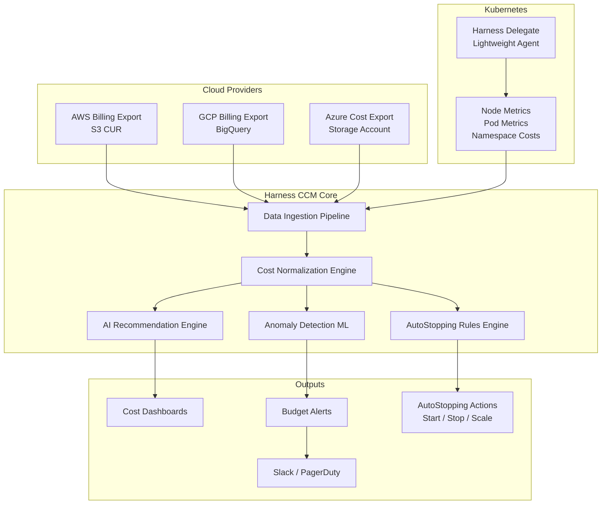
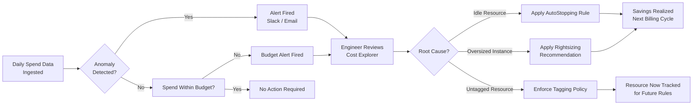
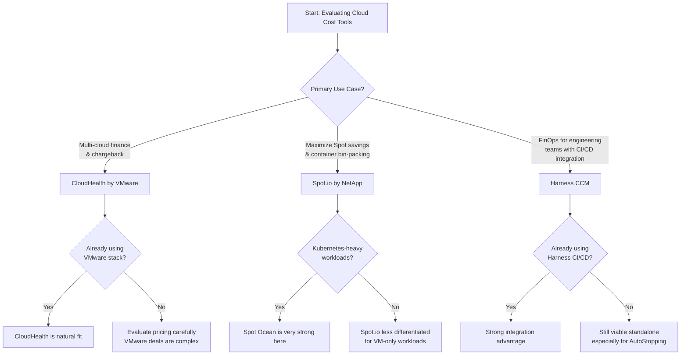

My AWS bill hit $47,000 in a single month last year. We had scaled up for a product launch, forgotten to spin down a cluster of GPU instances, and let three staging environments run idle for six weeks. The charges were real, the budget variance was embarrassing, and the postmortem revealed something uncomfortable: we had no systematic way to see what was actually running, what it cost, or who owned it.

That experience pushed me to seriously evaluate Harness Cloud Cost Management. After three months of using it across two AWS accounts and one GCP project, I have a detailed picture of where it earns its place and where it still has gaps.

## The Cloud Cost Problem Most Teams Ignore

Cloud spend is uniquely difficult to govern because the people who create infrastructure are rarely the people who pay for it. A developer spins up an EC2 instance to test a feature, the feature ships, the instance lingers. A data team runs a query that balloons a BigQuery job to 10 TB scanned. A QA environment that was "temporary" in March is still running in October.

The result is what finance teams call cloud waste — idle compute, unattached volumes, oversized instances, and environments nobody can confidently shut down because ownership is unclear. Industry estimates put waste at 28–35% of total cloud spend. For a team spending $50,000 a month, that is $14,000–$17,500 vanishing into poorly tagged resources.

Traditional approaches — spreadsheet exports, billing dashboards, quarterly cost reviews — are too slow. By the time a finance team flags an anomaly, the resource has already run for weeks. What engineering teams actually need is visibility at the moment a cost spike begins, recommendations grounded in real usage data, and automation that can act without requiring a separate ticket every time.

That is the problem Harness CCM is designed to solve.

## What Is Harness CCM?

Harness Cloud Cost Management is a FinOps platform built inside the Harness Software Delivery Platform. Unlike standalone cost tools, it was designed from the start for engineering teams rather than finance teams. The interface speaks in terms of services, namespaces, clusters, pipelines, and deployments — not just account IDs and billing line items.

The product connects to AWS, GCP, and Azure using read-only billing exports and a lightweight agent for Kubernetes clusters. It normalizes cost data across providers, tags resources using your existing labels, and presents a unified view across all environments. On top of that foundation, it layers AI-powered recommendations, anomaly detection, and AutoStopping — the feature that actually moves the needle on idle waste.

Harness positions CCM as part of a broader platform that includes CI, CD, Feature Flags, and Chaos Engineering. If your team already uses Harness for deployments, CCM plugs in with no additional identity setup. If you are new to Harness, CCM is available as a standalone module with its own free tier.

## Architecture: How Harness CCM Connects to Your Cloud

The architecture is deliberately lightweight on the cloud provider side. Harness reads billing exports that cloud providers already generate — no special IAM roles with write access required for basic visibility. The Harness Delegate, a small container you deploy inside your Kubernetes clusters, adds pod-level and namespace-level granularity that billing exports alone cannot provide.

## Key Features

### Cost Visibility

The cost explorer in Harness CCM is the feature I use every morning. It lets me slice spend by account, service, region, cluster, namespace, label, or pipeline — and combinations of those — without writing any queries. The interface is fast enough for exploratory work, which matters because cost investigations are never linear.

The tagging enforcement feature deserves mention. Harness can flag resources that are missing required tags, which is useful when you have a tagging policy on paper that nobody actually enforces. In our case, we found 23% of EC2 instances had no owner tag. That made AutoStopping rules much harder to apply safely, and it explained why so many instances survived past their intended lifetime.

### AI-Powered Recommendations

The recommendation engine analyzes CPU and memory utilization data over a configurable look-back window (default 30 days) and surfaces rightsizing suggestions for EC2 instances, RDS clusters, GKE node pools, and EKS managed node groups.

What separates Harness recommendations from the native AWS Compute Optimizer output is the presentation. Harness shows the recommendation in the context of the service and environment, estimates the monthly savings, and links to the deployment pipeline if Harness CD manages that service. You can apply a recommendation directly from the UI and watch the pipeline run.

In my testing across 84 EC2 instances, Harness identified $3,200/month in rightsizing opportunities. I spot-checked 12 of those against actual CloudWatch metrics and found all 12 were genuinely oversized. The savings estimate for those 12 was $820/month; after applying them, actual savings came in at $770/month — a 6% variance, which is reasonable given spot pricing fluctuations.

### Anomaly Detection

Anomaly detection uses a machine learning model trained on your historical spend patterns. When daily cost for a service or account deviates beyond a learned threshold, Harness fires an alert to Slack, PagerDuty, or email.

The model accounts for known patterns — weekend dips, end-of-month batch jobs, deployment-correlated spikes — which reduces false positives significantly compared to simple threshold alerts. In three months, I received 14 anomaly alerts. Eleven were genuine issues: a misconfigured autoscaler, a test job that looped indefinitely, and several cases of untagged resources launched by a new team member. Three were false positives tied to a major launch we had not pre-annotated.

The false positive rate was low enough that I trust the alerts. The fix for launch-related noise is to mark planned events in the Harness calendar view, which suppresses anomaly alerts for that window.

### AutoStopping

AutoStopping is the feature that generates the most immediate ROI. It works by detecting when a cloud resource — an EC2 instance, an EKS node group, an RDS instance, a GCP VM — has been idle for a configurable period, then stopping or scaling it down automatically. When traffic or a scheduled event triggers the resource again, AutoStopping starts it back up, typically within 60–90 seconds for instances and 2–4 minutes for node groups.

The use case that pays back fastest is non-production environments. Dev, staging, and QA environments typically run at full capacity 24 hours a day but receive actual traffic 8–10 hours a day, five days a week. AutoStopping those environments on nights and weekends can cut their runtime cost by 65–70% without any change to the underlying infrastructure.

We applied AutoStopping to four staging environments and two development clusters. After 30 days, those six environments had run for an average of 9.2 hours per day instead of 24, saving $4,100 that month alone.

### Budgets and Forecasting

Budget controls in Harness CCM let you set monthly or annual spend limits at the account, service, or label level. When spend crosses 75%, 90%, or a custom threshold, alerts fire. Forecasting uses a time-series model to project end-of-month spend based on current trajectory.

The forecasting accuracy is good but not perfect. In my experience, forecasts within the first week of the month carry wide uncertainty. By mid-month, the projection is usually within 5–8% of actual. That is good enough to decide whether to take action on a trend before it becomes a problem.

## Getting Started with Harness CCM

Setup is faster than I expected for a platform-grade tool. The broad outline takes a few hours for a single AWS account.

1. Create a Harness account and enable the Cloud Cost Management module.
2. Connect your AWS account by pointing Harness at an existing Cost and Usage Report (CUR) in S3, or let Harness create one. Grant a read-only IAM role for billing data.
3. For Kubernetes, deploy the Harness Delegate as a Helm chart into each cluster. This takes about 10 minutes per cluster.
4. Configure label mappings to align Harness cost categories with your team's naming conventions.
5. Set up your first budget with a 90% alert threshold.
6. Define AutoStopping rules for non-production environments.

The GCP and Azure connectors follow a similar pattern — billing export to a destination Harness can read, plus optional agent for Kubernetes.

Data begins appearing within 24 hours for billing exports. Kubernetes metrics are near-real-time once the Delegate is running.

## Savings Workflow: From Detection to Action

## AI-Powered Optimization in Practice

The AI layer in Harness CCM is not a chatbot bolted on top of a billing dashboard. It is a set of models trained specifically for cloud cost patterns: utilization time series for rightsizing, spend seasonality for anomaly detection, and traffic patterns for AutoStopping thresholds.

What this means in practice is that recommendations get smarter over time as Harness accumulates more data about your specific workloads. An EC2 instance that runs batch jobs every Sunday night will not be flagged for rightsizing on Monday morning based on a low-utilization weekend reading.

The AI also powers a natural-language cost query feature in the Harness UI. I can type "show me the services with the highest spend growth in the last 30 days" and get a filtered view without navigating the explorer manually. This feature is genuinely useful for ad-hoc investigations, though it is not a substitute for learning the explorer interface for routine work.

## Real Cost Savings Examples

Here are the actual numbers from our three-month evaluation, shared with permission from the team.

**Idle staging environments (AutoStopping):** $4,100/month saved across four staging environments and two dev clusters. These environments now run an average of 9.2 hours per day on weekdays and are fully stopped on weekends.

**EC2 rightsizing:** $770/month saved after applying 12 validated recommendations out of 84 flagged. We were conservative — we only applied recommendations where CPU utilization had been below 20% for 30 consecutive days.

**Untagged resource cleanup:** By enforcing tagging policies and identifying 23% of instances as untagged, we were able to decommission 11 instances that had no identified owner and had not received traffic in over 60 days. Savings: $310/month.

**Anomaly detection — looping test job:** A misconfigured integration test triggered a Lambda function in a loop for 18 hours before we caught it manually. After enabling anomaly detection, an identical event in the following month was flagged within 2 hours. Estimated savings: $180 for that single event, plus the engineering time to investigate it.

**Total over 90 days:** approximately $15,500 saved against a baseline monthly spend of around $47,000 — a 33% reduction. Not all of that is attributable solely to Harness (we also made some architectural changes during this period), but the tooling made the wins visible and actionable.

## Pricing

Harness CCM pricing is based on cloud spend under management, not per seat. As of early 2026:

- **Free tier:** Up to $250,000/month in cloud spend under management, with a subset of features (cost explorer, basic recommendations).
- **Team tier:** Approximately 1.25% of cloud spend under management per month, with full access to AutoStopping, anomaly detection, and budgets.
- **Enterprise tier:** Custom pricing, includes governance, policy enforcement, and dedicated support.

For a team spending $50,000/month on cloud infrastructure, the Team tier would cost roughly $625/month. If the tool delivers 10% savings — a conservative target — that is $5,000/month recovered against a $625/month tool cost. The math is favorable for most teams above $15,000/month in cloud spend.

The free tier is genuinely useful for evaluation and for smaller teams. AutoStopping is the one high-value feature gated behind the paid tier that makes the upgrade worthwhile for most users.

## Harness CCM vs CloudHealth vs Spot.io

**CloudHealth** is the incumbent for enterprise FinOps. Its strength is multi-cloud financial reporting, chargeback, and showback for large organizations with complex billing structures. It is not designed for engineering teams. The UI is finance-first, recommendations require manual action, and there is no AutoStopping equivalent. CloudHealth is the right choice when your primary stakeholder is a CFO who needs allocation reports across 50 accounts.

**Spot.io** (now Spot by NetApp) specializes in Spot instance optimization and Kubernetes bin-packing. Spot Ocean, its Kubernetes autoscaler, is one of the most sophisticated tools in the market for teams running large container workloads and comfortable with Spot interruptions. If your workload is Kubernetes-heavy and you are willing to invest in Spot instance architecture, Spot.io can deliver 60–80% compute savings. The trade-off is operational complexity and a steeper learning curve.

**Harness CCM** sits between these two. It is more engineering-friendly than CloudHealth and broader in scope than Spot.io. Its AutoStopping feature is uniquely strong for non-production environments. Its integration with Harness CD creates a feedback loop between deployment activity and cost impact that neither competitor matches. The weakness is that it is less specialized than Spot.io for pure Spot instance optimization.

## Limitations

**No write access to cloud resources by default.** Applying a rightsizing recommendation still requires a separate pipeline run or manual action. Harness can trigger a pipeline, but you have to build that integration. Some teams want a fully automated optimization loop; Harness does not provide that out of the box.

**GCP and Azure support lags AWS.** Most of the advanced features — granular Kubernetes cost allocation, AutoStopping for serverless resources, rightsizing recommendations — are most mature on AWS. GCP and Azure support has improved significantly but is not yet at parity.

**Kubernetes cost allocation requires careful label discipline.** The Delegate collects per-pod metrics, but meaningful cost allocation requires consistent label schemas across your deployments. If your Kubernetes labels are inconsistent, the cost views will be too.

**No native Terraform or IaC integration.** There is no way to see which Terraform module or stack owns a given resource. Cost attribution for IaC-managed infrastructure requires manual tag conventions.

**The recommendation engine is conservative.** This is arguably a feature, not a bug — Harness will not recommend downsizing an instance that had one high-utilization day in the last 30 days. But if your workloads are bursty, you may find that few recommendations ever clear the threshold.

## Verdict

Harness CCM is the right tool for engineering teams that want actionable cost intelligence without hiring a dedicated FinOps analyst. The three features that make it worth the price are AutoStopping for non-production environments, anomaly detection that accounts for usage patterns, and the integration with Harness CD for deployment-correlated cost visibility.

The free tier is a genuine evaluation path, not a crippled demo. Start with it, connect one AWS account, apply AutoStopping to one staging environment, and measure the savings over 30 days. If the numbers make sense — and for most teams above $15,000/month in cloud spend, they will — the paid tier pays for itself quickly.

If you are a pure Kubernetes shop with appetite for Spot instance complexity, Spot.io may deliver higher raw savings. If you are an enterprise finance team that needs multi-cloud chargeback reports for the CFO, CloudHealth is the more natural fit. For everyone else — engineering teams, platform teams, DevOps organizations trying to put FinOps into practice without a dedicated team — Harness CCM is the most balanced option available today.

## FAQ

### Does Harness CCM require Harness CD to function?

No. Harness CCM is available as a standalone module. You do not need to use Harness for CI, CD, or any other Harness product to get value from CCM. The integration with Harness CD is an advantage if you already use it, but it is not a prerequisite.

### How long does it take to see meaningful recommendations?

Harness begins showing basic cost data within 24 hours of connecting a billing export. Rightsizing recommendations require 7–14 days of utilization data to be statistically meaningful. Anomaly detection models calibrate over 30 days and become more accurate as they learn your spend patterns.

### Is the Harness Delegate required for AWS cost visibility?

No. The Delegate is only required for Kubernetes cost allocation at the pod and namespace level. AWS EC2, RDS, S3, and other non-Kubernetes resource costs are visible through the billing export connector alone.

### Can AutoStopping handle stateful workloads like databases?

AutoStopping supports RDS instances and managed database services, but it is designed for non-production workloads where a brief startup delay (2–5 minutes for RDS) is acceptable. It is not appropriate for production databases or any workload where a cold start would impact users.

### How does Harness CCM handle reserved instances and savings plans?

Harness ingests reserved instance and savings plan coverage data from the billing export and displays effective cost — the actual cost after RI and savings plan discounts — rather than on-demand list prices. Recommendations account for existing coverage. Harness does not currently provide RI purchase recommendations or automated RI management, which is a gap compared to CloudHealth's more mature RI management features.
