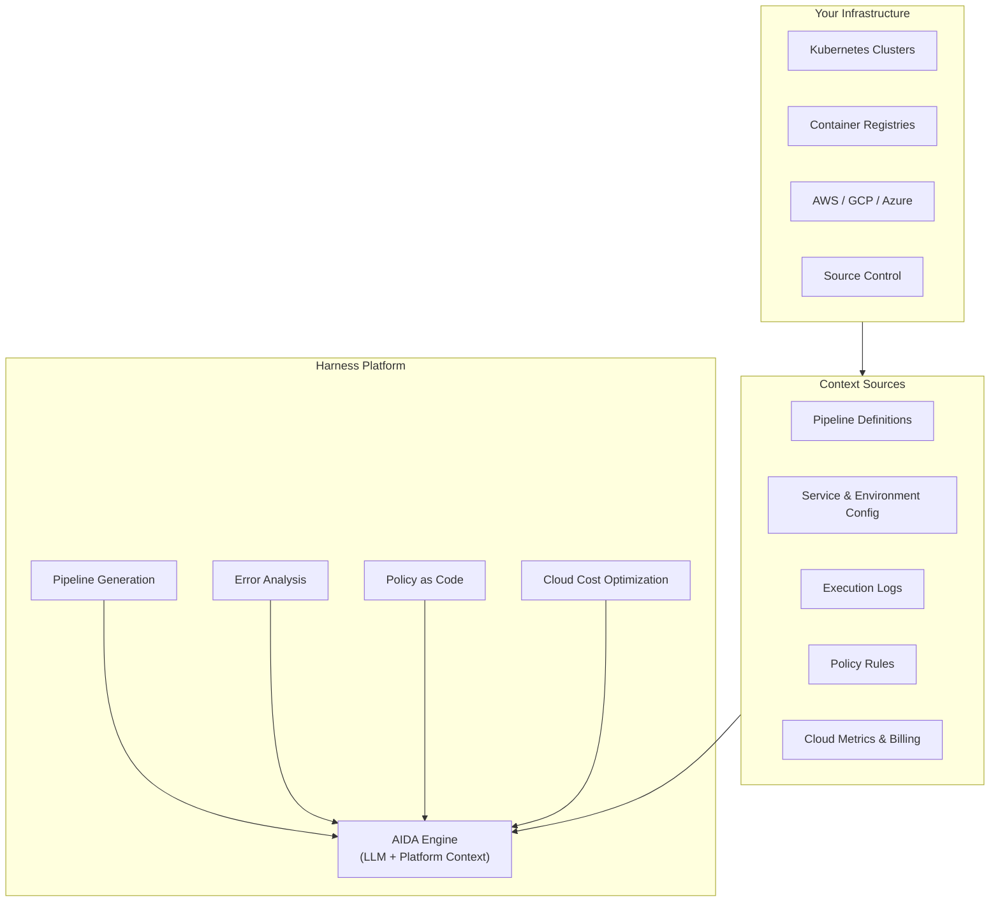
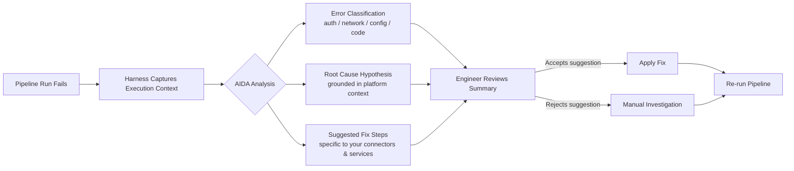
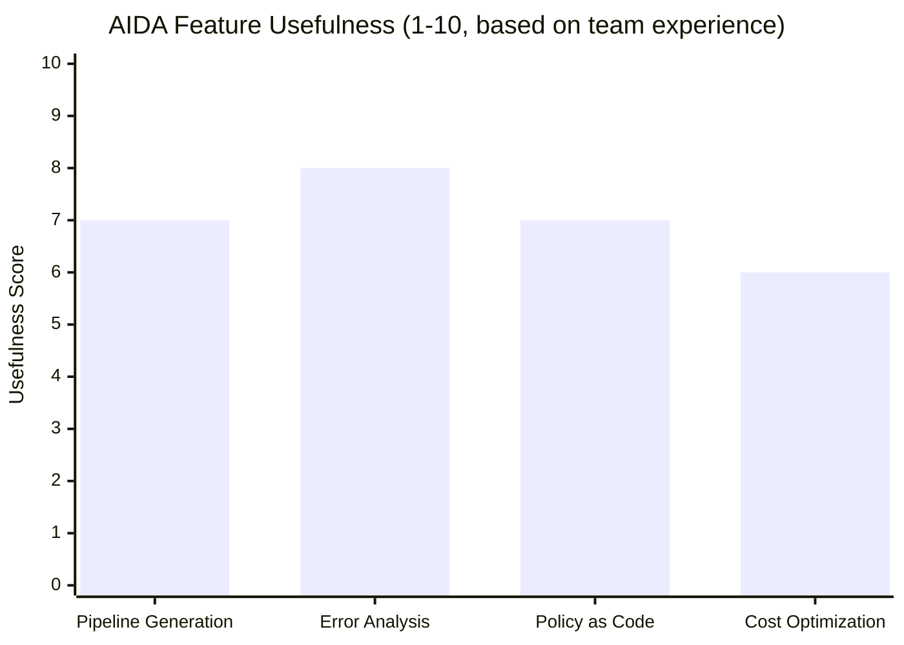

My team spent three weeks integrating Harness AIDA into our delivery pipeline before I felt confident saying whether it actually changed anything. Spoiler: it did — but not in the places the marketing deck promised. This guide covers what Harness AI (AIDA) really does, how to get started, and where the boundaries of usefulness are for real engineering teams.

## What Is Harness AI (AIDA)?

Harness AI, marketed as AIDA (AI Development Assistant), is Harness's native AI layer built into the Harness Software Delivery Platform. Unlike bolt-on AI extensions, AIDA is woven into the same product that manages your CI/CD pipelines, feature flags, cloud costs, security tests, and chaos engineering runs. That integration is the whole bet.

The core idea is that AIDA has context your general-purpose AI tools do not. When something breaks in a pipeline, AIDA does not just read the error message — it can read the pipeline definition, the associated service configuration, the recent deployment history, and the relevant policy rules, then surface a diagnosis that is grounded in your actual setup rather than generic cloud-platform knowledge.

AIDA launched in 2023 and has expanded across four main surfaces inside the Harness platform:

- **Pipeline Generation** — describe a workflow in plain English, get a YAML pipeline draft
- **Error Analysis** — root-cause failed pipeline runs automatically
- **Policy as Code** — generate Open Policy Agent (OPA) rules for governance
- **Cloud Cost Optimization** — receive AI-driven recommendations on idle and underutilized resources

Each surface connects to the same underlying context: your Harness account data, connected cloud accounts, and service definitions. That shared context is what makes AIDA different from pasting a log into ChatGPT.

## Key Capabilities

### Pipeline Generation

The pipeline generation feature lets you describe a CI/CD workflow in plain language and receive a working YAML draft targeted at the Harness pipeline schema. You might type: "Build a Node.js service, run unit tests, push a Docker image to ECR, and deploy to ECS Fargate in staging on every merge to main." AIDA returns a pipeline definition with stage types, step groups, and connector references pre-filled based on what is already connected in your account.

This is genuinely useful for onboarding new services. The draft is never production-ready out of the box — you will adjust trigger filters, add approval gates, wire in your specific artifact registries — but it cuts the blank-YAML problem that slows engineers who are new to Harness down from hours to minutes.

### Error Analysis

When a pipeline run fails, AIDA's error analysis generates a root cause summary directly inside the execution view. Instead of clicking through nested log panels, you see a plain-English explanation of what went wrong, why AIDA thinks it happened, and what to try next.

In my experience, the quality varies significantly by failure type. Compilation errors, failed health checks, and Kubernetes pod crashloops receive good diagnoses. Infrastructure timeouts and flaky network failures tend to produce vaguer recommendations. The system is better at telling you what broke than why the environment was in a state that allowed it.

### Policy as Code Generation

Harness uses OPA (Open Policy Agent) for pipeline governance. Writing Rego — OPA's policy language — is not something most DevOps engineers want to do from scratch. AIDA can generate Rego policies from natural language descriptions. "Require all deployments to production to have an approval step from the security team and block any pipeline that uses a Docker image older than 30 days" turns into a Rego block that you can review, test in the policy playground, and attach to a policy set.

### Cloud Cost Optimization

The cost optimization recommendations appear in the Harness Cloud Cost Management (CCM) module. AIDA surfaces clusters, node groups, and services where spend looks anomalous relative to utilization patterns. Recommendations include rightsizing compute, deleting idle resources, and switching instance families. Each recommendation shows projected monthly savings, the data behind the recommendation, and a confidence score.

## Architecture Overview

Here is how the four AIDA surfaces relate to the underlying Harness platform and your infrastructure.



The key point in this diagram is that AIDA sits above the platform data layer, not directly above raw infrastructure. Everything it reasons about has already been normalized into Harness's data model. This gives AIDA richer context than a raw log scraper, but it also means AIDA can only see what Harness can see.

## Getting Started with AIDA

AIDA is available on Harness paid plans. If your organization already has a Harness account, AIDA features appear automatically in the CI, CD, CCM, and policy modules once your account manager enables them. There is no separate installation.

**Step 1: Verify AIDA is enabled.** Go to Account Settings → AI Development Assistant. If the toggle is off, contact your Harness account representative. Enterprise plans include AIDA; some lower-tier plans require an add-on.

**Step 2: Connect your cloud accounts.** CCM recommendations and error analysis both work better with connected cloud accounts. Navigate to Setup → Cloud Cost Management and connect your AWS, GCP, or Azure accounts. Harness uses read-only access for cost data.

**Step 3: Run your first pipeline generation.** Go to Pipelines → Create Pipeline → Generate with AI. Type a plain-English description of your workflow. Review the draft, connect your actual connectors (SCM, artifact registry, Kubernetes cluster), and save it as a starting template.

**Step 4: Trigger a failure (intentionally).** The best way to evaluate error analysis is to break something on purpose. Use a test pipeline, introduce a bad image tag, and let the run fail. Open the execution view and review the AIDA error summary. Compare it against what you see in the raw logs. This calibrates your expectations before AIDA is handling real failures.

**Step 5: Create your first AI-generated policy.** Go to Project Settings → Governance → Policies → New Policy → Generate with AI. Describe a governance rule in plain English. Review the generated Rego, run it against sample pipeline inputs in the test console, and activate it in a policy set attached to a non-critical pipeline first.

## Pipeline Generation Demo

Here is a concrete example. I gave AIDA this prompt:

> "Create a CI pipeline for a Python service. Clone from GitHub, install dependencies with pip, run pytest, build and push a Docker image to Docker Hub, and notify a Slack channel on failure."

AIDA returned a pipeline with five stages: Clone, Install, Test, Build & Push, and Notify. The Slack notification step was correctly conditionally scoped to failure status. The Docker Hub connector was listed as a placeholder reference, which is expected since AIDA does not know the name of my connector. The pytest step used a sensible default container image (`python:3.11-slim`) without me specifying one.

What required manual editing:
- Swapping the placeholder connector references for real connector IDs
- Adding a trigger definition (AIDA generated the pipeline stages but not the trigger)
- Tightening the failure conditions on the notify step — the draft notified on any stage failure, not just test failures

Total time from prompt to a runnable pipeline draft: about four minutes. Equivalent from scratch: I would estimate twenty to thirty minutes for someone unfamiliar with Harness YAML schema. For a senior Harness user, the time savings are smaller but the blank-page friction is still eliminated.

## Error Analysis in Action

During our integration, we had a deployment stage fail with the error:

```
Error: ImagePullBackOff
Reason: failed to pull image "myregistry.io/myservice:abc1234": unauthorized
```

Without AIDA, the standard debugging path is: check the Kubernetes events, verify the image pull secret, confirm the image tag exists in the registry, check connector credentials in Harness. That is four context switches.

AIDA's summary said: "The deployment failed because the Kubernetes cluster could not authenticate to the container registry. The image pull secret referenced in the service definition (`registry-secret`) may not exist in the target namespace or may have expired credentials. Suggested fix: verify the secret exists in the `staging` namespace and re-sync the Harness connector."

That was correct. The secret had been rotated and Harness's stored credentials were stale. We fixed it in under five minutes. Without AIDA, I would have reached the same conclusion, but probably after ten to fifteen minutes of context-switching across the Kubernetes dashboard, registry UI, and Harness connector settings.

The error analysis workflow looks like this in practice:



The important nuance here is the "rejects suggestion" path. AIDA is right often enough to change your default behavior — checking the AIDA summary first instead of diving straight into logs — but wrong often enough that you should not skip review.

## Policy as Code with AI

This is one of the most underrated AIDA features for platform engineering teams. Rego is powerful but has a steep learning curve. Most DevOps engineers who are not dedicated policy engineers find themselves copying from examples and modifying them nervously. AIDA makes the generation step much faster.

I prompted AIDA with:

> "Block any pipeline from deploying to production unless it has at least one manual approval step, and block deployments that use a container image tagged as `latest`."

The returned Rego correctly expressed both conditions. It checked for the presence of an approval step in the stage sequence and matched against image tag patterns. After testing it against five sample pipeline inputs in the policy test console — three should pass, two should fail — all five produced the correct result.

One caution: AIDA-generated Rego is a starting point, not a finished policy. Have someone who understands OPA review it before attaching it to production pipelines. The generated code is syntactically correct and logically reasonable, but edge cases in complex pipelines (parallel stages, matrix deployments, looping steps) can slip past the initial generation.

## Cloud Cost Optimization

The CCM recommendations surface in the Cloud Cost Management module under "Recommendations." Each recommendation card shows the resource, the current spend, the projected post-optimization spend, and the confidence level.

In the three weeks we ran AIDA-powered CCM on our AWS account, the high-confidence recommendations were accurate: three t3.large instances running at under 5% CPU average that could safely drop to t3.medium, and two EBS volumes attached to stopped instances that had not been accessed in 60 days. Implementing those saved roughly $180/month — not transformational, but real money for minimal effort.

The low-confidence recommendations were noisier. Some suggested rightsizing instances that were correctly provisioned for burst workloads but happened to be quiet the week AIDA sampled them. Always filter to high-confidence recommendations before acting.

## AIDA Feature Effectiveness

Not all four AIDA surfaces deliver equal value in practice. This chart reflects my team's experience after three weeks of use:



Error analysis scores highest because it sits directly in the failure path — every engineer who investigates a broken pipeline sees it automatically. Pipeline generation and policy-as-code are opt-in, so they require the team to build new habits. Cost optimization is useful but competes with dedicated tools like AWS Cost Explorer and Infracost, which many teams already have.

## Limitations

**Context is Harness-bounded.** AIDA only reasons about what Harness can see. If your build system, registry, or monitoring tool is not connected to Harness, AIDA has no visibility into it. Error analysis for failures that originate in an unconnected system will be less specific.

**Pipeline generation requires Harness schema knowledge to review.** The generated YAML is correct Harness schema, but someone on your team still needs to understand Harness pipeline structure to verify the draft and wire in real connectors. AIDA does not eliminate the learning curve — it compresses the blank-page phase.

**Error analysis quality degrades on infrastructure-layer failures.** Pod crashloops, image pull errors, and permission failures get good diagnoses. DNS resolution flaps, cross-VPC routing issues, and cloud provider API throttling tend to get vaguer summaries.

**Policy generation does not catch all edge cases.** Complex pipeline topologies — parallel stages, strategy matrices, chained pipelines — can produce Rego that looks correct but has logical gaps. Test generated policies thoroughly before attaching them to production gate rules.

**Cost recommendations lag behind workload changes.** Recommendations are based on recent utilization history. Newly scaled services, seasonal workloads, and recent architecture changes can produce recommendations that are outdated by the time you see them.

## AIDA vs GitHub Copilot for DevOps

This comparison comes up constantly. Here is the honest breakdown for DevOps-specific work:

| Capability | Harness AIDA | GitHub Copilot |
|---|---|---|
| **CI/CD pipeline generation** | Native Harness YAML, context-aware | Generic YAML, no platform awareness |
| **Error analysis** | Grounded in your pipeline execution data | Reads whatever you paste into chat |
| **Policy as Code (OPA/Rego)** | Specialized generation with platform context | Capable but no platform data |
| **Cloud cost recommendations** | Integrated with connected cloud accounts | Not applicable |
| **IDE code completion** | Not applicable | Core feature, excellent |
| **Pull request review** | Not applicable | Available via Copilot for PRs |
| **Pricing** | Included in Harness enterprise plans | $19-39/user/month (standalone) |
| **Best for** | DevOps / platform engineering workflows | Application developers |

The comparison is almost a category error. Copilot is an AI coding assistant for developers writing application code. AIDA is an AI operations assistant for engineers managing delivery pipelines, cloud spend, and release governance. Teams with both personas need both tools. If you are trying to pick one, the question is whether your primary bottleneck is application code quality or DevOps workflow efficiency.

## Verdict

Harness AIDA is a solid AI layer for teams already invested in the Harness platform. The error analysis and pipeline generation features deliver real time savings — not dramatic, but consistent. The policy generation feature lowers the barrier to OPA adoption significantly. The cost optimization recommendations are useful, though not a replacement for a dedicated FinOps practice.

The important caveat is that AIDA's value is inseparable from Harness adoption. If your organization runs CI/CD on Jenkins, GitHub Actions, or GitLab CI without Harness, AIDA is not available and there is no migration path short of adopting the Harness platform. The integration bet is the product's strength and its constraint simultaneously.

For Harness customers evaluating whether to enable AIDA: do it. The incremental cost is low relative to the platform fee, and the error analysis feature alone is worth the toggle. For teams evaluating Harness for the first time with AIDA as a selling point: evaluate the Harness platform on its own merits first. AIDA is a meaningful differentiator, not a reason to adopt a platform that does not otherwise fit your stack.

**Rating: 7.5 / 10** — Genuinely useful for Harness users; tightly scoped to the Harness ecosystem.

---

## FAQ

### Does Harness AIDA work with GitHub Actions or Jenkins pipelines?

No. AIDA's pipeline generation, error analysis, and policy features are specific to Harness pipelines. The tool has no integration with external CI/CD systems. If you run pipelines on GitHub Actions or Jenkins, you would need to migrate those pipelines into Harness before AIDA can reason about them.

### Is AIDA's error analysis reliable enough to trust without reviewing the raw logs?

Not yet, but it should be your first stop. In our testing, AIDA's root cause analysis was accurate for about 70-80% of common failure types. For auth failures, image pull errors, and misconfigured steps, it is very reliable. For infrastructure-layer issues and intermittent failures, it is less specific. Use it to form a hypothesis quickly, then confirm in the logs if the fix is non-trivial.

### What LLM does Harness AIDA use under the hood?

Harness has not disclosed the specific model. Based on public statements, AIDA uses a combination of proprietary fine-tuned models and foundational LLMs. The important point is that whatever model runs underneath is given your platform context — pipeline definitions, execution history, policy rules, cloud metrics — which is what distinguishes it from using a general-purpose LLM directly.

### Can AIDA generate policies for non-Harness governance systems?

The policy generation feature is specifically designed to produce OPA Rego for Harness's internal policy engine. The generated Rego is valid OPA and could theoretically be adapted for other OPA-based systems (Conftest, Styra, etc.), but it will reference Harness-specific input schema. Plan for adaptation work if you need to use it outside the Harness policy console.

### How does AIDA handle sensitive data in logs and pipeline definitions?

Harness processes AIDA requests using your platform data, which may include environment variable names, service configurations, and log fragments. Secret values stored in Harness Secret Manager are masked in logs and not exposed to the AIDA processing layer. Review Harness's data processing agreement and your organization's data residency requirements before enabling AIDA on pipelines that handle regulated data.
