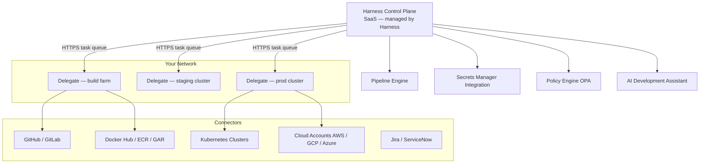
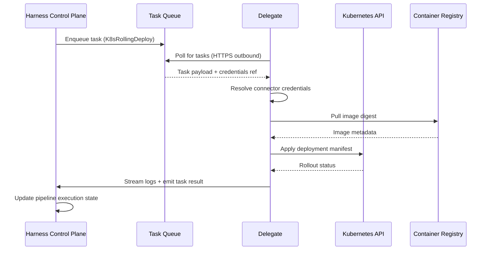
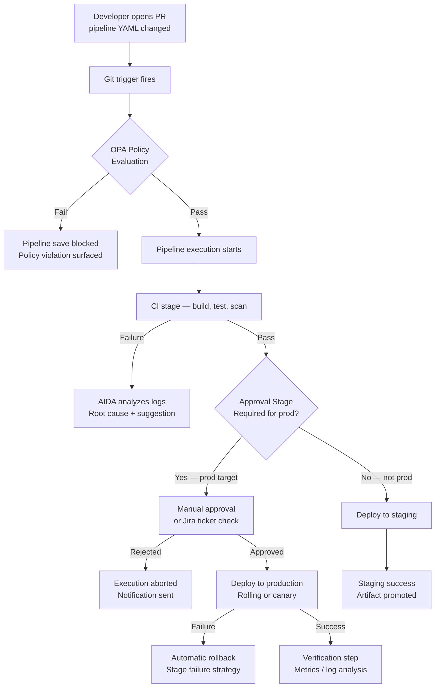

I have been running software delivery pipelines on Harness for the past two years across teams ranging from five engineers to several hundred. Over that time I have watched the platform grow from a smart CI/CD layer into something that feels much closer to a complete delivery operating system. If you are evaluating Harness, already using it and trying to extract more value, or just curious what the architecture actually looks like under the hood, this is the deep-dive I wish I had found before starting.

This article covers the Harness control plane and its relationship to delegates, walks through real pipeline YAML, explains how connectors and integrations tie the system together, and closes with a look at the AI features that have started showing up in production-worthy form.

## Platform Architecture: How Harness Is Actually Structured

Harness runs as a SaaS control plane. You never manage the orchestration infrastructure yourself — Harness operates that. What you do manage is the agent layer that runs inside your own network: the delegate.

That split is the most important thing to understand before you touch a single pipeline. It shapes security, networking, connectivity, troubleshooting, and scaling decisions. The control plane holds your pipeline definitions, triggers, secrets references, audit logs, and governance policies. The delegate holds credentials, executes build steps, reaches your Kubernetes clusters, and talks to your artifact registries.



The control plane never opens an inbound connection to your network. Delegates poll the task queue over outbound HTTPS on port 443. That design means you do not need to open firewall holes or expose internal services to the internet — a point that usually ends the security team's objections faster than anything else.

## Pipelines Deep Dive: YAML, Stages, Steps, and Templates

A Harness pipeline is defined in YAML. The platform provides a visual editor, but every click in the UI maps to a YAML mutation, and the raw YAML is always accessible. I recommend treating the YAML as the source of truth from day one and storing it in your repository alongside application code.

Here is a realistic Continuous Integration pipeline for a Node.js service:

```yaml
pipeline:
  name: node-service-ci
  identifier: node_service_ci
  projectIdentifier: platform_engineering
  orgIdentifier: acme
  tags: {}
  stages:
    - stage:
        name: Build and Test
        identifier: build_and_test
        type: CI
        spec:
          cloneCodebase: true
          infrastructure:
            type: KubernetesDirect
            spec:
              connectorRef: prod_k8s_connector
              namespace: harness-builds
              automountServiceAccountToken: true
          execution:
            steps:
              - step:
                  type: Run
                  name: Install Dependencies
                  identifier: install_deps
                  spec:
                    connectorRef: dockerhub_connector
                    image: node:20-alpine
                    command: npm ci --prefer-offline
              - step:
                  type: Run
                  name: Lint
                  identifier: lint
                  spec:
                    connectorRef: dockerhub_connector
                    image: node:20-alpine
                    command: npm run lint
              - step:
                  type: Run
                  name: Unit Tests
                  identifier: unit_tests
                  spec:
                    connectorRef: dockerhub_connector
                    image: node:20-alpine
                    command: npm test -- --coverage
                    reports:
                      type: JUnit
                      spec:
                        paths:
                          - "**/junit.xml"
              - step:
                  type: BuildAndPushDockerRegistry
                  name: Build and Push Image
                  identifier: build_push
                  spec:
                    connectorRef: ecr_connector
                    repo: 123456789.dkr.ecr.us-east-1.amazonaws.com/node-service
                    tags:
                      - <+pipeline.sequenceId>
                      - latest
    - stage:
        name: Deploy Staging
        identifier: deploy_staging
        type: Deployment
        spec:
          deploymentType: Kubernetes
          service:
            serviceRef: node_service
          environment:
            environmentRef: staging
            deployToAll: false
            infrastructureDefinitions:
              - identifier: staging_eks
          execution:
            steps:
              - step:
                  type: K8sRollingDeploy
                  name: Rolling Deploy
                  identifier: rolling_deploy
                  spec:
                    skipDryRun: false
            rollbackSteps:
              - step:
                  type: K8sRollingRollback
                  name: Rollback
                  identifier: rollback
                  spec: {}
        failureStrategies:
          - onFailure:
              errors:
                - AllErrors
              action:
                type: StageRollback
```

A few things to notice in that YAML. First, connectors are referenced by identifier (`ecr_connector`, `prod_k8s_connector`) rather than embedding credentials inline. The delegate resolves those references at runtime, keeping secrets out of the pipeline definition. Second, the `<+pipeline.sequenceId>` expression is a Harness built-in variable that evaluates to the pipeline run number — useful for immutable image tags. Third, failure strategies are declared per stage. You can configure rollback, retry, mark as success, or abort the pipeline on any failure class, and those decisions live in code rather than in someone's head.

### Stage Types and When to Use Each

Harness pipelines support several stage types beyond CI and Deployment. **Feature Flag** stages let you roll out configuration changes as a first-class pipeline step, complete with approvals and rollback. **Approval** stages gate progression on a manual click, a Jira ticket status change, or a ServiceNow change window. **Custom** stages run arbitrary step groups when no built-in type fits.

### Pipeline Templates

Templates are where Harness starts saving significant engineering time in larger organizations. You can extract a stage, a step, or an entire pipeline into a template, publish it to the template library with a version tag, and reference it from any pipeline across the organization.

```yaml
  - stage:
      name: Security Scan
      template:
        templateRef: org.security_scan_stage
        versionLabel: "2.1"
        templateInputs:
          stage:
            spec:
              execution:
                steps:
                  - step:
                      identifier: snyk_scan
                      type: Run
                      spec:
                        envVariables:
                          TARGET_DIR: <+input>
```

When the security team updates template version 2.1, every pipeline referencing it can reconcile with the new version. That is a fundamentally different governance model than copy-pasting YAML across repositories and hoping people remember to keep it in sync.

## Delegates Explained: Networking, Deployment, and Sizing

The delegate is a Java-based agent that runs in your infrastructure and executes tasks dispatched by the Harness control plane. It supports Kubernetes (the most common deployment), Docker, and bare-metal installation.

### How the Task Queue Works

The delegate establishes a long-lived HTTPS connection to the Harness task queue. When a pipeline step needs to run — pull an image, apply a manifest, run a script — the control plane enqueues a task. The delegate picks it up, executes the step, streams logs back, and posts the result. The delegate never receives inbound traffic, which is why the networking model is so firewall-friendly.



### Delegate Deployment on Kubernetes

The most production-ready way to run a delegate is as a Kubernetes Deployment with at least two replicas. Harness provides a Helm chart that handles most of the configuration:

```yaml
# values.yaml for harness-delegate helm chart
replicaCount: 2

delegate:
  name: prod-delegate
  accountId: YOUR_ACCOUNT_ID
  delegateToken: <from harness ui>
  tags:
    - prod
    - us-east-1

resources:
  requests:
    cpu: "1"
    memory: 2Gi
  limits:
    cpu: "2"
    memory: 4Gi

env:
  JAVA_OPTS: "-Xms1g -Xmx2g"
  DELEGATE_TASK_CAPACITY: "20"
```

### Sizing the Delegate

Under-sizing the delegate is the most common operational mistake I see. Each concurrent task consumes CPU and memory, and the JVM heap needs headroom for garbage collection spikes during heavy pipeline runs. My baseline recommendation for a team running twenty to thirty pipeline executions per hour:

- **CPU request:** 1 core, **limit:** 2 cores
- **Memory request:** 2 GiB, **limit:** 4 GiB
- **JVM heap:** `-Xms1g -Xmx2g`
- **Replicas:** 2 minimum, 3 during on-call deployment windows
- **Task capacity:** 15–20 concurrent tasks per replica

For teams with heavier CI workloads — say, running Docker builds inside the delegate — move to 4 GiB request and 8 GiB limit, and separate build delegates from deployment delegates using tags.

### Delegate Tags and Selector Logic

Tags let pipelines route tasks to specific delegates. A pipeline stage targeting production sets `delegateSelectors: [prod, us-east-1]`. A stage targeting the dev environment sets `delegateSelectors: [dev]`. The delegate selector is a logical AND by default: the task routes to any delegate that has all specified tags. This pattern keeps network traffic for production deployments inside the production network segment without any firewall policy changes.

## Connectors and Integrations

Connectors are the abstraction layer between Harness and everything else. Every external system — source control, container registries, cloud providers, ticketing tools, artifact repositories — is represented as a connector. Credentials are stored in your secrets manager (HashiCorp Vault, AWS Secrets Manager, GCP Secret Manager, Azure Key Vault, or Harness's own built-in store) and referenced by the connector. The delegate retrieves the secret at task execution time; the credential never appears in the pipeline YAML or the control plane UI.

The connector test feature is one of those small ergonomic wins that prevents hours of debugging. Before saving a connector, you can click **Test Connection** and Harness will dispatch a lightweight task to a delegate, attempt to authenticate with the target system, and report success or failure with a specific error message. Catching a misconfigured IAM role or expired token at connector creation time is much cheaper than discovering it during a production pipeline run.

Commonly used connectors:

| Connector Type | Examples | Authentication Methods |
|---|---|---|
| Source Control | GitHub, GitLab, Bitbucket, Azure Repos | OAuth, SSH key, Personal access token |
| Container Registry | ECR, GAR, Docker Hub, JFrog Artifactory | IAM role, service account, username/password |
| Kubernetes | EKS, GKE, AKS, self-managed | Kubeconfig, service account, IRSA |
| Cloud Provider | AWS, GCP, Azure | OIDC, IAM role, service account key |
| Artifact Repository | Nexus, Artifactory, S3, GCS | Username/password, IAM role |
| Ticketing | Jira, ServiceNow | API token, OAuth |

OIDC-based authentication for cloud connectors deserves a mention. Rather than storing long-lived cloud credentials in a secrets manager, you configure the cloud provider to trust tokens issued by Harness. The delegate exchanges a short-lived OIDC token for temporary cloud credentials at task execution time. This eliminates credential rotation as an operational concern and removes a category of secret leakage risk.

## AI-Powered Features

Harness has been shipping AI features under the **AIDA** (AI Development Assistant) brand since 2023, and the quality has improved considerably over the past year. The features worth knowing about in 2026:

**Pipeline failure analysis.** When a pipeline step fails, AIDA analyzes the build logs and provides a natural language explanation of the root cause alongside suggested fixes. In my experience this is genuinely useful for CI failures — it correctly identifies things like missing environment variables, version conflicts in package.json, and Kubernetes resource quota breaches. It is less reliable for deep application-level test failures, where it tends to describe the symptom rather than the cause.

**Code suggestions in the pipeline editor.** The YAML editor in the Harness UI now offers AI-assisted step completion. When you type a step type and pause, AIDA suggests configuration based on the connector type and the preceding steps in the stage. This is most useful when onboarding people who are not yet fluent in Harness YAML.

**Security test orchestration insights.** On the STO (Security Testing Orchestration) module, AIDA summarizes vulnerability scan results in plain language and prioritizes findings by exploitability. For large codebases with hundreds of CVE findings, having a readable triage summary rather than a raw JSON report meaningfully reduces the time to first remediation action.

**Cost optimization recommendations.** The Cloud Cost Management module has started surfacing AI-generated recommendations that go beyond simple right-sizing suggestions. I have seen it correctly identify that a team's staging environment was running twenty-four hours a day when it was only needed during business hours, and generate a cost estimate for the projected savings.

None of these features are magic, and they all benefit from human review before acting on the recommendations. But they do reduce the time engineers spend context-switching between systems to diagnose problems.

## Governance and Policy

Harness ships a built-in Open Policy Agent integration. You write Rego policies, publish them to the policy set library, and assign them to pipelines, connectors, or environments. Policies evaluate on pipeline save, on run start, or on stage completion — you choose the evaluation point.

A practical example: enforce that no pipeline deploys to a production environment without at least one approval step.

```rego
package pipeline

deny[msg] {
  stage := input.pipeline.stages[_].stage
  stage.spec.serviceConfig.serviceDefinition.spec.environmentRef == "production"
  not has_approval_before(stage)
  msg := sprintf("Stage '%s' deploys to production without an upstream approval stage", [stage.name])
}

has_approval_before(stage) {
  some earlier_stage
  input.pipeline.stages[earlier_stage].stage.type == "Approval"
  earlier_stage < stage_index(stage)
}
```

Policy failures surface as pipeline save errors in the UI and as API errors in GitOps workflows, which means developers get fast feedback rather than discovering the violation at deployment time.



The governance model becomes powerful when combined with environment-level RBAC. You can structure Harness so that only the delegate service account has `kubectl` access to production namespaces, only senior engineers can approve production deployments, and only the security team can modify policy sets. These controls live in Harness rather than being split across ten different tools.

## Best Practices

After running Harness in production for two years, a few practices have made a consistent difference:

**Store pipeline YAML in your application repository.** Harness supports inline storage (managed in the Harness UI) and remote storage (YAML in Git). Use remote storage. It gives you PR-based reviews for pipeline changes, rollback via Git revert, and audit history in the same place as application code changes.

**Separate delegates by trust boundary.** Production and non-production environments should use separate delegates. This is not just a security principle — it also prevents a runaway CI build from consuming the resources your delegate needs for a production deployment.

**Use templates aggressively.** The upfront cost of extracting a step or stage into a template is low. The compounding benefit as the organization grows is high. Every security scan, every notification step, every approval gate that lives in a template rather than in individual pipelines is one fewer place that needs to be updated when requirements change.

**Version your templates explicitly.** Stable templates should have explicit semantic version labels, not `latest`. Pipelines referencing `org.security_scan_stage:latest` will silently pick up breaking changes. Pipelines referencing `org.security_scan_stage:2.1` will not update until a developer explicitly reconciles.

**Test failure strategies before you need them.** Inject a deliberate failure into a non-production pipeline and verify that rollback actually runs. The worst time to discover that your failure strategy has a typo is during a production incident.

**Monitor delegate health proactively.** Harness exposes delegate metrics via the UI and API. Set up alerts for delegate heartbeat loss and for high task queue depth. A dead delegate is silent by default — pipelines will queue indefinitely rather than failing immediately, which makes it harder to diagnose.

## Verdict

Harness is a genuinely capable platform for teams that have grown past the complexity that simpler CI/CD tools handle well. The delegate architecture solves real enterprise networking problems without requiring complex firewall rules. The template and policy system provides governance that scales across large engineering organizations. The AI features are production-useful rather than demo-only.

The rough edges are real. The YAML surface area is large, and the visual editor sometimes generates YAML that surprises you when you read it directly. The Java-based delegate has a meaningful memory footprint. Documentation quality is uneven — some modules have excellent guides, others have thin coverage that forces you to rely on community Slack or support tickets.

For teams shipping production software at scale — especially those that need auditability, multi-cloud deployments, and policy enforcement — the platform earns its place in the stack. For small teams with simple workflows, the operational overhead of the delegate and the learning curve of the YAML model may outweigh the benefits.

---

## FAQ

### What is the difference between a Harness pipeline and a workflow in the legacy CD product?

Harness unified its product line under the **Next Generation** platform (now simply called "Harness Platform") starting in 2022. The legacy Harness CD product used "workflows" and "deployments" as the primary abstractions. The current platform uses pipelines with typed stages for everything — CI, CD, feature flags, approvals, custom steps. If you see documentation referring to "workflows," it is describing the older product and the configuration will not translate directly.

### Can Harness delegates run in a fully air-gapped environment?

Yes. Harness provides an on-premises control plane option (Harness Self-Managed Enterprise Edition) for environments that cannot allow outbound internet traffic. In the SaaS model with air-gapped internal networks, you can route delegate traffic through an HTTP proxy — the delegate respects standard `HTTPS_PROXY` environment variables. The delegate image can also be pulled from an internal registry rather than directly from Docker Hub.

### How does Harness handle secrets, and do credentials ever reach the control plane?

Credentials stored in connected secret managers (Vault, AWS Secrets Manager, and so on) are resolved by the delegate at task execution time. The resolved secret value is used in memory for the duration of the step and is never sent back to the Harness control plane. Harness's own built-in secrets store encrypts values at rest using a customer-managed key. The control plane only stores a reference identifier, not the credential value.

### What is the recommended strategy for migrating from Jenkins to Harness?

Start with a greenfield pipeline for new services rather than attempting a big-bang migration of existing Jenkinsfiles. Use the time to establish your connector library, delegate naming conventions, and template patterns. Once those are stable, migrate service by service, beginning with the ones that have the most frequent pipeline failures or the most manual steps — those are where the Harness governance and AI features deliver the fastest visible value. Harness has a Jenkinsfile converter that produces rough Harness YAML, but treat the output as a starting point for review rather than production-ready configuration.

### Does Harness support GitOps, and how does it relate to the delegate?

Yes. Harness GitOps is built on Argo CD under the hood, managed through the Harness control plane. The GitOps agent — similar in role to the delegate — runs in your cluster and syncs application state from a Git repository. You can use Harness pipelines to manage the PR merge that triggers a GitOps sync, giving you both the pipeline-based deployment model (for CI, testing, and approval gates) and the GitOps model (for declarative state reconciliation) in the same platform, governed by the same policy engine and RBAC system.
